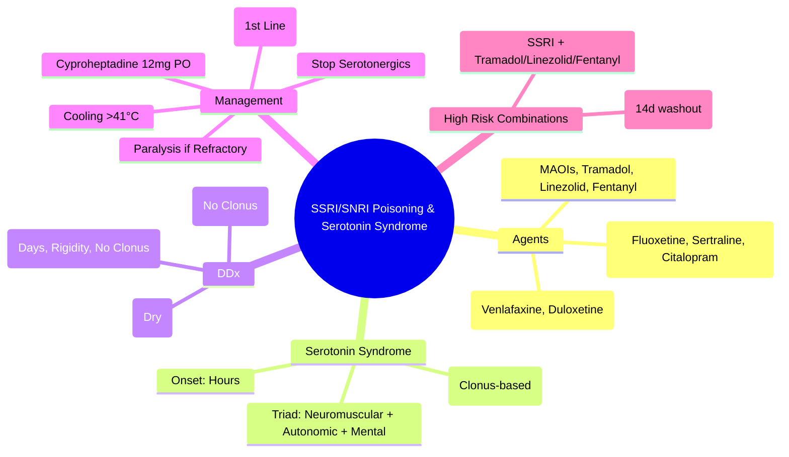
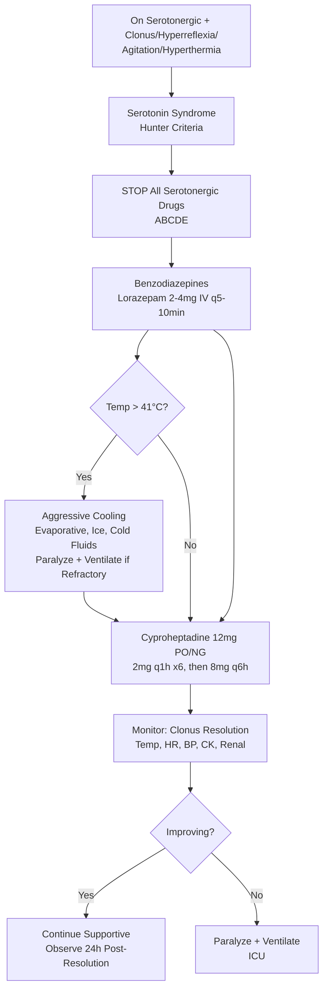

Related: [[General Principles of Poisoning Management]], [[Tricyclic Antidepressant (TCA) Poisoning]], [[Antidotes Overview]], [[Sympathomimetic Toxidrome]], [[Antipsychotic Poisoning (Neuroleptic Malignant Syndrome)]]

> [!tip]
> **Serotonin Syndrome = medical emergency**. **Hunter Criteria** for diagnosis. **Cyproheptadine** = specific antidote. **SSRIs/SNRIs alone rarely fatal** — wide therapeutic index. Danger = **combination with MAOIs, tramadol, linezolid, fentanyl, dextromethorphan, St John's Wort**. Key FCPS/MRCP: CLONUS (spontaneous/inducible/ocular) = hallmark; differentiate from NMS (rigidity vs hyperreflexia, onset hours vs days); avoid serotonergic drugs.

## 1. Learning Objectives
- Recognize serotonin syndrome using Hunter Criteria
- Differentiate from NMS, sympathomimetic, anticholinergic toxidromes
- Apply cyproheptadine dosing
- Identify high-risk drug combinations
- Manage SSRI/SNRI overdose (usually supportive)

## 2. Definition
SSRI/SNRI poisoning = toxicity from selective serotonin reuptake inhibitors (fluoxetine, sertraline, citalopram, escitalopram, paroxetine) or serotonin-norepinephrine reuptake inhibitors (venlafaxine, duloxetine, desvenlafaxine) causing serotonin excess. **Serotonin syndrome** = life-threatening condition from excessive serotonergic activity in CNS and periphery.

## 3. Core Physiology
- **Mechanism**: SRI → ↑ synaptic serotonin → overstimulation of 5-HT₁ₐ and 5-HT₂ₐ receptors
- **Serotonin syndrome**: triad of **neuromuscular hyperactivity**, **autonomic instability**, **altered mental status**
- **Agents**: SSRIs, SNRIs, **MAOIs** (irreversible > reversible), **tramadol**, **linezolid**, **fentanyl**, **dextromethorphan**, **meperidine**, **ondansetron**, **metoclopramide**, **St John's Wort**, **L-tryptophan**, **lithium**, **buspirone**, **triptans**
- **Risk**: combinations (SSRI + MAOI = fatal; SSRI + tramadol/linezolid = common)

## 4. Clinical Features

### Serotonin Syndrome (Hunter Criteria)
**Diagnostic**: Patient taking serotonergic agent + **ANY ONE** of:
1. **Spontaneous clonus**
2. **Inducible clonus** + agitation OR diaphoresis
3. **Ocular clonus** + agitation OR diaphoresis
4. **Tremor** + hyperreflexia
5. **Hypertonia** + temperature > 38°C + ocular/inducible clonus

### Clinical Triad
| Domain | Features |
|--------|----------|
| **Neuromuscular** | **Clonus** (spontaneous, inducible, ocular), hyperreflexia, tremor, hypertonia, myoclonus, **rigidity** (severe) |
| **Autonomic** | Tachycardia, hypertension, hyperthermia (often > 40°C), diaphoresis, mydriasis, diarrhea, tachypnea |
| **Mental** | Agitation, confusion, delirium, coma |

### SSRI/SNRI Overdose Alone (No Syndrome)
- **GI**: nausea, vomiting, diarrhea
- **CNS**: drowsiness, tremor, dizziness
- **CV**: sinus tachycardia, QT prolongation (citalopram/escitalopram > 40mg/20mg)
- **Seizures**: rare (more with citalopram, venlafaxine)
- **Hyponatremia**: SIADH (elderly, chronic use)

## 5. Differential Diagnosis
| Feature | Serotonin Syndrome | NMS | Sympathomimetic | Anticholinergic |
|---------|-------------------|-----|-----------------|----------------|
| **Onset** | **Hours** (rapid) | **Days** (gradual) | Minutes-hours | Minutes-hours |
| **Clonus** | **YES (Hallmark)** | No | No | No |
| **Hyperreflexia** | **YES** | Normal/↑ | Yes | Normal |
| **Rigidity** | Variable | **Lead-pipe** | No | No |
| **Diaphoresis** | Yes | Yes | Yes | **NO (dry)** |
| **Fever** | Yes | Yes | Yes | Yes |
| **Medication** | Serotonergic | Dopamine blocker/withdrawal | Stimulants | Anticholinergics |

## 6. Investigations
- **Clinical diagnosis** (Hunter Criteria) — **no confirmatory test**
- **Serum serotonin** — not useful
- **ABG/VBG**: metabolic acidosis, hypoxia
- **CK**: rhabdomyolysis (severe cases)
- **Renal function**: AKI (rhabdo, hyperthermia)
- **Electrolytes**: Na⁺ (hyponatremia), K⁺, Ca²⁺
- **ECG**: QT prolongation (citalopram/escitalopram), tachycardia
- **Paracetamol level** (always)

## 7. Management

### 1. Immediate: Stop All Serotonergic Drugs
- **Discontinue** offending agents immediately

### 2. Supportive Care (Mainstay)
- **ABCDE**: airway protection if GCS < 8, seizures
- **Hyperthermia > 41°C**: **aggressive cooling** (evaporative, ice packs, cold IV fluids, paralysis + ventilation if refractory) — **NOT dantrolene** (no role)
- **Benzodiazepines**: **lorazepam 2-4 mg IV** q5-10 min for agitation, hyperreflexia, clonus — **first-line**
- **IV fluids**: hydration, rhabdo prevention
- **Cardiovascular**: treat tachycardia/HTN with short-acting agents (esmolol, nicardipine)

### 3. Specific Antidote: Cyproheptadine
- **Mechanism**: 5-HT₂ₐ antagonist
- **Dose**: **12 mg PO/NG initially** (2 mg q1h × 6 doses), then **8 mg q6h PRN**
- **Alternative**: **4 mg IV** (not widely available) — **chlorpromazine** (IM/IV) alternative but causes hypotension
- **Onset**: 1-2h PO
- **Monitor**: resolution of clonus, hyperreflexia, hyperthermia

### 4. Severe/Refractory Cases
- **Paralysis + ventilation**: vecuronium + propofol/midazolam (stops muscular heat production)
- **Avoid**: dantrolene (no evidence), propranolol (5-HT₁ₐ agonist → may worsen), bromocriptine (dopamine agonist → worsens NMS confusion)

### 5. Decontamination
- **Activated charcoal**: 1 g/kg if < 1-2h (delayed absorption with some SSRIs)
- **WBI**: extended-release (venlafaxine XR, fluoxetine weekly)

## 8. Complications
- Rhabdomyolysis → AKI
- DIC (severe hyperthermia)
- Seizures
- Multi-organ failure
- Death (if untreated)

## 9. Prognosis
- **Excellent with early recognition** — resolves 24-72h after stopping drugs
- Mortality < 5% with aggressive cooling + benzos + cyproheptadine
- **Fatal if missed** (hyperthermia, rhabdo, DIC)

## 10. FCPS/MRCP High-Yield Points
1. **Hunter Criteria** = diagnostic standard (clonus-based)
2. **Clonus** (spontaneous/inducible/ocular) = **HALLMARK** vs NMS
3. **Onset**: hours (serotonin) vs days (NMS)
4. **Cyproheptadine 12 mg PO** = antidote (2mg q1h × 6, then 8mg q6h)
5. **Benzodiazepines first-line** for agitation/clonus
6. **Aggressive cooling** for hyperthermia > 41°C
7. **NO dantrolene** (NMS drug, no role in serotonin syndrome)
8. **High-risk combos**: SSRI + MAOI (14d washout), SSRI + tramadol/linezolid/fentanyl
9. **Citalopram/escitalopram**: QT prolongation → ECG monitoring
10. **Venlafaxine**: seizure risk, SNRI → more cardiac toxicity

## 11. Common Viva Questions
1. Hunter Criteria for serotonin syndrome
2. Differentiate serotonin syndrome from NMS
3. Cyproheptadine dose and route
4. High-risk drug combinations
5. Why no dantrolene?
7. Citalopram QT risk
8. Management of hyperthermia

## 12. Common Confusions / Exam Traps
- **Serotonin syndrome = NMS** → NO, clonus vs rigidity, onset hours vs days
- **Dantrolene for serotonin syndrome** → NO role
- **Propranolol for tachycardia** → may worsen (5-HT₁ₐ agonist)
- **Bromocriptine** → worsens (dopamine agonist)
- **Cyproheptadine IV** → not widely available, use PO/NG
- **MAOI + SSRI** → 14d washout (irreversible MAOI)
- **Mirtazepine** = serotonergic (α₂ antagonist → ↑ serotonin)

## 13. Mnemonics
- **HUNTER**: **H**yperreflexia, **U** (clonus), **N**euromuscular, **T**remor, **E** (temp), **R**igidity
- **SEROTONIN TRIAD**: **N**euromuscular (clonus), **A**utonomic (tachy, hyperthermia), **M**ental (agitation)
- **CYPROHEPTADINE**: **1**2mg **P**O → **2**mg q1h ×6 → **8**mg q6h
- **NO DANTROLENE** in serotonin syndrome

## 14. Mind Map

## 15. Flowchart

## 16. Suggested Visuals / Image Notes
- Hunter Criteria flowchart
- Serotonin vs NMS comparison table
- Cyproheptadine dosing card

## 17. Suggested Video References
- Serotonin syndrome recognition (EM:RAP, Toxicology)
- Hunter Criteria demonstration

## 18. One-Page Revision Summary
- **Hunter Criteria**: clonus-based (spontaneous/inducible/ocular + agitation/diaphoresis)
- **Triad**: neuromuscular (clonus, hyperreflexia), autonomic (tachy, HTN, hyperthermia, diaphoresis), mental (agitation)
- **Onset**: HOURS (vs NMS days)
- **Cyproheptadine**: 12mg PO → 2mg q1h ×6 → 8mg q6h
- **Benzos 1st line** (lorazepam)
- **Cooling > 41°C** (NOT dantrolene)
- **High-risk combos**: SSRI+MAOI (14d), SSRI+tramadol/linezolid/fentanyl
- **Citalopram**: QT prolongation

## 24-Hour Recall Prompts
- Recite Hunter Criteria (5 criteria)
- State cyproheptadine dosing
- List 3 key differences from NMS
- Name high-risk combinations

## 7-Day / 15-Day / 30-Day Revision Tracker
- [ ] Day 1 completed
- [ ] 24-hour recall completed
- [ ] Day 7 revision completed
- [ ] Day 15 revision completed
- [ ] Day 30 revision completed

## 19. Must Know / Should Know / Nice to Know
### Must Know
- Hunter Criteria (clonus-based)
- Clonus = hallmark (vs NMS rigidity)
- Onset hours vs days
- Cyproheptadine 12mg PO protocol
- Benzos first-line
- Cooling > 41°C, NO dantrolene
- SSRI+MAOI 14d washout

### Should Know
- Cyproheptadine 2mg q1h ×6 then 8mg q6h
- Chlorpromazine alternative (hypotension risk)
- Venlafaxine seizure/cardiac risk
- Citalopram QT > 40mg
- Paralysis for refractory cases

### Nice to Know
- Mirtazapine serotonergic
- Buspirone, triptans, ondansetron serotonergic
- Serotonin syndrome incidence

## 20. Self-Test Scorecard
- Understanding: /10
- Recall: /10
- MCQ Performance: /10
- SBA Performance: /10
- Viva Confidence: /10
- Total: /50

> [!tip]
> Interpretation: <35 = weak topic, 35-44 = acceptable but insecure, 45+ = strong exam-ready topic.

## 21. Exam Answer Modes
### Long Answer Skeleton
- Definition + pathophysiology (5-HT excess)
- Hunter Criteria (detail all 5)
- Clinical triad
- DDx table (Serotonin vs NMS vs Sympathomimetic vs Anticholinergic)
- Management: stop drugs → benzos → cyproheptadine → cooling → paralysis
- High-risk combinations
- Prognosis

### Short Note Skeleton
- Hunter Criteria box
- Serotonin vs NMS table
- Cyproheptadine protocol
- High-risk combos list

### Viva One-Liners
- "Serotonin syndrome: Hunter Criteria = clonus-based"
- "Clonus = serotonin; Rigidity = NMS"
- "Onset: serotonin = hours, NMS = days"
- "Cyproheptadine: 12mg PO, 2mg q1h×6, 8mg q6h"
- "Benzos 1st line for agitation/clonus"
- "NO dantrolene in serotonin syndrome"
- "SSRI+MAOI = 14d washout"
- "Citalopram > 40mg = QT prolongation"
- "Aggressive cooling > 41°C"

### Ward-Case Discussion Points
- Patient on sertraline started linezolid → confusion, clonus, hyperthermia → serotonin syndrome
- Citalopram overdose → check ECG for QT
- MAOI + SSRI → hypertensive crisis + serotonin syndrome

### Last-Night-Before-Exam Sheet
- Hunter: Clonus (spont/induc/ocul) + agitation/diaph
- Clonus=Serotonin, Rigidity=NMS
- Onset: Hrs vs Days
- Cypro: 12mg PO → 2mg q1h×6 → 8mg q6h
- Benzos 1st line
- Cooling >41°C, NO Dantrolene
- SSRI+MAOI 14d

## 22. Summary
Serotonin syndrome = 5-HT excess → Hunter Criteria (clonus-based). Triad: neuromuscular (clonus, hyperreflexia), autonomic (tachy, HTN, hyperthermia, diaphoresis), mental (agitation). **Cyproheptadine 12mg PO** (2mg q1h×6 → 8mg q6h). **Benzos 1st line**. **Aggressive cooling > 41°C (NO dantrolene)**. Onset hours vs NMS days. High-risk: SSRI+MAOI (14d), SSRI+tramadol/linezolid/fentanyl. Citalopram QT prolongation.

## 23. MCQs (10)
1. Question 1
   A. Option A
   B. Option B
   C. Option C
   D. Option D
   **Answer: A**
   *Explanation: Explanation 1*

2. Question 2
   A. Option A
   B. Option B
   C. Option C
   D. Option D
   **Answer: B**
   *Explanation: Explanation 2*

3. Question 3
   A. Option A
   B. Option B
   C. Option C
   D. Option D
   **Answer: C**
   *Explanation: Explanation 3*

4. Question 4
   A. Option A
   B. Option B
   C. Option C
   D. Option D
   **Answer: D**
   *Explanation: Explanation 4*

5. Question 5
   A. Option A
   B. Option B
   C. Option C
   D. Option D
   **Answer: A**
   *Explanation: Explanation 5*

6. Question 6
   A. Option A
   B. Option B
   C. Option C
   D. Option D
   **Answer: B**
   *Explanation: Explanation 6*

7. Question 7
   A. Option A
   B. Option B
   C. Option C
   D. Option D
   **Answer: C**
   *Explanation: Explanation 7*

8. Question 8
   A. Option A
   B. Option B
   C. Option C
   D. Option D
   **Answer: D**
   *Explanation: Explanation 8*

9. Question 9
   A. Option A
   B. Option B
   C. Option C
   D. Option D
   **Answer: A**
   *Explanation: Explanation 9*

10. Question 10
   A. Option A
   B. Option B
   C. Option C
   D. Option D
   **Answer: B**
   *Explanation: Explanation 10*

## 24. SBA Questions (10)
1. Scenario 1
   A. Option A
   B. Option B
   C. Option C
   D. Option D
   **Answer: A**
   *Explanation: Explanation 1*

2. Scenario 2
   A. Option A
   B. Option B
   C. Option C
   D. Option D
   **Answer: B**
   *Explanation: Explanation 2*

3. Scenario 3
   A. Option A
   B. Option B
   C. Option C
   D. Option D
   **Answer: C**
   *Explanation: Explanation 3*

4. Scenario 4
   A. Option A
   B. Option B
   C. Option C
   D. Option D
   **Answer: D**
   *Explanation: Explanation 4*

5. Scenario 5
   A. Option A
   B. Option B
   C. Option C
   D. Option D
   **Answer: A**
   *Explanation: Explanation 5*

6. Scenario 6
   A. Option A
   B. Option B
   C. Option C
   D. Option D
   **Answer: B**
   *Explanation: Explanation 6*

7. Scenario 7
   A. Option A
   B. Option B
   C. Option C
   D. Option D
   **Answer: C**
   *Explanation: Explanation 7*

8. Scenario 8
   A. Option A
   B. Option B
   C. Option C
   D. Option D
   **Answer: D**
   *Explanation: Explanation 8*

9. Scenario 9
   A. Option A
   B. Option B
   C. Option C
   D. Option D
   **Answer: A**
   *Explanation: Explanation 9*

10. Scenario 10
   A. Option A
   B. Option B
   C. Option C
   D. Option D
   **Answer: B**
   *Explanation: Explanation 10*

## 25. Flashcards
- Q: Flashcard 1 question
  A: Flashcard 1 answer
- Q: Flashcard 2 question
  A: Flashcard 2 answer
- Q: Flashcard 3 question
  A: Flashcard 3 answer
- Q: Flashcard 4 question
  A: Flashcard 4 answer
- Q: Flashcard 5 question
  A: Flashcard 5 answer
- Q: Flashcard 6 question
  A: Flashcard 6 answer
- Q: Flashcard 7 question
  A: Flashcard 7 answer
- Q: Flashcard 8 question
  A: Flashcard 8 answer
- Q: Flashcard 9 question
  A: Flashcard 9 answer
- Q: Flashcard 10 question
  A: Flashcard 10 answer
- Q: Flashcard 11 question
  A: Flashcard 11 answer
- Q: Flashcard 12 question
  A: Flashcard 12 answer
- Q: Flashcard 13 question
  A: Flashcard 13 answer
- Q: Flashcard 14 question
  A: Flashcard 14 answer
- Q: Flashcard 15 question
  A: Flashcard 15 answer

## 26. Answer Key with Explanations
### MCQs
1. **A** - Explanation 1
2. **B** - Explanation 2
3. **C** - Explanation 3
4. **D** - Explanation 4
5. **A** - Explanation 5
6. **B** - Explanation 6
7. **C** - Explanation 7
8. **D** - Explanation 8
9. **A** - Explanation 9
10. **B** - Explanation 10

### SBAs
1. **A** - Explanation 1
2. **B** - Explanation 2
3. **C** - Explanation 3
4. **D** - Explanation 4
5. **A** - Explanation 5
6. **B** - Explanation 6
7. **C** - Explanation 7
8. **D** - Explanation 8
9. **A** - Explanation 9
10. **B** - Explanation 10