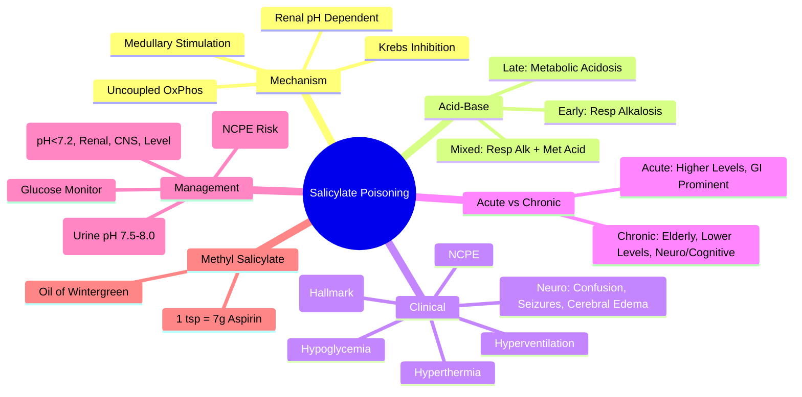
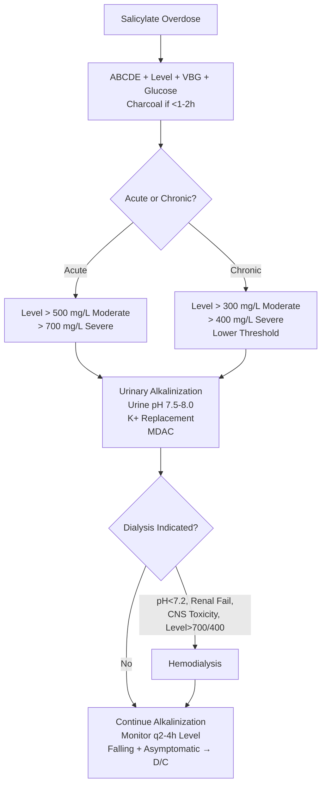

Related: [[General Principles of Poisoning Management]], [[Antidotes Overview]], [[Enhanced Elimination (Dialysis, Hemoperfusion)]], [[Methanol Poisoning]], [[Ethylene Glycol Poisoning]], [[Paracetamol (Acetaminophen) Poisoning]]

> [!tip]
> **Classic acid-base**: respiratory alkalosis (direct medullary stimulation) + metabolic acidosis (uncoupled oxidative phosphorylation). **Urinary alkalinization** enhances renal excretion. **Dialysis** for severe: pH < 7.2, renal failure, altered mental status, level > 700 mg/L (acute) or > 400 (chronic). Key FCPS/MRCP: Done nomogram limited utility; alkalinization target urine pH 7.5-8.0; dialysis criteria; monitor for non-cardiogenic pulmonary edema (early sign of CNS toxicity).

## 1. Learning Objectives
- Recognize salicylate toxidrome (tinnitus, hyperventilation, metabolic acidosis, neurotoxicity)
- Interpret acid-base status (respiratory alkalosis + metabolic acidosis)
- Apply urinary alkalinization protocol (target urine pH 7.5-8.0)
- Identify dialysis indications
- Differentiate acute vs chronic toxicity
- Manage complications (pulmonary edema, cerebral edema, hypoglycemia)

## 2. Definition
Salicylate poisoning = toxicity from acetylsalicylic acid (aspirin) or methyl salicylate (oil of wintergreen — **highly concentrated, 1 tsp = ~7g aspirin**) causing uncoupled oxidative phosphorylation, direct medullary stimulation, and multi-organ dysfunction.

## 3. Core Physiology
- **Mechanism**:
  1. **Uncouples oxidative phosphorylation** → ↑ O₂ consumption, ↑ CO₂/heat production, ↑ anaerobic metabolism → **lactic acidosis**, hyperthermia
  2. **Direct medullary respiratory center stimulation** → **hyperventilation → respiratory alkalosis** (early)
  3. **Inhibits Krebs cycle** → ketoacidosis, lactate ↑
  4. **Renal**: competes with uric acid (↓ excretion), causes metabolic acidosis → ↓ renal salicylate excretion (ion trapping)
  5. **CNS**: neurotoxicity (cerebral edema, seizures, coma) — **poorly correlated with serum level**
- **Pharmacokinetics**: saturable metabolism (zero-order at high dose) → half-life increases from 2-3h (therapeutic) to 15-30h (toxic). Volume of distribution ↑ in acidosis (more non-ionized crosses BBB).

## 4. Clinical Features

### Early (Respiratory Alkalosis Phase)
- **Tinnitus** (hallmark, often first symptom), hearing loss
- **Hyperventilation** (deep, rapid — Kussmaul-like), respiratory alkalosis
- Nausea, vomiting, diaphoresis, lethargy

### Progressive (Mixed/Metabolic Acidosis Phase)
- **Metabolic acidosis** develops (lactic, keto) → mixed then pure metabolic acidosis
- **Neurotoxicity**: confusion, agitation, lethargy, seizures, coma, **cerebral edema**
- **Non-cardiogenic pulmonary edema** (NCPE) — early sign of CNS toxicity, worsened by overhydration
- Hyperthermia (uncoupled oxidative phosphorylation)
- Hypoglycemia (impaired gluconeogenesis) / hyperglycemia
- Dehydration (vomiting, diaphoresis, hyperventilation)
- **Renal**: oliguria, AKI

### Chronic Toxicity (Elderly, Therapeutic Misadventure)
- **Insidious**: confusion, falls, non-specific deterioration
- **Lower serum levels** cause severe toxicity (reduced clearance, acidosis, dehydration, renal impairment)
- **Often missed** — check salicylate level in unexplained confusion/acidosis in elderly

## 5. Differential Diagnosis
- **Diabetic ketoacidosis**: hyperglycemia, ketonuria, no tinnitus, no respiratory alkalosis early
- **Methanol/Ethylene glycol**: osmolal gap, specific metabolites, no tinnitus
- **Sepsis**: fever, lactate, but no tinnitus/hyperventilation
- **Other toxic alcohols/poisonings**: MUDPILES
- **Cerebral edema/structural**: focal signs

## 6. Investigations

### Mandatory
1. **Salicylate level** — peak ~2-4h post-ingestion (delayed by food, bezoar, pylorospasm). **Repeat q2-4h until falling**.
2. **VBG/ABG** — pH, pCO₂, HCO₃⁻, lactate, glucose. **Acid-base pattern diagnostic**.
3. **Electrolytes** — Na⁺, K⁺ (depleted), Cl⁻, glucose
4. **Renal function** — urea, creatinine
5. **Coagulation** — INR (platelet dysfunction)
6. **LFTs** — transaminitis possible
7. **Paracetamol level** (always)
8. **ECG** — QTc prolongation
9. **CXR** — pulmonary edema
10. **Glucose** (bedside) — hypoglycemia in children

### Acid-Base Patterns
| Stage | pH | pCO₂ | HCO₃⁻ | Description |
|-------|-----|------|-------|-------------|
| Early | ↑ (alkalemia) | ↓↓ | Normal/↓ | **Primary respiratory alkalosis** (medullary stimulation) |
| Mixed | Normal/↓ | ↓/Normal | ↓ | **Respiratory alkalosis + metabolic acidosis** |
| Late | ↓↓ (acidemia) | Normal/↑ | ↓↓ | **Primary metabolic acidosis** (respiratory fatigue/failure) |

### Done Nomogram
- **Limited utility** — salicylate kinetics complex (saturable metabolism, variable Vd, pH-dependent excretion). **Do not rely solely on nomogram**. Use clinically + level trends.

## 7. Management

### 1. Resuscitation (ABCDE)
- **Airway**: protect if GCS < 8, seizures — intubate **CAREFULLY** (avoid hypoventilation → worsening acidosis). **Post-intubation: match pre-intubation minute ventilation** (high RR, low TV) to maintain respiratory alkalosis.
- **Breathing**: high-flow O₂. **Do NOT suppress respiratory drive** (needed for CO₂ blow-off).
- **Circulation**: IV fluids for dehydration — **restrictive** if NCPE risk. Vasopressors if needed.

### 2. Decontamination
- **Activated charcoal**: 1 g/kg if < 1-2h (delayed absorption: bezoars, pylorospasm, enteric-coated). **Multiple-dose activated charcoal (MDAC)** may enhance elimination (1 g/kg q4h).

### 3. Urinary Alkalinization — **KEY SPECIFIC THERAPY**
- **Mechanism**: salicylate is weak acid (pKa 3.0). **Alkaline urine → ionized → trapped in urine → ↑ renal excretion 10-20x**.
- **Target**: **urine pH 7.5-8.0** (check q1-2h with dipstick).
- **Protocol**:
  - **NaHCO₃ 1-2 mmol/kg IV bolus** (typically 100-150 mEq in 1L D5W)
  - **Infusion**: 150 mEq NaHCO₃ in 1L D5W at 150-250 mL/hr (adjust to maintain urine pH)
  - **Add KCl 20-40 mEq/L** (hypokalemia impairs alkalinization — K⁺ shifts into cells)
  - **Furosemide 0.5-1 mg/kg** if oliguric (maintain urine output > 2 mL/kg/hr)
- **Monitor**: urine pH (q1-2h), serum pH, pCO₂, K⁺, Na⁺, glucose, fluid balance
- **Contraindications**: severe pulmonary edema, heart failure, renal failure (anuric), severe metabolic alkalemia

### 4. Hemodialysis — **Indications (Any One)**
- **Severe metabolic acidosis**: **pH < 7.20** (arterial) despite alkalinization
- **Renal failure** (oliguric/anuric, AKI)
- **Altered mental status** (confusion, seizures, coma) — **CNS toxicity**
- **Serum salicylate**:
  - **Acute**: **> 700 mg/L (70 mg/dL)** (5.1 mmol/L)
  - **Chronic**: **> 400 mg/L (40 mg/dL)** (2.9 mmol/L)
- **Non-cardiogenic pulmonary edema** (refractory)
- **Severe hyperthermia** (> 40°C)
- **Refractory electrolyte disturbances**

### 5. Supportive Care
- **Hypoglycemia**: dextrose infusion (D10% at maintenance) — **monitor q1-2h**
- **Hypokalemia**: replace aggressively (K⁺ shifts out of cells with acidosis correction)
- **Hyperthermia**: active cooling (evaporative, cold fluids) — antipyretics **ineffective** (salicylate IS antipyretic)
- **Seizures**: benzodiazepines (lorazepam/diazepam) — **avoid phenytoin** (protein binding displacement, Na channel)
- **Cerebral edema**: head up 30°, hypertonic saline/mannitol, avoid hypoxia/hypercapnia
- **GI protection**: PPI/H2 blocker (gastric irritation)

### 6. Discharge
- **Asymptomatic**, normal acid-base, **falling salicylate level** (< 200 mg/L), normal renal function, **psych assessment** (if DSH)

## 8. Complications
- Cerebral edema (major cause of death)
- Non-cardiogenic pulmonary edema
- Acute kidney injury
- ARDS
- GI bleeding (platelet dysfunction)
- Seizures
- Hypoglycemia
- Coagulopathy

## 9. Prognosis
- **Acute**: good with early alkalinization/dialysis; mortality ~1-2% with dialysis, higher without
- **Chronic**: higher mortality (15-25%) — delayed recognition, comorbidities, lower threshold for CNS toxicity
- **Cerebral edema/pulmonary edema** = poor prognostic signs

## 10. FCPS/MRCP High-Yield Points
1. **Classic acid-base**: respiratory alkalosis + metabolic acidosis (MUDPILES member)
2. **Tinnitus** = hallmark early symptom
3. **Urinary alkalinization**: target urine pH 7.5-8.0, replace K⁺, monitor urine pH q1-2h
4. **Dialysis criteria**: pH < 7.2, renal failure, CNS toxicity, level > 700 (acute) / > 400 (chronic)
5. **Intubation danger**: must maintain high minute ventilation → match pre-intubation RR/TV
6. **Chronic toxicity in elderly**: lower levels, severe presentation, often missed
7. **Methyl salicylate (oil of wintergreen)**: 1 tsp = ~7g aspirin — **highly toxic, small volume**
8. **Done nomogram** — limited use, don't rely on it
9. **NCPE** = early CNS toxicity, fluid restrict
10. **No antipyretics** for hyperthermia (salicylate is antipyretic)
11. **Hypoglycemia** — monitor glucose, dextrose infusion

## 11. Common Viva Questions
1. Acid-base disturbances in salicylate poisoning (timeline)
2. Urinary alkalinization protocol (target pH, K⁺ replacement, monitoring)
3. Dialysis indications
4. Acute vs chronic toxicity differences
5. Intubation considerations (maintain minute ventilation)
6. Methyl salicylate toxicity
7. Done nomogram limitations
8. Cerebral edema management

## 12. Common Confusions / Exam Traps
- **Respiratory alkalosis only** = early; **metabolic acidosis only** = late/respiratory failure
- **Urine pH target 7.5-8.0** — not serum pH
- **Hypokalemia prevents alkalinization** — must replace K⁺
- **Don't suppress respiratory drive** — it's the only compensation
- **Intubation → match minute ventilation** or acidosis worsens rapidly
- **Chronic toxicity** at lower levels (elderly) — check level in unexplained acidosis
- **Done nomogram not reliable** — use clinical picture + trends
- **Oil of wintergreen** — tiny volume, massive dose

## 13. Mnemonics
- **SALICYLATE**: **S**alicylate = **A**cid-base mixed, **L**actic acidosis, **I**on trapping (urine alk), **C**erebral edema, **Y** (why tinnitus?), **L**evel >700 dialyze, **A**lkalization urine, **T**innitus, **E**lderly chronic worse
- **DIALYSIS CRITERIA**: **pH < 7.2**, **R**enal failure, **C**NS toxicity, **L**evel >700/400
- **URINE ALKALINIZATION**: **U**rine pH **7.5-8.0**, **K**⁺ replace, **O**utput >2 mL/kg/hr, **M**onitor q1-2h

## 14. Mind Map

## 15. Flowchart

## 16. Suggested Visuals / Image Notes
- Acid-base timeline diagram
- Urinary alkalinization protocol flowchart
- Dialysis criteria table

## 17. Suggested Video References
- Salicylate poisoning management (Toxbase, EM:RAP)
- Urinary alkalinization practical guide

## 18. One-Page Revision Summary
- **Mechanism**: uncoupled OxPhos + medullary stimulation + Krebs inhibition
- **Acid-base**: resp alkalosis → mixed → metabolic acidosis
- **Tinnitus** = hallmark
- **Urine alkalinization**: target pH 7.5-8.0, replace K⁺, monitor q1-2h
- **Dialysis**: pH < 7.2, renal failure, CNS toxicity, level > 700 (acute) / > 400 (chronic)
- **Intubation**: match minute ventilation
- **Chronic (elderly)**: lower levels, more severe, often missed
- **Oil of wintergreen**: 1 tsp = 7g aspirin
- **NCPE** = fluid restrict, early CNS sign
- **No antipyretics** for fever

## 24-Hour Recall Prompts
- Draw acid-base timeline for salicylate poisoning
- Recite urinary alkalinization protocol (target, K⁺, monitoring)
- List 5 dialysis indications
- Contrast acute vs chronic toxicity

## 7-Day / 15-Day / 30-Day Revision Tracker
- [ ] Day 1 completed
- [ ] 24-hour recall completed
- [ ] Day 7 revision completed
- [ ] Day 15 revision completed
- [ ] Day 30 revision completed

## 19. Must Know / Should Know / Nice to Know
### Must Know
- Acid-base pattern (resp alkalosis + metabolic acidosis)
- Tinnitus hallmark
- Urinary alkalinization (urine pH 7.5-8.0, K⁺ replacement)
- Dialysis criteria (pH<7.2, renal, CNS, level thresholds)
- Intubation danger (match minute ventilation)
- Chronic toxicity in elderly at lower levels
- Methyl salicylate high potency

### Should Know
- Done nomogram limitations
- NCPE management
- Hypoglycemia monitoring
- Cerebral edema management

### Nice to Know
- Protein binding displacement interactions
- Specific salicylate formulations (enteric-coated delayed peak)
- Pediatric differences (higher metabolic rate, earlier metabolic acidosis)

## 20. Self-Test Scorecard
- Understanding: /10
- Recall: /10
- MCQ Performance: /10
- SBA Performance: /10
- Viva Confidence: /10
- Total: /50

> [!tip]
> Interpretation: <35 = weak topic, 35-44 = acceptable but insecure, 45+ = strong exam-ready topic.

## 21. Exam Answer Modes
### Long Answer Skeleton
- Mechanism (uncoupling, medullary, Krebs)
- Acid-base timeline
- Clinical features (acute vs chronic)
- Investigations (level, VBG, glucose, paracetamol)
- Management: alkalinization (protocol), dialysis (criteria), supportive
- Intubation caveat
- Complications/prognosis

### Short Note Skeleton
- Acid-base diagram
- Alkalinization protocol box
- Dialysis criteria list
- Acute vs chronic table

### Viva One-Liners
- "Salicylate: respiratory alkalosis + metabolic acidosis = mixed picture"
- "Tinnitus = hallmark early symptom"
- "Urine alkalinization: target urine pH 7.5-8.0, replace K⁺, monitor q1-2h"
- "Dialysis: pH<7.2, renal failure, CNS toxicity, level>700 acute/>400 chronic"
- "Intubate: match minute ventilation or acidosis worsens"
- "Chronic elderly: lower levels, severe neuro, check level in confusion"
- "Oil of wintergreen: 1 tsp = 7g aspirin"

### Ward-Case Discussion Points
- Elderly on "therapeutic" aspirin with confusion + acidosis → check salicylate level
- Intubated salicylate patient → ventilator settings critical
- NCPE developing → fluid restrict, consider dialysis

### Last-Night-Before-Exam Sheet
- Acid-base: Resp Alk → Mixed → Met Acid
- Tinnitus = hallmark
- Urine pH 7.5-8.0, K+ replace
- Dialysis: pH<7.2, Renal, CNS, Level>700/400
- Intubate: match MV
- Chronic: elderly, lower levels
- Wintergreen: 1 tsp = 7g

## 22. Summary
Salicylate poisoning = uncoupled oxidative phosphorylation + medullary stimulation → classic mixed respiratory alkalosis + metabolic acidosis. Tinnitus hallmark. Urinary alkalinization (urine pH 7.5-8.0) enhances excretion 10-20x; requires K⁺ replacement. Dialysis for pH<7.2, renal failure, CNS toxicity, level>700(acute)/>400(chronic). Intubation must maintain minute ventilation. Chronic toxicity in elderly at lower levels. Methyl salicylate (oil of wintergreen) 1 tsp = 7g aspirin.

## 23. MCQs (10)
1. Classic acid-base disturbance in acute salicylate poisoning?
   A. Pure metabolic acidosis
   B. Pure respiratory alkalosis
   C. Respiratory alkalosis + metabolic acidosis (mixed)
   D. Respiratory acidosis + metabolic alkalosis
   **Answer: C**
   *Explanation: Early: respiratory alkalosis (direct medullary stimulation). Late: metabolic acidosis (lactic/ketoacidosis from uncoupled oxidative phosphorylation) + respiratory acidosis (fatigue). Mixed picture characteristic.*

2. Hallmark early symptom of salicylate poisoning?
   A. Seizures
   B. Tinnitus
   C. Pulmonary edema
   D. Coma
   **Answer: B**
   *Explanation: Tinnitus (often first symptom) and hearing loss are hallmark early features of salicylate toxicity.*

3. Target urine pH for urinary alkalinization in salicylate poisoning?
   A. 6.5-7.0
   B. 7.0-7.5
   C. 7.5-8.0
   D. 8.0-8.5
   **Answer: C**
   *Explanation: Target urine pH 7.5-8.0. Alkaline urine ionizes salicylate (weak acid, pKa 3.0) → trapped in urine → renal excretion increased 10-20x.*

4. What is the MOST critical electrolyte to replace during urinary alkalinization?
   A. Sodium
   B. Potassium
   C. Magnesium
   D. Phosphate
   **Answer: B**
   *Explanation: Hypokalemia prevents alkalinization (K⁺ shifts into cells in exchange for H⁺). Must replace K⁺ aggressively (20-40 mEq/L in infusion).*

5. Dialysis indication for ACUTE salicylate poisoning - serum level threshold?
   A. > 400 mg/L
   B. > 500 mg/L
   C. > 700 mg/L
   D. > 1000 mg/L
   **Answer: C**
   *Explanation: Acute: > 700 mg/L (70 mg/dL, 5.1 mmol/L). Chronic: > 400 mg/L (40 mg/dL, 2.9 mmol/L). Also dialyze for pH < 7.2, renal failure, CNS toxicity, pulmonary edema.*

6. Why is intubation dangerous in salicylate poisoning?
   A. Risk of aspiration
   B. Sedatives worsen respiratory depression
   C. Must match pre-intubation minute ventilation or acidosis worsens
   D. Laryngospasm risk
   **Answer: C**
   *Explanation: Patient's hyperventilation is compensating for metabolic acidosis. Intubation without matching minute ventilation → loss of respiratory alkalosis → rapid worsening of acidemia → cardiovascular collapse.*

7. Methyl salicylate (oil of wintergreen) toxicity - key fact?
   A. Less toxic than aspirin
   B. 1 teaspoon = ~7g aspirin equivalent
   C. Causes only GI symptoms
   D. No systemic absorption
   **Answer: B**
   *Explanation: Oil of wintergreen (methyl salicylate) is highly concentrated: 1 tsp (5mL) ≈ 7g aspirin. Small volume = massive dose. Rapid onset, high mortality.*

8. Salicylate level monitoring - when to repeat?
   A. Every 6 hours
   B. Every 2-4 hours until falling
   C. Every 12 hours
   D. Only once at presentation
   **Answer: B**
   *Explanation: Salicylate level peaks at 2-4h (delayed by food, bezoar, pylorospasm). Repeat q2-4h until clearly falling. Do not rely on Done nomogram alone.*

9. Chronic salicylate toxicity in elderly - characteristic?
   A. Higher serum levels than acute
   B. Lower serum levels cause severe toxicity
   C. No acid-base disturbance
   D. Always presents with tinnitus
   **Answer: B**
   *Explanation: Chronic toxicity (elderly, therapeutic misadventure): lower serum levels cause severe toxicity due to reduced clearance, acidosis, dehydration, renal impairment. Often missed - check level in unexplained confusion/acidosis in elderly.*

10. Which drug should be AVOIDED for fever in salicylate poisoning?
   A. Paracetamol
   B. Ibuprofen
   C. External cooling
   D. All antipyretics ineffective
   **Answer: D**
   *Explanation: Salicylate IS an antipyretic. Antipyretics are ineffective for hyperthermia from uncoupled oxidative phosphorylation. Use active cooling (evaporative, cold fluids).*

## 24. SBA Questions (10)
1. A 45-year-old man presents with confusion, tinnitus, and hyperventilation. VBG: pH 7.48, pCO₂ 28, HCO₃⁻ 22, lactate 4. Salicylate level 650 mg/L. What is the next best step?
   A. Observe only
   B. Start urinary alkalinization + consider dialysis
   C. Intubate immediately
   D. Give activated charcoal only
   **Answer: B**
   *Explanation: Mixed respiratory alkalosis + metabolic acidosis (pH 7.48 but low HCO₃⁻ for pCO₂, lactate ↑). Level 650 = severe. Start alkalinization (target urine pH 7.5-8.0, replace K⁺). Level > 700 = dialysis indication; at 650, prepare for dialysis if worsening.*

2. A 72-year-old woman on chronic aspirin for OA presents with confusion and falls for 3 days. ABG: pH 7.22, pCO₂ 35, HCO₃⁻ 14. Salicylate level 380 mg/L. Why is this severe?
   A. Level > 700 mg/L
   B. Chronic toxicity at lower levels with metabolic acidosis
   C. Requires immediate intubation
   D. Pure respiratory alkalosis
   **Answer: B**
   *Explanation: Chronic salicylate toxicity in elderly: lower levels (here 380 mg/L, below acute 700 threshold) cause severe toxicity due to reduced clearance, volume depletion, renal impairment, and acidosis increasing CNS penetration. Metabolic acidosis predominates.*

3. During urinary alkalinization for salicylate poisoning, the patient's urine pH remains 6.5 despite NaHCO₃ infusion. What is the most likely cause?
   A. Inadequate NaHCO₃ dose
   B. Hypokalemia
   C. Renal failure
   D. Wrong diagnosis
   **Answer: B**
   *Explanation: Hypokalemia impairs urinary alkalinization - K⁺ shifts into cells in exchange for H⁺, acidifying urine. Must replace K⁺ (20-40 mEq/L in infusion) to achieve urine pH 7.5-8.0.*

4. A patient with severe salicylate poisoning (pH 7.15, level 850 mg/L, confused) is being prepared for dialysis. Which ventilator strategy is correct if intubated?
   A. Low tidal volume, normal RR (lung protective)
   B. High RR, low tidal volume to match pre-intubation minute ventilation
   C. Permissive hypercapnia
   D. Sedate heavily to prevent ventilator dyssynchrony
   **Answer: B**
   *Explanation: Must maintain high minute ventilation to preserve respiratory alkalosis compensation. Match pre-intubation RR and tidal volume. Avoid permissive hypercapnia - will worsen acidemia dramatically.*

5. A 30-year-old ingests 10mL oil of wintergreen. What is the approximate aspirin equivalent dose?
   A. 1.4g
   B. 3.5g
   C. 7g
   D. 14g
   **Answer: D**
   *Explanation: 1 tsp (5mL) methyl salicylate = ~7g aspirin. 10mL = 2 tsp = ~14g aspirin equivalent. Extremely toxic, small volume, rapid absorption.*

6. Salicylate level 550 mg/L at 4h post-ingestion. Patient asymptomatic, normal ABG. Using Done nomogram, this plots in the 'moderate' zone. Management?
   A. Done nomogram reliable - observe only
   B. Done nomogram limited utility - start alkalinization, monitor level trends
   C. Dialysis indicated
   D. No treatment needed
   **Answer: B**
   *Explanation: Done nomogram has limited utility - salicylate kinetics complex (saturable metabolism, variable Vd, pH-dependent excretion). Use clinically + level trends. Level 550 = moderate-severe, start alkalinization.*

7. Patient with salicylate poisoning develops non-cardiogenic pulmonary edema. Management?
   A. IV furosemide 40mg + fluid restriction
   B. CPAP/BiPAP → intubation + PEEP if severe
   C. Fluid bolus for hypotension
   D. Morphine for anxiety
   **Answer: B**
   *Explanation: NCPE in salicylate = permeability problem + hemodynamic changes. NOT fluid overload. Fluids worsen it. CPAP/BiPAP first, intubation with PEEP if severe. Avoid morphine (resp depression).*

8. Which acid-base pattern indicates LATE/SEVERE salicylate poisoning?
   A. pH 7.50, pCO₂ 25, HCO₃⁻ 20
   B. pH 7.40, pCO₂ 30, HCO₃⁻ 18
   C. pH 7.20, pCO₂ 45, HCO₃⁻ 16
   D. pH 7.48, pCO₂ 28, HCO₃⁻ 22
   **Answer: C**
   *Explanation: Late/severe: metabolic acidosis predominates with respiratory fatigue → pH low, pCO₂ rising/normal, HCO₃⁻ very low. pH 7.20, pCO₂ 45 (inappropriate for metabolic acidosis), HCO₃⁻ 16 = respiratory failure + severe metabolic acidosis.*

9. Salicylate poisoning with seizures. First-line anticonvulsant?
   A. Phenytoin
   B. Levetiracetam
   C. Lorazepam/diazepam
   D. Phenobarbital
   **Answer: C**
   *Explanation: Seizures in salicylate poisoning: benzodiazepines 1st line (lorazepam/diazepam). Avoid phenytoin (protein binding displacement, Na channel effects). Phenobarbital 2nd line.*

10. Chronic salicylate toxicity differential in elderly?
   A. DKA
   B. Sepsis
   C. Unexplained metabolic acidosis + confusion
   D. All of the above
   **Answer: D**
   *Explanation: Chronic salicylate toxicity in elderly mimics many conditions: sepsis, DKA, uremia, stroke. Key: check salicylate level in ANY elderly patient with unexplained metabolic acidosis, confusion, or non-specific deterioration.*

## 25. Flashcards
- Q: Classic salicylate acid-base triad?
  A: Early: Respiratory alkalosis. Mixed: Respiratory alkalosis + Metabolic acidosis. Late: Metabolic acidosis (respiratory fatigue).
- Q: Hallmark early symptom?
  A: Tinnitus (often first symptom). Hearing loss also common.
- Q: Urinary alkalinization target urine pH?
  A: 7.5-8.0. Check q1-2h with dipstick. Replace K⁺ aggressively (20-40 mEq/L in infusion).
- Q: Salicylate mechanism of toxicity?
  A: 1) Uncouples oxidative phosphorylation → lactic acidosis, hyperthermia. 2) Direct medullary stimulation → hyperventilation, resp alkalosis. 3) Inhibits Krebs cycle. 4) Renal: ion trapping (acid urine ↓ excretion). 5) CNS neurotoxicity.
- Q: Dialysis criteria - acute vs chronic?
  A: Acute: > 700 mg/L, pH < 7.2, renal failure, CNS toxicity, pulmonary edema. Chronic: > 400 mg/L (lower threshold).
- Q: Methyl salicylate (oil of wintergreen) potency?
  A: 1 tsp (5mL) = ~7g aspirin. Highly concentrated, small volume = massive dose. Rapid onset, high mortality.
- Q: Intubation in salicylate poisoning - critical principle?
  A: Match pre-intubation minute ventilation (high RR, low TV). Avoid permissive hypercapnia - will worsen acidemia catastrophically.
- Q: Hypokalemia during alkalinization?
  A: Prevents urine alkalinization (K⁺ shifts into cells in exchange for H⁺). Must replace K⁺ to achieve urine pH 7.5-8.0.
- Q: Done nomogram utility?
  A: Limited. Salicylate kinetics complex (saturable metabolism, variable Vd, pH-dependent excretion). Do not rely solely on nomogram.
- Q: Chronic salicylate toxicity in elderly?
  A: Lower serum levels cause severe toxicity. Often missed. Check level in unexplained confusion/acidosis in elderly on chronic aspirin.
- Q: NCPE management in salicylate?
  A: CPAP/BiPAP → intubation + PEEP. NOT fluid overload - avoid fluids/diuretics. Permeability problem.
- Q: Hyperthermia in salicylate - treatment?
  A: Active cooling (evaporative, cold fluids). Antipyretics INEFFECTIVE (salicylate IS antipyretic). Uncoupled OxPhos → heat production.
- Q: Seizures in salicylate - drug choice?
  A: Benzodiazepines 1st line (lorazepam/diazepam). Avoid phenytoin (protein binding displacement, Na channel). Phenobarbital 2nd line.
- Q: Salicylate level monitoring?
  A: Peaks 2-4h (delayed by food, bezoar, pylorospasm). Repeat q2-4h until clearly falling.
- Q: MUDPILES member - salicylate?
  A: Yes - S = Salicylate (anion gap metabolic acidosis). Also lactic acidosis (L) from uncoupled OxPhos.
## 26. Answer Key with Explanations
### MCQs
1. **C** - Early: respiratory alkalosis (direct medullary stimulation). Late: metabolic acidosis (lactic/ketoacidosis from uncoupled oxidative phosphorylation) + respiratory acidosis (fatigue). Mixed picture characteristic.
2. **B** - Tinnitus (often first symptom) and hearing loss are hallmark early features of salicylate toxicity.
3. **C** - Target urine pH 7.5-8.0. Alkaline urine ionizes salicylate (weak acid, pKa 3.0) → trapped in urine → renal excretion increased 10-20x.
4. **B** - Hypokalemia prevents alkalinization (K⁺ shifts into cells in exchange for H⁺). Must replace K⁺ aggressively (20-40 mEq/L in infusion).
5. **C** - Acute: > 700 mg/L (70 mg/dL, 5.1 mmol/L). Chronic: > 400 mg/L (40 mg/dL, 2.9 mmol/L). Also dialyze for pH < 7.2, renal failure, CNS toxicity, pulmonary edema.
6. **C** - Patient's hyperventilation is compensating for metabolic acidosis. Intubation without matching minute ventilation → loss of respiratory alkalosis → rapid worsening of acidemia → cardiovascular collapse.
7. **B** - Oil of wintergreen (methyl salicylate) is highly concentrated: 1 tsp (5mL) ≈ 7g aspirin. Small volume = massive dose. Rapid onset, high mortality.
8. **B** - Salicylate level peaks at 2-4h (delayed by food, bezoar, pylorospasm). Repeat q2-4h until clearly falling. Do not rely on Done nomogram alone.
9. **B** - Chronic toxicity (elderly, therapeutic misadventure): lower serum levels cause severe toxicity due to reduced clearance, acidosis, dehydration, renal impairment. Often missed - check level in unexplained confusion/acidosis in elderly.
10. **D** - Salicylate IS an antipyretic. Antipyretics are ineffective for hyperthermia from uncoupled oxidative phosphorylation. Use active cooling (evaporative, cold fluids).

### SBAs
1. **B** - Mixed respiratory alkalosis + metabolic acidosis (pH 7.48 but low HCO₃⁻ for pCO₂, lactate ↑). Level 650 = severe. Start alkalinization (target urine pH 7.5-8.0, replace K⁺). Level > 700 = dialysis indication; at 650, prepare for dialysis if worsening.
2. **B** - Chronic salicylate toxicity in elderly: lower levels (here 380 mg/L, below acute 700 threshold) cause severe toxicity due to reduced clearance, volume depletion, renal impairment, and acidosis increasing CNS penetration. Metabolic acidosis predominates.
3. **B** - Hypokalemia impairs urinary alkalinization - K⁺ shifts into cells in exchange for H⁺, acidifying urine. Must replace K⁺ (20-40 mEq/L in infusion) to achieve urine pH 7.5-8.0.
4. **B** - Must maintain high minute ventilation to preserve respiratory alkalosis compensation. Match pre-intubation RR and tidal volume. Avoid permissive hypercapnia - will worsen acidemia dramatically.
5. **D** - 1 tsp (5mL) methyl salicylate = ~7g aspirin. 10mL = 2 tsp = ~14g aspirin equivalent. Extremely toxic, small volume, rapid absorption.
6. **B** - Done nomogram has limited utility - salicylate kinetics complex (saturable metabolism, variable Vd, pH-dependent excretion). Use clinically + level trends. Level 550 = moderate-severe, start alkalinization.
7. **B** - NCPE in salicylate = permeability problem + hemodynamic changes. NOT fluid overload. Fluids worsen it. CPAP/BiPAP first, intubation with PEEP if severe. Avoid morphine (resp depression).
8. **C** - Late/severe: metabolic acidosis predominates with respiratory fatigue → pH low, pCO₂ rising/normal, HCO₃⁻ very low. pH 7.20, pCO₂ 45 (inappropriate for metabolic acidosis), HCO₃⁻ 16 = respiratory failure + severe metabolic acidosis.
9. **C** - Seizures in salicylate poisoning: benzodiazepines 1st line (lorazepam/diazepam). Avoid phenytoin (protein binding displacement, Na channel effects). Phenobarbital 2nd line.
10. **D** - Chronic salicylate toxicity in elderly mimics many conditions: sepsis, DKA, uremia, stroke. Key: check salicylate level in ANY elderly patient with unexplained metabolic acidosis, confusion, or non-specific deterioration.