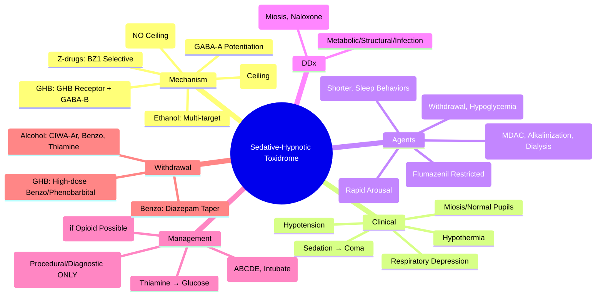

Related: [[General Principles of Poisoning Management]], [[Opioid Toxidrome]], [[Benzodiazepine Poisoning]], [[Barbiturate Poisoning]], [[Z-Drug (Zolpidem, Zopiclone) Poisoning]], [[Alcohol (Ethanol, Isopropyl, Methanol) Poisoning]], [[Antidotes Overview]]

> [!tip]
> Think: "CNS depression" — sedation, respiratory depression, hypotension, hypothermia. Benzo = flumazenil (restricted), Barbiturate = no antidote, Z-drugs = benzo-like, Ethanol = supportive. Key FCPS/MRCP: Flumazenil CONTRAINDICATED in mixed overdose (TCA, seizure hx, chronic benzo use). Supportive care is mainstay.

## 1. Learning Objectives
- Recognize sedative-hypnotic toxidrome (CNS depression, respiratory depression, hypotension, hypothermia)
- Differentiate benzodiazepine, barbiturate, Z-drug, alcohol, GHB/GBL
- Apply flumazenil indications and CONTRAINDICATIONS
- Manage respiratory depression, hypotension, withdrawal
- Disposition criteria (observe vs admit)

## 2. Definition
Sedative-hypnotic toxidrome = clinical syndrome from enhanced GABAₐ receptor-mediated inhibition causing dose-dependent CNS depression (sedation → coma), respiratory depression, cardiovascular depression, and hypothermia.

## 3. Core Physiology
- **GABAₐ receptor**: Cl⁻ channel → hyperpolarization → neuronal inhibition
- **Benzodiazepines**: bind α/γ interface → ↑ frequency of Cl⁻ channel opening (require GABA). **Ceiling effect** on respiratory depression (alone).
- **Barbiturates**: bind β subunit → ↑ duration of Cl⁻ channel opening (mimic GABA at high dose). **NO ceiling effect** — fatal respiratory depression.
- **Z-drugs** (zolpidem, zopiclone, zaleplon): BZ1 (α₁) selective → more sedation, less anxiolysis/muscle relaxant. Similar to benzo.
- **GHB/GBL**: GHB receptor + GABAₐ (high dose) → rapid onset, short duration, profound coma → rapid arousal ("awake and walk out").
- **Ethanol**: GABAₐ potentiation + NMDA inhibition + others → broad CNS depression.
- **Synergy**: combined sedatives (benzo + opioid + alcohol) → **supra-additive respiratory depression**.

## 4. Clinical Features (Class Effect + Agent-Specific)

| Feature | Benzo | Barbiturate | Z-Drugs | GHB/GBL | Ethanol |
|---------|-------|-------------|---------|---------|---------|
| **Sedation/Coma** | Yes | Yes (deeper) | Yes | Yes (profound) | Yes |
| **Respiratory Depression** | Mild-Mod (ceiling) | Severe (NO ceiling) | Mild-Mod | Severe | Mod-Severe |
| **Hypotension** | Mild | Mod-Severe | Mild | Mild | Mild-Mod |
| **Hypothermia** | Yes | Yes | Yes | Yes | Yes |
| **Pupils** | Normal/small | Small | Normal/small | Small | Normal |
| **Reflexes** | Decreased | Absent | Decreased | Absent | Decreased |
| **Paradoxical Agitation** | Rare (elderly, kids) | Rare | Reported | No | No |
| **Duration** | Hours (longer if active metabolites) | Long (days) | Short (4-6h) | **Very short (2-4h)** | Hours |
| **Withdrawal Risk** | High (if chronic) | High | Moderate | High | High (DTs) |

### Agent-Specific
- **Benzodiazepines**: respiratory depression usually mild unless combined; ataxia, dysarthria, nystagmus; anterograde amnesia
- **Barbiturates**: severe respiratory depression, non-cardiogenic pulmonary edema, DIC, bullous skin lesions (pressure necrosis), hypoglycemia (children)
- **Z-drugs**: similar to benzo but shorter; complex sleep behaviors (sleepwalking, sleep-driving); hallucinations
- **GHB/GBL**: rapid unconsciousness (min), **rapid spontaneous arousal** (2-4h) — "coma then awake", myoclonus, vomiting, bradycardia; **no respiratory depression at low dose** but severe at high
- **Ethanol**: disinhibition → ataxia → slurred speech → nystagmus → coma; hypoglycemia (children, malnourished); ketoacidosis (starvation); withdrawal syndrome (6-48h: tremor, anxiety, hallucinations, seizures, DTs 48-72h)

## 5. Differential Diagnosis
- **Opioid toxidrome**: miosis (pinpoint), respiratory depression, **naloxone responsive** — but can co-exist
- **Cholinergic**: secretions, miosis, bradycardia, bronchorrhea
- **Anticholinergic**: dry, hot, dilated, delirium, tachy
- **Metabolic**: hypoglycemia, hepatic encephalopathy, uremia, hypothyroidism
- **Structural**: stroke, ICH, SDH
- **Infection**: meningitis, encephalitis
- **Seizure**: post-ictal

## 6. Investigations
- **Glucose** (bedside) — **MANDATORY**
- **VBGA**: pH, pCO₂ (respiratory acidosis), lactate
- **Paracetamol level** (always)
- **Ethanol level** (if suspected)
- **Urine drug screen** (benzo, barbiturate — qualitative, limited)
- **Specific levels**: phenobarbital (if known), GHB (not routinely available)
- **ECG**: QT prolongation (some benzos), bradycardia
- **CXR**: aspiration, pulmonary edema (barbiturate)
- **CT head** if trauma/focal signs/unclear cause

## 7. Management

### 1. Supportive Care (Mainstay for ALL)
- **Airway**: protect if GCS < 8, loss of gag, respiratory depression (RR < 10, SpO₂ < 94% on O₂) — **intubate**
- **Breathing**: high-flow O₂, NIV/ventilation if needed
- **Circulation**: IV fluids for hypotension; vasopressors (NE) if refractory (barbiturate)
- **Temperature**: active warming if hypothermic
- **Glucose**: thiamine 100mg IV → dextrose 50mL 50% if hypoglycemic
- **Monitoring**: continuous SpO₂, ECG, GCS q15-30min, temp, UOP

### 2. Flumazenil (Benzodiazepine Antagonist) — **RESTRICTED USE**
- **Mechanism**: competitive antagonist at BZD site on GABAₐ receptor
- **Indications**:
  - **Diagnostic**: uncertain cause of coma (exclude benzo)
  - **Therapeutic**: **iatrogenic** oversedation (procedural sedation, anesthesia reversal) — **NOT routine OD**
  - **Pediatric** accidental ingestion (controversial, some guidelines support)
- **CONTRAINDICATIONS (ABSOLUTE — SEIZURE RISK)**:
  - **TCA co-ingestion** (or unknown OD with QRS widening) — flumazenil unmasks TCA seizure potential
  - **Known seizure disorder / epilepsy** — benzo withdrawal → seizures
  - **Chronic benzodiazepine use** — precipitated withdrawal (seizures, delirium)
  - **Cyclic antidepressant ingestion** (same as TCA)
  - **Head injury/ICP** — seizure risk
- **Dose**: 0.2 mg IV over 30 sec, repeat 0.3 mg q1 min (max 1 mg, then 1 mg q1h if re-sedation). Child: 0.01 mg/kg (max 0.2 mg).
- **Duration**: 30-60 min (shorter than benzo) → **re-sedation common** → monitor 2-4h post last dose.
- **Monitor**: continuous ECG, SpO₂, GCS during/after

### 3. Naloxone (if Opioid Co-ingestion Suspected)
- **Dose**: 0.04-0.4 mg IV (titrate to respiratory rate > 10)
- **Avoid precipitated withdrawal** in dependent patients

### 4. Decontamination
- **Activated charcoal**: 1 g/kg if < 1-2h, airway protected. **Benzo: delayed gastric emptying → may work later**. Barbiturate: less benefit.
- **WBI**: sustained-release benzo (rare), barbiturate (phenobarbital), body packers

### 5. Enhanced Elimination
- **MDAC**: phenobarbital (1-2 g/kg q4-6h) — increases clearance
- **Urinary alkalinization**: phenobarbital (weak acid, pKa 7.2) — enhances renal elimination
- **Hemodialysis**: phenobarbital (severe, refractory), ethanol (rarely), methanol/EG (separate)
- **NOT effective**: benzo, Z-drugs, GHB

### 6. Withdrawal Management (if Chronic Use Suspected)
- **Benzo withdrawal**: taper long-acting (diazepam) over weeks-months. Acute: diazepam 10-20 mg IV/PO q6h PRN (CIWA-B scale adapted).
- **Barbiturate withdrawal**: phenobarbital taper.
- **Alcohol withdrawal**: CIWA-Ar, benzos (lorazepam/diazepam), thiamine, magnesium, folate. DTs: ICU, high-dose benzo, consider propofol/dexmedetomidine.
- **GHB withdrawal**: similar to alcohol/benzo, can be severe — high-dose benzo/phenobarbital/dexmedetomidine.

## 8. Complications
- Aspiration pneumonia (loss of gag, vomiting)
- Rhabdomyolysis (prolonged immobilization, pressure necrosis — barbiturate)
- Hypothermia
- Non-cardiogenic pulmonary edema (barbiturate, heroin)
- Pressure ulcers, nerve compression injuries
- Withdrawal seizures, delirium tremens
- Anoxic brain injury (prolonged respiratory depression)

## 9. Prognosis
- **Benzo alone**: excellent (rarely fatal) — supportive care
- **Benzo + opioid/alcohol**: higher mortality (synergy)
- **Barbiturate**: higher mortality (10-20%) — no ceiling on respiratory depression, cardiovascular collapse
- **GHB**: good if survive acute (rapid recovery)
- **Ethanol**: good; mortality from trauma, aspiration, withdrawal

## 10. FCPS/MRCP High-Yield Points
1. **Flumazenil CONTRAINDICATIONS** (examinable): TCA co-ingestion/QRS widening, seizure disorder, chronic benzo use, head injury
2. **Flumazenil = diagnostic/procedural, NOT routine OD reversal** — re-sedation common, seizure risk
3. **Barbiturate = NO ceiling on respiratory depression** — more lethal than benzo
4. **GHB/GBL = rapid coma → rapid arousal (2-4h)** — "awake and walk out", myoclonus, vomiting
5. **Synergy**: benzo + opioid + alcohol = supra-additive respiratory depression
6. **Z-drugs** = benzo-like but shorter, complex sleep behaviors
7. **Thiamine BEFORE glucose** (Wernicke prevention) — all comatose/intoxicated
8. **Activated charcoal window longer for benzo** (delayed gastric emptying)
9. **MDAC + alkalinization for phenobarbital**
10. **Withdrawal**: benzo/alcohol/GHB = seizures, delirium; taper long-acting agent

## 11. Common Viva Questions
1. Flumazenil indications and contraindications
2. Why is flumazenil not recommended for routine benzo overdose?
3. Differentiate benzo vs barbiturate vs GHB toxicity
4. Management of mixed sedative overdose (benzo + opioid + alcohol)
4. GHB/GBL specific features (rapid arousal, myoclonus)
5. Phenobarbital elimination enhancement (MDAC, alkalinization, dialysis)
6. Alcohol withdrawal syndrome (CIWA-Ar, benzos, thiamine, complications)
7. Z-drug specific effects (sleep behaviors, hallucinations)

## 12. Common Confusions / Exam Traps
- **Flumazenil for routine benzo OD** → NO (re-sedation, seizure risk, no mortality benefit)
- **Flumazenil in unknown OD** → dangerous if TCA co-ingestion (QRS widening = NO flumazenil)
- **Flumazenil in chronic benzo user** → precipitated withdrawal seizures
- **Barbiturate vs benzo respiratory depression** → barbiturate NO ceiling, benzo ceiling
- **GHB "awake and walk out"** → don't discharge too early (rebound sedation, withdrawal)
- **Naloxone in pure benzo OD** → no effect (but give if opioid co-ingestion possible)
- **Phenytoin for benzo/barbiturate seizures** → NO (not indicated, benzos 1st line)

## 13. Mnemonics
- **FLUMAZENIL NO-GO**: **T**CA/QRS, **S**eizure disorder, **C**hronic benzo, **H**ead injury, **P**regnancy (relative)
- **BENZO VS BARBITURATE**: **B**arbiturate = **B**ad (no ceiling, hypotension, pulmonary edema, DIC); **B**enzo = **B**etter (ceiling, safer)
- **GHB**: **G**oes down fast, **H**ecomes awake fast, **B**arfs, **M**yoclonus, **B**radycardia
- **SEDATIVE SYNERGY**: **B**enzo + **O**pioid + **A**lcohol = **B**ig **O**pportunity for **A**pnea

## 14. Mind Map


## 15. Flowchart
```mermaid
flowchart TD
  A[Comatose, Respiratory Depression, Hypotension, Hypothermia] --> B[Sedative-Hypnotic Toxidrome]
  B --> C[ABCDE: Intubate if GCS<8 or RR<10\nThiamine 100mg IV → Glucose\nParacetamol Level]
  C --> D{Agent Known?}
  D -->|Benzodiazepine| E[Supportive Care\nFlumazenil ONLY if:\n- Procedural oversedation\n- Diagnostic uncertainty\nNO if TCA, Seizure Hx, Chronic Use]
  D -->|Barbiturate| F[Supportive Care\nVasopressors for HTN\nMDAC + Urinary Alkalinization\nDialysis if Severe/Refractory]
  D -->|Z-Drugs| G[Supportive Care\nShorter Observation (4-6h)]
  D -->|GHB/GBL| H[Supportive Care\nObserve 4-6h Post-Arousal\nMyoclonus/Vomiting Expected\nWatch for Withdrawal]
  D -->|Ethanol| I[Supportive Care\nThiamine, Glucose, Electrolytes\nMonitor Withdrawal (CIWA-Ar)]
  D -->|Unknown/Mixed| J[Supportive Care\nNaloxone Trial 0.04-0.4mg\nFlumazenil ONLY if No Contraindications\nIntubate if Needed]
  E --> K[Monitor 2-4h Post-Flumazenil\nRe-sedation Common]
  F --> L[ICU Admission]
  G --> M[Obs 6h]
  H --> N[Obs 6h Post-Arousal]
  I --> O[Admit if Withdrawal Risk]
  J --> P[ICU/HDU]
```

## 16. Suggested Visuals / Image Notes
- Flumazenil contraindications poster
- Sedative comparison table
- GHB timeline (coma → arousal → discharge risk)

## 17. Suggested Video References
- Flumazenil debate (EM:RAP, Toxicology)
- GHB/GBL toxicity review

## 18. One-Page Revision Summary
- **Toxidrome**: CNS depression, resp depression, hypotension, hypothermia, miosis/normal pupils
- **Benzo**: ceiling on resp depression, flumazenil restricted (NO: TCA, seizure hx, chronic use, head injury)
- **Barbiturate**: NO ceiling, hypotension, pulmonary edema, MDAC + alkalinization + dialysis
- **Z-drugs**: shorter, sleep behaviors
- **GHB/GBL**: rapid coma → rapid arousal (2-4h), myoclonus, vomiting, bradycardia
- **Ethanol**: hypoglycemia, ketoacidosis, withdrawal (CIWA-Ar, benzos, thiamine)
- **Synergy**: benzo + opioid + alcohol = worse resp depression
- **Thiamine before glucose** always
- **Flumazenil**: 0.2mg IV q1min max 1mg, monitor 2-4h for re-sedation

## 24-Hour Recall Prompts
- List 5 flumazenil contraindications
- Contrast benzo vs barbiturate respiratory depression
- Describe GHB/GBL unique features
- State management of mixed sedative overdose

## 7-Day / 15-Day / 30-Day Revision Tracker
- [ ] Day 1 completed
- [ ] 24-hour recall completed
- [ ] Day 7 revision completed
- [ ] Day 15 revision completed
- [ ] Day 30 revision completed

## 19. Must Know / Should Know / Nice to Know
### Must Know
- Sedative-hypnotic toxidrome features
- Flumazenil contraindications (TCA, seizure hx, chronic benzo, head injury)
- Barbiturate: no ceiling, MDAC/alkalinization/dialysis
- GHB: rapid arousal (2-4h), myoclonus, vomiting
- Synergy (benzo+opioid+alcohol)
- Thiamine before glucose

### Should Know
- Flumazenil dose (0.2mg IV, re-sedation)
- Z-drug specifics (sleep behaviors, shorter)
- Alcohol withdrawal (CIWA-Ar, benzos, thiamine, Mg, folate)
- GHB withdrawal (severe, dexmedetomidine)
- Phenobarbital enhanced elimination

### Nice to Know
- Barbiturate DIC, bullous lesions
- Ethanol ketoacidosis mechanism
- Dexmedetomidine for withdrawal
- Specific benzo active metabolites (diazepam → nordazepam, oxazepam)

## 20. Self-Test Scorecard
- Understanding: /10
- Recall: /10
- MCQ Performance: /10
- SBA Performance: /10
- Viva Confidence: /10
- Total: /50

> [!tip]
> Interpretation: <35 = weak topic, 35-44 = acceptable but insecure, 45+ = strong exam-ready topic.

## 21. Exam Answer Modes
### Long Answer Skeleton
- Definition + mechanism (GABA-A)
- Agent comparison table (benzo/barb/Z-drug/GHB/ethanol)
- Clinical features
- DDx (opioid, metabolic, structural)
- Investigations
- Management: supportive → specific (flumazenil restricted, naloxone trial, enhanced elimination for barb)
- Withdrawal syndromes
- Complications + prognosis

### Short Note Skeleton
- Flumazenil contraindications
- Sedative comparison table
- GHB timeline

### Viva One-Liners
- "Flumazenil: NO in TCA, seizure disorder, chronic benzo, head injury"
- "Barbiturate: no ceiling on respiratory depression — more lethal"
- "GHB: coma → awake in 2-4h, myoclonus, vomiting"
- "Benzo + opioid + alcohol = synergistic respiratory depression"
- "Thiamine BEFORE glucose in all comatose/intoxicated"
- "Flumazenil not for routine OD — re-sedation, seizure risk, no mortality benefit"
- "Phenobarbital: MDAC + urinary alkalinization + dialysis"

### Ward-Case Discussion Points
- Unknown coma → naloxone trial + flumazenil ONLY if no contraindications
- GHB patient "awake and wants to leave" → observe 6h (rebound, withdrawal)
- Chronic benzo user OD → flumazenil = withdrawal seizures

### Last-Night-Before-Exam Sheet
- Flumazenil NO-GO: TCA, Seizure Hx, Chronic Benzo, Head Injury
- Barbiturate = Bad (no ceiling, MDAC/alk/dialysis)
- GHB = Rapid arousal, myoclonus, vomit
- Synergy: B+O+A = Apnea
- Thiamine → Glucose

## 22. Summary
Sedative-hypnotic toxidrome = GABA-A mediated CNS depression. Benzo = ceiling effect, flumazenil restricted (diagnostic/procedural only; contraindicated: TCA, seizure hx, chronic use, head injury). Barbiturate = no ceiling, lethal, MDAC + alkalinization + dialysis. Z-drugs = shorter. GHB = rapid coma → arousal (2-4h), myoclonus. Ethanol = hypoglycemia, withdrawal. Synergy with opioids/alcohol. Thiamine before glucose.

## 23. MCQs (10)
1. Question 1
   A. Option A
   B. Option B
   C. Option C
   D. Option D
   **Answer: A**
   *Explanation: Explanation 1*

2. Question 2
   A. Option A
   B. Option B
   C. Option C
   D. Option D
   **Answer: B**
   *Explanation: Explanation 2*

3. Question 3
   A. Option A
   B. Option B
   C. Option C
   D. Option D
   **Answer: C**
   *Explanation: Explanation 3*

4. Question 4
   A. Option A
   B. Option B
   C. Option C
   D. Option D
   **Answer: D**
   *Explanation: Explanation 4*

5. Question 5
   A. Option A
   B. Option B
   C. Option C
   D. Option D
   **Answer: A**
   *Explanation: Explanation 5*

6. Question 6
   A. Option A
   B. Option B
   C. Option C
   D. Option D
   **Answer: B**
   *Explanation: Explanation 6*

7. Question 7
   A. Option A
   B. Option B
   C. Option C
   D. Option D
   **Answer: C**
   *Explanation: Explanation 7*

8. Question 8
   A. Option A
   B. Option B
   C. Option C
   D. Option D
   **Answer: D**
   *Explanation: Explanation 8*

9. Question 9
   A. Option A
   B. Option B
   C. Option C
   D. Option D
   **Answer: A**
   *Explanation: Explanation 9*

10. Question 10
   A. Option A
   B. Option B
   C. Option C
   D. Option D
   **Answer: B**
   *Explanation: Explanation 10*


## 24. SBA Questions (10)
1. Scenario 1
   A. Option A
   B. Option B
   C. Option C
   D. Option D
   **Answer: A**
   *Explanation: Explanation 1*

2. Scenario 2
   A. Option A
   B. Option B
   C. Option C
   D. Option D
   **Answer: B**
   *Explanation: Explanation 2*

3. Scenario 3
   A. Option A
   B. Option B
   C. Option C
   D. Option D
   **Answer: C**
   *Explanation: Explanation 3*

4. Scenario 4
   A. Option A
   B. Option B
   C. Option C
   D. Option D
   **Answer: D**
   *Explanation: Explanation 4*

5. Scenario 5
   A. Option A
   B. Option B
   C. Option C
   D. Option D
   **Answer: A**
   *Explanation: Explanation 5*

6. Scenario 6
   A. Option A
   B. Option B
   C. Option C
   D. Option D
   **Answer: B**
   *Explanation: Explanation 6*

7. Scenario 7
   A. Option A
   B. Option B
   C. Option C
   D. Option D
   **Answer: C**
   *Explanation: Explanation 7*

8. Scenario 8
   A. Option A
   B. Option B
   C. Option C
   D. Option D
   **Answer: D**
   *Explanation: Explanation 8*

9. Scenario 9
   A. Option A
   B. Option B
   C. Option C
   D. Option D
   **Answer: A**
   *Explanation: Explanation 9*

10. Scenario 10
   A. Option A
   B. Option B
   C. Option C
   D. Option D
   **Answer: B**
   *Explanation: Explanation 10*


## 25. Flashcards
- Q: Flashcard 1 question
  A: Flashcard 1 answer
- Q: Flashcard 2 question
  A: Flashcard 2 answer
- Q: Flashcard 3 question
  A: Flashcard 3 answer
- Q: Flashcard 4 question
  A: Flashcard 4 answer
- Q: Flashcard 5 question
  A: Flashcard 5 answer
- Q: Flashcard 6 question
  A: Flashcard 6 answer
- Q: Flashcard 7 question
  A: Flashcard 7 answer
- Q: Flashcard 8 question
  A: Flashcard 8 answer
- Q: Flashcard 9 question
  A: Flashcard 9 answer
- Q: Flashcard 10 question
  A: Flashcard 10 answer
- Q: Flashcard 11 question
  A: Flashcard 11 answer
- Q: Flashcard 12 question
  A: Flashcard 12 answer
- Q: Flashcard 13 question
  A: Flashcard 13 answer
- Q: Flashcard 14 question
  A: Flashcard 14 answer
- Q: Flashcard 15 question
  A: Flashcard 15 answer

## 26. Answer Key with Explanations
### MCQs
1. **A** - Explanation 1
2. **B** - Explanation 2
3. **C** - Explanation 3
4. **D** - Explanation 4
5. **A** - Explanation 5
6. **B** - Explanation 6
7. **C** - Explanation 7
8. **D** - Explanation 8
9. **A** - Explanation 9
10. **B** - Explanation 10


### SBAs
1. **A** - Explanation 1
2. **B** - Explanation 2
3. **C** - Explanation 3
4. **D** - Explanation 4
5. **A** - Explanation 5
6. **B** - Explanation 6
7. **C** - Explanation 7
8. **D** - Explanation 8
9. **A** - Explanation 9
10. **B** - Explanation 10