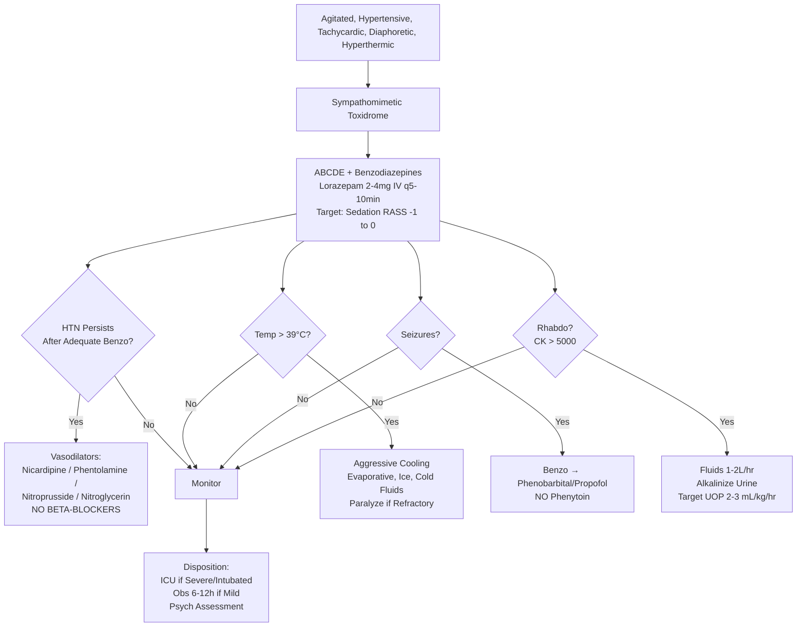

Related: [[General Principles of Poisoning Management]], [[Anticholinergic Toxidrome]], [[Serotonin Syndrome]], [[Cocaine and Amphetamine Poisoning]], [[Neuroleptic Malignant Syndrome]]

> [!tip]
> Think: "adrenaline on steroids" — catecholamine excess. Vasoconstriction + stimulation. Key FCPS/MRCP: Benzodiazepines 1st line for EVERYTHING (agitation, seizures, HTN, tachycardia). Avoid beta-blockers in cocaine (unopposed alpha). Treat hyperthermia aggressively.

## 1. Learning Objectives
- Recognize sympathomimetic toxidrome
- Differentiate from anticholinergic, serotonin syndrome, NMS
- Apply benzodiazepine-first management strategy
- Understand why beta-blockers are contraindicated in cocaine
- Manage hypertensive emergency, hyperthermia, rhabdo

## 2. Definition
Sympathomimetic toxidrome = clinical syndrome from excessive catecholaminergic stimulation (α₁, β₁, β₂, dopaminergic) due to increased release, decreased reuptake, or direct receptor agonism.

## 3. Core Physiology
- **Mechanisms**:
  - **Release promoters**: Amphetamine, methamphetamine, MDMA, mephedrone, cathinones
  - **Reuptake inhibitors**: Cocaine, methylphenidate, bupropion, TCA (also Na channel), venlafaxine (also serotonin)
  - **Direct agonists**: Ephedrine, pseudoephedrine, phenylephrine, dopamine, dobutamine, isoprenaline
  - **MAOIs** (tranylcypromine) + tyramine → hypertensive crisis
- **Receptor effects**:
  - **α₁**: vasoconstriction → hypertension, coronary vasospasm, priapism, skin pallor/ischemia
  - **β₁**: tachycardia, increased contractility → increased O₂ demand, arrhythmias
  - **β₂**: bronchodilation, tremor, metabolic effects (hyperglycemia, hypokalemia)
  - **D₁/D₂**: nausea, vasodilation (renal/mesenteric) at low dose
- **Central**: agitation, psychosis, seizures, hyperthermia (hypothalamic dysregulation + muscular activity)

## 4. Clinical Features

### Cardiovascular
- **Hypertension** (often severe, systolic > 180, diastolic > 120)
- **Tachycardia** (sinus, may have SVT, VT/VF)
- **Chest pain** (coronary vasospasm, MI — cocaine: 1-2% of ED chest pain)
- **Arrhythmias**: VT, VF, torsades (if QTc prolonging agent)

### Neurological
- **Agitation, anxiety, panic, paranoia, psychosis**
- **Hyperreflexia, tremor, myoclonus**
- **Seizures** (generalized tonic-clonic)
- **Headache** (hypertensive encephalopathy, SAH risk)
- **Intracranial hemorrhage** (cocaine: vasculitis, aneurysm rupture)

### Autonomic / Metabolic
- **Diaphoresis** (profuse sweating) — **KEY vs anticholinergic (dry)**
- **Mydriasis** (dilated pupils)
- **Hyperthermia** (often > 40°C — muscular activity + hypothalamic dysregulation + impaired heat loss from vasoconstriction) — **major cause of death**
- **Hyperglycemia**, **hypokalemia** (β₂ stimulation)
- **Metabolic acidosis** (lactic from vasoconstriction, seizures, hyperthermia)

### GI
- Nausea, vomiting, abdominal ischemia (mesenteric vasoconstriction)

## 5. Differential Diagnosis
| Feature | Sympathomimetic | Anticholinergic | Serotonin Syndrome | NMS |
|---------|-----------------|-----------------|-------------------|-----|
| **Skin** | Diaphoretic (WET) | Hot, DRY | Diaphoretic (WET) | Diaphoretic (WET) |
| **Pupils** | Dilated | Dilated | Normal/Dilated | Normal |
| **Bowel sounds** | Normal/↑ | Absent | Normal/↑ | Normal |
| **Reflexes** | Hyperreflexic | Normal | **Hyperreflexic + CLONUS** | Normal/↑ tone |
| **Muscle tone** | Normal | Normal | Normal | **Rigidity (lead-pipe)** |
| **Temp** | Hyperthermia | Hyperthermia | Hyperthermia | Hyperthermia |
| **Onset** | Minutes-hours | Minutes-hours | Hours (rapid) | Days (gradual) |
| **Key** | **Chest pain, HTN crisis** | Urinary retention, ileus | **Clonus**, serotonergic drug | Dopamine blocker/withdrawal |

## 6. Specific Agent Nuances
- **Cocaine**: Na channel blockade (like TCA) → QRS widening at high dose; local anesthetic effect; vasoconstriction → MI, stroke; **avoid beta-blockers** (unopposed α → worse HTN/vasospasm)
- **Amphetamine/Meth**: more CNS, less Na channel; prolonged (half-life 10-12h)
- **MDMA**: serotonin release → serotonin syndrome risk + hyponatremia (SIADH) + hyperthermia
- **Bupropion**: seizure risk high (dose-dependent), QRS widening possible
- **Cathinones (bath salts)**: severe agitation, psychosis, hyperthermia, rhabdo

## 7. Investigations
- **ECG**: sinus tachy, ST changes (ischemia), QRS (cocaine/bupropion), QTc
- **ABG/VBG**: metabolic acidosis, lactate ↑, K⁺ ↓, glucose ↑
- **CK**: rhabdo screen (hyperthermia, agitation, vasoconstriction)
- **Renal function**: AKI (rhabdo, vasoconstriction, direct)
- **Trop**: if chest pain / ischemia concern
- **Coagulation**: DIC risk (hyperthermia)
- **Urine drug screen**: cocaine metabolite (BE), amphetamines (cross-reactivity issues)
- **Paracetamol level** (always)
- **CXR**: pulmonary edema (negative pressure flash, neurogenic), aspiration

## 8. Management

### 1. ABCDE + Benzodiazepines (UNIVERSAL 1ST LINE)
- **Lorazepam 2-4 mg IV** q5-10 min OR **Diazepam 5-10 mg IV** q10-15 min
- **Target**: sedation (RASS -1 to 0), control agitation, prevent/treat seizures, lower BP/HR secondarily
- **High doses often needed** (total 10-30+ mg diazepam equivalent)
- **Mechanism**: GABA potentiation → central sympatholysis
- **Avoid antipsychotics** (haloperidol, droperidol) — lower seizure threshold, QT prolongation, dystonia, impair heat dissipation

### 2. Hypertension (If Persists After Adequate Benzodiazepines)
- **Vasodilators** (α₁ blockade or direct):
  - **Nicardipine** infusion (calcium channel blocker) — preferred
  - **Nitroprusside** (if ICP concern — avoid; cyanide risk)
  - **Phentolamine** (α-blocker) — bolus 5 mg IV, repeat — classic for cocaine
  - **Nitroglycerin** (if ischemic chest pain)
- **AVOID BETA-BLOCKERS** (labetalol, metoprolol, propranolol): **unopposed α₁ → worsened hypertension, coronary vasospasm, peripheral ischemia**. Even mixed α/β (labetalol) has β > α effect → risk.
- **AVOID**: Clonidine (central α₂ → initial HTN surge), ACEi/ARB (slow)

### 3. Tachycardia/Arrhythmias
- Benzodiazepines usually suffice
- If persistent: **Esmolol** (ultra-short β₁) — ONLY if benzos failed AND no cocaine (controversial, many avoid entirely)
- **Preferred**: Diltiazem/verapamil (rate control without β-blockade)
- **Ventricular arrhythmias**: standard ACLS (amiodarone, lidocaine). Avoid procainamide (Na channel blocker like cocaine).

### 4. Hyperthermia (T > 39°C = Emergency)
- **Aggressive cooling**: evaporative (mist + fan), ice packs groin/axilla/neck, cold IV fluids (4°C), cooled ventilator circuits
- **Target**: core < 38.5°C within 30 min
- **Paralysis + sedation** (vecuronium + propofol/midazolam) if refractory — stops muscular heat production
- **Dantrolene**: NOT routinely recommended (no evidence for non-MH hyperthermia), but consider if MH suspected

### 5. Seizures
- Benzodiazepines 1st line (already given)
- 2nd line: **Phenobarbital** 10-20 mg/kg IV or **Propofol** infusion (intubation required)
- **Avoid phenytoin/fosphenytoin** — Na channel blocker (worsens cocaine/bupropion cardiotoxicity)

### 6. Rhabdomyolysis
- Aggressive IV fluids (NS 1-2 L/hr) → target UOP 2-3 mL/kg/hr
- Alkalinize urine (NaHCO₃) if CK > 5000 or rising
- Monitor CK q6-12h, K⁺, Ca²⁺, renal function

### 7. Cocaine-Specific Chest Pain / MI
- **ASA 300 mg PO** (unless contraindicated)
- **Nitroglycerin** SL/IV for ischemia
- **Benzodiazepines** (reduce sympathetic drive)
- **Avoid beta-blockers** — phentolamine/nitroprusside/nicardipine for HTN
- **PCI** if STEMI (stent preferred — drug-eluting OK; avoid thrombolytics if recent cocaine — bleeding risk)
- **Coronary vasospasm** often resolves with benzos + nitrates

### 8. Hyponatremia (MDMA)
- **Severe** (< 125 mmol/L) + symptoms → 3% saline 100-150 mL bolus
- Fluid restrict if euvolemic SIADH
- Avoid rapid correction (osmotic demyelination)

## 9. Complications
- Intracranial hemorrhage (SAH, ICH)
- MI (cocaine: coronary vasospasm, thrombus, accelerated atherosclerosis)
- Rhabdomyolysis → AKI
- Hyperthermia → multi-organ failure, DIC
- Seizure injury
- Aortic dissection (cocaine)
- Bowel ischemia (mesenteric vasoconstriction)
- Psychiatric: psychosis, depression (crash)

## 10. Prognosis
- Good with early benzodiazepine + cooling
- Mortality: 1-5% (mainly hyperthermia, ICH, MI, arrhythmia)
- Cocaine: higher mortality with chest pain + QRS widening

## 11. FCPS/MRCP High-Yield Points
1. **Benzodiazepines = 1st line for EVERYTHING** (agitation, seizures, HTN, tachycardia, hyperthermia adjunct)
2. **Beta-blockers CONTRAINDICATED in cocaine** — unopposed α → worse HTN, coronary vasospasm
3. **Phentolamine** (α-blocker) for cocaine HTN crisis
4. **Skin = WET (diaphoretic)** — differentiates from anticholinergic (DRY)
5. **Hyperthermia > 40°C = medical emergency** — aggressive cooling, consider paralysis
6. **Cocaine + Na channel blockade** → QRS widening → treat like TCA (NaHCO₃) if severe
7. **Avoid phenytoin** (Na channel blocker) for seizures — use phenobarbital/propofol
8. **MDMA**: hyponatremia (SIADH) + serotonin syndrome risk + hyperthermia
9. **Rhabdo**: aggressive fluids, alkalinization
10. **Antipsychotics avoided** — lower seizure threshold, QT, dystonia, impair cooling

## 12. Common Viva Questions
1. Sympathomimetic toxidrome features
2. Why beta-blockers contraindicated in cocaine?
3. Management of cocaine-induced hypertension
4. Hyperthermia management in stimulant overdose
5. Differentiate sympathomimetic from serotonin syndrome, NMS, anticholinergic
6. Seizure management in stimulant overdose (why not phenytoin?)
7. MDMA-specific complications (hyponatremia, serotonin syndrome)
8. Cocaine chest pain workup and management

## 13. Common Confusions / Exam Traps
- **Beta-blockers in cocaine** → NEVER (unopposed alpha)
- **Labetalol** → still has net β > α effect → avoid
- **Phentolamine** = α-blocker = GOOD for cocaine HTN
- **Phenytoin for seizures** → NO (Na channel blocker)
- **Skin**: wet vs dry (anticholinergic)
- **Reflexes/clonus**: sympathomimetic = hyperreflexia NO clonus; serotonin = CLONUS
- **Rigidity**: NMS = lead-pipe; sympathomimetic = normal tone
- **Onset**: NMS = days; sympathomimetic = minutes-hours
- **Dantrolene** → not for sympathomimetic hyperthermia (only MH)

## 14. Mnemonics
- **SYMPATHETIC** (features): **S**weating, **Y** (why? HTN), **M**ydriasis, **P**sychosis, **A**gitation, **T**achycardia, **H**yperthermia, **E**levated BP, **T**remor, **I**schemia (chest pain), **C**onvulsions
- **COCAINE HTN**: **P**hentolamine, **N**icardipine, **N**itroprusside, **N**itroglycerin — **NO BETA-BLOCKERS**
- **SEIZURE DRUGS**: **B**enzos → **P**henobarbital/**P**ropofol — **NO Phenytoin**
- **MDMA TRIAD**: **H**yperthermia, **H**yponatremia, **S**erotonin syndrome

## 15. Mind Map
```mermaid
mindmap
  root((Sympathomimetic Toxidrome))
    Mechanism
      Release (Amphetamine, MDMA)
      Reuptake Block (Cocaine, Bupropion)
      Direct Agonist (Epinephrine)
    Clinical
      CV: HTN, Tachy, Chest Pain, Arrhythmia
      Neuro: Agitation, Psychosis, Seizures, Hyperreflexia
      Autonomic: Diaphoresis (WET), Mydriasis, Hyperthermia
      Metabolic: Hyperglycemia, Hypokalemia, Acidosis
    DDx
      Anticholinergic (DRY)
      Serotonin (CLONUS)
      NMS (Rigidity, Days)
    Management
      Benzos (Universal 1st Line)
      Vasodilators (NO Beta-Blockers)
      Cooling (Hyperthermia)
      Fluids + Alkalinization (Rhabdo)
    Cocaine Specific
      Na Channel Block (QRS)
      No Beta-Blockers
      Phentolamine/Nicardipine
      Avoid Phenytoin
```

## 16. Flowchart


## 17. Suggested Visuals / Image Notes
- Toxidrome comparison table (4 columns)
- Cocaine HTN algorithm
- Hyperthermia cooling methods

## 18. Suggested Video References
- Stimulant toxidrome (EM:RAP, Toxicology Today)
- Cocaine cardiovascular toxicity

## 19. One-Page Revision Summary
- **Toxidrome**: "adrenaline on steroids" — HTN, tachy, diaphoresis (WET), mydriasis, agitation, psychosis, seizures, hyperthermia
- **Benzos 1st line for ALL** (lorazepam/diazepam, high doses)
- **Cocaine HTN**: phentolamine, nicardipine, nitroprusside, NTG — **NO BETA-BLOCKERS** (unopposed α)
- **Seizures**: Benzo → Phenobarbital/Propofol — **NO Phenytoin** (Na channel)
- **Hyperthermia > 39°C**: aggressive cooling, paralyze if refractory
- **Skin WET** vs anticholinergic DRY
- **Reflexes hyper NO clonus** vs serotonin CLONUS
- **Tone normal** vs NMS rigidity
- **MDMA**: hyponatremia + serotonin syndrome + hyperthermia
- **Rhabdo**: fluids + alkalinization

## 24-Hour Recall Prompts
- List 3 vasodilators for cocaine HTN (and what to avoid)
- Contrast sympathomimetic vs anticholinergic vs serotonin vs NMS
- State seizure management sequence in stimulant OD
- Define hyperthermia emergency threshold and cooling

## 7-Day / 15-Day / 30-Day Revision Tracker
- [ ] Day 1 completed
- [ ] 24-hour recall completed
- [ ] Day 7 revision completed
- [ ] Day 15 revision completed
- [ ] Day 30 revision completed

## 20. Must Know / Should Know / Nice to Know
### Must Know
- Sympathomimetic features (diaphoresis = WET)
- Benzo 1st line universal
- Cocaine: NO beta-blockers, phentolamine/nicardipine for HTN
- Seizures: no phenytoin (phenobarbital/propofol)
- Hyperthermia emergency management
- DDx: wet skin, hyperreflexia no clonus, normal tone, rapid onset
- MDMA: hyponatremia, serotonin syndrome risk

### Should Know
- Specific agents: cocaine (Na channel), amphetamine (long), MDMA (serotonin), cathinones (severe)
- Rhabdo management
- Cocaine chest pain: ASA, NTG, benzo, PCI if STEMI
- Antipsychotics avoided

### Nice to Know
- MAOI + tyramine hypertensive crisis
- Bupropion seizure/QRS specifics
- Intracranial hemorrhage risk factors
- Drug-eluting stent in cocaine MI

## 21. Self-Test Scorecard
- Understanding: /10
- Recall: /10
- MCQ Performance: /10
- SBA Performance: /10
- Viva Confidence: /10
- Total: /50

> [!tip]
> Interpretation: <35 = weak topic, 35-44 = acceptable but insecure, 45+ = strong exam-ready topic.

## 22. Exam Answer Modes
### Long Answer Skeleton
- Definition + mechanisms (release, reuptake, direct)
- Clinical features by system
- DDx table (4 toxidromes)
- Investigations
- Management: benzos universal → specific (HTN vasodilators no beta, cooling, seizures no phenytoin, rhabdo)
- Cocaine specifics
- Complications + prognosis

### Short Note Skeleton
- Toxidrome features
- Cocaine HTN algorithm
- Seizure drug sequence
- DDx table

### Viva One-Liners
- "Sympathomimetic: wet, tachy, hypertensive, agitated, hyperthermic"
- "Cocaine HTN: phentolamine, nicardipine, NO beta-blockers (unopposed alpha)"
- "Seizures in stimulant OD: benzo → phenobarbital/propofol, NO phenytoin"
- "Wet skin = sympathomimetic/serotonin/NMS; Dry = anticholinergic"
- "Clonus = serotonin; Rigidity = NMS; Normal tone + hyperreflexia = sympathomimetic"
- "MDMA: watch for hyponatremia (SIADH) and serotonin syndrome"

### Ward-Case Discussion Points
- Unknown stimulant + chest pain → ECG, trop, ASA, NTG, benzo, avoid beta-blockers
- Hyperthermic agitated patient → benzos + cooling BEFORE intubation if possible
- Rhabdo + AKI risk → fluids, alkalinization, monitor K/Ca

### Last-Night-Before-Exam Sheet
- WET skin, mydriasis, HTN, tachy, agitation, hyperthermia
- Benzo 1st line (lorazepam/diazepam)
- Cocaine HTN: NO BETA, phentolamine/nicardipine
- Seizures: NO phenytoin
- Cooling > 39°C
- MDMA: hyponatremia + serotonin

## 23. Summary
Sympathomimetic toxidrome = catecholamine excess → HTN, tachycardia, diaphoresis (WET), agitation, hyperthermia. Benzodiazepines universal 1st line. Cocaine: avoid beta-blockers (unopposed α), use phentolamine/nicardipine. Seizures: avoid phenytoin (Na channel). Hyperthermia > 39°C = aggressive cooling ± paralysis. DDx: wet skin, hyperreflexia NO clonus, normal tone, rapid onset. MDMA adds hyponatremia + serotonin syndrome risk.

## 24. MCQs (10)
1. Question 1
   A. Option A
   B. Option B
   C. Option C
   D. Option D
   **Answer: A**
   *Explanation: Explanation 1*

2. Question 2
   A. Option A
   B. Option B
   C. Option C
   D. Option D
   **Answer: B**
   *Explanation: Explanation 2*

3. Question 3
   A. Option A
   B. Option B
   C. Option C
   D. Option D
   **Answer: C**
   *Explanation: Explanation 3*

4. Question 4
   A. Option A
   B. Option B
   C. Option C
   D. Option D
   **Answer: D**
   *Explanation: Explanation 4*

5. Question 5
   A. Option A
   B. Option B
   C. Option C
   D. Option D
   **Answer: A**
   *Explanation: Explanation 5*

6. Question 6
   A. Option A
   B. Option B
   C. Option C
   D. Option D
   **Answer: B**
   *Explanation: Explanation 6*

7. Question 7
   A. Option A
   B. Option B
   C. Option C
   D. Option D
   **Answer: C**
   *Explanation: Explanation 7*

8. Question 8
   A. Option A
   B. Option B
   C. Option C
   D. Option D
   **Answer: D**
   *Explanation: Explanation 8*

9. Question 9
   A. Option A
   B. Option B
   C. Option C
   D. Option D
   **Answer: A**
   *Explanation: Explanation 9*

10. Question 10
   A. Option A
   B. Option B
   C. Option C
   D. Option D
   **Answer: B**
   *Explanation: Explanation 10*


## 25. SBA Questions (10)
1. Scenario 1
   A. Option A
   B. Option B
   C. Option C
   D. Option D
   **Answer: A**
   *Explanation: Explanation 1*

2. Scenario 2
   A. Option A
   B. Option B
   C. Option C
   D. Option D
   **Answer: B**
   *Explanation: Explanation 2*

3. Scenario 3
   A. Option A
   B. Option B
   C. Option C
   D. Option D
   **Answer: C**
   *Explanation: Explanation 3*

4. Scenario 4
   A. Option A
   B. Option B
   C. Option C
   D. Option D
   **Answer: D**
   *Explanation: Explanation 4*

5. Scenario 5
   A. Option A
   B. Option B
   C. Option C
   D. Option D
   **Answer: A**
   *Explanation: Explanation 5*

6. Scenario 6
   A. Option A
   B. Option B
   C. Option C
   D. Option D
   **Answer: B**
   *Explanation: Explanation 6*

7. Scenario 7
   A. Option A
   B. Option B
   C. Option C
   D. Option D
   **Answer: C**
   *Explanation: Explanation 7*

8. Scenario 8
   A. Option A
   B. Option B
   C. Option C
   D. Option D
   **Answer: D**
   *Explanation: Explanation 8*

9. Scenario 9
   A. Option A
   B. Option B
   C. Option C
   D. Option D
   **Answer: A**
   *Explanation: Explanation 9*

10. Scenario 10
   A. Option A
   B. Option B
   C. Option C
   D. Option D
   **Answer: B**
   *Explanation: Explanation 10*


## 26. Flashcards
- Q: Flashcard 1 question
  A: Flashcard 1 answer
- Q: Flashcard 2 question
  A: Flashcard 2 answer
- Q: Flashcard 3 question
  A: Flashcard 3 answer
- Q: Flashcard 4 question
  A: Flashcard 4 answer
- Q: Flashcard 5 question
  A: Flashcard 5 answer
- Q: Flashcard 6 question
  A: Flashcard 6 answer
- Q: Flashcard 7 question
  A: Flashcard 7 answer
- Q: Flashcard 8 question
  A: Flashcard 8 answer
- Q: Flashcard 9 question
  A: Flashcard 9 answer
- Q: Flashcard 10 question
  A: Flashcard 10 answer
- Q: Flashcard 11 question
  A: Flashcard 11 answer
- Q: Flashcard 12 question
  A: Flashcard 12 answer
- Q: Flashcard 13 question
  A: Flashcard 13 answer
- Q: Flashcard 14 question
  A: Flashcard 14 answer
- Q: Flashcard 15 question
  A: Flashcard 15 answer

## 27. Answer Key with Explanations
### MCQs
1. **A** - Explanation 1
2. **B** - Explanation 2
3. **C** - Explanation 3
4. **D** - Explanation 4
5. **A** - Explanation 5
6. **B** - Explanation 6
7. **C** - Explanation 7
8. **D** - Explanation 8
9. **A** - Explanation 9
10. **B** - Explanation 10


### SBAs
1. **A** - Explanation 1
2. **B** - Explanation 2
3. **C** - Explanation 3
4. **D** - Explanation 4
5. **A** - Explanation 5
6. **B** - Explanation 6
7. **C** - Explanation 7
8. **D** - Explanation 8
9. **A** - Explanation 9
10. **B** - Explanation 10