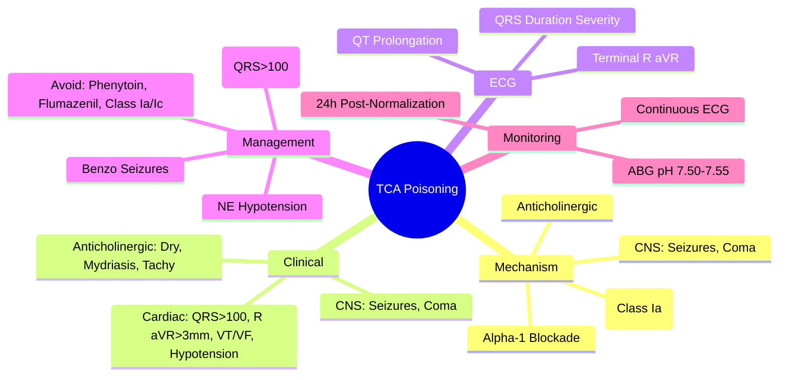
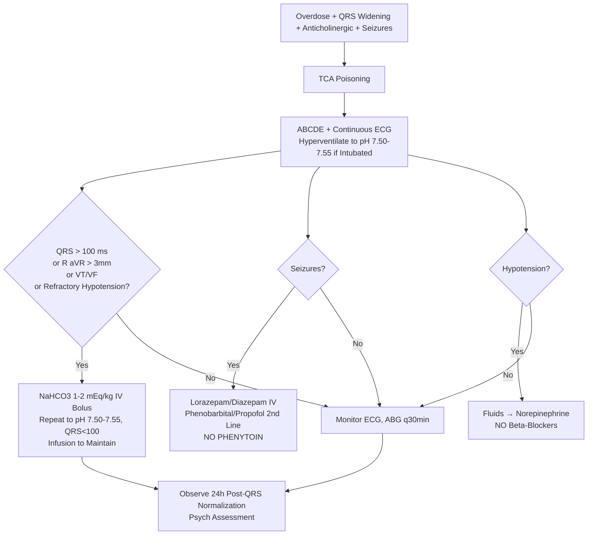

Related: [[General Principles of Poisoning Management]], [[Antidotes Overview]], [[Anticholinergic Toxidrome]], [[Serotonin Syndrome]], [[Benzodiazepine Poisoning]], [[Sympathomimetic Toxidrome]]

> [!tip]
> **Triad**: **QRS widening** + **terminal R in aVR** + **anticholinergic features**. **Sodium bicarbonate** for QRS > 100 ms. **AVOID**: Class Ia/Ic antiarrhythmics, **phenytoin**, **flumazenil**, **physostigmine**. Key FCPS/MRCP: QRS > 100 ms → NaHCO₃ bolus 1-2 mEq/kg (target pH 7.50-7.55, QRS < 100 ms); seizures = benzos (not phenytoin); sodium channel blockade = avoid all Na channel blockers.

## 1. Learning Objectives
- Recognize TCA toxidrome (cardiac + anticholinergic + CNS)
- Apply sodium bicarbonate protocol for cardiotoxicity
- Identify contraindicated drugs (phenytoin, flumazenil, Class Ia/Ic)
- Manage seizures, hypotension, arrhythmias
- Interpret ECG markers (QRS, terminal R aVR, QT)

## 2. Definition
TCA poisoning = toxicity from tricyclic antidepressants (amitriptyline, imipramine, nortriptyline, doxepin, clomipramine, dosulepin/dothiepin) causing **sodium channel blockade** (cardiotoxicity), **anticholinergic effects**, and **CNS depression/seizures**.

## 3. Core Physiology
- **Sodium channel blockade** (Class Ia antiarrhythmic effect): binds fast Na⁺ channels in inactivated state → ↓ dV/dt, ↑ QRS, ↑ refractory period → **re-entrant arrhythmias**, hypotension
- **Anticholinergic**: competitive muscarinic blockade → tachycardia, dry skin, mydriasis, ileus, urinary retention, hyperthermia
- **Alpha-1 blockade**: vasodilation → hypotension
- **CNS**: seizures (GABA antagonism, kindling), coma, respiratory depression
- **Serotonin/norepinephrine reuptake inhibition**: contributes to seizures, serotonin syndrome risk
- **Pharmacokinetics**: highly lipophilic, large Vd, protein bound (~95%), hepatic metabolism (CYP2D6, CYP3A4) → active metabolites. **Alkalemia** ↑ protein binding → ↓ free drug → cardioprotection.

## 4. Clinical Features

### Cardiac (Sodium Channel Blockade) — **Main Cause of Death**
- **QRS widening** (> 100 ms = significant, > 160 ms = high risk VF/asystole)
- **Terminal R wave in aVR** (> 3 mm = high sensitivity for severe toxicity)
- **QT prolongation**
- **Sinus tachycardia** (anticholinergic + α₁ blockade)
- **Arrhythmias**: VT, torsades, VF, asystole, heart block
- **Hypotension** (α₁ blockade + myocardial depression) — refractory to fluids

### Anticholinergic
- Dry mouth/skin, mydriasis, ileus, urinary retention, hyperthermia, delirium

### CNS
- Seizures (generalized tonic-clonic, often early), coma, respiratory depression

## 5. ECG Progression (Severity Marker)
| QRS Duration | Severity | Risk |
|--------------|----------|------|
| < 100 ms | Mild | Low |
| 100-160 ms | Moderate | Seizures, arrhythmias possible |
| > 160 ms | Severe | **High risk VF/asystole** |

**Terminal R in aVR** (R wave > 3 mm in aVR) + **QRS > 100 ms** = high specificity for severe toxicity.

## 6. Differential Diagnosis
- **Anticholinergic toxidrome**: pure anticholinergic without QRS widening
- **Phenothiazine/antipsychotic**: similar but less QRS prolongation, more EPS
- **Cocaine**: sympathomimetic + Na channel blockade (avoid beta-blockers)
- **Diphenhydramine**: anticholinergic + Na channel blockade (QRS widening, seizures)
- **Bupropion**: seizures + QRS widening
- **Lamotrigine**: seizures + QRS widening

## 7. Investigations
- **ECG** — continuous monitoring, serial 12-leads (QRS, aVR, QT)
- **ABG/VBG** — pH target 7.50-7.55 for NaHCO₃ therapy
- **Electrolytes** — K⁺, Na⁺, Mg²⁺, Ca²⁺
- **Glucose** (bedside)
- **Paracetamol level** (always)
- **CK** (seizures, rhabdo)
- **TCA level** — not routinely available acutely, doesn't change acute mgmt
- **CXR** — aspiration, pulmonary edema

## 8. Management

### 1. Resuscitation (ABCDE)
- **Airway**: intubate if GCS < 8, seizures, respiratory depression. **Hyperventilate** to maintain pH 7.50-7.55 (alkalemia cardioprotective).
- **Breathing**: high-flow O₂, target pH 7.50-7.55 via ventilation
- **Circulation**: IV fluids, **vasopressors** (norepinephrine) for refractory hypotension

### 2. Sodium Bicarbonate — **SPECIFIC ANTIDOTE FOR CARDIOTOXICITY**
- **Indications**:
  - **QRS > 100 ms** (or widening trend)
  - **Terminal R in aVR > 3 mm**
  - Ventricular arrhythmias (VT/VF)
  - Hypotension refractory to fluids
- **Protocol**:
  - **Bolus**: **1-2 mEq/kg (1-2 mmol/kg) IV** over 1-2 min (typically 100-150 mEq 8.4% NaHCO₃)
  - **Target**: **pH 7.50-7.55** AND **QRS < 100 ms**
  - **Infusion**: 150 mEq NaHCO₃ in 1L D5W at 150-250 mL/hr to maintain pH 7.50-7.55
  - **Monitor**: ABG q15-30 min, continuous ECG, serum K⁺ (alkalemia → hypokalemia)
- **Mechanism**: alkalemia ↑ protein binding → ↓ free TCA; Na⁺ load overcomes channel blockade; ↑ extracellular Na⁺ ↑ electrochemical gradient

### 3. Seizures
- **1st line**: **Benzodiazepines** — Lorazepam 2-4 mg IV or Diazepam 5-10 mg IV, repeat prn
- **2nd line**: Phenobarbital 10-20 mg/kg IV or Propofol infusion (intubate)
- **AVOID PHENYTOIN/FOSPHENYTOIN** — Na channel blocker → **worsens cardiotoxicity**
- **AVOID LEVETIRACETAM** — limited evidence, not 1st line

### 4. Hypotension
- Fluids → **Norepinephrine** (α₁ + β₁) preferred
- **Avoid pure α-agonists** (phenylephrine) — may worsen myocardial depression
- **Avoid beta-blockers** — negative inotropy

### 5. Arrhythmias
- **Primary**: correct acidosis, NaHCO₃, electrolytes (K⁺, Mg²⁺)
- **VT/VF**: standard ACLS **BUT** avoid Class Ia/Ic (procainamide, flecainide, propafenone) — **worsen Na channel blockade**
- **Lidocaine** (Class Ib) — **acceptable** (shorter binding, use-dependent)
- **Amiodarone** — controversial (Class III but some Na channel effect), use with caution
- **Magnesium sulfate** 2g IV for torsades

### 6. Contraindicated Drugs — **HIGH YIELD**
| Drug | Reason |
|------|--------|
| **Phenytoin/Fosphenytoin** | Na channel blocker → worsens QRS, VF risk |
| **Flumazenil** | Lowers seizure threshold; if benzo co-ingestion → unmasks TCA seizures |
| **Physostigmine** | Cholinergic crisis + Na channel blockade → asystole |
| **Class Ia/Ic antiarrhythmics** (procainamide, quinidine, flecainide, propafenone) | Additive Na channel blockade |
| **Beta-blockers** | Negative inotropy, bradycardia → worsen hypotension |
| **Tricyclics** (obviously) | — |

### 7. Decontamination
- **Activated charcoal**: 1 g/kg if < 1-2h (delayed gastric emptying from anticholinergic → **window up to 4-6h**). Airway must be protected.
- **WBI**: rarely indicated

### 8. Enhanced Elimination
- **NOT effective**: hemodialysis (high protein binding, large Vd), hemoperfusion (historical), MDAC (limited)

### 9. Monitoring & Disposition
- **Continuous ECG** until QRS < 100 ms stable 24h
- **Observe 24h post-normalization** (QRS, mental status, vitals)
- **Psych assessment** mandatory (DSH common)

## 9. Complications
- Ventricular arrhythmias (VF, torsades) → death
- Hypotension → shock, multi-organ failure
- Seizures → rhabdo, aspiration, anoxic injury
- Aspiration pneumonia
- Rhabdomyolysis → AKI
- Compartment syndrome (prolonged immobilization)

## 10. Prognosis
- **Good with early NaHCO₃** — most recover fully
- Mortality: ~2-5% with aggressive management
- Death usually from refractory VF/asystole or hypotension
- Late deaths rare (no delayed cardiotoxicity like organophosphate IMS)

## 11. FCPS/MRCP High-Yield Points
1. **QRS > 100 ms = NaHCO₃** (1-2 mEq/kg bolus, target pH 7.50-7.55, QRS < 100 ms)
2. **Terminal R in aVR > 3 mm** = severe toxicity predictor
3. **AVOID PHENYTOIN** — worsens Na channel blockade (classic exam trap)
4. **AVOID FLUMAZENIL** — lowers seizure threshold, unmasks TCA seizures
5. **AVOID Class Ia/Ic antiarrhythmics** — additive Na channel blockade
6. **Seizures = benzos** (lorazepam/diazepam), not phenytoin
7. **Hypotension = norepinephrine** (fluids then NE)
8. **Alkalemia cardioprotective** → hyperventilate intubated patients to pH 7.50-7.55
9. **Anticholinergic features** common (tachycardia, dry, mydriasis) but **QRS widening = TCA differentiator**
10. **No specific TCA level needed** for management (not routinely available)

## 12. Common Viva Questions
1. TCA toxidrome features (cardiac + anticholinergic + CNS)
2. Sodium bicarbonate dosing and targets (pH, QRS)
3. Why is phenytoin contraindicated?
4. Why is flumazenil contraindicated?
5. ECG markers of severity (QRS, aVR, QT)
6. Seizure management in TCA
7. Hypotension management
8. Contraindicated drugs list

## 13. Common Confusions / Exam Traps
- **Phenytoin for TCA seizures** → **NEVER** (worsens cardiotoxicity)
- **Flumazenil for benzo+TCA** → **NEVER** (unmasks seizures)
- **Physostigmine for anticholinergic features** → **NEVER** (asystole risk)
- **Procainamide/flecainide for VT** → **NEVER** (additive Na block)
- **QRS < 100 ms = no NaHCO₃ needed** (unless arrhythmia/hypotension)
- **Serum alkalinization target = pH 7.50-7.55** (not just QRS)
- **Terminal R aVR > 3 mm** = bad sign, not just QRS

## 14. Mnemonics
- **TCA TRIAD**: **Q**RS widening, **T**erminal R aVR, **A**nticholinergic
- **TCA NO-GO DRUGS**: **P**henytoin, **F**lumazenil, **P**hysostigmine, **P**rocainamide, **F**lecainide, **P**ropafenone, **B**eta-blockers
- **NaHCO3 TARGETS**: **pH 7.50-7.55**, **QRS < 100 ms**
- **SEIZURE DRUGS**: **B**enzos → **P**henobarbital/**P**ropofol — **NO Phenytoin**
- **TCA CARDIOTOXICITY**: **S**odium channel **B**lockade = **Q**RS widening + **T**erminal R aVR

## 15. Mind Map

## 16. Flowchart

## 17. Suggested Visuals / Image Notes
- ECG progression (QRS widening → sine wave)
- Terminal R in aVR diagram
- Contraindicated drugs poster

## 18. Suggested Video References
- TCA overdose management (Toxbase, EM:RAP)
- Sodium bicarbonate protocol demonstration

## 19. One-Page Revision Summary
- **Triad**: QRS > 100 ms + terminal R aVR > 3 mm + anticholinergic
- **NaHCO₃**: 1-2 mEq/kg bolus, target pH 7.50-7.55, QRS < 100 ms
- **Seizures**: benzos → phenobarbital/propofol — **NO PHENYTOIN**
- **Hypotension**: fluids → norepinephrine
- **Contraindicated**: phenytoin, flumazenil, physostigmine, Class Ia/Ic, beta-blockers
- **Intubated**: hyperventilate to pH 7.50-7.55
- **Monitor**: continuous ECG until QRS < 100 ms stable 24h

## 24-Hour Recall Prompts
- State NaHCO₃ bolus dose and targets (pH, QRS)
- List 5 contraindicated drugs in TCA poisoning
- Describe seizure management sequence
- Identify ECG markers of severity

## 7-Day / 15-Day / 30-Day Revision Tracker
- [ ] Day 1 completed
- [ ] 24-hour recall completed
- [ ] Day 7 revision completed
- [ ] Day 15 revision completed
- [ ] Day 30 revision completed

## 20. Must Know / Should Know / Nice to Know
### Must Know
- QRS > 100 ms → NaHCO₃ (1-2 mEq/kg, pH 7.50-7.55, QRS < 100)
- Terminal R aVR > 3 mm = severe
- Phenytoin CONTRAINDICATED (worsens Na block)
- Flumazenil CONTRAINDICATED (unmasks seizures)
- Class Ia/Ic antiarrhythmics CONTRAINDICATED
- Seizures = benzos, not phenytoin
- Hyperventilate intubated to pH 7.50-7.55

### Should Know
- Norepinephrine for hypotension
- Lidocaine acceptable for VT/VF
- Magnesium for torsades
- Charcoal window extended (anticholinergic delays gastric emptying)
- No enhanced elimination

### Nice to Know
- Specific TCA differences (amitriptyline most cardiotoxic, nortriptyline/desipramine less)
- CYP2D6 poor metabolizers at higher risk
- Late recurrence of cardiotoxicity rare (unlike organophosphate IMS)

## 21. Self-Test Scorecard
- Understanding: /10
- Recall: /10
- MCQ Performance: /10
- SBA Performance: /10
- Viva Confidence: /10
- Total: /50

> [!tip]
> Interpretation: <35 = weak topic, 35-44 = acceptable but insecure, 45+ = strong exam-ready topic.

## 22. Exam Answer Modes
### Long Answer Skeleton
- Mechanism: Na channel blockade + anticholinergic + α₁ blockade + CNS
- Clinical: cardiac (QRS, aVR, arrhythmias), anticholinergic, CNS (seizures)
- ECG severity markers
- Management: NaHCO₃ (protocol), seizures (benzos), hypotension (NE), avoid list
- Monitoring/disposition

### Short Note Skeleton
- TCA toxidrome features
- NaHCO₃ protocol box
- Contraindicated drugs table
- ECG severity markers

### Viva One-Liners
- "TCA: QRS widening + terminal R aVR + anticholinergic = triad"
- "NaHCO₃: 1-2 mEq/kg bolus, target pH 7.50-7.55, QRS < 100 ms"
- "NO phenytoin in TCA — worsens sodium channel blockade"
- "NO flumazenil — unmasks TCA seizures"
- "NO Class Ia/Ic antiarrhythmics — additive Na blockade"
- "Seizures: lorazepam → phenobarbital/propofol"
- "Intubated: hyperventilate to pH 7.50-7.55"
- "Terminal R aVR > 3 mm = severe toxicity"

### Ward-Case Discussion Points
- TCA + benzo co-ingestion → flumazenil = seizures
- TCA VT → lidocaine OK, amiodarone cautious, procainamide NO
- QRS normalizing but patient acidotic → continue NaHCO₃ infusion

### Last-Night-Before-Exam Sheet
- Triad: QRS>100, R aVR>3mm, Anticholinergic
- NaHCO3: 1-2 mEq/kg → pH 7.50-7.55, QRS<100
- NO: Phenytoin, Flumazenil, Physostigmine, Ia/Ic, Beta
- Seizures: Benzo → Phenobarb/Propofol
- Hypotension: NE
- Intubate: pH 7.50-7.55

## 23. Summary
TCA poisoning = Na channel blockade + anticholinergic + α₁ blockade. Triad: QRS > 100 ms, terminal R aVR > 3 mm, anticholinergic. NaHCO₃ 1-2 mEq/kg bolus → target pH 7.50-7.55, QRS < 100 ms. Contraindicated: phenytoin, flumazenil, physostigmine, Class Ia/Ic antiarrhythmics, beta-blockers. Seizures = benzos → phenobarbital/propofol. Intubated: hyperventilate to pH 7.50-7.55.

## 24. MCQs (10)
1. The classic ECG triad of TCA poisoning?
   A. QRS widening + prolonged QT + ST depression
   B. QRS widening + terminal R in aVR + anticholinergic features
   C. QRS widening + tall T waves + U waves
   D. QRS widening + PR prolongation + delta waves
   **Answer: B**
   *Explanation: TCA triad: QRS widening (>100ms) + terminal R wave in aVR (>3mm) + anticholinergic features (tachycardia, dry skin, mydriasis, ileus).*

2. QRS duration > 100 ms in TCA poisoning indicates what?
   A. Mild toxicity
   B. Moderate toxicity - give NaHCO₃
   C. Severe toxicity - intubate immediately
   D. No significance
   **Answer: B**
   *Explanation: QRS > 100 ms = moderate toxicity, sodium bicarbonate indicated. > 160 ms = severe, high risk VF/asystole.*

3. Sodium bicarbonate dose for TCA cardiotoxicity?
   A. 0.5 mEq/kg bolus
   B. 1-2 mEq/kg bolus, target pH 7.50-7.55, QRS < 100 ms
   C. 5 mEq/kg bolus
   D. Infusion only, no bolus
   **Answer: B**
   *Explanation: NaHCO₃ 1-2 mEq/kg (1-2 mmol/kg) IV bolus over 1-2 min. Target: pH 7.50-7.55 AND QRS < 100 ms. Then infusion to maintain.*

4. Why is phenytoin CONTRAINDICATED in TCA poisoning?
   A. Causes hypotension
   B. Worsens sodium channel blockade → ↑ QRS, VF risk
   C. Lowers seizure threshold
   D. Causes arrhythmias
   **Answer: B**
   *Explanation: Phenytoin is a Class Ib antiarrhythmic (sodium channel blocker). Additive sodium channel blockade worsens QRS widening and precipitates VF. NEVER use phenytoin for TCA seizures.*

5. Why is flumazenil CONTRAINDICATED in TCA + benzo co-ingestion?
   A. Causes respiratory depression
   B. Lowers seizure threshold; unmasks TCA seizures
   C. Worsens QRS widening
   D. Causes hypotension
   **Answer: B**
   *Explanation: Flumazenil reverses benzo sedation → unmasks TCA-induced seizures. Also lowers seizure threshold independently. Contraindicated in TCA co-ingestion, seizure disorder, chronic benzo use.*

6. Terminal R wave in aVR > 3 mm in TCA poisoning signifies?
   A. Benign finding
   B. High specificity for severe toxicity
   C. Need for immediate pacing
   D. Digoxin effect
   **Answer: B**
   *Explanation: Terminal R in aVR > 3 mm + QRS > 100 ms = high specificity for severe TCA cardiotoxicity. Predicts seizure and arrhythmia risk.*

7. First-line for TCA-induced seizures?
   A. Phenytoin
   B. Levetiracetam
   C. Benzodiazepines (lorazepam/diazepam)
   D. Phenobarbital
   **Answer: C**
   *Explanation: TCA seizures: benzodiazepines 1st line (lorazepam 2-4mg IV or diazepam 5-10mg IV). 2nd line: phenobarbital or propofol. NEVER phenytoin.*

8. Preferred vasopressor for TCA refractory hypotension?
   A. Phenylephrine
   B. Norepinephrine
   C. Dopamine
   D. Dobutamine
   **Answer: B**
   *Explanation: Norepinephrine (α₁ + β₁) preferred. Avoid pure α-agonists (phenylephrine) - may worsen myocardial depression. Avoid beta-blockers.*

9. Which antiarrhythmic is ACCEPTABLE for TCA-induced VT/VF?
   A. Procainamide
   B. Flecainide
   C. Lidocaine
   D. Propafenone
   **Answer: C**
   *Explanation: Lidocaine (Class Ib) - shorter binding, use-dependent - acceptable. AVOID Class Ia/Ic (procainamide, quinidine, flecainide, propafenone) - additive Na channel blockade.*

10. Physostigmine in TCA poisoning - why contraindicated?
   A. Causes hypertension
   B. Cholinergic crisis + Na channel blockade → asystole
   C. Worsens anticholinergic features
   D. Causes seizures
   **Answer: B**
   *Explanation: Physostigmine (cholinesterase inhibitor) + TCA (Na channel blocker) = bradycardia/asystole risk. Also cholinergic crisis. Contraindicated.*

## 25. SBA Questions (10)
1. A 35-year-old found drowsy after amitriptyline overdose. ECG: sinus tachycardia 110, QRS 130 ms, terminal R in aVR 4 mm. BP 85/50. What is the immediate priority?
   A. Intubation
   B. Sodium bicarbonate 1-2 mEq/kg IV bolus
   C. Norepinephrine infusion
   D. Activated charcoal
   **Answer: B**
   *Explanation: QRS > 100 ms + terminal R aVR > 3 mm = moderate-severe cardiotoxicity. NaHCO₃ is specific antidote: 1-2 mEq/kg bolus, target pH 7.50-7.55, QRS < 100 ms. Hypotension often improves with NaHCO₃.*

2. Same patient develops VT. Which antiarrhythmic is appropriate?
   A. Amiodarone 300mg IV
   B. Procainamide 10mg/kg
   C. Lidocaine 1.5mg/kg
   D. Flecainide 2mg/kg
   **Answer: C**
   *Explanation: Lidocaine (Class Ib) acceptable - shorter binding, use-dependent. AVOID Class Ia (procainamide) and Class Ic (flecainide) - additive Na channel blockade. Amiodarone controversial (some Na channel effect).*

3. TCA overdose patient has a generalized seizure. First-line treatment?
   A. Phenytoin 20mg/kg IV
   B. Lorazepam 2-4mg IV
   C. Levetiracetam 60mg/kg
   D. Phenobarbital 20mg/kg
   **Answer: B**
   *Explanation: TCA seizures: benzodiazepines 1st line. Phenytoin CONTRAINDICATED (worsens Na channel blockade). Phenobarbital/propofol 2nd line.*

4. Patient with TCA poisoning is intubated. Target ventilator ABG?
   A. pH 7.35-7.45
   B. pH 7.50-7.55
   C. pH 7.25-7.30
   D. Normal pCO₂
   **Answer: B**
   *Explanation: Alkalemia cardioprotective: ↑ protein binding → ↓ free TCA; Na⁺ load overcomes channel blockade. Hyperventilate intubated patients to pH 7.50-7.55.*

5. TCA + benzo co-ingestion. Patient's GCS improves after flumazenil but then has a seizure. Why?
   A. Flumazenil causes seizures directly
   B. Benzodiazepine was masking TCA seizures; flumazenil unmasked them + lowers seizure threshold
   C. TCA level suddenly increased
   D. Flumazenil is pro-convulsant in all overdoses
   **Answer: B**
   *Explanation: Flumazenil reverses benzo sedation → unmasks TCA seizure activity. Also independently lowers seizure threshold. Contraindicated in TCA co-ingestion.*

6. TCA poisoning with refractory hypotension despite fluids. Best vasopressor?
   A. Phenylephrine
   B. Norepinephrine
   C. Dopamine
   D. Vasopressin
   **Answer: B**
   *Explanation: Norepinephrine (α₁ + β₁) preferred. Pure α-agonists (phenylephrine) may worsen myocardial depression. Avoid beta-blockers.*

7. QRS 180 ms in TCA overdose. Risk?
   A. Low
   B. Moderate
   C. High risk VF/asystole
   D. No arrhythmia risk
   **Answer: C**
   *Explanation: QRS > 160 ms = severe toxicity, high risk ventricular fibrillation/asystole. Aggressive NaHCO₃, hyperventilation, avoid all Na channel blockers.*

8. Patient with TCA poisoning has dry mouth, mydriasis, urinary retention, but QRS 90 ms. Management?
   A. NaHCO₃ bolus
   B. Observe, no NaHCO₃ needed
   C. Physostigmine for anticholinergic
   D. Intubation
   **Answer: B**
   *Explanation: QRS < 100 ms = no cardiotoxicity. Anticholinergic features alone → supportive. NaHCO₃ only if QRS > 100 ms (or arrhythmia/hypotension). Physostigmine contraindicated if any QRS widening.*

9. TCA overdose. Which drug is SAFE to give?
   A. Flumazenil
   B. Phenytoin
   C. Lidocaine
   D. Procainamide
   **Answer: C**
   *Explanation: Lidocaine (Class Ib) is acceptable for VT/VF. ALL others are contraindicated: flumazenil (unmasks seizures), phenytoin (worsens Na block), procainamide (Class Ia, additive Na block).*

10. How long to monitor ECG after QRS normalizes in TCA poisoning?
   A. 6 hours
   B. 12 hours
   C. 24 hours
   D. 48 hours
   **Answer: C**
   *Explanation: Continuous ECG until QRS < 100 ms stable for 24 hours. Late recurrence of cardiotoxicity is rare (unlike organophosphate IMS) but 24h observation standard.*

## 26. Flashcards
- Q: TCA triad?
  A: QRS widening + terminal R in aVR + anticholinergic features
- Q: QRS > 100 ms → action?
  A: NaHCO₃ 1-2 mEq/kg IV bolus → target pH 7.50-7.55, QRS < 100 ms
- Q: Terminal R aVR > 3 mm = ?
  A: High specificity for severe toxicity (predicts seizures, arrhythmias)
- Q: TCA NO-GO drugs (contraindicated)?
  A: Phenytoin, Flumazenil, Physostigmine, Class Ia/Ic antiarrhythmics (procainamide, flecainide, propafenone), Beta-blockers
- Q: Why NO phenytoin?
  A: Class Ib Na channel blocker → additive Na channel blockade → worsens QRS, VF risk
- Q: Why NO flumazenil?
  A: Reverses benzo → unmasks TCA seizures + lowers seizure threshold
- Q: Why NO physostigmine?
  A: Cholinergic crisis + Na channel blockade → asystole
- Q: Why NO Class Ia/Ic?
  A: Additive Na channel blockade → worse cardiotoxicity
- Q: TCA seizures → 1st line?
  A: Benzodiazepines (lorazepam/diazepam). 2nd line: phenobarbital/propofol. NEVER phenytoin.
- Q: TCA hypotension → vasopressor?
  A: Norepinephrine (α₁+β₁). Avoid pure α (phenylephrine) and beta-blockers.
- Q: Acceptable antiarrhythmic for TCA VT/VF?
  A: Lidocaine (Class Ib - shorter binding, use-dependent). Magnesium for torsades.
- Q: Intubated TCA patient → target pH?
  A: 7.50-7.55 (alkalemia cardioprotective: ↑ protein binding, Na⁺ load overcomes channel blockade)
- Q: ECG monitoring duration post-QRS normalization?
  A: 24 hours continuous ECG until QRS < 100 ms stable
- Q: TCA mechanism of cardiotoxicity?
  A: Fast Na⁺ channel blockade (Class Ia effect) → ↓ dV/dt, ↑ QRS, ↑ refractory period → re-entrant arrhythmias, hypotension
- Q: Anticholinergic features in TCA?
  A: Tachycardia, dry skin, mydriasis, ileus, urinary retention, hyperthermia, delirium. QRS widening = differentiator from pure anticholinergic.
## 27. Answer Key with Explanations
### MCQs
1. **B** - TCA triad: QRS widening (>100ms) + terminal R wave in aVR (>3mm) + anticholinergic features (tachycardia, dry skin, mydriasis, ileus).
2. **B** - QRS > 100 ms = moderate toxicity, sodium bicarbonate indicated. > 160 ms = severe, high risk VF/asystole.
3. **B** - NaHCO₃ 1-2 mEq/kg (1-2 mmol/kg) IV bolus over 1-2 min. Target: pH 7.50-7.55 AND QRS < 100 ms. Then infusion to maintain.
4. **B** - Phenytoin is a Class Ib antiarrhythmic (sodium channel blocker). Additive sodium channel blockade worsens QRS widening and precipitates VF. NEVER use phenytoin for TCA seizures.
5. **B** - Flumazenil reverses benzo sedation → unmasks TCA-induced seizures. Also lowers seizure threshold independently. Contraindicated in TCA co-ingestion, seizure disorder, chronic benzo use.
6. **B** - Terminal R in aVR > 3 mm + QRS > 100 ms = high specificity for severe TCA cardiotoxicity. Predicts seizure and arrhythmia risk.
7. **C** - TCA seizures: benzodiazepines 1st line (lorazepam 2-4mg IV or diazepam 5-10mg IV). 2nd line: phenobarbital or propofol. NEVER phenytoin.
8. **B** - Norepinephrine (α₁ + β₁) preferred. Avoid pure α-agonists (phenylephrine) - may worsen myocardial depression. Avoid beta-blockers.
9. **C** - Lidocaine (Class Ib) - shorter binding, use-dependent - acceptable. AVOID Class Ia/Ic (procainamide, quinidine, flecainide, propafenone) - additive Na channel blockade.
10. **B** - Physostigmine (cholinesterase inhibitor) + TCA (Na channel blocker) = bradycardia/asystole risk. Also cholinergic crisis. Contraindicated.

### SBAs
1. **B** - QRS > 100 ms + terminal R aVR > 3 mm = moderate-severe cardiotoxicity. NaHCO₃ is specific antidote: 1-2 mEq/kg bolus, target pH 7.50-7.55, QRS < 100 ms. Hypotension often improves with NaHCO₃.
2. **C** - Lidocaine (Class Ib) acceptable - shorter binding, use-dependent. AVOID Class Ia (procainamide) and Class Ic (flecainide) - additive Na channel blockade. Amiodarone controversial (some Na channel effect).
3. **B** - TCA seizures: benzodiazepines 1st line. Phenytoin CONTRAINDICATED (worsens Na channel blockade). Phenobarbital/propofol 2nd line.
4. **B** - Alkalemia cardioprotective: ↑ protein binding → ↓ free TCA; Na⁺ load overcomes channel blockade. Hyperventilate intubated patients to pH 7.50-7.55.
5. **B** - Flumazenil reverses benzo sedation → unmasks TCA seizure activity. Also independently lowers seizure threshold. Contraindicated in TCA co-ingestion.
6. **B** - Norepinephrine (α₁ + β₁) preferred. Pure α-agonists (phenylephrine) may worsen myocardial depression. Avoid beta-blockers.
7. **C** - QRS > 160 ms = severe toxicity, high risk ventricular fibrillation/asystole. Aggressive NaHCO₃, hyperventilation, avoid all Na channel blockers.
8. **B** - QRS < 100 ms = no cardiotoxicity. Anticholinergic features alone → supportive. NaHCO₃ only if QRS > 100 ms (or arrhythmia/hypotension). Physostigmine contraindicated if any QRS widening.
9. **C** - Lidocaine (Class Ib) is acceptable for VT/VF. ALL others are contraindicated: flumazenil (unmasks seizures), phenytoin (worsens Na block), procainamide (Class Ia, additive Na block).
10. **C** - Continuous ECG until QRS < 100 ms stable for 24 hours. Late recurrence of cardiotoxicity is rare (unlike organophosphate IMS) but 24h observation standard.

## PasTest Scenario SBAs (Clinical Vignettes)

> **Auto-generated PasTest/Mediscope-style scenario SBAs** grounded in the authored source. Each scenario tests a real clinical fact (triad, specific sign, contraindication, trial, first-line Rx) extracted from the topic. *Source: Ch 11: Poisoning — Tricyclic Antidepressant (TCA) Poisoning*

**Q1.** What is the most appropriate first-line therapy for Tricyclic Antidepressant (TCA) Poisoning?

  - **A.** Lidocaine + acceptable
  - **B.** An advanced/surgical therapy reserved for refractory disease
  - **C.** Symptomatic treatment only, no disease-modifying therapy
  - **D.** Empiric broad-spectrum therapy without specific indication

  > **Answer: A** — Lidocaine + acceptable
  >
  > *Source:* **Lidocaine** (Class Ib) — **acceptable** (shorter binding, use-dependent)

