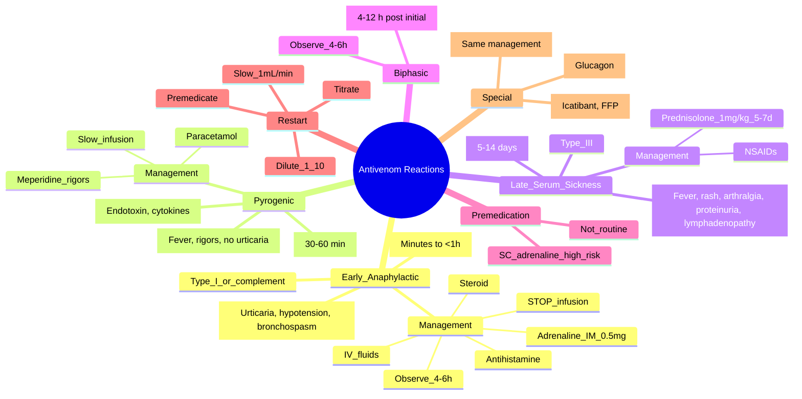

**Related:** [[Antivenom: Principles, Types, and Administration]], [[General Principles of Envenomation]], [[Clinical Assessment and Scoring Systems]], [[Hymenoptera Stings (Bee, Wasp, Ant) and Anaphylaxis]], [[Envenomation MOC]]

> [!important]
> **Antivenom reactions: Early anaphylactic (minutes, Type I), Pyrogenic (30–60 min), Late serum sickness (5–14 days, Type III). Early: STOP infusion → IM adrenaline 0.5 mg (1:1000) → IV fluids → chlorphenamine 10 mg IV → hydrocortisone 200 mg IV. Serum sickness: prednisolone 1 mg/kg/day × 5–7 days. Premedication not routine. Restart AV slow if essential after reaction controlled.**

---

## 1. Learning Objectives
- [ ] Classify antivenom adverse reactions by timing and pathophysiology
- [ ] Recognise and manage early anaphylactic reactions
- [ ] Recognise and manage pyrogenic reactions
- [ ] Recognise and manage late serum sickness
- [ ] Apply restart protocol after reaction
- [ ] Decide on premedication based on risk
- [ ] Recognise and manage biphasic anaphylaxis
- [ ] Apply to FCPS/MRCP clinical scenarios

---

## 2. Classification of Antivenom Reactions

| Reaction Type | Timing | Pathophysiology | Incidence |
|---|---|---|---|
| **Early anaphylactic (Type I)** | Minutes to < 1 h | IgE-mediated OR direct complement activation by Fc | 5–20% (higher with whole IgG) |
| **Pyrogenic (febrile)** | 30–60 min | Contaminating endotoxins / pyrogens; cytokine release | 5–30% (more with older products) |
| **Late serum sickness (Type III)** | 5–14 days | Immune complex deposition (IgG/IgM + antigen) | 5–20% (higher with high dose) |
| **Anaphylactoid (non-IgE)** | Minutes | Direct mast cell degranulation by AV proteins | Variable |

---

## 3. Early Anaphylactic Reaction

### Pathophysiology

| Mechanism | Detail |
|---|---|
| **Type I (true IgE-mediated)** | Previous sensitisation to animal proteins (horse/sheep); re-exposure → IgE cross-links FcεRI on mast cells → degranulation |
| **Anaphylactoid (non-IgE)** | Direct mast cell degranulation by antivenom proteins/complement activation; no prior sensitisation needed |
| **Complement activation** | Fc portion of whole IgG activates classical complement → C3a, C5a (anaphylatoxins) → mast cell degranulation |

### Clinical Features

| System | Features |
|---|---|
| **Skin** | Urticaria, angioedema (lips, tongue, periorbital), flushing, pruritus |
| **Respiratory** | Bronchospasm (wheeze, stridor), hoarseness, laryngeal oedema, hypoxia |
| **Cardiovascular** | Hypotension, tachycardia, syncope, shock, arrhythmia |
| **GI** | Nausea, vomiting, abdominal pain, diarrhoea |
| **Neurological** | Anxiety, sense of impending doom, confusion, loss of consciousness |

### Management Algorithm

| Step | Action | Dose / Detail |
|---|---|---|
| **1. STOP infusion** | Immediately; do not restart until reaction controlled | Keep IV line open with saline |
| **2. IM Adrenaline** | **First-line** | **0.5 mg IM (1:1000) into anterolateral thigh**; repeat every 5 min if needed |
| **3. IV fluids** | Rapid crystalloid bolus | 500–1000 mL NS or Hartmann's; for hypotension |
| **4. Oxygen** | High-flow via mask | Target SpO₂ > 94% |
| **5. Antihistamine** | Chlorphenamine | 10 mg IV (or 4 mg oral) |
| **6. Corticosteroid** | Hydrocortisone | 200 mg IV (anti-inflammatory; effect delayed 4–6 h) |
| **7. Nebulised salbutamol** | If bronchospasm | 5 mg neb; repeat PRN |
| **8. Monitor** | Continuous | BP, HR, RR, SpO₂, urine output |
| **9. Refractory hypotension** | Adrenaline infusion | 1 mg in 100 mL saline at 1–10 mL/min titrated |
| **10. Cardiac arrest** | ALS protocol | IV/IO adrenaline 1 mg every 3–5 min |
| **11. Biphasic watch** | Observe ≥ 4–6 h after resolution | Second phase in 4–12 h possible |
| **12. Document & report** | Allergy band, drug chart | Critical for future AV choices |

### Restarting AV After Reaction

| Step | Action |
|---|---|
| **1. Indication reassessment** | Is AV still essential? If not, stop |
| **2. Wait** | 15–30 min after reaction fully controlled |
| **3. Premedicate** | Chlorphenamine 10 mg IV + Hydrocortisone 200 mg IV (some add ranitidine 50 mg IV) |
| **4. Dilute more** | 1:10 dilution in saline |
| **5. Start slow** | 1 mL/min for 30 min |
| **6. Titrate up** | If tolerated, increase to standard rate over 2–4 h |
| **7. Have adrenaline drawn up** | Ready to administer if reaction recurs |
| **8. Consider alternative** | Monospecific AV, ovine product, or different brand |

---

## 4. Pyrogenic (Febrile) Reaction

### Pathophysiology

| Cause | Detail |
|---|---|
| **Endotoxin contamination** | Older antivenom products may have bacterial endotoxins (lipopolysaccharide) |
| **Cytokine release** | AV aggregates activate macrophages → IL-1, IL-6, TNF → fever |
| **Anticomplementary activity** | Complement activation by aggregates |

### Clinical Features

| Feature | Detail |
|---|---|
| **Timing** | 30–60 min into infusion |
| **Fever** | 38–40°C with rigors, chills |
| **Other** | Headache, myalgia, malaise; **NO urticaria, hypotension, or bronchospasm** |
| **Self-limiting** | Resolves in 1–2 h after stopping infusion |

### Management

| Step | Action | Dose |
|---|---|---|
| **1. Slow/stop infusion** | Slow to 1:2 rate; stop if severe | Reassess |
| **2. Antipyretic** | Paracetamol | 1 g IV or oral |
| **3. Cooling** | Tepid sponging, fan | For > 39°C |
| **4. Meperidine (pethidine)** | For severe rigors | 25–50 mg IV (or morphine 5 mg IV) |
| **5. Monitor** | Temperature, vitals | Hourly |
| **6. Restart slow** | If symptoms resolve | At 50% previous rate |
| **7. Differential** | Rule out sepsis, venom reaction | Blood cultures if febrile > 24 h |

---

## 5. Late Serum Sickness (Type III Hypersensitivity)

### Pathophysiology

| Step | Detail |
|---|---|
| **1. Antigen exposure** | Foreign animal protein (horse/sheep) injected |
| **2. Antibody formation** | IgG/IgM against animal protein (5–14 d) |
| **3. Immune complex** | Antigen-antibody complex formation |
| **4. Complement activation** | Classical pathway → C3a, C5a |
| **5. Deposition** | In vessel walls, glomeruli, joints, skin |
| **6. Inflammation** | Neutrophil recruitment, vasculitis, tissue damage |

### Clinical Features

| System | Features | Timing |
|---|---|---|
| **Constitutional** | Fever, malaise, myalgia | 5–14 d post AV |
| **Skin** | Urticarial or maculopapular rash, pruritus | 5–14 d |
| **Joints** | Polyarthralgia, arthritis (often MCP, knee) | 7–14 d |
| **Renal** | Proteinuria, glomerulonephritis (mild) | 7–14 d |
| **Lymphatic** | Lymphadenopathy | 5–14 d |
| **Cardiac** | Pericarditis (rare) | 7–14 d |
| **Neurological** | Peripheral neuropathy, Guillain-Barré-like (rare) | 7–21 d |

### Management

| Severity | Treatment |
|---|---|
| **Mild** (rash, arthralgia only) | NSAIDs (ibuprofen 400 mg TDS) + antihistamine; supportive |
| **Moderate** (fever, severe rash, joint swelling) | **Prednisolone 1 mg/kg/day × 5–7 days** + NSAIDs + antihistamine |
| **Severe** (glomerulonephritis, neuropathy) | Prednisolone 1 mg/kg/day × 2–3 weeks, taper; ± IVIG; ± plasmapheresis |
| **Discontinue AV** | If still being given, stop and switch to alternative if needed |
| **Supportive** | Rest, hydration, monitor renal function |
| **Prevention** | Limit AV dose, use F(ab')₂ when possible |

---

## 6. Biphasic Anaphylaxis

| Feature | Detail |
|---|---|
| **Definition** | Recurrence of anaphylaxis symptoms 4–12 h (up to 72 h) after initial resolution |
| **Incidence** | 1–20% of anaphylaxis cases |
| **Risk factors** | Severe initial reaction, delayed adrenaline, oral allergen, asthma |
| **Mechanism** | Late-phase inflammatory response; ongoing antigen absorption |
| **Management** | Prolonged observation (≥ 4–6 h, or 12–24 h if severe); patient education; emergency action plan; prednisolone PO × 3 d may reduce (controversial) |
| **Discharge criteria** | Symptom-free ≥ 4 h off treatment, written action plan, EpiPen if appropriate |

---

## 7. Special Considerations

### Patients on β-Blockers

| Issue | Detail |
|---|---|
| **Problem** | Blunted response to adrenaline; refractory hypotension |
| **Solution** | Glucagon 1–5 mg IV bolus, then infusion; higher adrenaline doses; consider vasopressin |
| **Alternative** | Atropine for bradycardia; IV fluids |

### Patients on ACE Inhibitors

| Issue | Detail |
|---|---|
| **Problem** | Increased risk of severe angioedema (bradykinin-mediated) |
| **Solution** | Stop ACEi; **avoid NSAIDs**; treat with adrenaline + antihistamine + steroids; consider icatibant (bradykinin B2 antagonist) or fresh frozen plasma (contains ACE) |

### Pregnancy

| Issue | Detail |
|---|---|
| **Concern** | AV may cause anaphylaxis → maternal/fetal compromise |
| **Approach** | Same management as non-pregnant; F(ab')₂ preferred; **faster AV, more aggressive resuscitation**; left lateral decubitus; consider early delivery if viable |

---

## 8. Premedication — Evidence-Based Approach

| Recommendation | Detail |
|---|---|
| **Routine premedication** | **NOT recommended** — no evidence of reduced anaphylaxis; delays treatment; adds cost |
| **High-risk (atopic, asthma, previous AV reaction)** | Consider **SC adrenaline 0.25 mg** 5 min before AV (controversial) |
| **Resuscitation readiness** | **ALWAYS** — IV access, adrenaline drawn up, O₂, suction |
| **Adrenaline protocol** | 0.25 mg SC for high-risk (some add H1/H2 antihistamine) |
| **Steroid prophylaxis** | NOT effective for acute anaphylaxis; **only for late serum sickness** |

---

## 9. Differential Diagnosis of "Reaction" During Antivenom

| Condition | Distinguishing Features |
|---|---|
| **Anaphylaxis to AV** | Urticaria, hypotension, bronchospasm; **minutes** into infusion |
| **Pyrogenic reaction** | Fever, rigors; **30–60 min**; no urticaria/hypotension |
| **Rapid envenomation progression** | New neurotoxicity, coagulopathy worsening — **disease not reaction** |
| **Anxiety / panic** | Tachypnoea, paraesthesia, normal exam |
| **Vasovagal** | Bradycardia, hypotension, pallor; responds to supine + fluids |
| **Pulmonary oedema (envenomation)** | Bilateral crackles, pink frothy sputum, hypoxia |
| **Sepsis (secondary)** | Fever, leucocytosis, focus; **delayed 24–72 h** |
| **Antivenom-related ARDS** | Acute hypoxia, bilateral infiltrates, after AV infusion |

---

## 10. Monitoring & Documentation

| Parameter | Frequency | Duration |
|---|---|---|
| **Vitals (HR, BP, RR, SpO₂, Temp)** | q15min × 1h, q30min × 4h, q1h × 24h | During admission |
| **Bite site** | Hourly for swelling, erythema | 24 h |
| **Coagulation (INR, fibrinogen, platelets)** | 6-hourly | Until stable |
| **Renal (U&E, creatinine, CK, urine)** | 12-hourly | Until stable |
| **Allergy symptoms** | Continuous | During infusion |
| **Serum sickness signs** | Daily from day 5 | Up to 21 d |
| **Drug chart documentation** | Each dose + reaction | Permanent |
| **Allergy band** | On identification | Permanent |
| **Patient education** | Before discharge | Discharge |

---

## 11. FCPS/MRCP High-Yield Summary

| Fact | Detail |
|---|---|
| **Early anaphylaxis timing** | Minutes to < 1 h into infusion |
| **Early anaphylaxis management** | STOP → IM adrenaline 0.5 mg (1:1000) → IV fluids → chlorphenamine 10 mg IV → hydrocortisone 200 mg IV |
| **Adrenaline route** | **IM** (anterolateral thigh) preferred over IV (safer, faster) |
| **Adrenaline IV dose** | 1 mg in cardiac arrest or refractory shock (1 mg in 100 mL saline infusion) |
| **Pyrogenic reaction timing** | 30–60 min |
| **Pyrogenic management** | Slow infusion, paracetamol, meperidine for rigors |
| **Serum sickness timing** | 5–14 days |
| **Serum sickness type** | Type III (immune complex) |
| **Serum sickness management** | Prednisolone 1 mg/kg/day × 5–7 days |
| **Premedication** | Not routine; SC adrenaline in high-risk |
| **Restart AV after reaction** | Premedicate (chlorphenamine + hydrocortisone), dilute 1:10, start 1 mL/min, titrate up |
| **Biphasic anaphylaxis** | 4–12 h post initial; observe ≥ 4–6 h |
| **β-blocker + anaphylaxis** | Refractory; glucagon 1–5 mg IV |
| **ACEi + angioedema** | Icatibant or FFP |
| **Whole IgG reactions** | More common (Fc-mediated complement) |
| **F(ab')₂ reactions** | Fewer than whole IgG |
| **CroFab reactions** | Fewer (Fab) but more recurrence (short t½) |
| **Skin test** | NOT recommended |
| **Antihistamines alone** | Insufficient for anaphylaxis |
| **Steroids alone** | Insufficient for anaphylaxis (delayed 4–6 h) |
| **Adrenaline delay** | Increases mortality |

---

## 12. Viva Questions (10)

**Q1: Classify antivenom adverse reactions by timing and pathophysiology.**
A: Three types: (1) Early anaphylactic — minutes to < 1 h, Type I (IgE) or anaphylactoid (complement/Fc); (2) Pyrogenic — 30–60 min, endotoxin contamination / cytokine release; (3) Late serum sickness — 5–14 d, Type III (immune complex).

**Q2: How do you manage early anaphylactic reaction to antivenom?**
A: STOP infusion → IM adrenaline 0.5 mg (1:1000) anterolateral thigh (repeat every 5 min PRN) → high-flow O₂ → IV fluids 500–1000 mL → chlorphenamine 10 mg IV → hydrocortisone 200 mg IV → monitor → observe ≥ 4–6 h for biphasic.

**Q3: Why is IM adrenaline preferred over IV for anaphylaxis?**
A: IM is safer (lower risk of arrhythmia, hypertensive crisis), easier (no IV access needed), faster absorption than SC, and easier to titrate than IV bolus. IV adrenaline reserved for cardiac arrest or refractory shock with monitoring.

**Q4: What is serum sickness and how is it managed?**
A: Type III hypersensitivity (immune complex deposition) at 5–14 d post AV. Features: fever, urticarial rash, polyarthralgia, proteinuria, lymphadenopathy. Management: prednisolone 1 mg/kg/day × 5–7 days + NSAIDs + antihistamine. Severe (glomerulonephritis, neuropathy): IVIG or plasmapheresis.

**Q5: How do you restart antivenom after an early anaphylactic reaction?**
A: Reassess indication → wait 15–30 min after full control → premedicate (chlorphenamine 10 mg IV + hydrocortisone 200 mg IV) → dilute AV 1:10 → start at 1 mL/min for 30 min → titrate up over 2–4 h if tolerated → have adrenaline ready → consider alternative product.

**Q6: Should premedication be given before antivenom?**
A: Not routine (no evidence of benefit, delays treatment). Consider SC adrenaline 0.25 mg in high-risk (atopic, asthma, previous AV reaction). **Resuscitation readiness is more important than routine premedication.**

**Q7: What is biphasic anaphylaxis?**
A: Recurrence of anaphylaxis 4–12 h (up to 72 h) after initial resolution. Occurs in 1–20% of cases. Risk factors: severe initial reaction, delayed adrenaline, asthma, oral allergen. Management: observe ≥ 4–6 h after resolution, patient education, action plan, consider oral prednisolone × 3 d (controversial).

**Q8: How does antivenom cause anaphylaxis?**
A: Three mechanisms: (1) Type I (true IgE) — prior sensitisation to animal proteins (horse/sheep); (2) Anaphylactoid — direct mast cell degranulation by AV proteins; (3) Complement activation — Fc portion of whole IgG activates C3a/C5a (more with whole IgG than F(ab')₂).

**Q9: How do you manage anaphylaxis in a patient on β-blockers?**
A: β-blockade blunts adrenaline response → refractory hypotension. Treatment: glucagon 1–5 mg IV bolus, then infusion (1–5 mg/h); higher adrenaline doses; IV fluids; atropine for bradycardia; consider vasopressin. Stop β-blocker if possible.

**Q10: What is the differential of "reaction" during antivenom infusion?**
A: Anaphylaxis (urticaria, hypotension, bronchospasm); pyrogenic reaction (fever 30–60 min); rapid envenomation progression (new neurotoxicity, coagulopathy); anxiety/panic; vasovagal (bradycardia); envenomation-related pulmonary oedema; ARDS; secondary sepsis (delayed).

---

## 13. Confusions & Mnemonics

| Confusion | Clarification |
|---|---|
| Antihistamines treat anaphylaxis | NO — adjunct only; **adrenaline is first-line** |
| Steroids are first-line for anaphylaxis | NO — delayed (4–6 h); adjunct only |
| IV adrenaline is better than IM | NO — IM safer; IV only in arrest or refractory shock |
| Skin test prevents anaphylaxis | NO — not recommended; poor PPV |
| Premedication routine | NO — not routine; resuscitation readiness > |
| Serum sickness = anaphylaxis | NO — different timing (5–14 d), different type (III vs I) |
| AV can be given despite reaction | YES — if essential, restart slow with premedication |
| Pyrogenic = anaphylaxis | NO — pyrogenic = fever, no urticaria/hypotension |
| Adrenaline only once | NO — repeat every 5 min if needed |
| Steroids prevent anaphylaxis | NO — used for late serum sickness only |

**Mnemonics:**
- **Early anaphylaxis management**: **S**top, **A**drenaline IM 0.5 mg, **F**luids, **A**ntihistamine (chlorphenamine 10 mg), **S**teroid (hydrocortisone 200 mg) = **SAFAS**
- **Adrenaline route**: **I**M **M**uscle (thigh) **M**aximum safety = **IMM**
- **Pyrogenic timing**: **3**0–**6**0 min = **36**
- **Serum sickness timing**: **5**–**1**4 d = **5–14**
- **Serum sickness features**: **F**ever, **R**ash, **A**rthralgia, **P**roteinuria, **L**ymphadenopathy = **FRAPL**
- **Serum sickness treatment**: **P**rednisolone 1 mg/kg × **5**–**7** d = **P-57**
- **Reaction types**: **E**arly (anaphylactic), **P**yrogenic, **L**ate (serum sickness) = **EPL**
- **Restart AV**: **S**low, **D**ilute, **P**remed = **SDP**
- **β-blocker rescue**: **G**lucagon = **G**
- **Anaphylaxis numbers**: **0.5 mg IM, 1:1000, q5min, anterolateral thigh**

---

## 14. Mind Map

---

## 15. One-Page Revision Card

| Reaction | Timing | Management |
|---|---|---|
| **Early anaphylactic** | < 1 h | STOP → IM adrenaline 0.5 mg → IV fluids → chlorphenamine 10 mg IV → hydrocortisone 200 mg IV |
| **Pyrogenic** | 30–60 min | Slow infusion → paracetamol → meperidine for rigors |
| **Late serum sickness** | 5–14 d | Prednisolone 1 mg/kg/day × 5–7 d + NSAIDs + antihistamine |
| **Biphasic** | 4–12 h | Observe ≥ 4–6 h after resolution |
| **Restart AV** | After reaction | Premedicate (chlor + hydro) → dilute 1:10 → start 1 mL/min → titrate |
| **Premedication** | Before AV | Not routine; SC adrenaline in high-risk |
| **β-blocker** | With anaphylaxis | Glucagon 1–5 mg IV |
| **ACEi** | With angioedema | Icatibant / FFP |

---

## 16. Spaced Repetition Trackers

| Interval | Date | Score (1–5) | Notes |
|---|---|---|---|
| **24 h** | | | Reaction types, early management, serum sickness timing |
| **3 d** | | | Adrenaline route, restart protocol, monitoring |
| **7 d** | | | Pathophysiology, biphasic, special populations |
| **14 d** | | | Viva, mnemonics, MCQ/SBA |
| **30 d** | | | Integrate with Antivenom Principles, Hymenoptera |
| **90 d** | | | Comprehensive exam recall |

---

## 17. Self-Test Scorecard

| Section | Score /5 |
|---|---|
| Reaction classification | |
| Early anaphylaxis management | |
| Adrenaline route & dose | |
| Pyrogenic management | |
| Serum sickness features & Rx | |
| Biphasic anaphylaxis | |
| Restart protocol | |
| Premedication | |
| Special populations (β-blocker, ACEi, pregnancy) | |
| Monitoring & documentation | |

---

## 18. Exam Answer Modes (5)

| Mode | Prompt | Key Points |
|---|---|---|
| **Long Essay** | "Antivenom reactions" | Three types, pathophysiology, management, restart, monitoring |
| **Short Note** | "Serum sickness" | Type III, 5–14 d, features, prednisolone 1 mg/kg × 5–7 d |
| **Viva** | "Anaphylaxis to antivenom — management?" | STOP → IM adrenaline 0.5 mg → fluids → chlorphenamine → hydrocortisone |
| **Ward Round** | "Patient develops urticaria and wheeze 10 min into AV" | STOP, IM adrenaline, fluids, chlorphenamine, hydrocortisone, observe 4–6 h, restart if essential |
| **Last-Night** | "Reaction key numbers" | 0.5 mg IM, 1:1000, 5–14 d serum sickness, prednisolone 1 mg/kg × 5–7 d |

---

## 19. MCQs (10)

1. **Early anaphylactic reaction to antivenom typically occurs within:**
   A. 1–2 h
   B. **Minutes (typically < 30 min)**
   C. 6–12 h
   D. 24 h
   E. 5–14 d

2. **First-line treatment for antivenom-induced anaphylaxis:**
   A. IV antihistamine
   B. IV steroid
   C. **IM adrenaline 0.5 mg (1:1000)**
   D. Stop infusion only
   E. IV fluid only

3. **Pyrogenic (febrile) reaction typically occurs at:**
   A. Immediately
   B. **30–60 min**
   C. 2–4 h
   D. 12–24 h
   E. 5–14 d

4. **Late serum sickness reaction typically occurs at:**
   A. 1–2 h
   B. 6–12 h
   C. **5–14 days**
   D. 21–28 d
   E. 1 month

5. **Serum sickness pathogenesis:**
   A. IgE-mediated
   B. **Immune complex deposition (Type III)**
   C. T-cell mediated (Type IV)
   D. Direct toxicity
   E. Complement only

6. **Treatment of antivenom serum sickness:**
   A. Antihistamines alone
   B. **Prednisolone 1 mg/kg/day × 5–7 days**
   C. IVIG only
   D. Plasmapheresis
   E. Antimalarials

7. **Premedication before antivenom:**
   A. Routine
   B. **Not routinely recommended (no proven benefit)**
   C. Only for children
   D. Only for polyspecific AV
   E. Only for pregnant

8. **Restart protocol after early anaphylactic reaction — correct sequence:**
   A. Continue at same rate
   B. **Stop, treat, premedicate (chlor + hydro), dilute 1:10, restart slow**
   C. Never restart
   D. Switch to monospecific only
   E. Give SC

9. **Biphasic anaphylaxis — second phase timing:**
   A. 1–2 h
   B. **4–12 h after initial**
   C. 24 h
   D. 48 h
   E. 1 week

10. **Adrenaline IM preferred over IV bolus because:**
    A. Longer duration
    B. **Lower risk of arrhythmia, easier to titrate**
    C. More potent
    D. Less pain
    E. Faster onset

---

## 20. SBA Questions (5)

1. **20 min into AV infusion: urticaria, wheeze, BP 80/50, HR 130. First action?**
   A. IV chlorphenamine
   B. **STOP infusion, IM adrenaline 0.5 mg**
   C. IV hydrocortisone
   D. Oral prednisolone
   E. Continue slower

2. **10 d after AV: fever, urticarial rash on trunk, joint pain, mild proteinuria. Diagnosis and Rx?**
   A. Anaphylaxis — adrenaline
   B. **Serum sickness — prednisolone 1 mg/kg × 5–7 d + NSAIDs + antihistamine**
   C. Sepsis — antibiotics
   D. AV reaction — chlorphenamine
   E. Disease progression — repeat AV

3. **Patient on atenolol develops AV anaphylaxis. BP remains 70/40 despite 2 doses IM adrenaline. Best next step?**
   A. More IM adrenaline
   B. IV adrenaline bolus
   C. **Glucagon 1–5 mg IV bolus, then infusion; IV fluids**
   D. IV hydrocortisone
   E. Noradrenaline

4. **40 min into AV: fever 39.5°C, rigors, no urticaria, BP stable. Diagnosis and Rx?**
   A. Anaphylaxis — adrenaline
   B. Sepsis — antibiotics
   C. **Pyrogenic reaction — slow infusion, paracetamol, meperidine for rigors**
   D. Serum sickness — prednisolone
   E. Disease progression

5. **After early anaphylaxis to AV, vital signs stable, still needs AV. Best restart strategy?**
   A. Restart same rate
   B. **Premedicate (chlorphenamine + hydrocortisone), dilute 1:10, start 1 mL/min, titrate, monitor**
   C. Switch to oral AV
   D. Never restart
   E. Give IM

---

## 21. Local Navigation

- [[Antivenom: Principles, Types, and Administration]]
- [[General Principles of Envenomation]]
- [[Clinical Assessment and Scoring Systems]]
- [[Hymenoptera Stings (Bee, Wasp, Ant) and Anaphylaxis]]
- [[Snake Envenomation: Specific Antivenom Protocols]]
- [[Envenomation MOC]]