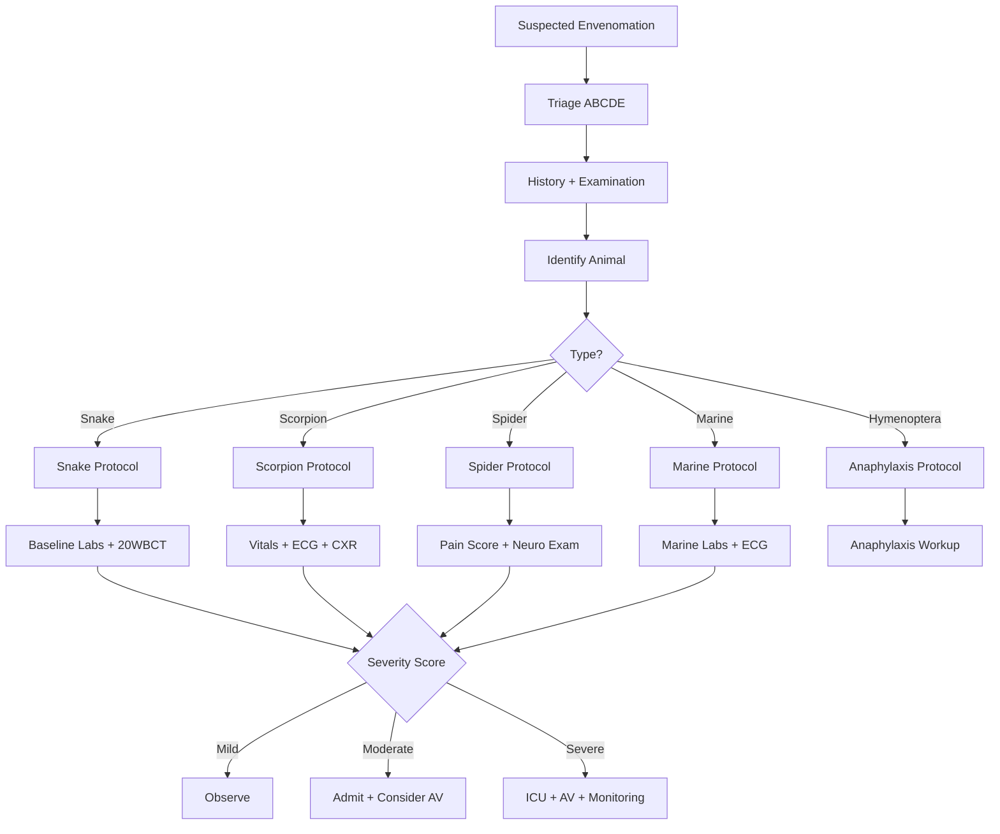
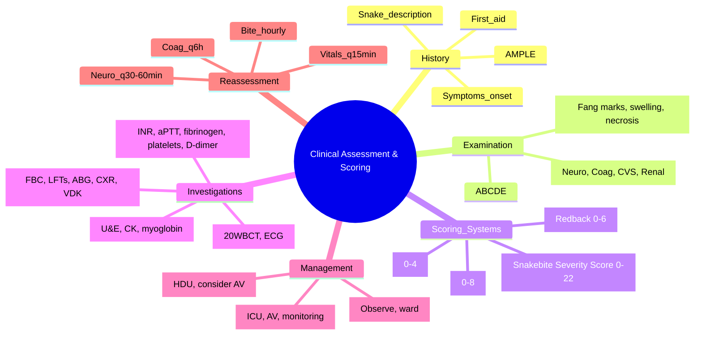

**Related:** [[General Principles of Envenomation]], [[Snake Envenomation: Clinical Syndromes (Elapid vs Viperid)]], [[Scorpion Sting Envenomation]], [[Spider Bite Envenomation (Latrodectism, Loxoscelism)]], [[Envenomation MOC]]

> [!important]
> **Structured assessment = saves lives. Use validated scoring systems for triage, antivenom decisions, and prognosis. Key systems: WHO Snakebite Grading (0–4), Snakebite Severity Score (SSS), 20WBCT, SCORPION Score, Redback Spider (RADS) Score.**

---

## 1. Learning Objectives
- [ ] Apply structured clinical assessment (history, examination, investigations) to envenomation
- [ ] Use WHO Snakebite Grading (0–4) and Snakebite Severity Score (SSS) for triage and antivenom decisions
- [ ] Perform and interpret the 20-Minute Whole Blood Clotting Test (20WBCT)
- [ ] Use SCORPION Score for scorpion sting severity
- [ ] Use Redback Spider (RADS) Score for *Latrodectus* envenomation
- [ ] Recognise limitations of scoring systems and integrate them with clinical judgement

---

## 2. Definition & Epidemiology

| Item | Detail |
|---|---|
| **Assessment goal** | Confirm envenomation, grade severity, guide antivenom decision, predict prognosis |
| **Epidemiology** | ~5 million snakebites/year globally; ~100,000 deaths; 400,000 amputations; 95% in rural tropics |
| **Time-critical** | Neurotoxic envenomation can kill in 30–120 min (respiratory failure); coagulopathy in 6–24 h |
| **Most common pitfall** | Delayed assessment → delayed antivenom → irreversible organ damage |

---

## 3. Aetiology & Pathophysiology of Assessment Targets

| Target | Pathophysiology | Clinical Sign |
|---|---|---|
| **Local tissue** | SVMPs, cytotoxins, PLA₂ | Pain, swelling, necrosis, ecchymosis, blistering, compartment syndrome |
| **Neuromuscular** | Pre/post-synaptic neurotoxins, ion channel toxins | Ptosis, ophthalmoplegia, dysphagia, descending paralysis |
| **Coagulation** | Procoagulants (RVV-V/X), fibrinogenolysis, haemorrhagins | Bleeding, VICC, intracranial haemorrhage |
| **Cardiovascular** | Cardiotoxins, autonomic storm (scorpion, box jelly) | Hypotension, hypertension, arrhythmia, pulmonary oedema |
| **Renal** | Myoglobinuria, haemoglobinuria, direct nephrotoxins | AKI, oliguria, myoglobinuria |
| **Allergic** | IgE-mediated (hymenoptera), anaphylactoid (antivenom) | Urticaria, angioedema, bronchospasm |

---

## 4. Clinical Features / History & Examination

### History (AMPLE + Envenomation Specific)

| Component | Key Questions |
|---|---|
| **Allergy** | Previous antivenom reactions, snake/spider allergy |
| **Medication** | Anticoagulants, antiplatelets, immunosuppression, β-blockers (worsen anaphylaxis) |
| **Past medical** | Coagulopathy, renal disease, pregnancy, G6PD, previous envenomation |
| **Last meal** | Time (for anaesthesia if intubation needed) |
| **Event** | Time of bite, location, snake description (colour, length, head shape, behaviour), number of bites |
| **First aid** | PIB, tourniquet, incision, ice, herbal — ALL affect assessment |
| **Symptoms** | Pain, vomiting, diplopia, ptosis, dysphagia, bleeding, dark urine, sweating |
| **Tetanus** | Last booster, immunisation status |

### Examination (Systematic)

| System | Findings to Look For |
|---|---|
| **Local** | Fang marks (1 or 2), swelling extent (measure), tenderness, ecchymosis, bullae, necrosis, lymphangitis, regional nodes |
| **Airway/Breathing** | Bulbar palsy (ptosis, dysarthria), respiratory rate, depth, SpO₂, paradoxical breathing, accessory muscle use |
| **Circulation** | HR, BP, capillary refill, JVP, rhythm (scorpion/marine → arrhythmia) |
| **Neurology** | GCS, pupils (size/reactivity), extraocular movements, facial symmetry, gag reflex, motor power (proximal/distal, all limbs), reflexes, sensation |
| **Coagulation** | Bleeding from bite site, gums, IV sites, petechiae, ecchymosis |
| **Renal** | Urine output (catheter if severe), colour (myoglobin/haemoglobin) |
| **Abdomen** | Hepatosplenomegaly, distension, tenderness |

---

## 5. Classification / Staging / Grading

### WHO Snakebite Grading (Global Standard)

| Grade | Definition | Antivenom? |
|---|---|---|
| **0** | Dry bite (no venom injected) | No — observe 12–24 h |
| **1** | Minimal envenomation (local swelling, no systemic) | Usually no — observe |
| **2** | Moderate envenomation (local + mild systemic: nausea, vomiting, mild coagulopathy) | Yes — if coagulopathy |
| **3** | Severe envenomation (extensive local, severe systemic: neurotoxicity, VICC, AKI) | **Yes — urgent** |
| **4** | Life-threatening (shock, respiratory failure, major bleeding, coma) | **Yes — emergency** |

### Snakebite Severity Score (SSS) — Dart 1996

| Component | Score |
|---|---|
| **Pulmonary** (symptoms + signs of respiratory failure) | 0–3 |
| **Cardiovascular** (HR, BP, rhythm) | 0–3 |
| **Local wound** (swelling extent, necrosis) | 0–4 |
| **GI** (vomiting, pain) | 0–3 |
| **Haematological** (PT/PTT, platelets, fibrinogen) | 0–3 |
| **CNS** (neurological signs) | 0–3 |
| **Maximum total** | **22** |

| SSS Total | Severity | Antivenom |
|---|---|---|
| 0–3 | Mild | Consider if progression |
| 4–7 | Moderate | **Yes** |
| 8–22 | Severe | **Yes — urgent** |

### SCORPION Score

| Component | Points |
|---|---|
| Age > 10 years | 1 |
| Local signs (pain, swelling, erythema) | 1 |
| Systemic signs (vomiting, sweating, salivation) | 1 |
| CNS signs (agitation, confusion, seizure) | 1 |
| CVS signs (hypertension, tachycardia, pulmonary oedema) | 2 |
| Respiratory signs (wheeze, stridor, resp failure) | 2 |
| **Total** | **8** |

| Score | Severity | Management |
|---|---|---|
| 0–2 | Mild | Observe, analgesia |
| 3–5 | Moderate | ICU, consider antivenom |
| 6–8 | Severe | ICU, antivenom + supportive |

### Redback Spider (RADS) Score — *Latrodectus hasselti*

| Component | Points |
|---|---|
| Local pain severity (severe = 1) | 1 |
| Local sweating at bite site | 1 |
| Peripheral neurotoxicity (paraesthesia, fasciculation) | 2 |
| Systemic sweating | 1 |
| Hypertension | 1 |
| **Total** | **6** |

| Score | Severity | Antivenom |
|---|---|---|
| 0–1 | Mild | Analgesia, observe |
| 2–3 | Moderate | Consider antivenom |
| ≥4 | Severe | **Yes — antivenom** |

### 20-Minute Whole Blood Clotting Test (20WBCT)

| Parameter | Detail |
|---|---|
| **Technique** | 2 mL fresh venous blood into clean dry glass tube; leave undisturbed 20 min at room temp; tip tube gently to see if clot has formed |
| **Positive (abnormal)** | Clot fails to form or lyses → **consumption coagulopathy (VICC)** |
| **Negative (normal)** | Firm clot → coagulation intact |
| **Sensitivity** | ~85% for VICC; correlates with INR > 3 |
| **Advantages** | Bedside, cheap, no lab needed, detects fibrinogen <1 g/L |
| **Limitations** | Operator dependent, less sensitive than lab INR, doesn't detect platelet defects |

---

## 6. Diagnosis & Investigations

| Investigation | Indication | Timing | Interpretation |
|---|---|---|---|
| **20WBCT** | All snakebites | Baseline + 6-hourly | Clot absent → VICC, needs antivenom |
| **PT/INR** | All snakebites | Baseline + q6h | INR > 1.5 = VICC (viperid) |
| **aPTT** | All snakebites | Baseline + q6h | Less reliable than INR for viperid |
| **Fibrinogen** | Viperid bites | Baseline + q6h | <1 g/L = severe VICC |
| **D-dimer** | Viperid bites | Baseline + q6h | Elevated = fibrin breakdown |
| **Platelets** | All snakebites | Baseline + q6h | <50 × 10⁹/L = bleeding risk |
| **U&E, creatinine** | All snakebites, sea snake | Baseline + 12-hourly | AKI from myoglobinuria |
| **CK** | Sea snake, myotoxic viperids | Baseline + 12-hourly | >1000 IU/L = rhabdomyolysis |
| **Urinalysis** | All snakebites | Baseline + 6-hourly | Blood + no RBCs = myoglobinuria |
| **Urine myoglobin** | Sea snake, dark urine | Once | Confirms rhabdomyolysis |
| **FBC** | All | Baseline + daily | Hb, WCC, eosinophils (serum sickness) |
| **LFTs** | Severe envenomation | Baseline + daily | Hepatocellular injury |
| **ABG/lactate** | Severe envenomation | Baseline + PRN | Metabolic acidosis, hypoventilation |
| **TFTs** | Scorpion sting (rare) | Baseline | Transient thyroiditis |
| **ECG** | Scorpion, marine, cardiac symptoms | Baseline + PRN | QT, ST, arrhythmia |
| **CXR** | Scorpion, pulmonary oedema | Baseline + PRN | Pulmonary oedema, ARDS |
| **Tropical screen** | All snakebites | Baseline | Malaria, dengue, typhoid (co-endemic) |
| **Venom detection kit (VDK)** | Australia only | When available | Species-specific identification |

### Diagnostic Algorithm

---

## 7. Differential Diagnosis

| Condition | Distinguishing Features |
|---|---|
| **Panic attack** | Tachypnoea, paraesthesia, normal exam, no fang marks |
| **Dry bite** | Fang marks only, no local/systemic signs, normal 20WBCT |
| **Allergic reaction** | Urticaria, wheeze, no coagulopathy, no descending paralysis |
| **Cellulitis from bite** | Delayed (24–72 h), progressive erythema, fever, no coagulopathy |
| **Tetanus** | Trismus, opisthotonus, no fang marks, history of inadequate immunisation |
| **Septicaemia** | Fever, hypotension, no fang marks, positive blood cultures |
| **MI / PE** | Cardiac symptoms, no bite context, ECG changes, troponin/D-dimer |
| **Stroke** | Focal neuro deficit, no bite context, CT changes |
| **Vasovagal syncope** | Brief loss of consciousness, no fang marks, no coagulopathy |
| **Other poisoning** | Drug history, toxidrome, no bite context |

---

## 8. Management

| Step | Action |
|---|---|
| **1. First aid** | PIB (elapids), local pressure (viperids), immobilise, hot water (marine), vinegar (box jelly) |
| **2. Triage** | WHO grade + SSS → admit/ICU/discharge decision |
| **3. Supportive** | IV access ×2, fluids, O₂, analgesia, tetanus prophylaxis |
| **4. Antivenom** | Indicated by severity score + clinical signs (see Antivenom Principles) |
| **5. Monitor** | Serial 20WBCT, coagulation, neuro, renal, vitals |
| **6. Complications** | Anaphylaxis, compartment syndrome, AKI, ARDS, infection |
| **7. Disposition** | ICU (severe), HDU (moderate), ward (mild), discharge after 12–24 h observation if asymptomatic |

### Disposition Criteria

| Score | Setting | Duration |
|---|---|---|
| WHO 0, SSS 0–3, no progression | Ward observation | 12–24 h |
| WHO 1, SSS 4–7 | HDU with monitoring | 24–48 h |
| WHO 2, SSS 8–14 | ICU | Until stable + 24 h |
| WHO 3–4, SSS > 14 | ICU + ventilation/dialysis readiness | Days to weeks |

---

## 9. FCPS/MRCP High-Yield Summary

| Fact | Detail |
|---|---|
| **WHO Grade 0** | Dry bite — observe only |
| **WHO Grade 1** | Local only — observe, no AV |
| **WHO Grade 2** | Systemic mild, no coagulopathy — observe, AV if progression |
| **WHO Grade 3** | Severe systemic with coagulopathy — **AV urgent** |
| **WHO Grade 4** | Life-threatening — **AV emergency + ICU** |
| **SSS ≥ 4** | Antivenom indicated |
| **20WBCT** | Bedside coagulopathy test, 85% sensitive for VICC |
| **20WBCT positive** | Clot fails to form → INR usually >3, fibrinogen <1 g/L |
| **SCORPION ≥ 3** | ICU admission, consider AV |
| **Redback score ≥ 2** | Consider AV; ≥4 = AV |
| **Coagulation panel** | INR, aPTT, fibrinogen, D-dimer, platelets — q6h in viperid |
| **Renal panel** | U&E, creatinine, CK, urinalysis, myoglobin — q12h |
| **Neuro panel** | GCS, CN exam, motor, FVC — q30min–q1h in neurotoxic |
| **Vital signs** | q15min × 1h, q30min × 4h, q1h thereafter |
| **Sensitivity of VDK** | Australia only; identifies elapid species |
| **Pitfall** | SSS not validated for children; SCORPION limited; **always integrate with clinical picture** |
| **Reassessment** | Every 30–60 min early; do not rely on initial score |

---

## 10. Viva Questions (10)

**Q1: What is the WHO Snakebite Grading system?**
A: 5-level classification (0–4). Grade 0 = dry bite; Grade 1 = local only; Grade 2 = mild systemic without coagulopathy; Grade 3 = severe systemic with coagulopathy; Grade 4 = life-threatening (shock, respiratory failure, major bleeding).

**Q2: How do you perform a 20WBCT?**
A: 2 mL fresh venous blood in clean dry glass tube, leave undisturbed 20 min at room temp, then tilt gently. If clot forms = negative (normal). If clot absent or lyses = positive (VICC).

**Q3: What is the Snakebite Severity Score (SSS)?**
A: 6-component score (0–22): pulmonary, cardiovascular, local wound, GI, haematological, CNS. Each 0–3 or 0–4. Score ≥4 generally indicates need for antivenom.

**Q4: When would you admit a snakebite patient to ICU?**
A: WHO Grade 3 or 4, SSS ≥ 8, severe coagulopathy (INR >3, fibrinogen <1), neurotoxicity with respiratory compromise, cardiovascular instability, AKI requiring dialysis, or need for AV infusion with monitoring.

**Q5: How does the SCORPION score work?**
A: 8-point score based on age, local signs, systemic signs, CNS signs, CVS signs (2 pts), respiratory signs (2 pts). Score ≥3 suggests severe envenomation needing ICU and possibly antivenom.

**Q6: What is the Redback Spider (RADS) score?**
A: 6-point score: local pain (1), local sweating (1), peripheral neurotoxicity (2), systemic sweating (1), hypertension (1). Score ≥2 = consider AV; ≥4 = AV indicated.

**Q7: What investigations do you order for a snakebite?**
A: 20WBCT (bedside), PT/INR, aPTT, fibrinogen, D-dimer, platelets (coagulation), U&E/creatinine, CK, urinalysis/myoglobin (renal), FBC, LFTs, ABG/lactate, ECG, CXR, malaria screen (tropics), VDK (Australia).

**Q8: What is the limitation of the SSS?**
A: Not validated in children; doesn't include pregnancy; doesn't account for time since bite; subjective components (GI, local wound) vary between assessors; **always integrate with clinical picture and serial examination**.

**Q9: How often do you reassess a snakebite patient?**
A: Vitals q15min × 1 h, then q30min × 4 h, then q1h. Coagulation 6-hourly. Neuro exam 30–60 min until stable. Bite site hourly for swelling progression.

**Q10: How do you distinguish dry bite from early envenomation?**
A: Dry bite = fang marks only, no local swelling/pain progression, normal 20WBCT, normal labs at 6 and 12 h, asymptomatic at 24 h. **All snakebite patients should be observed minimum 12–24 h** to confirm.

---

## 11. Confusions & Mnemonics

| Confusion | Clarification |
|---|---|
| WHO Grade 1 = "local only" includes neurotoxic | NO — any systemic sign (even mild) = Grade 2 |
| 20WBCT replaces lab INR | NO — they are complementary; 20WBCT is bedside screen |
| SSS > 7 always needs AV | YES, but consider dose, type, and risk of reaction |
| Dry bite needs AV | NO — observe only |
| Antivenom always reverses coagulopathy | NO — repeat dose if INR/fibrinogen not corrected at 6 h |
| Marine envenomation needs same scoring as snake | NO — use specific protocols (hot water, vinegar) |

**Mnemonics:**
- **WHO grades**: **D**ry (0), **L**ocal (1), **M**ild systemic (2), **S**evere systemic (3), **L**ife-threatening (4) = **DLMSL**
- **SSS components**: **P**ulmonary, **C**ardiovascular, **L**ocal, **G**I, **H**aematological, **C**NS = **PCLGHC**
- **SCORPION**: **S**ystemic (1), **C**ardiovascular (2), **O**ther local (1), **R**espiratory (2), **P**atient age (1), **I**nflammation (1), **O**ut (CNS, 1) = scoring breakdown
- **20WBCT**: **2 mL, 20 min, glass tube** — three things to remember
- **AV indicated**: **N**euro, **C**oag, **C**VS, **R**enal, **S**evere local = **NCCRS**

---

## 12. Mind Map

---

## 13. One-Page Revision Card

| System | Threshold for AV | Action |
|---|---|---|
| **WHO Grade 0** | No | Observe 12–24 h |
| **WHO Grade 1** | No (observe) | Ward, monitor |
| **WHO Grade 2** | If progression | HDU, monitor |
| **WHO Grade 3** | **Yes** | ICU, AV, monitor |
| **WHO Grade 4** | **Yes — emergency** | ICU, AV, support |
| **SSS ≥ 4** | **Yes** | AV |
| **SSS 8+** | **Yes — urgent** | ICU |
| **20WBCT +ve** | **Yes (if systemic)** | AV |
| **INR > 1.5** | Yes (viperid) | AV |
| **Fibrinogen < 1 g/L** | Yes (VICC) | AV |
| **Platelets < 50** | Yes (if bleeding) | AV + platelets |
| **Neurotoxic + bulbar** | **Yes** | AV + intubate |
| **Rhabdomyolysis** | If severe | AV + fluids |
| **AKI** | If severe | AV + dialysis |

---

## 14. Spaced Repetition Trackers

| Interval | Date | Score (1–5) | Notes |
|---|---|---|---|
| **24 h** | | | WHO grades, 20WBCT, SSS components |
| **3 d** | | | SCORPION, RADS, lab panel, monitoring frequency |
| **7 d** | | | Differential, scoring interpretation, AV thresholds |
| **14 d** | | | Viva, mnemonics, clinical algorithm |
| **30 d** | | | Full recall, integrate with Antivenom & Snake topics |
| **90 d** | | | Comprehensive review, exam simulation |

---

## 15. Self-Test Scorecard

| Section | Score /5 |
|---|---|
| WHO Grading | |
| 20WBCT technique & interpretation | |
| SSS components & thresholds | |
| SCORPION score | |
| RADS score | |
| Lab panel & timing | |
| Differential diagnosis | |
| Reassessment frequency | |
| Disposition criteria | |
| Pitfalls & limitations | |

---

## 16. Exam Answer Modes (5)

| Mode | Prompt | Key Points |
|---|---|---|
| **Long Essay** | "Describe assessment of snakebite" | ABCDE, history, exam, WHO/SSS, labs, 20WBCT, AV decision, monitoring, disposition |
| **Short Note** | "20WBCT" | 2 mL blood, glass tube, 20 min, bedside coagulopathy, sensitivity, limitations |
| **Viva** | "How do you grade snakebite severity?" | WHO (0–4), SSS (0–22), 20WBCT, lab thresholds, integrate all |
| **Ward Round** | "Patient with snakebite 2 h ago, what now?" | ABCDE, history, exam, 20WBCT, labs, WHO/SSS grade, AV decision, monitor |
| **Last-Night** | "Key numbers for snakebite" | WHO grades 0–4, SSS ≥ 4, INR > 1.5, fibrinogen < 1, platelets < 50, AV reaction IM adrenaline 0.5 mg |

---

## 17. MCQs (10)

1. **WHO Snakebite Grading — Grade 3 indicates:**
   A. Dry bite
   B. Local envenomation only
   C. Mild systemic without coagulopathy
   D. **Severe systemic envenomation with coagulopathy or major systemic signs**
   E. Local pain only

2. **20WBCT positive result indicates:**
   A. Normal coagulation
   B. **Consumption coagulopathy (VICC)**
   C. Heparin effect
   D. Platelet dysfunction only
   E. Isolated factor deficiency

3. **Snakebite Severity Score (SSS) ≥ what score indicates antivenom?**
   A. 1
   B. 2
   C. 3
   D. **4**
   E. 10

4. **Snakebite Severity Score (SSS) — max total score:**
   A. 10
   B. 15
   C. **22**
   D. 25
   E. 30

5. **SCORPION score — which component gives 2 points?**
   A. Age > 10
   B. Local signs
   C. Systemic sweating
   D. **Cardiovascular signs (hypertension, pulmonary oedema)**
   E. CNS signs

6. **Redback Spider (RADS) score — peripheral neurotoxicity gives:**
   A. 0
   B. 1
   C. **2**
   D. 3
   E. 4

7. **Which is NOT a SSS component?**
   A. Pulmonary
   B. Cardiovascular
   C. Local wound
   D. GI
   E. **Serum electrolytes**

8. **For a viperid bite, coagulation panel includes all EXCEPT:**
   A. PT/INR
   B. aPTT
   C. Fibrinogen
   D. D-dimer
   E. **Bleeding time**

9. **Bedside coagulopathy test with 85% sensitivity for VICC:**
   A. Capillary refill
   B. **20WBCT**
   C. Activated clotting time
   D. Thromboelastography
   E. Prothrombin time

10. **How often to repeat coagulation panel in viperid envenomation?**
    A. Hourly
    B. 3-hourly
    C. **6-hourly**
    D. 12-hourly
    E. Daily

---

## 18. SBA Questions (5)

1. **45-year-old bitten by unidentified snake in India. 2 h later: local swelling to knee, INR 1.4, no systemic signs. WHO Grade and management?**
   A. Grade 0, observe
   B. **Grade 1 (local only), observe, repeat labs 6 h, AV if progression**
   C. Grade 3, immediate AV
   D. Grade 4, ICU
   E. Grade 2, antivenom

2. **Viperid bite, 6 h post. SSS = 9, INR 4.5, fibrinogen 0.5 g/L, platelets 30. Best action?**
   A. Observe, repeat 12 h
   B. **Admit ICU, give AV 10 vials, repeat coagulation at 6 h, repeat AV if not corrected**
   C. FFP only
   D. Heparin
   E. Aspirin

3. **Scorpion sting, 5-year-old. SCORPION score = 7 (severe). CXR: pulmonary oedema. Management?**
   A. Discharge with oral prazosin
   B. Ward observation only
   C. **ICU, oxygen, diuretic, prazosin, antivenom if available**
   D. Beta-blocker
   E. Antibiotics only

4. **Redback spider bite, severe pain, local sweating, fasciculations. RADS score 4. Best action?**
   A. Analgesia only
   B. **Antivenom IV + analgesia + observation**
   C. Discharge
   D. Tourniquet
   E. Ice

5. **Snakebite 4 h ago, asymptomatic, normal exam, normal 20WBCT, normal INR. Best management?**
   A. Immediate AV
   B. **Observe 12–24 h, repeat exam and labs at 6 and 12 h, AV if any change**
   C. Discharge immediately
   D. Tourniquet
   E. Surgical exploration

---

## 19. Local Navigation

- [[General Principles of Envenomation]]
- [[Snake Envenomation: Clinical Syndromes (Elapid vs Viperid)]]
- [[Snake Envenomation: Laboratory Investigation and Monitoring]]
- [[Scorpion Sting Envenomation]]
- [[Spider Bite Envenomation (Latrodectism, Loxoscelism)]]
- [[Antivenom: Principles, Types, and Administration]]
- [[Antivenom Adverse Reactions and Management]]
- [[Hymenoptera Stings (Bee, Wasp, Ant) and Anaphylaxis]]
- [[Envenomation MOC]]
- [[../Chapter 7 - Poisoning/General Toxicology Principles]] (cross-chapter)
- [[../Templates/Envenomation Topic Template]] (template reference)

## PasTest Scenario SBAs (Clinical Vignettes)

> **Auto-generated PasTest/Mediscope-style scenario SBAs** grounded in the authored source. Each scenario tests a real clinical fact (triad, specific sign, contraindication, trial, first-line Rx) extracted from the topic. *Source: Ch 12: Envenomation — Clinical Assessment and Scoring Systems*

**Q1.** Which of the following features is most specific or characteristic of Clinical Assessment and Scoring Systems?

  - **A.** Venom detection kit
  - **B.** A feature common to many acute inflammatory conditions
  - **C.** A non-specific sign that does not localise the diagnosis
  - **D.** An investigation finding rather than a clinical feature

  > **Answer: A** — Venom detection kit
  >
  > *Source:* RDS |
| **Tropical screen** | All snakebites | Baseline | Malaria, dengue, typhoid (co-endemic) |
| **Venom detection kit (VDK)** | Australia only | When available | Species-specific identification |

