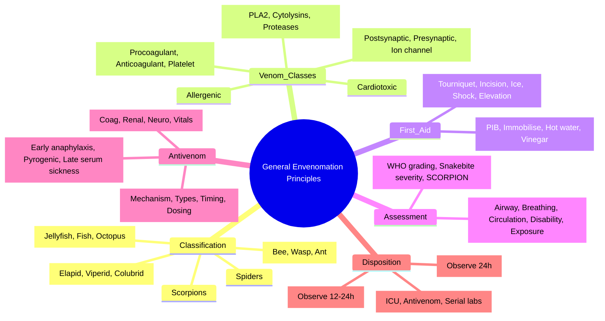
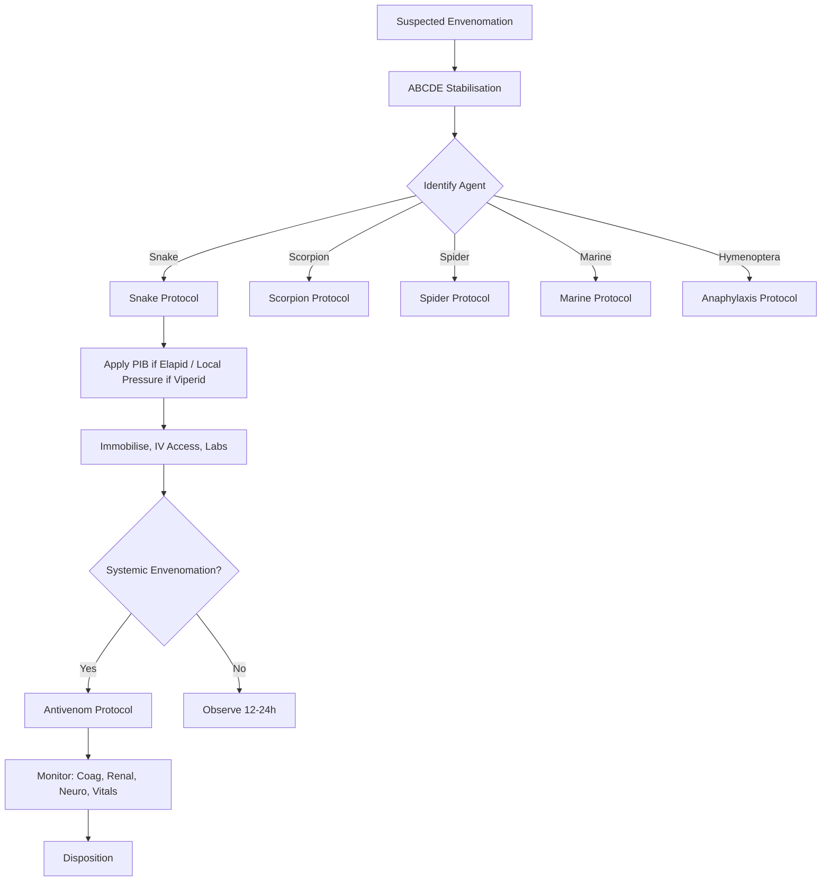

**Related:** [[Clinical Assessment and Scoring Systems]], [[Antivenom: Principles, Types, and Administration]], [[Snake Envenomation: Global Epidemiology and Snake Identification]], [[Envenomation MOC]]

> [!important]
> **Envenomation = injection of venom via specialized apparatus (fangs, stingers, spines, nematocysts). Venom = complex mixture of proteins, peptides, enzymes, toxins. Management: ABCDE, immobilisation, pressure immobilisation (elapids), urgent antivenom when indicated. Avoid harmful first aid (tourniquets, incision/suction, ice, electric shock).**

---

## 1. Learning Objectives
- Define envenomation and classify venomous animals
- Understand venom composition and pathophysiological mechanisms
- Apply initial management principles (first aid, immobilisation, transport)
- Recognise when to administer antivenom vs supportive care only
- Apply to FCPS/MRCP vignettes

---

## 2. Definitions

| Term | Definition |
|------|------------|
| **Venom** | Secreted toxic mixture delivered via specialized apparatus (fangs, stingers, spines, cnidocytes) |
| **Poison** | Toxic substance absorbed/inhaled/ingested (no specialized delivery apparatus) |
| **Envenomation** | Clinical syndrome resulting from venom injection |
| **Dry bite** | Bite/sting by venomous animal without clinical envenomation |
| **Venom gland** | Modified salivary gland (snakes), paired glands (spiders/scorpions), nematocysts (cnidarians) |

---

## 3. Classification of Venomous Animals

| Group | Examples | Delivery Apparatus | Venom Type |
|-------|----------|-------------------|------------|
| **Snakes** | Elapids (cobra, krait, taipan), Viperids (viper, adder, rattlesnake), Colubrids (boomslang) | Hollow/fixed fangs (elapids), hinged fangs (viperids) | Neurotoxic, haemotoxic, cytotoxic, myotoxic |
| **Scorpions** | *Androctonus*, *Leiurus*, *Tityus*, *Centruroides* | Telson (stinger) | Neurotoxic (Na⁺/K⁺ channel toxins) |
| **Spiders** | *Latrodectus* (widow), *Loxosceles* (recluse), *Atrax/Hadronyche* (funnel-web) | Chelicerae (fangs) | Neurotoxic (latrotoxin), cytotoxic (sphingomyelinase D) |
| **Marine** | Box jellyfish (*Chironex*), Irukandji (*Carukia*), stonefish (*Synanceia*), cone shell (*Conus*), blue-ringed octopus (*Hapalochlaena*) | Nematocysts, spines, beak/salivary apparatus | Cardiotoxic, neurotoxic, painful |
| **Hymenoptera** | Bees, wasps, ants (fire ant *Solenopsis*, jack jumper *Myrmecia*) | Modified ovipositor (stinger) | Allergenic, cytotoxic, phospholipase |
| **Other** | Centipedes, caterpillars, venomous fish (lionfish), Gila monster | Various | Various |

---

## 4. Venom Composition & Pathophysiology

| Toxin Class | Examples | Mechanism | Clinical Effect |
|-------------|----------|-----------|-----------------|
| **Neurotoxins** | | | |
| Postsynaptic (α-neurotoxins) | α-bungarotoxin (krait), cobra toxin | Bind nAChR → blockade | Flaccid paralysis, respiratory failure |
| Presynaptic (β-neurotoxins) | β-bungarotoxin, taipoxin, notexin | Inhibit ACh release | Irreversible paralysis |
| Ion channel toxins | Scorpion α/β-toxins, δ-atracotoxin (funnel-web) | Modify Na⁺/K⁺/Ca²⁺ channels | Autonomic storm, excitability |
| **Haemotoxins** | | | |
| Procoagulant | Viperid venoms (RVV-V, RVV-X) | Activate factors V, X, prothrombin | Consumption coagulopathy, bleeding |
| Anticoagulant | Protein C activator (russell's viper) | Activate protein C | Bleeding |
| Platelet agonists/antagonists | Botrocetin, flavostatin | Induce aggregation or inhibit | Thrombocytopenia, thrombosis |
| Haemorrhagins | Metalloproteinases (SVMPs) | Degrade basement membrane | Local bleeding, tissue necrosis |
| **Cytotoxins / Myotoxins** | | | |
| Phospholipases A₂ | Bee, viper, sea snake | Membrane degradation | Myonecrosis, rhabdomyolysis, renal failure |
| Cytolysins / pore-formers | Melittin (bee), stonefish | Membrane pore formation | Pain, cell lysis |
| Proteases | Viperid SVMPs, spider sphingomyelinase D | Tissue degradation | Necrosis, ulceration |
| **Cardiotoxins** | | | |
| Direct myocardial toxins | Box jellyfish, stonefish, scorpion | Na⁺/Ca²⁺ channel modulation, catecholamine surge | Arrhythmia, heart failure, pulmonary edema |
| **Allergens** | | | |
| Phospholipase A₂, hyaluronidase, antigen 5 | Bee, wasp, ant | IgE-mediated mast cell degranulation | Anaphylaxis, angioedema |

---

## 5. First Aid Principles

### DO ✅

| Action | Indication | Technique |
|--------|------------|-----------|
| **Pressure Immobilisation Bandage (PIB)** | Elapid snake bites (neurotoxic) | Broad elastic bandage 15 cm above bite → wrap distally to proximally (fingers/toes exposed), mark bite site, splint limb |
| **Local Pressure Pad** | Viperid bites (haemotoxic/cytotoxic) — if PIB contraindicated | Firm pad over bite, bandage firmly |
| **Immobilisation** | All snake bites | Splint limb, keep at heart level, minimise movement |
| **Hot Water Immersion** | Marine stings (stonefish, lionfish, stingray, *Physalia*) | 45°C for 20 min (denatures protein toxins) |
| **Vinegar (4–5% acetic acid)** | Box jellyfish (*Chironex*), *Physalia* | Inactivates undischarged nematocysts |
| **Remove stinger** | Honeybee | Scrape (don't squeeze venom sac) |
| **Tetanus prophylaxis** | All wounds | Td/Tdap per schedule |
| **Antibiotics** | If cellulitis/abscess risk | Cover skin flora + *Aeromonas* (marine) |

### DON'T ❌

| Harmful Practice | Reason |
|------------------|--------|
| **Tourniquet** | Ischaemia, compartment syndrome, limb loss |
| **Incision & suction** | Tissue damage, infection, no venom removed |
| **Ice / cold packs** | Vasoconstriction, increased tissue damage |
| **Electric shock** | No benefit, burns, arrhythmia |
| **Alcohol / oral suction** | Increases absorption, aspiration risk |
| **Herbal / traditional remedies** | Delay definitive care, toxicity |
| **Elevation of limb** | Increases venom spread (venous/lymphatic) |
| **Exercise / running** | Increases systemic absorption |

---

## 6. Initial Assessment (ABCDE with Envenomation Focus)

| Component | Key Actions |
|-----------|-------------|
| **Airway** | Early intubation if neurotoxic envenomation (bulbar palsy, respiratory failure) |
| **Breathing** | Monitor SpO₂, RR, work of breathing; ABG for hypercapnia; ventilate if needed |
| **Circulation** | IV access ×2 large bore; fluid resuscitation for hypotension; vasopressors if needed; monitor for arrhythmia (scorpion, marine, hymenoptera) |
| **Disability** | GCS, pupil size/reactivity, motor strength, cranial nerves; serial neuro checks q30min |
| **Exposure** | Full exam: bite site, fang marks, local swelling, necrosis, ecchymosis, lymphangitis, regional lymphadenopathy |
| **Environment** | Identify snake/spider/scorpion (photo, description, dead specimen — DO NOT handle live) |

---

## 7. Scoring Systems (Overview)

| System | Use | Components |
|--------|-----|------------|
| **Snakebite Severity Score** | Triage, antivenom decision | Local signs, systemic signs, coagulation, neuro, renal |
| **WHO Snakebite Grading** | Global standard | Grade 0 (dry) to Grade 4 (severe systemic) |
| **SCORPION Score** | Scorpion sting severity | Age, local signs, systemic signs, CXR, labs |
| **Redback Spider (RADS)** | Redback envenomation | Pain severity, systemic symptoms, hypertension |

---

## 8. Antivenom: Principles

| Principle | Detail |
|-----------|--------|
| **Mechanism** | Antibody (IgG/F(ab')₂/Fab) binds venom → neutralisation, enhanced clearance |
| **Types** | Monospecific (single species), Polyspecific (polyvalent — multiple species) |
| **Preparations** | Whole IgG, F(ab')₂ (pepsin digestion), Fab (papain digestion) — less Fc-mediated reactions |
| **Timing** | **Early** (within 4–6h ideal) — prevents irreversible damage; still beneficial up to 24–72h for some effects |
| **Indications** | Systemic envenomation (neurotoxicity, coagulopathy, haemolysis, renal failure, cardiovascular instability, severe local progression) |
| **Dosing** | Based on venom load, not patient weight; initial dose = neutralise average venom yield; repeat if no clinical improvement |
| **Administration** | IV infusion (diluted in saline); start slow, observe for reactions; can give IM if no IV access (slower absorption) |
| **Skin testing** | **Not recommended** — poor predictive value, delays treatment, can trigger anaphylaxis |

---

## 9. Antivenom Adverse Reactions

| Type | Timing | Features | Management |
|------|--------|----------|------------|
| **Early anaphylactic** | Minutes | Urticaria, angioedema, bronchospasm, hypotension | Stop infusion → adrenaline IM 0.5mg (1:1000), IV fluids, antihistamines, steroids; restart slow if essential |
| **Pyrogenic (febrile)** | 30–60 min | Fever, rigors, chills | Paracetamol, slow infusion, meperidine for rigors |
| **Late (serum sickness)** | 5–14 days | Fever, rash, arthralgia, proteinuria, lymphadenopathy | Prednisolone 1mg/kg/day × 5–7 days; NSAIDs |

---

## 10. Monitoring During/After Antivenom

| Parameter | Frequency | Target / Action Threshold |
|-----------|-----------|---------------------------|
| **Vitals (HR, BP, RR, SpO₂, Temp)** | q15min × 1h, then q30min × 4h, then q1h | BP >90 systolic, SpO₂ >94% |
| **Coagulation (PT/INR, aPTT, fibrinogen, D-dimer, platelets)** | 6-hourly until stable | INR <1.5, fibrinogen >1g/L, platelets >50k |
| **Renal (U&E, creatinine, CK, urine output, myoglobinuria)** | 6–12 hourly | Urine output >0.5mL/kg/h, CK trending down |
| **Neurological (GCS, cranial nerves, motor power)** | q30min–q1h until stable | No progression of paralysis |
| **Urinalysis (blood, protein, myoglobin)** | q6h | Clear urine, no myoglobin |
| **Antivenom reaction signs** | Continuous during infusion | Stop if anaphylaxis |

---

## 11. Disposition & Referral

| Scenario | Action |
|----------|--------|
| **Dry bite / asymptomatic** | Observe 12–24h (snake), 4–6h (scorpion/spider); discharge if no signs |
| **Mild envenomation (local only)** | Observe 24h; consider antivenom if progression |
| **Moderate-severe envenomation** | Admit ICU/HDU; antivenom per protocol; serial monitoring |
| **Antivenom given** | Observe 24h post-completion; ensure stabilisation |
| **Referral criteria** | No antivenom available, need for ventilator/dialysis/surgery unavailable, paediatric/pregnant, comorbidities |

---

## 12. High-Yield FCPS/MRCP Points

> [!important]
> - **PIB for elapids (neurotoxic), local pressure for viperids (haemotoxic)** — different first aid for different snake families
> - **Antivenom = only specific antidote** — give early when indicated; dose by venom load, not weight
> - **Antivenom reactions: early (anaphylaxis), late (serum sickness)** — premedication not routinely recommended; treat reactions aggressively
> - **Coagulopathy in viperid bites** — INR, fibrinogen, platelets guide antivenom; repeat dosing if not corrected
> - **Neurotoxic paralysis: descending, bulbar first** — ptosis, ophthalmoplegia, dysphagia, respiratory failure
> - **Rhabdomyolysis: sea snake, some viperids** — CK, myoglobinuria, renal protection
> - **Scorpion: autonomic storm** — catecholamine surge → hypertension, pulmonary edema, myocarditis
> - **Marine: vinegar for box jellyfish, hot water for stonefish** — specific first aid for different marine envenomation
> - **Anaphylaxis from Hymenoptera** — IM adrenaline 0.5mg (1:1000) immediately; biphasic reactions possible
> - **Exam trap: Tourniquet is HARMFUL never use; PIB ≠ tourniquet**

---

## 13. Common Confusions / Exam Traps

| Trap | Correction |
|------|------------|
| **PIB = tourniquet** | PIB = 40–70 mmHg pressure (venous/lymphatic occlusion), arterial flow preserved |
| **Antivenom dose by weight** | Dose by venom load (vials); same for adult/child |
| **Antivenom for all snake bites** | Only for systemic envenomation; dry bites / local only = observation |
| **Skin test before antivenom** | Not recommended; delays treatment, poor predictive value |
| **Elevate bitten limb** | Increases systemic absorption; keep at heart level |
| **Ice on bite site** | Worsens tissue necrosis, vasoconstriction |
| **Antivenom reverses established necrosis** | Neutralises circulating venom only; cannot reverse tissue damage |
| **All snake bites need antivenom** | ~50% dry bites; many mild = observation only |
| **Scorpion sting = always severe** | Most mild; severe in children, *Leiurus/Androctonus/Tityus* |
| **Bee sting = remove stinger by squeezing** | **Scrape** — squeezing injects more venom |

---

## 14. Mnemonics

- **PIB**: **P**ressure **I**mmobilisation **B**andage — for elapids
- **First aid DON'Ts**: **T**ourniquet, **I**ncision, **C**old, **E**lectric, **E**levation = **TICEE**
- **Snake families**: **E**lapid = **E**xpert neurotoxicity; **V**iperid = **V**ascular/haemotoxic; **C**olubrid = **C**olubrid (rear-fanged, boomslang)
- **Antivenom timing**: **E**arly (4–6h) **B**est **E**ffect = **EBE**
- **Scorpion severe**: **L**eiurus, **A**ndroctonus, **T**ityus = **LAT**
- **Marine first aid**: **V**inegar for **V**isible tentacles (box jelly); **H**ot water for **H**ot venom (stonefish)
- **Anaphylaxis**: **A**drenaline **I**M **M**ediately = **AIM**

---

## 15. Mind Map

---

## 16. Flowchart: Initial Envenomation Management

---

## 24-Hour Recall Prompts
1. PIB vs tourniquet — pressure, indication (elapids only)
2. Antivenom timing — ideal window, still useful up to 24–72h
3. Antivenom dose — by venom load, not weight
4. Antivenom reactions — early anaphylaxis, late serum sickness
4. Coagulopathy monitoring — PT/INR, fibrinogen, platelets, D-dimer
5. Neurotoxic paralysis pattern — descending, bulbar first
6. First aid DON'Ts — tourniquet, incision, ice, shock, elevation
7. Scorpion severe species — Leiurus, Androctonus, Tityus
8. Marine first aid — vinegar (box jelly), hot water (stonefish)

---

## 7-Day / 15-Day / 30-Day Revision Tracker

| Day | Date | Recall (1-5) | Notes |
|-----|------|--------------|-------|
| 1   |      |              |       |
| 7   |      |              |       |
| 15  |      |              |       |
| 30  |      |              |       |

---

## 17. Must Know / Should Know / Nice to Know

| Priority | Content |
|----------|---------|
| **Must Know 🔴** | PIB technique, antivenom indications/dosing/timing/reactions, coagulation monitoring, neurotoxic pattern, first aid principles, disposition |
| **Should Know 🟡** | Antivenom types (Fab vs F(ab')₂ vs IgG), specific regional protocols, antivenom production, serum sickness management |
| **Nice to Know 🟢** | Novel antivenoms (recombinant, monoclonal), venom proteomics, snakebite epidemiology, traditional medicine interactions |

---

## 18. MCQs (10)

1. **Pressure Immobilisation Bandage (PIB) is indicated for which snake family?**
   A. Viperidae
   B. **Elapidae**
   C. Colubridae
   D. All of the above
   E. None — never use PIB

2. **The correct pressure for PIB is:**
   A. 10–20 mmHg
   B. **40–70 mmHg**
   C. 80–100 mmHg
   D. 100–150 mmHg
   E. As tight as possible

3. **Antivenom dose is determined by:**
   A. Patient body weight
   B. **Venom load (number of vials to neutralise average venom yield)**
   C. Severity of symptoms only
   D. Age of patient
   D. Time since bite

4. **Antivenom is indicated for:**
   A. All snake bites
   B. **Systemic envenomation (neurotoxicity, coagulopathy, haemolysis, cardiovascular instability)**
   C. Local pain and swelling only
   D. Dry bites
   E. All viperid bites only

5. **Early anaphylactic reaction to antivenom — first-line treatment:**
   A. IV antihistamine
   B. IV steroid
   C. **IM adrenaline 0.5mg (1:1000)**
   D. Stop infusion only
   E. IV fluid bolus only

6. **Late antivenom reaction (serum sickness) typically occurs at:**
   A. 1–2 hours
   B. 6–12 hours
   C. **5–14 days**
   D. 21–28 days
   E. 1 month

7. **Coagulopathy monitoring after viperid envenomation — which is NOT routinely monitored?**
   A. PT/INR
   B. Fibrinogen
   C. **APTT (less reliable than PT for viperid coagulopathy)**
   D. Platelet count
   E. D-dimer

8. **Neurotoxic envenomation (elapid) — first cranial nerve affected:**
   A. CN III (oculomotor)
   B. **CN III/IV/VI (ophthalmoplegia, ptosis) — often earliest**
   C. CN VII (facial)
   C. CN IX/X (bulbar)
   E. CN XII (hypoglossal)

9. **Serum sickness after antivenom — first-line treatment:**
   A. Antihistamines
   B. **Prednisolone 1mg/kg/day × 5–7 days**
   C. IVIG
   D. Plasmapheresis
   E. Antimalarials

10. **Which first aid is CORRECT for stonefish envenomation?**
    A. Ice pack
    B. Tourniquet
    C. **Hot water immersion (45°C × 20 min)**
    D. Vinegar
    D. Pressure immobilisation

---

## 19. SBA Questions (10)

1. **35-year-old farmer bitten on ankle by snake in rural Bangladesh. Applies tight tourniquet, brought in 3h later. Leg pale, pulseless, painful. Correct action:**
   A. Keep tourniquet, give antivenom
   B. **Remove tourniquet immediately, assess perfusion, apply PIB if elapid, give antivenom if systemic signs**
   C. Fasciotomy immediately
   D. Amputation
   E. Heparin infusion

2. **Child bitten by *Naja naja* (Indian cobra). Ptosis, dysphagia, respiratory distress. Antivenom available. Critical action:**
   A. Intubate, give antivenom IV, monitor in ICU
   B. PIB, then intubate
   C. Neostigmine trial before antivenom
   D. **Intubate, give antivenom IV, neostigmine as adjunct, ICU care**
   E. Tracheostomy first

3. **Viperid bite — coagulopathy persists after 10 vials antivenom. INR 4.5, fibrinogen 0.5, platelets 30k. Next step:**
   A. Give FFP only
   B. **Give more antivenom (repeat dose) + FFP + platelets if bleeding**
   C. Stop antivenom, give heparin
   C. Cryoprecipitate only
   E. Plasma exchange

4. **Scorpion sting (*Leiurus quinquestriatus*) in 8-year-old. Hypertension, pulmonary edema, agitation. Management:**
   A. Prazosin only
   B. **Prazosin + oxygen + diuretic + antivenom if available + ICU**
   C. Beta-blocker
   D. Morphine
   E. Diazepam only

5. **Box jellyfish (*Chironex fleckeri*) sting. Immediate first aid:**
   A. Fresh water wash
   B. **Vinegar (4–5% acetic acid) to inactivate nematocysts**
   C. Hot water
   D. Ice pack
   E. Pressure bandage

6. **Bee sting in known allergic adult. Generalised urticaria, wheeze, hypotension. Immediate action:**
   A. IV hydrocortisone
   B. **IM adrenaline 0.5mg (1:1000) immediately, THEN fluids, oxygen, antihistamine, steroids**
   C. Oral antihistamine
   D. Observe
   E. Nebulised salbutamol only

7. **Redback spider (*Latrodectus hasselti*) bite. Severe pain, hypertension, diaphoresis. Management:**
   A. Antivenom IM
   B. **Antivenom IV (preferred), analgesia, observation**
   C. Calcium gluconate
   D. Diazepam only
   E. Incision and drainage

8. **Blue-ringed octopus (*Hapalochlaena*) bite. Progressive paralysis. No antivenom. Management:**
   A. Neostigmine
   B. **Supportive: intubation, ventilation until recovery (tetrodotoxin wears off in hours)**
   C. Plasma exchange
   D. 4-AP
   E. Hemodialysis

9. **Patient given polyvalent snake antivenom. Develops urticaria, hypotension, wheeze 10 min into infusion. Management:**
   A. Slow infusion, give chlorphenamine
   B. **Stop infusion, IM adrenaline 0.5mg, IV fluids, chlorphenamine, hydrocortisone; restart slow if essential**
   C. Stop permanently, no more antivenom
   D. Continue at same rate with steroids
   E. Switch to monospecific antivenom

10. **Dry bite definition:**
    A. Bite with fang marks but no venom injected
    B. Bite with no fang marks
    C. **Bite by venomous snake without clinical envenomation (no local/systemic signs)**
    D. Bite by non-venomous snake
    E. Bite with minimal swelling

---

## 20. Flashcards

- Q: PIB indication?
  A: Elapid snake bites (neurotoxic)

- Q: PIB pressure?
  A: 40–70 mmHg

- Q: PIB technique?
  A: Broad elastic bandage 15cm above bite → wrap distally → proximally, splint, mark site

- Q: Antivenom dose?
  A: By venom load (vials), not weight

- Q: Antivenom indication?
  A: Systemic envenomation (neuro, coagulopathy, haemolysis, CVS instability)

- Q: Antivenom timing?
  A: Early (4–6h ideal), up to 24–72h still beneficial

- Q: Antivenom reactions?
  A: Early anaphylaxis, pyrogenic, late serum sickness (5–14 days)

- Q: Serum sickness treatment?
  A: Prednisolone 1mg/kg/day × 5–7 days

- Q: Viperid coagulopathy labs?
  A: INR, fibrinogen, platelets, D-dimer

- Q: Neurotoxic pattern?
  A: Descending, bulbar first (ptosis, ophthalmoplegia, dysphagia, resp failure)

- Q: Scorpion severe species?
  A: Leiurus, Androctonus, Tityus

- Q: Box jellyfish first aid?
  A: Vinegar (4–5% acetic acid)

- Q: Stonefish first aid?
  A: Hot water 45°C × 20 min

---

## 21. Viva Questions (10)

**Q1: What is the difference between pressure immobilisation bandage (PIB) and a tourniquet?**
A: PIB applies 40–70 mmHg pressure — sufficient to occlude venous/lymphatic flow but preserves arterial perfusion. A tourniquet occludes arterial flow, causing ischaemia, compartment syndrome, and limb loss. PIB is indicated only for elapid (neurotoxic) snake bites; tourniquets are NEVER recommended.

**Q2: How is antivenom dosing determined, and why is it not based on patient weight?**
A: Antivenom dose is based on venom load — the number of vials needed to neutralise the average venom yield from a single bite. Adults and children receive the same dose because the venom load is identical; children are actually more vulnerable per kg. Weight-based dosing would underdose children.

**Q3: What are the three types of antivenom adverse reactions by timing?**
A: (1) Early anaphylactic — minutes to <1 hour, IgE-mediated or anaphylactoid (Fc/complement); (2) Pyrogenic — 30–60 minutes, endotoxin contamination/cytokine release; (3) Late serum sickness — 5–14 days, Type III immune complex deposition.

**Q4: Why is skin testing before antivenom not recommended?**
A: Skin testing has poor positive and negative predictive values for anaphylaxis; it can sensitise the patient; and it delays life-saving treatment. Direct infusion with resuscitation readiness is safer.

**Q5: What first aid is appropriate for a viperid (e.g., Russell's viper) bite?**
A: Local pressure pad over bite site + firm bandaging + immobilisation. PIB is NOT recommended for viperids (risk of worsening local cytotoxic injury). Keep limb at heart level, avoid elevation.

**Q6: Describe the neurotoxic paralysis pattern in elapid envenomation.**
A: Descending paralysis: ptosis/ophthalmoplegia (CN III,IV,VI) → bulbar (dysphagia, dysarthria, weak cough) → limb weakness (proximal then distal) → respiratory failure. Progression over hours; recovery in reverse order.

**Q7: When should antivenom be given in pregnancy?**
A: Antivenom is safe in pregnancy and indicated if systemic envenomation exists. Maternal benefit outweighs fetal risk. F(ab')₂ preparations preferred (less Fc-mediated placental transfer). Same dose as adult (by venom load).

**Q8: What is the correct first aid for box jellyfish (*Chironex*) vs stonefish (*Synanceia*)?**
A: Box jellyfish — vinegar (4–5% acetic acid) to inactivate undischarged nematocysts, then remove tentacles. Stonefish — hot water immersion at 45°C for 20 minutes to denature thermolabile venom proteins.

**Q9: How do you manage early anaphylactic reaction to antivenom?**
A: STOP infusion immediately → IM adrenaline 0.5mg (1:1000) anterolateral thigh → high-flow O₂ → IV crystalloid bolus 500–1000 mL → chlorphenamine 10 mg IV → hydrocortisone 200 mg IV → monitor vitals continuously. Observe ≥4–6h for biphasic reaction.

**Q10: What are the absolute indications for antivenom in snakebite?**
A: Systemic neurotoxicity (ptosis, bulbar, respiratory), coagulopathy (VICC: INR>1.5, fibrinogen<1, 20WBCT+), severe systemic signs (shock, arrhythmia, pulmonary edema), severe local progression (swelling >half limb, compartment syndrome), rhabdomyolysis (CK>5000, myoglobinuria), AKI. Dry bite / local only = observe.

---

## 22. Confusions & Mnemonics

| Confusion | Clarification |
|-----------|---------------|
| PIB = tourniquet | PIB = 40–70 mmHg pressure (venous/lymphatic occlusion), arterial flow preserved |
| Antivenom dose by weight | Dose by venom load (vials); same for adult/child |
| Antivenom for all snake bites | Only for systemic envenomation; dry bites / local only = observation |
| Skin test before antivenom | Not recommended; delays treatment, poor predictive value |
| Elevate bitten limb | Increases systemic absorption; keep at heart level |
| Ice on bite site | Worsens tissue necrosis, vasoconstriction |
| Antivenom reverses established necrosis | Neutralises circulating venom only; cannot reverse tissue damage |
| All snake bites need antivenom | ~50% dry bites; many mild = observation only |
| Scorpion sting = always severe | Most mild; severe in children, *Leiurus/Androctonus/Tityus* |
| Bee sting = remove stinger by squeezing | **Scrape** — squeezing injects more venom |

**Mnemonics:**
- **PIB**: **P**ressure **I**mmobilisation **B**andage — for elapids
- **First aid DON'Ts**: **T**ourniquet, **I**ncision, **C**old, **E**lectric, **E**levation = **TICEE**
- **Snake families**: **E**lapid = **E**xpert neurotoxicity; **V**iperid = **V**ascular/haemotoxic; **C**olubrid = **C**olubrid (rear-fanged, boomslang)
- **Antivenom timing**: **E**arly (4–6h) **B**est **E**ffect = **EBE**
- **Scorpion severe**: **L**eiurus, **A**ndroctonus, **T**ityus = **LAT**
- **Marine first aid**: **V**inegar for **V**isible tentacles (box jelly); **H**ot water for **H**ot venom (stonefish)
- **Anaphylaxis**: **A**drenaline **I**M **M**ediately = **AIM**

---

## 23. Mind Map

---

## 24. Flowchart: Initial Envenomation Management

---

## 25. One-Page Revision Card

| Aspect | Key Point |
|--------|-----------|
| **PIB** | Elapids only, 40–70 mmHg, wrap distal→proximal |
| **Antivenom dose** | By venom load (vials), NOT weight; same adult/child |
| **Antivenom timing** | 4–6h ideal, up to 24–72h beneficial |
| **Antivenom reactions** | Early anaphylaxis (IM adrenaline), pyrogenic (paracetamol), serum sickness (prednisolone 1mg/kg ×5–7d) |
| **Viperid coagulation** | INR↑, fibrinogen↓, platelets↓, D-dimer↑ |
| **Neurotoxic pattern** | Ptosis → ophthalmoplegia → bulbar → limbs → respiratory |
| **First aid DON'Ts** | Tourniquet, incision, ice, electric shock, elevation |
| **Scorpion severe** | Leiurus, Androctonus, Tityus (LAT) — catecholamine storm |
| **Marine** | Vinegar (box jelly), hot water 45°C (stonefish) |
| **Anaphylaxis** | IM adrenaline 0.5mg (1:1000) immediately |

---

## 26. Spaced Repetition Trackers

| Interval | Date | Score (1–5) | Notes |
|---|---|---|---|
| **24 h** | | | PIB, antivenom dosing, reactions, neuro pattern |
| **3 d** | | | First aid, viperid vs elapid, scorpion, marine |
| **7 d** | | | Viva, mnemonics, MCQ/SBA |
| **14 d** | | | Antivenom protocols, regional variations |
| **30 d** | | | Integrate with Snake & Other topics |
| **90 d** | | | Comprehensive exam recall |

---

## 27. Self-Test Scorecard

| Section | Score /5 |
|---|---|
| PIB technique & indications | |
| Antivenom dose/timing/route | |
| Antivenom reactions types & Rx | |
| Viperid coagulation monitoring | |
| Neurotoxic paralysis pattern | |
| First aid by agent type | |
| Scorpion/severe species | |
| Marine first aid differences | |
| Disposition criteria | |
| Viva readiness | |

---

## 28. Exam Answer Modes (5)

| Mode | Prompt | Key Points |
|---|---|---|
| **Long Essay** | "Describe general principles of envenomation management" | ABCDE, first aid by agent, scoring, AV principles, monitoring, disposition |
| **Short Note** | "Pressure immobilisation bandage" | Indication (elapid), pressure (40–70mmHg), technique, contraindications |
| **Viva** | "Antivenom — dose, route, reactions, monitoring" | By venom load, IV, early/late reactions, repeat criteria, skin test myth |
| **Ward Round** | "Patient with snakebite — immediate steps?" | ABCDE, identify, first aid, PIB vs pressure, IV access, labs, WHO/SSS grade, AV decision |
| **Last-Night** | "Key envenomation numbers" | 40–70mmHg PIB, 0.5mg IM adrenaline, 4–6h AV window, 5–14d serum sickness, INR>1.5 |

---

## 29. MCQs (10)

1. **Pressure Immobilisation Bandage (PIB) is indicated for which snake family?**
   A. Viperidae
   B. **Elapidae**
   C. Colubridae
   D. All of the above
   E. None — never use PIB

2. **The correct pressure for PIB is:**
   A. 10–20 mmHg
   B. **40–70 mmHg**
   C. 80–100 mmHg
   D. 100–150 mmHg
   E. As tight as possible

3. **Antivenom dose is determined by:**
   A. Patient body weight
   B. **Venom load (number of vials to neutralise average venom yield)**
   C. Severity of symptoms only
   D. Age of patient
   D. Time since bite

4. **Antivenom is indicated for:**
   A. All snake bites
   B. **Systemic envenomation (neurotoxicity, coagulopathy, haemolysis, cardiovascular instability)**
   C. Local pain and swelling only
   D. Dry bites
   E. All viperid bites only

5. **Early anaphylactic reaction to antivenom — first-line treatment:**
   A. IV antihistamine
   B. IV steroid
   C. **IM adrenaline 0.5mg (1:1000)**
   D. Stop infusion only
   E. IV fluid bolus only

6. **Late antivenom reaction (serum sickness) typically occurs at:**
   A. 1–2 hours
   B. 6–12 hours
   C. **5–14 days**
   D. 21–28 days
   E. 1 month

7. **Coagulopathy monitoring after viperid envenomation — which is NOT routinely monitored?**
   A. PT/INR
   B. Fibrinogen
   C. **APTT (less reliable than PT for viperid coagulopathy)**
   D. Platelet count
   E. D-dimer

8. **Neurotoxic envenomation (elapid) — first cranial nerve affected:**
   A. CN III (oculomotor)
   B. **CN III/IV/VI (ophthalmoplegia, ptosis) — often earliest**
   C. CN VII (facial)
   C. CN IX/X (bulbar)
   E. CN XII (hypoglossal)

9. **Serum sickness after antivenom — first-line treatment:**
   A. Antihistamines
   B. **Prednisolone 1mg/kg/day × 5–7 days**
   C. IVIG
   D. Plasmapheresis
   E. Antimalarials

10. **Which first aid is CORRECT for stonefish envenomation?**
    A. Ice pack
    B. Tourniquet
    C. **Hot water immersion (45°C × 20 min)**
    D. Vinegar
    D. Pressure immobilisation

---

## 30. SBA Questions (10)

1. **35-year-old farmer bitten on ankle by snake in rural Bangladesh. Applies tight tourniquet, brought in 3h later. Leg pale, pulseless, painful. Correct action:**
   A. Keep tourniquet, give antivenom
   B. **Remove tourniquet immediately, assess perfusion, apply PIB if elapid, give antivenom if systemic signs**
   C. Fasciotomy immediately
   D. Amputation
   E. Heparin infusion

2. **Child bitten by *Naja naja* (Indian cobra). Ptosis, dysphagia, respiratory distress. Antivenom available. Critical action:**
   A. Intubate, give antivenom IV, monitor in ICU
   B. PIB, then intubate
   C. Neostigmine trial before antivenom
   D. **Intubate, give antivenom IV, neostigmine as adjunct, ICU care**
   E. Tracheostomy first

3. **Viperid bite — coagulopathy persists after 10 vials antivenom. INR 4.5, fibrinogen 0.5, platelets 30k. Next step:**
   A. Give FFP only
   B. **Give more antivenom (repeat dose) + FFP + platelets if bleeding**
   C. Stop antivenom, give heparin
   C. Cryoprecipitate only
   E. Plasma exchange

4. **Scorpion sting (*Leiurus quinquestriatus*) in 8-year-old. Hypertension, pulmonary edema, agitation. Management:**
   A. Prazosin only
   B. **Prazosin + oxygen + diuretic + antivenom if available + ICU**
   C. Beta-blocker
   D. Morphine
   E. Diazepam only

5. **Box jellyfish (*Chironex fleckeri*) sting. Immediate first aid:**
   A. Fresh water wash
   B. **Vinegar (4–5% acetic acid) to inactivate nematocysts**
   C. Hot water
   D. Ice pack
   E. Pressure bandage

6. **Bee sting in known allergic adult. Generalised urticaria, wheeze, hypotension. Immediate action:**
   A. IV hydrocortisone
   B. **IM adrenaline 0.5mg (1:1000) immediately, THEN fluids, oxygen, antihistamine, steroids**
   C. Oral antihistamine
   D. Observe
   E. Nebulised salbutamol only

7. **Redback spider (*Latrodectus hasselti*) bite. Severe pain, hypertension, diaphoresis. Management:**
   A. Antivenom IM
   B. **Antivenom IV (preferred), analgesia, observation**
   C. Calcium gluconate
   D. Diazepam only
   E. Incision and drainage

8. **Blue-ringed octopus (*Hapalochlaena*) bite. Progressive paralysis. No antivenom. Management:**
   A. Neostigmine
   B. **Supportive: intubation, ventilation until recovery (tetrodotoxin wears off in hours)**
   C. Plasma exchange
   D. 4-AP
   E. Hemodialysis

9. **Patient given polyvalent snake antivenom. Develops urticaria, hypotension, wheeze 10 min into infusion. Management:**
   A. Slow infusion, give chlorphenamine
   B. **Stop infusion, IM adrenaline 0.5mg, IV fluids, chlorphenamine, hydrocortisone; restart slow if essential**
   C. Stop permanently, no more antivenom
   D. Continue at same rate with steroids
   E. Switch to monospecific antivenom

10. **Dry bite definition:**
    A. Bite with fang marks but no venom injected
    B. Bite with no fang marks
    C. **Bite by venomous snake without clinical envenomation (no local/systemic signs)**
    D. Bite by non-venomous snake
    E. Bite with minimal swelling

---

## 31. Flashcards

- Q: PIB indication?
  A: Elapid snake bites (neurotoxic)

- Q: PIB pressure?
  A: 40–70 mmHg

- Q: PIB technique?
  A: Broad elastic bandage 15cm above bite → wrap distally → proximally, splint, mark site

- Q: Antivenom dose?
  A: By venom load (vials), not weight

- Q: Antivenom indication?
  A: Systemic envenomation (neuro, coagulopathy, haemolysis, CVS instability)

- Q: Antivenom timing?
  A: Early (4–6h ideal), up to 24–72h still beneficial

- Q: Antivenom reactions?
  A: Early anaphylaxis, pyrogenic, late serum sickness (5–14 days)

- Q: Serum sickness treatment?
  A: Prednisolone 1mg/kg/day × 5–7 days

- Q: Viperid coagulopathy labs?
  A: INR, fibrinogen, platelets, D-dimer

- Q: Neurotoxic pattern?
  A: Descending, bulbar first (ptosis, ophthalmoplegia, dysphagia, resp failure)

- Q: Scorpion severe species?
  A: Leiurus, Androctonus, Tityus

- Q: Box jellyfish first aid?
  A: Vinegar (4–5% acetic acid)

- Q: Stonefish first aid?
  A: Hot water 45°C × 20 min

---

## 32. Answer Key with Explanations

### MCQs
1. **Correct: B** — PIB is for neurotoxic elapids (cobra, krait, taipan), NOT viperids.
2. **Correct: B** — 40–70 mmHg occludes venous/lymphatic flow while preserving arterial perfusion.
3. **Correct: B** — Dose by venom load (vials), not patient weight. Same dose for adult and child.
4. **Correct: B** — AV only for systemic envenomation; dry bites/local only = observation.
5. **Correct: C** — IM adrenaline 0.5mg (1:1000) is FIRST-LINE for anaphylaxis; antihistamines/steroids are adjuncts only.
6. **Correct: C** — Serum sickness is Type III hypersensitivity at 5–14 days post-AV.
7. **Correct: C** — aPTT is less reliable than PT/INR for viperid VICC; PT/INR, fibrinogen, platelets, D-dimer are standard.
8. **Correct: B** — Ptosis/ophthalmoplegia (CN III,IV,VI) is typically the earliest sign of neurotoxic envenomation.
9. **Correct: B** — Prednisolone 1mg/kg/day × 5–7 days for serum sickness; antihistamines/NSAIDs adjunctive.
10. **Correct: C** — Stonefish venom is thermolabile; hot water 45°C × 20 min denatures it. PIB/ice/vinegar are incorrect.

### SBAs
1. **Correct: B** — Tourniquet causes ischaemia; remove immediately, then apply PIB if elapid, give AV for systemic signs.
2. **Correct: D** — Neurotoxic with respiratory distress: intubate first, give AV IV, neostigmine adjunct for postsynaptic (cobra).
3. **Correct: B** — Persistent coagulopathy at 6h = repeat AV dose. FFP/platelets for active bleeding adjunctively.
4. **Correct: B** — Severe scorpion: prazosin (α1-blocker) for catecholamine storm + ICU + AV if available.
5. **Correct: B** — Vinegar inactivates nematocysts; immediate application critical for box jellyfish.
6. **Correct: B** — IM adrenaline 0.5mg FIRST, then adjunctive fluids/O₂/antihistamine/steroids.
7. **Correct: B** — Redback antivenom IV preferred; RADS ≥2 indicates AV.
8. **Correct: B** — No antivenom for blue-ringed octopus; tetrodotoxin clears in hours with supportive ventilation.
9. **Correct: B** — Stop AV, treat anaphylaxis, restart slow with premedication if essential.
10. **Correct: C** — Dry bite = venomous snake bite WITHOUT clinical envenomation (no local/systemic signs).

---

## 33. Summary

General Principles of Envenomation is a **Must Know 🔴** topic for FCPS/MRCP.
**Key takeaway:** Envenomation management is agent-specific — different first aid (PIB vs pressure vs hot water vs vinegar), different antivenom protocols, but universal principles: early ABCDE, venom-load-based antivenom dosing, serial monitoring, avoid harmful first aid.
**Exam focus:** PIB for elapids only, AV dose by vials (not weight), skin test NOT recommended, neurotoxic pattern descending, viperid VICC labs, scorpion prazosin, marine first aid differences.
**Clinical relevance:** Directly applicable to emergency medicine, toxicology, and tropical medicine practice.

---

*Template version: 1.0 | Davidson 24e Ch 8 aligned | FCPS/MRCP oriented*

## PasTest Scenario SBAs (Clinical Vignettes)

> **Auto-generated PasTest/Mediscope-style scenario SBAs** grounded in the authored source. Each scenario tests a real clinical fact (triad, specific sign, contraindication, trial, first-line Rx) extracted from the topic. *Source: Ch 12: Envenomation — General Principles of Envenomation*

**Q1.** Which of the following features is most specific or characteristic of General Principles of Envenomation?

  - **A.** Correct: B
  - **B.** A feature common to many acute inflammatory conditions
  - **C.** A non-specific sign that does not localise the diagnosis
  - **D.** An investigation finding rather than a clinical feature

  > **Answer: A** — Correct: B
  >
  > *Source:* **Correct: B** — Ptosis/ophthalmoplegia (CN III,IV,VI) is typically the earliest sign of neurotoxic envenomation

