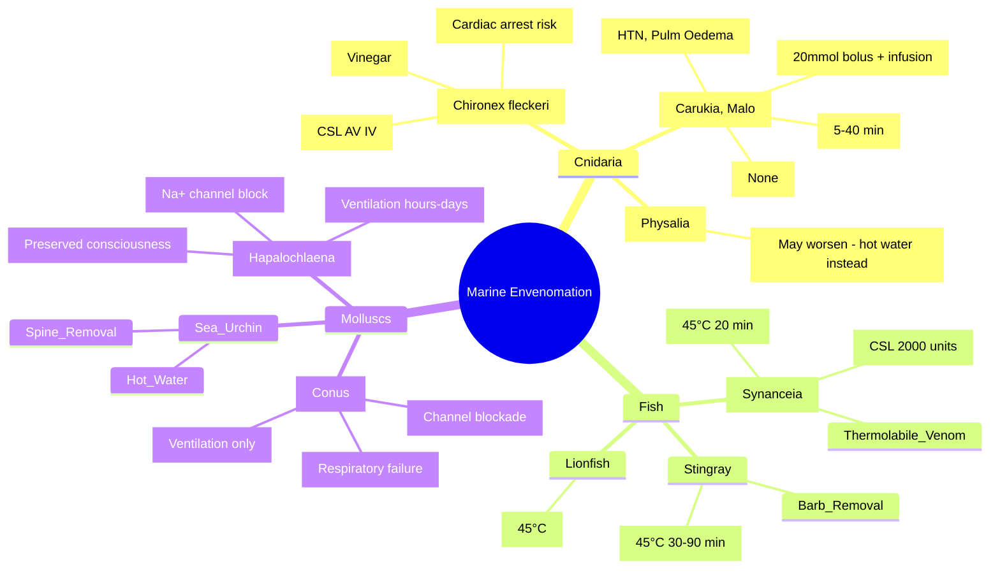

**Related:** [[General Principles of Envenomation]], [[Scorpion Sting Envenomation]], [[Spider Bite Envenomation (Latrodectism, Loxoscelism)]], [[Hymenoptera Stings (Bee, Wasp, Ant) and Anaphylaxis]], [[Envenomation MOC]]

> [!important]
> **Marine envenomation: Box jellyfish (*Chironex*) = cardiotoxic, immediate pain, whip marks, cardiac arrest risk → vinegar + antivenom. Irukandji (*Carukia*) = delayed catecholamine storm → hypertension, pulmonary oedema, pain. Stonefish (*Synanceia*) = severe pain, cardiovascular collapse → hot water 45°C + antivenom. Cone shell (*Conus*) = conotoxins → paralysis, respiratory failure. Blue-ringed octopus (*Hapalochlaena*) = tetrodotoxin → flaccid paralysis, no antivenom → ventilation. Stripping tentacles, vinegar, hot water, pressure immobilisation as appropriate.**

---

## 1. Learning Objectives
- Identify major marine envenomation syndromes
- Apply specific first aid (vinegar, hot water, PIB)
- Recognise life-threatening syndromes (box jellyfish, stonefish, blue-ringed octopus)
- Apply antivenom where available
- Manage supportive care (ventilation, cardiovascular support)
- Apply to FCPS/MRCP vignettes

---

## 2. Definitions & Key Concepts

| Term | Definition |
|------|------------|
| **Cnidaria** | Phylum including jellyfish, corals, sea anemones — nematocysts for envenomation |
| **Nematocyst** | Stinging cell — coiled tubule everts on trigger, injects venom |
| **Tetrodotoxin (TTX)** | Na⁺ channel blocker — pufferfish, blue-ringed octopus, some newts |
| **Conotoxins** | Cone shell peptides — target ion channels (Na⁺, Ca²⁺, K⁺), receptors (nAChR) |
| **Irukandji syndrome** | Delayed catecholamine storm from small box jellyfish (*Carukia barnesi*, *Malo* spp.) |
| **Stonefish antivenom** | Anti-*Synanceia* (CSL) — equine F(ab')₂, IM/IV |
| **Box jellyfish antivenom** | Anti-*Chironex* (CSL) — sheep F(ab')₂, IV for cardiotoxic signs |

---

## 3. Core Content

### Section 1: Box Jellyfish (*Chironex fleckeri* — Major Box Jellyfish)

#### Key Points

| Aspect | Detail |
|--------|--------|
| **Distribution** | Indo-Pacific, northern Australia (QLD, NT, WA), Thailand, Malaysia, Philippines |
| **Venom** | Cardiotoxin (pore-forming protein), dermatonecrotic, neurotoxic |
| **Mechanism** | Massive nematocyst discharge (up to 5 billion/cap) → rapid systemic absorption |
| **Onset** | Immediate severe pain ("whip-like" welts), cardiac arrest within minutes in severe cases |
| **Mortality** | ~70 deaths in Australia (1883–2020); children at higher risk (body surface area) |
| **Antivenom** | CSL Box Jellyfish Antivenom (sheep F(ab')₂) — 1 vial (20,000 units) IV |

#### Clinical Features

| System | Features |
|--------|----------|
| **Skin** | Immediate severe pain, linear whip-like erythematous welts ("tentacle prints"), blistering, necrosis |
| **Cardiovascular** | **Cardiotoxic** — arrhythmia (VF, VT, asystole), hypotension, cardiac arrest (within 5–20 min) |
| **Respiratory** | Apnoea (cardiac arrest), pulmonary oedema |
| **Neurological** | Agitation, confusion, seizures (hypoxic) |
| **Irukandji-like** | Some patients develop delayed catecholamine features |

#### First Aid

| Step | Action |
|------|--------|
| **1. Remove from water** | Prevent further discharge |
| **2. Vinegar (4–5% acetic acid)** | **Inactivate undischarged nematocysts** — pour liberally for 30 sec |
| **3. Remove tentacles** | After vinegar, pick off with gloves/stick (don't rub) |
| **4. Pressure immobilisation** | **NOT recommended** — may trigger nematocyst discharge |
| **5. CPR if arrested** | BLS/ALS — antivenom during resuscitation |

### Section 2: Irukandji Syndrome (*Carukia barnesi*, *Malo* spp., *Morbakka* spp. — Small Box Jellyfish)

#### Key Points

| Aspect | Detail |
|--------|--------|
| **Size** | 1–2 cm bell (hard to see) |
| **Distribution** | Northern Australia, Indo-Pacific, Caribbean, Japan, Florida |
| **Venom** | Unknown protein → massive catecholamine release (noradrenaline > adrenaline) |
| **Onset** | **5–40 min delay** after minor sting |
| **Antivenom** | **None** — box jellyfish AV does NOT cross-neutralise |
| **Magnesium** | Evidence-based therapy — blocks catecholamine effects |

#### Clinical Features — "Irukandji Syndrome"

| System | Features |
|--------|----------|
| **Pain** | **Minimal local pain** → delayed severe **back, abdominal, chest pain** (visceral) |
| **Cardiovascular** | Severe hypertension (200–300/100–150), tachycardia, **pulmonary oedema**, cardiogenic shock |
| **Neurological** | Severe headache, anxiety, restlessness, diaphoresis, piloerection |
| **Other** | Nausea, vomiting, muscle cramps, priapism, sense of impending doom |
| **Duration** | Hours to days (catecholamine storm self-limits) |

#### Magnesium Infusion Protocol (Standard Australian)

| Step | Dose/Action |
|------|-------------|
| **Bolus** | **20 mmol (4 g MgSO₄) IV over 10–15 min** |
| **Infusion** | **5–10 mmol/h** (1–2 g/h) titrated to response |
| **Target** | Pain control, BP normalisation, pulmonary oedema resolution |
| **Duration** | 12–24 h typically; wean as symptoms resolve |
| **Monitor** | BP, RR, SpO₂, reflexes (loss = toxicity), urine output |
| **Contraindications** | Severe renal failure, heart block, myasthenia gravis |

### Section 3: Stonefish (*Synanceia* spp. — Most Venomous Fish)

#### Key Points

| Aspect | Detail |
|--------|--------|
| **Distribution** | Indo-Pacific, northern Australia, Red Sea, Southeast Asia |
| **Venom** | **Thermolabile** proteins (stonefish toxin = verrucotoxin, stonustoxin) — cardiotoxic, myotoxic, neurotoxic |
| **Mechanism** | 13 dorsal spines with venom glands → puncture → deep injection |
| **Onset** | Immediate **excruciating pain** (disproportionate to wound), cardiovascular collapse |
| **Antivenom** | CSL Stonefish Antivenom (equine F(ab')₂) — 2000 units (2 vials) IM/IV |

#### Clinical Features

| System | Features |
|--------|----------|
| **Pain** | **Severe, immediate, disproportionate** — radiates proximally, lasts hours–days |
| **Cardiovascular** | Hypotension, bradycardia, **cardiovascular collapse**, arrhythmia |
| **Local** | Puncture wounds, swelling, cyanosis, necrosis, lymphangitis |
| **Systemic** | Nausea, vomiting, diaphoresis, muscle weakness, respiratory distress |
| **Renal** | Myoglobinuria possible (myotoxic component) |

#### First Aid

| Step | Action |
|------|--------|
| **1. Hot water immersion** | **45°C (113°F) for 20 min** — denatures thermolabile venom; repeat PRN |
| **2. Analgesia** | Opioids often needed (pain severe) |
| **3. Stonefish AV** | 2000 units IM or IV for systemic signs (hypotension, arrhythmia, severe pain) |
| **4. Tetanus** | Prophylaxis |
| **5. Antibiotics** | Cover *Vibrio*, *Aeromonas* (marine wounds) |

### Section 4: Cone Shell (*Conus* spp.)

#### Key Points

| Aspect | Detail |
|--------|--------|
| **Distribution** | Tropical Indo-Pacific (Great Barrier Reef, Hawaii, Red Sea) |
| **Venom** | **Conotoxins** — diverse peptides targeting Na⁺, Ca²⁺, K⁺ channels, nAChR, NMDA |
| **Mechanism** | Harpoon-like radula tooth injects venom — often painless puncture |
| **Onset** | Minutes to hours — **neuromuscular paralysis**, respiratory failure |
| **Antivenom** | **None** — supportive ventilation only |
| **Mortality** | ~30% without ventilatory support |

#### Clinical Features

| System | Features |
|--------|----------|
| **Local** | Painless or mild pain, minor puncture, ischaemia, paraesthesia |
| **Neuromuscular** | **Descending paralysis** — ptosis, ophthalmoplegia, dysphagia, limb weakness, **respiratory failure** |
| **Sensory** | Paraesthesia, numbness, impaired proprioception |
| **Autonomic** | Hypertension, hypotension, cardiac arrhythmia |
| **Consciousness** | **Preserved** — locked-in syndrome possible |

#### Management

- **Supportive ventilation** — intubate for respiratory failure; paralysis resolves over hours–days as conotoxins clear
- **No antivenom available**
- **Monitor** — CK, renal, cardiac
- **Tetanus prophylaxis**

### Section 5: Blue-Ringed Octopus (*Hapalochlaena* spp.)

#### Key Points

| Aspect | Detail |
|--------|--------|
| **Distribution** | Indo-Pacific (Australia, Japan, Southeast Asia, Pacific Islands) |
| **Venom** | **Tetrodotoxin (TTX)** — potent voltage-gated Na⁺ channel blocker |
| **Mechanism** | Salivary gland secretion → bite (often painless) → systemic absorption |
| **Onset** | Minutes — **rapid flaccid paralysis**, respiratory arrest |
| **Antivenom** | **None** |
| **Recovery** | **Hours to days** — TTX cleared renally; supportive ventilation life-saving |

#### Clinical Features

| System | Features |
|--------|----------|
| **Local** | Painless bite, minimal local reaction, 1–2 puncture marks |
| **Neuromuscular** | **Rapid flaccid paralysis** — ptosis, ophthalmoplegia, dysphagia, limb paralysis, **apnoea** |
| **Consciousness** | **Fully preserved** — "locked-in" |
| **Autonomic** | Hypertension, tachycardia, hypotension (late), fixed dilated pupils |
| **Cardiac** | Arrhythmia, cardiac arrest (hypoxic) |

#### Management

- **Immediate BLS** — mouth-to-mouth or bag-valve-mask if apnoeic
- **Intubation + mechanical ventilation** — until spontaneous recovery (6–24 h typically)
- **No antivenom, no neostigmine** (TTX blocks Na⁺ channels, not nAChR)
- **Tetanus prophylaxis**

---

## 4. Diagnostic Approach

### Bedside / Point-of-Care

| Test | Indication | Interpretation |
|------|------------|----------------|
| **History** | All | Exposure (swim, dive, handling), geography, time delay |
| **Skin exam** | All | Welts (box jelly), puncture (stonefish, cone, octopus), minimal signs (irukandji) |
| **ECG** | Box jelly, stonefish, irukandji | Arrhythmia, ST changes, QT prolongation |
| **CXR** | Irukandji, stonefish | Pulmonary oedema, cardiomegaly |
| **CK, myoglobin** | Stonefish, cone shell | Rhabdomyolysis, myoglobinuria |

### Laboratory Investigations

| Test | Indication | Expected Findings |
|------|------------|-------------------|
| **FBC** | Severe envenomation | Leucocytosis, haemoconcentration |
| **U&E, creatinine** | All severe | AKI (myoglobinuria, hypotension) |
| **CK** | Stonefish, cone, blue-ringed | Rhabdomyolysis (CK > 1000) |
| **Troponin** | Box jelly, stonefish | Myocardial injury |
| **ABG** | Respiratory failure | Respiratory acidosis, hypoxia |
| **Coagulation** | Stonefish | Usually normal (not VICC) |

---

## 5. Management Summary Table

| Envenomation | First Aid | Antivenom | Key Supportive |
|--------------|-----------|-----------|----------------|
| **Box jellyfish (*Chironex*)** | **Vinegar** → remove tentacles → CPR if arrested | **CSL Box Jellyfish AV** 1 vial IV (cardiotoxic signs) | ALS, ventilatory support |
| **Irukandji** | Vinegar (if tentacles), remove from water | **None** | **Magnesium infusion** 20 mmol bolus + 5–10 mmol/h, analgesia (fentanyl), antihypertensives |
| **Stonefish** | **Hot water 45°C × 20 min** | **CSL Stonefish AV** 2000 units IM/IV (systemic signs) | Opioids, fluids, cardiovascular support |
| **Cone shell** | PIB (if limb), immobilise | **None** | **Ventilation** until recovery |
| **Blue-ringed octopus** | PIB, BLS | **None** | **Ventilation** until recovery (hours–days) |
| **Stingray** | Hot water 45°C × 30–90 min, remove barb | None | Wound exploration, antibiotics (*Vibrio*), tetanus |
| **Sea urchin** | Hot water, remove spines | None | Spine removal, antibiotics if infected |
| **Lionfish** | Hot water 45°C | None | Analgesia, wound care |

---

## 6. Complications

| Complication | Envenomation | Management |
|--------------|--------------|------------|
| **Cardiac arrest** | Box jellyfish, stonefish, irukandji | ALS + antivenom (box jelly, stonefish) |
| **Pulmonary oedema** | Irukandji, box jellyfish, stonefish | O₂, diuretics, magnesium (irukandji), PEEP/ventilation |
| **Respiratory failure** | Cone shell, blue-ringed octopus, severe box jelly | Intubation, mechanical ventilation |
| **AKI / Rhabdomyolysis** | Stonefish, cone shell | Fluids, alkalinisation, dialysis if severe |
| **Secondary infection** | All (marine wounds) | Antibiotics covering *Vibrio*, *Aeromonas*, *Staph* |
| **Necrosis** | Box jellyfish, stonefish | Debridement, grafting |
| **Locked-in syndrome** | Blue-ringed octopus, cone shell | Communication support, rehab |

---

## 7. Disposition Criteria

| Admit (ICU/HDU) | Observe (Ward) | Discharge |
|------------------|----------------|-----------|
| **Box jellyfish** — cardiotoxic signs, AV given, arrhythmia | **Box jellyfish** — minor skin only, no systemic signs (6h) | **Minor sting** — identified benign species, no symptoms |
| **Irukandji** — all (catecholamine storm, Mg infusion) | **Stonefish** — local pain only, no systemic (6h) | **Stingray/urchin** — barb/spines removed, pain controlled |
| **Stonefish** — systemic (CVS, severe pain needing AV) | **Cone shell** — asymptomatic after 6h observation | — |
| **Cone shell / Blue-ringed octopus** — any paralysis | **Jellyfish** — mild local only | — |
| **Anaphylaxis** (any) | — | — |

---

## 8. High-Yield FCPS/MRCP Points

> [!important]
> - **Box jellyfish (*Chironex*)** = immediate cardiotoxic risk → **vinegar** inactivates nematocysts, **antivenom** for cardiotoxic signs, CPR + AV during arrest
> - **Irukandji syndrome** = delayed (5–40 min) severe visceral pain + **catecholamine storm** (HTN, pulmonary oedema) → **magnesium infusion** 20 mmol bolus + 5–10 mmol/h (evidence-based), NO antivenom
> - **Stonefish** = excruciating pain → **hot water 45°C × 20 min** (denatures thermolabile venom), **antivenom** 2000 units IM/IV for systemic signs
> - **Cone shell** = conotoxins → **neuromuscular paralysis, respiratory failure** → **supportive ventilation ONLY (no antivenom)**
> - **Blue-ringed octopus** = **tetrodotoxin** → **flaccid paralysis, apnoea, preserved consciousness** → **ventilation until recovery (no antivenom, no neostigmine)**
> - **Stingray/sea urchin/lionfish** = hot water immersion for pain
> - **Marine wounds** = antibiotics cover *Vibrio*, *Aeromonas* + tetanus
> - **PIB for cone shell/blue-ringed octopus** (neurotoxic, like elapids); **hot water for stonefish/stingray/urchin/lionfish** (thermolabile venom); **vinegar for box jellyfish** (nematocyst inactivation)

---

## 9. Common Confusions / Exam Traps

| Trap | Correction |
|------|------------|
| **Vinegar for all jellyfish** | Vinegar ONLY for box jellyfish (*Chironex*); may WORSEN *Physalia* (Portuguese man o' war) |
| **Hot water for box jellyfish** | Hot water for stonefish/stingray/urchin/lionfish; vinegar for box jellyfish |
| **Box jellyfish AV for Irukandji** | **NO cross-neutralisation** — Irukandji has NO antivenom |
| **Neostigmine for blue-ringed octopus** | **NO** — TTX blocks Na⁺ channels, not nAChR; neostigmine ineffective |
| **Antivenom for cone shell** | **None exists** — supportive ventilation only |
| **Pressure immobilisation for stonefish** | **NO** — hot water is first aid; PIB for neurotoxic (cone, blue-ringed) |
| **Irukandji = immediate severe pain** | **Delayed 5–40 min** — minimal local pain initially |
| **Blue-ringed octopus bite = painful** | **Often painless** — minimal local signs |
| **Stonefish = only local pain** | Systemic: cardiovascular collapse, arrhythmia, myotoxicity |
| **All marine envenomation = same first aid** | Agent-specific: vinegar (box jelly), hot water (fish), PIB (neurotoxic molluscs) |

---

## 10. Mnemonics

- **Box jellyfish**: **V**inegar for **V**isible tentacles = **VV** (inactivates nematocysts)
- **Irukandji**: **D**elayed 5–40 min, **V**isceral pain, **C**atecholamine storm, **M**agnesium = **DVCM**
- **Stonefish**: **H**ot water **H**eat-labile venom = **HH** (45°C × 20 min)
- **Cone shell**: **C**onotoxins → **C**hannel blockade → **C**ollapse (respiratory) = **CCC**
- **Blue-ringed octopus**: **T**TX → **T**etrodotoxin → **T**otal paralysis, **T**ime recovers = **TTT**
- **Marine first aid triad**: **V**inegar (box jelly), **H**ot water (fish), **P**IB (neuro molluscs) = **VHP**
- **Irukandji magnesium**: **20 mmol bolus, 5–10 mmol/h infusion** = **20-5-10**
- **No AV**: **C**one shell, **B**lue-ringed octopus, **I**rukandji = **CBI**
- **Cardiotoxic**: **B**ox jellyfish, **S**tonefish, **I**rukandji = **BSI**

---

## 11. Mind Map



---

## 12. Flowchart: Marine Envenomation First Aid

```mermaid
flowchart TD
    A[Marine Envenomation] --> B{Identify Agent}
    B -->|Box Jellyfish (Chironex)| C[VINEGAR 4-5%]
    C --> D[Remove Tentacles]
    D --> E{Cardiotoxic Signs?}
    E -->|Yes| F[CSL Box Jellyfish AV IV + ALS]
    E -->|No| G[Analgesia, Observe 6h]
    B -->|Irukandji| H[Vinegar if Tentacles]
    H --> I[Magnesium Infusion 20mmol + 5-10mmol/h]
    I --> J[Analgesia, Antihypertensives]
    B -->|Stonefish| K[HOT WATER 45°C × 20 min]
    K --> L{Systemic Signs?}
    L -->|Yes| M[CSL Stonefish AV 2000 units IM/IV]
    L -->|No| N[Analgesia, Observe]
    B -->|Cone Shell / Blue-ringed Octopus| O[PIB + Immobilise]
    O --> P{Respiratory Failure?}
    P -->|Yes| Q[INTUBATE + VENTILATE]
    P -->|No| R[Monitor, Observe]
    B -->|Stingray / Urchin / Lionfish| S[HOT WATER 45°C]
    S --> T[Remove Barb/Spines, Wound Care]
```

---

## 13. One-Page Revision Card

| Envenomation | First Aid | Antivenom | Key Feature |
|--------------|-----------|-----------|-------------|
| **Box jellyfish (*Chironex*)** | **Vinegar** → remove tentacles | **CSL AV 1 vial IV** (cardiotoxic) | Immediate pain, whip marks, cardiac arrest |
| **Irukandji** | Vinegar if tentacles | **NONE** | Delayed 5–40 min, visceral pain, HTN, pulm oedema |
| **Stonefish** | **Hot water 45°C × 20 min** | **CSL AV 2000u IM/IV** | Excruciating pain, cardiovascular collapse |
| **Cone shell** | PIB, immobilise | **NONE** | Painless → paralysis → respiratory failure |
| **Blue-ringed octopus** | PIB, BLS | **NONE** | Painless → flaccid paralysis, apnoea, aware |
| **Stingray** | Hot water 45°C, remove barb | None | Laceration + venom |
| **Portuguese man o' war** | Hot water (NOT vinegar) | None | Multiple tentacles, painful |
| **Sea urchin** | Hot water, remove spines | None | Spine granuloma risk |

---

## 14. Spaced Repetition Trackers

| Interval | Date | Score (1–5) | Notes |
|---|---|---|---|
| **24 h** | | | Box jellyfish vs Irukandji, stonefish hot water, tetrodotoxin |
| **3 d** | | | Magnesium protocol, cone shell ventilation, differential |
| **7 d** | | | All first aid distinctions, antivenom specifics |
| **14 d** | | | Viva, mnemonics, MCQ/SBA |
| **30 d** | | | Integrate with general envenomation |
| **90 d** | | | Comprehensive exam recall |

---

## 15. Must Know / Should Know / Nice to Know

| Priority | Content |
|----------|---------|
| **Must Know 🔴** | Box jellyfish (vinegar, antivenom), Irukandji (catecholamine storm, magnesium), stonefish (hot water, antivenom), blue-ringed octopus (tetrodotoxin, ventilation), cone shell (paralysis, ventilation) |
| **Should Know 🟡** | Irukandji magnesium protocol detail, stonefish antivenom dosing, cone shell conotoxin subtypes, regional species distribution, *Physalia* management |
| **Nice to Know 🟢** | Conotoxin pharmacology, novel antivenoms, Irukandji pathophysiology research, marine envenomation epidemiology, stonefish venom components |

---

## 16. Self-Test Scorecard

| Section | Score /5 |
|---|---|
| Box jellyfish first aid & AV | |
| Irukandji syndrome & Mg protocol | |
| Stonefish hot water & AV | |
| Cone shell management | |
| Blue-ringed octopus management | |
| First aid differentiation (vinegar vs hot water vs PIB) | |
| Stingray/urchin/lionfish | |
| Complications & disposition | |
| Differential marine stings | |
| Viva readiness | |

---

## 17. Exam Answer Modes (5)

| Mode | Prompt | Key Points |
|---|---|---|
| **Long Essay** | "Marine envenomation" | Classification, box jellyfish vs Irukandji, stonefish, cone shell, blue-ringed octopus, first aid specifics |
| **Short Note** | "Irukandji syndrome" | Delayed catecholamine storm, magnesium infusion 20mmol bolus + 5-10mmol/h, no AV |
| **Viva** | "Blue-ringed octopus vs cone shell" | Both = paralysis + respiratory failure, no AV; octopus = TTX (Na+ block, painless, aware); cone = conotoxins (channel mix, painful) |
| **Ward Round** | "Diver with stonefish sting, hypotensive" | Hot water 45°C, stonefish AV 2000u IM/IV, fluids, analgesia, antibiotics (Vibrio), monitor |
| **Last-Night** | "Marine first aid key" | Vinegar (box jelly), Hot water 45°C (stonefish/stingray/urchin/lionfish), PIB (cone/blue-ringed), Mg (Irukandji) |

---

## 18. MCQs (10)

1. **Box jellyfish (*Chironex fleckeri*) — immediate first aid:**
   A. Fresh water wash
   B. **Vinegar (4–5% acetic acid) to inactivate nematocysts**
   C. Hot water immersion
   D. Ice pack
   E. Pressure immobilisation bandage

2. **Box jellyfish antivenom — indication:**
   A. All stings
   B. **Cardiotoxic signs (arrhythmia, cardiac arrest, hypotension)**
   C. Pain only
   D. Local skin reaction only
   E. Only if vinegar unavailable

3. **Irukandji syndrome — characteristic delayed presentation:**
   A. Immediate severe local pain
   B. **Minimal local pain → 5–40 min delayed severe back/abdominal/chest pain, hypertension, pulmonary oedema**
   C. Immediate paralysis
   D. Immediate cardiac arrest
   E. Local necrosis only

4. **Irukandji syndrome — pathophysiology:**
   A. Cardiotoxin
   B. **Catecholamine storm (massive noradrenaline/adrenaline release)**
   C. Neurotoxin (paralysis)
   D. Haemolysin
   E. Necrotoxin

5. **Irukandji syndrome — evidence-based treatment:**
   A. Antivenom
   B. **Analgesia (fentanyl/morphine), magnesium infusion (reduces catecholamine effects), antihypertensives, supportive**
   C. Antivenom + magnesium
   D. Only analgesia
   E. Prazosin

6. **Stonefish (*Synanceia*) — immediate first aid:**
   A. Vinegar
   B. **Hot water immersion (45°C × 20 min)**
   C. Ice pack
   D. Pressure immobilisation
   E. Vinegar + hot water

7. **Stonefish antivenom — route:**
   A. IV only
   B. **IM or IV (both effective)**
   C. IM only
   D. Subcutaneous
   E. Topical

8. **Blue-ringed octopus (*Hapalochlaena*) envenomation — toxin:**
   A. Conotoxin
   C. **Tetrodotoxin (TTX) — voltage-gated Na⁺ channel blocker**
   C. Latrotoxin
   D. Ciguatoxin
   E. Saxitoxin

9. **Blue-ringed octopus — no antivenom. Management:**
   A. Neostigmine
   B. **Supportive: intubation, mechanical ventilation until toxin clears (hours to days)**
   C. 4-AP (potassium channel blocker)
   D. Plasma exchange
   E. Hemodialysis

10. **Cone shell (*Conus*) envenomation — toxin mechanism:**
    A. Tetrodotoxin
    B. **Conotoxins (ω-conotoxin → Na⁺/Ca²⁺ channel blockade)**
    C. Tetrodotoxin derivative
    D. Saxitoxin
    E. Latrotoxin

---

## 19. SBA Questions (10)

1. **Swimmer stung by box jellyfish in Queensland. Unconscious, pulseless. Immediate action:**
   A. Vinegar, then CPR
   B. **CPR immediately (airway, breathing, circulation) — vinegar after if feasible; antivenom IV during resuscitation**
   C. Antivenom first
   C. Vinegar only
   E. Hot water

2. **Tourist in Great Barrier Reef. 20 min after swim: severe back/abdominal pain, hypertension (200/120), pulmonary oedema. Irukandji suspected. Management:**
   A. Prazosin
   B. **Magnesium infusion (20 mmol bolus then infusion) + potent analgesia (fentanyl) + antihypertensives (GTN/phentolamine) + supportive**
   C. Antivenom
   D. Prazosin + magnesium
   E. Only analgesia

3. **Fisherman steps on stonefish. Severe pain, hypotension, local swelling. First aid:**
   A. Ice pack
   B. **Hot water 45°C × 20 min**
   C. Vinegar
   C. Pressure bandage
   E. Ice + vinegar

4. **Stonefish envenomation — cardiovascular collapse. Antivenom dose:**
   A. 1 vial IM
   B. **2000 units (2 vials) IM or IV**
   C. 1000 units IV
   D. 500 units IM
   E. 5000 units IV

5. **Child handling blue-ringed octopus at beach. Progressive weakness, respiratory distress, conscious. Management:**
   A. Neostigmine
   B. **Intubation, mechanical ventilation, supportive care until toxin clears (hours to days)**
   C. 4-aminopyridine
   D. Plasma exchange
   E. Neostigmine + atropine

6. **Cone shell sting on hand. Progressive paralysis, respiratory distress. No antivenom. Management:**
   A. Neostigmine
   B. **Supportive ventilation until recovery (conotoxins wear off over hours)**
   C. 4-aminopyridine
   D. Plasma exchange
   E. Magnesium infusion

7. **Stingray barb to foot. Puncture wound, severe pain. First aid:**
   A. Remove barb, cold pack
   B. **Remove barb if superficial, hot water 45°C × 30–90 min, wound exploration, antibiotics (*Vibrio*), tetanus**
   C. Vinegar
   D. Pressure bandage
   E. Ice pack only

8. **Irukandji magnesium infusion — mechanism of benefit:**
   A. Antivenom enhancer
   B. **Blocks catecholamine release, reduces calcium influx, vasodilation**
   C. Antivenom substitute
   D. Sedation only
   E. Diuretic

9. **Portuguese man o' war (*Physalia physalis*) sting — first aid:**
   A. Vinegar
   B. **Hot water immersion (45°C) — vinegar may worsen nematocyst discharge**
   C. Ice pack
   D. PIB
   E. Fresh water wash

10. **Patient bitten by cone shell. Progressive ptosis, dysphagia, respiratory failure. Critical distinction from blue-ringed octopus:**
    A. Cone shell = painful, blue-ringed = painless
    B. Cone shell = TTX, blue-ringed = conotoxin
    C. **Cone shell = conotoxins (mixed channel), blue-ringed = TTX (Na+ block only)**
    D. Both have antivenom
    E. Both need neostigmine

---

## 20. Flashcards

- Q: Box jellyfish first aid?
  A: Vinegar 4-5% acetic acid (inactivates nematocysts)

- Q: Box jellyfish antivenom indication?
  A: Cardiotoxic signs (arrhythmia, arrest, hypotension)

- Q: Irukandji syndrome?
  A: Delayed severe pain, HTN, pulmonary oedema, catecholamine storm

- Q: Irukandji treatment?
  A: Magnesium infusion + analgesia + antihypertensives

- Q: Stonefish first aid?
  A: Hot water 45°C × 20 min

- Q: Stonefish antivenom?
  A: 2000 units IM/IV

- Q: Blue-ringed octopus toxin?
  A: Tetrodotoxin (Na+ channel blocker)

- Q: Blue-ringed octopus treatment?
  A: Supportive ventilation until recovery (no antivenom)

- Q: Cone shell toxin?
  A: Conotoxins (Na+/Ca2+ channel blockade)

- Q: Irukandji magnesium dose?
  A: 20 mmol (4g) bolus over 10-15 min, then 5-10 mmol/h infusion

- Q: Box jellyfish vinegar?
  A: Inactivates undischarged nematocysts

- Q: Irukandji delayed onset?
  A: 5-40 min after sting

- Q: Portuguese man o' war first aid?
  A: Hot water (NOT vinegar)

- Q: Stingray first aid?
  A: Hot water 45°C, remove barb, wound care, antibiotics

---

## 21. Viva Questions (10)

**Q1: What is the specific first aid for box jellyfish (*Chironex fleckeri*) and why?**
A: Vinegar (4–5% acetic acid) poured liberally for 30 seconds. Acetic acid inactivates undischarged nematocysts, preventing further envenomation. **Do NOT rub** tentacles before vinegar — mechanical stimulation triggers discharge.

**Q2: How does Irukandji syndrome differ from box jellyfish envenomation?**
A: Irukandji = small box jellyfish (*Carukia*, *Malo*); **delayed 5–40 min** onset after minimal sting; severe visceral pain (back/abdomen/chest), **catecholamine storm** (hypertension, pulmonary oedema, tachycardia); **no antivenom**; treated with **magnesium infusion**. Box jellyfish = immediate severe pain, whip marks, **cardiotoxic** (arrest), **antivenom available** (CSL), vinegar first aid.

**Q3: What is the magnesium infusion protocol for Irukandji syndrome?**
A: 20 mmol (4 g MgSO₄) IV bolus over 10–15 min, then infusion 5–10 mmol/h (1–2 g/h) titrated to pain/BP response. Monitor reflexes (loss = toxicity), BP, RR, urine output. Avoid in severe renal failure, heart block, myasthenia. Mechanism: blocks catecholamine release, reduces Ca²⁺ influx, vasodilation.

**Q4: Why is hot water (45°C) first aid for stonefish but NOT for box jellyfish?**
A: Stonefish venom is **thermolabile** — heat denatures the protein toxins. Box jellyfish venom is NOT reliably heat-denatured at safe temperatures; vinegar inactivates nematocysts. Applying hot water to box jellyfish may worsen nematocyst discharge.

**Q5: How does blue-ringed octopus envenomation differ from cone shell envenomation?**
A: Both cause neuromuscular paralysis + respiratory failure with **no antivenom**. Blue-ringed octopus = **tetrodotoxin (TTX)** → voltage-gated **Na⁺ channel block** → **flaccid paralysis**, **painless bite**, **preserved consciousness** ("locked-in"). Cone shell = **conotoxins** (mixed Na⁺/Ca²⁺/K⁺ channel, nAChR) → **descending paralysis**, often painful, variable sensory/autonomic features.

**Q6: Can neostigmine be used for blue-ringed octopus paralysis?**
A: **NO.** Neostigmine (AChE inhibitor) works at the neuromuscular junction (nAChR) for postsynaptic blockade (e.g., cobra). TTX blocks **voltage-gated Na⁺ channels on axons**, preventing action potential propagation — neostigmine cannot bypass this block. Only supportive ventilation until TTX renal clearance (hours–days).

**Q7: What is the stonefish antivenom dose and route?**
A: CSL Stonefish Antivenom (equine F(ab')₂) — **2000 units (2 vials) IM or IV** for systemic envenomation (hypotension, arrhythmia, severe pain). IM route preferred historically; IV acceptable with monitoring. Repeat PRN.

**Q8: Why is there no antivenom for cone shell or blue-ringed octopus?**
A: Low incidence, high venom complexity (cone shell has 100+ conotoxins), technical difficulty producing broad-neutralising antibody, small market. Research ongoing (recombinant antibodies, monoclonal).

**Q9: What is the first aid for *Physalia* (Portuguese man o' war) and why NOT vinegar?**
A: **Hot water immersion (45°C)**. Vinegar may **trigger nematocyst discharge** in *Physalia* (different cnidarian class — Siphonophorae). Hot water denatures thermolabile venom. Remove tentacles carefully after heat.

**Q10: What antibiotics cover marine wound infections?**
A: Cover *Vibrio* spp., *Aeromonas* spp., *Staphylococcus aureus*, *Streptococcus*. **Doxycycline + ciprofloxacin** (or TMP-SMX + ciprofloxacin) or **ceftriaxone + doxycycline**. Tetanus prophylaxis always.

---

## 22. Confusions & Mnemonics

| Confusion | Correction |
|-----------|------------|
| Vinegar for all jellyfish | Vinegar ONLY for box jellyfish (*Chironex*); may WORSEN *Physalia* |
| Hot water for box jellyfish | Hot water for stonefish/stingray/urchin/lionfish; vinegar for box jellyfish |
| Box jellyfish AV for Irukandji | **NO cross-neutralisation** — Irukandji has NO antivenom |
| Neostigmine for blue-ringed octopus | **NO** — TTX blocks Na⁺ channels, not nAChR |
| Antivenom for cone shell | **None exists** — supportive ventilation only |
| Pressure immobilisation for stonefish | **NO** — hot water is first aid; PIB for neurotoxic (cone, blue-ringed) |
| Irukandji = immediate severe pain | **Delayed 5–40 min** — minimal local pain initially |
| Blue-ringed octopus bite = painful | **Often painless** — minimal local signs |
| Stonefish = only local pain | Systemic: cardiovascular collapse, arrhythmia, myotoxicity |
| All marine envenomation = same first aid | Agent-specific: vinegar (box jelly), hot water (fish), PIB (neuro molluscs) |

**Mnemonics:**
- **Box jellyfish**: **V**inegar for **V**isible tentacles = **VV**
- **Irukandji**: **D**elayed 5–40 min, **V**isceral pain, **C**atecholamine storm, **M**agnesium = **DVCM**
- **Stonefish**: **H**ot water **H**eat-labile venom = **HH** (45°C × 20 min)
- **Cone shell**: **C**onotoxins → **C**hannel blockade → **C**ollapse (respiratory) = **CCC**
- **Blue-ringed octopus**: **T**TX → **T**etrodotoxin → **T**otal paralysis, **T**ime recovers = **TTT**
- **Marine first aid triad**: **V**inegar (box jelly), **H**ot water (fish), **P**IB (neuro molluscs) = **VHP**
- **Irukandji magnesium**: **20 mmol bolus, 5–10 mmol/h infusion** = **20-5-10**
- **No AV**: **C**one shell, **B**lue-ringed octopus, **I**rukandji = **CBI**
- **Cardiotoxic**: **B**ox jellyfish, **S**tonefish, **I**rukandji = **BSI**

---

## 23. Mind Map


---

## 24. Flowchart: Marine Envenomation First Aid

```mermaid
flowchart TD
    A[Marine Envenomation] --> B{Identify Agent}
    B -->|Box Jellyfish (Chironex)| C[VINEGAR 4-5%]
    C --> D[Remove Tentacles]
    D --> E{Cardiotoxic Signs?}
    E -->|Yes| F[CSL Box Jellyfish AV IV + ALS]
    E -->|No| G[Analgesia, Observe 6h]
    B -->|Irukandji| H[Vinegar if Tentacles]
    H --> I[Magnesium Infusion 20mmol + 5-10mmol/h]
    I --> J[Analgesia, Antihypertensives]
    B -->|Stonefish| K[HOT WATER 45°C × 20 min]
    K --> L{Systemic Signs?}
    L -->|Yes| M[CSL Stonefish AV 2000 units IM/IV]
    L -->|No| N[Analgesia, Observe]
    B -->|Cone Shell / Blue-ringed Octopus| O[PIB + Immobilise]
    O --> P{Respiratory Failure?}
    P -->|Yes| Q[INTUBATE + VENTILATE]
    P -->|No| R[Monitor, Observe]
    B -->|Stingray / Urchin / Lionfish| S[HOT WATER 45°C]
    S --> T[Remove Barb/Spines, Wound Care]
```

---

## 25. One-Page Revision Card

| Envenomation | First Aid | Antivenom | Key Feature |
|--------------|-----------|-----------|-------------|
| **Box jellyfish (*Chironex*)** | **Vinegar** → remove tentacles | **CSL AV 1 vial IV** (cardiotoxic) | Immediate pain, whip marks, cardiac arrest |
| **Irukandji** | Vinegar if tentacles | **NONE** | Delayed 5–40 min, visceral pain, HTN, pulm oedema |
| **Stonefish** | **Hot water 45°C × 20 min** | **CSL AV 2000u IM/IV** | Excruciating pain, cardiovascular collapse |
| **Cone shell** | PIB, immobilise | **NONE** | Painless → paralysis → respiratory failure |
| **Blue-ringed octopus** | PIB, BLS | **NONE** | Painless → flaccid paralysis, apnoea, aware |
| **Stingray** | Hot water 45°C, remove barb | None | Laceration + venom |
| **Portuguese man o' war** | Hot water (NOT vinegar) | None | Multiple tentacles, painful |
| **Sea urchin** | Hot water, remove spines | None | Spine granuloma risk |

---

## 26. Spaced Repetition Trackers

| Interval | Date | Score (1–5) | Notes |
|---|---|---|---|
| **24 h** | | | Box jellyfish vs Irukandji, stonefish hot water, tetrodotoxin |
| **3 d** | | | Magnesium protocol, cone shell ventilation, differential |
| **7 d** | | | All first aid distinctions, antivenom specifics |
| **14 d** | | | Viva, mnemonics, MCQ/SBA |
| **30 d** | | | Integrate with general envenomation |
| **90 d** | | | Comprehensive exam recall |

---

## 27. Must Know / Should Know / Nice to Know

| Priority | Content |
|----------|---------|
| **Must Know 🔴** | Box jellyfish (vinegar, antivenom), Irukandji (catecholamine storm, magnesium), stonefish (hot water, antivenom), blue-ringed octopus (tetrodotoxin, ventilation), cone shell (paralysis, ventilation) |
| **Should Know 🟡** | Irukandji magnesium protocol detail, stonefish antivenom dosing, cone shell conotoxin subtypes, regional species distribution, *Physalia* management |
| **Nice to Know 🟢** | Conotoxin pharmacology, novel antivenoms, Irukandji pathophysiology research, marine envenomation epidemiology, stonefish venom components |

---

## 28. Self-Test Scorecard

| Section | Score /5 |
|---|---|
| Box jellyfish first aid & AV | |
| Irukandji syndrome & Mg protocol | |
| Stonefish hot water & AV | |
| Cone shell management | |
| Blue-ringed octopus management | |
| First aid differentiation (vinegar vs hot water vs PIB) | |
| Stingray/urchin/lionfish | |
| Complications & disposition | |
| Differential marine stings | |
| Viva readiness | |

---

## 29. Exam Answer Modes (5)

| Mode | Prompt | Key Points |
|---|---|---|
| **Long Essay** | "Marine envenomation" | Classification, box jellyfish vs Irukandji, stonefish, cone shell, blue-ringed octopus, first aid specifics |
| **Short Note** | "Irukandji syndrome" | Delayed catecholamine storm, magnesium infusion 20mmol bolus + 5-10mmol/h, no AV |
| **Viva** | "Blue-ringed octopus vs cone shell" | Both = paralysis + respiratory failure, no AV; octopus = TTX (Na+ block, painless, aware); cone = conotoxins (channel mix, painful) |
| **Ward Round** | "Diver with stonefish sting, hypotensive" | Hot water 45°C, stonefish AV 2000u IM/IV, fluids, analgesia, antibiotics (*Vibrio*), monitor |
| **Last-Night** | "Marine first aid key" | Vinegar (box jelly), Hot water 45°C (stonefish/stingray/urchin/lionfish), PIB (cone/blue-ringed), Mg (Irukandji) |

---

## 30. MCQs (10)

1. **Box jellyfish (*Chironex fleckeri*) — immediate first aid:**
   A. Fresh water wash
   B. **Vinegar (4–5% acetic acid) to inactivate nematocysts**
   C. Hot water immersion
   D. Ice pack
   E. Pressure immobilisation bandage

2. **Box jellyfish antivenom — indication:**
   A. All stings
   B. **Cardiotoxic signs (arrhythmia, cardiac arrest, hypotension)**
   C. Pain only
   D. Local skin reaction only
   E. Only if vinegar unavailable

3. **Irukandji syndrome — characteristic delayed presentation:**
   A. Immediate severe local pain
   B. **Minimal local pain → 5–40 min delayed severe back/abdominal/chest pain, hypertension, pulmonary oedema**
   C. Immediate paralysis
   D. Immediate cardiac arrest
   E. Local necrosis only

4. **Irukandji syndrome — pathophysiology:**
   A. Cardiotoxin
   B. **Catecholamine storm (massive noradrenaline/adrenaline release)**
   C. Neurotoxin (paralysis)
   D. Haemolysin
   E. Necrotoxin

5. **Irukandji syndrome — evidence-based treatment:**
   A. Antivenom
   B. **Analgesia (fentanyl/morphine), magnesium infusion (reduces catecholamine effects), antihypertensives, supportive**
   C. Antivenom + magnesium
   D. Only analgesia
   E. Prazosin

6. **Stonefish (*Synanceia*) — immediate first aid:**
   A. Vinegar
   B. **Hot water immersion (45°C × 20 min)**
   C. Ice pack
   D. Pressure immobilisation
   E. Vinegar + hot water

7. **Stonefish antivenom — route:**
   A. IV only
   B. **IM or IV (both effective)**
   C. IM only
   D. Subcutaneous
   E. Topical

8. **Blue-ringed octopus (*Hapalochlaena*) envenomation — toxin:**
   A. Conotoxin
   C. **Tetrodotoxin (TTX) — voltage-gated Na⁺ channel blocker**
   C. Latrotoxin
   D. Ciguatoxin
   E. Saxitoxin

9. **Blue-ringed octopus — no antivenom. Management:**
   A. Neostigmine
   B. **Supportive: intubation, mechanical ventilation until toxin clears (hours to days)**
   C. 4-AP (potassium channel blocker)
   D. Plasma exchange
   E. Hemodialysis

10. **Cone shell (*Conus*) envenomation — toxin mechanism:**
    A. Tetrodotoxin
    B. **Conotoxins (ω-conotoxin → Na⁺/Ca²⁺ channel blockade)**
    C. Tetrodotoxin derivative
    D. Saxitoxin
    E. Latrotoxin

---

## 31. SBA Questions (10)

1. **Swimmer stung by box jellyfish in Queensland. Unconscious, pulseless. Immediate action:**
   A. Vinegar, then CPR
   B. **CPR immediately (airway, breathing, circulation) — vinegar after if feasible; antivenom IV during resuscitation**
   C. Antivenom first
   C. Vinegar only
   E. Hot water

2. **Tourist in Great Barrier Reef. 20 min after swim: severe back/abdominal pain, hypertension (200/120), pulmonary oedema. Irukandji suspected. Management:**
   A. Prazosin
   B. **Magnesium infusion (20 mmol bolus then infusion) + potent analgesia (fentanyl) + antihypertensives (GTN/phentolamine) + supportive**
   C. Antivenom
   D. Prazosin + magnesium
   E. Only analgesia

3. **Fisherman steps on stonefish. Severe pain, hypotension, local swelling. First aid:**
   A. Ice pack
   B. **Hot water 45°C × 20 min**
   C. Vinegar
   C. Pressure bandage
   E. Ice + vinegar

4. **Stonefish envenomation — cardiovascular collapse. Antivenom dose:**
   A. 1 vial IM
   B. **2000 units (2 vials) IM or IV**
   C. 1000 units IV
   D. 500 units IM
   E. 5000 units IV

5. **Child handling blue-ringed octopus at beach. Progressive weakness, respiratory distress, conscious. Management:**
   A. Neostigmine
   B. **Intubation, mechanical ventilation, supportive care until toxin clears (hours to days)**
   C. 4-aminopyridine
   D. Plasma exchange
   E. Neostigmine + atropine

6. **Cone shell sting on hand. Progressive paralysis, respiratory distress. No antivenom. Management:**
   A. Neostigmine
   B. **Supportive ventilation until recovery (conotoxins wear off over hours)**
   C. 4-aminopyridine
   D. Plasma exchange
   E. Magnesium infusion

7. **Stingray barb to foot. Puncture wound, severe pain. First aid:**
   A. Remove barb, cold pack
   B. **Remove barb if superficial, hot water 45°C × 30–90 min, wound exploration, antibiotics (*Vibrio*), tetanus**
   C. Vinegar
   D. Pressure bandage
   E. Ice pack only

8. **Irukandji magnesium infusion — mechanism of benefit:**
   A. Antivenom enhancer
   B. **Blocks catecholamine release, reduces calcium influx, vasodilation**
   C. Antivenom substitute
   D. Sedation only
   E. Diuretic

9. **Portuguese man o' war (*Physalia physalis*) sting — first aid:**
   A. Vinegar
   B. **Hot water immersion (45°C) — vinegar may worsen nematocyst discharge**
   C. Ice pack
   D. PIB
   E. Fresh water wash

10. **Patient bitten by cone shell. Progressive ptosis, dysphagia, respiratory failure. Critical distinction from blue-ringed octopus:**
    A. Cone shell = painful, blue-ringed = painless
    B. Cone shell = TTX, blue-ringed = conotoxin
    C. **Cone shell = conotoxins (mixed channel), blue-ringed = TTX (Na+ block only)**
    D. Both have antivenom
    E. Both need neostigmine

---

## 32. Flashcards

- Q: Box jellyfish first aid?
  A: Vinegar 4-5% acetic acid (inactivates nematocysts)

- Q: Box jellyfish antivenom indication?
  A: Cardiotoxic signs (arrhythmia, arrest, hypotension)

- Q: Irukandji syndrome?
  A: Delayed severe pain, HTN, pulmonary oedema, catecholamine storm

- Q: Irukandji treatment?
  A: Magnesium infusion + analgesia + antihypertensives

- Q: Stonefish first aid?
  A: Hot water 45°C × 20 min

- Q: Stonefish antivenom?
  A: 2000 units IM/IV

- Q: Blue-ringed octopus toxin?
  A: Tetrodotoxin (Na+ channel blocker)

- Q: Blue-ringed octopus treatment?
  A: Supportive ventilation until recovery (no antivenom)

- Q: Cone shell toxin?
  A: Conotoxins (Na+/Ca2+ channel blockade)

- Q: Irukandji magnesium dose?
  A: 20 mmol (4g) bolus over 10-15 min, then 5-10 mmol/h infusion

- Q: Box jellyfish vinegar?
  A: Inactivates undischarged nematocysts

- Q: Irukandji delayed onset?
  A: 5-40 min after sting

- Q: Portuguese man o' war first aid?
  A: Hot water (NOT vinegar)

- Q: Stingray first aid?
  A: Hot water 45°C, remove barb, wound care, antibiotics

---

## 33. Answer Key with Explanations

### MCQs
1. **Correct: B** — Vinegar inactivates undischarged nematocysts; fresh water/ice/rubbing trigger discharge.
2. **Correct: B** — Box jellyfish AV (CSL sheep F(ab')₂) indicated for cardiotoxic signs only.
3. **Correct: B** — Irukandji = delayed visceral pain + catecholamine storm (HTN, pulm oedema) at 5–40 min.
4. **Correct: B** — Massive catecholamine (noradrenaline > adrenaline) release; not direct cardiotoxin.
5. **Correct: B** — Magnesium infusion (20 mmol bolus + 5–10 mmol/h) is evidence-based; analgesia + antihypertensives adjunct; no AV.
6. **Correct: B** — Stonefish venom thermolabile; hot water 45°C × 20 min denatures it.
7. **Correct: B** — CSL Stonefish AV 2000 units (2 vials) IM or IV both effective.
8. **Correct: C** — Blue-ringed octopus = tetrodotoxin (TTX), Na⁺ channel blocker.
9. **Correct: B** — No AV for blue-ringed; supportive ventilation until TTX clears (hours–days).
10. **Correct: B** — Cone shell = conotoxins (ω-conotoxin blocks Na⁺/Ca²⁺ channels).

### SBAs
1. **Correct: B** — Arrested patient: CPR first; vinegar after if feasible; AV IV during resuscitation for cardiotoxic component.
2. **Correct: B** — Irukandji: Mg infusion 20 mmol bolus then 5–10 mmol/h, fentanyl, GTN/phentolamine for HTN/pulm oedema.
3. **Correct: B** — Stonefish: hot water 45°C × 20 min immediate first aid.
4. **Correct: B** — Stonefish AV 2000 units (2 vials) IM/IV for systemic signs.
5. **Correct: B** — Blue-ringed octopus = TTX, no AV; intubate, ventilate until recovery (hours–days).
6. **Correct: B** — Cone shell = conotoxins, no AV; supportive ventilation until recovery.
7. **Correct: B** — Stingray: hot water 45°C × 30–90 min, remove barb, explore wound, antibiotics (*Vibrio*), tetanus.
8. **Correct: B** — Mg blocks catecholamine release, reduces Ca²⁺ influx, causes vasodilation.
9. **Correct: B** — *Physalia*: hot water (vinegar may trigger nematocysts).
10. **Correct: C** — Cone = conotoxins (mixed channels); blue-ringed = TTX (Na⁺ block only); both no AV, no neostigmine.

---

## 34. Summary

Marine Envenomation is a **Must Know 🔴** topic.
**Key takeaway:** Agent-specific first aid is critical — vinegar for box jellyfish, hot water 45°C for stonefish/stingray/urchin/lionfish, PIB for cone shell/blue-ringed octopus. Irukandji = delayed catecholamine storm treated with magnesium infusion. Box jellyfish and stonefish have antivenoms; cone shell, blue-ringed octopus, Irukandji do not. **No neostigmine for TTX/blue-ringed octopus.**
**Exam focus:** First aid differentiation, Irukandji magnesium protocol, antivenom indications, respiratory support for neurotoxic molluscs.
**Clinical relevance:** Common in coastal/tropical emergency medicine; travel medicine; marine biology fieldwork.

---

*Template version: 1.0 | Davidson 24e Ch 8 aligned | FCPS/MRCP oriented*