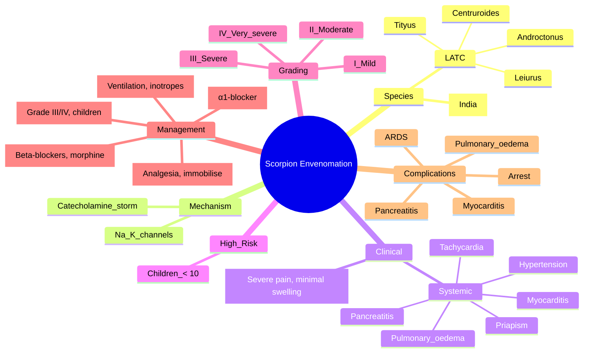

**Related:** [[General Principles of Envenomation]], [[Clinical Assessment and Scoring Systems]], [[Antivenom Adverse Reactions and Management]], [[Hymenoptera Stings (Bee, Wasp, Ant) and Anaphylaxis]], [[Envenomation MOC]]

> [!important]
> **Scorpion sting = major tropical public health problem. Severe species: Leiurus (deathstalker), Androctonus, Tityus, Centruroides. Venom = α/β-toxins (Na⁺/K⁺ channel modulation) → massive catecholamine release → autonomic storm. Clinical: severe local pain, hypertension, tachycardia, pulmonary oedema, myocarditis, pancreatitis, priapism. Severe in children < 10. Management: prazosin 0.5–1 mg q4–6h (α1-blocker), antivenom (severe), supportive ICU.**

---

## 1. Learning Objectives
- [ ] Identify high-risk scorpion species and their distribution
- [ ] Understand venom mechanism (Na⁺/K⁺ channel toxins)
- [ ] Recognise autonomic storm, neuromuscular, and pancreatitis syndromes
- [ ] Apply SCORPION scoring
- [ ] Use prazosin and other α-blockers appropriately
- [ ] Decide on antivenom indication
- [ ] Apply to FCPS/MRCP clinical vignettes

---

## 2. Definition & Background

| Item | Detail |
|---|---|
| **Definition** | Envenomation from scorpion sting (stinger = telson, terminal segment) |
| **Global burden** | > 1.2 M stings/year, > 3,000 deaths (95% in tropical/subtropical regions) |
| **Highest burden** | North Africa, Middle East, India, Mexico, Brazil, sub-Saharan Africa |
| **High-risk regions** | Saharan Africa (Leiurus, Androctonus); Brazil (Tityus); India (Mesobuthus); Mexico (Centruroides) |
| **Most vulnerable** | **Children < 10 years** (worse per kg; > 50% of deaths) |
| **Mechanism** | Venom injected via telson; stinger punctures skin; immediate pain, then systemic effects |

---

## 3. Aetiology — Important Species

| Species | Common Name | Region | Severity | Key Features |
|---|---|---|---|---|
| **Leiurus quinquestriatus** | Deathstalker / yellow scorpion | North Africa, Middle East (Saharan) | **Highly dangerous** | α-toxin (potent); children at high risk |
| **Androctonus crassicauda** | Fat-tailed scorpion | North Africa, Middle East, Turkey | **Highly dangerous** | "Crassicauda" toxin; pulmonary oedema |
| **Androctonus australis** | Yellow fat-tailed | North Africa | Severe | α-toxin |
| **Buthus occitanus** | Common yellow scorpion | North Africa, Mediterranean | Moderate-severe | α-toxin |
| **Tityus serrulatus** | Brazilian yellow scorpion | Brazil (esp. Minas Gerais) | **Highly dangerous** | TsTX (γ-toxin); massive envenomation |
| **Tityus trinitatis** | Trinidadian scorpion | Trinidad, Caribbean | Severe | TsTX |
| **Tityus bahiensis** | Brazilian brown | Brazil, Argentina | Moderate-severe | β-toxin |
| **Centruroides exilicauda (sculpturatus)** | Arizona bark scorpion | Arizona, Sonora (Mexico) | **Severe in children**; mild in adults | Cex toxin; neurotoxic |
| **Centruroides suffusus** | Mexican bark scorpion | Mexico | Severe | Neurotoxic |
| **Mesobuthus tamulus** | Indian red scorpion | India (Maharashtra, Karnataka) | **Highly dangerous** | "Tamulus" toxin; severe myocarditis |
| **Hottentotta tamulus** | Indian red scorpion (synonym) | India | Severe | As above |
| **Heterometrus** | Asian forest scorpion | SE Asia | **Mild** (large but not very toxic) | Local only |
| **Pandinus imperator** | Emperor scorpion | Africa | **Non-venomous / mild** | Pet trade |
| **Hemiscorpius lepturus** | Iranian scorpion | Iran, Iraq | Severe (necrotic) | **Cytotoxic** (unlike others — causes necrosis) |

**Mnemonic: "LATC" of severe scorpions** = **L**eiurus, **A**ndroctonus, **T**ityus, **C**entruroides. Add **M**esobuthus (India).

---

## 4. Pathophysiology

### Venom Components

| Toxin | Mechanism | Effect |
|---|---|---|
| **α-toxins** | Bind voltage-gated Na⁺ channels → **slow inactivation** → **prolonged depolarisation** | Sustained neuronal firing, autonomic activation |
| **β-toxins** | Bind voltage-gated Na⁺ channels → **shift activation voltage** → **hyper-excitability** | Repetitive firing, autonomic activation |
| **K⁺ channel toxins** | Block K⁺ channels → prolonged action potential | Hyperexcitability |
| **Ca²⁺ channel toxins** | Modulate Ca²⁺ channels | ↑ ACh release, muscle fasciculations |
| **PLA₂** | Membrane degradation | Inflammation, myotoxicity (minor) |
| **Mucopolysaccharides, hyaluronidase** | Spread venom | Local spread |

### Mechanism of Autonomic Storm

| Step | Detail |
|---|---|
| **1. Toxin binds Na⁺ channels** | Prolonged depolarisation |
| **2. Sustained neuronal firing** | Sympathetic and parasympathetic ganglia, adrenal medulla |
| **3. Massive catecholamine release** | Adrenaline, noradrenaline (α and β effects) |
| **4. Autonomic storm** | Hypertension, tachycardia, sweating, salivation, mydriasis, hyperthermia |
| **5. Cardiovascular** | Initially hyperdynamic; later **myocarditis, cardiogenic shock, arrhythmia** |
| **6. Pulmonary** | Pulmonary oedema (cardiogenic + capillary leak) |
| **7. GI** | Pancreatitis (hyperstimulation), hyperperistalsis, vomiting |
| **8. GU** | Priapism (α-stimulation) |
| **9. CNS** | Restlessness, agitation, seizures (children) |

---

## 5. Clinical Features

### Local (All Species)

| Feature | Detail |
|---|---|
| **Pain** | **Severe, immediate, burning** (most prominent local feature) |
| **Swelling** | Usually **minimal or absent** (unlike viper/spider) |
| **Erythema** | Mild; localised to sting site |
| **Necrosis** | **NOT typical** (exception: *Hemiscorpius* — cytotoxic) |
| **Paraesthesia** | Local; sometimes radiates |
| **Tinel-like** | Hyperaesthesia to light touch |

### Systemic — Mild (Most Stings)

| Feature | Detail |
|---|---|
| **Constitutional** | Malaise, sweating, salivation, rhinorrhoea, lacrimation |
| **GI** | Nausea, vomiting, abdominal pain |
| **CVS** | Mild tachycardia, mild hypertension |
| **Duration** | 1–6 h; resolves spontaneously |

### Systemic — Severe (Grade III/IV)

| System | Features |
|---|---|
| **Cardiovascular** | Severe hypertension, tachycardia, **myocarditis, cardiogenic shock, arrhythmia, cardiac arrest** |
| **Pulmonary** | **Pulmonary oedema** (cardiogenic + ARDS), hypoxia, ARDS |
| **GI** | **Pancreatitis** (severe epigastric pain, ↑ amylase/lipase), hyperperistalsis, vomiting, abdominal distension |
| **GU** | **Priapism** (males) |
| **Neuromuscular** | Fasciculations, myoclonus, weakness, opisthotonus, dystonia |
| **CNS** | Restlessness, agitation, confusion, seizures (esp. children) |
| **Metabolic** | Hyperglycaemia (catecholamine), hyperthermia, leukocytosis, hypokalaemia |
| **Eye** | Mydriasis, nystagmus, blurred vision |

---

## 6. Classification / Grading

### Clinical Grading (Indian)

| Grade | Features | Management |
|---|---|---|
| **I (Mild)** | Local pain, mild systemic (sweating, salivation) | Observation, analgesia |
| **II (Moderate)** | Severe pain, systemic (vomiting, abdominal pain, mild HTN) | Prazosin, monitor |
| **III (Severe)** | Autonomic storm, pulmonary oedema, myocarditis, pancreatitis | **Prazosin + ICU + AV if available** |
| **IV (Very severe)** | Cardiac arrest, refractory shock, ARDS | **ICU + AV + inotropes + ventilation** |

### SCORPION Score

| Component | Points |
|---|---|
| Age > 10 years | 1 |
| Local signs (pain, swelling) | 1 |
| Systemic signs (vomiting, sweating, salivation) | 1 |
| CNS signs (agitation, confusion, seizure) | 1 |
| CVS signs (hypertension, tachycardia, pulmonary oedema) | 2 |
| Respiratory signs (wheeze, stridor, resp failure) | 2 |
| **Total** | **8** |

| Score | Severity | Action |
|---|---|---|
| 0–2 | Mild | Observe, analgesia |
| 3–5 | Moderate | ICU, consider AV |
| 6–8 | Severe | **ICU, AV, supportive** |

---

## 7. Diagnosis & Investigations

| Investigation | Indication | Interpretation |
|---|---|---|
| **Clinical** | All | Sting site (tender, no swelling), autonomic features |
| **Vitals** | All | HTN, tachycardia, hyperthermia, RR |
| **ECG** | All severe | Sinus tachy, ST changes, QT, arrhythmia |
| **Troponin** | Severe | Myocardial injury (myocarditis) |
| **BNP / NT-proBNP** | Severe | Heart failure |
| **CXR** | All severe | **Pulmonary oedema, ARDS, cardiomegaly** |
| **Echocardiogram** | Severe | LV dysfunction, regional wall motion |
| **FBC** | All | Leucocytosis, eosinophilia (late) |
| **U&E, glucose** | All | Hyperglycaemia, hypokalaemia, AKI |
| **Amylase, lipase** | All severe (abdominal pain) | **Pancreatitis** |
| **ABG** | All severe | Acidosis, hypoxia, hyperlactataemia |
| **Cardiac enzymes** | Severe | Myocarditis |
| **Urine** | All | Myoglobin (rare) |
| **Scorpion identification** | If possible | Species-specific management |

---

## 8. Differential Diagnosis

| Condition | Distinguishing Features |
|---|---|
| **Anaphylaxis (hymenoptera)** | Urticaria, angioedema, bronchospasm, no sting site neuro signs |
| **Acute MI** | Cardiac symptoms, ECG changes, no sting context |
| **Acute pancreatitis** | No sting history; need to differentiate; scorpion often has other systemic features |
| **Tetanus** | Trismus, opisthotonus, no sting history |
| **Status epilepticus** | Seizure activity, no autonomic storm |
| **Sympathomimetic toxidrome** | Drug use, hyperthermia, mydriasis |
| **Acute abdomen** | Surgical pathology |
| **Pulmonary embolism** | Pleurisy, hypoxia, no sting context |
| **Septic shock** | Fever source, hypotension late, no sting |
| **Snakebite** | Different presentation; local swelling; coagulopathy (viperid) |

---

## 9. Management

| Step | Action | Detail |
|---|---|---|
| **1. First aid** | Reassurance, immobilise limb, transport | Cold compress for pain; avoid incision/suction |
| **2. Triage** | Vital signs, systemic features | ICU if Grade III/IV |
| **3. Analgesia** | Paracetamol, opioids | For severe pain |
| **4. Local anaesthetic** | Lidocaine 1% SC or regional block | For refractory pain |
| **5. Prazosin** | **First-line specific therapy** for autonomic storm | 0.5–1 mg PO q4–6h (adults); 0.25–0.5 mg (children); titrate to BP |
| **6. IV fluids** | Cautious (risk of pulmonary oedema) | Avoid overload; NS or RL |
| **7. Antivenom** | Severe (Grade III/IV), children, prazosin unavailable | Specific AV (regional) |
| **8. ICU support** | Severe cases | Ventilation, inotropes, monitoring |
| **9. Treat complications** | Pulmonary oedema, pancreatitis, myocarditis | Specific management |
| **10. Benzodiazepines** | For agitation, seizures | Diazepam 5–10 mg IV |
| **11. Avoid** | β-blockers, morphine (worsens), opiates initially | Can worsen autonomic storm |

### Prazosin Protocol

| Step | Detail |
|---|---|
| **Mechanism** | α1-adrenergic blocker → counters α-adrenergic storm (afterload, pulmonary oedema) |
| **Indication** | Hypertension, pulmonary oedema, autonomic storm |
| **Dose (adult)** | 0.5–1 mg PO q4–6h; titrate |
| **Dose (child)** | 0.25–0.5 mg PO q4–6h; titrate |
| **Onset** | 30–60 min |
| **Caution** | First-dose orthostatic hypotension; recumbent when giving |
| **Avoid** | β-blockers (unopposed α-stimulation), morphine (histamine release) |
| **Duration** | Continue 24–48 h until autonomic features resolve |
| **Alternative if unavailable** | Phentolamine (IV α-blocker), nitroglycerin infusion, captopril |

### Antivenom

| Aspect | Detail |
|---|---|
| **Indication** | Severe (Grade III/IV), children, prazosin unavailable, refractory HTN, pulmonary oedema |
| **Products** | Regional — Scorpion Antivipmyn (Mexico, polyvalent), Indian Red Scorpion AV (Haffkine), Saudi AV, Tunisian AV, Turkish AV, Brazilian AV |
| **Dose** | Per product; usually 1–3 vials; titrate to response |
| **Effect** | Rapid reversal of autonomic features (minutes–hours) |
| **Reactions** | Similar to snake AV (early anaphylaxis, late serum sickness) |
| **Evidence** | Mixed; some studies show benefit in children and severe cases; not always available |

### Management of Complications

| Complication | Management |
|---|---|
| **Pulmonary oedema** | O₂, diuretic, prazosin, NTG, CPAP, ventilation |
| **Myocarditis** | Supportive, inotropes (dobutamine), avoid digoxin (arrhythmia) |
| **Cardiogenic shock** | Inotropes, intra-aortic balloon pump (rare) |
| **Arrhythmia** | Standard ACLS; avoid class Ic; consider amiodarone |
| **Pancreatitis** | NPO, IV fluids, analgesia, monitor; usually resolves |
| **Hyperglycaemia** | Monitor; usually transient; insulin if severe |
| **Priapism** | Aspiration if needed; usually resolves |
| **Seizure** | Benzodiazepine |
| **Hyperthermia** | Cooling |

---

## 10. Disposition

| Grade | Setting | Duration |
|---|---|---|
| I | Ward, observation | 6 h |
| II | HDU | 24 h |
| III | ICU | Days |
| IV | ICU | Weeks |

---

## 11. FCPS/MRCP High-Yield Summary

| Fact | Detail |
|---|---|
| **Most dangerous scorpions** | Leiurus (N Africa), Androctonus (N Africa), Tityus (Brazil), Centruroides (Arizona), Mesobuthus (India) |
| **Venom mechanism** | α/β-toxins → Na⁺/K⁺ channel modulation → catecholamine storm |
| **Local signs** | **Severe pain, minimal swelling** |
| **Systemic** | Autonomic storm: HTN, tachycardia, pulmonary oedema, myocarditis, pancreatitis, priapism |
| **Highest risk** | **Children < 10** |
| **First-line specific Rx** | **Prazosin 0.5–1 mg q4–6h (α1-blocker)** |
| **Prazosin dose children** | 0.25–0.5 mg q4–6h |
| **Antivenom** | Grade III/IV, children, prazosin unavailable |
| **Avoid** | β-blockers (unopposed α), morphine |
| **Complications** | Pulmonary oedema, myocarditis, pancreatitis, ARDS, arrhythmia |
| **Leiurus region** | North Africa, Middle East |
| **Tityus region** | Brazil |
| **Centruroides region** | Arizona/Sonora |
| **Mesobuthus region** | India |
| **SCORPION score** | Age, local, systemic, CNS, CVS (2), respiratory (2); max 8 |
| **Mortality** | Highest in children, especially with delay |

---

## 12. Viva Questions (10)

**Q1: What are the most dangerous scorpion species?**
A: Leiurus quinquestriatus (deathstalker, N Africa/Middle East), Androctonus (fat-tailed, N Africa/Middle East), Tityus (Brazilian yellow, S America), Centruroides (bark, Arizona/Sonora), Mesobuthus tamulus (Indian red, India). Mnemonic: LATC + M.

**Q2: What is the mechanism of scorpion venom?**
A: α-toxins bind voltage-gated Na⁺ channels → slow inactivation → prolonged depolarisation. β-toxins shift activation voltage → hyper-excitability. K⁺ channel toxins prolong action potential. Net effect = sustained neuronal firing → massive catecholamine release from sympathetic ganglia and adrenal medulla → autonomic storm.

**Q3: What is the clinical syndrome of severe scorpion envenomation?**
A: **Autonomic storm**: hypertension, tachycardia, sweating, salivation, mydriasis, hyperthermia. **Cardiovascular**: myocarditis, cardiogenic shock, arrhythmia. **Pulmonary**: pulmonary oedema (cardiogenic + ARDS). **GI**: pancreatitis, hyperperistalsis. **GU**: priapism. **CNS**: agitation, seizures. **Local**: severe pain, minimal swelling.

**Q4: Why are children more vulnerable?**
A: Higher venom dose per kg; less physiological reserve; smaller airways; myocardium more sensitive; dehydration worsens. **> 50% of scorpion deaths occur in children < 10 years.** Aggressive management required.

**Q5: What is the first-line specific therapy for scorpion autonomic storm?**
A: **Prazosin** (α1-adrenergic blocker). Dose 0.5–1 mg PO q4–6h (adults); 0.25–0.5 mg (children). Mechanism: blocks α-adrenergic effects of catecholamine storm → reduces afterload, treats pulmonary oedema, controls HTN. Avoid β-blockers (unopposed α-stimulation worsens crisis). First-dose orthostatic hypotension; recumbent.

**Q6: When is antivenom indicated for scorpion sting?**
A: Severe (Grade III/IV) systemic envenomation, children < 10, prazosin unavailable, refractory HTN, pulmonary oedema, myocarditis. Products are regional (Indian Red Scorpion AV, Scorpion Antivipmyn, etc.). Mixed evidence; some studies show benefit in children. Reactions similar to snake AV (anaphylaxis, serum sickness).

**Q7: How is scorpion pancreatitis managed?**
A: Supportive: NPO, IV fluids, analgesia, monitor. Usually **transient** and resolves with treatment of envenomation. No surgery. Watch for pseudocyst, AKI. Lipase/amylase elevated in 30–80% of severe cases.

**Q8: What is the role of β-blockers in scorpion envenomation?**
A: **AVOID** — unopposed α-adrenergic stimulation worsens HTN, pulmonary oedema, and cardiovascular collapse. Use prazosin or phentolamine instead.

**Q9: What is the duration of scorpion autonomic storm?**
A: Usually 6–24 h, can last 48 h. Symptoms peak at 2–6 h, then gradually resolve. ICU monitoring required during this period. Most deaths occur in first 24 h from cardiovascular collapse.

**Q10: Why is Centruroides bark scorpion (Arizona) severe in children but mild in adults?**
A: Children have higher venom:body weight ratio, less developed physiological reserves, and possibly more permeable blood-brain barrier for neurotoxins. Adults often have only mild systemic features (or local pain only). The Cex neurotoxin targets Na⁺ channels but adults appear to metabolise/clear it more effectively.

---

## 13. Confusions & Mnemonics

| Confusion | Clarification |
|---|---|
| Scorpion = snake | NO — different presentation (catecholamine storm, not coag) |
| Local swelling always | NO — usually minimal in scorpion |
| β-blocker treats HTN | NO — worsens (unopposed α) |
| Morphine for pain | AVOID initially — histamine release; use other analgesics |
| Prazosin = antihypertensive | YES but used for catecholamine storm specifically |
| AV always needed | NO — Grade I/II = supportive only |
| All scorpions severe | NO — many are mild; LATC + M are severe |
| Scorpion = necrotic | NO — except *Hemiscorpius* (Iran) — cytotoxic |
| Pancreatitis from scorpion needs surgery | NO — supportive; transient |
| Children less affected | NO — children are highest risk |

**Mnemonics:**
- **Severe scorpions**: **L**eiurus, **A**ndroctonus, **T**ityus, **C**entruroides = **LATC**; add **M**esobuthus (India) = **LATC + M**
- **Mechanism**: **N**a⁺ channel toxins = **N**euro-excitation → **C**atecholamine = **NC**
- **Autonomic storm features**: **H**TN, **T**achy, **P**ulmonary oedema, **M**yocarditis, **P**ancreatitis, **P**riapism = **HTPM PP**
- **Avoid**: **β**-blockers, **M**orphine = **βM** = "bad medicine"
- **First-line**: **P**razosin = **P**razosin is **P**rimary
- **High-risk group**: **C**hildren = **C**hildren **C**ritical
- **Leiurus region**: **N**orth **A**frica = **NA** (Leiurus is North African)
- **Tityus region**: **B**razil = **B**razilian yellow
- **Centruroides region**: **A**rizona = **A**rizona bark
- **Mesobuthus region**: **I**ndia = **I**ndian red
- **SCORPION max**: **8 points** = severe

---

## 14. Mind Map

---

## 15. One-Page Revision Card

| Aspect | Key Point |
|---|---|
| **Severe species** | LATC + M (Leiurus, Androctonus, Tityus, Centruroides, Mesobuthus) |
| **Venom** | α/β-toxins → Na⁺/K⁺ channels → catecholamine storm |
| **Local** | Severe pain, minimal swelling |
| **Systemic** | HTN, tachycardia, pulmonary oedema, myocarditis, pancreatitis, priapism |
| **High risk** | Children < 10 |
| **First-line Rx** | **Prazosin 0.5–1 mg q4–6h** (α1-blocker) |
| **Antivenom** | Grade III/IV, children, no prazosin |
| **Avoid** | β-blockers, morphine |
| **SCORPION** | 8-point score |
| **Duration** | 6–24 h, can be 48 h |

---

## 16. Spaced Repetition Trackers

| Interval | Date | Score (1–5) | Notes |
|---|---|---|---|
| **24 h** | | | Severe species, mechanism, prazosin, AV |
| **3 d** | | | Autonomic storm, complications, SCORPION, differentials |
| **7 d** | | | Regional species, paediatric, antivenom products |
| **14 d** | | | Viva, mnemonics, MCQ/SBA |
| **30 d** | | | Integrate with Spider, Marine, Hymenoptera |
| **90 d** | | | Comprehensive exam recall |

---

## 17. Self-Test Scorecard

| Section | Score /5 |
|---|---|
| Severe species & regions | |
| Venom mechanism | |
| Autonomic storm features | |
| SCORPION score | |
| Prazosin use | |
| Antivenom indications | |
| Complications | |
| Children vulnerability | |
| Avoid (β-blockers, morphine) | |
| Differential diagnosis | |

---

## 18. Exam Answer Modes (5)

| Mode | Prompt | Key Points |
|---|---|---|
| **Long Essay** | "Scorpion envenomation" | Severe species, mechanism, autonomic storm, prazosin, AV, complications |
| **Short Note** | "Prazosin in scorpion sting" | α1-blocker, 0.5–1 mg q4–6h, counters catecholamine storm, reduces afterload, pulmonary oedema |
| **Viva** | "Why avoid β-blockers in scorpion sting?" | Unopposed α-stimulation worsens HTN, pulmonary oedema, cardiovascular collapse |
| **Ward Round** | "Child stung by scorpion, hypertensive, pulmonary oedema" | ICU, oxygen, prazosin 0.25–0.5 mg, diuretic, antivenom if available |
| **Last-Night** | "Key scorpion facts" | LATC severe; catecholamine storm; prazosin 0.5–1 mg; children highest risk; avoid β-blockers |

---

## 19. MCQs (10)

1. **Most dangerous scorpion species:**
   A. Centruroides
   B. **Leiurus, Androctonus, Tityus, Centruroides (LATC)**
   C. Heterometrus
   D. Pandinus
   E. Scorpio maurus

2. **Scorpion venom primary target:**
   A. nAChR
   B. **Voltage-gated Na⁺ and K⁺ channels (α/β-toxins)**
   C. AChE
   D. Ryanodine receptor
   E. TRP

3. **Autonomic storm mechanism:**
   A. Direct myocardial depression
   B. **Massive catecholamine release (α/β adrenergic storm)**
   C. Direct pulmonary toxicity
   D. Anaphylaxis
   E. Vagal

4. **Which is NOT typical of scorpion sting?**
   A. Severe local pain
   B. HTN, tachycardia
   C. Pulmonary oedema
   D. **Marked local swelling/necrosis (not typical)**
   E. Pancreatitis

5. **SCORPION score components include all EXCEPT:**
   A. Age
   B. Local signs
   C. Systemic signs
   D. **Time since sting**
   E. CXR findings

6. **Prazosin dose (adult):**
   A. 0.1 mg daily
   B. **0.5–1 mg q4–6h**
   C. 5 mg daily
   D. 10 mg q8h
   E. 0.05 mg/kg IV

7. **Prazosin mechanism:**
   A. Antivenom adjunct
   B. **α1-blocker → counters catecholamine storm**
   C. Anticholinesterase
   D. Bronchodilator
   E. Anticonvulsant

8. **Antivenom for scorpion sting indicated for:**
   A. All stings
   B. **Severe (Grade III/IV), children, prazosin unavailable**
   C. Local only
   D. Only if prazosin fails
   E. Never

9. **Scorpion pancreatitis characteristic:**
   A. Rare, adult only
   B. **Common in severe envenomation, transient**
   C. Requires surgery
   D. Chronic
   E. Not associated

10. **Highest risk group:**
    A. Healthy adults
    B. **Children < 10 years**
    C. Elderly
    D. Pregnant
    E. Immunocompromised

---

## 20. SBA Questions (5)

1. **6-year-old stung by scorpion in N Africa. HTN 180/110, pulmonary oedema, agitation. Best:**
   A. Furosemide
   B. **Prazosin 0.5 mg PO + O₂ + ICU + consider AV**
   C. β-blocker
   D. Morphine
   E. NTG infusion

2. **Scorpion sting, severe abdominal pain, ↑ amylase/lipase. Management:**
   A. Surgery
   B. **Supportive: NPO, IV fluids, analgesia, monitor (transient)**
   C. ERCP
   D. Octreotide
   E. Antibiotics

3. **Scorpion sting, no prazosin, severe HTN, pulmonary oedema. Alternative:**
   A. Nifedipine
   B. **Phentolamine IV α-blocker or NTG + diuretic + O₂**
   C. β-blocker
   D. ACEi
   E. ACEi + β-blocker

4. **Leiurus quinquestriatus (deathstalker) region:**
   A. South America
   B. **North Africa, Middle East**
   C. SE Asia
   D. Australia
   E. North America

5. **Tityus serrulatus (Brazilian yellow) region:**
   A. North Africa
   B. **Brazil, South America**
   C. India
   D. Mexico
   E. Middle East

---

## 21. Local Navigation

- [[General Principles of Envenomation]]
- [[Clinical Assessment and Scoring Systems]]
- [[Antivenom Adverse Reactions and Management]]
- [[Hymenoptera Stings (Bee, Wasp, Ant) and Anaphylaxis]]
- [[Spider Bite Envenomation (Latrodectism, Loxoscelism)]]
- [[Marine Envenomation (Jellyfish, Stonefish, Cone Shell, Blue-Ringed Octopus)]]
- [[Envenomation MOC]]

## PasTest Scenario SBAs (Clinical Vignettes)

> **Auto-generated PasTest/Mediscope-style scenario SBAs** grounded in the authored source. Each scenario tests a real clinical fact (triad, specific sign, contraindication, trial, first-line Rx) extracted from the topic. *Source: Ch 12: Envenomation — Scorpion Sting Envenomation*

**Q1.** Which of the following features is most specific or characteristic of Scorpion Sting Envenomation?

  - **A.** Necrosis
  - **B.** A feature common to many acute inflammatory conditions
  - **C.** A non-specific sign that does not localise the diagnosis
  - **D.** An investigation finding rather than a clinical feature

  > **Answer: A** — Necrosis
  >
  > *Source:* ly **minimal or absent** (unlike viper/spider) |
| **Erythema** | Mild; localised to sting site |
| **Necrosis** | **NOT typical** (exception: *Hemiscorpius* — cytotoxic) |
| **Paraesthesia** | Local;

**Q2.** What is the most appropriate first-line therapy for Scorpion Sting Envenomation?

  - **A.** Prazosin   First-line specific therapy for autonomic storm   0
  - **B.** An advanced/surgical therapy reserved for refractory disease
  - **C.** Symptomatic treatment only, no disease-modifying therapy
  - **D.** Empiric broad-spectrum therapy without specific indication

  > **Answer: A** — Prazosin   First-line specific therapy for autonomic storm   0
  >
  > *Source:* Prazosin**   **First-line specific therapy** for autonomic storm   0.5–1 mg PO q4–6h (adults); 0.25–0.5 mg (children); titrate to BP

