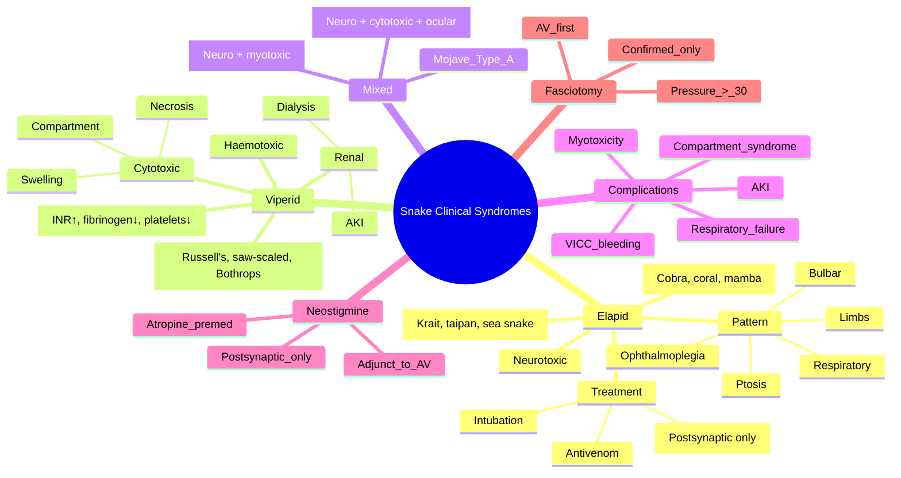

**Related:** [[Snake Envenomation: Global Epidemiology and Snake Identification]], [[Snake Envenomation: Specific Regional Snakes (Asia, Africa, Australia, Americas)]], [[Snake Envenomation: Laboratory Investigation and Monitoring]], [[Snake Envenomation: Specific Antivenom Protocols]], [[General Principles of Envenomation]], [[Envenomation MOC]]

> [!important]
> **Elapid = neurotoxic: descending paralysis (ptosis → ophthalmoplegia → bulbar → respiratory failure). Viperid = haemotoxic + cytotoxic: coagulopathy (VICC), bleeding, local necrosis, shock, AKI. Mixed: Mojave (neuro + haemotoxic), some cobras, sea snake (neuro + myotoxic). Postsynaptic (cobra) = neostigmine works; Presynaptic (krait) = irreversible.**

---

## 1. Learning Objectives
- [ ] Differentiate elapid (neurotoxic) from viperid (haemotoxic/cytotoxic) syndromes
- [ ] Distinguish presynaptic from postsynaptic neurotoxicity
- [ ] Recognise coagulopathy (VICC) and its complications
- [ ] Identify mixed syndromes (Mojave, sea snake, some cobras)
- [ ] Apply clinical knowledge to antivenom decision
- [ ] Recognise and manage complications (respiratory failure, AKI, compartment syndrome)
- [ ] Use neostigmine appropriately (postsynaptic only)
- [ ] Apply to FCPS/MRCP clinical vignettes

---

## 2. Clinical Syndromes — Overview

| Feature | Elapidae (Neurotoxic) | Viperidae (Haemotoxic/Cytotoxic) |
|---|---|---|
| **Venom profile** | Pre/post-synaptic neurotoxins | Procoagulants, haemorrhagins, cytotoxins, nephrotoxins |
| **Local signs** | Often MINIMAL (small fang marks, no swelling) | Often PROMINENT (swelling, pain, blistering, necrosis) |
| **Systemic — Neuro** | Descending paralysis (ptosis → resp failure) | Rare (Mojave, some Bothrops) |
| **Systemic — Coag** | Mild (some species) | **Severe VICC (INR↑, fibrinogen↓, platelets↓)** |
| **Systemic — Renal** | Rare (sea snake myoglobinuria) | Common (Russell's, Bothrops) |
| **Cardiovascular** | Autonomic dysfunction | Shock, hypotension |
| **Time course** | Rapid (30 min – 24 h) | 1 h – several days |
| **First aid** | PIB | Local pressure + immobilise |
| **Antivenom examples** | CSL (Aus), Indian ASV (krait/cobra component), SAIMR | Indian ASV (viper), CroFab, Antivipmyn |

---

## 3. ELAPID SYNDROME — Neurotoxic

### Mechanism of Neurotoxicity

| Type | Mechanism | Examples | Reversibility | Neostigmine Response |
|---|---|---|---|---|
| **Postsynaptic (α-neurotoxin)** | Competitive blockade of nAChR at motor endplate; **reversible** with time or AChE inhibitor | Cobra (*Naja*), some coral snakes, mamba, some Australian elapids | **Reversible** | **Effective** (adjunct) |
| **Presynaptic (β-neurotoxin)** | PLA₂-mediated hydrolysis of presynaptic terminal membrane → ↓ ACh release; **irreversible** (terminal must regenerate) | Krait (*Bungarus*), taipan, some Australian, sea snakes (also myotoxic) | **Irreversible** | **NOT effective** (must wait for AV + nerve regeneration) |

### Clinical Pattern — Descending Paralysis

| Stage | Time Course (typical) | Features |
|---|---|---|
| **1. Early (0.5–6 h)** | Variable | Ptosis (most common early sign), ophthalmoplegia, blurred vision, diplopia |
| **2. Bulbar (1–12 h)** | Progressive | Dysphagia, dysarthria, dysphonia, weak cough, pooled secretions |
| **3. Limb (3–24 h)** | Progressive | Proximal weakness, then distal; reduced reflexes |
| **4. Respiratory (3–48 h)** | Life-threatening | Hypoventilation, hypoxia, respiratory acidosis, respiratory arrest |
| **Recovery** | Days to weeks | Reverse order; presynaptic = delayed regeneration |

### Examination — Neurotoxic

| Sign | Test |
|---|---|
| **Ptosis** | Look for drooping eyelids; ask patient to look up (test sustained upgaze — fatigues) |
| **Ophthalmoplegia** | Test extraocular movements (EOM); nystagmus |
| **Facial weakness** | Smile, close eyes against resistance |
| **Bulbar** | Swallow water, speak clearly, cough strength |
| **Limb** | Proximal first (shoulder abduction, hip flexion), then distal |
| **Respiratory** | FVC, NIF, RR, accessory muscles, ABG |
| **Reflexes** | Reduced/absent |

### Specific Elapid Syndromes

| Snake | Special Features |
|---|---|
| **Indian cobra (*Naja naja*)** | Postsynaptic (reversible); local swelling + necrosis common; ptosis early |
| **Common krait (*Bungarus caeruleus*)** | Presynaptic (irreversible); nocturnal; minimal local signs; **delayed 6–24 h**; high mortality in sleeping victims |
| **Black mamba** | Presynaptic + postsynaptic; rapid; autonomic storm (tachycardia, sweating) |
| **Taipan (*Oxyuranus*)** | Presynaptic + procoagulant; rapid neuro + VICC |
| **Brown snake (*Pseudonaja*)** | Australia; rapid VICC + neuro; cardiac arrest common |
| **Tiger snake (*Notechis*)** | Presynaptic + procoagulant + myotoxic |
| **Sea snake** | Presynaptic + myotoxic (severe) |
| **Coral snake (US)** | Postsynaptic; delayed neurotoxicity 12–24 h |

### Neostigmine Trial — Postsynaptic Blockade

| Step | Detail |
|---|---|
| **Indication** | Suspected postsynaptic blockade (cobra, coral snake); NOT for presynaptic (krait, taipan) |
| **Premedication** | Atropine 0.6 mg IV (prevent muscarinic effects) |
| **Dose** | Neostigmine 0.5–2.5 mg IV (or IM/SC) |
| **Response** | Improvement in ptosis, EOM, limb power within 30–60 min |
| **Repeat** | Every 30–60 min as needed (with atropine) |
| **Adjunct to AV** | YES — does NOT replace antivenom; bridges the gap until AV works |
| **Caution** | Can worsen cholinergic symptoms (bradycardia, bronchospasm) — always with atropine |
| **Not effective** | Presynaptic blockade (krait, taipan, brown snake) |

---

## 4. VIPERID SYNDROME — Haemotoxic / Cytotoxic

### Mechanism of Coagulopathy (VICC)

| Toxin | Mechanism | Effect |
|---|---|---|
| **Procoagulants (RVV-V, RVV-X, ecarin)** | Activate factors V, X, prothrombin | Consumption of clotting factors → VICC |
| **Thrombin-like enzymes (TLE)** | Fibrinogen → fibrin (defective clots) | Afibrinogenaemia, ↑ D-dimer |
| **Anticoagulants (protein C activator)** | Activate protein C | Bleeding |
| **Platelet modulators (botrocetin, flavostatin)** | Induce/inhibit aggregation | Thrombocytopenia |
| **Haemorrhagins (SVMPs)** | Degrade basement membrane, capillary integrity | Local + systemic bleeding |

### Coagulopathy Labs

| Lab | VICC Pattern | Interpretation |
|---|---|---|
| **PT/INR** | **↑↑** (often > 5) | Severe factor consumption |
| **aPTT** | **↑** | Less reliable than INR for viperid |
| **Fibrinogen** | **↓↓** (often < 1 g/L) | Fibrinogen consumption |
| **D-dimer** | **↑↑** | Fibrin breakdown |
| **Platelets** | **↓↓** (variable) | Consumption, sequestration |
| **20WBCT** | **+ve (no clot)** | Bedside screen for VICC |
| **Fibrin degradation products** | **↑** | Fibrinolysis active |

### Clinical Pattern — Haemotoxic / Cytotoxic

| Stage | Features |
|---|---|
| **1. Local (0.5–12 h)** | Pain, swelling (rapidly progressive), erythema, fang marks, ecchymosis, lymphangitis, regional nodes |
| **2. Coagulopathy (1–24 h)** | Bleeding from bite site, gums, IV sites; petechiae; intracranial haemorrhage (worst); haematuria; GI bleed |
| **3. Cytotoxic (6–48 h)** | Blistering, necrosis, compartment syndrome (severe); secondary infection; gangrene |
| **4. Shock (6–24 h)** | Hypotension, tachycardia, hypovolaemia (third-spacing) |
| **5. Renal (12–72 h)** | AKI (VICC, myoglobinuria, direct nephrotoxicity); anuria, uraemia |
| **Recovery (coag)** | Days to weeks (prothrombin, fibrinogen recover slowly) |

### Specific Viperid Syndromes

| Snake | Special Features |
|---|---|
| **Russell's viper (*Daboia russelii*)** | VICC + AKI (most common); some populations also neurotoxic; **pituitary haemorrhage (Sheehan-like)** |
| **Saw-scaled viper (*Echis carinatus*)** | Procoagulant (RVV-X activator); VICC; **highest mortality per bite in some regions**; less local necrosis |
| **Puff adder (*Bitis arietans*)** | Cytotoxic dominant; severe local necrosis; less coagulopathy |
| **Gaboon viper (*Bitis gabonica*)** | Massive venom yield; severe local + coagulopathy; shock |
| **Bothrops (lance-headed vipers, Latin America)** | Local necrosis + coagulopathy + AKI |
| **Rattlesnake (*Crotalus*)** | Variable; some have neuro (Mojave); some haemorrhagic (timber, diamondback) |
| **European adder (*Vipera berus*)** | Mild-moderate local + systemic; rarely lethal |
| **Green pit viper (*Trimeresurus*)** | Mild local + coagulopathy; less severe |

---

## 5. MIXED SYNDROMES

| Snake | Syndrome | Key Features |
|---|---|---|
| **Mojave rattlesnake (*Crotalus scutulatus*)** | Neuro + haemotoxic (Type A) vs haemotoxic only (Type B) | Mojave toxin (presynaptic β-neurotoxin); variable |
| **Some Australian elapids (taipan, brown, tiger)** | Neuro + VICC | Both pre- and post-synaptic; rapid VICC |
| **Russell's viper (some populations)** | Haemotoxic + neuro + nephrotoxic | Variable geographically; Sri Lankan RV very nephrotoxic |
| **Sea snakes** | Neuro + myotoxic | Rhabdomyolysis, myoglobinuria, AKI |
| **Spitting cobras (African, Asian)** | Cytotoxic + neurotoxic + **ocular** | Venom "spat" up to 3 m → corneal injury, blindness |
| **King cobra** | Neuro + cytotoxic | Massive yield |
| **Boomslang** | Delayed coagulopathy (24–48 h) | Rear-fanged colubrid; severe VICC |

### Spitting Cobra Ocular Injury

| Step | Action |
|---|---|
| **1. Immediate** | Copious irrigation with water/saline for 15–20 min (don't rub) |
| **2. Topical anaesthetic** | Proxymetacaine 0.5% (for exam and irrigation comfort) |
| **3. Slit-lamp exam** | Look for corneal abrasion, opacification, uveitis, hypopyon |
| **4. Fluorescein staining** | Identify epithelial defects |
| **5. Topical antibiotic** | Chloramphenicol or fusidic acid (prevent secondary infection) |
| **6. Topical cycloplegic** | Atropine 1% (prevent posterior synechiae from uveitis) |
| **7. Topical steroid** | If significant uveitis (by ophthalmologist) |
| **8. Antivenom** | NOT given for ocular exposure alone (no systemic envenomation) |
| **9. Tetanus cover** | If corneal defect |
| **10. Ophthalmology follow-up** | Daily until healed |

---

## 6. Sea Snake Envenomation (Special)

| Feature | Detail |
|---|---|
| **Bite context** | Fishermen handling nets; swimmers/divers |
| **Fang** | Short, fixed; may not envenomate |
| **Venom** | Presynaptic neurotoxin + **PLA₂ myotoxin** |
| **Onset** | 30 min – 6 h |
| **Neuro** | Descending paralysis, bulbar, respiratory failure |
| **Myotoxic** | Myalgia, stiffness, muscle tenderness, trismus, **dark urine (myoglobinuria)** |
| **Lab** | CK > 10,000 (often > 50,000), myoglobinuria, AKI |
| **Antivenom** | Sea snake antivenom (CSL — rare; polyvalent may work) |
| **Management** | AV + aggressive fluid + alkalinisation + dialysis if AKI |
| **Prognosis** | Good if ventilated early and AKI managed |

### Myotoxicity / Rhabdomyolysis Protocol

| Step | Action |
|---|---|
| **1. Antivenom** | If available and indicated (early!) |
| **2. IV fluids** | Aggressive — 1–2 L/h initially; target urine > 200–300 mL/h |
| **3. Alkalinisation** | NaHCO₃ — target urine pH > 6.5 |
| **4. Mannitol** | 0.5–1 g/kg IV (controversial) |
| **5. Monitor** | CK 6–12 hourly, urine output, creatinine, K⁺ |
| **6. Dialysis** | If AKI (creatinine ↑, oliguria, hyperkalaemia, acidosis) |
| **7. Avoid** | NSAIDs, nephrotoxins, contrast |
| **8. Tetanus** | Cover |
| **9. Compartment** | Rare with sea snake; possible with severe swelling |

---

## 7. Complications

| Complication | Recognition | Management |
|---|---|---|
| **Respiratory failure** | RR↑, FVC↓, SpO₂↓, ABG (PCO₂↑) | Intubate + ventilate; early in bulbar palsy |
| **VICC bleeding** | INR↑, fibrinogen↓, active bleeding | Repeat AV; FFP, cryoprecipitate, platelets PRN |
| **Intracranial haemorrhage** | ↓ GCS, focal neuro | CT head, neurosurgery consult, reverse coagulopathy |
| **Pituitary haemorrhage (Russell's)** | Panhypopituitary, hypoglycaemia, hypotension | Stress-dose hydrocortisone, levothyroxine later |
| **AKI** | Creatinine↑, oliguria | Fluids, avoid nephrotoxins, dialysis if severe |
| **Compartment syndrome** | Severe pain, pain on stretch, pallor, paraesthesia, pulselessness (late) | **AV first**; confirm with pressure measurement; fasciotomy ONLY if confirmed |
| **Myotoxicity** | CK↑↑, myalgia, dark urine | Fluids, alkalinise, AV |
| **Anaphylaxis to AV** | Urticaria, wheeze, hypotension | Stop AV, IM adrenaline, see Antivenom Reactions |
| **Serum sickness** | Day 5–14, fever, rash, arthralgia | Prednisolone 1 mg/kg × 5–7 d |
| **Secondary infection** | Cellulitis, abscess, necrotising fasciitis | Antibiotics (cover *Aeromonas* if marine; *Morganella*, *S. aureus*); tetanus |
| **Pregnancy complications** | Fetal demise, miscarriage, abruption | Aggressive AV, supportive, obstetric input |

---

## 8. Compartment Syndrome — Critical Decision

| Step | Action |
|---|---|
| **1. Suspect** | Severe pain (> expected), pain on passive stretch, swelling beyond bite site, tense compartment, pallor, paraesthesia, pulselessness (LATE) |
| **2. Antivenom FIRST** | Give AV to neutralise ongoing venom; may reduce swelling and improve perfusion |
| **3. Reassess 1–2 h after AV** | Most swelling improves with adequate AV; distinguish from compartment |
| **4. Measure compartment pressure** | Stryker needle; > 30 mmHg = compartment syndrome |
| **5. Fasciotomy ONLY if confirmed** | After adequate AV; prophylactic fasciotomy NOT recommended |
| **6. Surgical consult** | Early involvement |
| **7. Avoid** | Ice, elevation, blind fasciotomy |

**Pitfall:** Prophylactic fasciotomy worsens outcome (bleeding, infection, nerve damage). Always give AV first.

---

## 9. FCPS/MRCP High-Yield Summary

| Fact | Detail |
|---|---|
| **Elapid syndrome** | Neurotoxic; minimal local; descending paralysis |
| **Viperid syndrome** | Haemotoxic/cytotoxic; local swelling; VICC |
| **Postsynaptic** | Reversible nAChR blockade; neostigmine works |
| **Presynaptic** | Irreversible ACh release blockade; neostigmine fails |
| **Presynaptic examples** | Krait, taipan, sea snake, brown snake |
| **Postsynaptic examples** | Cobra, coral snake, mamba |
| **Neurotoxic pattern** | Ptosis → ophthalmoplegia → bulbar → respiratory |
| **Krait** | Nocturnal, minimal local, **delayed 6–24 h** |
| **Cobra** | Local swelling + neuro; neostigmine adjunct |
| **VICC labs** | INR↑, fibrinogen↓, platelets↓, D-dimer↑ |
| **20WBCT** | Bedside VICC screen |
| **Russell's viper** | VICC + AKI + pituitary haemorrhage |
| **Saw-scaled viper** | Procoagulant dominant; high mortality |
| **Sea snake** | Neuro + myotoxic; CK↑↑, myoglobinuria |
| **Mojave Type A** | Neuro (Mojave toxin) + haemotoxic |
| **Spitting cobra** | Ocular injury; copious irrigation |
| **Compartment syndrome** | AV first; fasciotomy ONLY if confirmed by pressure |
| **Neostigmine trial** | Postsynaptic (cobra) only; with atropine |
| **Fasciotomy** | Not prophylactic; only after AV + pressure confirmed |
| **Krait mortality** | High — delayed presentation; minimal local signs mislead |

---

## 10. Viva Questions (10)

**Q1: What is the difference between presynaptic and postsynaptic neurotoxicity?**
A: Postsynaptic (α-neurotoxin) = competitive blockade of nAChR at motor endplate → reversible. Examples: cobra, coral snake, mamba. **Neostigmine works** (with atropine). Presynaptic (β-neurotoxin) = PLA₂-mediated hydrolysis of presynaptic terminal → ↓ ACh release, **irreversible** (terminal must regenerate). Examples: krait, taipan, sea snake. **Neostigmine ineffective**; must wait for antivenom + nerve regeneration (days to weeks).

**Q2: Describe the typical pattern of descending paralysis in elapid envenomation.**
A: Stage 1 (0.5–6 h): ptosis, ophthalmoplegia, diplopia. Stage 2 (1–12 h): bulbar — dysphagia, dysarthria, dysphonia, weak cough. Stage 3 (3–24 h): limb — proximal then distal weakness, reduced reflexes. Stage 4 (3–48 h): respiratory — hypoventilation, respiratory arrest. Recovery: reverse order; presynaptic = delayed (weeks).

**Q3: What is VICC and which snakes cause it?**
A: Venom-Induced Consumption Coagulopathy — procoagulants in venom activate clotting cascade (factors V, X, prothrombin) → consumption of clotting factors and fibrinogen. Lab: ↑ INR (often > 5), ↓ fibrinogen (< 1 g/L), ↓ platelets, ↑ D-dimer. Viperid snakes: Russell's, saw-scaled, Bothrops, Echis, some Australian elapids. Bedside: 20WBCT positive (no clot).

**Q4: How does Russell's viper cause pituitary haemorrhage?**
A: Disseminated intravascular coagulation from venom procoagulants → bleeding into pituitary (Sheehan-like syndrome). Presents acutely: shock, hypoglycaemia, hypotension not responding to fluids. Long-term: panhypopituitarism, diabetes insipidus. Management: stress-dose hydrocortisone, levothyroxine (later), desmopressin.

**Q5: Why is neostigmine useful in cobra but not krait envenomation?**
A: Cobra = postsynaptic blockade (reversible nAChR antagonism). Neostigmine (AChE inhibitor) → ↑ ACh at synapse → competitive displacement of toxin from nAChR → recovery. Krait = presynaptic blockade (irreversible destruction of presynaptic terminal). Neostigmine cannot restore ACh release from destroyed terminal. **Neostigmine is adjunct to AV, not replacement.**

**Q6: How do you manage suspected compartment syndrome after viper bite?**
A: 1. Give antivenom first (may reduce swelling). 2. Reassess 1–2 h after AV. 3. Measure compartment pressure (Stryker); > 30 mmHg = compartment. 4. Fasciotomy ONLY if confirmed by pressure after adequate AV. 5. Prophylactic fasciotomy worsens outcome (bleeding, infection). 6. Surgical consult early.

**Q7: What is unique about sea snake envenomation?**
A: Presynaptic neurotoxin (descending paralysis) + PLA₂ myotoxin (severe rhabdomyolysis, CK often > 50,000, myoglobinuria, AKI). Onset 30 min – 6 h. Management: AV (sea snake or polyvalent), aggressive fluids, urine alkalinisation (target pH > 6.5), dialysis if AKI. Prognosis good if ventilated and AKI managed.

**Q8: How do you manage cobra venom spat in the eye?**
A: Immediate copious irrigation with water/saline for 15–20 min (no rubbing). Topical anaesthetic (proxymetacaine). Slit-lamp exam + fluorescein for corneal defect. Topical antibiotic (chloramphenicol), cycloplegic (atropine 1%) if uveitis. Antivenom NOT given (no systemic). Tetanus cover. Ophthalmology follow-up daily.

**Q9: What are the lab features of VICC?**
A: ↑ PT/INR (often > 5), ↑ aPTT, ↓ fibrinogen (often < 1 g/L), ↑ D-dimer, ↓ platelets, positive 20WBCT. Differentiated from DIC by absence of schistocytes, normal factor VIII (consumed in DIC, not in VICC), and rapid recovery with antivenom.

**Q10: What is the most common cause of death in elapid envenomation?**
A: Respiratory failure from descending paralysis (especially bulbar + diaphragmatic). Early intubation and mechanical ventilation are life-saving. Antivenom may not reverse established paralysis if presynaptic.

---

## 11. Confusions & Mnemonics

| Confusion | Clarification |
|---|---|
| Elapid = no local signs | NOT always — cobras have local swelling/necrosis; krait has minimal |
| Viperid = no neuro | NOT always — Mojave, some Bothrops, some RV |
| All neurotoxins = neostigmine | NO — only postsynaptic (cobra); NOT presynaptic (krait) |
| VICC = DIC | CLOSE — similar labs; VICC recovers with AV; factor VIII low in DIC, normal in VICC |
| Fasciotomy for severe swelling | NO — AV first; only if pressure > 30 mmHg after AV |
| Sea snake = elapid | YES — Hydrophiinae within Elapidae |
| Antivenom reverses paralysis | NO — may prevent progression; established presynaptic paralysis takes days–weeks |
| Mojave = pure haemotoxic | NO — Type A is neuro + haemotoxic |
| All cobras can spit | NO — only African/Asian spitting cobras (e.g., *N. nigricollis*, *N. siamensis*) |
| All krait bites are symptomatic | NO — ~30% are "dry bites" |

**Mnemonics:**
- **Elapid = E (Expert) Neurotoxicity**
- **Viperid = V (Vascular) Haemotoxicity**
- **Postsynaptic = cobra/coral/mamba = "CCM" — Curable by ChE inhibitor**
- **Presynaptic = krait/taipan/sea snake = "KTS" — Kills Terminals (irreversible)**
- **Descending paralysis**: **P**tosis, **O**phthalmoplegia, **B**ulbar, **L**imbs, **R**espiratory = **POBLR**
- **VICC labs**: **I**NR↑, **F**ibrinogen↓, **P**latelets↓, **D**-dimer↑ = **IFPD**
- **Russell's viper features**: **V**ICC, **A**KI, **N**euro (some), **P**ituitary haemorrhage = **VANP**
- **Spitting cobra**: **S**pat, **S**aline irrigation, **S**lit-lamp
- **Fasciotomy rule**: **A**V first, **P**ressure next = **AP**
- **Neostigmine**: **C**obra **O**nly (postsynaptic) = **CO**

---

## 12. Mind Map

---

## 13. One-Page Revision Card

| Feature | Elapid | Viperid |
|---|---|---|
| **Venom** | Neurotoxin | VICC + cytotoxin + nephrotoxin |
| **Local** | Minimal (cobra exception) | Swelling, necrosis |
| **Systemic — Neuro** | Descending paralysis | Rare (Mojave) |
| **Systemic — Coag** | Rare | **VICC** |
| **Systemic — Renal** | Rare (sea snake) | Common |
| **First aid** | PIB | Local pressure |
| **AV** | CSL, Indian ASV, SAIMR | Indian ASV, CroFab, Antivipmyn |
| **Neostigmine** | Postsynaptic only (cobra) | N/A |
| **Compartment** | No | AV first; fasciotomy if pressure > 30 |
| **Time course** | Minutes to 24 h | Hours to days |

---

## 14. Spaced Repetition Trackers

| Interval | Date | Score (1–5) | Notes |
|---|---|---|---|
| **24 h** | | | Elapid vs viperid, neuro pattern, VICC |
| **3 d** | | | Presynaptic vs postsynaptic, neostigmine, Mojave, sea snake |
| **7 d** | | | Specific snakes, complications, compartment, neostigmine protocol |
| **14 d** | | | Viva, mnemonics, MCQ/SBA |
| **30 d** | | | Integrate with Regional, Lab, AV topics |
| **90 d** | | | Comprehensive exam recall |

---

## 15. Self-Test Scorecard

| Section | Score /5 |
|---|---|
| Elapid vs viperid syndromes | |
| Presynaptic vs postsynaptic | |
| Descending paralysis pattern | |
| VICC labs | |
| Neostigmine use | |
| Sea snake myotoxicity | |
| Mojave Type A vs B | |
| Spitting cobra management | |
| Compartment syndrome algorithm | |
| Russell's viper complications | |

---

## 16. Exam Answer Modes (5)

| Mode | Prompt | Key Points |
|---|---|---|
| **Long Essay** | "Elapid vs viperid envenomation" | Neuro vs VICC + cytotoxic; mechanism; clinical; first aid; AV |
| **Short Note** | "Neostigmine in snakebite" | Postsynaptic (cobra) only; with atropine; adjunct to AV |
| **Viva** | "VICC vs DIC" | Mechanism, labs, factor VIII, recovery with AV |
| **Ward Round** | "Compartment syndrome after viper bite" | AV first, measure pressure, fasciotomy if > 30 mmHg after AV |
| **Last-Night** | "Key snake syndromes" | Elapid = neuro, viperid = VICC; descending paralysis; INR/fibrinogen/platelet |

---

## 17. MCQs (10)

1. **Postsynaptic α-neurotoxin mechanism:**
   A. Inhibit ACh release
   B. **Competitively block nAChR at motor endplate**
   C. Degrade ACh
   D. Block Na⁺ channels
   E. Enhance ACh release

2. **Presynaptic β-neurotoxin mechanism:**
   A. **Inhibit ACh release from presynaptic terminal**
   B. Block nAChR
   C. Degrade ACh
   D. Block Na⁺ channels
   E. Enhance ACh release

3. **Neostigmine is effective for which neurotoxin?**
   A. Presynaptic only
   B. **Postsynaptic only (cobra, coral, mamba)**
   C. Both
   D. Neither
   E. Only if AV unavailable

4. **Neurotoxic progression:**
   A. Limb → ptosis → respiratory
   B. **Ptosis → ophthalmoplegia → bulbar → limb → respiratory**
   C. Respiratory first
   D. Limb only
   E. No pattern

5. **Viperid coagulopathy labs:**
   A. Normal INR
   B. **↑ INR, ↓ fibrinogen, ↓ platelets, ↑ D-dimer**
   C. Normal fibrinogen
   D. Isolated thrombocytopenia
   E. Isolated aPTT

6. **Russell's viper venom contains:**
   A. Only neurotoxins
   B. **Procoagulants + haemorrhagins + nephrotoxins + (some) neuro**
   C. Only haemorrhagins
   D. Only nephrotoxins
   E. No coagulants

7. **Saw-scaled viper coagulopathy mechanism:**
   A. Anticoagulant
   B. **Procoagulant → factor X/prothrombin activation → consumption**
   C. Platelet inhibition
   D. Fibrinolysis
   E. Heparin-like

8. **Spitting cobra unique feature:**
   A. Only neurotoxic
   B. **Cytotoxic + ocular injury when spat**
   C. Only haemotoxic
   D. No venom
   E. Presynaptic only

9. **Sea snake envenomation unique feature:**
   A. Pure neurotoxic
   B. **Neurotoxic + myotoxic (rhabdo, renal)**
   C. Pure haemotoxic
   D. Pure cytotoxic
   E. Only local

10. **Mojave Type A venom:**
    A. Haemotoxic only
    B. **Neuro (Mojave toxin) + haemotoxic**
    C. Neuro only
    D. Cytotoxic only
    E. No venom

---

## 18. SBA Questions (5)

1. **Krait bite — ptosis, ophthalmoplegia. Neostigmine trial indicated for:**
   A. All neurotoxic
   B. **Postsynaptic (cobra) NOT krait (presynaptic)**
   C. Presynaptic only
   D. Only if no AV
   E. Never

2. **Sea snake bite — fisherman, myalgia, dark urine, CK 50,000. Priority:**
   A. AV only
   B. **IV fluids, alkalinisation, urine > 200 mL/h + AV**
   C. Dialysis immediately
   D. Mannitol only
   E. Fasciotomy

3. **Cobra bite — ptosis, ophthalmoplegia, no coagulopathy. Neostigmine trial:**
   A. **Indicated (postsynaptic)**
   B. Contraindicated
   C. After AV only
   D. Only if no AV
   E. With atropine

4. **Viper bite — coagulopathy persists after 10 vials AV. INR 3 at 6 h. Next step:**
   A. Stop AV
   B. **Repeat AV (persistent coagulopathy = ongoing venom)**
   C. Heparin
   D. FFP only
   E. Plasma exchange

5. **Cobra spits in eyes. Immediate management:**
   A. Topical antibiotics
   B. **Copious irrigation 15–20 min, topical anaesthetic, slit-lamp, antibiotics if abrasion**
   C. AV eye drops
   D. Steroid only
   E. Patch eye

---

## 19. Local Navigation

- [[Snake Envenomation: Global Epidemiology and Snake Identification]]
- [[Snake Envenomation: Specific Regional Snakes (Asia, Africa, Australia, Americas)]]
- [[Snake Envenomation: Laboratory Investigation and Monitoring]]
- [[Snake Envenomation: Specific Antivenom Protocols]]
- [[Antivenom: Principles, Types, and Administration]]
- [[Antivenom Adverse Reactions and Management]]
- [[General Principles of Envenomation]]
- [[Envenomation MOC]]