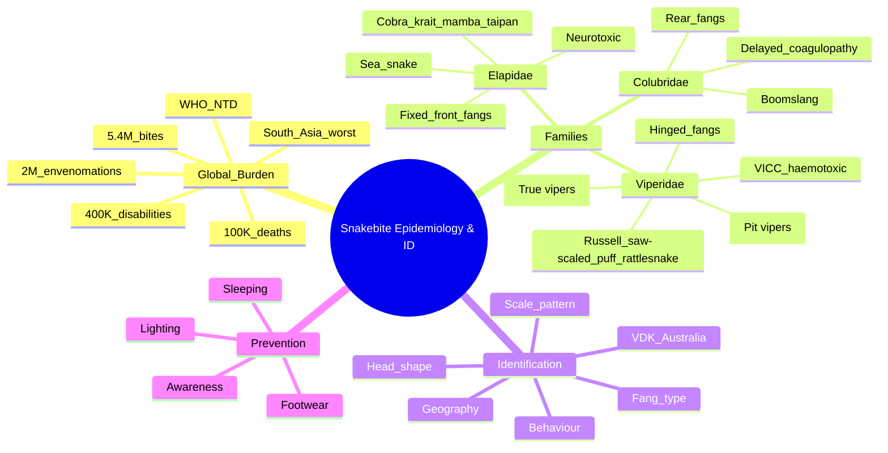

**Related:** [[Snake Envenomation: Clinical Syndromes (Elapid vs Viperid)]], [[Snake Envenomation: Specific Regional Snakes (Asia, Africa, Australia, Americas)]], [[Snake Envenomation: Laboratory Investigation and Monitoring]], [[Snake Envenomation: Specific Antivenom Protocols]], [[Envenomation MOC]]

> [!important]
> **Snakebite = WHO neglected tropical disease. 5.4 M bites/year → 1.8–2.7 M envenomations → 81,000–138,000 deaths → 400,000 permanent disabilities. Highest burden: South Asia, Sub-Saharan Africa, SE Asia, Latin America. Three key families: Elapidae (fixed front fangs, neurotoxic), Viperidae (hinged fangs, haemotoxic/cytotoxic), Colubridae (rear-fanged, boomslang).**

---

## 1. Learning Objectives
- [ ] State global burden of snakebite (deaths, envenomations, disabilities)
- [ ] Identify high-risk regions and populations
- [ ] Classify medically important snake families (Elapidae, Viperidae, Colubridae)
- [ ] Describe fang morphology (proteroglyphous, solenoglyphous, opisthoglyphous)
- [ ] Apply morphological, geographical, and clinical identification principles
- [ ] Recognise key species in each region for antivenom selection
- [ ] Use WHO snake identification resources

---

## 2. Definition & Background

| Item | Detail |
|---|---|
| **Definition** | Envenomation resulting from bite by a venomous snake (fangs inject venom via modified salivary glands) |
| **Global burden (WHO 2017)** | 5.4 M bites/year, 1.8–2.7 M envenomations, 81,000–138,000 deaths, 400,000 amputations/disabilities |
| **Daily burden** | ~7,400 envenomations, 220–370 deaths |
| **Highest burden countries** | India (> 50,000 deaths/yr), Bangladesh, Pakistan, Nepal, Sri Lanka, sub-Saharan Africa, Brazil, SE Asia |
| **Risk groups** | Rural agricultural workers, children (worse per-kg), herders, fishermen, hunters |
| **Time of day** | Most bites during day (farming) or dusk (snakes emerge); some nocturnal (kraits) |
| **Settings** | Farm fields (Russell, krait, cobra), water (sea snake, water cobra), bush (mamba, taipan), gardens (krait) |
| **WHO classification** | Category A neglected tropical disease since 2017 |
| **SDG impact** | Affects SDG 1 (poverty), 3 (health), 5 (gender — women often bitten gathering water/firewood) |

---

## 3. Aetiology & Pathophysiology of Snakebite

### Snake Classification — Medically Important Families

| Family | Subfamily | Fang Type | Common Names | Venom Profile | Examples |
|---|---|---|---|---|---|
| **Elapidae** | Elapinae | **Fixed front fangs (proteroglyphous)** | Cobras, kraits, mambas, taipans, coral snakes, tiger snakes, brown snakes | **Neurotoxic** (pre/post-synaptic) | *Naja naja*, *Bungarus caeruleus*, *Dendroaspis*, *Oxyuranus*, *Notechis*, *Pseudonaja* |
| **Elapidae** | Hydrophiinae | Fixed front (short) | Sea snakes | **Myotoxic** (+ neurotoxic) | *Enhydrina schistosa*, *Hydrophis* |
| **Viperidae** | **Viperinae (true vipers)** | **Hinged front fangs (solenoglyphous)** | Russell's viper, saw-scaled viper, puff adder, Gaboon viper, European adder | **Haemotoxic** (VICC), cytotoxic, nephrotoxic | *Daboia russelii*, *Echis carinatus*, *Bitis arietans*, *B. gabonica*, *Vipera berus* |
| **Viperidae** | **Crotalinae (pit vipers)** | Hinged front + heat-sensing pit | Rattlesnakes, copperheads, cottonmouths, Asian pit vipers, Bothrops, Lachesis (bushmaster) | Haemotoxic, cytotoxic, neurotoxic (some) | *Crotalus*, *Agkistrodon*, *Trimeresurus*, *Bothrops*, *Lachesis* |
| **Colubridae** | Colubrinae | **Rear fangs (opisthoglyphous)** | Boomslang, twig snake | **Coagulopathy** (delayed) | *Dispholidus typus*, *Thelotornis* |
| **Atractaspididae** | — | Side fangs (modified front) | Burrowing asp, stiletto snake | Cardiotoxic, local | *Atractaspis* |

### Fang Morphology

| Type | Description | Families |
|---|---|---|
| **Proteroglyphous** | Fixed, short front fangs (erect, immobile); small delivery channel | Elapidae |
| **Solenoglyphous** | Long, hinged front fangs; folded back when mouth closed, erect when biting; large delivery channel (hypodermic-needle-like) | Viperidae |
| **Opisthoglyphous** | Rear fangs (enlarged back teeth); venom flows by gravity; often requires chewing to envenomate | Colubridae (boomslang) |
| **Aglyphous** | No fangs; no venom delivery | Non-venomous colubrids |

---

## 4. Clinical Features — Global Epidemiology

### Risk Factors

| Factor | Detail |
|---|---|
| **Geography** | Rural tropics > urban; tropical > temperate |
| **Occupation** | Farming, herding, fishing, hunting, forestry |
| **Age** | 20–40 yr (working age); children worse per kg |
| **Sex** | Male 2:1 (occupational exposure); female higher in water-gathering regions |
| **Time of year** | Rainy season (snakes more active); harvest (more contact) |
| **Time of day** | Most daytime (farming); kraits nocturnal (people sleeping on ground) |
| **Activities** | Stepping on snake, handling, sleeping outdoors, fishing |
| **Footwear** | Barefoot > sandals > boots (boots most protective) |
| **Housing** | Mud/thatch houses harbour kraits; rural > urban |

### Risk Reduction

| Intervention | Detail |
|---|---|
| **Footwear** | Closed-toe shoes/boots; reduce bites by 60–80% |
| **Sleeping** | Mosquito nets / bed nets; raised bed; reduce krait bites |
| **Housing** | Concrete, sealed walls, door sweeps; reduce indoor kraits |
| **Lighting** | Torches at night; reduce stepping on snakes |
| **Awareness** | Community education; avoid handling dead snakes (reflex bite) |
| **Snake control** | Avoid; many "harmless" snakes are protected; translocation is controversial |

---

## 5. Snake Identification

### Clinical / Bedside Identification

| Feature | Elapidae | Viperidae | Colubridae |
|---|---|---|---|
| **Head shape** | Short, indistinct neck (many); some (cobra) hood | Triangular, distinct neck, broad head | Variable |
| **Eye** | Round pupil (most); some vertical (sea snake) | Vertical pupil (most); elliptical | Round |
| **Body** | Slender, smooth scales | Stout, keeled scales (often) | Variable |
| **Tail** | Tapers | Short, abrupt | Long |
| **Fang mark** | 1–2 small punctures, 5–10 mm apart | 2 large punctures, 8–15 mm apart (with local swelling) | Often multiple, irregular (chewing) |
| **Behaviour** | Some hood display (cobra); some "dry bite" common (krait 50%) | Defensive, loud hiss (saw-scaled), rattle | Defensive, mimic non-venomous |
| **Geography** | Tropics/subtropics (Asia, Africa, Australia, Americas) | Worldwide (most diversity in tropics) | Africa, Asia, Americas |

### Geographic Distribution — Major Medically Important Snakes

| Region | Major Elapids | Major Viperids | Other |
|---|---|---|---|
| **South Asia (India, Bangladesh, Pakistan, Sri Lanka, Nepal)** | Indian cobra (*Naja naja*), common krait (*Bungarus caeruleus*), Indian krait (*B. candidus*), king cobra, banded krait | Russell's viper (*Daboia russelii*), saw-scaled viper (*Echis carinatus*), hump-nosed pit viper (*Hypnale hypnale*) | — |
| **SE Asia (Myanmar, Thailand, Vietnam, Indonesia, Philippines, Malaysia)** | Monocled cobra, Malayan krait, banded krait, king cobra, long-glanded coral snake | Malayan pit viper, green pit viper (*Trimeresurus*), Russell's viper | — |
| **East Asia (China, Japan, Taiwan, Korea)** | Chinese cobra, many-banded krait, Taiwan cobra | Chinese pit viper (*Gloydius*), mamushi | — |
| **Sub-Saharan Africa** | Black mamba, green mamba, Jameson's mamba, forest cobra, snouted cobra, ring-necked spitting cobra, Egyptian cobra | Puff adder (*Bitis arietans*), Gaboon viper (*B. gabonica*), rhinoceros viper, saw-scaled viper, Berg adder | Boomslang, twig snake, burrowing asp |
| **North Africa / Middle East** | Egyptian cobra, desert black snake | Saw-scaled viper, horned viper, Palestine viper | — |
| **Europe** | Nose-horned viper (not elapid!) | Common European adder (*Vipera berus*), nose-horned viper | — |
| **Australia** | Taipan (*Oxyuranus*), brown snake (*Pseudonaja*), tiger snake (*Notechis*), black snake (*Pseudechis*), death adder | **No native viperids** (only elapids) | — |
| **North America** | Eastern/western coral snake (*Micrurus*) | Rattlesnakes (*Crotalus*), copperhead (*Agkistrodon*), cottonmouth (*A. piscivorus*), pygmy rattlesnake | — |
| **Central / South America** | Coral snakes (*Micrurus*), fer-de-lance (Bothrops = viperid) | **Bothrops** (lance-headed vipers), **Crotalus** (rattlesnakes), bushmaster (*Lachesis*), eyelash viper | — |
| **Marine** | Sea snakes (Hydrophiinae — Indian/Pacific) | — | — |

### Tools for Identification

| Tool | Detail |
|---|---|
| **WHO Snake Identification Guide** | Photo-based key for medically important species by region |
| **Regional photographic guides** | India: Whitaker, Romulus Whitaker; Africa: Branch, Spawls; Aus: Mirtschin; US: Ernst |
| **Apps** | SnakeID, SnakeBiteID, iNaturalist, SnakeSnap |
| **Clinical syndrome** | Neurotoxic = elapid; coagulopathic = viperid (VICC); myotoxic = sea snake; haemorrhagic = viperid |
| **VDK (Venom Detection Kit)** | Australia only; ELISA-based species ID |
| **Dead specimen** | Photograph with scale; do NOT bring live; caution — reflex bite possible for > 1 h post-mortem |
| **Patient/eyewitness description** | "Hooded", "rattled", "patterned", "size", "behaviour" |
| **Local expert** | Herpetologist, zoo, museum, snake catcher |

### Pitfalls of Identification

| Pitfall | Lesson |
|---|---|
| Dead snake can still bite | Reflex bite > 1 h post-mortem — handle with hook only |
| Many non-venomous mimics | Pattern alone unreliable; behaviour + geography better |
| Colour variations within species | Albino, melanistic, juvenile patterns differ |
| Hybridisation (rare) | Some elapid hybrids exist |
| Misidentification by patient | Panic distorts description |
| "Drunk" snakes in mating season | Behaviour atypical |
| Snakes in unusual locations | Found in cities (kraits in houses, cobras in gardens) |

---

## 6. Diagnosis & Investigations for Identification

| Investigation | Indication | Interpretation |
|---|---|---|
| **Bedside clinical** | All bites | Fang marks (number, spacing), local signs |
| **Geographic history** | All | Limits species list |
| **Photo / specimen** | Safe only | Match with guide; never touch live |
| **Venom Detection Kit (VDK)** | Australia | Species-specific (Brown, Tiger, Taipan, Black) |
| **ELISA venom detection** | Research; some countries | Detects venom in wound, blood, urine |
| **20WBCT + clinical syndrome** | All snakebites | Coagulopathy = VICC (viperid) |
| **Neuro exam** | All | Descending paralysis = elapid |
| **Myoglobinuria + CK** | Sea snake, some viperids | Myotoxic |
| **WD test (Whole Blood Clotting Time)** | Resource-limited | Coagulopathy screen |

---

## 7. Management — Identification-Guided

| Step | Action |
|---|---|
| **1. First aid** | PIB (elapids), local pressure (viperids), immobilise |
| **2. Geographic + clinical syndrome** | Narrow likely species |
| **3. WHO/regional AV** | Polyvalent if uncertain; monospecific if ID confident |
| **4. Antivenom per protocol** | See Antivenom Principles & Specific Protocols |
| **5. Monitor** | Coagulation, neuro, renal, vitals |
| **6. Disposition** | ICU/HDU based on severity |

---

## 8. FCPS/MRCP High-Yield Summary

| Fact | Detail |
|---|---|
| **Global snakebite deaths** | 81,000–138,000/year (WHO 2017) |
| **Global envenomations** | 1.8–2.7 M/year |
| **Global bites** | 5.4 M/year |
| **Disabilities** | 400,000/year (amputations, blindness, chronic kidney disease) |
| **Worst-affected region** | South Asia (esp. India > 50,000 deaths/yr) |
| **Elapidae fang type** | Fixed front (proteroglyphous) |
| **Viperidae fang type** | Hinged front (solenoglyphous) |
| **Colubridae fang type** | Rear (opisthoglyphous) |
| **Elapid venom** | Neurotoxic (pre/post-synaptic) |
| **Viperid venom** | Haemotoxic (VICC), cytotoxic, nephrotoxic |
| **Sea snake venom** | Myotoxic (+ neurotoxic) |
| **Viperinae (true vipers)** | Russell's, saw-scaled, puff adder, Gaboon |
| **Crotalinae (pit vipers)** | Rattlesnakes, copperheads, Bothrops, Lachesis |
| **Heat-sensing pit** | Crotalinae only |
| **Indian Big Four** | Cobra, krait, Russell's viper, saw-scaled viper |
| **WHO NTD** | Snakebite listed 2017 |
| **Boomslang** | Colubridae, rear-fanged, severe delayed coagulopathy |
| **Saw-scaled viper** | Viperinae; responsible for most deaths in some regions (Africa, India) |
| **Russell's viper** | Viperinae; VICC, AKI, neurotoxic (some populations) |
| **Krait** | Elapidae; common in India; nocturnal, indoor, **often minimal local signs**, delayed neurotoxicity 6–24 h |
| **Identification priority** | Fang type > scale pattern > head shape > colour |
| **Dead snake can still bite** | Reflex bite for > 1 h post-mortem |
| **Avoid** | Tourniquet, incision, ice, electric shock, herbal |

---

## 9. Viva Questions (10)

**Q1: What is the global burden of snakebite?**
A: 5.4 M bites/year, 1.8–2.7 M envenomations, 81,000–138,000 deaths, 400,000 permanent disabilities. Highest in South Asia, Sub-Saharan Africa, SE Asia, Latin America. India alone accounts for > 50,000 deaths/yr.

**Q2: How are medically important snake families classified by fang type?**
A: Elapidae = fixed front fangs (proteroglyphous); Viperidae = hinged front fangs (solenoglyphous); Colubridae (e.g., boomslang) = rear fangs (opisthoglyphous). Fang type is the most reliable identification feature.

**Q3: What are the Indian "Big Four" snakes?**
A: Indian cobra (*Naja naja*), common krait (*Bungarus caeruleus*), Russell's viper (*Daboia russelii*), saw-scaled viper (*Echis carinatus*). These are responsible for most snakebite deaths in South Asia and are covered by polyvalent Indian ASV.

**Q4: Why is the common krait (Bungarus caeruleus) particularly dangerous?**
A: Bites are often nocturnal, occur indoors, may not be felt. Minimal local signs (small fang marks, no swelling), so victim may not seek care. **Delayed neurotoxicity 6–24 h later** with descending paralysis and respiratory failure.

**Q5: What is the difference between Viperinae and Crotalinae?**
A: Viperinae = "true vipers" — Old World (Russell, saw-scaled, puff adder, Gaboon). Crotalinae = "pit vipers" — have heat-sensing loreal pits (between eye and nostril); New World (rattlesnakes) and Asian (Trimeresurus, Gloydius). Both have hinged fangs.

**Q6: How do you identify a boomslang envenomation?**
A: Rear-fanged colubrid; requires prolonged chewing to envenomate. Delayed (often 24–48 h) severe consumptive coagulopathy with bleeding (mucocutaneous, intracranial). **Antivenom available (South African Vaccine Producers)** but only if species confirmed.

**Q7: Why is a dead snake still dangerous?**
A: Reflex biting can occur for > 1 h after death (muscle spasm, intact venom gland). **Never handle dead snakes with bare hands** — use a stick/hook. Photograph from a distance.

**Q8: What are the most useful clinical clues for snake family?**
A: Fang marks (spacing, depth), local signs (elapid: minimal; viperid: swelling, necrosis), systemic syndrome (neurotoxic = elapid; VICC = viperid; myotoxic = sea snake; delayed coagulopathy = boomslang), geographic location.

**Q9: What is the WHO strategy to reduce snakebite burden by 50% by 2030?**
A: Four pillars: (1) Empower communities (education, first aid, prevention); (2) Deliver safe, effective treatments (AV access, supportive care); (3) Strengthen health systems (training, surveillance); (4) Increase coordination, partnerships, resources. Target: 50% reduction in deaths and disabilities by 2030.

**Q10: Which is the most important feature for snake identification when a specimen is available?**
A: Fang type is the most reliable. Then scale patterns (midbody rows, ventral scute count, subcaudals — single vs paired), head scute pattern, and colour. Patient description and geography are useful but less reliable.

---

## 10. Confusions & Mnemonics

| Confusion | Clarification |
|---|---|
| All big snakes are dangerous | NO — many large pythons/boas are non-venomous |
| Coral snake vs king snake | Coral: red-yellow-black ("red on yellow kills a fellow"); kingsnake: red-black |
| Viperid = pit viper | NOT always — true vipers (Viperinae) lack pit |
| Saw-scaled viper = Russell's viper | NO — different genera, different distributions |
| Sea snake = viper | NO — sea snake is elapid (Hydrophiinae) |
| Boomslang = elapid | NO — colubrid, rear-fanged |
| Colour alone identifies | NO — within-species variation; mimicry common |
| Dead snake = safe | NO — reflex bite > 1 h |
| All krait bites cause immediate symptoms | NO — delayed 6–24 h; minimal local signs |
| Australia = no snakes | NO — has world's most venomous (taipan) but no vipers |

**Mnemonics:**
- **Elapidae**: **E**xpert **N**eurotoxin = cobra, krait, mamba, taipan, coral, sea snake
- **Viperidae**: **V**ascular/**H**aemotoxic = Russell, saw-scaled, puff adder, Gaboon, rattlesnake, Bothrops
- **Indian Big Four**: **C**obra, **K**rait, **R**ussell's, **S**aw-scaled = **CKRS**
- **Fang types**: **P**roteroglyphous (E**l**a**p**id = **E**rect), **S**olenoglyphous (**V**iperid = **S**word-like, hinged), **O**pisthoglyphous (C**o**lubrid = **O**pposite/rear)
- **Global burden**: **5** bites, **2** envenomations, **100**K deaths, **400**K disabilities (M, M, K, K)
- **Heat-sensing pit**: **C**rotalinae = **C**heat (detector)
- **Coral snake rhyme (US)**: "**R**ed on **y**ellow kills a **f**ellow; **r**ed on **b**lack, **v**enom **l**ack" = **RYKF / RBVL**
- **Sea snake**: Hydrophiinae = **H**ydro (water)
- **Boomslang**: **B**ack = **B**ite (rear-fanged, delayed)
- **Snakebite prevention**: **F**ootwear, **S**leeping surface, **L**ighting, **A**wareness = **FSLA**

---

## 11. Mind Map

---

## 12. One-Page Revision Card

| Aspect | Key Point |
|---|---|
| **Deaths/yr** | 81,000–138,000 |
| **Envenomations/yr** | 1.8–2.7 M |
| **Elapidae fang** | Fixed front (proteroglyphous) |
| **Viperidae fang** | Hinged front (solenoglyphous) |
| **Colubridae fang** | Rear (opisthoglyphous) |
| **Elapid venom** | Neurotoxic |
| **Viperid venom** | VICC, cytotoxic, nephrotoxic |
| **Sea snake venom** | Myotoxic |
| **Indian Big Four** | Cobra, krait, Russell, saw-scaled |
| **Crotalinae feature** | Heat-sensing loreal pit |
| **Boomslang** | Rear-fanged, delayed coagulopathy |
| **Viperinae examples** | Russell, saw-scaled, puff, Gaboon |
| **Crotalinae examples** | Rattlesnake, Bothrops, copperhead, cottonmouth |
| **Most reliable ID** | Fang type > scales > head > colour |
| **Dead snake can bite** | Reflex > 1 h |

---

## 13. Spaced Repetition Trackers

| Interval | Date | Score (1–5) | Notes |
|---|---|---|---|
| **24 h** | | | Global burden, families, fang types |
| **3 d** | | | Indian Big 4, key species per region, venom profile |
| **7 d** | | | Identification priority, prevention, WHO strategy |
| **14 d** | | | Viva, mnemonics, MCQ/SBA |
| **30 d** | | | Integrate with Snake Clinical & Regional topics |
| **90 d** | | | Comprehensive exam recall |

---

## 14. Self-Test Scorecard

| Section | Score /5 |
|---|---|
| Global burden numbers | |
| Elapidae vs Viperidae vs Colubridae | |
| Fang morphology | |
| Indian Big Four | |
| Viperinae vs Crotalinae | |
| Sea snake family | |
| Identification priority | |
| Regional distribution | |
| Prevention | |
| WHO NTD strategy | |

---

## 15. Exam Answer Modes (5)

| Mode | Prompt | Key Points |
|---|---|---|
| **Long Essay** | "Global epidemiology of snakebite" | 5 M bites, 2 M envenomations, 100 K deaths, 400 K disabilities; high-risk regions; prevention; WHO strategy |
| **Short Note** | "Snake identification" | Fang type (proteroglyphous vs solenoglyphous vs opisthoglyphous), scales, head shape, geography, VDK |
| **Viva** | "Indian Big Four" | Cobra, krait, Russell's viper, saw-scaled viper; elapid, elapid, viper, viper; covered by Indian ASV |
| **Ward Round** | "Patient bitten by snake, can't identify" | Geographic + clinical syndrome; PIB if elapid, pressure if viperid; polyvalent AV; 20WBCT + labs |
| **Last-Night** | "Key snakebite numbers" | 5 M / 2 M / 100 K / 400 K; fixed vs hinged fang; 6–24 h krait delay; 50% by 2030 target |

---

## 16. MCQs (10)

1. **WHO estimates annual snakebite envenomations globally:**
   A. 500,000
   B. **1.8–2.7 million**
   C. 5 million
   D. 10 million
   E. < 100,000

2. **Elapidae snakes have which fang type?**
   A. Hinged front
   B. **Fixed front (proteroglyphous)**
   C. Rear (opisthoglyphous)
   D. No fangs
   E. Retractable

3. **Viperidae have which fang type?**
   A. Fixed front
   B. **Hinged front (solenoglyphous)**
   C. Rear
   D. No fangs
   E. Multiple rows

4. **Which is NOT in the Elapidae?**
   A. Indian cobra
   B. Common krait
   C. Taipan
   D. **Russell's viper**
   E. Sea snake

5. **Heat-sensing loreal pit is found in:**
   A. All elapids
   B. All vipers
   C. **Crotalinae (pit vipers) only**
   D. Viperinae only
   E. All colubrids

6. **Boomslang (Dispholidus typus) is in family:**
   A. Elapidae
   B. Viperidae
   C. **Colubridae (rear-fanged)**
   D. Hydrophiinae
   E. Atractaspididae

7. **Sea snakes belong to subfamily:**
   A. Viperinae
   B. Crotalinae
   C. **Hydrophiinae (within Elapidae)**
   D. Natricinae
   E. Lamprophiinae

8. **Most reliable identification feature for a specimen:**
   A. Colour
   B. Size
   C. **Fang type**
   D. Tail shape
   E. Behaviour

9. **Indian "Big Four" snakes — all covered by one AV EXCEPT:**
   A. Indian cobra
   B. Common krait
   C. Russell's viper
   D. Saw-scaled viper
   E. **Hump-nosed pit viper (not in Indian ASV — major gap)**

10. **Dead snake can still bite due to:**
    A. Venom persists
    B. **Reflex biting (muscle spasm) > 1 h post-mortem**
    C. Venom glands regenerate
    D. Snake revives
    E. Decomposition releases venom

---

## 17. SBA Questions (5)

1. **45-yr-old farmer in Bangladesh bitten at night, minimal local signs, no fang marks visible. 18 h later: ptosis, descending paralysis. Most likely snake?**
   A. Russell's viper
   B. **Common krait (Bungarus caeruleus) — nocturnal, minimal local signs, delayed neurotoxicity**
   C. Saw-scaled viper
   D. Indian cobra
   E. Indian python

2. **Africa, patient bitten by green snake, severe delayed coagulopathy 24 h later. Most likely?**
   A. Black mamba
   B. Puff adder
   C. **Boomslang (rear-fanged colubrid, delayed VICC)**
   D. Gaboon viper
   E. Green mamba

3. **Farmer bitten in Brazil, severe local necrosis, coagulopathy, mild neuro signs. Snake has heat-sensing pit, triangular head. Family?**
   A. Elapidae
   B. **Crotalinae (pit viper — Bothrops, Crotalus)**
   C. Viperinae
   D. Colubridae
   E. Hydrophiinae

4. **Patient stepped on snake in Australian outback. Brown snake, rapid neurotoxicity and coagulopathy. Most appropriate AV?**
   A. Indian ASV
   B. **CSL Australian Polyvalent (covers Brown, Tiger, Taipan, Black, Death Adder)**
   C. SAIMR
   D. CroFab
   E. Antivipmyn

5. **Sea snake bite in fisherman. Severe myalgia, dark urine, AKI, paralysis. Mechanism?**
   A. Neurotoxic
   B. **Myotoxic (PLA₂ → rhabdomyolysis → myoglobinuria → AKI)**
   C. Cytotoxic
   D. Haemotoxic
   E. Cardiotoxic

---

## 18. Local Navigation

- [[Snake Envenomation: Clinical Syndromes (Elapid vs Viperid)]]
- [[Snake Envenomation: Specific Regional Snakes (Asia, Africa, Australia, Americas)]]
- [[Snake Envenomation: Laboratory Investigation and Monitoring]]
- [[Snake Envenomation: Specific Antivenom Protocols]]
- [[Antivenom: Principles, Types, and Administration]]
- [[Antivenom Adverse Reactions and Management]]
- [[General Principles of Envenomation]]
- [[Envenomation MOC]]