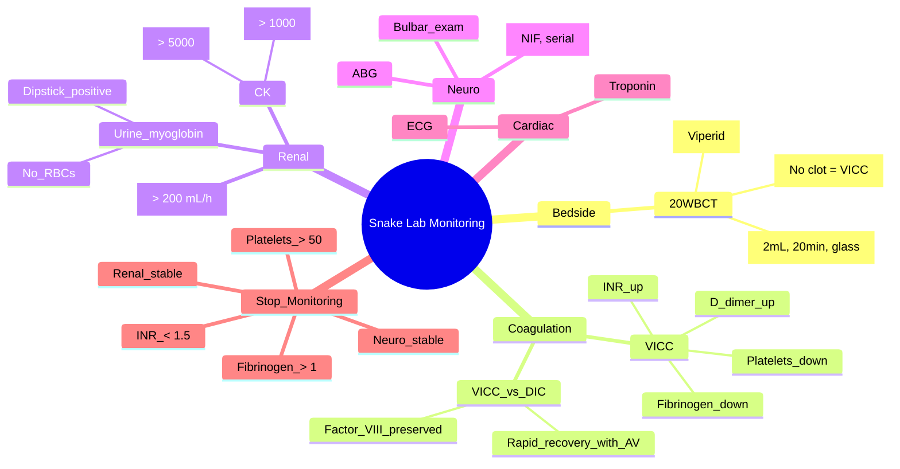

**Related:** [[Snake Envenomation: Clinical Syndromes (Elapid vs Viperid)]], [[Snake Envenomation: Specific Antivenom Protocols]], [[General Principles of Envenomation]], [[Clinical Assessment and Scoring Systems]], [[Envenomation MOC]]

> [!important]
> **Laboratory monitoring = guides antivenom dosing, assesses organ damage, detects complications. Key tests: 20WBCT (bedside coagulopathy screen), formal coagulation (PT/INR, aPTT, fibrinogen, D-dimer, platelets), renal (U&E, creatinine, CK, urine myoglobin), haematology (CBC, blood film), ABG. Serial monitoring q6h until stable. 20WBCT = positive if clot fails to form in 20 min (sensitive for VICC).**

---

## 1. Learning Objectives
- [ ] Perform and interpret 20WBCT
- [ ] Order and interpret formal coagulation studies in viperid envenomation
- [ ] Monitor renal function and detect AKI/myoglobinuria
- [ ] Monitor neurotoxic patients for respiratory failure
- [ ] Use serial monitoring to guide AV dosing and detect late complications
- [ ] Decide when to stop intensive monitoring
- [ ] Apply to FCPS/MRCP clinical scenarios

---

## 2. Investigations — Overview

| Phase | Tests | Purpose |
|---|---|---|
| **Baseline (T0)** | 20WBCT, INR/aPTT, fibrinogen, D-dimer, platelets, FBC, U&E, creatinine, CK, urinalysis, urine myoglobin, ABG, ECG, blood film, blood type + save, malaria/dengue (tropics) | Establish baseline; identify early organ involvement |
| **Serial (q6h)** | 20WBCT, INR/aPTT, fibrinogen, D-dimer, platelets | Detect coagulopathy progression/response to AV |
| **Renal (q12h)** | U&E, creatinine, CK, urine myoglobin, urine output | Detect AKI, myoglobinuria |
| **Neuro (q1h initially)** | Neuro exam (ptosis, EOM, bulbar, limb, RR, FVC, ABG) | Detect respiratory failure |
| **Cardiac (PRN)** | ECG, troponin | For scorpion, marine, some viperids, cardiac symptoms |
| **Stop monitoring** | When INR < 1.5, fibrinogen > 1 g/L, platelets > 50k, neuro stable, renal stable | Step down from ICU/HDU |

---

## 20-Minute Whole Blood Clotting Test (20WBCT)

| Parameter | Detail |
|---|---|
| **Full name** | 20-Minute Whole Blood Clotting Test (also called Lee-White clotting time, modified) |
| **Technique** | 2 mL fresh venous blood → clean dry glass tube → leave undisturbed 20 min at room temp → gently tilt tube to check for clot |
| **Positive (abnormal)** | **Clot fails to form OR clot forms then lyses** within 20 min → suggests hypofibrinogenaemia / consumption coagulopathy |
| **Negative (normal)** | Firm clot → coagulation intact |
| **Sensitivity** | ~85% for INR > 3 / fibrinogen < 1 g/L |
| **Specificity** | High for VICC; lower for mild coagulopathy |
| **Advantages** | Bedside, no lab needed, cheap, rapid, useful in resource-limited settings |
| **Limitations** | Operator-dependent; not standardised; doesn't detect platelet defects, mild coagulopathy; not validated in pregnancy/children |
| **Indication** | All snakebites — baseline + 6-hourly (until stable) |
| **False +ve** | Heparin contamination, prolonged tourniquet, trauma to sample |
| **False -ve** | Early sample (before VICC develops), sampling from heparinised line |
| **Most useful in** | Viperid (VICC); elapid 20WBCT is typically normal (neurotoxic without coagulopathy) |

### 20WBCT Procedure Step-by-Step

| Step | Action |
|---|---|
| **1. Prepare** | Clean dry glass tube (no anticoagulant); stopwatch; tourniquet; syringe/needle |
| **2. Draw** | 2 mL fresh venous blood (clean venepuncture, no heparin line) |
| **3. Tube** | Transfer 2 mL into glass tube; cap or leave open |
| **4. Wait** | Leave undisturbed at room temperature (20–25°C) for 20 min |
| **5. Tilt** | Gently tilt tube; observe for clot |
| **6. Interpret** | Clot present = normal (−ve); no clot/lysed = VICC (+ve) |
| **7. Document** | Time, result, site, who performed |
| **8. Repeat** | At 6 h, 12 h, 24 h, then PRN until stable |

---

## 3. Coagulation Studies

| Test | Sample | Normal | VICC Pattern | Notes |
|---|---|---|---|---|
| **PT/INR** | Citrated plasma | INR 0.8–1.2 | **↑↑ (often > 5)** | Most reliable for viperid VICC |
| **aPTT** | Citrated plasma | 25–35 s | **↑** | Less sensitive than INR for VICC |
| **Fibrinogen** | Citrated plasma | 1.5–4 g/L | **↓↓ (often < 1 g/L)** | Critical threshold for bleeding |
| **D-dimer** | Citrated plasma | < 0.5 mg/L | **↑↑** | Fibrin breakdown; very sensitive |
| **Platelets** | EDTA | 150–400 × 10⁹/L | **↓ (variable)** | Consumption, sequestration |
| **Fibrin degradation products (FDP)** | Citrated plasma | < 10 mg/L | **↑↑** | Fibrinolysis |
| **Thrombin time (TT)** | Citrated plasma | 14–16 s | **↑** | Afibrinogenaemia |
| **Reptilase time** | Citrated plasma | 18–22 s | **↑** | Differentiates from heparin |
| **VWF / Factor VIII** | Citrated plasma | Normal | **Normal (vs ↓ in DIC)** | Distinguishes VICC from DIC |
| **Mixing study** | — | Corrects | Does NOT correct (factor deficiency) | Differentiates inhibitor |
| **TEG/ROTEM** | Citrated whole blood | Normal | Hypocoagulable | Advanced; resource-rich settings |

### VICC vs DIC

| Feature | VICC | DIC |
|---|---|---|
| **Mechanism** | Direct procoagulant activity | Widespread activation (sepsis, malignancy) |
| **Trigger** | Snake venom procoagulant | Sepsis, malignancy, obstetric |
| **Fibrinogen** | Very low | Low |
| **Factor VIII** | **Normal** (preserved) | **Low** (consumed) |
| **Schistocytes** | **Rare** | Common |
| **Response to AV** | **Rapid recovery** | Slow |
| **Prognosis** | Good with AV | Depends on cause |

### When to Repeat Coagulation Panel

| Situation | Frequency |
|---|---|
| **Initial 6 h** | At presentation, 1 h, 6 h after AV |
| **Stable 6–24 h** | 6-hourly |
| **After AV given** | 1 h, 6 h, then 6-hourly until INR normal |
| **Stable** | 12-hourly → 24-hourly |
| **Stop** | INR < 1.5, fibrinogen > 1, platelets > 50k, neuro + renal stable |

---

## 4. Renal Investigations

| Test | Indication | Threshold / Target |
|---|---|---|
| **Urea, Creatinine** | All snakebites | Creatinine < 110 μmol/L |
| **CK** | Myotoxic, sea snake, severe local, dark urine | **> 5× ULN (> 1000 U/L)** = rhabdo risk; **> 5000** = high AKI risk |
| **Urine myoglobin** | Dark urine, rhabdo, sea snake | Positive = rhabdo |
| **Urine dipstick (blood)** | All | Blood + but no RBCs = myoglobinuria |
| **Urine output** | All severe | **> 0.5 mL/kg/h** (> 200–300 mL/h adult) |
| **Serum potassium** | All, esp. rhabdo + AKI | < 5.5 mmol/L |
| **Serum bicarbonate** | All, esp. AKI | > 22 mmol/L (no acidosis) |
| **Urate, phosphate** | AKI, rhabdo | Monitor for tumour lysis–like picture |
| **Urea:creatinine ratio** | AKI | Differentiate pre-renal vs intrinsic |
| **Renal US** | AKI (later) | Exclude obstruction |

### Myoglobinuria Detection

| Test | Result | Interpretation |
|---|---|---|
| **Urine dipstick** | "Blood" + (but microscopy shows no RBCs) | **Myoglobinuria** (sensitive but not specific — also +ve in haemoglobinuria) |
| **Urine colour** | Red-brown / "cola" | Myoglobin (early) or haemoglobin |
| **Urine microscopy** | No RBCs | Differentiates from haematuria |
| **Urine myoglobin immunoassay** | Positive | Confirms myoglobinuria |
| **Serum myoglobin** | Elevated | Confirms muscle breakdown |
| **CK** | > 5× ULN | Confirms rhabdomyolysis |

### Rhabdomyolysis Protocol

| Step | Action | Target |
|---|---|---|
| **1. AV** | Early; specific AV if available | Neutralise circulating venom |
| **2. IV fluids** | Aggressive crystalloid | 1–2 L/h initially; replace losses |
| **3. Target urine output** | **> 200–300 mL/h** (some say 100–200 mL/h) | Prevent myoglobin precipitation in tubules |
| **4. Alkalinisation** | NaHCO₃ — 1–2 amps in 1 L NS | Urine pH > 6.5 (controversial) |
| **5. Mannitol** | 0.5–1 g/kg IV (controversial) | Osmotic diuresis |
| **6. Monitor** | CK 6–12 hourly, creatinine, K⁺, fluid balance | Detect AKI, hyperkalaemia |
| **7. Dialysis** | Standard indications (AEIOU — Acidosis, Electrolytes, Ingestion, Overload, Uraemia) | If AKI severe |
| **8. Avoid** | NSAIDs, contrast, ACEi, nephrotoxins | Prevent further renal injury |
| **9. Tetanus** | Cover | Standard wound care |
| **10. Compartment** | Rare; check pressures if severe swelling | Fasciotomy ONLY if confirmed |

---

## 5. Haematological Investigations

| Test | Indication | Notes |
|---|---|---|
| **Full Blood Count (FBC)** | All | Hb baseline, WCC, platelets, eosinophils (serum sickness) |
| **Blood film** | All severe | Schistocytes (DIC/MAHA), bite-cell, target cells |
| **Reticulocytes** | Haemolysis | ↑ in haemolytic anaemia |
| **Haptoglobin** | Haemolysis | ↓ in intravascular haemolysis |
| **LDH** | Haemolysis, tissue damage | ↑ in haemolysis, rhabdo |
| **Bilirubin (indirect)** | Haemolysis | ↑ unconjugated |
| **Coombs (DAT)** | Immune-mediated haemolysis | Negative in venom haemolysis |
| **G6PD** | Pre-treatment baseline (in some regions) | Avoid oxidative stress |
| **Blood type + antibody screen** | All severe | In case of transfusion |
| **Crossmatch** | If bleeding / need for transfusion | Standard |
| **Bone marrow** | Persistent cytopenia, suspected aplastic anaemia | Rare |

---

## 6. Cardiac Investigations

| Test | Indication | Notes |
|---|---|---|
| **ECG** | All severe; scorpion, marine, cardiac symptoms | Rate, rhythm, ST, QT, ischemia |
| **Troponin** | Cardiac symptoms, scorpion, marine | Myocardial injury |
| **Echocardiogram** | Scorpion (myocarditis), marine (cardiomyopathy) | LV function, regional wall motion |
| **BNP / NT-proBNP** | Heart failure (scorpion, some viperids) | Volume overload |

---

## 7. Respiratory Investigations

| Test | Indication | Notes |
|---|---|---|
| **SpO₂** | All severe | Continuous in ICU |
| **ABG** | All severe; respiratory symptoms | pH, PaO₂, PaCO₂, lactate, HCO₃ |
| **FVC (Forced Vital Capacity)** | Neurotoxic — bulbar + respiratory | FVC < 1 L = intubate; serial hourly |
| **NIF (Negative Inspiratory Force)** | Neurotoxic | NIF < 20 cmH₂O = intubate |
| **CXR** | All severe, scorpion (pulmonary oedema) | Pulmonary oedema, ARDS, infection, aspiration |
| **Peak flow** | Asthmatic hymenoptera | Bronchospasm severity |

---

## 8. Bedside / Point-of-Care Tests

| Test | Indication | Notes |
|---|---|---|
| **Glucometer** | All severe | Hypoglycaemia (AV delay, sepsis, adrenal, pituitary haemorrhage) |
| **Lactate** | Shock, sepsis | Marker of hypoperfusion |
| **Rotational thromboelastometry (ROTEM)** | Severe VICC, bleeding | Research; some centres |
| **Venom Detection Kit (VDK)** | Australia | Species-specific ID |
| **Bedside US (POCUS)** | Cardiac (scorpion), shock | LV function, IVC, free fluid |
| **Capnography** | Intubated, severe | Ventilation adequacy |

---

## 9. Microbiological Investigations

| Test | Indication | Notes |
|---|---|---|
| **Blood cultures** | Febrile, septic | If secondary infection suspected |
| **Wound swab + culture** | Wound infection, necrosis | Aerobic + anaerobic |
| **Tetanus serology** | Severe wounds, unknown immunisation | Anti-tetanus IgG |
| **Malaria thick/thin film** | Tropics, fever | Co-endemic |
| **Dengue NS1, serology** | Tropics, fever | Co-endemic |
| **Leptospira serology** | Wet environment, AKI, jaundice | Weil disease mimic |

---

## 10. Specific Monitoring by Snake Type

| Snake | Key Monitoring |
|---|---|
| **Viperid (Russell's, saw-scaled, Bothrops)** | Coagulation 6-hourly; renal 12-hourly; CK if rhabdo; neuro if any suspicion; ECG |
| **Elapid (cobra, krait, taipan)** | Neuro 30–60 min (FVC, NIF, ABG); coagulation (some elapids have VICC); ECG |
| **Sea snake** | **CK 6–12 hourly**; renal 12-hourly; urine myoglobin; neuro |
| **Spitting cobra (ocular)** | Slit-lamp, fluorescein, visual acuity |
| **Mojave (Type A)** | Coagulation + neuro + renal |
| **Boomslang** | Coagulation (delayed 24–48 h); FBC |

---

## 11. Discontinuing Monitoring

| Parameter | Threshold to Step Down / Stop |
|---|---|
| **Coagulation** | INR < 1.5, fibrinogen > 1 g/L, platelets > 50 × 10⁹/L, 20WBCT negative × 2 (6 h apart) |
| **Renal** | Creatinine at baseline or stable; urine output > 0.5 mL/kg/h; CK < 1,000 U/L |
| **Neuro** | No progression; FVC improving; intact bulbar; off ventilator |
| **Local** | Swelling not progressing; no new bullae/necrosis |
| **Haemodynamic** | Stable on ward/HDU |

---

## 12. FCPS/MRCP High-Yield Summary

| Fact | Detail |
|---|---|
| **20WBCT technique** | 2 mL blood in glass tube, 20 min RT, tilt to check clot |
| **20WBCT positive** | No clot = VICC (fibrinogen < 1) |
| **20WBCT most sensitive for** | Viperid coagulopathy |
| **20WBCT normal in** | Elapid neurotoxicity, mild envenomation, dry bite |
| **Coagulation panel** | INR, aPTT, fibrinogen, D-dimer, platelets |
| **Monitoring frequency** | 6-hourly until stable |
| **VICC pattern** | ↑ INR, ↓ fibrinogen, ↓ platelets, ↑ D-dimer |
| **VICC vs DIC** | Factor VIII **normal** in VICC, **low** in DIC |
| **Renal panel** | U&E, creatinine, CK, urine myoglobin, urine output |
| **CK threshold for rhabdo** | > 1000 U/L; > 5000 = high AKI risk |
| **Urine myoglobin test** | Dipstick blood + (no RBCs on microscopy) = myoglobinuria |
| **Target urine output** | > 0.5 mL/kg/h; > 200–300 mL/h with rhabdo |
| **Urine alkalinisation** | NaHCO₃ to pH > 6.5 (controversial) |
| **Neuro monitoring** | FVC, NIF, ABG q1h; intubate if FVC < 1 L or NIF < 20 cmH₂O |
| **Cardiac monitoring** | ECG + troponin for scorpion, marine, some viperids |
| **Stop monitoring** | INR < 1.5, fibrinogen > 1, platelets > 50k, renal + neuro stable |
| **AV response** | Coagulopathy should improve within 6 h of adequate AV; if not, repeat AV |
| **Pregnancy** | Same monitoring; consider fetal monitoring |
| **DIC vs VICC** | VICC = factor VIII preserved; recovers with AV |

---

## 13. Viva Questions (10)

**Q1: How do you perform a 20WBCT?**
A: 2 mL fresh venous blood → clean dry glass tube → leave undisturbed at room temp (20–25°C) for 20 min → gently tilt to check for clot. Positive (abnormal) = no clot forms or clot lyses = consumption coagulopathy. Negative (normal) = firm clot.

**Q2: What is the sensitivity of 20WBCT for VICC?**
A: ~85% for INR > 3 and fibrinogen < 1 g/L. Bedside screen; useful in resource-limited settings. **False negative** possible if sample taken early (before VICC develops) or from heparin line. **False positive** with heparin contamination or prolonged tourniquet.

**Q3: How do you differentiate VICC from DIC?**
A: Both show ↑ INR, ↓ fibrinogen, ↓ platelets, ↑ D-dimer. **Factor VIII is preserved in VICC** (consumed in DIC). Schistocytes common in DIC, rare in VICC. VICC recovers rapidly with antivenom; DIC requires treating underlying cause.

**Q4: How often do you repeat coagulation studies in viperid envenomation?**
A: Baseline, 1 h, 6 h post-AV, then 6-hourly until stable. Stop when INR < 1.5, fibrinogen > 1 g/L, platelets > 50 × 10⁹/L for 2 consecutive checks 6 h apart.

**Q5: What is the CK threshold for concern of rhabdomyolysis and AKI?**
A: CK > 5× ULN (> 1,000 U/L) suggests rhabdomyolysis. **CK > 5,000 U/L = high risk of AKI.** Management: aggressive IV fluids, urine output target > 200–300 mL/h, alkalinisation (NaHCO₃ to urine pH > 6.5), mannitol (controversial), avoid nephrotoxins, dialysis if severe AKI.

**Q6: How do you confirm myoglobinuria at the bedside?**
A: Urine dipstick + for "blood" but **urine microscopy shows no RBCs** = myoglobinuria (or haemoglobinuria). Confirm with urine myoglobin immunoassay or serum myoglobin. CK > 1,000 U/L confirms muscle breakdown.

**Q7: When would you intubate a neurotoxic patient based on monitoring?**
A: FVC < 1 L (some say < 20 mL/kg or 30% predicted), NIF < 20 cmH₂O (less negative), RR > 30, SpO₂ < 94% on O₂, PaCO₂ > 45 mmHg, bulbar palsy with aspiration risk, GCS < 8. **Don't wait for respiratory arrest** — early intubation saves lives.

**Q8: What bedside test can detect venom in wound (Australia)?**
A: **Venom Detection Kit (VDK)** — ELISA-based; detects specific Australian elapid venom (Brown, Tiger, Taipan, Black, Death Adder) at bite site, blood, urine. Used to identify species and select specific AV.

**Q9: How does coagulation recovery differ between VICC and DIC?**
A: VICC: rapid recovery (12–48 h) with antivenom, as venom is neutralised. DIC: slow recovery; requires treating underlying cause (sepsis, malignancy); may need FFP, cryoprecipitate, platelets.

**Q10: What is the role of TEG/ROTEM in envenomation?**
A: Thromboelastography/ROTEM = viscoelastic test of clot formation, strength, lysis. Detects hypocoagulability (VICC), hypercoagulability (early VICC), and fibrinolysis. Used in research and some centres; can guide blood product replacement. Not yet standard in resource-limited envenomation management.

---

## 14. Confusions & Mnemonics

| Confusion | Clarification |
|---|---|
| 20WBCT replaces INR | NO — complementary; 20WBCT is bedside screen |
| VICC = DIC | CLOSE; factor VIII normal in VICC, low in DIC |
| Negative 20WBCT = no envenomation | NO — elapid neurotoxic, dry bite, mild cases |
| Stop monitoring after AV given | NO — continue 6-hourly until stable |
| CK normal in sea snake | NO — sea snake has CK > 50,000 typical |
| Mannitol always for rhabdo | NOT always — controversial; ensure hydration first |
| Alkalinise all rhabdo | CONTROVERSIAL — benefit uncertain; maintain volume > alkalinisation |
| Myoglobin = visible red urine | NO — may be invisible; dipstick +ve but no RBCs |
| AV works despite normal 20WBCT | MAYBE — but normal 20WBCT argues against VICC indication for AV |
| FVC < 1 L = intubate | YES (in neurotoxic); don't wait for arrest |
| Routine LFTs | NOT routine — only if hepatic involvement suspected |

**Mnemonics:**
- **20WBCT**: **2 mL, 20 min, glass tube** = **2/20/G**
- **VICC labs**: **I**NR↑, **F**ibrinogen↓, **P**latelets↓, **D**-dimer↑ = **IFPD**
- **VICC vs DIC**: **V**ICC = **V**enom = factor **V**III preserved; **D**IC = **D**epleted factor VIII
- **Rhabdo targets**: **U**rine > 200 mL/h, **p**H > 6.5, **C**K < 1000 = **UpC**
- **Stop monitoring**: **I**NR < 1.5, **F**ibrinogen > 1, **P**latelets > 50k, **N**euro stable, **R**enal stable = **IFNPR**
- **Intubate threshold**: **F**VC < 1 L, **N**IF < 20 cmH₂O, **R**R > 30, **S**pO₂ < 94, **P**CO₂ > 45 = **FNRSP**
- **Bedside dipstick**: **D**ipstick **+** for blood + **N**o RBCs on microscopy = **D**N = **D**ipstick **N**o cells = myoglobinuria
- **Cardiac indications**: **S**corpion, **M**arine, **V**iperid (catecholamine surge), **C**ardiac symptoms = **SMVC**
- **Renal panel**: **U**&**E**, **C**reatinine, **C**K, **U**rine myoglobin, **O**utput = **UCCUO**
- **Bleeding thresholds**: **F**ibrinogen < 1 = **F**atal bleed; **P**latelets < 50 = **P**erilous; **I**NR > 3 = **I**ntervention = **FPI**

---

## 15. Mind Map

---

## 16. One-Page Revision Card

| Test | VICC Pattern | Threshold |
|---|---|---|
| **20WBCT** | No clot | +ve = fibrinogen < 1 |
| **INR** | ↑↑ | > 1.5 = VICC |
| **Fibrinogen** | ↓↓ | < 1 g/L = bleeding risk |
| **Platelets** | ↓ | < 50 × 10⁹/L = bleeding risk |
| **D-dimer** | ↑↑ | Sensitive |
| **Factor VIII** | **Normal** | Distinguishes from DIC |
| **CK** | ↑ in rhabdo | > 5,000 = high AKI risk |
| **Urine myoglobin** | +ve in rhabdo | Dipstick + for blood, no RBCs |
| **Creatinine** | ↑ in AKI | > 110 μmol/L = AKI |
| **FVC** | ↓ in neurotoxic | < 1 L = intubate |

---

## 17. Spaced Repetition Trackers

| Interval | Date | Score (1–5) | Notes |
|---|---|---|---|
| **24 h** | | | 20WBCT, VICC labs, monitoring frequency |
| **3 d** | | | Rhabdo protocol, intubation thresholds, VICC vs DIC |
| **7 d** | | | Specific snake monitoring, advanced tests, discontinuation |
| **14 d** | | | Viva, mnemonics, MCQ/SBA |
| **30 d** | | | Integrate with Snake & AV topics |
| **90 d** | | | Comprehensive exam recall |

---

## 18. Self-Test Scorecard

| Section | Score /5 |
|---|---|
| 20WBCT technique & interpretation | |
| VICC labs | |
| VICC vs DIC | |
| Monitoring frequency | |
| Rhabdo protocol | |
| Myoglobinuria detection | |
| Neuro monitoring (FVC, NIF) | |
| Cardiac monitoring indications | |
| Discontinuation criteria | |
| Australia VDK | |

---

## 19. Exam Answer Modes (5)

| Mode | Prompt | Key Points |
|---|---|---|
| **Long Essay** | "Monitoring snake envenomation" | 20WBCT, coagulation, renal, neuro, cardiac, frequency, stopping |
| **Short Note** | "20WBCT" | 2 mL, 20 min, glass tube, VICC, sensitivity, limitations |
| **Viva** | "VICC vs DIC" | Mechanism, factor VIII, recovery, schistocytes |
| **Ward Round** | "Viper bite 6 h ago, what now?" | 20WBCT, INR, fibrinogen, CK, urine output; if persistent, repeat AV |
| **Last-Night** | "Key lab numbers" | INR > 1.5, fibrinogen < 1, platelets < 50, FVC < 1 L, CK > 5000 |

---

## 20. MCQs (10)

1. **20WBCT technique:**
   A. 5 mL citrate tube, 20 min
   B. **2 mL venous blood in glass tube, 20 min RT**
   C. 5 mL heparin, 10 min
   D. 1 mL capillary, 30 min
   E. 2 mL EDTA, 20 min

2. **20WBCT positive indicates:**
   A. Normal coagulation
   B. **Consumption coagulopathy / hypofibrinogenaemia**
   C. Platelet dysfunction
   D. Heparin effect
   E. Normal

3. **20WBCT most sensitive for:**
   A. Elapidae
   B. **Viperidae coagulopathy**
   C. Colubridae
   D. Hydrophiinae
   E. All equally

4. **Coagulation monitoring frequency in viperid:**
   A. Hourly
   B. **6-hourly until stable**
   C. 12-hourly
   D. 24-hourly
   E. Once

5. **VICC vs DIC — which differs?**
   A. INR
   B. Fibrinogen
   C. **Factor VIII (preserved in VICC, low in DIC)**
   D. D-dimer
   E. Platelets

6. **CK threshold for high AKI risk in rhabdo:**
   A. 1,000
   B. **5,000**
   C. 10,000
   D. 50,000
   E. 100,000

7. **Urine dipstick blood + but no RBCs on microscopy = :**
   A. Haematuria
   B. **Myoglobinuria (or haemoglobinuria)**
   C. Porphyria
   D. Normal
   E. Drug effect

8. **Target urine output in rhabdomyolysis:**
   A. > 0.5 mL/kg/h
   B. **> 200–300 mL/h (or 1–2 L/h fluid)**
   C. > 500 mL/h
   D. > 50 mL/h
   E. > 1 mL/h

9. **FVC threshold for intubation in neurotoxic:**
   A. < 2 L
   B. **< 1 L (or < 20 mL/kg)**
   C. < 3 L
   D. < 500 mL
   E. < 4 L

10. **Discontinue coagulation monitoring when:**
    A. After 12 h
    B. **INR < 1.5, fibrinogen > 1, platelets > 50k, stable**
    C. After AV
    D. After 24 h
    E. Patient feels better

---

## 21. SBA Questions (5)

1. **Viper bite, INR 5, fibrinogen 0.3. 6 h after 10 vials AV, INR 3, fibrinogen 0.5. Next step:**
   A. Stop AV
   B. **Repeat AV (persistent coagulopathy = ongoing venom)**
   C. Heparin
   D. FFP only
   E. Plasma exchange

2. **Sea snake bite, CK 60,000, dark urine. Best next step:**
   A. AV only
   B. **Aggressive IV fluids (1–2 L/h), urine output > 200–300 mL/h, alkalinisation, AV**
   C. Dialysis immediately
   D. Mannitol only
   E. Fasciotomy

3. **Cobra bite with descending paralysis. FVC 800 mL. Best next step:**
   A. Observe
   B. **Intubate and ventilate (FVC < 1 L)**
   C. Neostigmine only
   D. AV only
   E. Discharge

4. **Differentially VICC from DIC: which lab is preserved in VICC?**
   A. Platelets
   B. **Factor VIII (preserved in VICC, consumed in DIC)**
   C. Fibrinogen
   D. D-dimer
   E. PT

5. **Negative 20WBCT + neurotoxic signs + no coagulopathy: most likely?**
   A. Viperid
   B. **Elapid envenomation (neurotoxic without VICC)**
   C. Dry bite
   D. Marine
   E. Scorpion

---

## 22. Local Navigation

- [[Snake Envenomation: Clinical Syndromes (Elapid vs Viperid)]]
- [[Snake Envenomation: Global Epidemiology and Snake Identification]]
- [[Snake Envenomation: Specific Antivenom Protocols]]
- [[Snake Envenomation: Specific Regional Snakes (Asia, Africa, Australia, Americas)]]
- [[Antivenom: Principles, Types, and Administration]]
- [[Antivenom Adverse Reactions and Management]]
- [[General Principles of Envenomation]]
- [[Clinical Assessment and Scoring Systems]]
- [[Envenomation MOC]]

## PasTest Scenario SBAs (Clinical Vignettes)

> **Auto-generated PasTest/Mediscope-style scenario SBAs** grounded in the authored source. Each scenario tests a real clinical fact (triad, specific sign, contraindication, trial, first-line Rx) extracted from the topic. *Source: Ch 12: Envenomation — Snake Envenomation- Laboratory Investigation and Monitoring*

**Q1.** Which of the following features is most specific or characteristic of Snake Envenomation- Laboratory Investigation and Monitoring?

  - **A.** Urine dipstick
  - **B.** A feature common to many acute inflammatory conditions
  - **C.** A non-specific sign that does not localise the diagnosis
  - **D.** An investigation finding rather than a clinical feature

  > **Answer: A** — Urine dipstick
  >
  > *Source:* lude obstruction |

### Myoglobinuria Detection

| Test | Result | Interpretation |
|---|---|---|
| **Urine dipstick** | "Blood" + (but microscopy shows no RBCs) | **Myoglobinuria** (sensitive but not

