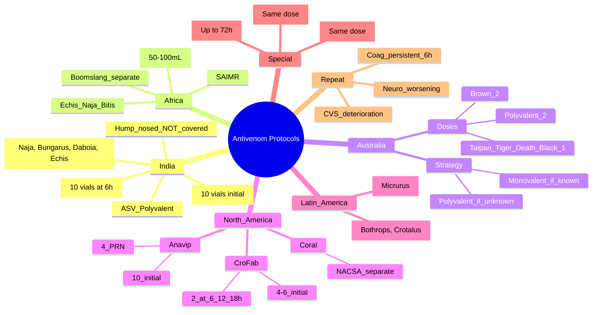

**Related:** [[Snake Envenomation: Clinical Syndromes (Elapid vs Viperid)]], [[Snake Envenomation: Laboratory Investigation and Monitoring]], [[Antivenom: Principles, Types, and Administration]], [[Snake Envenomation: Specific Regional Snakes (Asia, Africa, Australia, Americas)]], [[Envenomation MOC]]

> [!important]
> **Antivenom protocols vary by region. Principles: early IV, dose by venom load (NOT weight), repeat until clinical/lab improvement. Indian ASV (Big 4), African SAIMR, Australian monovalent/polyvalent, US CroFab/Anavip, Mexican Antivipmyn, Brazilian BIOCLON, coral snake AV (NACSA). Pregnancy/children: SAME adult dose. Late presenters (< 72 h): still beneficial.**

---

## 1. Learning Objectives
- [ ] Apply region-specific antivenom protocols
- [ ] Know dosing, administration, and repeat criteria for each product
- [ ] Match antivenom product to regional snake species
- [ ] Manage pregnancy, children, and late presenters
- [ ] Apply to FCPS/MRCP scenarios (tropical medicine, travel, emergency)

---

## 2. General Principles (Recap)

| Principle | Detail |
|---|---|
| **Indication** | Systemic envenomation (coag, neuro, CVS, renal, severe local) |
| **Route** | IV infusion (saline), 30–60 min |
| **Dose by** | Venom load (vials), not patient weight |
| **Adult & child** | Same dose (children have higher venom load per kg) |
| **Pregnancy** | Same dose; safe; benefits > risk |
| **Skin test** | NOT recommended |
| **Premedication** | Not routine; SC adrenaline in high-risk |
| **Repeat dose** | At 6 h if no clinical/lab improvement |
| **Late presenter** | Still beneficial up to 24–72 h |

---

## 3. India — Polyvalent Antivenom (ASV)

| Item | Detail |
|---|---|
| **Product (examples)** | Bharat Serums Polyvalent ASV; VINS Polyvalent ASV; Premium Serums |
| **Type** | Whole IgG, equine (older); F(ab')₂ newer |
| **Coverage ("Big Four")** | **Indian cobra (Naja naja), Common krait (Bungarus caeruleus), Russell's viper (Daboia russelii), Saw-scaled viper (Echis carinatus)** |
| **NOT covered** | Hump-nosed pit viper (*Hypnale hypnale*) — major gap; King cobra (separate AV) |
| **Initial dose** | **8–10 vials** (severe) or 5 vials (moderate) |
| **Repeat dose** | 5–10 vials at 6 h if coagulopathy persists (20WBCT still +ve, INR > 1.5) or neuro worsens |
| **Maximum** | No strict max; titrate to response |
| **Administration** | IV in 100 mL saline over 1 h |
| **Reactions** | Higher (5–20%) with whole IgG |
| **Pregnancy** | Same dose; safe |
| **Children** | Same as adult (10 vials) |

### Indian ASV Repeat Dosing Algorithm

| Time | Action |
|---|---|
| **T0** | 10 vials IV over 1 h |
| **6 h** | 20WBCT + INR; if +ve/INR > 1.5 → repeat 10 vials |
| **12 h** | Repeat 20WBCT + INR; if still +ve → repeat 10 vials |
| **18–24 h** | Continue; if persistently +ve → consider FFP, cryo, or AV failure |
| **Stable** | Stop when 20WBCT negative and INR < 1.5 for 2 consecutive checks 6 h apart |

---

## 4. Africa — Polyvalent Antivenoms

### South African Institute for Medical Research (SAIMR) Polyvalent

| Item | Detail |
|---|---|
| **Type** | F(ab')₂, equine |
| **Coverage** | Banded cobra, snouted cobra, Cape cobra, Black mamba, Puff adder, Gaboon viper, Rinkhals, Boomslang (separate) |
| **Initial dose** | **50–100 mL** (≈ 5–10 vials) |
| **Repeat** | 50 mL at 6 h if coagulopathy/bleeding/neuro persists |
| **Children** | Same as adult |
| **Pregnancy** | Same; safe |
| **Reactions** | Fewer than whole IgG (F(ab')₂) |

### African Polyvalent (VINS, Bharat, others — used in sub-Saharan Africa)

| Item | Detail |
|---|---|
| **Coverage** | Echis, Naja (African spitting/non-spitting), Bitis, Dendroaspis, possibly B. gabonica |
| **Initial dose** | 2–4 vials (depends on product) |
| **Repeat** | Per local protocol; usually at 6 h |
| **Boomslang** | **Separate monospecific** (SAVP monovalent) — only for confirmed *Dispholidus typus* |

---

## 5. Australia — Monovalent & Polyvalent

### Australian Strategy

| Scenario | Approach |
|---|---|
| **Snake identified (or VDK confirms species)** | **Monovalent (species-specific)** preferred — less foreign protein, fewer reactions |
| **Snake unknown / VDK unavailable** | **Polyvalent** covers all major Australian elapids |
| **Clinical features suggest specific syndrome** | Use clinical + VDK to guide |

### Monovalent Antivenoms (CSL Australia)

| Species | Antivenom | Initial Dose | Repeat |
|---|---|---|---|
| **Taipan (*Oxyuranus scutellatus*)** | Taipan Antivenom | **1 vial** (≈ 12,000 units) | Repeat at 1–2 h if no improvement |
| **Brown snake (*Pseudonaja*)** | Brown Snake Antivenom | **2 vials** (≈ 4,000 units each) | Repeat at 1–2 h if coagulopathy |
| **Tiger snake (*Notechis*)** | Tiger Snake Antivenom | **1 vial** | Repeat if needed |
| **Death adder (*Acanthophis*)** | Death Adder Antivenom | **1 vial** | Repeat if needed |
| **Black snake (*Pseudechis*)** | Black Snake Antivenom | **1 vial** | Repeat if needed |
| **Sea snake** | Sea Snake Antivenom | **1 vial** | Repeat if myotoxicity/neuro |

### Polyvalent Antivenom (CSL Australia)

| Item | Detail |
|---|---|
| **Coverage** | All 5 Australian monovalent species (Taipan, Brown, Tiger, Black, Death Adder) |
| **Initial dose** | **2 vials** (when snake unknown or VDK unavailable) |
| **Repeat** | 1–2 vials at 1–2 h if no improvement |
| **Note** | Use VDK (Venom Detection Kit) at bite site, blood, urine to identify species |
| **Reaction rate** | Lower (F(ab')₂ sheep) |

---

## 6. North America — CroFab & Anavip & NACSA

### Crotalidae (Pit Viper) Antivenoms

| Product | Type | Coverage | Initial Dose | Maintenance | Notes |
|---|---|---|---|---|---|
| **CroFab (Crotalidae Polyvalent Immune Fab — ovine)** | Fab, ovine | All North American pit vipers (rattlesnakes, copperheads, cottonmouths) | **4–6 vials** | **2 vials at 6, 12, 18 h** until control | Short t½ → recurrence possible; control + maintenance protocol |
| **Anavip (Crotalidae Immune F(ab')₂ — equine)** | F(ab')₂, equine | All North American pit vipers | **10 vials** initial; **4 vials PRN** for bleeding/recurrence | Lower recurrence rate (longer t½) | Newer; less recurrence |
| **Note** | NOT for coral snakes (use NACSA) | | | | |

### Coral Snake Antivenom

| Product | Detail |
|---|---|
| **Name** | North American Coral Snake Antivenom (NACSA) — Wyeth; also Coralmyn in Mexico |
| **Coverage** | *Micrurus fulvius* (Eastern coral) and *M. tener* (Texas coral) |
| **Dose** | 3–5 vials (or as per product) |
| **Indication** | Confirmed or suspected coral snake bite with neurotoxicity (ptosis, bulbar, descending paralysis) |
| **Availability** | Limited (Pfizer discontinued Wyeth AV in US in 2019; alternative Coralmyn imported) |
| **Caveat** | Coral snake envenomation may be delayed; observe 24 h even if asymptomatic |
| **DO NOT** | Use CroFab for coral snake (different family) |

---

## 7. Latin America

### Mexico — Antivipmyn & Coralmyn

| Product | Type | Coverage | Dose |
|---|---|---|---|
| **Antivipmyn (BIOCLON)** | F(ab')₂, equine | Bothrops, Crotalus (Mexico/Central America) | 2–5 vials initial; repeat PRN |
| **Coralmyn** | F(ab')₂, equine | Micrurus (coral snakes) | 5–10 vials |

### Brazil / South America — Butantan & BIOCLON

| Product | Coverage | Dose |
|---|---|---|
| **Antibotrópico (Butantan/BIOCLON)** | Bothrops (lance-headed) | 5–10 vials |
| **Anticrotálico** | Crotalus (rattlesnake) | 5–10 vials |
| **Antilaquético** | Lachesis (bushmaster) | 5–10 vials |
| **Antielapídico** | Micrurus (coral) | 5–10 vials |
| **Soro Antibotrópico-Laquético** | Bothrops + Lachesis | 10 vials |

---

## 8. Europe

| Region | Antivenom | Coverage | Dose |
|---|---|---|---|
| **Europe (ViperaTAb — Vipera berus)** | ViperaTAb (equine F(ab')₂) | European viper (*Vipera berus*) | 8–10 mL initial; repeat PRN |
| **Polyvalent European (ViperFAV)** | Sanofi-Pasteur | Mediterranean vipers (*V. aspis*, *V. ammodytes*) | Per protocol |

---

## 9. Asia-Pacific

| Country | Product | Coverage |
|---|---|---|
| **Thailand** | Thai Red Cross Polyvalent | Monocellate cobra, Malayan krait, Russell's viper, Malayan pit viper, green pit viper |
| **Indonesia** | Bio Farma Polyvalent | Spitting cobra, Malayan krait, Russell's viper, saw-scaled viper, Asian pit vipers |
| **Japan** | Mamushi Antivenom (Kitasato) | *Gloydius blomhoffii* (mamushi) |
| **China** | Various (Shanghai, Beijing) | Chinese cobra, krait, pit viper (Gloydius) |
| **Papua New Guinea** | CSL Polyvalent | Taipan, death adder, brown |

---

## 10. Special Populations

### Pregnancy

| Aspect | Detail |
|---|---|
| **Dose** | **Same as adult (by venom load)** |
| **Safety** | **Antivenom is safe in pregnancy** |
| **Indication** | Same thresholds; benefits outweigh fetal risk |
| **Type** | F(ab')₂ preferred if available (less Fc-mediated placental transfer) |
| **Complications** | VICC → placental abruption, fetal demise; shock → fetal hypoxia |
| **Fetal monitoring** | CTG / Doppler in 2nd/3rd trimester; obstetric input |
| **Delivery** | If viable + maternal decompensation, may need emergency C-section |

### Children

| Aspect | Detail |
|---|---|
| **Dose** | **Same as adult (10 vials Indian ASV, 4–6 vials CroFab, 2 vials Aus monovalent)** |
| **Reason** | Venom load is the same; children have **higher venom per kg** (worse envenomation per kg) |
| **Fluid balance** | Close monitoring — small fluid shifts significant |
| **Reactions** | Higher anaphylaxis rate (more atopic); premedication not routine but consider |
| **Intubation** | Smaller ETT; experienced paediatric airway |

### Elderly

| Aspect | Detail |
|---|---|
| **Dose** | Same as adult |
| **Caution** | Higher comorbidities; renal/cardiac; polypharmacy (β-blockers, ACEi) |
| **Reaction risk** | Higher; slower infusion; monitor closely |
| **β-blocker + AV** | Refractory anaphylaxis; glucagon |
| **ACEi + AV** | Angioedema; icatibant/FFP |

### Late Presenters (> 24 h)

| Aspect | Detail |
|---|---|
| **Benefit** | **Still beneficial up to 24–72 h** for ongoing coagulopathy, necrosis progression, myotoxicity, neurotoxicity |
| **Rationale** | Venom depot at bite site continues release; AV neutralises circulating + released venom |
| **Coagulopathy** | May still respond at 48 h |
| **Necrosis** | Cannot reverse established; can halt progression |
| **Neuro** | May still prevent progression; established presynaptic paralysis = wait for regeneration |

---

## 11. Repeat Dosing — General Criteria

| Scenario | Repeat Dose |
|---|---|
| **Persistent coagulopathy at 6 h** (INR > 1.5, 20WBCT +ve) | Repeat full dose |
| **Worsening neuro** (new ptosis, FVC drop) | Repeat full dose + intubate if needed |
| **Haemodynamic deterioration** | Repeat; consider vasopressors |
| **Progressive local swelling** | Repeat if early; AV may halt progression |
| **Recurrent coagulopathy** (CroFab — short t½) | Repeat Fab per protocol (6, 12, 18 h) |
| **Stable or improving** | **No repeat** — observe |

---

## 12. Common Pitfalls

| Pitfall | Correction |
|---|---|
| Half dose in child | NO — same as adult |
| Skip AV in pregnancy | NO — indicated |
| Refuse AV > 24 h | NO — still beneficial |
| Switch to FFP without AV | NO — AV first, FFP if bleeding |
| One dose cures all | NO — repeat until stable |
| Prophylactic AV for all bites | NO — only systemic or severe local |
| Antivenom for elapid dry bite | NO — observe |
| Stop AV after first dose if no response | NO — give time (1–2 h); repeat if no improvement |

---

## 13. FCPS/MRCP High-Yield Summary

| Fact | Detail |
|---|---|
| **Indian ASV** | Whole IgG, covers Big 4 (Naja, Bungarus, Daboia, Echis) |
| **Indian ASV dose** | 8–10 vials initial; repeat 10 vials at 6 h if coagulopathy |
| **Hump-nosed pit viper** | NOT covered by Indian ASV — major gap |
| **SAIMR** | F(ab')₂, covers African cobras, mambas, Bitis, rinkhals |
| **SAIMR dose** | 50–100 mL initial |
| **Boomslang AV** | **Separate monospecific** (SAVP) — only for confirmed boomslang |
| **Australian strategy** | Monovalent if ID confirmed; polyvalent if unknown |
| **Brown snake AV** | 2 vials monovalent |
| **Taipan / Tiger / Death Adder / Black AV** | 1 vial monovalent |
| **Polyvalent AV (Aus)** | 2 vials if snake unknown |
| **CroFab** | Ovine Fab, 4–6 vials initial, 2 vials at 6/12/18 h |
| **Anavip** | Equine F(ab')₂, 10 vials initial, 4 vials PRN — lower recurrence |
| **Coral snake AV (NACSA)** | Separate; for *Micrurus*; limited supply |
| **Antivipmyn** | Mexico; Bothrops + Crotalus; 2–5 vials |
| **Pregnancy** | Same dose; safe |
| **Children** | Same dose (venom load) |
| **Late presenter** | AV still beneficial up to 24–72 h |
| **Repeat dosing** | At 6 h if coagulopathy/neuro worsens |

---

## 14. Viva Questions (10)

**Q1: What is the Indian "Big Four" and what is the initial dose of Indian polyvalent ASV?**
A: Big Four = Indian cobra (*Naja naja*), common krait (*Bungarus caeruleus*), Russell's viper (*Daboia russelii*), saw-scaled viper (*Echis carinatus*). Initial dose: 8–10 vials IV over 1 h; repeat 5–10 vials at 6 h if coagulopathy persists. **Hump-nosed pit viper (*Hypnale*) is NOT covered** — major gap in South Asian AV.

**Q2: What is the Australian approach to antivenom choice?**
A: If snake is identified (or VDK confirms species) → monovalent (species-specific, less foreign protein, fewer reactions). If snake unknown or VDK unavailable → polyvalent (covers all 5 major Australian elapids). Brown snake = 2 vials; Taipan/Tiger/Death Adder/Black = 1 vial; Polyvalent = 2 vials.

**Q3: How does CroFab dosing differ from Anavip?**
A: CroFab (Fab, ovine) = 4–6 vials initial, then 2 vials at 6, 12, 18 h (control + maintenance protocol). Short t½ → recurrence possible. Anavip (F(ab')₂, equine) = 10 vials initial; 4 vials PRN for bleeding/recurrence. Longer t½ → lower recurrence. Both cover all North American pit vipers; **NOT for coral snakes**.

**Q4: Why is antivenom dose the same in adults and children?**
A: Dose is by **venom load** (number of vials to neutralise average venom yield from one bite), not by patient weight. Children actually receive a **higher per-kg dose** because the venom load is the same but weight is less. Children are also more vulnerable per kg to venom effects.

**Q5: Should antivenom be given in pregnancy?**
A: YES. Antivenom is safe in pregnancy. Indication is the same as non-pregnant (systemic envenomation). F(ab')₂ preferred if available. Maternal benefit (preventing shock, coagulopathy, AKI) outweighs fetal risk. F(ab')₂ has less Fc-mediated placental transfer. **Aggressive resuscitation + fetal monitoring.**

**Q6: Is antivenom useful in late presenters (> 24 h)?**
A: YES — up to 24–72 h for ongoing coagulopathy, necrosis progression, neurotoxicity, myotoxicity. Venom depot at bite site continues release; AV neutralises circulating + released venom. Established necrosis cannot be reversed, but progression can be halted. Established presynaptic paralysis requires nerve regeneration (days–weeks).

**Q7: When should you repeat antivenom?**
A: At 6 h if (1) coagulopathy persists (20WBCT +ve, INR > 1.5, fibrinogen < 1), (2) neuro worsens (new ptosis, FVC drop), (3) haemodynamic deterioration, (4) progressive local swelling. **Stable or improving = no repeat**.

**Q8: What is the role of VDK in Australia?**
A: Venom Detection Kit (CSL) — ELISA-based test of bite site swab, blood, urine. Identifies which Australian elapid species is responsible. Used to choose monovalent vs polyvalent AV. Bedside, results in 30 min. **Not used in other regions.**

**Q9: How do you manage a patient who develops anaphylaxis to antivenom but still needs AV?**
A: Stop infusion; treat anaphylaxis (IM adrenaline, fluids, chlorphenamine, hydrocortisone). Wait 15–30 min after full control. Reassess indication. If still essential: premedicate (chlorphenamine + hydrocortisone), dilute AV 1:10, restart at 1 mL/min, titrate up over 2–4 h. Have adrenaline ready. Consider alternative product (ovine, monospecific).

**Q10: Why is the Boomslang antivenom separate?**
A: Boomslang (*Dispholidus typus*) is a rear-fanged colubrid, not a viper or elapid. Cross-reactivity with standard antivenoms is poor. South African Vaccine Producers (SAVP) produce monospecific boomslang AV. Used only for **confirmed** boomslang bite (usually delayed presentation with severe VICC 24–48 h post-bite).

---

## 15. Confusions & Mnemonics

| Confusion | Clarification |
|---|---|
| Indian ASV covers all Indian snakes | NO — hump-nosed pit viper not covered |
| Half dose in child | NO — same as adult |
| AV not in pregnancy | NO — safe and indicated |
| AV too late after 24 h | NO — still beneficial up to 72 h |
| One dose cures all | NO — repeat until stable |
| CroFab for coral snake | NO — use NACSA |
| Anavip = CroFab | NO — different type/dosing |
| All polyvalent = same | NO — regional species differ |
| FFP replaces AV | NO — AV first, FFP for bleeding |
| AV for elapid dry bite | NO — observe |
| AV is vaccine | NO — passive, short-duration |

**Mnemonics:**
- **Indian Big Four**: **N**aja, **B**ungarus, **D**aboia, **E**chis = **NBDE**
- **Indian dose**: **10 vials** initial, **10 vials** at **6 h** if persistent = **10-10-6**
- **Australian brown**: **2 vials** = **2B** (2 for Brown)
- **Australian others**: **1 vial** for Taipan/Tiger/Death Adder/Black = **1TTDB**
- **Polyvalent Aus**: **2 vials** = **2P** (2 for Polyvalent)
- **CroFab**: **4–6** initial, **2** at **6/12/18 h** = **4-6-2-6-12-18**
- **Anavip**: **10** initial, **4** PRN = **10-4**
- **NACSA coral**: **3–5** vials = **3-5 C**
- **Pregnancy/children**: **S**ame **A**dult **D**ose = **SAD**
- **Late presenter**: **72 h** = **3 days** still beneficial = **3-72**
- **Antivenom components**: Whole IgG = Indian, F(ab')₂ = SAIMR/CSL/Antivipmyn, Fab = CroFab

---

## 16. Mind Map

---

## 17. One-Page Revision Card

| Region | Product | Initial Dose | Repeat |
|---|---|---|---|
| **India** | ASV (Big 4) | 8–10 vials | 5–10 vials at 6 h |
| **Africa (SAIMR)** | Polyvalent F(ab')₂ | 50–100 mL | 50 mL at 6 h |
| **Australia (monovalent)** | Brown / Taipan / Tiger / Death / Black | 1–2 vials | 1 vial at 1–2 h |
| **Australia (polyvalent)** | Polyvalent (5 species) | 2 vials | 1–2 vials at 1–2 h |
| **US (pit viper)** | CroFab | 4–6 vials | 2 vials at 6/12/18 h |
| **US (pit viper)** | Anavip | 10 vials | 4 vials PRN |
| **US (coral)** | NACSA | 3–5 vials | — |
| **Mexico** | Antivipmyn | 2–5 vials | PRN |
| **Pregnancy** | Any | **Same as adult** | Same |
| **Children** | Any | **Same as adult** | Same |
| **Late presenter** | Any | **Standard dose** (up to 72 h) | Standard |

---

## 18. Spaced Repetition Trackers

| Interval | Date | Score (1–5) | Notes |
|---|---|---|---|
| **24 h** | | | Indian ASV, Australian strategy, CroFab |
| **3 d** | | | Repeat criteria, special populations, late presenters |
| **7 d** | | | Boomslang, NACSA, Anavip, regional products |
| **14 d** | | | Viva, mnemonics, MCQ/SBA |
| **30 d** | | | Integrate with Snake & Lab topics |
| **90 d** | | | Comprehensive exam recall |

---

## 19. Self-Test Scorecard

| Section | Score /5 |
|---|---|
| Indian Big 4 + dose | |
| African SAIMR | |
| Australian strategy | |
| CroFab vs Anavip | |
| Coral snake AV | |
| Boomslang AV | |
| Pregnancy dosing | |
| Paediatric dosing | |
| Late presenter | |
| Repeat criteria | |

---

## 20. Exam Answer Modes (5)

| Mode | Prompt | Key Points |
|---|---|---|
| **Long Essay** | "Antivenom in snakebite" | Mechanisms, types, dose, route, regional protocols, repeat, special populations |
| **Short Note** | "Indian ASV" | Big 4, 10 vials initial, repeat 6 h, hump-nosed gap, whole IgG |
| **Viva** | "Australian antivenom approach" | Monovalent if known, polyvalent if unknown; VDK; doses |
| **Ward Round** | "Viper bite, AV given, INR 3 at 6 h" | Repeat AV; if persistent, FFP, cryo, platelets |
| **Last-Night** | "Key AV numbers" | 10 vials Indian; 1–2 vials Aus; 4–6 vials CroFab; same dose adult + child; 72 h late benefit |

---

## 21. MCQs (10)

1. **Indian polyvalent ASV covers:**
   A. All Indian snakes
   B. **Naja, Bungarus, Daboia, Echis (Big 4)**
   C. Hump-nosed pit viper
   D. King cobra
   E. Sea snakes

2. **Indian ASV initial dose:**
   A. 1–2 vials
   B. 5 vials
   C. **8–10 vials**
   D. 15 vials
   E. 20 vials

3. **Australian brown snake AV dose:**
   A. 1 vial
   B. **2 vials**
   C. 5 vials
   D. 10 vials
   E. Weight-based

4. **Australian strategy when snake unknown:**
   A. No AV
   B. Monovalent
   C. **Polyvalent 2 vials**
   D. Monovalent 1 vial
   E. Monovalent 2 vials

5. **CroFab initial dose:**
   A. 1–2 vials
   B. 2 vials
   C. **4–6 vials**
   D. 10 vials
   E. 20 vials

6. **Coral snake (Micrurus) AV in US:**
   A. CroFab
   B. **NACSA (North American Coral Snake Antivenom)**
   C. Anavip
   D. Use Antivipmyn
   E. No AV

7. **Antivenom in pregnancy:**
   A. Half dose
   B. **Same as adult (safe)**
   C. Double
   D. Contraindicated
   E. Only if life-threatening

8. **Antivenom in children:**
   A. Half adult dose
   B. Weight-based
   C. **Same as adult (venom load)**
   D. Quarter
   E. Not indicated

9. **Antivenom for late presenter (48 h) with coagulopathy:**
   A. Contraindicated
   B. **Still beneficial (up to 72 h)**
   C. Only if neurotoxic
   D. Only if bleeding
   E. Only if renal failure

10. **Repeat antivenom dose indicated at 6 h if:**
    A. Patient complains of pain
    B. **Coagulopathy persists (INR > 1.5, 20WBCT +ve)**
    C. Patient febrile
    D. Patient sleeping
    E. Always repeat

---

## 22. SBA Questions (5)

1. **Farmer in India, viper bite, INR 4. Indian ASV 10 vials given. 6 h later INR 3.5. Next step:**
   A. Observe
   B. **Repeat 10 vials (persistent coagulopathy)**
   C. FFP only
   D. Monospecific AV
   E. Stop AV

2. **Australian brown snake (Pseudonaja) confirmed by VDK. Coagulopathy. AV choice:**
   A. Polyvalent 2 vials
   B. **Brown Snake monovalent 2 vials (species-specific)**
   C. Polyvalent 1 vial
   D. Monovalent 1 vial
   E. No AV

3. **Rattlesnake in Arizona. CroFab 6 vials given. 6 h later: INR 2.5, swelling progressing. Next:**
   A. Observe
   B. **Repeat 2 vials CroFab at 6, 12, 18 h per protocol**
   C. FFP only
   D. Switch to Anavip
   E. Surgery

4. **Pregnant woman, 32 weeks, Russell's viper, INR 3. AV dose:**
   A. Half
   B. **Standard 10 vials — same as adult, safe in pregnancy**
   C. Contraindicated
   D. Delay until delivery
   E. Half then full after delivery

5. **Child, 8 years, saw-scaled viper, coagulopathy. AV dose:**
   A. Half adult
   B. **Same as adult (10 vials) — venom load not weight**
   C. 1 vial/10 kg
   D. Contraindicated
   E. Only if severe

---

## 23. Local Navigation

- [[Snake Envenomation: Clinical Syndromes (Elapid vs Viperid)]]
- [[Snake Envenomation: Laboratory Investigation and Monitoring]]
- [[Snake Envenomation: Specific Regional Snakes (Asia, Africa, Australia, Americas)]]
- [[Snake Envenomation: Global Epidemiology and Snake Identification]]
- [[Antivenom: Principles, Types, and Administration]]
- [[Antivenom Adverse Reactions and Management]]
- [[General Principles of Envenomation]]
- [[Envenomation MOC]]