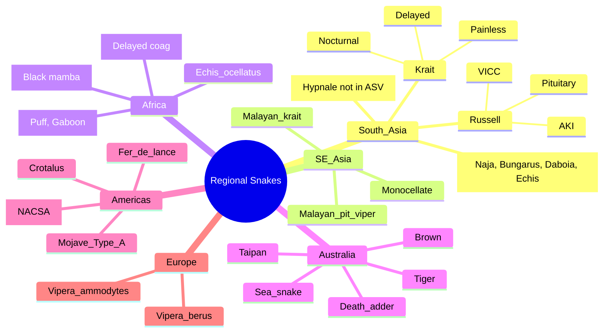

**Related:** [[Snake Envenomation: Global Epidemiology and Snake Identification]], [[Snake Envenomation: Clinical Syndromes (Elapid vs Viperid)]], [[Snake Envenomation: Specific Antivenom Protocols]], [[Envenomation MOC]]

> [!important]
> **Regional snake knowledge = critical for antivenom selection. South Asia: Big 4 (Naja, Bungarus, Daboia, Echis). SE Asia: monocled cobra, Malayan krait, green pit viper, king cobra. Africa: Echis, Bitis, Dendroaspis, Naja (spitting), Dispholidus. Australia: Oxyuranus, Pseudonaja, Notechis, Acanthophis. Americas: Crotalus, Micrurus, Agkistrodon, Bothrops. Match species to available antivenom per region.**

---

## 1. Learning Objectives
- [ ] Identify key venomous snakes by geographic region
- [ ] Know clinical syndromes for major regional species
- [ ] Match regional snakes to available antivenoms
- [ ] Apply to travel medicine and returned traveller vignettes
- [ ] Recognise region-specific presentations (krait in India, taipan in Australia, fer-de-lance in Latin America)

---

## 2. South Asia (India, Pakistan, Bangladesh, Sri Lanka, Nepal, Bhutan, Maldives)

### Indian "Big Four" (Covered by Indian ASV)

| Species | Family | Key Syndrome | Special Features |
|---|---|---|---|
| **Indian cobra (*Naja naja*)** | Elapidae | **Postsynaptic neurotoxicity + cytotoxic (local swelling, necrosis)** | Hood display; bite usually painful; ptosis early; neostigmine works |
| **Common krait (*Bungarus caeruleus*)** | Elapidae | **Presynaptic neurotoxicity, delayed 6–24 h, minimal local** | Nocturnal; **often inside houses**; painless bite; victim may not realise; neostigmine fails; high mortality |
| **Russell's viper (*Daboia russelii*)** | Viperidae (Viperinae) | **VICC + AKI + local necrosis + (some) neuro + pituitary haemorrhage** | Hissing warning; most deaths in Sri Lanka (very nephrotoxic); Myanmar (neuro); India (mixed) |
| **Saw-scaled viper (*Echis carinatus*)** | Viperidae (Viperinae) | **Severe VICC (defibrination), local swelling/bleeding** | "Sizzling" sound by rubbing scales; responsible for most snakebite deaths in some regions; small but lethal |

### Other Important South Asian Snakes

| Species | Family | Syndrome | AV Available? |
|---|---|---|---|
| **Hump-nosed pit viper (*Hypnale hypnale*)** | Viperidae (Crotalinae) | VICC + local necrosis; **NOT covered by Indian ASV — major gap** | No specific AV (Sri Lanka, India); supportive |
| **King cobra (*Ophiophagus hannah*)** | Elapidae | Massive neurotoxicity (pre + post) + local | Monovalent (Thai Red Cross, others) |
| **Indian (spectacled) cobra** | Elapidae | As above | Indian ASV |
| **Monocellate cobra (*Naja kaouthia*)** | Elapidae | As above (less cytotoxic) | Indian ASV, Thai RC |
| **Banded krait (*Bungarus fasciatus*)** | Elapidae | Presynaptic neuro; less common | Indian ASV (partial), Thai RC |
| **Many-banded krait (*B. multicinctus*)** | Elapidae | Presynaptic; very potent | Asian AV |
| **Green pit viper (*Trimeresurus* spp.)** | Viperidae (Crotalinae) | Local + mild coagulopathy | Asian AV (regional) |
| **Malayan pit viper (*Calloselasma rhodostoma*)** | Viperidae (Crotalinae) | VICC + local necrosis | Thai Red Cross AV |
| **Sea snakes (*Enhydrina*, *Hydrophis*)** | Elapidae (Hydrophiinae) | Myotoxic (CK > 50,000) + neuro | Sea snake AV (CSL); Indian ASV (partial) |

---

## 3. Southeast Asia (Thailand, Vietnam, Myanmar, Malaysia, Indonesia, Philippines, Singapore, Cambodia, Laos)

| Species | Family | Syndrome | AV |
|---|---|---|---|
| **Monocellate cobra (*Naja kaouthia*)** | Elapidae | Postsynaptic neuro + local | Thai RC Polyvalent |
| **King cobra (*Ophiophagus hannah*)** | Elapidae | Severe neuro (pre + post) | Monovalent |
| **Malayan krait (*Bungarus candidus*)** | Elapidae | Presynaptic neuro | Thai RC Polyvalent |
| **Banded krait (*B. fasciatus*)** | Elapidae | Presynaptic neuro | Thai RC Polyvalent |
| **Russell's viper (Asian)** | Viperidae (Viperinae) | VICC + AKI (especially Myanmar) | Thai RC, Indian ASV |
| **Malayan pit viper (*Calloselasma*)** | Viperidae (Crotalinae) | VICC + necrosis | Thai RC |
| **Green pit viper (*Trimeresurus*)** | Viperidae (Crotalinae) | Local + mild coagulopathy | Thai RC, regional |
| **Wagler's pit viper (*Tropidolaemus wagleri*)** | Viperidae (Crotalinae) | Local + mild coag | Regional |
| **Spitting cobras (*Naja siamensis*, *N. sumatrana*)** | Elapidae | Cytotoxic + ocular | Thai RC, regional |
| **Mangrove snake (*Boiga dendrophila*)** | Colubridae (rear-fanged) | Mild local, rarely systemic | No specific AV |
| **Asian coral snakes (*Calliophis*)** | Elapidae | Neurotoxic | Limited AV |

---

## 4. East Asia (China, Japan, Taiwan, Korea, Mongolia)

| Species | Family | Syndrome | AV |
|---|---|---|---|
| **Chinese cobra (*Naja atra*)** | Elapidae | Neuro + local | Chinese AV (Shanghai, Beijing) |
| **Chinese krait (*Bungarus multicinctus*)** | Elapidae | Presynaptic neuro (very potent) | Chinese AV |
| **Mamushi (*Gloydius blomhoffii*)** | Viperidae (Crotalinae) | Local + coagulopathy | Mamushi AV (Kitasato, Japan) |
| **Habu (*Protobothrops flavoviridis*)** | Viperidae (Crotalinae) | Local necrosis | Habu AV (Japan) |
| **Sharp-nosed pit viper (*Deinagkistrodon acutus*)** | Viperidae (Crotalinae) | Severe coag + local | Chinese AV |
| **Many-banded krait** | Elapidae | Presynaptic neuro | Chinese AV |
| **Korean pit viper (*Gloydius ussuriensis*)** | Viperidae (Crotalinae) | Local + coag | Korean AV (limited) |

---

## 5. Middle East / North Africa

| Species | Family | Syndrome | AV |
|---|---|---|---|
| **Saw-scaled viper (*Echis*)** | Viperidae (Viperinae) | VICC | Polyvalent African/Asian |
| **Horned viper (*Cerastes*)** | Viperidae (Viperinae) | Local + coag | Polyvalent (ViperFAV) |
| **Palestine viper (*Daboia palaestinae*)** | Viperidae (Viperinae) | VICC + local | Israeli AV |
| **Egyptian cobra (*Naja haje*)** | Elapidae | Neurotoxic | AV limited; SAIMR cross-neutralises |
| **Desert black snake (*Walterinnesia*)** | Elapidae | Neurotoxic | Limited |

---

## 6. Sub-Saharan Africa

| Species | Family | Syndrome | AV |
|---|---|---|---|
| **Carpet viper / West African saw-scaled (*Echis ocellatus*)** | Viperidae (Viperinae) | **Severe VICC (defibrination) — most deaths in W Africa** | Echis AV (newer), SAIMR (cross) |
| **Puff adder (*Bitis arietans*)** | Viperidae (Viperinae) | **Severe local necrosis + coag** (less than Echis) | SAIMR, Inoserp |
| **Gaboon viper (*Bitis gabonica*)** | Viperidae (Viperinae) | Massive yield; severe local + coag + shock | SAIMR, Inoserp |
| **Rhinoceros viper (*B. nasicornis*)** | Viperidae (Viperinae) | Local + mild coag | SAIMR |
| **Black mamba (*Dendroaspis polylepis*)** | Elapidae | **Rapid presynaptic + postsynaptic neuro; cardiovascular collapse** | SAIMR (Dendroaspis component) |
| **Green mamba (*D. angusticeps*)** | Elapidae | Neuro | SAIMR |
| **Jameson's mamba (*D. jamesoni*)** | Elapidae | Neuro | SAIMR |
| **Egyptian cobra (*Naja haje*)** | Elapidae | Neuro | SAIMR |
| **Forest cobra (*N. melanoleuca*)** | Elapidae | Neuro | SAIMR |
| **Snouted cobra (*N. annulifera*)** | Elapidae | Neuro + cytotoxic | SAIMR |
| **Cape cobra (*N. nivea*)** | Elapidae | Potent postsynaptic neuro | SAIMR |
| **Spitting cobras (*N. nigricollis*, *N. pallida*, *N. katiensis*)** | Elapidae | Cytotoxic + neuro + ocular (spitting) | SAIMR |
| **Ring-necked spitting cobra (*Hemachatus haemachatus*)** | Elapidae | Cytotoxic + ocular | SAIMR |
| **Rinkhals (*Hemachatus*)** | Elapidae | Cytotoxic + neuro | SAIMR |
| **Boomslang (*Dispholidus typus*)** | Colubridae (rear-fanged) | **Delayed severe VICC (24–48 h)** | **SAVP Boomslang Monovalent** |
| **Twig snake (*Thelotornis*)** | Colubridae (rear-fanged) | Delayed VICC | Limited; SAVP |
| **Burrowing asp (*Atractaspis*)** | Atractaspididae | Local + cardiotoxic | Limited; SAIMR (partial) |

---

## 7. Australia

| Species | Family | Syndrome | AV |
|---|---|---|---|
| **Coastal taipan (*Oxyuranus scutellatus*)** | Elapidae | **Presynaptic neuro + procoagulant (rapid VICC) — most toxic Australian elapid** | Taipan AV (1 vial) / Polyvalent |
| **Inland taipan (*Oxyuranus microlepidotus*)** | Elapidae | World's most toxic snake; presynaptic neuro + coag | Taipan AV / Polyvalent |
| **Eastern brown snake (*Pseudonaja textilis*)** | Elapidae | **Rapid VICC + mild neuro; cardiac arrest common** | Brown Snake AV (2 vials) / Polyvalent |
| **Western brown / Gwardar (*P. nuchalis*)** | Elapidae | VICC + neuro | Brown Snake AV / Polyvalent |
| **Tiger snake (*Notechis scutatus*)** | Elapidae | Presynaptic + procoagulant + **myotoxic** | Tiger Snake AV (1 vial) / Polyvalent |
| **Black tiger snake (*N. ater*)** | Elapidae | As above | Tiger Snake AV |
| **Common death adder (*Acanthophis antarcticus*)** | Elapidae | Postsynaptic neuro (curare-like) | Death Adder AV (1 vial) / Polyvalent |
| **Mulga / King brown (*Pseudechis australis*)** | Elapidae | Myotoxic + mild neuro + coag | Black Snake AV (1 vial) / Polyvalent |
| **Red-bellied black snake (*P. porphyriacus*)** | Elapidae | Myotoxic + coag | Black Snake AV |
| **Rough-scaled snake (*Tropidechis carinatus*)** | Elapidae | Presynaptic + coag + myotoxic | Tiger Snake AV (cross) / Polyvalent |
| **Hoplocephalus spp. (Broad-headed, Pale-headed, Stephen's banded)** | Elapidae | Neuro + coag | Tiger Snake AV (cross) |
| **Sea snakes (multiple spp.)** | Elapidae (Hydrophiinae) | **Severe myotoxic + neuro** | Sea Snake AV (1 vial) |

**Note: No native Australian vipers!** All Australian venomous snakes are elapids.

---

## 8. North America (USA, Canada, Mexico)

| Species | Family | Syndrome | AV |
|---|---|---|---|
| **Eastern diamondback (*Crotalus adamanteus*)** | Viperidae (Crotalinae) | Severe local + coag | CroFab / Anavip |
| **Western diamondback (*C. atrox*)** | Viperidae (Crotalinae) | Local + coag | CroFab / Anavip |
| **Timber rattlesnake (*C. horridus*)** | Viperidae (Crotalinae) | Local + coag | CroFab / Anavip |
| **Mojave rattlesnake (*C. scutulatus*)** | Viperidae (Crotalinae) | **Type A: neuro (Mojave toxin) + coag; Type B: coag only** | CroFab / Anavip |
| **Sidewinder (*C. cerastes*)** | Viperidae (Crotalinae) | Local + mild systemic | CroFab / Anavip |
| **Western rattlesnake (*C. oreganus*)** | Viperidae (Crotalinae) | Local + coag + neuro (some) | CroFab / Anavip |
| **Massasauga (*Sistrurus catenatus*)** | Viperidae (Crotalinae) | Local + coag | CroFab / Anavip |
| **Pygmy rattlesnake (*S. miliarius*)** | Viperidae (Crotalinae) | Local + mild coag | CroFab / Anavip |
| **Eastern copperhead (*Agkistrodon contortrix*)** | Viperidae (Crotalinae) | Local (less coag) | CroFab / Anavip |
| **Cottonmouth / Water moccasin (*A. piscivorus*)** | Viperidae (Crotalinae) | Local + coag | CroFab / Anavip |
| **Eastern coral (*Micrurus fulvius*)** | Elapidae | **Postsynaptic neuro, minimal local, delayed** | **NACSA** (Wyeth, then Coralmyn) |
| **Texas coral (*M. tener*)** | Elapidae | Neuro (similar) | NACSA (limited) |
| **Sonoran coral (*Micruroides euryxanthus*)** | Elapidae | Mild neuro | No specific AV (not severe) |

---

## 9. Central & South America

| Species | Family | Syndrome | AV |
|---|---|---|---|
| **Fer-de-lance (*Bothrops asper*)** | Viperidae (Crotalinae) | **Severe local necrosis + VICC + haemorrhage** (most medically important in Latin America) | Antivipmyn, INS, Butantan, BIOCLON |
| **Common lancehead (*B. atrox*)** | Viperidae (Crotalinae) | Local + coag + AKI (Amazon) | Antivipmyn, BIOCLON |
| **Jararaca (*B. jararaca*)** | Viperidae (Crotalinae) | Local + coag | Butantan, BIOCLON |
| **Bushmaster (*Lachesis muta*)** | Viperidae (Crotalinae) | Massive yield; local + coag | BIOCLON (Antilaquético) |
| **Tropical rattlesnake (*Crotalus durissus*)** | Viperidae (Crotalinae) | **Neuro (crotoxin) + myotoxic + coag** | Anticrotálico (Butantan) |
| **South American rattlesnake (*C. d. terrificus*)** | Viperidae (Crotalinae) | Severe neuro + myotoxic | Anticrotálico |
| **Cascabel (*C. d. durissus*)** | Viperidae (Crotalinae) | Neuro + myotoxic | Anticrotálico |
| **Eyelash viper (*Bothriechis schlegelii*)** | Viperidae (Crotalinae) | Local + mild coag | BIOCLON |
| **Coral snakes (*Micrurus* spp.)** | Elapidae | Postsynaptic neuro, minimal local | Coralmyn, Antielapídico |

---

## 10. Europe

| Species | Family | Syndrome | AV |
|---|---|---|---|
| **Common European adder (*Vipera berus*)** | Viperidae (Viperinae) | Local + mild coag; rarely fatal | ViperaTAb, ViperFAV |
| **Nose-horned viper (*V. ammodytes*)** | Viperidae (Viperinae) | Local + neuro; medically important | ViperFAV |
| **Asp viper (*V. aspis*)** | Viperidae (Viperinae) | Local + coag | ViperFAV |
| **Lataste's viper (*V. latastei*)** | Viperidae (Viperinae) | Local + coag | Limited |
| **Meadow viper (*V. ursinii*)** | Viperidae (Viperinae) | Mild | Limited |

---

## 11. Marine (Sea Snakes)

| Region | Species | Syndrome | AV |
|---|---|---|---|
| **Indian Ocean / SE Asia** | Beaked sea snake (*Enhydrina schistosa*) — most dangerous | Myotoxic + neuro | Sea snake AV (CSL); Indian ASV (partial) |
| **Indo-Pacific** | Various *Hydrophis*, *Lapemis* | Myotoxic + neuro | Sea snake AV |
| **Australia** | Various sea snakes | Myotoxic + neuro | Sea snake AV (CSL) |

---

## 12. FCPS/MRCP High-Yield Summary

| Region | Key Snakes | AV |
|---|---|---|
| **India** | Big 4: Naja, Bungarus, Daboia, Echis | Indian ASV (10 vials) |
| **India (gap)** | Hump-nosed (*Hypnale*) | No specific AV |
| **SE Asia** | Monocellate cobra, Malayan krait, Malayan pit viper | Thai RC Polyvalent |
| **East Asia** | Mamushi, Chinese cobra, Chinese krait | Regional AV |
| **Africa** | Echis, Bitis, Dendroaspis, Naja | SAIMR |
| **Africa (specific)** | Boomslang | SAVP Monovalent |
| **Australia** | Taipan, Brown, Tiger, Death Adder, Black, Sea | Monovalent / Polyvalent (CSL) |
| **US** | Crotalus, Agkistrodon | CroFab / Anavip |
| **US (coral)** | Micrurus | NACSA |
| **Mexico** | Bothrops, Crotalus, Micrurus | Antivipmyn, Coralmyn |
| **Brazil** | Bothrops, Crotalus, Lachesis, Micrurus | Butantan, BIOCLON |
| **Europe** | Vipera berus, V. ammodytes | ViperaTAb, ViperFAV |
| **Marine** | Sea snakes | Sea snake AV (CSL); Indian ASV (partial) |

---

## 13. Viva Questions (10)

**Q1: What is the Indian "Big Four" and the key feature of each?**
A: (1) Indian cobra (*Naja naja*) — postsynaptic neuro + cytotoxic (local swelling, necrosis); (2) Common krait (*Bungarus caeruleus*) — presynaptic neuro, nocturnal, painless, minimal local, delayed 6–24 h; (3) Russell's viper (*Daboia russelii*) — VICC + AKI + pituitary haemorrhage; (4) Saw-scaled viper (*Echis carinatus*) — severe VICC (defibrination).

**Q2: Why is the common krait particularly dangerous?**
A: Nocturnal, often bites inside houses during sleep; painless (small fang marks, minimal local signs); victim often does not realise they were bitten; **delayed 6–24 h** before neurotoxicity; presynaptic (irreversible) → neostigmine fails. High mortality in sleeping victims. AV is the only effective treatment.

**Q3: What are the characteristic features of Russell's viper envenomation?**
A: VICC (procoagulant → INR↑, fibrinogen↓); acute kidney injury (especially in Sri Lanka and Myanmar populations); local necrosis; **pituitary haemorrhage (Sheehan-like syndrome)**; some populations also have neurotoxicity (Sri Lanka, Myanmar). Treatment: Indian ASV + supportive (dialysis if AKI, hydrocortisone if panhypopituitary).

**Q4: What is special about the saw-scaled viper?**
A: Small but lethal. Venom has potent procoagulant (RVV-X activator) → severe consumption coagulopathy / defibrination. "Sizzling" warning sound by rubbing scales. Responsible for **most snakebite deaths in some African (Echis ocellatus in W Africa) and South Asian regions**. Indian ASV covers it.

**Q5: What is the difference between carpet viper (Africa) and saw-scaled viper (Asia)?**
A: Both *Echis* genus (E. ocellatus in W Africa, E. carinatus in Asia). Both cause severe VICC (defibrination). Regional difference: E. ocellatus is responsible for the most snakebite deaths in West African savannah (Nigeria, Ghana, Burkina Faso). **Echis AV (EchiTAb) developed by LSTM** is specific for African Echis; Indian ASV covers Asian Echis.

**Q6: What is unique about the Australian brown snake (Pseudonaja)?**
A: Rapid **VICC + mild neurotoxicity**; cardiac arrest is common (procoagulant + myocardial depressant); often minimal local signs; coagulopathy can be detected early by 20WBCT. Antivenom: Brown Snake Monovalent 2 vials (or polyvalent if unknown).

**Q7: Why is the Mojave rattlesnake particularly dangerous?**
A: Type A venom contains **Mojave toxin** (β-neurotoxin / presynaptic) + haemorrhagic components. Causes descending paralysis + coagulopathy. Type B (in some regions) is haemorrhagic only. Misdiagnosis as a "regular" rattlesnake leads to inadequate AV. **CroFab / Anavip** covers both types.

**Q8: What is the difference between the Eastern coral snake and a pit viper?**
A: Coral = **elapid** (fixed front fangs, neurotoxic, postsynaptic, minimal local, delayed 12–24 h). Pit viper = **crotalid** (hinged fangs, cytotoxic + coagulopathic, immediate local signs, fang marks + swelling). **Different AV** (NACSA for coral; CroFab for pit vipers). Coral snake AV administered for any confirmed bite; observe 24 h if asymptomatic.

**Q9: What is the Boomslang and how is it managed?**
A: Rear-fanged colubrid (Africa). **Delayed severe consumptive coagulopathy 24–48 h post-bite** (prothrombin + factor consumption). Often initially asymptomatic, then catastrophic bleeding. **Monovalent Boomslang AV (SAVP)** is the only specific treatment. Use only for confirmed cases (no cross-reactivity with standard AVs).

**Q10: What is the most dangerous sea snake?**
A: Beaked sea snake (*Enhydrina schistosa*) — responsible for most sea snake bites and deaths in Indo-Pacific. Venom = presynaptic neurotoxin + PLA₂ myotoxin. Bite may be painless. Onset 30 min – 6 h. Myotoxicity severe (CK often > 50,000), AKI from myoglobinuria. **Sea Snake AV (CSL)** or polyvalent; aggressive fluid + alkalinisation.

---

## 14. Confusions & Mnemonics

| Confusion | Clarification |
|---|---|
| All Indian snakes covered by ASV | NO — *Hypnale* (hump-nosed) NOT covered |
| Krait bite = immediate pain | NO — painless, delayed |
| Russell's viper = same worldwide | NO — Sri Lanka = nephrotoxic; Myanmar = neurotoxic; India = mixed |
| Black mamba = black colour | NO — name refers to inside of mouth |
| Coral snake = pit viper | NO — coral is elapid |
| Australia has vipers | NO — only elapids |
| CroFab covers coral | NO — NACSA only |
| Boomslang covered by SAIMR | NO — separate monospecific |
| All rattlesnakes = Type A Mojave | NO — only C. scutulatus Type A (variable) |
| Sea snake = water snake | NO — sea snake is elapid (Hydrophiinae) |
| Vipera berus = deadly | NO — usually mild, rarely fatal |

**Mnemonics:**
- **Indian Big Four**: **N**aja, **B**ungarus, **D**aboia, **E**chis = **NBDE**
- **Russell's viper features**: **V**ICC, **A**KI, **P**ituitary = **VAP**
- **Krait features**: **P**ainless, **N**octurnal, **D**elayed, **M**inimal local, **I**rreversible presynaptic = **PNDMI**
- **Mojave Type A**: **N**euro (Mojave toxin) + **C**oag = **NC**
- **Boomslang**: **D**elayed **C**oagulopathy 24–48 h = **DC**
- **Echis (Asia + Africa)**: **D**efibrination = **D**
- **Coral snake (US)**: **N**eurotoxic, **M**inimal local, **D**elayed 12–24 h, **P**ostsynaptic = **NMDP**
- **Sea snake**: **M**yotoxic + **N**eurotoxic = **MN**
- **Australian brown**: **R**apid **V**ICC + **C**ardiac arrest = **RVC**
- **Fer-de-lance**: **N**ecrosis + **C**oag + **A**KI = **NCA**

---

## 15. Mind Map

---

## 16. One-Page Revision Card

| Region | Top 3 Snakes | Syndrome |
|---|---|---|
| **India** | Naja, Bungarus, Daboia, Echis | Neuro, delayed neuro, VICC + AKI, defibrination |
| **SE Asia** | Monocellate, Malayan krait, MPV | Neuro, neuro, VICC |
| **Africa** | Echis, Bitis, Dendroaspis | VICC, necrosis, rapid neuro |
| **Australia** | Taipan, Brown, Tiger | Neuro + coag, VICC + arrest, multi |
| **US** | Crotalus, Agkistrodon, Micrurus | Local + coag, local, delayed neuro |
| **Latin America** | Bothrops, Crotalus, Lachesis | Necrosis + coag, neuro, massive |
| **Marine** | Sea snakes | Myotoxic + neuro |

---

## 17. Spaced Repetition Trackers

| Interval | Date | Score (1–5) | Notes |
|---|---|---|---|
| **24 h** | | | Big Four, Australian, US coral, fer-de-lance |
| **3 d** | | | Russell features, krait, Mojave, boomslang, sea snake |
| **7 d** | | | Africa, SE Asia, regional AVs |
| **14 d** | | | Viva, mnemonics, MCQ/SBA |
| **30 d** | | | Integrate with Clinical, Lab, AV topics |
| **90 d** | | | Comprehensive exam recall |

---

## 18. Self-Test Scorecard

| Section | Score /5 |
|---|---|
| Indian Big 4 | |
| Russell's viper features | |
| Krait presentation | |
| Australian key species | |
| Mojave Type A | |
| Coral snake (US) | |
| Boomslang | |
| Sea snake | |
| African key species | |
| AV coverage by region | |

---

## 19. Exam Answer Modes (5)

| Mode | Prompt | Key Points |
|---|---|---|
| **Long Essay** | "Regional snakes and antivenoms" | Asia, Africa, Australia, Americas — species, syndromes, AVs |
| **Short Note** | "Common krait" | Presynaptic, nocturnal, painless, minimal local, delayed, high mortality |
| **Viva** | "Why is hump-nosed pit viper a problem in India?" | NOT covered by Indian ASV — major AV gap; many Sri Lanka/India cases |
| **Ward Round** | "Farmer in India with coagulopathy" | VICC; Indian ASV 10 vials; repeat 6 h; Russell's / Echis / saw-scaled |
| **Last-Night** | "Key regional snakes" | Naja, Bungarus, Daboia, Echis, Bitis, Dendroaspis, Pseudonaja, Crotalus, Micrurus, Bothrops |

---

## 20. MCQs (10)

1. **Indian Big Four — all covered by Indian ASV except:**
   A. Naja naja
   B. Bungarus caeruleus
   C. Daboia russelii
   D. **Hump-nosed pit viper (Hypnale)** — not covered
   E. Echis carinatus

2. **Common krait bite — classic presentation:**
   A. Painful with swelling
   B. **Painless, minimal local, delayed neuro (nocturnal)**
   C. Immediate severe pain
   D. Immediate coagulopathy
   E. Cardiotoxicity

3. **Russell's viper characteristic features:**
   A. Pure neurotoxicity
   B. **VICC + AKI + local necrosis + pituitary haemorrhage**
   C. Pure haemolytic
   D. Only local swelling
   E. Pure cardiotoxic

4. **Saw-scaled viper hallmark:**
   A. Neurotoxicity
   B. **Severe VICC (defibrination)**
   C. Neuro paralysis
   D. Massive necrosis
   E. Cardiotoxic

5. **Carpet viper (Echis ocellatus) in W Africa — main syndrome:**
   A. Anticoagulant
   B. **Consumption coagulopathy (defibrination)**
   C. Platelet inhibition
   D. Fibrinolysis
   E. No coag

6. **Black mamba (Dendroaspis polylepis) — characteristic:**
   A. Pure cytotoxic
   B. **Rapid severe neuro (dendrotoxins), cardiovascular collapse**
   C. Pure haemotoxic
   D. Pure nephrotoxic
   E. Mild

7. **Boomslang envenomation features:**
   A. Neuro
   B. **Severe delayed consumptive coagulopathy**
   C. Myotoxic
   D. Pure nephrotoxic
   E. Cardiotoxic

8. **Australian brown snake (Pseudonaja) — characteristic:**
   A. Pure neurotoxic
   B. **Rapid VICC + cardiac arrest (mild neuro)**
   C. Pure cytotoxic
   D. Only local
   E. Myotoxic

9. **Tiger snake (Notechis) envenomation:**
   A. Pure neurotoxic
   B. **Neuro + procoagulant + myotoxic**
   C. Pure cytotoxic
   D. Pure haemolytic
   E. Only local

10. **Fer-de-lance (Bothrops asper):**
    A. Pure neurotoxic
    B. **Severe local necrosis + VICC + haemorrhage**
    C. Pure neurotoxic
    D. Pure nephrotoxic
    E. Mild

---

## 21. SBA Questions (5)

1. **Farmer in rural India, painless nocturnal bite, no fang marks, 18 h later: ptosis, descending paralysis. Snake:**
   A. Russell's viper
   B. **Common krait (Bungarus caeruleus) — painless, nocturnal, minimal local, delayed**
   C. Saw-scaled viper
   D. Indian cobra
   E. Indian python

2. **Africa, severe delayed coagulopathy 24 h after green snake bite. Snake:**
   A. Black mamba
   B. Puff adder
   C. **Boomslang (rear-fanged, delayed VICC)**
   D. Gaboon viper
   E. Green mamba

3. **Australian, brown snake confirmed by VDK, VICC. AV choice:**
   A. Polyvalent 2 vials
   B. **Brown snake monovalent 2 vials**
   C. Polyvalent 1 vial
   D. Monovalent 1 vial
   E. No AV

4. **US, coral snake bite, progressive ptosis, dysphagia. AV:**
   A. CroFab
   B. **NACSA (North American Coral Snake Antivenom)**
   C. Anavip
   D. Both CroFab + Anavip
   E. No AV

5. **Fisherman, myalgia, dark urine, CK 50,000, AKI. Snake:**
   A. Cobra
   B. Krait
   C. **Sea snake (myotoxic + neurotoxic)**
   D. Viper
   E. Coral

---

## 22. Local Navigation

- [[Snake Envenomation: Global Epidemiology and Snake Identification]]
- [[Snake Envenomation: Clinical Syndromes (Elapid vs Viperid)]]
- [[Snake Envenomation: Laboratory Investigation and Monitoring]]
- [[Snake Envenomation: Specific Antivenom Protocols]]
- [[Antivenom: Principles, Types, and Administration]]
- [[General Principles of Envenomation]]
- [[Envenomation MOC]]