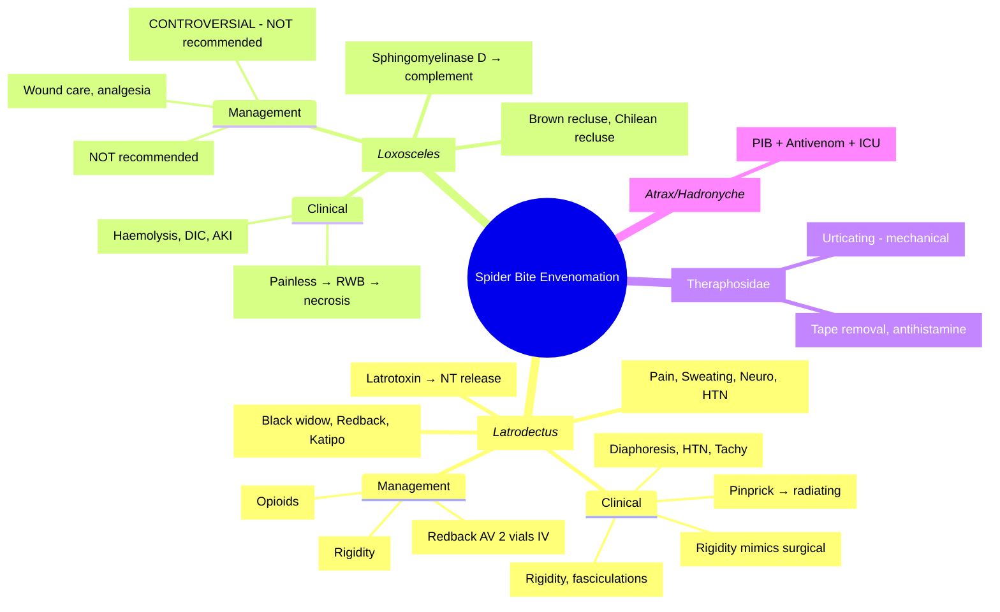

**Related:** [[General Principles of Envenomation]], [[Scorpion Sting Envenomation]], [[Marine Envenomation (Jellyfish, Stonefish, Cone Shell, Blue-Ringed Octopus)]], [[Hymenoptera Stings (Bee, Wasp, Ant) and Anaphylaxis]], [[Envenomation MOC]]

> [!important]
> **Spider bites: Latrodectism (widow spiders, *Latrodectus*) = latrotoxin → massive neurotransmitter release → pain, hypertension, rigidity, diaphoresis. Loxoscelism (recluse spiders, *Loxosceles*) = sphingomyelinase D → dermonecrosis, haemolysis, renal failure. Tarantulas = urticating hairs = irritation. Management: latrodectism = analgesia, IV calcium gluconate, antivenom (severe); loxoscelism = supportive, early excision debated, dapsone controversial.**

---

## 1. Learning Objectives
- Differentiate latrodectism vs loxoscelism clinical syndromes
- Recognise redback spider (*Latrodectus hasselti*) and brown recluse (*Loxosceles reclusa*) envenomation
- Apply management protocols (analgesia, antivenom, wound care)
- Know controversial/historical treatments to avoid
- Apply to FCPS/MRCP vignettes

---

## 2. Definitions & Key Concepts

| Term | Definition |
|------|------------|
| **Latrodectism** | Envenomation by widow spiders (*Latrodectus* spp.) — latrotoxin → massive neurotransmitter release |
| **Loxoscelism** | Envenomation by recluse spiders (*Loxosceles* spp.) — sphingomyelinase D → dermonecrosis, haemolysis |
| **Latrotoxin** | Presynaptic neurotoxin → massive vesicle fusion → release of ACh, noradrenaline, dopamine |
| **Sphingomyelinase D** | Enzyme → complement activation → inflammation, haemolysis, dermonecrosis |
| **RADS score** | Redback Spider (Latrodectus hasselti) severity scoring system (0–6) |
| **Urticating hairs** | Barbed setae on tarantula abdomen → mechanical irritation (skin, eyes, respiratory) |

---

## 3. Core Content

### Section 1: Latrodectism (*Latrodectus* — Widow Spiders)

#### Key Points

| Aspect | Detail |
|--------|--------|
| **Important species** | Black widow (*L. mactans* — Americas), Redback (*L. hasselti* — Australia), Katipo (*L. katipo* — NZ), Brown widow (*L. geometricus* — cosmopolitan) |
| **Venom** | α-latrotoxin (presynaptic) → massive vesicle fusion → release of ACh, noradrenaline, dopamine |
| **Mechanism** | Binds presynaptic receptor (latrophilin/CIRL) → Ca²⁺-independent exocytosis → neurotransmitter storm |
| **Onset** | Immediate local pain (pinprick) → systemic features over 1–3 hours |
| **Local signs** | Target lesion (erythema + central pallor), minimal swelling, local sweating |
| **Mortality** | Rare with modern care; historically 5% before antivenom |

#### Clinical Features — Latrodectism

| System | Features |
|--------|----------|
| **Pain** | Immediate pinprick → severe regional/proximal pain (radiating to limb/trunk), abdominal rigidity (mimics acute abdomen) |
| **Autonomic** | Diaphoresis (local + systemic), hypertension, tachycardia, salivation, lacrimation, piloerection |
| **Neuromuscular** | Muscle rigidity, trismus, fasciculations, weakness, hyperreflexia → hyporeflexia |
| **Other** | Nausea, vomiting, headache, anxiety, restlessness, priapism |
| **RADS score (Redback)** | Pain severity (1), local sweating (1), peripheral neurotoxicity (2), systemic sweating (1), hypertension (1) — total 6 |

### Section 2: Loxoscelism (*Loxosceles* — Recluse Spiders)

#### Key Points

| Aspect | Detail |
|--------|--------|
| **Important species** | Brown recluse (*L. reclusa* — USA), Chilean recluse (*L. laeta* — South America, most severe), Mediterranean recluse (*L. rufescens* — worldwide) |
| **Venom** | Sphingomyelinase D (phospholipase D) → hydrolysis of sphingomyelin → ceramide + phosphate |
| **Mechanism** | Complement activation (C3 convertase-like) → inflammation, neutrophil recruitment, haemolysis, dermonecrosis |
| **Onset** | Painless bite → delayed 2–8 hours: pain, erythema → "red-white-blue" lesion → central necrosis/eschar over days |
| **Mortality** | Low (cutaneous); higher with systemic loxoscelism (*L. laeta*, children) |

#### Clinical Features — Loxoscelism

| Stage | Features |
|-------|----------|
| **1. Local (2–8 h)** | Painless bite → delayed burning pain, erythema, oedema |
| **2. Lesion evolution (12–48 h)** | "Red-white-blue" lesion: central pallor/ischaemia (white) → surrounding haemorrhage (blue) → peripheral erythema (red) → central necrosis/eschar |
| **3. Ulceration (3–14 d)** | Necrotic eschar sloughs → deep ulcer (weeks to months to heal) |
| **Systemic loxoscelism** | Haemolytic anaemia, DIC, renal failure (esp. children, *L. laeta*), fever, chills, nausea |

### Section 3: Tarantulas & Other Spiders

| Spider | Venom/Mechanism | Clinical Features | Management |
|--------|----------------|-------------------|------------|
| **Tarantulas (Theraphosidae)** | Urticating hairs (mechanical); mild venom | Local pain, pruritus, urticaria; ocular (conjunctivitis, keratitis); respiratory (cough, wheeze) | Remove hairs (tape), antihistamines, ophthalmology if ocular |
| **Funnel-web (*Atrax/Hadronyche* — Australia)** | δ-atracotoxin (Na⁺ channel) — **life-threatening** | Similar to latrodectism + severe autonomic storm, pulmonary oedema | **Funnel-web antivenom**, PIB, ICU |
| **Hobo spider (*Eratigena agrestis*)** | Debated — possible dermonecrosis | Similar to mild loxoscelism | Supportive (controversial) |
| **Sac spiders (*Cheiracanthium*)** | Cytotoxic | Local pain, mild necrosis | Supportive |

---

## 4. Diagnostic Approach

### Bedside / Point-of-Care

| Test | Indication | Interpretation |
|------|------------|----------------|
| **Spider identification** | If captured/sighted | *Latrodectus*: shiny black, red hourglass (ventral); *Loxosceles*: violin mark on cephalothorax, 6 eyes (3 pairs) |
| **RADS score** | Redback envenomation | ≥2 = consider AV; ≥4 = AV indicated |
| **CBC, coagulation** | Suspected systemic loxoscelism | Haemolysis (↓Hb, ↑LDH, ↑bilirubin, schistocytes), thrombocytopenia, DIC |
| **Urinalysis** | Systemic loxoscelism | Haemoglobinuria (no RBCs), myoglobinuria |

### Laboratory Investigations

| Test | Indication | Expected Findings |
|------|------------|-------------------|
| **FBC** | All systemic | Hb↓ (haemolysis), WCC↑, platelets↓ (DIC) |
| **Coagulation (PT, aPTT, fibrinogen, D-dimer)** | Systemic loxoscelism | DIC pattern: ↑PT/aPTT, ↓fibrinogen, ↑D-dimer |
| **Renal (U&E, creatinine)** | Systemic loxoscelism | AKI from haemoglobinuria |
| **LFTs** | Systemic loxoscelism | ↑LDH, ↑indirect bilirubin |
| **Haptoglobin** | Haemolysis | ↓↓ (intravascular haemolysis) |
| **Electrolytes** | Severe envenomation | Hyperkalaemia (haemolysis) |

---

## 5. Management

### Immediate / Pre-hospital

1. **Reassurance, immobilise limb** — minimise venom spread
2. **Cold compress** — for pain (unlike snakes: ice acceptable for spider)
3. **Capture spider** (safely) for identification
4. **Tetanus prophylaxis** — Td/Tdap
5. **Transport to hospital** — especially for suspected funnel-web, severe latrodectism, systemic loxoscelism

### Hospital / Definitive Management — Latrodectism

| Intervention | Indication | Dose/Details |
|--------------|------------|--------------|
| **Analgesia** | All cases | Oral/IV opioids (morphine, oxycodone), paracetamol, NSAIDs |
| **IV Calcium gluconate** | Muscle rigidity, spasms | 10 mL 10% IV over 10 min; repeat PRN (relieves rigidity) |
| **Benzodiazepines** | Agitation, muscle spasms | Diazepam 5–10 mg IV; lorazepam 1–2 mg IV |
| **Antivenom (Redback)** | RADS ≥2, pregnant, failed analgesia, severe systemic | **Redback spider antivenom (Seqirus/CSL) — 2 vials IV** over 30 min; repeat if needed |
| **Antivenom (Black widow)** | Severe pain, systemic signs, failed analgesia | **Antivenin *Latrodectus mactans* (Merck) — 1 vial IV/IM** (US) |

### Hospital / Definitive Management — Loxoscelism

| Intervention | Indication | Dose/Details |
|--------------|------------|--------------|
| **Wound care** | All cutaneous | Gentle cleansing, sterile dressing, elevation, avoid debridement initially |
| **Analgesia** | Pain | Opioids + paracetamol + NSAIDs |
| **Antibiotics** | Secondary infection (cellulitis) | Cover *S. aureus*, *Streptococcus*; not routine prophylaxis |
| **Dapsone** | **CONTROVERSIAL** — historical use for dermonecrosis | 50–100 mg/day PO (G6PD screen first!); **NOT evidence-based, risk of haemolysis** |
| **Early surgical excision** | **CONTROVERSIAL** | **NOT recommended** — may worsen necrosis, delay healing |
| **Hyperbaric oxygen** | Historical | **NOT recommended** — no proven benefit |
| **Systemic corticosteroids** | Systemic loxoscelism (haemolysis, DIC) | Prednisolone 1 mg/kg/day; supportive care |

### Antivenom / Specific Therapy

| Antivenom | Type | Indications | Dose | Adverse Effects | Contraindications |
|-----------|------|-------------|------|-----------------|-------------------|
| **Redback AV (CSL/Seqirus)** | Whole IgG, equine | RADS ≥2, pregnant, severe pain unresponsive, systemic signs | 2 vials IV over 30 min; repeat PRN | Anaphylaxis, serum sickness | Known equine allergy (relative) |
| **Black widow AV (Merck — US)** | Whole IgG, equine | Severe systemic envenomation | 1 vial IV/IM; repeat PRN | Anaphylaxis, serum sickness | Known equine allergy (relative) |
| **Funnel-web AV (CSL)** | F(ab')₂, rabbit | Funnel-web (*Atrax/Hadronyche*) envenomation | 1–2 vials IV; repeat for severe | Low (rabbit-derived) | — |

---

## 6. Complications

| Complication | Prevention | Management |
|--------------|------------|------------|
| **Latrodectism: severe hypertension** | Early analgesia, antivenom | Hydralazine, labetalol, nitroprusside; antivenom |
| **Latrodectism: respiratory failure** | Antivenom, monitoring | Intubation, ventilation |
| **Loxoscelism: systemic haemolysis** | Early recognition (CBC, LDH, haptoglobin) | IV fluids, transfusion, renal support, steroids |
| **Loxoscelism: DIC** | Early AV? (unproven) | FFP, cryoprecipitate, platelets; treat underlying |
| **Loxoscelism: necrotic ulcer** | Avoid early excision | Conservative wound care, delayed grafting if needed |
| **Loxoscelism: renal failure** | Hydration, alkalinisation, avoid nephrotoxins | Dialysis if severe |
| **Funnel-web: rapid death** | PIB, antivenom | Emergency intubation, AV, ICU |
| **Tarantula: ocular injury** | Tape removal of hairs | Irrigation, ophthalmology referral |
| **Anaphylaxis (any)** | — | IM adrenaline 0.5mg (1:1000), fluids, steroids, antihistamines |

---

## 7. Disposition Criteria

| Admit | Observe | Discharge |
|-------|---------|-----------|
| **Severe latrodectism** — RADS ≥4, systemic signs, antivenom given | **Mild latrodectism** — RADS 0–1, pain controlled, no systemic signs (6–12h) | **Minor bite** — identified non-venomous, no envenomation signs |
| **Systemic loxoscelism** — haemolysis, DIC, renal involvement, children | **Cutaneous loxoscelism** — local lesion only, reliable follow-up (24h) | **Tarantula only** — local irritation, hairs removed, no ocular involvement |
| **Funnel-web envenomation** — always ICU | **Ocular tarantula** — after ophthalmology clearance | — |
| **Pregnant + latrodectism** — antivenom indicated | — | — |

---

## 8. High-Yield FCPS/MRCP Points

> [!important]
> - **Latrodectism** = neurotransmitter storm (latrotoxin): pain, diaphoresis, hypertension, rigidity, abdominal rigidity (mimics surgical abdomen)
> - **Loxoscelism** = dermonecrosis + haemolysis (sphingomyelinase D): painless bite → "red-white-blue" → eschar; systemic = haemolytic anaemia, DIC, renal failure (esp. children, *L. laeta*)
> - **Redback spider (Australia)** = RADS score guides antivenom: ≥2 consider, ≥4 = give
> - **Antivenom for latrodectism**: Redback AV (Australia) 2 vials IV; Black widow AV (US) 1 vial IV/IM
> - **IV Calcium gluconate** — specific for latrodectism muscle rigidity (works within minutes)
> - **Dapsone for loxoscelism** = **CONTROVERSIAL, NOT RECOMMENDED** — risk of haemolysis (G6PD), no RCT evidence
> - **Early excision for loxoscelism** = **NOT RECOMMENDED** — worsens outcome
> - **Funnel-web** = Australian medical emergency: PIB + funnel-web antivenom + ICU
> - **Tarantula** = urticating hairs (mechanical), not venomous to humans

---

## 9. Common Confusions / Exam Traps

| Trap | Correction |
|------|------------|
| **Redback = black widow** | Different species (*L. hasselti* vs *L. mactans*); similar syndrome, different antivenom |
| **All spider bites need antivenom** | NO — only severe latrodectism, funnel-web; loxoscelism = supportive |
| **Dapsone = standard for loxoscelism** | NO — controversial, NOT recommended; risk haemolysis in G6PD deficiency |
| **Excision = prevents necrosis in loxoscelism** | NO — early excision WORSENS necrosis and delays healing |
| **Loxoscelism = only local** | NO — systemic (haemolysis, DIC, renal failure) esp. *L. laeta*, children |
| **Black widow antivenom = IM always** | IV preferred (faster, more reliable); IM if no IV access |
| **RADS 0–1 = no follow-up** | Still observe 6–12h; can progress |
| **Funnel-web = just a big spider** | **MEDICAL EMERGENCY** — PIB, antivenom, ICU; δ-atracotoxin = severe neuro/autonomic |
| **All necrotic ulcers = loxoscelism** | Differential: infection, vasculitis, malignancy, typhoid, ecthyma gangrenosum |
| **Spider bite = immediate pain** | Loxoscelism = typically PAINLESS bite; latency 2–8h |

---

## 10. Mnemonics

- **Latrodectism features**: **P**ain, **D**iaphoresis, **H**ypertension, **R**igidity, **A**bdominal rigidity = **PDHRA**
- **Loxoscelism lesion**: **R**ed – **W**hite – **B**lue = **RWB** (ischaemia → haemorrhage → erythema)
- **Redback AV indication**: **RADS ≥ 2** = consider; **RADS ≥ 4** = give
- **Sphingomyelinase D** → **S**phingo = **S**evere dermonecrosis, **S**ystemic haemolysis = **SS**
- **Latrotoxin** → **L**atro = **L**arge neurotransmitter release = **ACh + NA + DA**
- **IV Calcium** for **L**atrodectism **R**igidity = **CALR** (Calcium for Latrodectism Rigidity)
- **Dapsone** = **D**angerous in **A**G6PD = **DANGER**
- **Funnel-web** = **F**atal without **A**ntivenom = **FATAL**

---

## 11. Mind Map



---

## 12. Flowchart: Spider Bite Management

```mermaid
flowchart TD
    A[Spider Bite] --> B{Identify Spider}
    B -->|Latrodectus (widow)| C[Latrodectism Protocol]
    B -->|Loxosceles (recluse)| D[Loxoscelism Protocol]
    B -->|Atrax/Hadronyche (funnel-web)| E[FUNNEL-WEB EMERGENCY]
    B -->|Tarantula| F[Urticating Hairs Protocol]
    B -->|Unknown/Other| G[Supportive, Observe]
    C --> H[Pain, Diaphoresis, HTN, Rigidity]
    H --> I{RADS Score}
    I -->|≥2| J[Consider Antivenom]
    I -->|≥4| K[GIVE Antivenom IV]
    I -->|0-1| L[Analgesia, Observe 12h]
    C --> M[IV Calcium Gluconate for Rigidity]
    D --> N[Painless Bite → RWB Lesion]
    N --> O{Systemic Features?}
    O -->|Yes (Haemolysis, DIC)| P[Admit ICU, Transfusion, Steroids]
    O -->|No| Q[Wound Care, Follow-up]
    E --> R[PIB + Funnel-web AV + ICU]
    F --> S[Remove Hairs (Tape), Antihistamine]
```

---

## 13. One-Page Revision Card

| Aspect | Key Point |
|--------|-----------|
| **Latrodectism** | Latrotoxin → NT storm → pain, diaphoresis, HTN, rigidity, abdominal rigidity |
| **Loxoscelism** | Sphingomyelinase D → RWB lesion → dermonecrosis; systemic = haemolysis, DIC, AKI |
| **Redback RADS ≥2** | Consider AV; **≥4 = give AV** (2 vials IV) |
| **Calcium gluconate** | 10 mL 10% IV — relieves latrodectism rigidity |
| **Dapsone** | **NOT recommended** — risk haemolysis (G6PD), no evidence |
| **Excision** | **NOT recommended** — worsens necrosis |
| **Funnel-web** | PIB + AV (2 vials IV) + ICU — δ-atracotoxin = rapid death |
| **Tarantula** | Urticating hairs — tape removal, antihistamine |
| **Black widow (US)** | Antivenin *L. mactans* 1 vial IV/IM |
| **Loxoscelism systemic** | Children > risk; *L. laeta* most severe |

---

## 14. Spaced Repetition Trackers

| Interval | Date | Score (1–5) | Notes |
|---|---|---|---|
| **24 h** | | | Latrodectism vs loxoscelism, RADS, calcium gluconate |
| **3 d** | | | Antivenom indications, dapsone controversy, excision myth |
| **7 d** | | | Funnel-web emergency, tarantula, differential diagnosis |
| **14 d** | | | Viva, mnemonics, MCQ/SBA |
| **30 d** | | | Integrate with general envenomation |
| **90 d** | | | Comprehensive exam recall |

---

## 15. Must Know / Should Know / Nice to Know

| Priority | Content |
|----------|---------|
| **Must Know 🔴** | Latrodectism vs loxoscelism differentiation, clinical features, antivenom indications, calcium gluconate for rigidity, dapsone controversy, funnel-web emergency |
| **Should Know 🟡** | RADS score calculation, geographic distribution, paediatric systemic loxoscelism, tarantula management, antivenom products per region |
| **Nice to Know 🟢** | Venom molecular mechanisms, novel antivenoms, dermonecrosis wound healing, long-term sequelae, funnel-web venom pharmacology |

---

## 16. Self-Test Scorecard

| Section | Score /5 |
|---|---|
| Latrodectism clinical features | |
| Loxoscelism clinical features | |
| RADS score & antivenom indications | |
| Calcium gluconate use | |
| Dapsone / excision controversies | |
| Antivenom products (Redback, Black widow, Funnel-web) | |
| Funnel-web emergency management | |
| Tarantula management | |
| Differential of necrotic ulcer | |
| Viva readiness | |

---

## 17. Exam Answer Modes (5)

| Mode | Prompt | Key Points |
|---|---|---|
| **Long Essay** | "Spider bite envenomation" | Latrodectism vs loxoscelism, mechanisms, clinical, management, controversies |
| **Short Note** | "Redback spider antivenom" | Indications (RADS ≥2), 2 vials IV, calcium gluconate adjunct, reactions |
| **Viva** | "Why is dapsone not recommended for loxoscelism?" | No RCT evidence, risk haemolysis (G6PD), conservative wound care preferred |
| **Ward Round** | "Patient with spider bite, severe abdominal rigidity, hypertension" | Latrodectism — RADS score, IV calcium gluconate, redback AV 2 vials IV, monitor |
| **Last-Night** | "Key spider facts" | Latrodectism = NA storm (pain, sweat, HTN, rigidity); Loxoscelism = RWB necrosis + haemolysis; Redback AV 2 vials; Dapsone NO; Funnel-web = PIB + AV + ICU |

---

## 18. MCQs (10)

1. **Redback spider (*Latrodectus hasselti*) venom mechanism:**
   A. Sphingomyelinase D
   B. **Latrotoxin → massive neurotransmitter release (ACh, noradrenaline, dopamine)**
   C. Hyaluronidase
   D. Metalloproteinase
   E. Cardiotoxin

2. **Brown recluse (*Loxosceles reclusa*) venom mechanism:**
   A. Latrotoxin
   B. **Sphingomyelinase D → complement activation, haemolysis, dermonecrosis**
   C. Latrotoxin
   D. Hyaluronidase
   E. PLA₂

3. **Latrodectism — classic clinical features:**
   A. Painless bite, delayed necrosis
   B. **Pinprick pain → severe regional pain, muscle rigidity/trismus, diaphoresis, hypertension, abdominal rigidity**
   C. Immediate swelling and necrosis
   D. Only local pain
   E. Painless, haemolysis only

4. **Loxoscelism — classic lesion evolution:**
   A. Immediate blistering
   B. **Painless bite → 2–6h pain/erythema → "red-white-blue" lesion → central necrosis/eschar**
   C. Immediate necrosis
   D. Rapid cellulitis
   E. No skin changes

5. **Systemic loxoscelism — characteristic features:**
   A. Neurotoxic paralysis
   B. **Haemolytic anaemia, DIC, renal failure (esp. children, *L. laeta*)**
   C. Hypertension, rigidity
   D. Cardiotoxicity
   E. Respiratory failure

6. **Redback spider (*Latrodectus hasselti*) antivenom indication — RADS score:**
   A. RADS 0
   B. **RADS ≥2**
   C. RADS ≥4
   D. All bites
   E. Never indicated

7. **Latrodectism muscle rigidity — effective adjunct:**
   A. Diazepam
   B. **IV calcium gluconate (relieves muscle rigidity)**
   C. Magnesium sulphate
   C. Baclofen
   E. Dantrolene

8. **Loxoscelism — dapsone use:**
   A. First-line standard
   B. **Controversial, not proven, risk of haemolysis (esp. G6PD deficiency)**
   C. Only for systemic loxoscelism
   D. Contraindicated
   E. Topical only

9. **Latrodectism — RADS score components:**
   A. Pain, hypertension, rigidity, diaphoresis
   B. **Pain severity, neurotoxicity (paresthesia, fasciculation), hypertension, diaphoresis**
   C. Local swelling size
   D. Fang marks
   E. Time since bite

10. **Which spider causes urticating hair irritation (not venom)?**
    A. Black widow
    B. Brown recluse
    C. **Tarantula (Theraphosidae)**
    D. Funnel-web
    E. Redback

---

## 19. SBA Questions (10)

1. **Patient bitten by redback spider. Severe abdominal rigidity, hypertension, diaphoresis. RADS score 3. Management:**
   A. Analgesia only
   B. **IV calcium gluconate + redback antivenom IV + analgesia + observation**
   C. Dapsone
   C. Antivenom IM only
   E. Surgery

2. **Patient bitten by brown recluse. 12h later: central necrotic eschar, surrounding erythema. Hb dropping, LDH elevated, schistocytes on film. Management:**
   A. Dapsone 100mg daily
   B. **Supportive: fluids, transfusion if needed, wound care, monitor renal — dapsone NOT recommended**
   C. Early surgical excision
   C. Antivenom
   E. Hyperbaric oxygen

3. **Child bitten by spider in Australia. Severe pain, hypertension, muscle rigidity, diaphoresis. Suspect redback. Best immediate management:**
   A. Dapsone
   B. **IV calcium gluconate + analgesia + antivenom IV if RADS ≥2**
   C. Fasciotomy
   C. Dapsone + antibiotics
   E. Antivenom IM only

4. **Loxoscelism — which treatment is CONTROVERSIAL and NOT recommended routinely?**
   A. Wound care
   B. **Dapsone**
   C. IV fluids
   D. Blood transfusion
   E. Renal monitoring

5. **Spider bite with immediate severe pain, diaphoresis, hypertension, priapism. Likely spider:**
   A. Brown recluse
   B. **Redback / Black widow (*Latrodectus*)**
   C. Funnel-web
   D. Tarantula
   E. Hobo spider

6. **Latrotoxin mechanism — primary target:**
   A. nAChR
   B. **Synaptotagmin → vesicle fusion → massive neurotransmitter release**
   C. Na⁺ channels
   D. K⁺ channels
   E. Ryanodine receptor

7. **Sphingomyelinase D — pathway to necrosis:**
   A. Direct protein degradation
   B. **Complement activation → inflammation, haemolysis, dermal necrosis**
   C. nAChR blockade
   C. Direct membrane lysis
   E. Apoptosis induction only

8. **Funnel-web spider (*Atrax robustus*) envenomation — first aid:**
   A. Ice pack
   B. **Pressure Immobilisation Bandage (PIB) — like elapid snakes**
   C. Hot water
   D. Vinegar
   E. Incision and suction

9. **Funnel-web antivenom (CSL) — source and dose:**
   A. Equine IgG, 1 vial
   B. **Rabbit F(ab')₂, 1–2 vials IV**
   C. Ovine Fab, 4–6 vials
   D. Sheep F(ab')₂, 2 vials
   E. Human IgG, 1 vial

10. **Tarantula bite — characteristic hazard:**
    A. Neurotoxic paralysis
    B. **Urticating hairs → mechanical irritation (skin, ocular, respiratory)**
    C. Severe dermonecrosis
    D. Haemolytic anaemia
    E. Cardiotoxicity

---

## 20. Flashcards

- Q: Latrodectism venom?
  A: Latrotoxin → massive neurotransmitter release

- Q: Loxoscelism venom?
  A: Sphingomyelinase D → necrosis, haemolysis

- Q: Latrodectism features?
  A: Pain, rigidity, diaphoresis, hypertension, abdominal rigidity

- Q: Loxoscelism lesion?
  A: Painless → red-white-blue → central necrosis/eschar

- Q: Systemic loxoscelism?
  A: Haemolytic anaemia, DIC, renal failure (children)

- Q: Redback antivenom indication?
  A: RADS ≥2, pregnant, failed analgesia

- Q: Latrodectism rigidity treatment?
  A: IV calcium gluconate

- Q: Loxoscelism dapsone?
  A: Controversial, not recommended routinely

- Q: Redback antivenom route?
  A: IV preferred (faster, more reliable)

- Q: Tarantula hazard?
  A: Urticating hairs → irritation

- Q: Funnel-web first aid?
  A: PIB (like elapid snakes)

- Q: Funnel-web antivenom?
  A: Rabbit F(ab')₂, 1–2 vials IV

---

## 21. Viva Questions (10)

**Q1: What is the difference between latrodectism and loxoscelism?**
A: Latrodectism (*Latrodectus* widow spiders) = α-latrotoxin → massive presynaptic vesicle fusion → neurotransmitter storm (ACh, noradrenaline, dopamine) → severe pain, diaphoresis, hypertension, muscle rigidity, abdominal rigidity (mimics acute abdomen). Loxoscelism (*Loxosceles* recluse spiders) = sphingomyelinase D → complement activation → dermonecrosis ("red-white-blue" lesion) + systemic haemolysis/DIC/renal failure.

**Q2: What is the mechanism of latrotoxin?**
A: α-Latrotoxin binds presynaptic latrophilin/CIRL receptors (independent of Ca²⁺) → triggers massive vesicle fusion and exocytosis → release of acetylcholine, noradrenaline, dopamine → autonomic and neuromuscular excitation.

**Q3: Describe the typical evolution of a loxoscelism skin lesion.**
A: Painless bite → 2–8h delayed burning pain/erythema → "red-white-blue" lesion (central pallor/ischaemia → surrounding haemorrhage → peripheral erythema) → central necrosis/eschar over days → deep ulcer (weeks–months to heal).

**Q4: What is the RADS score and how does it guide antivenom?**
A: Redback Spider severity score (0–6): local pain severity (1), local sweating (1), peripheral neurotoxicity — paraesthesia/fasciculation (2), systemic sweating (1), hypertension (1). RADS 0–1 = analgesia/observe; 2–3 = consider antivenom; ≥4 = give antivenom (2 vials IV).

**Q5: Why is IV calcium gluconate effective for latrodectism rigidity?**
A: Calcium gluconate stabilises neuronal membranes and counteracts the massive neurotransmitter release (particularly acetylcholine) at the motor endplate, relieving muscle rigidity and spasms. Dose: 10 mL 10% IV over 10 min; repeat PRN.

**Q6: Is dapsone recommended for loxoscelism?**
A: **NO — dapsone is controversial and NOT routinely recommended.** Historical use based on theoretical anti-inflammatory effect, but no RCT evidence of benefit. Risk of haemolysis (esp. G6PD deficiency), methaemoglobinaemia, agranulocytosis. Current standard: supportive wound care, avoid early excision.

**Q7: What is the management of systemic loxoscelism?**
A: IV fluids, transfusion for haemolytic anaemia, renal support (dialysis if AKI), corticosteroids (prednisolone 1 mg/kg/day) for DIC/haemolysis, monitor electrolytes (hyperkalaemia). Antivenom not available for *Loxosceles* (except investigational in Brazil).

**Q8: How does funnel-web spider envenomation differ from redback?**
A: Funnel-web (*Atrax/Hadronyche* — Australia) = δ-atracotoxin (Na⁺ channel modulator) → severe neurotoxicity + autonomic storm + pulmonary oedema + rapid cardiovascular collapse. **MEDICAL EMERGENCY.** First aid = PIB (like elapid snakes). Antivenom = CSL funnel-web AV (rabbit F(ab')₂) 1–2 vials IV. Redback = latrodectism (pain, rigidity, autonomic) — less acutely life-threatening.

**Q9: What is the differential diagnosis of a necrotic skin ulcer attributed to spider bite?**
A: Bacterial infection (ecthyma, necrotising fasciitis), vasculitis (leucocytoclastic, polyarteritis), malignancy (ulcerating carcinoma), pyoderma gangrenosum, typhoid (rose spots), ecthyma gangrenosum (Pseudomonas), thermal/chemical burns, diabetic ulcer, herpes zoster, anthrax. **Most "spider bites" are misdiagnosed.**

**Q10: Why is early surgical excision NOT recommended for loxoscelism?**
A: Early excision extends tissue loss, delays healing, increases scarring, and does not prevent systemic effects (haemolysis/DIC are venom-mediated, not local). Conservative wound care with delayed grafting (if needed) after demarcation (weeks) is standard.

---

## 22. Confusions & Mnemonics

| Confusion | Clarification |
|-----------|---------------|
| Redback = black widow | Different species (*L. hasselti* vs *L. mactans*); similar syndrome, different antivenom |
| All spider bites need antivenom | NO — only severe latrodectism, funnel-web; loxoscelism = supportive |
| Dapsone = standard for loxoscelism | NO — controversial, NOT recommended; risk haemolysis in G6PD deficiency |
| Excision = prevents necrosis in loxoscelism | NO — early excision WORSENS necrosis and delays healing |
| Loxoscelism = only local | NO — systemic (haemolysis, DIC, renal failure) esp. *L. laeta*, children |
| Black widow antivenom = IM always | IV preferred (faster, more reliable); IM if no IV access |
| RADS 0–1 = no follow-up | Still observe 6–12h; can progress |
| Funnel-web = just a big spider | **MEDICAL EMERGENCY** — PIB, antivenom, ICU; δ-atracotoxin = severe neuro/autonomic |
| All necrotic ulcers = loxoscelism | Differential: infection, vasculitis, malignancy, typhoid, ecthyma gangrenosum |
| Spider bite = immediate pain | Loxoscelism = typically PAINLESS bite; latency 2–8h |

**Mnemonics:**
- **Latrodectism features**: **P**ain, **D**iaphoresis, **H**ypertension, **R**igidity, **A**bdominal rigidity = **PDHRA**
- **Loxoscelism lesion**: **R**ed – **W**hite – **B**lue = **RWB** (ischaemia → haemorrhage → erythema)
- **Redback AV indication**: **RADS ≥ 2** = consider; **RADS ≥ 4** = give
- **Sphingomyelinase D** → **S**phingo = **S**evere dermonecrosis, **S**ystemic haemolysis = **SS**
- **Latrotoxin** → **L**atro = **L**arge neurotransmitter release = **ACh + NA + DA**
- **IV Calcium** for **L**atrodectism **R**igidity = **CALR** (Calcium for Latrodectism Rigidity)
- **Dapsene** = **D**angerous in **A**G6PD = **DANGER**
- **Funnel-web** = **F**atal without **A**ntivenom = **FATAL**

---

## 23. Mind Map


---

## 24. Flowchart: Spider Bite Management

```mermaid
flowchart TD
    A[Spider Bite] --> B{Identify Spider}
    B -->|Latrodectus (widow)| C[Latrodectism Protocol]
    B -->|Loxosceles (recluse)| D[Loxoscelism Protocol]
    B -->|Atrax/Hadronyche (funnel-web)| E[FUNNEL-WEB EMERGENCY]
    B -->|Tarantula| F[Urticating Hairs Protocol]
    B -->|Unknown/Other| G[Supportive, Observe]
    C --> H[Pain, Diaphoresis, HTN, Rigidity]
    H --> I{RADS Score}
    I -->|≥2| J[Consider Antivenom]
    I -->|≥4| K[GIVE Antivenom IV]
    I -->|0-1| L[Analgesia, Observe 12h]
    C --> M[IV Calcium Gluconate for Rigidity]
    D --> N[Painless Bite → RWB Lesion]
    N --> O{Systemic Features?}
    O -->|Yes (Haemolysis, DIC)| P[Admit ICU, Transfusion, Steroids]
    O -->|No| Q[Wound Care, Follow-up]
    E --> R[PIB + Funnel-web AV + ICU]
    F --> S[Remove Hairs (Tape), Antihistamine]
```

---

## 25. One-Page Revision Card

| Aspect | Key Point |
|--------|-----------|
| **Latrodectism** | Latrotoxin → NT storm → pain, diaphoresis, HTN, rigidity, abdominal rigidity |
| **Loxoscelism** | Sphingomyelinase D → RWB lesion → dermonecrosis; systemic = haemolysis, DIC, AKI |
| **Redback RADS ≥2** | Consider AV; **≥4 = give AV** (2 vials IV) |
| **Calcium gluconate** | 10 mL 10% IV — relieves latrodectism rigidity |
| **Dapsone** | **NOT recommended** — risk haemolysis (G6PD), no evidence |
| **Excision** | **NOT recommended** — worsens necrosis |
| **Funnel-web** | PIB + AV (2 vials IV) + ICU — δ-atracotoxin = rapid death |
| **Tarantula** | Urticating hairs — tape removal, antihistamine |
| **Black widow (US)** | Antivenin *L. mactans* 1 vial IV/IM |
| **Loxoscelism systemic** | Children > risk; *L. laeta* most severe |

---

## 26. Spaced Repetition Trackers

| Interval | Date | Score (1–5) | Notes |
|---|---|---|---|
| **24 h** | | | Latrodectism vs loxoscelism, RADS, calcium gluconate |
| **3 d** | | | Antivenom indications, dapsone controversy, excision myth |
| **7 d** | | | Funnel-web emergency, tarantula, differential diagnosis |
| **14 d** | | | Viva, mnemonics, MCQ/SBA |
| **30 d** | | | Integrate with general envenomation |
| **90 d** | | | Comprehensive exam recall |

---

## 27. Must Know / Should Know / Nice to Know

| Priority | Content |
|----------|---------|
| **Must Know 🔴** | Latrodectism vs loxoscelism differentiation, clinical features, antivenom indications, calcium gluconate for rigidity, dapsone controversy, funnel-web emergency |
| **Should Know 🟡** | RADS score calculation, geographic distribution, paediatric systemic loxoscelism, tarantula management, antivenom products per region |
| **Nice to Know 🟢** | Venom molecular mechanisms, novel antivenoms, dermonecrosis wound healing, long-term sequelae, funnel-web venom pharmacology |

---

## 28. Self-Test Scorecard

| Section | Score /5 |
|---|---|
| Latrodectism clinical features | |
| Loxoscelism clinical features | |
| RADS score & antivenom indications | |
| Calcium gluconate use | |
| Dapsone / excision controversies | |
| Antivenom products (Redback, Black widow, Funnel-web) | |
| Funnel-web emergency management | |
| Tarantula management | |
| Differential of necrotic ulcer | |
| Viva readiness | |

---

## 29. Exam Answer Modes (5)

| Mode | Prompt | Key Points |
|---|---|---|
| **Long Essay** | "Spider bite envenomation" | Latrodectism vs loxoscelism, mechanisms, clinical, management, controversies |
| **Short Note** | "Redback spider antivenom" | Indications (RADS ≥2), 2 vials IV, calcium gluconate adjunct, reactions |
| **Viva** | "Why is dapsone not recommended for loxoscelism?" | No RCT evidence, risk haemolysis (G6PD), conservative wound care preferred |
| **Ward Round** | "Patient with spider bite, severe abdominal rigidity, hypertension" | Latrodectism — RADS score, IV calcium gluconate, redback AV 2 vials IV, monitor |
| **Last-Night** | "Key spider facts" | Latrodectism = NA storm (pain, sweat, HTN, rigidity); Loxoscelism = RWB necrosis + haemolysis; Redback AV 2 vials; Dapsone NO; Funnel-web = PIB + AV + ICU |

---

## 30. MCQs (10)

1. **Redback spider (*Latrodectus hasselti*) venom mechanism:**
   A. Sphingomyelinase D
   B. **Latrotoxin → massive neurotransmitter release (ACh, noradrenaline, dopamine)**
   C. Hyaluronidase
   D. Metalloproteinase
   E. Cardiotoxin

2. **Brown recluse (*Loxosceles reclusa*) venom mechanism:**
   A. Latrotoxin
   B. **Sphingomyelinase D → complement activation, haemolysis, dermonecrosis**
   C. Latrotoxin
   D. Hyaluronidase
   E. PLA₂

3. **Latrodectism — classic clinical features:**
   A. Painless bite, delayed necrosis
   B. **Pinprick pain → severe regional pain, muscle rigidity/trismus, diaphoresis, hypertension, abdominal rigidity**
   C. Immediate swelling and necrosis
   D. Only local pain
   E. Painless, haemolysis only

4. **Loxoscelism — classic lesion evolution:**
   A. Immediate blistering
   B. **Painless bite → 2–6h pain/erythema → "red-white-blue" lesion → central necrosis/eschar**
   C. Immediate necrosis
   D. Rapid cellulitis
   E. No skin changes

5. **Systemic loxoscelism — characteristic features:**
   A. Neurotoxic paralysis
   B. **Haemolytic anaemia, DIC, renal failure (esp. children, *L. laeta*)**
   C. Hypertension, rigidity
   D. Cardiotoxicity
   E. Respiratory failure

6. **Redback spider (*Latrodectus hasselti*) antivenom indication — RADS score:**
   A. RADS 0
   B. **RADS ≥2**
   C. RADS ≥4
   D. All bites
   E. Never indicated

7. **Latrodectism muscle rigidity — effective adjunct:**
   A. Diazepam
   B. **IV calcium gluconate (relieves muscle rigidity)**
   C. Magnesium sulphate
   C. Baclofen
   E. Dantrolene

8. **Loxoscelism — dapsone use:**
   A. First-line standard
   B. **Controversial, not proven, risk of haemolysis (esp. G6PD deficiency)**
   C. Only for systemic loxoscelism
   D. Contraindicated
   E. Topical only

9. **Latrodectism — RADS score components:**
   A. Pain, hypertension, rigidity, diaphoresis
   B. **Pain severity, neurotoxicity (paresthesia, fasciculation), hypertension, diaphoresis**
   C. Local swelling size
   D. Fang marks
   E. Time since bite

10. **Which spider causes urticating hair irritation (not venom)?**
    A. Black widow
    B. Brown recluse
    C. **Tarantula (Theraphosidae)**
    D. Funnel-web
    E. Redback

---

## 31. SBA Questions (10)

1. **Patient bitten by redback spider. Severe abdominal rigidity, hypertension, diaphoresis. RADS score 3. Management:**
   A. Analgesia only
   B. **IV calcium gluconate + redback antivenom IV + analgesia + observation**
   C. Dapsone
   C. Antivenom IM only
   E. Surgery

2. **Patient bitten by brown recluse. 12h later: central necrotic eschar, surrounding erythema. Hb dropping, LDH elevated, schistocytes on film. Management:**
   A. Dapsone 100mg daily
   B. **Supportive: fluids, transfusion if needed, wound care, monitor renal — dapsone NOT recommended**
   C. Early surgical excision
   C. Antivenom
   E. Hyperbaric oxygen

3. **Child bitten by spider in Australia. Severe pain, hypertension, muscle rigidity, diaphoresis. Suspect redback. Best immediate management:**
   A. Dapsone
   B. **IV calcium gluconate + analgesia + antivenom IV if RADS ≥2**
   C. Fasciotomy
   C. Dapsone + antibiotics
   E. Antivenom IM only

4. **Loxoscelism — which treatment is CONTROVERSIAL and NOT recommended routinely?**
   A. Wound care
   B. **Dapsone**
   C. IV fluids
   D. Blood transfusion
   E. Renal monitoring

5. **Spider bite with immediate severe pain, diaphoresis, hypertension, priapism. Likely spider:**
   A. Brown recluse
   B. **Redback / Black widow (*Latrodectus*)**
   C. Funnel-web
   D. Tarantula
   E. Hobo spider

6. **Latrotoxin mechanism — primary target:**
   A. nAChR
   B. **Synaptotagmin → vesicle fusion → massive neurotransmitter release**
   C. Na⁺ channels
   D. K⁺ channels
   E. Ryanodine receptor

7. **Sphingomyelinase D — pathway to necrosis:**
   A. Direct protein degradation
   B. **Complement activation → inflammation, haemolysis, dermal necrosis**
   C. nAChR blockade
   C. Direct membrane lysis
   E. Apoptosis induction only

8. **Funnel-web spider (*Atrax robustus*) envenomation — first aid:**
   A. Ice pack
   B. **Pressure Immobilisation Bandage (PIB) — like elapid snakes**
   C. Hot water
   D. Vinegar
   E. Incision and suction

9. **Funnel-web antivenom (CSL) — source and dose:**
   A. Equine IgG, 1 vial
   B. **Rabbit F(ab')₂, 1–2 vials IV**
   C. Ovine Fab, 4–6 vials
   D. Sheep F(ab')₂, 2 vials
   E. Human IgG, 1 vial

10. **Tarantula bite — characteristic hazard:**
    A. Neurotoxic paralysis
    B. **Urticating hairs → mechanical irritation (skin, ocular, respiratory)**
    C. Severe dermonecrosis
    D. Haemolytic anaemia
    E. Cardiotoxicity

---

## 32. Flashcards

- Q: Latrodectism venom?
  A: Latrotoxin → massive neurotransmitter release

- Q: Loxoscelism venom?
  A: Sphingomyelinase D → necrosis, haemolysis

- Q: Latrodectism features?
  A: Pain, rigidity, diaphoresis, hypertension, abdominal rigidity

- Q: Loxoscelism lesion?
  A: Painless → red-white-blue → central necrosis/eschar

- Q: Systemic loxoscelism?
  A: Haemolytic anaemia, DIC, renal failure (children)

- Q: Redback antivenom indication?
  A: RADS ≥2, pregnant, failed analgesia

- Q: Latrodectism rigidity treatment?
  A: IV calcium gluconate

- Q: Loxoscelism dapsone?
  A: Controversial, not recommended routinely

- Q: Redback antivenom route?
  A: IV preferred (faster, more reliable)

- Q: Tarantula hazard?
  A: Urticating hairs → irritation

- Q: Funnel-web first aid?
  A: PIB (like elapid snakes)

- Q: Funnel-web antivenom?
  A: Rabbit F(ab')₂, 1–2 vials IV

---

## 33. Answer Key with Explanations

### MCQs
1. **Correct: B** — Latrotoxin causes massive vesicle fusion and neurotransmitter release (ACh, NA, DA).
2. **Correct: B** — Sphingomyelinase D activates complement → inflammation, haemolysis, dermonecrosis.
3. **Correct: B** — Pinprick pain → radiating pain, rigidity, diaphoresis, HTN, abdominal rigidity (mimics surgical abdomen).
4. **Correct: B** — Painless → delayed pain → red-white-blue → central necrosis/eschar.
5. **Correct: B** — Systemic loxoscelism = haemolytic anaemia, DIC, renal failure (children, *L. laeta*).
6. **Correct: B** — RADS ≥2 = consider AV; RADS ≥4 = give AV. (RADS components: pain 1, local sweating 1, peripheral neuro 2, systemic sweating 1, HTN 1).
7. **Correct: B** — IV calcium gluconate 10 mL 10% reverses rigidity; benzodiazepines adjunctive only.
8. **Correct: B** — Dapsone: no RCT evidence, risk haemolysis (G6PD), methaemoglobinaemia — NOT recommended.
9. **Correct: B** — RADS: pain severity 1, neurotoxicity 2, hypertension 1, diaphoresis (local+systemic) 2 = total 6.
10. **Correct: C** — Tarantulas have urticating hairs (mechanical irritation), not significant venom.

### SBAs
1. **Correct: B** — RADS 3 = consider/give AV; IV calcium gluconate for rigidity; IV AV preferred.
2. **Correct: B** — Systemic loxoscelism (haemolysis): supportive, transfusion, renal monitor; dapsone NOT recommended.
3. **Correct: B** — Redback: calcium gluconate for rigidity, IV AV if RADS ≥2, analgesia.
4. **Correct: B** — Dapsone is the controversial, non-evidence-based treatment for loxoscelism.
5. **Correct: B** — Latrodectism: pain, diaphoresis, HTN, rigidity, priapism; *Latrodectus* (redback/black widow).
6. **Correct: B** — Latrotoxin binds synaptotagmin/latrophilin → vesicle fusion → massive NT release.
7. **Correct: B** — Sphingomyelinase D → complement activation (C3 convertase-like) → inflammation, haemolysis, necrosis.
8. **Correct: B** — Funnel-web = PIB (elapid-like neurotoxin); antivenom + ICU.
9. **Correct: B** — CSL funnel-web AV = rabbit F(ab')₂, 1–2 vials IV.
10. **Correct: B** — Tarantula = urticating hairs (mechanical), not venomous to humans.

---

## 34. Summary

Spider Bite Envenomation is a **Should Know 🟡** topic (Latrodectism = Must Know 🔴 for Australia/regional).
**Key takeaway:** Two distinct syndromes: latrodectism (neurotransmitter storm — pain, rigidity, autonomic) vs loxoscelism (complement-mediated necrosis + haemolysis). Redback AV guided by RADS score. Calcium gluconate for rigidity. Dapsone and excision are historical/controversial — avoid. Funnel-web = Australian emergency (PIB + AV + ICU).
**Exam focus:** RADS score, calcium gluconate, dapsone controversy, funnel-web PIB, differential of necrotic ulcer.
**Clinical relevance:** Common presentations in Australia, Americas, Mediterranean; differential of necrotic ulcers important for general medicine.

---

*Template version: 1.0 | Davidson 24e Ch 8 aligned | FCPS/MRCP oriented*