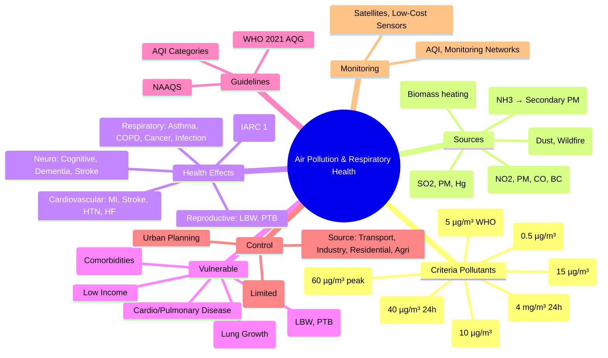

> [!info] **Davidson Ch 9 Alignment**: Environmental Medicine → Air Pollution & Respiratory Health
> **FCPS/MRCP Focus**: Criteria pollutants, sources, health effects (respiratory, cardiovascular, neurological), AQI/WHO guidelines, vulnerable groups, prevention strategies

---

## 1. 🎯 Learning Objectives

- [ ] Identify **Criteria Air Pollutants**: PM2.5, PM10, O3, NO2, SO2, CO, Lead
- [ ] Apply **Source Apportionment**: Traffic, industry, power generation, biomass burning, agriculture
- [ ] Recognise **Health Effects**: Respiratory (asthma, COPD, lung cancer), Cardiovascular (MI, stroke, HTN), Neurological, Developmental, Cancer
- [ ] Apply **Air Quality Indices**: AQI, WHO Guidelines (2021), NAAQS, Air Quality Bands
- [ ] Identify **Vulnerable Groups**: Children, elderly, pregnant, pre-existing cardiopulmonary disease, low-income
- [ ] Apply **Prevention & Control**: Source control, urban planning, clean energy, personal protection, policy

---

## 2. 📖 Criteria Air Pollutants — Sources & Health Effects

| Pollutant | Major Sources | Primary Health Effects | WHO 2021 AQG (Annual Mean) | NAAQS (US) |
|-----------|---------------|------------------------|----------------------------|------------|
| **PM2.5** (Fine Particulate Matter) | **Combustion** (traffic, industry, power plants, biomass burning, residential heating), **Secondary formation** (SO2, NOx, NH3 → sulfate, nitrate, ammonium) | **Respiratory**: Asthma exacerbation, COPD, lung cancer, reduced lung function<br>**Cardiovascular**: IHD, stroke, HTN, arrhythmia<br>**Other**: Diabetes, cognitive decline, low birth weight, mortality | **5 µg/m³ (annual)**, 15 µg/m³ (24h) | 12 µg/m³ (annual), 35 µg/m³ (24h) |
| **PM10** (Coarse Particulate Matter) | **Mechanical** (road dust, construction, agriculture, sea salt), **Combustion** | **Respiratory**: Asthma, COPD, bronchitis<br>**Cardiovascular**: MI, stroke | **15 µg/m³ (annual)**, 45 µg/m³ (24h) | 150 µg/m³ (24h) |
| **O3 (Ozone)** | **Photochemical** (NOx + VOCs + Sunlight) | **Respiratory**: Airway inflammation, reduced lung function, asthma exacerbation, COPD exacerbation, premature mortality | **60 µg/m³ (peak season, 8h mean)** | 70 ppb (8h) |
| **NO2 (Nitrogen Dioxide)** | **Combustion** (Traffic ~50-80%, Power plants, Industry) | **Respiratory**: Airway inflammation, asthma development/exacerbation, reduced lung growth (children)<br>**Cardiovascular**: Mortality | **10 µg/m³ (annual)**, 25 µg/m³ (24h) | 53 ppb (annual), 100 ppb (1h) |
| **SO2 (Sulphur Dioxide)** | **Fossil Fuel Combustion** (Coal, oil, shipping, metal smelting) | **Respiratory**: Bronchoconstriction, asthma exacerbation, bronchitis<br>**Cardiovascular** | **40 µg/m³ (24h)** | 75 ppb (1h) |
| **CO (Carbon Monoxide)** | **Incomplete Combustion** (Traffic, faulty heaters, biomass) | **Tissue Hypoxia** (COHb), **Cardiac ischemia**, **Neurocognitive impairment**, **Fetal hypoxia** | **4 mg/m³ (24h)** | 9 ppm (8h) |
| **Lead (Pb)** | **Leaded petrol (phased out), Industry (smelting, batteries), Paint, Aviation fuel** | **Neurodevelopmental (children IQ loss)**, **Cardiovascular**, **Renal**, **Haematological** | **0.5 µg/m³ (annual)** | 0.15 µg/m³ (rolling 3-month) |

> [!tip] **PM2.5 = Most Harmful** (Deep lung penetration, systemic inflammation). **NO2 = Traffic Proxy**. **O3 = Summer/Photochemical**. **SO2 = Point Sources (Industry)**. **CO = Indoor/Traffic**.

---

## 3. 📖 Sources — Sectoral Contribution

| Sector | Key Pollutants | Typical Contribution (Urban) |
|--------|----------------|-----------------------------|
| **Transport** | **NOx, PM2.5, CO, VOCs, BC** | **Major (40-60% NOx, 20-40% PM2.5 urban)** |
| **Industry / Power Generation** | **SO2, NOx, PM, Heavy Metals, Hg** | **Point Sources**, often regional |
| **Residential / Commercial** | **PM2.5, BC, CO, VOCs** (Biomass/Coal heating, cooking) | **Significant in Winter / Developing Countries** |
| **Agriculture** | **NH3 (→ Secondary PM2.5), CH4, N2O, Pesticides** | **Secondary PM2.5 Formation** |
| **Waste Management** | **CH4, VOCs, Dioxins, PM** | **Open Burning, Landfills** |
| **Natural** | **Dust, Sea Salt, Wildfires, Volcanic, Biogenic VOCs** | **Background / Episodic** |

> [!tip] **Traffic = #1 Urban Source** for NO2, PM2.5, CO, BC. **Industry/Power = SO2, Regional PM**. **Agriculture = NH3 → Secondary PM2.5**.

---

## 4. 📖 Health Effects — Mechanisms & Evidence

```mermaid
flowchart TD
    A[Air Pollutant Exposure] --> B[**Inhalation**]
    B --> C1[**Pulmonary Oxidative Stress & Inflammation**]
    B --> C2[**Systemic Inflammation & Oxidative Stress**]
    B --> C3[**Autonomic Nervous System Imbalance**]
    B --> C4[**Direct Translocation** (Ultrafine → Bloodstream)]
    C1 & C2 & C3 & C4 --> D[**Multi-System Health Effects**]
    D --> E1[**Respiratory**: Asthma, COPD, Lung Cancer, Infection Susceptibility]
    D --> E2[**Cardio**: Atherosclerosis, MI, Stroke, HF, HTN, Arrhythmia]
    D --> E3[**Neuro**: Cognitive Decline, Dementia, Neurodev (Children), Stroke]
    D --> E4[**Metabolic**: Diabetes, Obesity, NAFLD]
    D --> E4[**Reproductive**: Low Birth Weight, PTB, Stillbirth, Infertility]
    D --> E5[**Cancer**: Lung (IARC Group 1), Bladder, Breast]
```

### Respiratory Effects

| Condition | Pollutants | Key Evidence |
|-----------|------------|--------------|
| **Asthma Exacerbation** | **PM2.5, NO2, O3, SO2** | **Strong** (↑ ED visits, hospitalisations) |
| **Asthma Incidence (Children)** | **NO2, PM2.5, TRAP** | **Causal** (Traffic-Related Air Pollution) |
| **COPD Exacerbation** | **PM2.5, NO2, O3, SO2** | **Strong** |
| **COPD Incidence** | **PM2.5, NO2, Occupational** | **Probable** |
| **Lung Cancer** | **PM2.5 (IARC Group 1), Diesel Exhaust (Group 1)** | **Causal** |
| **Pneumonia / LRTI** | **PM2.5, NO2, SO2** | **Increased Susceptibility** |
| **Lung Function (Children)** | **PM2.5, NO2, O3** | **Reduced Growth** |

### Cardiovascular Effects

| Outcome | Key Pollutants | Mechanism |
|---------|----------------|-----------|
| **IHD / MI** | **PM2.5, NO2, BC** | Atherosclerosis, plaque rupture, thrombosis |
| **Stroke** | **PM2.5, NO2** | Vasoconstriction, thrombosis, BP ↑ |
| **Heart Failure** | **PM2.5** | Remodelling, autonomic dysfunction |
| **Hypertension** | **PM2.5, NO2, Traffic Noise** | Endothelial dysfunction, SNS activation |
| **Arrhythmia** | **PM2.5, CO** | Autonomic imbalance, repolarisation |

---

## 5. 📖 Vulnerable Groups

| Group | Specific Susceptibility | Key Pollutants |
|-------|------------------------|----------------|
| **Children** | **Developing lungs/immune system**, higher ventilation/kg, more outdoor time | **PM2.5, NO2, O3** → Asthma incidence, reduced lung growth |
| **Elderly** | **Comorbidities, reduced reserve, reduced clearance** | PM2.5, O3, CO |
| **Pre-existing Cardiopulmonary Disease** | **Asthma, COPD, IHD, HF** | All pollutants, especially PM2.5, O3, NO2 |
| **Pregnant Women** | **Fetal development, placental transfer** | PM2.5, NO2, CO, PAHs → LBW, PTB, neurodevelopment |
| **Low-Income / Deprived Communities** | **Higher exposure, less healthcare access, comorbidities** | All pollutants |
| **Occupational Groups** | **Traffic police, drivers, street vendors, industrial workers** | High cumulative exposure |

---

## 6. 📊 Air Quality Indices & Guidelines

### WHO 2021 Air Quality Guidelines (Key Values)

| Pollutant | **Annual Mean** | **24-h / Peak Season** | Interim Targets (IT) |
|-----------|----------------|------------------------|---------------------|
| **PM2.5** | **5 µg/m³** | **15 µg/m³** | IT1: 35, IT2: 25, IT3: 15 |
| **PM10** | **15 µg/m³** | **45 µg/m³** | IT1: 70, IT2: 50, IT3: 30 |
| **O3** | — | **60 µg/m³ (peak season, 8h)** | IT1: 100, IT2: 70 |
| **NO2** | **10 µg/m³** | **25 µg/m³** | IT1: 40, IT2: 25 |
| **SO2** | — | **40 µg/m³ (24h)** | IT1: 125, IT2: 50 |
| **CO** | — | **4 mg/m³ (24h)** | IT1: 7 mg/m³ |

> [!tip] **WHO 2021 AQG = Stricter than 2005**. **PM2.5 Annual: 5 µg/m³ (was 10)**. **NO2 Annual: 10 µg/m³ (was 40)**.

### Air Quality Index (AQI) — Common Categories

| AQI Range | Category | Health Advisory |
|-----------|----------|-----------------|
| **0-50** | **Good** | No risk |
| **51-100** | **Moderate** | Sensitive groups consider reducing exertion |
| **101-150** | **Unhealthy for Sensitive Groups** | Sensitive groups reduce exertion |
| **151-200** | **Unhealthy** | Everyone reduce exertion; sensitive groups avoid |
| **201-300** | **Very Unhealthy** | Everyone reduce exertion; sensitive groups avoid all outdoor |
| **301-500** | **Hazardous** | Avoid all outdoor activity |

> [!tip] **AQI based on pollutant with highest sub-index**. **PM2.5 often drives AQI**.

---

## 7. 📖 Indoor Air Pollution

| Source | Pollutants | Health Effects |
|--------|------------|----------------|
| **Biomass Fuel** (Wood, dung, crop residue) | **PM2.5, CO, PAHs, VOCs** | **ARI, COPD, Lung Cancer, Cataract, LBW** (Women/Children in LMIC) |
| **Tobacco Smoke (SHS)** | **PM2.5, Nicotine, Carcinogens (TSNAs), CO** | **Lung Cancer, IHD, Stroke, Asthma, SIDS, LBW** |
| **VOCs** (Formaldehyde, benzene, toluene) | **Building materials, furniture, cleaning products** | **Irritation, CNS effects, Cancer (benzene, formaldehyde)** |
| **Radon** | **Soil gas → Indoor accumulation** | **Lung Cancer (2nd leading cause)** |
| **Asbestos** | **Insulation, roofing,tiles** | **Mesothelioma, Lung Cancer, Asbestosis** |
| **Damp/Mould** | **Spores, mycotoxins** | **Asthma, rhinitis, hypersensitivity pneumonitis** |

> [!warning] **Household Air Pollution (HAP) = 3.2 Million Deaths/Year (WHO)**. **Women/Children in LMIC Most Affected**.

---

## 8. 🛡️ Prevention & Control Strategies

### Source Control (Most Effective)

| Sector | Interventions |
|--------|---------------|
| **Transport** | **EV/Public Transit/Active Travel**, **Low Emission Zones**, **Euro 6/VI Standards**, **Fuel Quality (Sulphur-free)**, **Congestion Charging** |
| **Industry/Power** | **Best Available Techniques (BAT)**, **Flue Gas Desulphurisation (FGD)**, **Selective Catalytic Reduction (SCR)**, **Electrostatic Precipitators/Baghouses**, **Fuel Switching (Gas/Renewables)** |
| **Residential** | **Clean Cooking (LPG/Electric/Improved Stoves)**, **Insulation/Ventilation**, **Ban Open Burning** |
| **Agriculture** | **Low-Nitrogen Fertilisers**, **Manure Management**, **Conservation Agriculture**, **No Open Burning** |
| **Urban Planning** | **Compact Cities**, **Green Spaces**, **Active Transport Infrastructure**, **Green Corridors** |

### Personal Protection (Least Effective Alone)

| Measure | Effectiveness |
|---------|--------------|
| **N95/FFP2 Respirators** | **High (if fitted)** — Occupational / High Exposure |
| **Surgical Masks** | **Limited** (Droplets, not PM2.5) |
| **Air Purifiers (HEPA)** | **Indoor PM2.5 Reduction** (If Sized/Sealed Correctly) |
| **Avoid Outdoor Activity** | **High AQI Days** (Sensitive Groups) |
| **Dietary Antioxidants** | **Adjunct** (Vit C/E, Omega-3, B-vitamins) |

---

## 9. 💡 FCPS/MRCP High-Yield Summary

| Topic | Key Point |
|-------|-----------|
| **Criteria Pollutants** | **PM2.5, PM10, O3, NO2, SO2, CO, Pb** |
| **PM2.5** | **Most Harmful**, **WHO 2021: 5 µg/m³ Annual**, **Sources: Combustion (Traffic, Industry, Biomass)** |
| **NO2** | **Traffic Proxy**, **Asthma Incidence (Children), CV Mortality**, **WHO: 10 µg/m³ Annual** |
| **O3** | **Photochemical (Summer)**, **Respiratory Morbidity**, **WHO: 60 µg/m³ (8h Peak Season)** |
| **SO2** | **Industry/Coal**, **Acute Bronchoconstriction, Asthma** |
| **CO** | **Tissue Hypoxia**, **Indoor/Traffic**, **Cardiac Ischaemia** |
| **Pb** | **Neurodevelopmental (Children)**, **Phased Out Petrol, Persists in Paint/Industry** |
| **Vulnerable** | **Children, Elderly, Pregnant, Cardiopulmonary Disease, Low-Income** |
| **AQI** | **PM2.5 Often Driver**, **Categories: Good → Hazardous** |
| **WHO 2021 AQG** | **PM2.5: 5 µg/m³ Annual**, **NO2: 10 µg/m³ Annual** |
| **Control** | **Source Control > Personal Protection**, **Transport/Industry/Residential/Agri**, **Clean Energy** |

---

## 10. ❓ Viva Questions

1. **What are the six criteria air pollutants and which is considered most harmful?**
   - **PM2.5, PM10, O3, NO2, SO2, CO, Pb**; **PM2.5 most harmful** (systemic effects, deep lung penetration).

2. **What are the WHO 2021 Air Quality Guideline values for PM2.5 and NO2 annual means?**
   - **PM2.5: 5 µg/m³**, **NO2: 10 µg/m³**.

3. **Which pollutant is the best proxy for traffic-related air pollution?**
   - **NO2** (and Black Carbon).

4. **What are the main health effects of PM2.5?**
   - **Respiratory (asthma, COPD, lung cancer), Cardiovascular (MI, stroke, HF), Cognitive decline, Diabetes, Low birth weight, Mortality**.

4. **How does Ozone form and what are its health effects?**
   - **Photochemical reaction (NOx + VOCs + sunlight)**; **Respiratory: airway inflammation, reduced lung function, asthma/COPD exacerbation, premature mortality**.

5. **What are the WHO 2021 AQG values for PM2.5 and NO2 and how do they differ from 2005?**
   - **PM2.5: 5 µg/m³ (was 10); NO2: 10 µg/m³ (was 40)**; **Stricter based on new evidence**.

6. **Which groups are most vulnerable to air pollution?**
   - **Children (lung development), Elderly, Pregnant women, Pre-existing cardiopulmonary disease, Low-income communities**.

6. **What are the main sources of PM2.5 in urban areas?**
   - **Traffic (exhaust, non-exhaust), Industry, Residential heating (biomass/coal), Secondary formation (NOx, SO2, NH3)**.

7. **What is the difference between PM10 and PM2.5 health effects?**
   - **PM10: Upper airways, coarse**; **PM2.5: Deep lung, systemic translocation, broader effects**.

7. **What are the main interventions to reduce air pollution at source?**
   - **Transport (EV, public transit, LEZ, fuel standards), Industry (BAT, scrubbers, fuel switch), Residential (clean cooking, insulation), Agriculture (NH3 reduction), Urban planning (compact, green, active transport)**.

8. **How does air pollution affect children's lung development?**
   - **Reduced lung function growth, increased asthma incidence**, **PM2.5, NO2, TRAP** implicated.

9. **What is the Air Quality Index and how is it used?**
   - **Standardised index (0-500) based on worst pollutant sub-index**; **Categories: Good to Hazardous**; **Guides public advisories**.

10. **What is the health impact of indoor air pollution from biomass fuel?**
    - **3.2M deaths/year (WHO)**; **Women/children in LMIC**; **ARI, COPD, Lung Cancer, Cataract, LBW**.

---

## 11. 🧠 Confusions & Mnemonics

| Confusion | Clarification |
|-----------|---------------|
| **PM2.5 vs PM10** | **PM2.5 = Fine, Deep Lung, Systemic**; **PM10 = Coarse, Upper Airways** |
| **Primary vs Secondary PM2.5** | **Primary = Direct Emission**; **Secondary = Atmospheric Formation (SO2→Sulfate, NOx→Nitrate, NH3→Ammonium)** |
| **O3 Summer vs Winter** | **Summer = High (Photochemical)**; **Winter = Low** |
| **NO2 vs NOx** | **NO2 = Measured Pollutant**, **NOx = NO + NO2 (Total Oxidised Nitrogen)** |
| **SO2 vs Sulphate PM** | **SO2 = Gas (Precursor)**; **Sulphate = Secondary PM2.5 Component** |
| **AQI vs Concentration** | **AQI = Standardised Index (0-500)**; **Concentration = µg/m³ (Physical)** |

| Mnemonic | Meaning |
|----------|---------|
| **"PM2.5 = Killer #1"** | Most Harmful |
| **"NO2 = Traffic Proxy"** | Source Indicator |
| **"O3 = Summer Smog"** | Seasonal |
| **"SO2 = Industry"** | Point Source |
| **"CO = Hypoxia"** | Mechanism |
| **"Pb = Neurodev (Kids)"** | Lead Toxicity |
| **"AQI = Worst Pollutant Wins"** | Index Logic |
| **"WHO 2021: Stricter"** | Guidelines Updated |

---

## 12. 🗺️ Mind Map



---

## 13. 📋 One-Page Revision Card

| **AIR POLLUTION & RESPIRATORY HEALTH – FCPS/MRCP REVISION CARD** |
|------------------------------------------------------------------|
| **Criteria Pollutants**: **PM2.5, PM10, O3, NO2, SO2, CO, Pb** |
| **PM2.5**: **Most Harmful**, WHO **5 µg/m³ Annual**, Traffic/Industry/Biomass Sources |
| **NO2**: **Traffic Proxy**, Asthma Incidence (Kids), CV Mortality, **WHO 10 µg/m³** |
| **O3**: **Photochemical (Summer)**, Respiratory Morbidity, **WHO 60 µg/m³ Peak** |
| **SO2**: **Industry/Coal**, Bronchoconstriction, Acid Rain |
| **CO**: **Tissue Hypoxia**, Cardiac Ischaemia, Indoor/Traffic |
| **Pb**: **Neurodevelopmental (Kids)**, Phased Out Petrol |
| **Vulnerable**: **Children, Elderly, Pregnant, Cardio/Pulmonary, Poor** |
| **AQI**: PM2.5 Often Driver, **Good (0-50) → Hazardous (301-500)** |
| **WHO 2021 AQG**: **PM2.5 5 µg/m³, NO2 10 µg/m³** (Stricter than 2005) |
| **Control**: **Source Control > Personal Protection**, Clean Energy, Transport, Industry, Urban Planning |

---

## 14. 📅 Spaced Repetition Tracker

| Review | Date | Score (1-5) | Next Review |
|--------|------|-------------|-------------|
| Day 1 | 2025-06-17 | | 2025-06-18 |
| Day 3 | | | |
| Day 7 | | | |
| Day 15 | | | |
| Day 30 | | | |

---

## 15. 🎯 Must Know / Should Know / Nice to Know

| Level | Content |
|-------|---------|
| **Must Know** | Criteria pollutants (PM2.5, PM10, O3, NO2, SO2, CO, Pb), WHO 2021 AQG values, PM2.5 most harmful, NO2 = traffic proxy, O3 photochemical, health effects (respiratory, CV, neuro, cancer), vulnerable groups, AQI categories, source control > personal protection |
| **Should Know** | PM2.5 composition (sulphate, nitrate, ammonium, BC, OC), secondary formation mechanisms, AQI calculation methodology, indoor air pollution (biomass, radon, SHS, VOCs, mould), WHO 2021 vs 2005 changes, AQI vs concentration, exposure assessment methods (monitoring, modelling, biomarkers), DI burden (GBD), cost-effectiveness of interventions |
| **Nice to Know** | Ultrafine particles (UFP) health effects, non-exhaust traffic emissions (brake/tyre wear), ammonia & secondary PM, black carbon climate co-benefits, satellite remote sensing for exposure, low-cost sensor networks, personal exposure monitoring, gene-environment interaction, epigenetic mechanisms, co-benefits climate/air quality, policy evaluation (LEZ, congestion charging), environmental justice |

---

## 16. ✅ Self-Test Scorecard

| Section | Score (0-10) | Notes |
|---------|--------------|-------|
| Criteria Pollutants & Standards | | |
| Sources & Formation | | |
| Health Effects (Respiratory, CV, Neuro) | | |
| Vulnerable Groups | | |
| AQI & Guidelines | | |
| Prevention & Control | | |
| Viva Questions | | |

---

## 17. 🔗 Local Navigation

- **Previous**: [[Fundamentals of Environmental Medicine]]
- **Next**: [[Water Pollution & Waterborne Diseases]]
- **Section Hub**: [[Environmental Medicine MOC]]
- **MOC**: [[Hematology MOC]]
- **Template**: [[../Templates/Hematology Topic Template]]

---

*Generated for FCPS/MRCP exam preparation. Based on Davidson Medicine 24th Ed Chapter 9.*