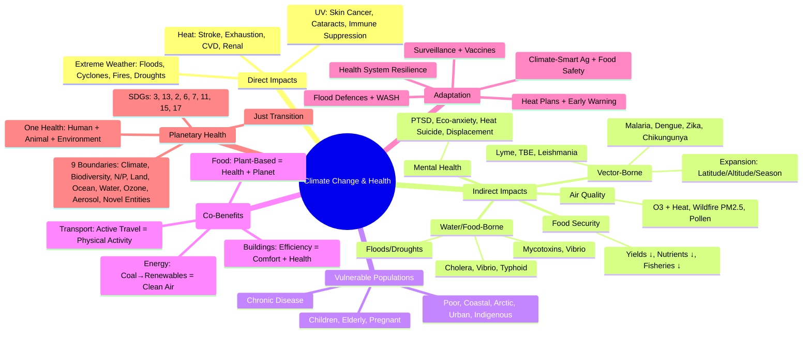

> [!info] **Davidson Ch 9 Alignment**: Environmental Medicine → Climate Change & Health
> **FCPS/MRCP Focus**: Direct impacts (heat, extreme weather, UV), indirect impacts (vector-borne, water/food-borne, air quality, food security, mental health), vulnerable populations, mitigation/adaptation, planetary health framework

---

## 1. 🎯 Learning Objectives

- [ ] Identify **Direct Health Impacts**: Heat-related illness, extreme weather events, UV radiation
- [ ] Analyse **Indirect Health Impacts**: Vector-borne disease shifts, water/food-borne diseases, air quality, food security/nutrition, mental health
- [ ] Identify **Vulnerable Populations**: Geographic, demographic, occupational, socioeconomic
- [ ] Apply **Mitigation & Adaptation**: Health co-benefits, health system resilience, early warning systems
- [ ] Understand **Planetary Health Framework**: Sustainable development goals, One Health, planetary boundaries

---

## 2. 📖 Direct Health Impacts

### Heat-Related Illness

| Condition | Definition | Risk Factors | Management |
|-----------|------------|--------------|------------|
| **Heat Exhaustion** | **Core temp 37-40°C**, heavy sweating, weakness, nausea, headache, dizziness | Elderly, chronic disease, exertion, humidity | **Cool, Hydrate, Rest**, Monitor |
| **Heat Stroke** | **Core temp >40°C**, **CNS dysfunction** (confusion, seizures, coma), hot dry skin | **Medical Emergency**, High mortality | **Rapid Cooling (Ice water immersion)**, **ABCs**, **ICU**, **Avoid antipyretics** |
| **Heat Cramps** | **Painful muscle spasms**, electrolyte loss | Exercise in heat | **Oral electrolytes, Rest, Cool** |
| **Heat Syncope** | **Orthostatic dizziness/syncope**, vasodilation + dehydration | Prolonged standing in heat | **Supine, Fluids, Cool** |

| Population at Risk | Mechanism |
|-------------------|-----------|
| **Elderly** | Reduced thermoregulation, comorbidities, medications (diuretics, beta-blockers), social isolation |
| **Children** | Higher surface area:mass, higher metabolic rate, dependent on caregivers |
| **Chronic Disease** (CVD, respiratory, diabetes, renal, mental illness) | Impaired thermoregulation, medication effects (diuretics, anticholinergics, beta-blockers) |
| **Urban Poor** | Urban heat islands, poor housing, no AC, occupational exposure |
| **Outdoor Workers** | Construction, agriculture, delivery, construction | High metabolic heat + environmental heat |

### Extreme Weather Events

| Event | Health Impacts | Vulnerable Groups |
|-------|----------------|-------------------|
| **Floods** | **Drowning, Trauma**, **Waterborne diseases** (Cholera, Leptospirosis, Hepatitis A), **Vector-borne** (Mosquito proliferation), **Mental health (PTSD, depression)**, **Displacement** | Low-lying areas, poor housing, poor sanitation, limited evacuation capacity |
| **Cyclones/Hurricanes** | **Trauma, Drowning**, **Waterborne/Vector-borne outbreaks**, **Health system disruption**, **Mental health** | Coastal populations, poor infrastructure, evacuation challenges |
| **Wildfires** | **Burns, Smoke inhalation (PM2.5, CO, VOCs)**, **Exacerbation of COPD/Asthma**, **CV events**, **Mental health**, **Displacement** | Firefighters, nearby communities, cardiopulmonary disease |
| **Droughts** | **Food insecurity, Malnutrition**, **Water scarcity (WASH)**, **Dust storms**, **Wildfire risk**, **Mental health (farmer suicide)** | Rural/agricultural, subsistence farmers, low-income |
| **Heatwaves** | **Excess mortality (CVD, Respiratory, Renal)**, **Heat stroke, Exacerbation of chronic disease**, **Power outages → Cold chain failure** | Elderly, isolated, chronic disease, urban poor |

### UV Radiation

| Effect | Mechanism | Prevention |
|--------|-----------|------------|
| **Skin Cancer** (Melanoma, BCC, SCC) | **UVB (Direct DNA damage)**, UVA (Photoaging, indirect DNA damage) | **Sun protection (Slip, Slop, Slap, Seek, Slide)**, Avoid midday sun |
| **Cataracts / Pterygium** | UVB absorption by lens | UV-blocking sunglasses, hats |
| **Immune Suppression** | UV-induced local/systemic immunosuppression | Photoprotection |
| **Vitamin D Synthesis** | UVB → 7-dehydrocholesterol → Vitamin D3 | **Balanced exposure** (10-15 min midday sun, arms/legs) |

---

## 3. 📖 Indirect Health Impacts

### Vector-Borne Disease Shifts

| Disease / Vector | Climate Driver | Projected Change |
|------------------|----------------|------------------|
| **Malaria** (*Anopheles*) | **Temperature ↑ → Faster parasite development, longer transmission season, altitudinal/latitudinal expansion** | **Highland expansion (E. Africa, Andes), Season extension** |
| **Dengue / Chikungunya / Zika** (*Aedes aegypti/albopictus*) | **Temperature ↑ → Faster viral replication in mosquito, shorter EIP, expanded range**, **Rainfall → Breeding sites** | **Geographic expansion (temperate zones), Year-round transmission in tropics** |
| **Lyme Disease** (*Ixodes* ticks) | **Warmer winters → Tick survival ↑**, **Range expansion northward/upward** | **Northern Europe, Canada, Highlands** |
| **Tick-Borne Encephalitis** | **Warmer → Tick activity ↑, Virus replication ↑** | **Northern Europe, Higher altitudes** |
| **Leishmaniasis** (Sandflies) | **Temperature/Humidity → Vector range expansion** | **Mediterranean northward, Urbanisation** |
| **Schistosomiasis** | **Temperature → Snail habitat expansion**, **Irrigation/dams** | **New foci, Re-emergence** |

### Water- & Food-Borne Diseases

| Driver | Impact |
|--------|--------|
| **Temperature ↑** | **Vibrio cholerae, V. parahaemolyticus** proliferation in coastal waters → **Cholera, Seafood illness** |
| **Heavy Rainfall / Flooding** | **Sewage overflow**, **Water contamination** → **Cholera, Typhoid, Hepatitis A/E, Leptospirosis, Cryptosporidium** |
| **Drought** | **Water scarcity → Poor hygiene**, **Concentration of contaminants**, **Cyanobacterial blooms (Microcystins)** |
| **Temperature ↑** | **Foodborne pathogens** (Salmonella, Campylobacter, Listeria) **growth rate ↑**, **Mycotoxin (Aflatoxin) production in crops** |

### Air Quality Interactions

| Interaction | Mechanism | Health Impact |
|-------------|-----------|---------------|
| **Heat + O3** | **Heat → ↑ O3 formation** | **Respiratory exacerbation, CV mortality** |
| **Wildfires + Climate** | **Drought/Heat → Wildfires → PM2.5, CO, VOCs** | **Respiratory/CV morbidity, Mortality** |
| **Pollen + CO2/Temp** | **CO2 ↑ → Pollen production ↑, Season longer**, **Temp ↑ → Earlier season** | **Allergic Rhinitis, Asthma exacerbation** |
| **Dust Storms** | **Drought/Desertification → Dust → PM10/2.5** | **Respiratory/Cardiovascular** |

### Food Security & Nutrition

| Pathway | Impact |
|---------|--------|
| **Crop Yields** | **Heat/Drought/Floods → ↓ Yields (Wheat, Maize, Rice)** → **Food Insecurity, Price Volatility** |
| **Nutrient Density** | **Elevated CO2 → ↓ Protein, Zinc, Iron in Staples (C3 Crops)** → **Micronutrient Deficiencies** |
| **Fisheries** | **Ocean Warming/Acidification → ↓ Catch, Range Shifts** → **Protein Loss (Coastal/Island Populations)** |
| **Food Safety** | **Mycotoxins (Aflatoxin), Vibrio, Salmonella** proliferation in heat/humidity |

### Mental Health Impacts

| Pathway | Manifestations |
|--------|----------------|
| **Acute Events** | **PTSD, Depression, Anxiety, Grief** (Post-disaster) |
| **Chronic Stress** | **Eco-anxiety, Solastalgia (distress from environmental change)**, **Displacement Migration** |
| **Heat** | **Aggression, Suicide, Cognitive Impairment** |
| **Displacement** | **Loss of Livelihood, Community, Cultural Identity** |

---

## 4. 📖 Vulnerable Populations

| Dimension | Groups | Specific Risks |
|-----------|--------|--------------|
| **Geographic** | **Small Island States** (SLR, Cyclones), **Coastal Megacities** (Floods, Heat Islands), **Arctic** (Permafrost Thaw, Indigenous Health), **Arid/Semi-Arid** (Drought, Dust) | SLR, Salinisation, Cyclones, Heat, Vector Shift |
| **Demographic** | **Children** (Developmental vulnerability), **Elderly** (Physiological reserve), **Pregnant Women** (Fetal vulnerability), **Indigenous Peoples** (Land connection, Marginalisation) | Heat, Malnutrition, Infectious Disease, Displacement |
| **Socioeconomic** | **Urban Poor** (Slums, Heat Island, Flood Risk), **Rural Subsistence Farmers** (Drought, Crop Failure), **Informal Workers** (Heat Exposure, No Safety Net) | Heat, Flood, Vector-Borne, Food Insecurity |
| **Health Status** | **Chronic Disease** (CVD, Resp, Diabetes, CKD), **Mental Illness**, **Immunocompromised** | Heat, Air Pollution, Infection Risk, Medication Interactions |

---

## 5. 🛡️ Mitigation & Adaptation

### Mitigation (Reduce GHG Emissions) — Health Co-Benefits

| Sector | Mitigation Action | **Health Co-Benefit** |
|--------|------------------|----------------------|
| **Energy** | **Coal Phase-Out → Renewables** | **↓ Air Pollution (PM2.5, NO2, SO2) → ↓ CVD, Respiratory, Lung Cancer** |
| **Transport** | **Active Travel (Walk/Cycle)**, **Public Transit**, **EV Shift** | **↑ Physical Activity → ↓ Obesity, Diabetes, CVD**, **↓ Air/Noise Pollution** |
| **Food Systems** | **Plant-Based Diets**, **Reduce Food Waste**, **Sustainable Agriculture** | **↓ Red Meat → ↓ CVD/Cancer**, **↓ Land Use/Water, Biodiversity** |
| **Buildings** | **Energy Efficiency, Passive Cooling** | **Thermal Comfort, ↓ Heat Exposure, ↓ Energy Poverty** |
| **Healthcare** | **Decarbonise Supply Chain**, **Climate-Resilient Facilities** | **Resilient Health Systems, Leadership** |

> [!tip] **Mitigation = Largest Global Health Opportunity of 21st Century** (Lancet Countdown). **Health Co-Benefits Exceed Mitigation Costs**.

### Adaptation (Manage Unavoidable Impacts)

| Domain | Measures |
|--------|----------|
| **Health Systems** | **Climate-Resilient Infrastructure**, **Surge Capacity**, **Early Warning Systems**, **Disease Surveillance (EWARS)**, **Workforce Training** |
| **Heat** | **Heat-Health Action Plans**, **Cooling Centres**, **Urban Greening/Cool Roofs**, **Heat-Health Alerts** |
| **Flood/Storm** | **Early Warning Systems**, **Evacuation Plans, Flood Defences, Resilient Infrastructure, WASH Resilience** |
| **Vector-Borne** | **Integrated Vector Management**, **Surveillance/Genomic Surveillance**, **Vaccine Deployment**, **Community Engagement** |
| **Food/Water** | **Climate-Smart Agriculture**, **Drought-Resilient Crops**, **Water Safety Plans**, **Food Safety Surveillance** |
| **Mental Health** | **Psychosocial Support**, **Community Resilience**, **Disaster Mental Health Plans** |

---

## 6. 🌍 Planetary Health Framework

| Concept | Description |
|---------|-------------|
| **Planetary Boundaries** | **9 Boundaries**: Climate Change, Biodiversity Loss, Nitrogen/Phosphorus Cycles, Land Use, Ocean Acidification, Freshwater Use, Ozone Depletion, Aerosol Loading, Novel Entities — **Health Depends on Staying Within Boundaries** |
| **One Health** | **Human, Animal, Environmental Health Interconnected** — **Zoonoses, AMR, Food Safety, Ecosystem Services** |
| **Sustainable Development Goals (SDGs)** | **SDG 3 (Health) Interlinked with SDG 13 (Climate), 2 (Zero Hunger), 6 (Water), 7 (Energy), 11 (Cities), 13 (Climate), 15 (Life on Land)** |
| **Just Transition** | **Equitable Shift to Low-Carbon** — **Workers/Communities Not Left Behind**, **Health Equity Central** |

---

## 7. 💡 FCPS/MRCP High-Yield Summary

| Topic | Key Point |
|-------|-----------|
| **Direct Impacts** | **Heat (Stroke/Exhaustion)**, **Extreme Weather (Floods, Cyclones, Wildfires, Droughts)**, **UV (Skin Cancer, Cataracts)** |
| **Vector-Borne Shifts** | **Malaria, Dengue, Zika, Lyme** expanding poleward/upward; **Longer Seasons**, **New Areas** |
| **Water/Food-Borne** | **Cholera/Vibrio (Warming Waters), Floods → Waterborne, Drought → Food Insecurity/Toxins** |
| **Air Quality** | **Heat → O3 ↑, Wildfires → PM2.5, Pollen ↑** → **Respiratory/CV** |
| **Food Security** | **↓ Yields, ↓ Nutrient Density (CO2), Fisheries Decline** → **Malnutrition** |
| **Mental Health** | **PTSD (Disasters), Eco-anxiety, Heat → Suicide/Aggression, Displacement** |
| **Vulnerable** | **Children, Elderly, Pregnant, Poor, Chronic Disease, Coastal/Island/Arctic/Urban Poor** |
| **Mitigation = Health** | **Coal → Renewables (Clean Air), Active Transport (Activity), Plant-Based Diet (Health), Green Cities** |
| **Adaptation** | **Heat Plans, Early Warning, Resilient Health Systems, Climate-Smart Ag, Early Warning Systems** |
| **Planetary Health** | **Planetary Boundaries, One Health, SDGs, Just Transition** |

---

## 8. ❓ Viva Questions

1. **What are the direct health impacts of climate change?**
   - **Heat-related illness (exhaustion, stroke), Extreme weather injuries/deaths (floods, cyclones, wildfires, droughts), UV radiation (skin cancer, cataracts)**.

2. **How does climate change affect vector-borne diseases?**
   - **Temperature ↑ → Faster pathogen replication in vectors, longer transmission seasons, geographic range expansion (latitude/altitude)**.

3. **What is the health impact of wildfires?**
   - **PM2.5/CO/VOCs from smoke → Respiratory/CV exacerbation, Premature mortality, Mental health impacts, Displacement**.

4. **How does climate change affect food security and nutrition?**
   - **↓ Crop yields (heat/drought/floods), ↓ Nutrient density (Protein, Zn, Fe) due to CO2, Fisheries decline → Malnutrition, Micronutrient Deficiencies**.

5. **What are the mental health impacts of climate change?**
   - **PTSD/Depression/Anxiety post-disasters, Eco-anxiety/Solastalgia, Heat → Aggression/Suicide, Displacement Trauma**.

6. **Which populations are most vulnerable to climate change health impacts?**
   - **Children, Elderly, Pregnant Women, Chronic Disease, Low-Income, Coastal/Island/Arctic/Urban Poor, Outdoor Workers, Indigenous**.

7. **What are the health co-benefits of climate mitigation?**
   - **Energy Transition (Coal→Renewables) → Clean Air → ↓ CVD/Resp/Cancer; Active Transport → Physical Activity → ↓ Obesity/Diabetes/CVD; Plant-Based Diets → ↓ CVD/Cancer/Land Use**.

7. **How should health systems adapt to climate change?**
   - **Climate-Resilient Infrastructure, Surge Capacity, Early Warning Systems, Disease Surveillance, Workforce Training, Supply Chain Resilience, Community Engagement**.

8. **What is the One Health approach?**
   - **Human, Animal, Environmental Health Interconnected** — **Zoonoses, AMR, Food Safety, Ecosystem Services**.

8. **What are Planetary Boundaries and their relevance to health?**
   - **9 Boundaries (Climate, Biodiversity, N/P Cycles, Land Use, Ocean Acidification, Freshwater, Ozone, Aerosols, Novel Entities) — Health Depends on Staying Within Safe Operating Space**.

9. **What is the role of health professionals in climate action?**
   - **Advocacy, Education, Clinical Practice (Heat/Counselling), Health System Decarbonisation, Policy Engagement, Research**.

10. **How does climate change affect vector-borne disease transmission?**
    - **Temperature ↑ → Vector development rate ↑, Extrinsic Incubation Period ↓, Survival ↑, Geographic Range Expansion (Latitude/Altitude), Season Length ↑**.

---

## 9. 🧠 Confusions & Mnemonics

| Confusion | Clarification |
|-----------|---------------|
| **Mitigation vs Adaptation** | **Mitigation = Reduce GHG (Prevent)**; **Adaptation = Manage Impacts (Prepare/Respond)** |
| **Climate Change vs Weather** | **Climate = Long-Term Average (30+ Years)**; **Weather = Short-Term Atmospheric State** |
| **Direct vs Indirect Health Impacts** | **Direct = Heat, Extreme Weather, UV**; **Indirect = Vector/Food/Water/Vector, Air Quality, Food Security, Mental Health** |
| **Malaria Expansion vs Intensity** | **Expansion = New Areas (Highlands, Latitudes)**; **Intensity = Longer Season, Higher Transmission in Endemic Areas** |
| **Mitigation Co-Benefits vs Costs** | **Health Co-Benefits Often Exceed Mitigation Costs** (Lancet) |
| **Planetary Health vs Global Health** | **Planetary = Earth Systems Focus (Boundaries, One Health)**; **Global = Human Health Equity Focus** |

| Mnemonic | Meaning |
|----------|---------|
| **"Heat Kills (CVD/Resp), Floods Drown/Infect, Fire Burns/Breathes, Drought Starves"** | Direct Impacts |
| **"Vectors Love Warmth → Expand & Intensify"** | Vector-Borne Shift |
| **"CO2 ↓ Nutrients → Hidden Hunger"** | Food Nutrition |
| **"Mitigation = Health Win-Win"** | Co-Benefits |
| **"Planetary Boundaries = Safe Operating Space"** | Planetary Health |
| **"One Health = Human + Animal + Environment"** | One Health |

---

## 10. 🗺️ Mind Map

---

## 11. 📋 One-Page Revision Card

| **CLIMATE CHANGE & HEALTH – FCPS/MRCP REVISION CARD** |
|--------------------------------------------------------|
| **Direct**: Heat (Stroke/Exhaustion), Extreme Weather (Flood/Cyclone/Fire/Drought), UV (Skin Cancer/Cataract) |
| **Vector-Borne**: **Warming → Expansion (Malaria, Dengue, Zika, Lyme)** — Longer Season, Higher Altitude/Latitude |
| **Water/Food**: **Cholera/Vibrio (Warm Water)**, Floods (Waterborne), Drought (Food Insecurity/Toxins), **Mycotoxins** |
| **Air Quality**: **Heat → O3↑**, **Wildfires → PM2.5**, **Pollen↑** → Respiratory/CV |
| **Food Security**: **Yields↓, Nutrients↓ (CO2), Fisheries↓** → Malnutrition |
| **Mental Health**: PTSD (Disasters), Eco-anxiety, Heat→Suicide/Aggression, Displacement |
| **Vulnerable**: **Children, Elderly, Pregnant, Chronic Disease, Poor, Coastal/Island/Arctic/Urban/Outdoor Workers** |
| **Mitigation = Health**: **Coal→Renewables (Clean Air), Active Transport (Activity), Plant-Based (CVD↓), Green Cities (Heat↓)** |
| **Adaptation**: **Heat Plans, Early Warning, Resilient Health Systems, Climate-Smart Ag, WASH** |
| **Planetary Health**: **9 Boundaries, One Health, SDGs, Just Transition** |
| **Health Co-Benefits > Mitigation Costs** |

---

## 12. 📅 Spaced Repetition Tracker

| Review | Date | Score (1-5) | Next Review |
|--------|------|-------------|-------------|
| Day 1 | 2025-06-17 | | 2025-06-18 |
| Day 3 | | | |
| Day 7 | | | |
| Day 15 | | | |
| Day 30 | | | |

---

## 13. 🎯 Must Know / Should Know / Nice to Know

| Level | Content |
|-------|---------|
| **Must Know** | Direct impacts (heat, extreme weather, UV), Vector-borne shifts (malaria, dengue, Lyme), Water/food-borne (cholera, floods, droughts), Air quality (O3, wildfires, pollen), Food security (yields, nutrients, fisheries), Mental health (PTSD, eco-anxiety, heat), Vulnerable populations, Mitigation co-benefits (clean air, active transport, plant-based diet), Adaptation priorities (heat plans, early warning, resilient health systems), Planetary boundaries, One Health, SDGs |
| **Should Know** | Specific disease-model projections (malaria maps, dengue Aedes expansion), Attribution science (event attribution), Health impact attribution, Economic costs of climate-health impacts, Heat-health action plan components, Early warning systems (EWARS), Climate-smart agriculture practices, Climate-resilient health infrastructure, Climate finance for health, Loss & damage mechanism, Indigenous knowledge, Gender/climate intersections |
| **Nice to Know** | Attribution science methodologies, Compound events (heat+humidity, drought+heat), Tipping points & irreversible changes, Climate-health vulnerability mapping, Health national adaptation plans (HNAPs), Climate litigation & health, Health in NDCs (Nationally Determined Contributions), Indigenous knowledge systems, Planetary health education frameworks, Transformative adaptation, Degrowth & health, Artificial intelligence in climate-health surveillance |

---

## 14. ✅ Self-Test Scorecard

| Section | Score (0-10) | Notes |
|---------|--------------|-------|
| Direct Climate Health Impacts | | |
| Indirect Impacts (Vector, Water, Food, Air) | | |
| Vulnerable Populations | | |
| Mitigation Co-Benefits | | |
| Adaptation Strategies | | |
| Planetary Health & One Health | | |
| Viva Questions | | |

---

## 15. 🔗 Local Navigation

- **Previous**: [[Soil & Food Contamination]]
- **Next**: [[Chemical Hazards & Toxicology]]
- **Section Hub**: [[Environmental Medicine MOC]]
- **MOC**: [[Hematology MOC]]
- **Template**: [[../Templates/Hematology Topic Template]]

---

*Generated for FCPS/MRCP exam preparation. Based on Davidson Medicine 24th Ed Chapter 9.*