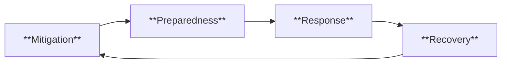

> [!info] **Davidson Ch 9 Alignment**: Environmental Medicine → Environmental Health Emergencies & Disaster Management
> **FCPS/MRCP Focus**: Natural disasters (floods, cyclones, earthquakes, tsunamis, volcanic), man-made disasters (chemical, radiation, industrial), disaster health management phases, preparedness, One Health

---

## 1. 🎯 Learning Objectives

- [ ] Classify **Environmental Health Emergencies**: Natural vs Man-made, Acute vs Chronic
- [ ] Manage **Natural Disasters**: Floods, Cyclones/Hurricanes, Earthquakes, Tsunamis, Volcanic Eruptions
- [ ] Manage **Man-Made Disasters**: Chemical Incidents, Radiation Emergencies, Industrial Accidents, Conflict/War
- [ ] Apply **Disaster Health Management Cycle**: Mitigation, Preparedness, Response, Recovery
- [ ] Implement **Public Health Response**: WASH, Shelter, Nutrition, Disease Surveillance, Mental Health
- [ ] Apply **Preparedness & Resilience**: Early Warning Systems, Hospital Surge Capacity, Community Resilience, One Health

---

## 2. 📖 Disaster Classification

| Category | Examples | Key Characteristics |
|----------|-----------|---------------------|
| **Natural Disasters** | Floods, Cyclones/Hurricanes, Earthquakes, Tsunamis, Volcanic Eruptions, Wildfires, Droughts, Heatwaves | Natural forces, often predictable (some), wide geographic impact |
| **Man-Made (Technological)** | Chemical Spills, Radiation Accidents, Industrial Explosions, Transport Accidents, Structural Collapse | Human error/system failure, localized or regional, often sudden |
| **Complex Emergencies** | **Conflict/War**, Complex Humanitarian Crises | Conflict + Displacement + Health System Collapse + Food Insecurity |

---

## 3. 📖 Natural Disasters — Health Impacts & Management

### 1. Floods

| Phase | Health Risks | Public Health Response |
|-------|--------------|------------------------|
| **Acute (Days)** | **Drowning**, **Trauma**, **Hypothermia**, **Electrocution**, **Snake/Animal Bites** | **Search & Rescue**, **Evacuation**, **Emergency Medical Care**, **Tetanus Prophylaxis** |
| **Subacute (Days-Weeks)** | **Waterborne**: Cholera, Typhoid, Hepatitis A/E, Leptospirosis, Dysentery<br>**Vector-borne**: Dengue, Malaria (Post-flood mosquito breeding)<br>**Skin/Soft Tissue**: Cellulitis, Fungal, Trench Foot | **WASH**: Safe Water (Chlorination/Boiling), Sanitation (Latrines), Hygiene Promotion<br>**Disease Surveillance**: EWARS (Early Warning Alert and Response System)<br>**Vaccination**: Cholera OCV, Hepatitis A, Typhoid (if indicated) |
| **Chronic (Months)** | **Mental Health** (PTSD, Depression, Anxiety), **Malnutrition**, **Vector-borne Resurgence**, **Mould/Indoor Air Quality** | **Mental Health/Psychosocial Support**, **Nutrition Support**, **Vector Control**, **Housing Repair** |

### 2. Cyclones / Hurricanes / Typhoons

| Phase | Health Risks | Key Actions |
|-------|--------------|-------------|
| **Pre-Landfall** | **Evacuation**, **Storm Surge**, **Wind Damage** | **Evacuation Orders**, **Shelters**, **Pre-position Supplies** |
| **During** | **Trauma (Debris, Structural Collapse)**, **Drowning (Storm Surge)**, **Carbon Monoxide** (Generators) | **Shelter-in-Place**, **Stay Indoors**, **CO Detectors** |
| **Post-Landfall** | **Trauma Care**, **Waterborne/Vector-borne Diseases**, **Power Outage → Cold Chain Failure**, **Mental Health** | **Triage/Triage Tags**, **Field Hospitals**, **Water/Water Purification**, **Disease Surveillance**, **Mental Health Support** |

### 3. Earthquakes

| Phase | Health Risks | Key Actions |
|-------|--------------|-------------|
| **Immediate** | **Trauma** (Crush Injuries, Fractures, Head Injury), **Crush Syndrome** (Rhabdomyolysis → AKI), **Building Collapse**, **Fire**, **Dust Inhalation** | **Triage (START/SALT)**, **FAST (Focused Assessment with Sonography for Trauma)**, **Crush Syndrome Protocol** (Hydration, Alkalinisation, Dialysis), **Surgical Capacity** |
| **Early (Days)** | **Wound Infections**, **Crush Syndrome Complications**, **Psychological Trauma**, **Displacement** | **Wound Care**, **Antibiotics**, **Renal Replacement Therapy**, **Mental Health** |
| **Recovery** | **Waterborne/Vector-borne**, **Mental Health (PTSD)**, **Displacement/Overcrowding** | **Reconstruction**, **Surveillance**, **Mental Health Services** |

> [!warning] **Crush Syndrome = Compression >4-6h → Rhabdomyolysis → Hyperkalaemia, Hyperphosphataemia, Hypocalcaemia, AKI, ARF**. **Treatment: Aggressive Hydration, Alkalinisation (Bicarbonate), Dialysis**.

### 4. Tsunamis

| Phase | Health Risks | Key Actions |
|-------|--------------|-------------|
| **Immediate** | **Drowning**, **Trauma (Debris Impact)**, **Near-Drowning**, **Aspiration Pneumonia** | **Evacuation to Higher Ground**, **Rescue**, **CPR/Rescue Breathing** |
| **Post-Event** | **Waterborne Diseases** (Saline Contamination), **Vector-borne**, **Trauma/Wound Infections**, **Saltwater Exposure** | **Desalination/Water Purification**, **Wound Care**, **Surveillance**, **Saltwater-Specific Wound Care** |

### 5. Volcanic Eruptions

| Hazard | Health Impact | Response |
|--------|---------------|----------|
| **Ash Fall** | **Respiratory** (Asthma, COPD, Silicosis), **Eye Irritation**, **Skin Irritation**, **Roof Collapse**, **Water Contamination** | **Masks (N95/FFP2)**, **Shelter Indoors**, **Eye Protection**, **Water Treatment** |
| **Pyroclastic Flows / Lava** | **Burns**, **Trauma**, **Asphyxiation**, **Death** | **Evacuation** (Pre-emptive), **Exclusion Zones** |
| **Gas Emissions (SO2, CO2, H2S, HCl, HF)** | **Respiratory Irritation**, **Asphyxiation (CO2 in Valleys)**, **Acid Rain** | **Monitoring**, **Evacuation**, **Gas Masks** |
| **Lahars (Mudflows)** | **Drowning, Trauma, Burial** | **Early Warning**, **Evacuation Routes** |

---

## 4. 📖 Man-Made Disasters

### Chemical Incidents

| Agent Type | Examples | Key Health Effects | Response |
|------------|----------|-------------------|----------|
| **Chlorine / Chloramine** | Water Treatment, Industrial | **Acute Lung Injury, ARDS, RADS** | **Evacuation/Upwind**, **Decontamination**, **Supportive Respiratory** |
| **Ammonia** | Refrigeration, Fertiliser | **Corrosive Burns (Eyes, Skin, Airways)**, **Laryngeal Oedema** | **Decontamination**, **Airway Management** |
| **Cyanide** | Industrial, Fire Smoke | **Histotoxic Hypoxia** (Seizures, Coma, Cardiac Arrest) | **Hydroxocobalamin / Nitrite-Thiosulfate**, **100% O2** |
| **Phosgene** | Industrial, Chemical Warfare | **Delayed Pulmonary Oedema** (6-24h) | **Observation 24-48h**, **Oxygen, Steroids** |
| **Vesicants (Mustard Gas, Lewisite)** | Chemical Warfare | **Skin Blistering (Delayed), Eye Damage, Bone Marrow Suppression** | **Decontamination**, **Supportive**, **Lewisite → British Anti-Lewisite (BAL)** |
| **Nerve Agents (Sarin, VX, Tabun)** | Chemical Warfare | **Cholinergic Crisis** (SLUDGE), Seizures, Apnoea | **Atropine + Pralidoxime**, **Diazepam**, **Decontamination** |
| **Riot Control Agents (CS/CR Gas)** | Law Enforcement | **Eye/Respiratory Irritation**, Transient | **Fresh Air, Decontamination (Water), Symptomatic** |

### Radiation Emergencies

| Scenario | Key Health Effects | Response |
|----------|-------------------|----------|
| **Nuclear Power Plant Accident** (Chernobyl, Fukushima) | **External/Internal Contamination**, **ARS**, **Thyroid Cancer (I-131)**, **Long-term Cancer** | **Evacuation/Sheltering**, **KI (KI 100mg Adults/Children>10y, 50mg 1m-3y, 16mg <1m)**, **Food Restrictions, Decontamination** |
| **Radiological Dispersal Device (Dirty Bomb)** | **Local Contamination**, **Psychological** | **Area Cordon, Decontamination, Monitoring** |
| **Nuclear Detonation** | **Blast, Thermal, Prompt Radiation, Fallout** | **Shelter, Decontamination, Medical Countermeasures (Cytokines, KI)** |

| Radiation Syndrome | Dose (Gy) | Clinical Features |
|--------------------|-----------|-------------------|
| **ARS - Haematopoietic** | 1-6 | **Nadir 2-4 Weeks**: Pancytopenia, Infection, Bleeding |
| **ARS - GI** | 6-20 | **Nausea/Vomiting (<1h) → Diarrhoea → Sepsis → Death** |
| **ARS - CNS/Cardiovascular** | >20 | **Rapid Neurological Collapse → Death (Hours-Days)** |

### Industrial Accidents

| Type | Examples | Key Response |
|------|----------|--------------|
| **Explosions / Fires** | Industrial Plants, Refineries, Warehouses | **Mass Casualty Plan**, **Burn Units**, **Triage**, **Decontamination** |
| **Structural Collapse** | Building Collapse, Bridge Collapse | **USAR (Urban Search & Rescue)**, **Crush Syndrome Protocol** |
| **Transport Accidents** | Train Derailment (Chemical), Road/Air Crashes | **Mass Casualty**, **Hazmat**, **Triage** |

---

## 5. 📖 Disaster Health Management Cycle



### 1. Mitigation (Pre-Disaster)

| Action | Examples |
|--------|----------|
| **Structural** | Flood Defences (Levees, Dams), Seismic Building Codes, Cyclone Shelters, Land-Use Planning (No Build Zones) |
| **Non-Structural** | **Land-Use Planning**, **Building Codes**, **Insurance**, **Public Education**, **Environmental Protection** |

### 2. Preparedness

| Element | Key Actions |
|--------|-------------|
| **Early Warning Systems** | **Multi-Hazard EWS**, **Community Alerts** (SMS, Sirens, Media), **Tsunami/Cyclone/Flood Alerts** |
| **Surge Capacity** | **Hospital Surge Plans**, **Alternate Care Sites**, **Medical Supply Stockpiles**, **Staff Recall Plans** |
| **Training & Exercises** | **Mass Casualty Drills**, **Triage Training**, **PPE Drills**, **Decontamination Drills** |
| **Community Preparedness** | **Family Emergency Plans**, **Community Response Teams (CERT)**, **First Aid Training** |
| **Logistics** | **Pre-positioned Supplies** (Medical, WASH, Shelter, Food), **Supply Chain Agreements** |

### 3. Response (Acute Phase)

| Priority | Actions |
|--------|---------|
| **Life-Saving** | **Search & Rescue (USAR)**, **Triage (START/SALT)**, **Emergency Medical Care**, **Evacuation** |
| **Public Health** | **WASH (Water, Sanitation, Hygiene)**, **Disease Surveillance (EWARS)**, **Vaccination Campaigns**, **Nutrition Support** |
| **Coordination** | **Incident Command System (ICS)**, **Health Cluster Coordination**, **Information Management** |
| **Communication** | **Risk Communication**, **Rumour Control**, **Community Engagement** |

### 4. Recovery (Post-Disaster)

| Domain | Actions |
|--------|---------|
| **Health System** | **Restore Facilities**, **Workforce Recovery**, **Supply Chain Restoration** |
| **Public Health** | **Disease Surveillance**, **Vaccination Catch-up**, **Mental Health Services**, **Surveillance for Outbreaks** |
| **Infrastructure** | **Rebuild Resilient**, **WASH Infrastructure**, **Health Facility Reconstruction** |
| **Community** | **Mental Health (PTSD, Depression)**, **Livelihood Restoration**, **Displacement Solutions** |
| **Monitoring** | **After-Action Review**, **Lessons Learned**, **Update Plans** |

---

## 6. 🌊 Public Health Response — Core Interventions

### WASH (Water, Sanitation, Hygiene)

| Component | Minimum Standards (Sphere) |
|-----------|----------------------------|
| **Water Quantity** | **15 L/person/day** (Survival: 7.5 L) |
| **Water Quality** | **E. coli 0/100mL**, **Chlorine Residual 0.2-0.5 mg/L**, **Turbidity <5 NTU** |
| **Sanitation** | **1 Toilet / 20 People** (Sex-Separated), **Handwashing Stations** |
| **Hygiene Promotion** | **Handwashing with Soap**, **Menstrual Hygiene**, **Safe Waste Disposal** |

### Disease Surveillance (EWARS)

| Component | Action |
|-----------|--------|
| **Syndromic Surveillance** | **Daily Reporting**: Acute Watery Diarrhoea, Bloody Diarrhoea, Measles, Meningitis, AFP, Fever+Rash, Jaundice, Unexplained Death |
| **Event-Based** | **Rumour Verification**, **Lab Confirmation**, **Outbreak Investigation** |
| **Reporting** | **Daily/Weekly Reports**, **Threshold Alerts**, **Feedback Loop** |

### Vaccination in Emergencies

| Vaccine | Indication | Schedule |
|---------|------------|----------|
| **Measles** | **Children 6m-15y** (Camp/Displaced) | **Single Dose** (9m-15y: 2nd Dose Later) |
| **Cholera (OCV)** | **Outbreak / High Risk** | **2 Doses (14d Apart)** or **Single Dose (Reactive)** |
| **Meningitis (MenA/ACWY)** | **Meningitis Belt / Outbreak** | **Single Dose** |
| **Hepatitis A** | **Outbreak / High Risk** | **2 Doses (6-12m Apart)** |
| **Tetanus** | **Wound Management / Routine** | **Booster / Primary Series** |

---

## 7. 🏥 Hospital & Health System Preparedness

| Component | Key Actions |
|-----------|-------------|
| **Mass Casualty Plan** | **Triage Area**, **Decontamination Area**, **Surge Wards**, **Morgue Capacity** |
| **Supply Chain** | **Buffer Stock (7-14 Days)**, **Vendor Agreements**, **Inter-hospital Transfer Agreements** |
| **Workforce** | **Surge Staffing Plan**, **Just-in-Time Training**, **Psychosocial Support for Staff** |
| **Decontamination** | **Facility (Entrance), Patient (Ambulatory/Non-Ambulatory)**, **Waste Management** |
| **Communication** | **Internal (Staff), External (Public, Media, Partners), Redundant Systems** |

---

## 8. 🧠 Mental Health & Psychosocial Support (MHPSS)

| Phase | Interventions |
|-------|---------------|
| **Acute** | **Psychological First Aid (PFA)**, **Safe Spaces**, **Family Reunification**, **Basic Needs** |
| **Subacute** | **Community-Based MHPSS**, **Psychoeducation**, **Support Groups**, **Referral Pathways** |
| **Long-Term** | **Specialised Care (PTSD, Depression, Anxiety)**, **Integration into PHC**, **Community Resilience Building** |

> [!warning] **PTSD Rate Post-Disaster: 20-40%**. **Children, Women, Displaced, Bereaved = High Risk**. **Integrate MHPSS into PHC**.

---

## 9. 🛡️ Preparedness & Resilience

### Early Warning Systems (EWS)

| Component | Elements |
|---------|----------|
| **Risk Knowledge** | **Hazard Maps, Scenarios, Historical Data** |
| **Monitoring & Warning** | **Meteorological/Seismic/Hydrological Sensors**, **Real-Time Data, Thresholds** |
| **Dissemination** | **Multi-Channel (SMS, Siren, Radio, TV, App, Community Leaders)**, **Clear Actionable Messages** |
| **Response Capability** | **Community Drills, Evacuation Routes, Shelters, Family Plans** |

### Hospital Surge Capacity

| Level | Strategy |
|--------|----------|
| **Conventional** | **Normal Operations**, **Bed Management, Staff Rosters** |
| **Contingency** | **Cancel Electives, Discharge Stable, Cohort, Convert Spaces (Gym, Auditorium)** |
| **Crisis** | **Crisis Standards of Care**, **Triage Protocols (Utilitarian), Altered Scope, Mutual Aid, Military/Civilian Support** |

### Community Resilience

| Element | Action |
|---------|--------|
| **Social Capital** | **Community Networks, Social Cohesion, Local Leadership** |
| **Local Knowledge** | **Indigenous/Traditional Knowledge, Hazard Memory** |
| **Self-Reliance** | **Household Preparedness (Kits, Plans), Neighbourhood Response Teams** |
| **Equity** | **Inclusive Planning (Disability, Gender, Language, Elderly, Children)** |

---

## 10. 💡 FCPS/MRCP High-Yield Summary

| Topic | Key Point |
|-------|-----------|
| **Disaster Cycle** | **Mitigation → Preparedness → Response → Recovery** |
| **Floods** | **Drowning, Trauma → Waterborne (Cholera, Typhoid, Lepto) → Vector-borne → Mental Health** |
| **Cyclones** | **Storm Surge, Wind Damage**, **Post: Waterborne, Vector, Mental Health** |
| **Earthquakes** | **Trauma, Crush Syndrome (Rhabdo → AKI), Building Collapse, Fire** |
| **Tsunamis** | **Drowning, Trauma, Saltwater Contamination** |
| **Volcanic** | **Ash (Respiratory), Pyroclastic Flows (Burns/Death), Gases (SO2, CO2), Lahars** |
| **Chemical** | **Chlorine (ARDS), Ammonia (Corrosive), Cyanide (Hydroxocobalamin), Vesicants (BAL), Nerve Agents (Atropine+Pralidoxime)** |
| **Radiation** | **KI for I-131**, **ARS Stages (Haematopoietic, GI, CNS)**, **Decontamination** |
| **Disaster Cycle** | **Mitigation → Preparedness → Response → Recovery** |
| **WASH** | **15L/p/d Water, Chlorine Residual 0.2-0.5mg/L, 1 Toilet/20p, Handwashing** |
| **Surveillance** | **EWARS: Daily Syndromic Reporting, Threshold Alerts, Outbreak Response** |
| **Vaccines** | **Measles (6m-15y), OCV (Cholera), MenA/ACWY, Hep A** |
| **Triage** | **START (Simple Triage and Rapid Treatment)**, **SALT** |
| **Crush Syndrome** | **Hydration, Alkalinisation, Dialysis** |
| **Radiation** | **KI for I-131**, **ARS Stages, Decontamination, Cytokines** |
| **Mental Health** | **PFA, Community-Based, PTSD/Depression/Anxiety, Integrate into PHC** |

---

## 11. ❓ Viva Questions

1. **What are the phases of the disaster management cycle?**
   - **Mitigation, Preparedness, Response, Recovery**

2. **What is Crush Syndrome and how is it managed?**
   - **Crush Injury >4-6h → Rhabdomyolysis → Hyperkalaemia, AKI** → **IV Fluids, Bicarbonate Alkalinisation, Dialysis if Severe**.

3. **What are the health priorities in the first 72 hours after a major earthquake?**
   - **Search & Rescue, Triage, Trauma Care, Crush Syndrome Management, WASH, Disease Surveillance, Mental Health**.

4. **How do you manage a Chlorine Gas exposure?**
   - **Remove from Exposure, Decontaminate, Supportive Respiratory Care (O2, Bronchodilators, Steroids if ARDS), Monitor for Delayed Pulmonary Oedema**.

4. **What is the immediate treatment for Cyanide poisoning?**
   - **Hydroxocobalamin 5g IV** (Preferred) **OR** Nitrite-Thiosulfate Kit (Amyl Nitrite Inhalation → Sodium Nitrite IV → Sodium Thiosulfate IV).

5. **What is the recommended water quantity per person per day in emergencies?**
   - **15 Litres/person/day** (Minimum 7.5 L Survival).

6. **What is the role of Potassium Iodide (KI) in radiation emergencies?**
   - **Blocks Thyroid Uptake of Radioactive I-131**, **Dose: 130mg Adult/Child>10y, 65mg 3-10y, 32mg 1m-3y, 16mg <1m**, **Give Before/Shortly After Exposure**.

6. **How do you manage Crush Syndrome?**
   - **Aggressive IV Hydration (NS/RL), Urine Alkalinisation (Bicarbonate), Monitor K+/Ca2+/CK, Early Dialysis if AKI/Oliguria/Hyperkalaemia**.

7. **What are the early warning system components?**
   - **Risk Knowledge, Monitoring/Warning, Dissemination/Communication, Response Capability**.

7. **What vaccines are priority in humanitarian emergencies?**
   - **Measles (6m-15y), Cholera (OCV), Meningitis (MenA/ACWY), Hepatitis A, Tetanus**.

8. **How do you triage in a mass casualty event?**
   - **START (Simple Triage and Rapid Treatment)** or **SALT (Sort, Assess, Lifesaving Interventions, Treatment/Transport)** — **Red (Immediate), Yellow (Delayed), Green (Minor), Black (Expectant/Deceased)**.

9. **What is the minimum water quantity per person per day in emergencies?**
   - **15 Litres/person/day** (Sphere Standard), **Minimum Survival 7.5 Litres**.

10. **What is the role of Mental Health in disaster response?**
    - **Psychological First Aid (PFA) Immediately**, **Community-Based MHPSS**, **Integrate into PHC, Screen for PTSD/Depression/Anxiety**, **Long-term Follow-up**.

---

## 12. 🧠 Confusions & Mnemonics

| Confusion | Clarification |
|-----------|---------------|
| **Triage Systems** | **START = Rapid (30s/patient)**: RPM (Respirations, Perfusion, Mental Status); **SALT = Sort, Assess, Lifesaving, Treatment/Transport** |
| **Crush Syndrome vs Compartment Syndrome** | **Crush = Systemic (Rhabdo → AKI)**; **Compartment = Local (Pressure > Perfusion) → Fasciotomy** |
| **Radiation KI Timing** | **Best: Before/During Exposure**; **Effective Up to 24h Post-Exposure**; **Useless >24h** |
| **Cholera vs Typhoid in Disasters** | **Cholera: Rice-Water Stool, No Fever, Rapid Dehydration**; **Typhoid: Step-Ladder Fever, Rose Spots, Relative Bradycardia** |
| **Triage Categories** | **Red=Immediate, Yellow=Delayed, Green=Minor, Black=Expectant/Dead** |

| Mnemonic | Meaning |
|----------|---------|
| **"Disaster Cycle = Mitigate → Prepare → Respond → Recover"** | Cycle |
| **"Crush = Rhabdo → K+↑ → AKI → Fluids + Bicarb + Dialysis"** | Crush Syndrome |
| **"Triage: Red=Now, Yellow=Wait, Green=Walk, Black=Gone"** | Triage |
| **"WASH = Water 15L + Sanitation + Hygiene"** | WASH |
| **"KI = Thyroid Shield for I-131"** | Radiation |
| **"START = RPM (Resp, Perfusion, Mental)"** | Triage Algorithm |
| **"PFA = Look, Listen, Link"** | Psychological First Aid |

---

## 13. 🗺️ Mind Map

```mermaid
mindmap
  root((Environmental Health Emergencies))
    Natural Disasters
      Floods: Drowning, Waterborne, Vector, Mental
      Cyclones: Surge, Wind, Post-Flood Risks
      Earthquakes: Trauma, Crush Syndrome, Building Collapse
      Tsunami: Drowning, Saltwater Wounds
      Volcanic: Ash (Resp), Pyroclastic (Burns), Gases, Lahars
    Man-Made
      Chemical: Cl2, NH3, CN, Phosgene, Vesicants, Nerve Agents
      Radiation: KI, ARS Stages, Decontamination
      Industrial: Explosion, Collapse, Transport
    Disaster Cycle
      Mitigation: Structural/Non-Structural
      Preparedness: EWS, Surge Capacity, Training, Stockpiles
      Response: SAR, Triage, WASH, Surveillance, Vaccines, Coordination (ICS)
      Recovery: Health System, Mental Health, Infrastructure, Livelihoods
    Public Health Response
      WASH: 15L/d, Cl Residual, Latrines, Hygiene
      Surveillance: EWARS, Syndromic, Lab, Outbreak Response
      Vaccines: Measles, Cholera OCV, Meningitis, Hep A
      Nutrition, MHPSS (PFA, Community, Specialised)
    Health System
      Surge Capacity (Conventional/Contingency/Crisis)
      Mass Casualty Plans, Decontamination, Supply Chain
      Triage (START/SALT), Mass Casualty Plans
    Mental Health
      PFA, Community MHPSS, PTSD/Depression/Anxiety
    Preparedness
      EWS: Risk Knowledge, Monitoring, Dissemination, Response Capability
      Surge Capacity: Conventional/Contingency/Crisis
      Community Resilience: Social Capital, Local Knowledge, Equity
    One Health
      Zoonotic Spillover, Climate Change, Ecosystem Health
```

---

## 14. 📋 One-Page Revision Card

| **ENVIRONMENTAL HEALTH EMERGENCIES – FCPS/MRCP REVISION CARD** |
|-----------------------------------------------------------------|
| **Disaster Cycle**: **Mitigation → Preparedness → Response → Recovery** |
| **Floods**: Drowning → Water/Vector-borne → Mental Health |
| **Cyclones**: Surge, Wind → Post: Water/Vector/Mental |
| **Earthquakes**: **Trauma, Crush Syndrome (Rhabdo→AKI), Collapse, Fire** |
| **Tsunami**: Drowning, Trauma, Saltwater |
| **Volcanic**: Ash (Resp), Pyroclastic (Burns), Gases (SO2/CO2), Lahars |
| **Chemical**: Cl2 (ARDS), NH3 (Corrosive), CN (Hydroxocobalamin), Vesicants (BAL), Nerve (Atropine+Pralidoxime) |
| **Radiation**: **KI for I-131**, ARS (Hematopoietic/GI/CNS), Decontamination |
| **Crush Syndrome**: **Hydration + Alkalinisation (Bicarb) + Dialysis** |
| **Triage**: **START (RPM) / SALT** — Red/Yellow/Green/Black |
| **WASH**: **15L/d, Cl Residual 0.2-0.5mg/L, 1 Toilet/20p, Handwashing** |
| **Surveillance**: **EWARS (Daily Syndromic, Thresholds, Outbreak Response)** |
| **Vaccines**: **Measles, OCV, MenACWY, Hep A, Tetanus** |
| **Mental Health**: **PFA → Community MHPSS → Specialised (PTSD/Depression)** |
| **Crush Syndrome**: **Fluids + Bicarb + Dialysis** |
| **Radiation**: **KI (I-131), ARS Stages, Decontamination** |
| **Preparedness**: **EWS, Surge Capacity, Training, Stockpiles, Community Resilience** |

---

## 15. 📅 Spaced Repetition Tracker

| Review | Date | Score (1-5) | Next Review |
|--------|------|-------------|-------------|
| Day 1 | 2025-06-17 | | 2025-06-18 |
| Day 3 | | | |
| Day 7 | | | |
| Day 15 | | | |
| Day 30 | | | |

---

## 16. 🎯 Must Know / Should Know / Nice to Know

| Level | Content |
|-------|---------|
| **Must Know** | Disaster cycle phases, Flood/earthquake/cyclone/tsunami/volcanic health impacts, Chemical/radiation syndromes & treatment, Crush syndrome management, Triage (START/SALT), WASH standards, EWARS, Priority vaccines, Crush syndrome management, KI for radiation, Mental health (PFA, MHPSS), Disaster cycle phases |
| **Should Know** | Specific disaster subtypes (tsunami vs cyclone vs flood), Chemical agents details (sarin, chlorine, phosgene, mustard), Radiation syndromes (ARS stages, KI dosing), Crush syndrome pathophysiology, Triage algorithms (START vs SALT), WASH technical standards (Sphere), EWARS reporting, Vaccine cold chain in emergencies, MHPSS pyramid, Hospital surge capacity levels, Early warning system components, Mass fatality management |
| **Nice to Know** | Novel diagnostics in epidemics, mHealth in disasters, Climate change & disaster frequency, Ethical dilemmas in triage, Cultural aspects of disaster response, Military-civilian coordination, Urban search & rescue (USAR) standards, Dead body management, Environmental remediation post-disaster, Economic impact assessment, Insurance mechanisms, Technology in disaster response (drones, AI, satellite), Private sector role |

---

## 17. ✅ Self-Test Scorecard

| Section | Score (0-10) | Notes |
|---------|--------------|-------|
| Natural Disasters (Flood, Cyclone, EQ, Tsunami, Volcanic) | | |
| Man-Made (Chemical, Radiation, Industrial) | | |
| Disaster Management Cycle | | |
| Public Health Response (WASH, Surveillance, Vaccines) | | |
| Triage & Mass Casualty | | |
| Mental Health | | |
| Preparedness & Resilience | | |
| Viva Questions | | |

---

## 18. 🔗 Local Navigation

- **Previous**: [[Occupational Health]]
- **Next**: [[Environmental Medicine MOC]]
- **Section Hub**: [[Environmental Medicine MOC]]
- **MOC**: [[Hematology MOC]]
- **Template**: [[../Templates/Hematology Topic Template]]

---

*Generated for FCPS/MRCP exam preparation. Based on Davidson Medicine 24th Ed Chapter 9.*

## PasTest Scenario SBAs (Clinical Vignettes)

> **Auto-generated PasTest/Mediscope-style scenario SBAs** grounded in the authored source. Each scenario tests a real clinical fact (triad, specific sign, contraindication, trial, first-line Rx) extracted from the topic. *Source: Ch 13: Austere Medicine — Environmental Health Emergencies*

**Q1.** What is the most appropriate first-line therapy for Environmental Health Emergencies?

  - **A.** During + Trauma + Drowning
  - **B.** An advanced/surgical therapy reserved for refractory disease
  - **C.** Symptomatic treatment only, no disease-modifying therapy
  - **D.** Empiric broad-spectrum therapy without specific indication

  > **Answer: A** — During + Trauma + Drowning
  >
  > *Source:* **During**   **Trauma (Debris, Structural Collapse)**, **Drowning (Storm Surge)**, **Carbon Monoxide** (Generators)   **Shelter-in-Place**, **Stay Indoors**, **CO Detectors**

