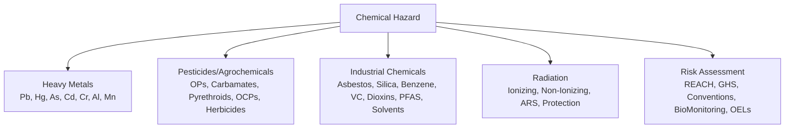

# Environmental Medicine — Chemical Hazards & Toxicology

**Parent Topic:** [Environmental Medicine MOC](../Environmental%20Medicine%20MOC.md)  
**Status:** `full-fcps-mrcp-note`  
**Priority:** ⭐⭐⭐ HIGHEST (FCPS/MRCP — Heavy metals, Pesticides, POPs, Radiation, Occupational Chemicals, Risk Assessment)  
**Source:** Davidson 24th Ed Ch 9; WHO/IPCS; IARC; ACGIH; CPIC; FCPS/MRCP Syllabus

---

## 🎯 Learning Objectives
- [ ] Identify **heavy metal toxicity** (Pb, Hg, As, Cd, Cr, Al) — kinetics, target organs, chelation
- [ ] Recognise **pesticide/agrochemical toxicity** (OPs, Carbamates, Pyrethroids, OCPs, Herbicides)
- [ ] Identify **industrial chemical hazards** (Asbestos, Silica, Benzene, Vinyl Chloride, Dioxins, PFAS, Solvents)
- [ ] Understand **radiation hazards** (Ionizing, Non-ionizing, ARS, Protection)
- [ ] Apply **chemical risk assessment** (REACH, GHS, Conventions, Biological Monitoring, OELs)
- [ ] Answer viva: "Lead poisoning" and "Organophosphate poisoning" and "Asbestos diseases" and "Radiation protection"

---

## 🧠 Core Concept: Chemical Hazard Framework



---

## 1️⃣ Heavy Metals — Kinetics, Toxicity & Chelation

### Lead (Pb)

| Property | Detail |
|----------|--------|
| **Sources** | Leaded Petrol (Historical), Paint, Batteries, Smelting, Mining, Ceramics, Cosmetics, Traditional Medicines, Contaminated Water/Food |
| **Absorption** | **Inhalation** (~40%), **Ingestion** (10-15% adults, 40-50% children), **Dermal** (Minor, Organic Pb) |
| **Distribution** | Blood (99% RBC-bound), Soft Tissue (Liver, Kidney), **Bone** (90% Body Burden, Half-life 20-30y) |
| **Excretion** | Renal (Primary), Biliary, Sweat, Hair, Nails, Breast Milk |
| **Biomarkers** | **Blood Pb** (Recent Exposure), **ZPP** (Zinc Protoporphyrin — Effect), **ALAD** (δ-ALA Dehydratase Activity), Urine Pb (Post-Chelation), Bone Pb (XRF — Body Burden) |

### Lead Toxicity — Clinical Features

| System | Manifestations |
|--------|----------------|
| **Neurological** | **Encephalopathy** (Children >70 µg/dL), **Peripheral Neuropathy** (Wrist/Foot Drop — Adults), **Cognitive Deficit** (↓ IQ, ADHD — Children <10 µg/dL), Behavioural Problems |
| **Haematological** | **Microcytic Hypochromic Anaemia** (↓ ALAD → ↑ ALA, ↓ Haem Synthesis), Basophilic Stippling, Sideroblastic Anaemia |
| **Renal** | **Proximal Tubular Dysfunction** (Fanconi Syndrome — Aminoaciduria, Glycosuria, Phosphaturia), Chronic Interstitial Nephritis, Hypertension |
| **Cardiovascular** | Hypertension, IHD, PVD |
| **Reproductive** | Reduced Fertility, Spontaneous Abortion, ↓ Sperm Count, Preterm Birth |
| **Gastrointestinal** | **Lead Colic** (Severe Abdominal Pain), Constipation, Anorexia |
| **Other** | **Blue Lines** (Gums — Burton's Line), Wrist/Foot Drop, **Lead Lines** (Metaphyses — X-Ray) |

> **Children**: **Blood Lead >5 µg/dL** (CDC Reference) → Action; **>45 µg/dL** → Chelation; **>70 µg/dL** → Encephalopathy Risk  
> **Adults**: **>40 µg/dL** → Occupational Removal; **>80 µg/dL** → Chelation

### Lead Chelation

| Chelator | Indication | Dose | Monitoring |
|----------|------------|------|------------|
| **CaNa₂EDTA** | **Severe** (BLL >70 µg/dL, Encephalopathy) | 50 mg/kg/d IV ÷ 2-3 doses × 5d | Renal Function, ECG, Zinc/Copper, Urine Pb |
| **DMSA (Succimer)** | **Moderate-Severe** (BLL 45-70), Oral | 10 mg/kg q8h x5d → q12h × 14d | LFT, CBC, Urine Pb |
| **DMPS** | Alternative to DMSA | 300mg IV/PO q8h | Similar |
| **Penicillamine** | Chronic, Mild | 250-500mg TDS/qid | WBC, U/A, Proteinuria, Pyridoxine |

---

### Mercury (Hg)

| Form | Source | Kinetics | Target |
|------|--------|----------|--------|
| **Elemental (Hg⁰)** | Thermometers, Amalgams, Gold Mining (ASGM), Fluorescent Lamps | Inhalation (80% Absorbed) → Lipophilic → CNS | CNS (Tremor, Psychosis), Kidney |
| **Inorganic (Hg²⁺)** | Skin Lightening Creams, Folk Remedies, Disinfectants | Ingestion (7-15%) → Kidney Accumulation | Kidney (Nephrotic Syndrome), GI |
| **Organic (Methylmercury)** | **Fish/Seafood** (Bioaccumulation), Rice (Paddy Fields) | **95% GI Absorption** → Demethylation → CNS | **Fetal Brain** (Neurodevelopment), Adult CNS |

### Mercury Toxicity

| Form | Clinical Features |
|------|-------------------|
| **Elemental/Inorganic** | **Acute**: Pneumonitis, Gingivostomatitis, Acrodynia (Pink Disease — Children), Proteinuria, Nephrotic Syndrome <br> **Chronic**: **Erethism** (Irritability, Tremor, Insomnia, Memory Loss), **Tremor** (Intention), Proteinuria, Nephrotic Syndrome |
| **Methylmercury (Minamata Disease)** | **Fetal/Infant**: **Neurodevelopmental Delay** (↓ IQ, Motor, Language, Visual), Cerebral Palsy, Seizures, Blindness, Deafness <br> **Adult**: Ataxia, Dysarthria, Constricted Visual Fields (Tunnel Vision), Hearing Loss, Paraesthesia |

> **Prenatal Exposure**: Maternal Fish Consumption → **Fetal Brain** — **↓ IQ, Motor, Language, Attention** (Dose-Dependent, No Threshold)

### Mercury Management

| Scenario | Management |
|----------|------------|
| **Acute Elemental Inhalation** | **Supportive**, Chelation (DMPS, DMSA — Limited Evidence) |
| **Inorganic Ingestion** | **DMPS/DMSA** (Chelation) |
| **Methylmercury** | **No Effective Chelation** — **Source Avoidance** (Pregnancy: Avoid High-Hg Fish), Selenium Supplementation (Experimental) |
| **Elemental Spill** | Ventilation, **No Vacuuming** (Aerosolizes), Mercury Spill Kit, Sulphur/Zinc Powder |

> **Fish Consumption Advice (Pregnancy)**: **Avoid** Shark, Swordfish, Marlin, King Mackerel, Tilefish; **Limit** Tuna (Albacore 6oz/wk, Light 12oz/wk); **Low Hg**: Salmon, Shrimp, Tilapia, Cod

---

### Arsenic (As)

| Aspect | Detail |
|--------|--------|
| **Forms** | **Inorganic** (As³⁺ Arsenite, As⁵⁺ Arsenate) — **Toxic**; Organic (Seafood) — Low Toxicity |
| **Sources** | Groundwater (Geogenic — Bengal Basin, Argentina, Chile, Taiwan), Mining, Smelting, Pesticides (Historical), Wood Preservatives (CCA), Traditional Medicines |
| **Absorption** | Inhalation (Occupational), **Ingestion** (Water, Food — Rice), Dermal (Minor) |
| **Metabolism** | Inorganic As → **Methylation** (Liver) → MMA (Monomethylarsonic) → DMA (Dimethylarsinic) → Urinary Excretion |
| **Toxicity** | **Acute**: GI (Vomiting, Diarrhoea, Pain), **Encephalopathy**, **Cardiovascular Collapse**, QT Prolongation <br> **Chronic (Arsenicosis)**: **Skin** (Hyperkeratosis Palms/Soles, Hyperpigmentation "Raindrop", Mees Lines), **Cancer** (Skin SCC/BCC, Bladder, Lung, Liver), **Vascular** (Blackfoot Disease — PVD, Gangrene), **Neurological** (Peripheral Neuropathy), **Other**: Diabetes, Hepatomegaly, Portal HTN, Renal, Anaemia |

### Arsenic Carcinogenicity
| Cancer | Latency | Evidence |
|--------|---------|----------|
| **Skin** (SCC, BCC, Bowen's) | 10-20 Years | Sufficient (IARC Group 1) |
| **Bladder** | 20-30 Years | Sufficient |
| **Lung** | 15-30 Years | Sufficient |
| **Liver (Angiosarcoma)** | Rare | Limited |
| **Kidney** | — | Limited |

### Arsenic Management
| Aspect | Detail |
|--------|--------|
| **Water Standard** | **WHO: 10 µg/L** (Provisional); **Many Countries: 50 µg/L** |
| **Removal** | **Fe/Al Coagulation**, **Adsorption** (Activated Alumina, TiO₂, Fe-Oxide), **RO**, **Ion Exchange**, **Oxidation + Filtration** |
| **Chelation** | **DMPS/DMSA** (Acute), **BAL (Dimercaprol)** — Limited Chronic Evidence |
| **Nutritional** | **Folate** (Enhances Methylation), **Selenium**, **Protein**, **Antioxidants** (Vit C/E, Selenium) |
| **Surveillance** | Skin, Bladder, Lung Cancer (q6-12m), BP, Nerve Conduction |

---

### Cadmium (Cd)

| Aspect | Detail |
|--------|--------|
| **Sources** | Phosphate Fertilisers, Sewage Sludge, **Battery Manufacturing**, Zn Smelting, **Cigarette Smoke** (Major Non-Occupational), NiCd Batteries |
| **Absorption** | Inhalation (10-50%), Ingestion (5-10%), **Tobacco Smoke** (High Absorption) |
| **Kinetics** | **Long Half-Life (10-30 Years)** — Kidney Cortex Accumulation, Metallothionein Binding |
| **Target Organs** | **Kidney** (Proximal Tubule → Proteinuria, β2-Microglobulin, NAG, Aminoaciduria), **Bone** (Osteomalacia — **Itai-Itai Disease**), **Lung** (Cancer), **Prostate** (Cancer) |
| **Biomarkers** | **Urinary Cd** (Recent Exposure), **Blood Cd** (Recent + Body Burden), **β2-Microglobulin/NAG** (Renal Effect) |
| **Management** | **Source Reduction**, Smoking Cessation, **No Effective Chelation** (Cd-MT Complex Stable), Nutritional (Zn, Fe, Ca, Protein) |

---

### Other Metals

| Metal | Key Features |
|-------|--------------|
| **Chromium (Cr VI)** | **Carcinogen** (Lung Ca, Nasal Sinus Ca), Ulceration (Nasal Septum, Skin), Sensitisation (Allergic Contact Dermatitis), Renal |
| **Aluminium** | Dialysis Dementia (Historical), Encephalopathy (PN, TPN), Osteomalacia, Microcytic Anaemia, Neurotoxicity (ALS Link Controversial) |
| **Manganese** | **Manganism** (Parkinsonism — Rigidity, Tremor, Gait, Psychiatric), Welders, Miners |
| **Thallium** | **Acute**: GI, Neuropathy (Severe Pain), Alopecia (Alopecia Totalis), Mees Lines, Autonomic Instability; **Antidote**: Prussian Blue |
| **Barium** | Hypokalaemia (↑ K⁺ Channel Block), Paralysis, Arrhythmia, Paralysis |

---

## 2️⃣ Pesticides & Agrochemicals

### Organophosphates (OPs)

| Feature | Detail |
|--------|--------|
| **Examples** | Malathion, Parathion, Chlorpyrifos, Diazinon, Dichlorvos, Dichlorvos, Methamidophos, Monocrotophos |
| **Mechanism** | **Irreversible AChE Inhibition** → Acetylcholine Accumulation → Cholinergic Crisis |
| **Phases** | **Acute Cholinergic** (SLUDGE: Salivation, Lacrimation, Urination, Defecation, GI Cramping, Emesis; Miosis, Bronchorrhoea, Bradycardia, Bronchospasm, Fasciculation, Weakness, Convulsions, Coma) <br> **Intermediate Syndrome (IMS)**: 24-96h — **Proximal Weakness** (Neck Flexors, Respiratory Muscles), Cranial Nerve Palsies, **Respiratory Failure** <br> **OPIDP** (Organophosphate-Induced Delayed Polyneuropathy): 2-3 Weeks — **Distal Sensorimotor Polyneuropathy** (NTE Inhibition) |
| **Carbamates** | Carbaryl, Aldicarb, Carbofuran, Propoxur — **Reversible** AChE Inhibition, Shorter Duration, Less IMS/OPIDP |

### OP Poisoning Management
| Step | Action |
|------|--------|
| **1. Decontamination** | Remove Clothes, Wash Skin, **Gastric Lavage** (if <1h, Protected Airway), **Activated Charcoal** |
| **2. Atropine** | **IV 1-2mg Bolus**, Repeat q5-10min until **Atropinisation** (Dry Mouth, Pupil Dilatation, HR >80, Dry Skin), **Maintain** (Infusion) |
| **3. Pralidoxime (2-PAM)** | **1-2g IV Bolus** → **Infusion 0.5-1g/hr** (Reactivate AChE) — **Early (<24-48h)** |
| **4. Supportive** | **Ventilation** (IMS/Respiratory Failure), **Seizure Control** (Diazepam/Midazolam), **Fluids**, **Antibiotics** (Aspiration Pneumonia), **Monitor** (ECG, ABG, ChE Activity) |

> **Key**: **Atropine First (Life-Saving)**, Pralidoxime Early; **Atropine Dose to Effect** (Not Fixed Dose); **No Pralidoxime for Carbamates** (Reversible Binding).

---

### Other Pesticide Classes

| Class | Examples | Mechanism | Key Toxicity |
|-------|----------|-----------|--------------|
| **Carbamates** | Carbaryl, Aldicarb, Carbofuran, Propoxur, Methomyl | Reversible AChE Inhibition | **Self-Limiting** (Spontaneous Reactivation), Less Severe than OP |
| **Pyrethroids** | Permethrin, Cypermethrin, Deltamethrin, Lambda-Cyhalothrin | Na⁺ Channel Modulation (Prolonged Opening) | **Paraesthesia** (Transient), **Seizures** (High Dose), Low Mammalian Toxicity |
| **Organochlorines (OCPs)** | **DDT, Dieldrin, Aldrin, Endrin, Heptachlor, Chlordane, Endosulfan, Lindane** | GABA Antagonism, Na⁺ Channel | **Persistent**, Bioaccumulation, **Endocrine Disruption**, Carcinogenic (DDT: Group 2A), Neurotoxicity |
| **Neonicotinoids** | Imidacloprid, Clothianidin, Thiamethoxam, Acetamiprid | nAChR Agonism | **Bee Toxicity**, Potential Neurodevelopmental (Emerging) |
| **Herbicides** | **Paraquat** (Lung Fibrosis, Fatal), **Glyphosate** (Probable Carcinogen), **2,4-D** | Various | Paraquat: **Pulmonary Fibrosis** (Fatal), No Antidote; Glyphosate: Controversial |

---

## 3️⃣ Persistent Organic Pollutants (POPs)

| Compound | Source | Half-Life | Health Effects | Convention |
|----------|--------|-----------|----------------|------------|
| **DDT/DDE** | Malaria Control, Agriculture | Years-Decades | Endocrine Disruption, Carcinogenicity (Breast, Liver), Neurodevelopmental | **Stockholm Convention** (Restricted) |
| **PCBs** | Transformers, Capacitors, Hydraulic Fluids | Years-Decades | **Neurodevelopmental**, Carcinogenic (Liver, Melanoma), Immunotoxicity, Endocrine | Stockholm |
| **Dioxins (PCDDs)** | Incineration, Metal Smelting, Bleaching | Years | **TCDD (2,3,7,8-TCDD)**: Chloracne, Carcinogen (All Cancers), Endocrine, Immune | Stockholm |
| **Furans (PCDFs)** | Similar to Dioxins | Years | Similar | Stockholm |
| **HCB** | Fungicide, Byproduct | Years | Porphyria Cutanea Tarda, Endocrine, Immunotoxic | Stockholm |
| **PBDEs** | Flame Retardants | Years | Neurodevelopmental, Endocrine, Thyroid | Stockholm |

### Dioxin (TCDD) — Seveso Disaster
| Feature | Detail |
|---------|--------|
| **Mechanism** | **AhR Activation** → Gene Transcription Dysregulation |
| **Acute** | Chloracne (Hallmark), Liver Enlargement, Peripheral Neuropathy |
| **Chronic** | **Cancer** (All Sites), **Endocrine Disruption** (Thyroid, Reproductive), **Immunotoxicity**, **Metabolic Syndrome**, **Developmental Neurotoxicity** |
| **Biomarker** | **Serum TCDD** (Long Half-Life ~7-11 Years) |

---

## 3️⃣ Industrial Chemicals

### Asbestos

| Type | Fibre | Disease |
|------|-------|---------|
| **Serpentine** | Chrysotile (White) — **Most Used** | Asbestosis, Mesothelioma, Lung Cancer, Pleural Plaques |
| **Amphibole** | Crocidolite (Blue), Amosite (Brown), Tremolite, Actinolite, Anthophyllite | **Higher Mesothelioma Potency** |

| Disease | Latency | Key Features |
|---------|---------|--------------|
| **Asbestosis** | 15-30y | **Basilar Fibrosis**, **Pleural Plaques**, Restrictive Pattern, ↓ DLCO, Crackles, Clubbing |
| **Mesothelioma** | 20-50y | **Pleural** (90%) / Peritoneal, **Poor Prognosis** (Median 12m), Biphasic/Epithelioid/Sarcomatoid |
| **Lung Cancer** | 15-35y | **Synergy with Smoking** (Multiplicative), Adenocarcinoma Common |
| **Pleural Plaques** | 20y+ | **Benign**, Marker of Exposure, **Calcified** (Chest X-Ray/CT) |

> **Diagnosis**: Exposure History + Radiology + Lung Function + Biopsy (Mesothelioma)  
> **Compensation**: Industrial Injuries Disablement Benefit (UK), Workers' Compensation

### Silica (Crystalline — Quartz, Cristobalite, Tridymite)

| Disease | Features |
|---------|----------|
| **Silicosis** | **Chronic** (10-30y), **Accelerated** (5-10y), **Acute** (Silicoproteinosis <5y); **Eggshell Calcification** (Hilar Nodes), **Progressive Massive Fibrosis (PMF)**, **Silicotuberculosis** (Risk ↑ 3-30x), Autoimmune (SLE, RA, SSc, ANCA Vasculitis) |
| **Diagnosis** | Exposure History + **HRCT** (Nodules, PMF, Eggshell Calcification) + Spirometry (Restrictive) |
| **Prevention** | **Wet Drilling**, **LEV**, **Respirators** (PAPR), **Medical Surveillance** (CXR/HRCT, Spirometry q1-3y) |

### Benzene

| Feature | Detail |
|---------|--------|
| **Exposure** | Petrochemical, Rubber, Shoe, Printing, Gasoline, Tobacco Smoke |
| **Metabolism** | **CYP2E1** → Benzene Oxide → Muconic Acid, Phenylmercapturic Acid (Biomarkers) |
| **Toxicity** | **Acute**: CNS Depression, Arrhythmia; **Chronic**: **Aplastic Anaemia**, **AML** (MDS → AML), **Leukaemia** (ALL, AML, CLL), Lymphoma, **Aplastic Anaemia** (Pancytopenia, Marrow Hypoplasia) |
| **Biomarkers** | Urinary **t,t-MA**, **S-PMA**, Blood Benzene |
| **Exposure Limit** | **OSHA: 1 ppm (TWA), 5 ppm (STEL)**; **EU: 1 ppm** |

### Other Key Industrial Chemicals

| Chemical | Target Organ | Disease | Limit |
|---------|--------------|---------|-------|
| **Vinyl Chloride** | Liver | **Angiosarcoma** (Rare), Cirrhosis, Raynaud's | **OSHA: 1 ppm** |
| **Trichloroethylene (TCE)** | Liver, Kidney, CNS | **Renal Cell Ca**, Parkinsonism, Scleroderma-like | **TWA 10 ppm** |
| **Perchloroethylene (Perc)** | Liver, CNS | **Lymphoma**, Dry Cleaning | **TWA 25 ppm** |
| **Formaldehyde** | Nasal Mucosa, Lung | **Nasopharyngeal Ca**, Leukaemia, Sensitisation | **0.1 ppm** |
| **Dioxins/Furans (PCDD/PCDF)** | Endocrine, Immune, Skin | **Chloracne, Cancer, Diabetes**, Endocrine Disruption | **TEQ** (Toxic Equivalency) |
| **PFAS (PFOA, PFOS)** | Liver, Thyroid, Immune, Developmental | **Testicular/Kidney Ca, Ulcerative Colitis, Thyroid Dysfunction, ↓ Vaccine Response** | **EPA: 4 ppt (PFOA+PFOS)** |

---

## 4️⃣ Radiation Hazards

### Ionizing Radiation

| Type | Source | Penetration | Measurement |
|------|--------|-------------|-------------|
| **α (Alpha)** | Radon, Uranium, Polonium | Low (Paper) | Internal Hazard |
| **β (Beta)** | Sr-90, I-131, Cs-137 | Few mm (Aluminium) | Skin, Internal |
| **γ (Gamma)** | Co-60, Cs-137, Cs-137, X-ray | High (Lead, Concrete) | Deep, Whole Body |
| **Neutron** | Reactors, Weapons | High | High RBE |

### Units & Limits (ICRP)

| Quantity | Unit | Occupational Limit | Public Limit |
|----------|------|-------------------|--------------|
| **Effective Dose** | **Sievert (Sv)** | **20 mSv/yr** (5-yr avg), **50 mSv/yr** max | **1 mSv/yr** |
| **Equivalent Dose** | **Sievert (Sv)** | **Eye: 150 mSv/yr**, **Skin: 500 mSv/yr** | **Eye: 15 mSv**, **Skin: 50 mSv** |
| **Absorbed Dose** | **Gray (Gy)** | — | — |
| **Activity** | **Becquerel (Bq)** | — | — |

> **ALARA**: **As Low As Reasonably Achievable** — Optimisation Principle

### Acute Radiation Syndrome (ARS)

| Syndrome | Dose | Onset | Key Features | Mortality |
|----------|------|-------|--------------|-----------|
| **Haematopoietic** | 1–6 Gy | Days-Weeks | **Pancytopenia** (Infection, Bleeding), GI Symptoms | 0-50% (Supportive) |
| **Gastrointestinal** | 6–20 Gy | Hours-Days | **N/V/D, Mucosal Denudation**, Sepsis, Electrolyte Imbalance | High |
| **CNS/CV** | >20 Gy | Minutes-Hours | **Neurological Collapse**, CV Collapse, Death | 100% |

> **Prodromal Phase**: N/V (Dose-Dependent Latency/Severity) → **Latent Period** → Manifest Illness

### Radiation Protection

| Principle | Application |
|---------|-------------|
| **Justification** | Benefit > Risk |
| **Optimisation (ALARA)** | As Low As Reasonably Achievable — Time, Distance, Shielding |
| **Dose Limitation** | Dose Limits (Occupational/Public) |
| **Protection** | **Time** (Minimise), **Distance** (Inverse Square Law), **Shielding** (Pb, Concrete, Water), **Containment** (Glove Box, Fume Hood) |

### Medical Radiation

| Modality | Typical Effective Dose |
|----------|------------------------|
| **CXR** | 0.1 mSv |
| **CT Head** | 2 mSv |
| **CT Chest** | 7 mSv |
| **CT Abdomen/Pelvis** | 10-15 mSv |
| **Coronary Angio** | 10-20 mSv |
| **PET-CT** | 25 mSv |
| **Interventional Fluoro** | Variable (High) |

> **Justification** for Every Scan — **ALARA**, Pregnancy Check, Shielding

### Non-Ionizing Radiation

| Type | Source | Biological Effect | Protection |
|---------|--------|-------------------|------------|
| **UV (A/B/C)** | Sun, Sunbeds, Welding | **Skin Cancer** (BCC, SCC, Melanoma), **Cataracts**, **Photoageing**, Immunosuppression | Sunscreen (SPF30+), Clothing, Shade, Sunglasses |
| **IR** | Furnaces, Lasers | Thermal Burns, Cataracts | Shields, Distance |
| **Microwave/RF** | Radar, Microwave Ovens, Mobile Phones, 5G | **Thermal Effects** (Heating), **Non-Thermal** (Controversial — IARC 2B) | Abstand, Shielding, Power Limits |
| **Laser** | Medical, Industrial, Pointers | **Retinal Burns**, Skin Burns | **Class 1-4**, Eye Protection (OD), Interlocks |

---

## 5️⃣ Chemical Risk Assessment & Management

### International Conventions

| Convention | Scope | Key Provisions |
|----------|-------|--------------|
| **REACH** (EU) | Registration, Evaluation, Authorisation, Restriction of Chemicals | **No Data, No Market**, SVHC List, Authorisation, Restrictions |
| **GHS** (UN) | Globally Harmonized System | Classification, Labelling (Pictograms, H/P Statements), SDS (16 Sections) |
| **Stockholm Convention** | POPs (DDT, PCBs, Dioxins, PFAS, New Additions) | **Elimination/Restriction**, Alternatives, Stockpiles, Waste |
| **Rotterdam Convention** | PIC (Prior Informed Consent) | Hazardous Chemicals Trade |
| **Basel Convention** | Transboundary Hazardous Waste Movement | Prior Informed Consent, Ban Export to Non-OECD |
| **Minamata Convention** | Mercury | Phase-Down Dental Amalgam, Phase-Out Mining, Products, Emissions |
| **ILO C170** | Chemicals Convention | Classification, Labelling, SDS, Worker Rights |

### Biological Monitoring (Occupational)

| Substance | Biomarker | Matrix | Action Level |
|---------|-----------|--------|--------------|
| **Lead** | Blood Pb | Blood | **>30 µg/dL** (Action), **>50** (Removal) |
| **Mercury** | Urinary Hg | Urine | **>35 µg/g Cr** |
| **Cadmium** | Blood/Urinary Cd | Blood/Urine | **B-Cd >5 µg/L; U-Cd >5 µg/g Cr** |
| **Arsenic** | Urinary Inorganic As+MMA+DMA | Urine | **>35 µg/g Cr** |
| **Chromium VI** | Urinary Cr | Urine | **>10 µg/g Cr** |
| **Benzene** | t,t-MA, S-PMA | Urine | **t,t-MA >500 µg/g Cr** |
| **Toluene** | Hippuric Acid, o-Cresol | Urine | — |
| **Organophosphates** | **RBC Cholinesterase** | Blood | **<70% Baseline** |
| **Cotinine** | Urinary Cotinine | Urine | **Tobacco Exposure** |

### Occupational Exposure Limits (OELs)

| Standard | Body | Example |
|----------|------|--------|
| **TLV-TWA** | ACGIH | **Benzene 0.5 ppm**, **Asbestos 0.1 f/cc** |
| **TLV-STEL** | ACGIH | Short-Term Exposure Limit (15 min) |
| **PEL** | OSHA (USA) | **Benzene 1 ppm**, **Asbestos 0.1 f/cc** |
| **IOELV** | EU (SCOEL) | Binding/OELV (Legal), Indicative OELV |
| **WEL** | UK (HSE) | **Workplace Exposure Limits** (EH40) |

---

## ⚡ FCPS/MRCP High-Yield Summary

| Topic | Key Points |
|-------|------------|
| **Lead** | **Neurodevelopmental** (Children), **Anaemia**, **Nephropathy**, **Hypertension** — **Chelation**: CaNa₂EDTA (Severe), **DMSA** (Oral), **Penicillamine** |
| **Mercury** | **Elemental** (Inhalation → CNS), **Inorganic** (Kidney), **Methylmercury** (Fish → **Fetal Neurodevelopmental Toxicity**) — **No Effective Chelation for MeHg** |
| **Arsenic** | **Skin** (Hyperkeratosis, Raindrop), **Cancer** (Skin, Bladder, Lung), **Vascular** (Blackfoot), **Neuropathy** — **Water Standard 10 µg/L**, **Chelation: DMPS/DMSA** |
| **Cadmium** | **Kidney** (Proximal Tubule → β2-MG, Proteinuria), **Bone** (Itai-Itai), **Lung/Prostate Ca** — **No Chelation**, Smoking Cessation |
| **Organophosphates** | **AChE Inhibition** → **Cholinergic (SLUDGE), IMS, OPIDP** — **Atropine + Pralidoxime**, Supportive |
| **Carbamates** | **Reversible AChE Inhibition** — **Atropine** (Pralidoxime Contraindicated) |
| **Pyrethroids** | Na⁺ Channel Modulation → **Paraesthesia, Seizures** — Supportive |
| **Organochlorines** | **Persistent, Bioaccumulative, Endocrine Disruptors** (DDT, Dieldrin, Lindane) |
| **Asbestos** | **Mesothelioma, Lung Ca, Asbestosis** — Latency 20-50y, **Synergy with Smoking** |
| **Silica** | **Silicosis** (Nodular Fibrosis, PMF), **TB**, **Autoimmune** — **DEB Test**, Prevention (Wet, LEV, Respirator) |
| **Benzene** | **AML, Aplastic Anaemia** — **Metabolism → CYP2E1**, Biomarkers (t,t-MA, S-PMA) |
| **Radiation** | **ARS** (1-6 Gy Haematopoietic, 6-20 GI, >20 CNS/CV) — **ALARA**, Deterministic vs Stochastic |
| **Risk Assessment** | **REACH, GHS, Stockholm, Rotterdam, Basel, Minamata** — **Biological Monitoring**, **OELs** (TLV, PEL, WEL) |

---

## 🎤 Viva Questions (Expected Answers)

| # | Question | Expected Answer |
|---|----------|-----------------|
| 1 | Lead poisoning — clinical features in a child? | **Encephalopathy**, **Peripheral Neuropathy** (Foot Drop), **Anaemia** (Microcytic, Basophilic Stippling), **Abdominal Colic**, **Lead Lines** (Metaphyses), **Blue Gum Line** (Burton's Line) |
| 2 | Lead poisoning — when to chelate? | **BLL >45 µg/dL (Child)** or **>70 µg/dL (Encephalopathy)** → **CaNa₂EDTA**; **45-69 µg/dL** → Oral **DMSA**; **>70** → **IV CaNa₂EDTA** |
| 3 | Organophosphate poisoning — management? | **1. Decontamination**, **2. Atropine** (Titrate to Atropinisation: Dry Mouth, HR>80, Pupils Dilated), **3. Pralidoxime 1-2g IV Bolus → Infusion 0.5-1g/hr** (Within 24-48h), **4. Supportive** (Ventilation, Seizure Control) |
| 4 | Atropine vs Pralidoxime in OP poisoning? | **Atropine** = Muscarinic Antagonist (Life-Saving, Titrate to Effect); **Pralidoxime** = ChE Reactivator (Nicotinic), **Early** (<48h), **Does Not Cross BBB** |
| 5. Chronic Arsenicosis — clinical features? | **Skin**: Hyperkeratosis (Palms/Soles), Hyperpigmentation (Raindrop), Mees Lines; **Cancer**: Skin, Bladder, Lung; **Vascular**: Blackfoot Disease, Peripheral Neuropathy |
| 6. Benzene — haematological toxicity? | **Aplastic Anaemia** (Pancytopenia), **AML/MDS**, Leukaemia — **Metabolites** (Benzene Oxide, Muconic Acid) → BM Toxicity; **Biomarkers**: t,t-MA, S-PMA |
| 7. Benzene Exposure Limit — OSHA? | **1 ppm (TWA)**, **5 ppm (STEL)** — **Behavioural**: No Eating/Drinking/Smoking in Work Area |
| 8. Asbestosis vs Mesothelioma — difference? | **Asbestosis**: Interstitial Fibrosis, Pleural Plaques, Restrictive Pattern, **Latency 15-30y**; **Mesothelioma**: Pleural/Peritoneal Malignancy, **Latency 20-50y**, Prognosis Poor |
| 9. Radiation — Deterministic vs Stochastic Effects? | **Deterministic**: Threshold (Skin Erythema, Cataract, Sterility, ARS) — Severity ↑ with Dose; **Stochastic**: No Threshold (Cancer, Hereditary), Probability ↑ with Dose |
| 10. Acute Radiation Syndrome — Haematopoietic Syndrome Dose & Management? | **1-6 Gy** → **Pancytopenia** (Infection, Bleeding) → **Supportive** (G-CSF, Antibiotics, Platelets, RBC, Hygiene) → **Survival Possible** |

---

## 🧩 Confusions & Mnemonics

| Confusion | Clarification |
|-----------|---------------|
| **"Lead Chelation = Always EDTA"** | **NO.** **DMSA (Oral)** for Moderate (45-69); **EDTA (IV)** for Severe (>70) or Encephalopathy; **Penicillamine** (Chronic, Oral) |
| **"Mercury Chelation Works for All Forms"** | **NO.** **Methylmercury = NO Effective Chelation** — Prevention Only; Elemental/Inorganic = DMPS/DMSA |
| **"Arsenic Boiling = Removal"** | **NO.** **Boiling Concentrates Arsenic** — Use **Coagulation, Adsorption, RO, Ion Exchange** |
| **"All OP Poisoning = Atropine + Pralidoxime"** | **NO.** **Carbamates** = **Atropine Only** (Pralidoxime Contraindicated); **Organochlorines/Pyrethroids** = No Antidote |
| **"Asbestos = Only Mesothelioma"** | **NO.** **Asbestosis (Fibrosis), Lung Cancer (Synergy Smoking), Pleural Plaques** — All Asbestos-Related |
| **"Silica = Only Silicosis"** | **NO.** Also **TB (3-30x), Autoimmune (SLE, RA, SSc, ANCA Vasculitis), Lung Cancer** |
| **"Benzene = Only Leukaemia"** | **NO.** Also **Aplastic Anaemia, MDS, Lymphoma, Multiple Myeloma** |
| **"Radiation = Only Cancer"** | **NO.** **Deterministic Effects** (Skin Erythema, Cataract, Gonadal Sterility, ARS) + **Stochastic** (Cancer, Hereditary) |
| **"Stochastic = Cancer Only"** | **NO.** Also **Hereditary Effects** (Genetic Mutations in Offspring) |
| **"ALARA = Zero Exposure"** | **NO.** **As Low As Reasonably Achievable** — Optimisation, Not Zero |
| **"Chelation = Cure for All Heavy Metals"** | **NO.** **Cd, Mn, Al, U** — **No Effective Chelation**; Prevention/Source Removal Only |

> **Mnemonic: CHEM TOX ESSENTIALS**  
> **C**helation: **Pb (EDTA/DMSA), Hg (DMSA/DMPS - No MeHg), As (DMSA/DMPS), Cd (None), As (DMPS/DMSA/BAL)**  
> **H**eavy Metals: **Pb (Neuro, Anaemia, Renal), Hg (Neuro, Renal), As (Skin, Cancer, Vascular), Cd (Renal, Bone)**  
> **E**xposure Routes: **Inhalation (Gases, Dust), Ingestion (Water, Food, Hands), Dermal (Lipophilic), Parenteral**  
> **M**ercury Forms: **Elemental (Inhaled), Inorganic (Kidney), Methyl (Fish, Fetal Neuro)**  
> **I**norganic vs Organic: **Inorganic = Toxic (As, Hg); Organic = Less Toxic (Seafood Hg), But MeHg = Toxic**  
> **C**arcinogens: **Asbestos, Silica, Benzene, As, Cd, Cr VI, Ni, Vinyl Chloride, Dioxins, PAHs, Aflatoxin**  
> **A**sbestos Diseases: **Pleural Plaques (Benign), Asbestosis (Fibrosis), Mesothelioma (Malignant), Lung Ca (Smoking Synergy)**  
> **L**ead: **Neuro (Child), Anaemia (ALAD), Renal, HTN, CV, Repro** → **Chelation: EDTA (IV), DMSA (Oral), Penicillamine**  
> **A**rsenic: **Skin (Raindrop, Hyperkeratosis), Cancer (Skin/Bladder/Lung), Vascular (Blackfoot), Neuropathy**  
> **D**DT/POPs: **Persistent, Bioaccumulative, Endocrine Disruptor** — Stockholm Convention  
> **D**ioxins: **TCDD (Seveso)** — Chloracne, Cancer, Endocrine, Immune → AhR Activation  
> **T**oxicology Principles: **Hazard ID → Dose-Response → Exposure → Risk Char** → **Risk Mgmt**  
> **O**ccupational: **Hierarchy (Elim > Sub > Eng > Admin > PPE)**, **TLV/PEL/WEL**, **BioMonitoring (Pb, Hg, Cd, Cr, Benzene, OP ChE)**  
> **X**enobiotics: **Metabolism (CYP, GST, NAT, UGT)** → **Activations/Detox** → **Genetic Polymorphisms (GSTM1, CYP2E1, NAT2, ALDH2)**  
> **I**onizing Radiation: **Deterministic (Threshold) vs Stochastic (No Threshold)**; **ALARA**  
> **C**hemical Risk: **REACH, GHS, Stockholm, Rotterdam, Basel, Minamata** — **BioMonitoring, OELs**  
> **A**cute Radiation Syndrome: **Haematopoietic (1-6Gy), GI (6-20Gy), CNS (>20Gy)** — Prodromal → Latent → Manifest  
> **L**ead Lines: **Metaphyses (X-Ray), Gum (Burton's Line)**  
> **M**ercury: **Elemental (Lungs/CNS), Inorganic (Kidney), Methyl (Fish/Fetal Brain)**  
> **E**xcretion: **Pb (Bile/Ur), Hg (Bile/Ur/Faeces), As (Ur - Inorg+MMA+DMA)**  
> **C**helation Contraindications: **MeHg No Chelation, OP Carbamates No Pralidoxime**  

---

## 🗺️ Mind Map

```mermaid
mindmap
  root((Chemical Hazards & Toxicology))
    Heavy Metals
      Pb: Neuro, Anaemia, Renal, CV
      Hg: Elemental (CNS), Inorganic (Kidney), Methyl (Fetal Neuro)
      As: Skin, Cancer, Vascular, Neuro
      Cd: Renal, Bone, Cancer
      Cr VI: Lung Ca, Sensitisation
      Al, Mn, Tl, Ba
    Pesticides
      OP: AChE Inhibit → Cholinergic/IMS/OPIDP → Atropine+Pralidoxime
      Carbamate: Reversible, Atropine Only
      Pyrethroid: Na+ Channel, Seizures
      OCP: Persistent, Endocrine, Cancer
      Herbicides: Paraquat (Lung Fibrosis), Glyphosate
    POPs
      DDT/DDE, PCBs, Dioxins (TCDD), HCB, PBDEs
      Stockholm Convention
    Industrial Chemicals
      Asbestos (Mesothelioma, Asbestosis, Lung Ca)
      Silica (Silicosis, TB, Autoimmune)
      Benzene (AML, Aplastic Anaemia)
      Vinyl Chloride (Angiosarcoma)
      Dioxins/Furans (AhR)
      PFAS (Cancer, Thyroid, Immune)
      Solvents (Benzene, TCE, Perc)
    Radiation
      Ionizing: ARS, Deterministic vs Stochastic, ALARA
      Non-Ionizing: UV (Skin Ca, Cataract), RF/EMF (Thermal/Non-Thermal)
    Risk Assessment
      REACH, GHS, Stockholm, Rotterdam, Basel, Minamata
      BioMonitoring: Pb, Hg, Cd, Cr, Benzene, OP
      OELs: TLV, PEL, WEL
```

---

## 📅 Spaced Repetition Tracker

| Review | Date | Score (0–5) | Notes |
|--------|------|-------------|-------|
| Day 1 | | | |
| Day 3 | | | |
| Day 7 | | | |
| Day 14 | | | |
| Day 30 | | | |
| Day 90 | | | |

---

## 📝 Self-Test Scorecard

| Section | Max | Score | % |
|---------|-----|-------|---|
| Heavy Metals (Pb, Hg, As, Cd, Cr) | 4 | | |
| Pesticides (OP, Carbamate, Pyrethroid, OCP, Herbicide) | 4 | | |
| POPs (DDT, PCBs, Dioxins, PFAS) | 3 | | |
| Industrial Chemicals (Asbestos, Silica, Benzene, Vinyl Chloride, Dioxins, PFAS) | 4 | | |
| Radiation (Ionizing/Non-Ionizing, ARS, Protection) | 3 | | |
| Risk Assessment & Management | 2 | | |
| **Total** | **20** | | |

---

## 💬 Exam Answer Modes

| Format | Prompt | Key Points |
|--------|--------|------------|
| **Long Essay** | "Describe the clinical features, diagnosis, and management of lead poisoning in children." | Sources, Absorption, Distribution, Toxicity (Neuro, Haem, Renal, CV, GI), Biomarkers (BLL, ZPP, ALAD), Chelation (EDTA, DMSA), Prevention, Screening |
| **Short Note** | "Organophosphate poisoning — mechanism and management." | AChE Inhibition → Cholinergic Crisis (SLUDGE), IMS, OPIDP; Atropine (Muscarinic), Pralidoxime (Nicotinic), Supportive |
| **Viva** | "Worker with chronic arsenic exposure. Skin hyperpigmentation, keratosis, neuropathy. Management?" | **Source Control**, **Alternative Water**, **Chelation** (DMPS/DMSA), **Nutritional** (Folate, Selenium), **Cancer Surveillance** (Skin, Bladder, Lung), **Family Screening** |
| **Ward Round** | "Worker in battery factory with tremor, insomnia, irritability, gingivitis. Urine Hg 50 µg/g Cr. Diagnosis & Management?" | **Elemental Mercury Poisoning** — **Remove from Exposure**, **Chelation** (DMPS/DMSA), **Supportive**, **Biological Monitoring**, **Workplace Assessment** |
| **Last-Night** | "Pb: Neuro/Anaemia/Renal/CV → EDTA/DMSA. Hg: Elemental(CNS)/Inorgan(Kid)/Methyl(Fetal Neuro) → DMSA/DMPS/No Chelation(MeHg). As: Skin/Cancer/Vascular/Neuro → DMSA/DMPS. Cd: Renal/Bone/Cancer → No Chelation. OP: SLUDGE/IMS/OPIDP → Atropine+Pralidoxime. Asbestos: Plaques/Asbestosis/Meso/LungCa. Benzene: AML/Aplastic. Radiation: Deterministic/Stochastic/ALARA. REACH/GHS/Stockholm." | Compressed. |

---

## 📌 Summary
- **Lead**: Neurodevelopmental (Children), Anaemia, Nephropathy, Hypertension — **Chelation**: EDTA/DMSA
- **Mercury**: Elemental (CNS), Inorganic (Kidney), **Methylmercury** (Fetal Neurotoxicity) — **No Chelation for MeHg**
- **Arsenic**: Skin (Hyperkeratosis, Raindrop), Cancer (Skin/Bladder/Lung), Vascular (Blackfoot), Neuropathy — **DMPS/DMSA**, Water Standard 10 µg/L
- **Cadmium**: Kidney (Proximal Tubule), Bone (Itai-Itai), Cancer — **No Chelation**
- **Organophosphates**: AChE Inhibition → **Cholinergic (SLUDGE), IMS, OPIDP** — **Atropine + Pralidoxime**
- **Carbamates**: Reversible AChE Inhibition — **Atropine Only** (Pralidoxime Contraindicated)
- **Asbestos**: Asbestosis, Mesothelioma, Lung Cancer — **Latency 20-50y**, Synergy with Smoking
- **Silica**: Silicosis (Nodular, PMF), TB Risk, Autoimmune — Prevention (Wet, LEV, Respirator)
- **Benzene**: AML, Aplastic Anaemia — **Metabolites (Benzene Oxide)**, Biomarkers (t,t-MA, S-PMA)
- **Radiation**: **Deterministic (Threshold)** vs **Stochastic (No Threshold)** — **ALARA**
- **Risk Assessment**: REACH, GHS, Stockholm, Rotterdam, Basel, Minamata — **Biomonitoring, OELs**
- **Key Antidotes**: **OP: Atropine+Pralidoxime**, **CN⁻: Hydroxocobalamin**, **CO: 100% O₂+HBOT**, **OP: Atropine Only**, **MetHg: Methylene Blue**, **CN⁻: Hydroxocobalamin**

---

## ❓ MCQs (10)

1. **Lead poisoning in child — when to chelate with IV EDTA?**  
   A. BLL >20 µg/dL  B. **BLL >70 µg/dL**  C. BLL >45 µg/dL  D. Any BLL >10 µg/dL  
   *Answer: B. IV CaNa₂EDTA for BLL >70 µg/dL or Encephalopathy.*

2. **Organophosphate poisoning — pralidoxime indication?**  
   A. All Cases  B. **Within 24-48h of Exposure**  C. Only Severe  D. Never with Atropine  
   *Answer: B. Early Administration (<48h) Reactivates AChE.*

3. **Mercury — which form has NO effective chelation?**  
   A. Elemental  B. Inorganic  C. **Methylmercury**  D. All Forms  
   *Answer: C. Methylmercury — No Effective Chelation; Prevention Only.*

4. **Arsenicosis — pathognomonic skin finding?**  
   A. Vitiligo  B. **Hyperkeratosis (Palms/Soles) + Hyperpigmentation (Raindrop)**  C. Vitiligo  D. Alopecia  
   *Answer: B. Hyperkeratosis (Palms/Soles) + Hyperpigmentation (Raindrop) + Mees Lines.*

5. **Benzene — haematological malignancy?**  
   A. CML  B. **AML / Aplastic Anaemia**  C. CLL  D. Hodgkin Lymphoma  
   *Answer: B. Benzene → AML, Aplastic Anaemia (Also MDS, Lymphoma).*

6. **Asbestosis vs Mesothelioma — key difference?**  
   A. Both Malignant  B. **Asbestosis = Fibrosis (Benign); Mesothelioma = Malignant**  C. Same  D. Asbestosis = Malignant  
   *Answer: B. Asbestosis = Pulmonary Fibrosis; Mesothelioma = Malignant Neoplasm.*

7. **Silicosis — radiology hallmark?**  
   A. Honeycombing  B. **Eggshell Calcification of Hilar Nodes**  C. Cavitation  D. Pleural Effusion  
   *Answer: B. Eggshell Calcification of Hilar Lymph Nodes = Classic for Silicosis.*

7. **Organophosphate vs Carbamate — Pralidoxime Use?**  
   A. Both  B. **OP Only (Carbamate: Contraindicated)**  C. Carbamate Only  D. Neither  
   *Answer: B. Carbamate = Reversible AChE Inhibition → Pralidoxime Contraindicated.*

9. **Radiation — Stochastic Effect?**  
   A. Cataract  B. **Cancer / Hereditary Effects**  C. Skin Erythema  D. Sterility  
   *Answer: B. Stochastic = No Threshold, Probability ∝ Dose (Cancer, Hereditary).*

10. **ALARA Principle — Meaning?**  
    A. Zero Exposure  B. **As Low As Reasonably Achievable (Optimisation)**  C. Dose Limit  C. Shielding Only  
    *Answer: B. Optimisation of Protection (Time, Distance, Shielding).*

---

## 📋 SBAs (10)

1. **3-year-old with pica, living near battery recycling plant. Blood Lead 65 µg/dL. Management?**  
   A. Oral DMSA  B. **IV CaNa₂EDTA**  C. Oral Penicillamine  D. Observation  
   *Answer: B. BLL >70 µg/dL → IV CaNa₂EDTA (Chelation).*

2. **Farmer developed excessive salivation, bronchorrhoea, miosis, bradycardia after spraying pesticide. Drug of choice?**  
   A. Pralidoxime  B. **Atropine**  C. Physostigmine  D. Diazepam  
   *Answer: B. Atropine (Muscarinic Antagonist) — First Line for Cholinergic Crisis.*

3. **Chronic arsenicosis — characteristic skin lesions?**  
   A. Vitiligo  B. **Hyperkeratosis (Palms/Soles) + Hyperpigmentation (Raindrop)**  C. Urticaria  D. Alopecia  
   *Answer: B. Hyperkeratosis + Hyperpigmentation (Raindrop) + Mees Lines.*

4. **Benzene exposure — which malignancy most associated?**  
   A. CML  B. **AML / Aplastic Anaemia**  C. CLL  D. Hodgkin Lymphoma  
   *Answer: B. Benzene → AML / Aplastic Anaemia (Also MDS, Lymphoma).*

5. **Worker with chronic Mercury exposure. Tremor, insomnia, irritability. Urine Hg 50 µg/g Cr. Chelation?**  
   A. DMPS/DMSA  B. **DMPS/DMSA (Elemental/Inorganic Hg)**  C. No Chelation  D. EDTA  *Answer: B. Elemental/Inorganic Hg → DMPS/DMSA.*

---

## 🔑 Answer Keys
| MCQs | SBAs |
|------|------|
| 1-B, 2-B, 3-B, 4-B, 5-B, 6-B, 7-B, 8-B, 9-B, 10-B | 1-B, 2-B, 3-B, 4-B, 5-B |

---

## 🔗 Cross-Links
- [[Environmental Medicine - Overview & Core Concepts]] — Risk Assessment, Biomarkers, Dose Metrics
- [[Environmental Medicine - Air Pollution & Health Effects]] — Metals in Air (Pb, Hg, Cd, As)
- [[Environmental Medicine - Water Contamination & Public Health]] — As, Pb, Hg, Cd in Water
- [[Environmental Medicine - Soil & Food Contamination]] — Heavy Metals in Food Chain
- [[Environmental Medicine - Occupational Health & Lung Disease]] — Occupational Exposure to Chemicals
- [[Environmental Medicine - Pesticides, POPs & Endocrine Disruptors]] — Pesticide Toxicology Details
- [[Environmental Medicine - Occupational Health & Lung Disease]] — Occupational Chemical Exposures
- [[Environmental Medicine - Climate Change & Health Impacts]] — Chemical Pollution & Climate
- [[Environmental Medicine - Disaster & Emergency Medicine]] — Chemical Incidents, Radiation Emergencies
- [[Environmental Medicine - Population & Newborn Screening]] — Newborn Screening for Metabolic Disorders
- [[Environmental Medicine - Population & Newborn Screening]] — Biomonitoring in Population
- [[Environmental Medicine - Pharmacogenetics]] — Genetic Susceptibility (ALAD, G6PD, CYP)
- [[Environmental Medicine - Pharmacogenetics]] — Drug Metabolism Genes
- [[Environmental Medicine - Disaster & Emergency Medicine]] — Chemical/Radiation Emergencies
- [[Environmental Medicine - Pharmacogenetics]] — Pharmacogenetic Susceptibility
- [[Environmental Medicine - Occupational Health & Lung Disease]] — Surveillance, Health Monitoring

---

**Last Updated:** 2026-06-15  
**Next:** Build `7.1-7.4 Occupational Health.md`