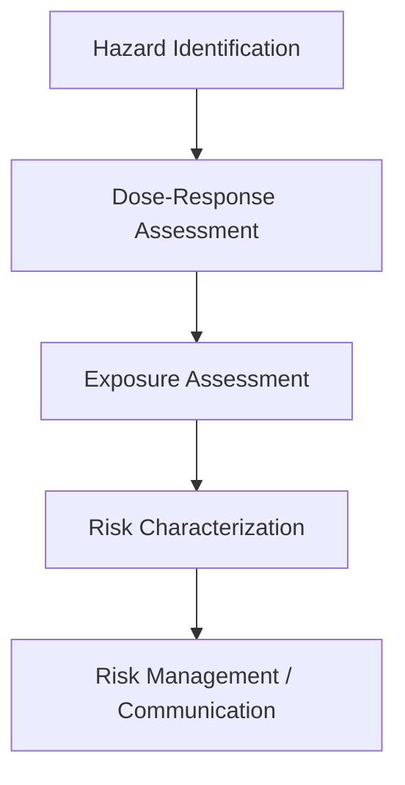
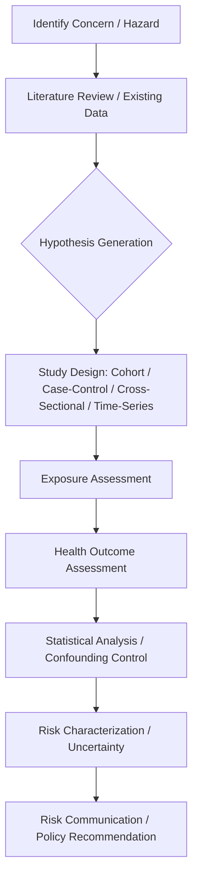
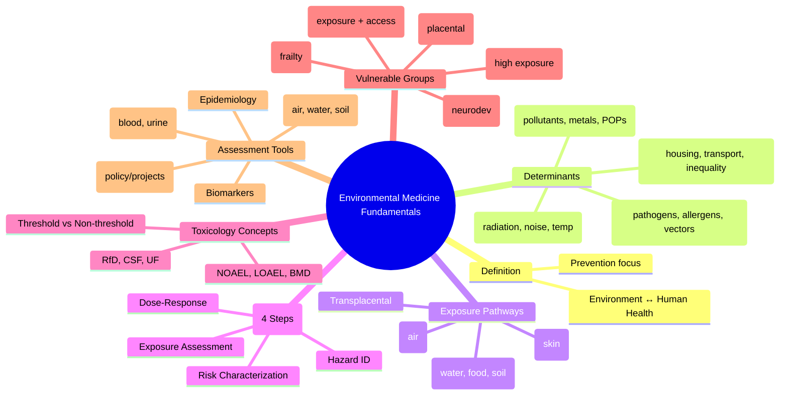

> [!info] **Davidson Ch 9 Alignment**: Environmental Medicine → Fundamentals of Environmental Medicine
> **FCPS/MRCP Focus**: Environmental determinants of health, exposure pathways, risk assessment framework, vulnerable populations, environmental health assessment, biomonitoring

---

## 1. 🎯 Learning Objectives

- [ ] Define **Environmental Medicine**: Intersection of environment and human health
- [ ] Identify **Environmental Determinants of Health**: Physical, chemical, biological, social
- [ ] Apply **Exposure Pathways**: Inhalation, ingestion, dermal, transplacental
- [ ] Apply **Risk Assessment Framework**: Hazard identification, dose-response, exposure assessment, risk characterization
- [ ] Identify **Vulnerable Populations**: Children, elderly, pregnant, occupational groups, low-income
- [ ] Apply **Environmental Health Assessment**: Monitoring, biomonitoring, HIA, environmental epidemiology

---

## 2. 📖 Definition & Scope

| Aspect | Definition |
|--------|------------|
| **Environmental Medicine** | **Branch of medicine** concerned with **interaction between environment and human health** |
| **Environmental Health** | **Aspects of human health determined by physical, chemical, biological, social, psychosocial factors in environment** |
| **Environmental Medicine Focus** | **Prevention**, **Risk Assessment**, **Surveillance**, **Policy**, **Clinical Management** of environment-related disease |

---

## 3. 📖 Environmental Determinants of Health

### Classification

| Determinant Category | Examples | Health Impact |
|---------------------|----------|---------------|
| **Physical** | Radiation (ionising/non-ionising), Noise, Temperature extremes, Humidity, Pressure | Radiation sickness, hearing loss, heat stroke, hypothermia, barotrauma |
| **Chemical** | Air pollutants (PM2.5, NO2, SO2, O3, CO), Heavy metals (Pb, Hg, As, Cd), Pesticides, POPs, VOCs, Endocrine disruptors | Respiratory/CV disease, cancer, neurotoxicity, endocrine disruption, developmental |
| **Biological** | Pathogens (bacteria, viruses, parasites), Allergens (pollen, mould), Vectors (mosquitoes, ticks) | Infectious disease, allergy, vector-borne disease |
| **Social/Psychosocial** | Housing, urban design, transport, noise, light, green space, socioeconomic status | Mental health, CVD, obesity, injuries, health inequalities |

---

## 4. 📖 Exposure Pathways

| Pathway | Route | Examples | Key Factors |
|---------|-------|----------|-------------|
| **Inhalation** | Respiratory tract | Air pollutants (PM2.5, O3, NO2), allergens, occupational dusts/fumes, radon | Particle size, solubility, ventilation rate, duration |
| **Ingestion** | GI tract | Water contaminants (arsenic, lead, microbes), food contaminants (pesticides, mycotoxins, heavy metals), soil/dust ingestion (children) | Concentration, volume consumed, bioavailability, gut absorption |
| **Dermal** | Skin absorption | Pesticides, solvents, UV radiation, chemicals, allergens | Skin integrity, surface area, contact duration, lipophilicity |
| **Transplacental** | Placental transfer | Heavy metals (Pb, Hg), POPs, CO, nicotine, alcohol, drugs, infections (rubella, CMV, syphilis, Zika) | Placental transfer coefficient, gestational age, lipid solubility |

---

## 5. 📖 Risk Assessment Framework (WHO/IPCS)

### Four Steps

| Step | Description | Key Methods |
|------|-------------|-------------|
| **1. Hazard Identification** | **Can the agent cause harm?** | Epidemiology, toxicology (animal/in vitro), mechanistic data, weight-of-evidence |
| **2. Dose-Response Assessment** | **What is the relationship between dose and effect?** | NOAEL/LOAEL, BMD, RfD, CSF, IUR, threshold vs non-threshold |
| **3. Exposure Assessment** | **Who is exposed, how much, how long, by what route?** | Environmental monitoring, personal monitoring, modelling, biomarkers, time-activity patterns |
| **4. Risk Characterization** | **What is the nature and magnitude of risk?** | Quantitative (risk estimate), qualitative (confidence), uncertainty analysis, sensitivity analysis |

---

## 6. 📖 Key Toxicological Concepts

| Concept | Definition | Application |
|---------|------------|-------------|
| **NOAEL** | No Observed Adverse Effect Level | Basis for RfD/ADI |
| **LOAEL** | Lowest Observed Adverse Effect Level | When NOAEL unavailable |
| **BMD** | Benchmark Dose (Statistical lower confidence limit) | Preferred over NOAEL |
| **RfD / ADI** | Reference Dose / Acceptable Daily Intake | **RfD = NOAEL / (UF₁ × UF₂ × UF₃...)** for non-cancer |
| **CSF (Cancer Slope Factor)** | **Risk per unit dose** (mg/kg/day)⁻¹ | **Cancer Risk = CSF × Dose** |
| **IUR (Inhalation Unit Risk)** | **Risk per µg/m³ air** | **Cancer Risk = IUR × Air Concentration** |
| **UF (Uncertainty Factors)** | **10× (Interspecies) × 10× (Intraspecies) × ...** | **Default 100×**, additional for LOAEL→NOAEL, database gaps |

---

## 7. 📖 Vulnerable Populations

| Population | Specific Vulnerabilities | Key Environmental Risks |
|------------|-------------------------|------------------------|
| **Children** | Developing organs, higher intake/kg, hand-to-mouth, longer latency | Lead (neurodevelopment), air pollution (asthma), pesticides, endocrine disruptors |
| **Elderly** | Reduced reserve, comorbidities, polypharmacy, reduced clearance | Heat/cold extremes, air pollution (CV/respiratory), falls, medications |
| **Pregnant Women** | Fetal susceptibility, placental transfer, physiological changes | Lead, mercury, CO, solvents, pesticides, radiation, infections (rubella, CMV, toxo) |
| **Occupational Groups** | High exposure intensity, specific agents | Asbestos, silica, benzene, heavy metals, pesticides, radiation, noise |
| **Low-Income / Marginalized** | Poor housing, proximity to hazards, limited healthcare access | Lead paint, poor water/sanitation, industrial proximity, heat islands |
| **Immunocompromised** | Reduced defence, latent infection reactivation | Opportunistic infections, water/food safety, vaccine limitations |

---

## 8. 📖 Environmental Health Assessment Tools

| Tool | Purpose | Application |
|------|---------|-------------|
| **Environmental Monitoring** | Ambient air/water/soil quality | Compliance, trends, source identification |
| **Biomonitoring** | **Internal dose** (blood, urine, hair, nails, breast milk) | Lead, mercury, cadmium, cotinine, cotinine, pesticides, POPs, phthalates, BPA |
| **Health Impact Assessment (HIA)** | **Predict health effects** of policies/projects/plans | Urban planning, transport, energy, agriculture policy |
| **Environmental Epidemiology** | **Observational studies** (cohort, case-control, time-series, ecological) | Air pollution mortality, cancer clusters, birth outcomes |
| **Biomarkers** | **Exposure** (e.g., blood lead), **Effect** (e.g., ALAD inhibition), **Susceptibility** (e.g., ALAD genotype) | Mechanistic insight, early detection, risk stratification |

---

## 9. 📖 Environmental Health Assessment — Stepwise

---

## 10. 📖 Health Impact Assessment (HIA) — Steps

| Step | Description |
|------|-------------|
| **1. Screening** | Determine if HIA needed (policy/project/program likely to affect health) |
| **2. Scoping** | Define boundaries, populations, health determinants, methods, stakeholders |
| **3. Assessment** | **Baseline health profile**, **Predict health impacts** (qualitative/quantitative), **Equity analysis** |
| **4. Recommendations** | Mitigation, enhancement, alternatives, monitoring |
| **5. Reporting** | Transparent, accessible, decision-maker oriented |
| **6. Monitoring & Evaluation** | Track implementation, health outcomes, equity |

---

## 11. 💡 FCPS/MRCP High-Yield Summary

| Topic | Key Point |
|-------|-----------|
| **Environmental Medicine** | **Environment ↔ Human Health** (Prevention, risk assessment, surveillance) |
| **Determinants** | Physical (radiation, noise), Chemical (pollutants, metals), Biological (pathogens, allergens), Social |
| **Exposure Pathways** | **Inhalation, Ingestion, Dermal, Transplacental** |
| **Risk Assessment** | **4 Steps**: Hazard ID → Dose-Response → Exposure Assessment → Risk Characterization |
| **Key Toxicology Concepts** | **NOAEL/LOAEL/BMD**, **RfD/CSF**, **UF = 100× default**, **BMD preferred** |
| **Vulnerable Groups** | **Children (neurodevelopment), Pregnant (placental transfer), Elderly, Occupational, Low-income** |
| **Assessment Tools** | **Monitoring, Biomonitoring (lead, Hg, cotinine), HIA, Epidemiology, Biomarkers** |
| **HIA Steps** | **Screening → Scoping → Assessment → Recommendations → Reporting → Monitoring** |

---

## 12. ❓ Viva Questions

1. **What are the four steps of risk assessment?**
   - **Hazard Identification, Dose-Response Assessment, Exposure Assessment, Risk Characterization**

2. **What is the difference between NOAEL and LOAEL?**
   - **NOAEL = Highest dose with NO adverse effect**; **LOAEL = Lowest dose WITH adverse effect**

3. **What are the four main exposure pathways?**
   - **Inhalation, Ingestion, Dermal, Transplacental**

4. **Which populations are most vulnerable to environmental hazards?**
   - **Children (developing organs), Pregnant women (placental transfer), Elderly (reduced reserve), Occupational groups, Low-income communities**

5. **What is the purpose of a Health Impact Assessment (HIA)?**
   - **Predict health effects of policies/projects/plans** → **Inform decision-making, mitigate harms, enhance benefits, promote equity**

6. **What is the role of biomonitoring in environmental health?**
   - **Measures internal dose** (blood, urine, hair) → **Integrates all exposure routes**, reflects biologically effective dose

6. **What is the difference between RfD and CSF?**
   - **RfD = Non-cancer threshold (mg/kg/day)**; **CSF = Cancer slope factor (risk per mg/kg/day)**

7. **What is the WHO framework for risk assessment?**
   - **Hazard ID → Dose-Response → Exposure Assessment → Risk Characterization**

8. **What are the main exposure pathways for lead?**
   - **Ingestion (paint, dust, soil, water), Inhalation (dust, fumes), Transplacental (pregnancy)**

9. **What is the role of HIA in urban planning?**
   - **Assess health impacts of transport, housing, energy, land use policies** → **Integrate health into urban design**

10. **How does climate change act as a risk multiplier in environmental health?**
    - **Amplifies existing risks**: heat, vector-borne disease, water/food security, air quality, displacement, mental health |

---

## 13. 🧠 Confusions & Mnemonics

| Confusion | Clarification |
|-----------|---------------|
| **RfD vs CSF** | **RfD = Non-cancer threshold**; **CSF = Cancer potency (risk per dose)** |
| **NOAEL vs LOAEL** | **NOAEL = No effect**; **LOAEL = Lowest with effect** |
| **Hazard vs Risk** | **Hazard = Potential to harm**; **Risk = Probability × Severity of harm given exposure** |
| **Biomonitoring vs Environmental Monitoring** | **Biomonitoring = Internal dose (integrated)**; **Env Monitoring = External concentration** |
| **HIA vs EIA** | **HIA = Health focus**; **EIA = Environmental focus (broader)** |
| **Threshold vs Non-threshold** | **Threshold = Safe dose exists (non-cancer)**; **Non-threshold = Any dose carries risk (carcinogens)** |

| Mnemonic | Meaning |
|----------|---------|
| **"HI-DE-RC = Hazard ID, Dose-Response, Exposure, Risk Char"** | Risk Assessment Steps |
| **"RfD = NOAEL / 100 (UF)"** | RfD Calculation |
| **"4 Pathways = Inhale, Ingest, Dermal, Placental"** | Exposure Routes |
| **"Vulnerable = Children, Pregnant, Elderly, Workers, Poor"** | Vulnerable Groups |
| **"HIA = Health in All Policies"** | HIA Purpose |
| **"Biomonitoring = Internal Dose"** | Biomonitoring |

---

## 14. 🗺️ Mind Map

---

## 15. 📋 One-Page Revision Card

| **ENVIRONMENTAL MEDICINE FUNDAMENTALS – FCPS/MRCP REVISION CARD** |
|-------------------------------------------------------------------|
| **Definition**: **Environment ↔ Human Health** (Prevention, Risk Assessment, Surveillance) |
| **Determinants**: Physical (radiation, noise), Chemical (pollutants, metals), Biological (pathogens, allergens), Social |
| **Exposure Pathways**: **Inhalation, Ingestion, Dermal, Transplacental** |
| **Risk Assessment**: **4 Steps** — **Hazard ID → Dose-Response → Exposure Assessment → Risk Characterization** |
| **Key Toxicology**: **NOAEL/LOAEL/BMD**, **RfD (non-cancer)**, **CSF (cancer)**, **UF=100× default** |
| **Vulnerable Groups**: **Children (neurodev), Pregnant (placental transfer), Elderly, Workers, Poor** |
| **Assessment Tools**: **Monitoring (air/water/soil), Biomonitoring (blood/urine), HIA, Epidemiology, Biomarkers** |
| **HIA Steps**: **Screening → Scoping → Assessment → Recommendations → Reporting → Monitoring** |
| **Key Risk Factors**: Lead (neurodev), Air pollution (CV/respiratory), Heavy metals, POPs, Climate change |
| **Vulnerable**: Children, Pregnant, Elderly, Workers, Poor |

---

## 16. 📅 Spaced Repetition Tracker

| Review | Date | Score (1-5) | Next Review |
|--------|------|-------------|-------------|
| Day 1 | 2025-06-17 | | 2025-06-18 |
| Day 3 | | | |
| Day 7 | | | |
| Day 15 | | | |
| Day 30 | | | |

---

## 17. 🎯 Must Know / Should Know / Nice to Know

| Level | Content |
|-------|---------|
| **Must Know** | Definition, 4 risk assessment steps, 4 exposure pathways, key toxicology concepts (NOAEL, RfD, CSF, UF), vulnerable populations, HIA steps, biomonitoring vs monitoring |
| **Should Know** | Detailed dose-response modelling (BMD, benchmark dose), specific vulnerable group susceptibilities (e.g., children lead, pregnancy mercury), HIA methodology details, environmental epidemiology study designs, biomarker types (exposure/effect/susceptibility), uncertainty analysis, precautionary principle |
| **Nice to Know** | Advanced exposure modelling (PBPK, GIS), epigenetics & environment, gene-environment interaction, emerging contaminants (PFAS, microplastics, pharmaceuticals), planetary health boundaries, environmental justice, One Health approach, circular economy health impacts, cost-benefit analysis in HIA, global burden of disease (GBD) environmental attribution |

---

## 18. ✅ Self-Test Scorecard

| Section | Score (0-10) | Notes |
|---------|--------------|-------|
| Definitions & Scope | | |
| Risk Assessment Framework | | |
| Exposure Pathways | | |
| Vulnerable Populations | | |
| Risk Assessment Methods | | |
| Assessment Tools | | |
| Viva Questions | | |

---

## 19. 🔗 Local Navigation

- **Previous**: [[Infection in Pregnancy / Neonates]]
- **Next**: [[Air Pollution & Respiratory Health]]
- **Section Hub**: [[Environmental Medicine MOC]]
- **MOC**: [[Hematology MOC]]
- **Template**: [[../Templates/Hematology Topic Template]]

---

*Generated for FCPS/MRCP exam preparation. Based on Davidson Medicine 24th Ed Chapter 9.*