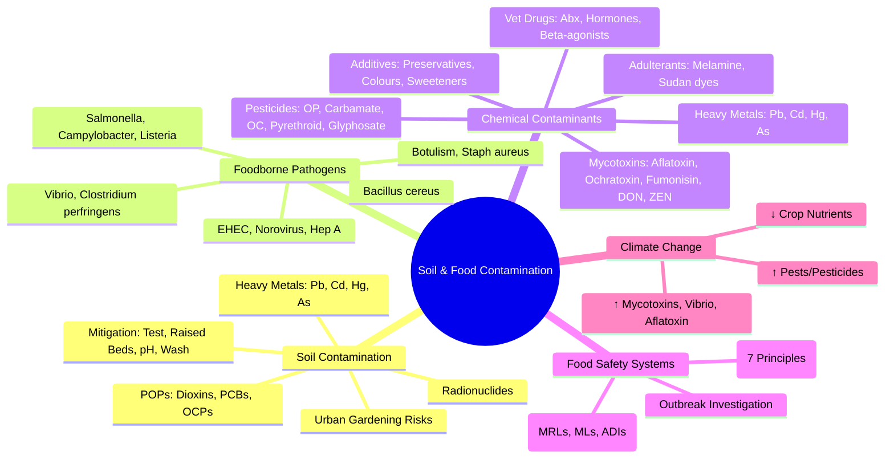

> [!info] **Davidson Ch 9 Alignment**: Environmental Medicine → Soil & Food Contamination
> **FCPS/MRCP Focus**: Heavy metal soil contamination (Pb, Cd, Hg, As), POPs (dioxins, PCBs, OCPs), radioactive contamination, urban gardening risks, foodborne pathogens, chemical contaminants (mycotoxins, heavy metals, pesticide residues, veterinary drugs), food additives, HACCP, Codex Alimentarius, foodborne outbreak investigation

---

## 1. 🎯 Learning Objectives

- [ ] Identify **Soil Contaminants**: Heavy metals (Pb, Cd, Hg, As), POPs (dioxins, PCBs, OCPs), radioactive contamination
- [ ] Assess **Urban Gardening Risks**: Soil testing, raised beds, phytoremediation
- [ ] Identify **Foodborne Pathogens**: Salmonella, Campylobacter, Listeria, E. coli, Clostridium, Norovirus
- [ ] Identify **Chemical Food Contaminants**: Mycotoxins, heavy metals, pesticide residues, veterinary drugs, food additives
- [ ] Apply **Food Safety Systems**: HACCP, Codex Alimentarius, foodborne outbreak investigation
- [ ] Apply **Regulatory Frameworks**: National/EU/CODEX standards, MRLs, ADIs

---

## 2. 📖 Soil Contamination & Health

### Major Soil Contaminants

| Contaminant | Source | Health Effect | Key Metric |
|-------------|--------|---------------|------------|
| **Lead (Pb)** | Leaded petrol (historical), paint, batteries, smelting, industry | **Neurodevelopmental (children IQ loss)**, CVD, renal | **Soil: <400 ppm (residential)**, Blood Pb <5 µg/dL |
| **Cadmium (Cd)** | Phosphate fertilisers, batteries, plating, waste incineration | **Renal (tubular), Osteomalacia (Itai-Itai), Cancer (lung)** | **Soil: <3 ppm**, Urinary Cd <1 µg/g creat |
| **Mercury (Hg)** | Chlor-alkali, gold mining, coal combustion, waste incineration | **Neurotoxicity (MeHg), renal, developmental** | **Soil: <1 ppm**, Hair Hg <1 ppm |
| **Arsenic (As)** | Pesticides (historical), mining, smelting, geogenic | **Skin lesions, cancer (skin, lung, bladder), CVD, diabetes** | **Soil: <20 ppm**, Water <10 µg/L |
| **POPs: Dioxins/Furans** | Waste incineration, industrial processes, chlorine bleaching | **Cancer (TCDD Group 1), Chloracne, Endocrine, Immune** | **TEQ (WHO-TEQ) pg/g** |
| **POPs: PCBs** | Transformers, capacitors, hydraulic fluids, old building materials | **Cancer, neurodevelopmental, endocrine, immune** | **Congener-specific TEQ** |
| **OCPs (DDT, Dieldrin, Aldrin, etc.)** | Historical agricultural use | **Endocrine disruption, cancer, neurotoxicity, eggshell thinning** | **Various MRLs** |
| **Radionuclides** | Nuclear accidents (Chernobyl, Fukushima), weapons testing, mining | **Cancer (thyroid, leukaemia), ARS, genetic** | **Bq/kg**, Dose (mSv/yr) |

> [!tip] **Soil Contamination = Ingestion (hand-to-mouth), Inhalation (dust), Dermal, Food Chain Transfer**. **Children = High Risk** (pica, hand-to-mouth, higher absorption).

---

## 3. 📖 Urban Gardening & Food Production Risks

| Risk | Source | Mitigation |
|------|--------|------------|
| **Lead in Soil** | Historical leaded petrol, paint, industry | **Test soil**, **Raised beds with clean soil**, **Mulch**, **Wash produce** |
| **Cadmium/Arsenic** | Phosphate fertilisers, former orchards, smelting | **Soil testing**, **pH management (liming reduces Cd uptake)**, **Avoid high-Cd crops (rice, leafy)** |
| **PAHs / Dioxins** | Urban deposition, incinerators | **Peel root vegetables**, **Wash thoroughly**, **Avoid root crops in contaminated soil** |
| **Microbiological** | Manure, sewage sludge, irrigation water | **Compost properly (time/temperature)**, **Wash produce**, **Gap between application/harvest** |

> [!warning] **Urban Gardening on Contaminated Soil = Significant Exposure Route**. **Test Soil Before Planting**. **Root Vegetables > Leafy > Fruits** for contaminant uptake.

---

## 4. 📖 Foodborne Pathogens — Major Agents

| Pathogen | Source / Vehicle | Incubation | Key Clinical Features |
|----------|------------------|------------|----------------------|
| **Salmonella (non-typhoidal)** | Poultry, eggs, meat, produce | 6-72h | Diarrhoea, fever, cramps |
| **Campylobacter jejuni** | Poultry, raw milk, water | 2-5 days | Bloody diarrhoea, fever, GBS trigger |
| **Salmonella Typhi/Paratyphi** | Water, food, carriers | 1-3 weeks | Typhoid fever (step-ladder fever, rose spots) |
| **E. coli O157:H7 (EHEC)** | Beef, produce, petting zoos | 3-4 days | **Bloody diarrhoea, HUS (children)** |
| **Listeria monocytogenes** | Deli meats, soft cheese, smoked fish, produce | 1-70 days | **Meningitis, sepsis, pregnancy loss**, **Cold growth** |
| **Clostridium botulinum** | Canned foods, honey, vacuum-packed | 12-36h | **Descending flaccid paralysis**, **Dysphagia, diplopia** |
| **Clostridium perfringens** | Meat, gravy, reheated foods | 8-16h | **Watery diarrhoea, cramps**, self-limiting |
| **Bacillus cereus** | Rice (emetic), meats/vegetables (diarrhoeal) | 1-6h (emetic), 8-16h (diarrhoeal) | **Two syndromes**: Emetic (vomiting), Diarrhoeal |
| **Staphylococcus aureus** | Cream pies, meats, salads (enterotoxin) | 1-6h | **Rapid vomiting**, self-limiting |
| **Vibrio parahaemolyticus** | Raw seafood (oysters) | 4-96h | Watery diarrhoea, abdominal cramps |
| **Norovirus** | Shellfish, ready-to-eat, person-to-person | 12-48h | **Vomiting, diarrhoea**, outbreaks (cruise ships, institutions) |
| **Hepatitis A** | Shellfish, produce, water, person-to-person | 15-50 days | Acute hepatitis, jaundice |

---

## 5. 📖 Chemical Food Contaminants

### Mycotoxins (Fungal Metabolites)

| Mycotoxin | Producing Fungi | Main Foods | Health Effect |
|-----------|----------------|------------|---------------|
| **Aflatoxins (B1, B2, G1, G2)** | *Aspergillus flavus, parasiticus* | **Groundnuts, maize, tree nuts, spices, dried fruit** | **Hepatocellular Carcinoma (Group 1)**, Acute hepatotoxicity |
| **Ochratoxin A** | *Aspergillus ochraceus, Penicillium verrucosum* | Cereals, coffee, wine, dried fruit, spices | **Nephrotoxic, Carcinogenic (Group 2B)** |
| **Fumonisins (B1, B2)** | *Fusarium verticillioides, proliferatum* | **Maize, maize products** | **Oesophageal cancer, Neural tube defects** |
| **Deoxynivalenol (DON / Vomitoxin)** | *Fusarium graminearum, culmorum* | **Cereals (wheat, barley, maize)** | **Gastrointestinal (vomiting), Immunosuppression** |
| **Zearalenone (ZEN)** | *Fusarium graminearum* | **Cereals, maize** | **Oestrogenic (reproductive toxicity)** |
| **Patulin** | *Penicillium, Aspergillus* | **Apple juice, fruit products** | **Genotoxic, immunotoxic** |

### Heavy Metals in Food

| Metal | Main Dietary Sources | Health Concern | Key Regulation |
|-------|---------------------|----------------|----------------|
| **Lead** | Cereals, vegetables, water, spices, game meat (shot) | **Neurodevelopmental (children)** | ML: 0.01-0.3 mg/kg (varies by food) |
| **Cadmium** | **Cereals, vegetables, shellfish, offal**, smokers | **Renal (tubular), Osteomalacia (Itai-Itai)** | ML: 0.01-0.2 mg/kg |
| **Mercury (Methylmercury)** | **Fish (predatory: tuna, swordfish, shark)** | **Neurodevelopmental (fetal/infant)** | ML: 0.5-1.0 mg/kg (fish) |
| **Arsenic (Inorganic)** | **Rice, rice products, water, seaweed** | **Cancer, skin lesions, CVD** | ML: 0.1-0.2 mg/kg (rice) |
| **Arsenic (Organic - Arsenobetaine)** | **Seafood (fish, shellfish)** | **Low toxicity (excreted)** | Not regulated |

### Pesticide Residues & Veterinary Drugs

| Category | Concerns | Regulation |
|----------|----------|------------|
| **Organophosphates/Carbamates** | Acute neurotoxicity (cholinesterase inhibition) | **MRLs (Maximum Residue Limits)**, **ADI**, **PHI (Pre-Harvest Interval)** |
| **Organochlorines (DDT, Dieldrin, etc.)** | **Persistent, bioaccumulative, endocrine disruption** | **Banned/Restricted (Stockholm Convention)** |
| **Pyrethroids / Neonicotinoids** | **Lower acute toxicity**, bee toxicity, environmental persistence | **MRLs, Pollinator Risk Assessment** |
| **Glyphosate** | **Controversial carcinogenicity (IARC 2A)** | **MRLs, Re-evaluation ongoing** |
| **Veterinary Drugs** (Antibiotics, hormones, β-agonists) | **Residues in meat/milk/eggs**, **AMR, Hormonal effects** | **MRLs, Withdrawal Periods, EU Ban on Growth Promoters** |

### Food Additives & Adulterants

| Category | Examples | Concerns |
|----------|----------|----------|
| **Preservatives** | Benzoates, sulfites, nitrites/nitrates | **Allergy (sulfites), Carcinogenicity (nitrosamines from nitrites)** |
| **Colourants** | Tartrazine, Sunset Yellow, Carmine | **Hyperactivity (controversial), Allergy** |
| **Sweeteners** | Aspartame, saccharin, sucralose, stevia | **Carcinogenicity debates (aspartame), Metabolic effects** |
| **Adulterants** | Melamine (milk), Sudan dyes (spices), industrial dyes | **Fraud, Acute/Chronic Toxicity** |

---

## 6. 📖 Food Safety Systems — HACCP & Codex

### HACCP — 7 Principles

| Principle | Action |
|---------|--------|
| **1. Hazard Analysis** | **Identify** biological, chemical, physical hazards at each step |
| **2. CCP Identification** | **Critical Control Points** where control is essential |
| **3. Critical Limits** | **Measurable criteria** (time, temp, pH, Aw) at each CCP |
| **4. Monitoring** | **Planned observations/measurements** at CCPs |
| **5. Corrective Actions** | **Pre-defined actions** when CCP limit exceeded |
| **6. Verification** | **Procedures to confirm HACCP works** (audits, testing, reviews) |
| **7. Documentation** | **Records** of HACCP plan, monitoring, corrective actions |

### Codex Alimentarius — International Food Standards

| Component | Role |
|---------|------|
| **General Standards** | Labelling, additives, contaminants, hygiene, Methods of Analysis |
| **Commodity Standards** | **Specific foods**: Milk, meat, fish, cereals, fruit/veg, fats/oils |
| **Pesticide Residues (MRLs)** | **Codex MRLs** → Basis for National/International Trade (WTO SPS) |
| **Veterinary Drug Residues (MRLs)** | **Codex MRLs** → **Withdrawal Periods**, **Acceptable Daily Intake (ADI)** |
| **Food Additives (INS/JECFA)** | **ADI, Maximum Levels**, Technological Justification |
| **Contaminants (MLs)** | **Lead, Cadmium, Arsenic, Mercury, Tin, Mycotoxins, PAHs, PAHs, Dioxins** |

---

## 7. 📖 Foodborne Outbreak Investigation

### Steps

| Step | Action |
|------|--------|
| **1. Detection** | **Surveillance** (Syndromic, Lab, Complaints), **Cluster Detection** |
| **2. Case Definition** | **Clinical + Lab + Epidemiological** (Person, Place, Time) |
| **2. Hypothesis Generation** | **Interviews** (Food History), **Case-Control Study** |
| **4. Hypothesis Testing** | **Analytical Study** (Case-Control / Cohort), **Statistical Association** |
| **5. Source Identification** | **Traceback / Traceforward**, **Environmental Sampling**, **WGS Comparison** |
| **6. Control Measures** | **Recall**, **Recall**, **Public Alert**, **Facility Correction**, **Exclusion** |
| **7. Reporting** | **Local/National/International (INFOSAN, RASFF, PulseNet)** |

---

## 8. 🌍 Climate Change & Food Safety

| Impact | Examples |
|--------|----------|
| **Temperature Rise** | **Increased Microbial Growth** (Salmonella, Vibrio), **Mycotoxin Production** (Aflatoxin in maize) |
| **Extreme Weather** | **Floods → Contamination**, **Drought → Concentration of Contaminants** |
| **Ocean Warming** | **Vibrio spp. Expansion** (Cholera, Vibrio wound infections), **HABs (Ciguatera, PSP)** |
| **CO2 Rise** | **Reduced Nutrient Density** (Protein, Zn, Fe in crops) |
| **Pest/Disease Shifts** | **New Pests → Increased Pesticide Use**, **New Mycotoxin Risks** |

---

## 9. 💡 FCPS/MRCP High-Yield Summary

| Topic | Key Point |
|-------|-----------|
| **Soil Contaminants** | **Pb, Cd, Hg, As, POPs (Dioxins, PCBs, OCPs), Radionuclides** → **Ingestion/Inhalation/Dermal/Food Chain** |
| **Urban Gardening** | **Test Soil**, **Raised Beds**, **Peel/Wash Produce**, **Avoid Root Crops in Contaminated Soil** |
| **Foodborne Pathogens** | **Salmonella, Campylobacter, Listeria, EHEC, Norovirus** → **Diarrhoea, HUS, Meningitis, Pregnancy Loss** |
| **Mycotoxins** | **Aflatoxin (Liver Cancer), Ochratoxin A (Kidney), Fumonisins (Oesophageal Ca), DON (GI), ZEN (Endocrine)** |
| **Heavy Metals in Food** | **Pb (Neurodev), Cd (Renal/Bone), Hg (Neurodev-fetal), As (Cancer), Hg in Fish (Pregnancy Advice)** |
| **Pesticides/Vet Drugs** | **MRLs, ADIs, PHIs**, **OP/Carbamate (ChE Inhibition), OCPs (POPs, Banned)** |
| **Food Additives** | **Preservatives (Nitrites→Nitrosamines), Colours (Hyperactivity), Sweeteners (Aspartame debate)** |
| **HACCP** | **7 Principles: Hazard Analysis → CCP → Critical Limits → Monitoring → Corrective Action → Verification → Documentation** |
| **Codex Alimentarius** | **International Standards (MRLs, MLs, Additive ADIs) → WTO SPS Reference** |
| **Outbreak Investigation** | **Detect → Define Cases → Hypothesis → Test (Case-Control) → Source ID → Control → Report** |
| **Climate Change** | **↑ Mycotoxins, ↑ Vibrio, ↑ Aflatoxin, ↓ Crop Nutrients, ↑ Pests/Pesticides** |

---

## 10. ❓ Viva Questions

1. **What are the main heavy metals contaminating soil and their health effects?**
   - **Pb (Neurodevelopmental), Cd (Renal/Osteomalacia), Hg (Neurotoxicity), As (Cancer, Skin lesions, CVD)**

2. **What is the main risk of urban gardening on contaminated soil?**
   - **Direct ingestion of soil/dust, Inhalation of dust, Consumption of contaminated produce (root vegetables highest uptake).**

3. **Which mycotoxin is most strongly associated with hepatocellular carcinoma?**
   - **Aflatoxin B1 (Group 1 Carcinogen)** — Synergistic with Hepatitis B.

4. **What are the key heavy metals regulated in food and their main sources?**
   - **Pb (Cereals, veg, water, spices), Cd (Cereals, veg, shellfish, offal), Hg (Predatory fish), As (Rice, water, seaweed).**

5. **What are the main mycotoxins and their health effects?**
   - **Aflatoxins (HCC), Ochratoxin A (Nephrotoxic), Fumonisins (Oesophageal Ca, NTD), DON (GI), ZEN (Endocrine).**

6. **What are Maximum Residue Limits (MRLs) and who sets them internationally?**
   - **Codex Alimentarius Commission (FAO/WHO)** sets **Codex MRLs**; basis for WTO SPS Agreement.

5. **What is HACCP and its 7 principles?**
   - **Hazard Analysis → CCP Identification → Critical Limits → Monitoring → Corrective Actions → Verification → Documentation**.

6. **How do you investigate a foodborne outbreak?**
   - **Detect → Define Cases → Hypothesis (Interviews) → Test (Case-Control) → Traceback/Traceforward → Control → Report**.

6. **What are the climate change impacts on food safety?**
   - **↑ Mycotoxins (Aflatoxin), ↑ Vibrio/cholera, ↑ Aflatoxin in maize, ↓ Crop nutrients, ↑ Pests/Pesticides.**

8. **What is the difference between MRL and ADI?**
   - **MRL = Max legal residue in food**; **ADI = Acceptable Daily Intake (safe lifetime exposure).**

9. **What are the Codex Alimentarius standards used for?**
   - **International Food Standards, MRLs, MLs, Additive ADIs → WTO SPS Agreement Reference.**

10. **What is the most common cause of foodborne botulism and its clinical presentation?**
    - **Clostridium botulinum** in improperly canned/preserved foods → **Descending flaccid paralysis, dysphagia, diplopia, respiratory failure**.

---

## 11. 🧠 Confusions & Mnemonics

| Confusion | Clarification |
|-----------|---------------|
| **Aflatoxin vs Other Mycotoxins** | **Aflatoxin = Liver Cancer (Potent Carcinogen)**; **Others: Kidney, Oesophagus, GI, Endocrine** |
| **Lead in Soil vs Food** | **Soil → Direct Ingestion/Dust + Plant Uptake**; **Food = Multiple Sources (Cereals, Water, Spices, Game)** |
| **Acute vs Chronic Heavy Metal Toxicity** | **Acute = GI, Shock**; **Chronic = Neuro, Renal, Cancer, Endocrine** |
| **MRL vs ADI** | **MRL = Legal Limit in Food**; **ADI = Safe Daily Intake for Lifetime** |
| **HACCP vs GMP** | **HACCP = Hazard-Specific, Science-Based**; **GMP = General Hygiene/Manufacturing Practice** |
| **Codex vs National Standards** | **Codex = International Reference (WTO SPS)**; National can be Stricter |

| Mnemonic | Meaning |
|----------|---------|
| **"Aflatoxin = Liver Cancer (HCC)"** | Aflatoxin Carcinogenicity |
| **"Lead = Neurodev, Cadmium = Kidney/Bone, Mercury = Neuro (Fetal), Arsenic = Cancer/Skin"** | Heavy Metals |
| **"HACCP = 7 Steps: HA → CCP → CL → Monitor → CA → Verify → Doc"** | HACCP Principles |
| **"MRL = Legal Limit in Food; ADI = Safe Daily Dose"** | MRL vs ADI |
| **"Codex = WTO SPS Reference"** | Codex Role |
| **"Outbreak = Detect → Define → Hypothesis → Test → Trace → Control → Report"** | Outbreak Steps |

---

## 12. 🗺️ Mind Map

---

## 13. 📋 One-Page Revision Card

| **SOIL & FOOD CONTAMINATION – FCPS/MRCP REVISION CARD** |
|---------------------------------------------------------|
| **Soil Contaminants**: **Pb, Cd, Hg, As**, **POPs (Dioxins, PCBs, OCPs)**, **Radionuclides** |
| **Urban Gardening**: **Test Soil**, **Raised Beds**, **Peel/Wash**, **Avoid Root Crops** |
| **Foodborne Pathogens**: **Salmonella, Campylobacter, Listeria, EHEC, Norovirus** |
| **Mycotoxins**: **Aflatoxin (HCC)**, **Ochratoxin A (Kidney)**, **Fumonisin (Oesoph Ca)**, **DON (GI)**, **ZEN (Endocrine)** |
| **Heavy Metals in Food**: **Pb (Neurodev), Cd (Renal/Bone), Hg (Neurodev-fetal), As (Cancer)** |
| **Pesticides/Vet Drugs**: **MRLs, ADIs, PHIs**, **OPs/Carbamates = ChE Inhibitors**, **OCPs = POPs** |
| **Additives/Adulterants**: Preservatives (Nitrites→Nitrosamines), Colours, Sweeteners, Adulterants (Melamine) |
| **HACCP**: **7 Principles** (HA → CCP → CL → Monitor → CA → Verify → Doc) |
| **Codex**: **MRLs, MLs, ADIs** → WTO SPS Reference |
| **Outbreak**: Detect → Define → Hypothesis → Test → Trace → Control → Report |
| **Climate Change**: ↑ Mycotoxins, ↑ Vibrio, ↓ Crop Nutrients, ↑ Pests |

---

## 14. 📅 Spaced Repetition Tracker

| Review | Date | Score (1-5) | Next Review |
|--------|------|-------------|-------------|
| Day 1 | 2025-06-17 | | 2025-06-18 |
| Day 3 | | | |
| Day 7 | | | |
| Day 15 | | | |
| Day 30 | | | |

---

## 15. 🎯 Must Know / Should Know / Nice to Know

| Level | Content |
|-------|---------|
| **Must Know** | Soil contaminants (Pb, Cd, Hg, As, POPs, Radionuclides), Urban gardening precautions, Major foodborne pathogens, Key mycotoxins (Aflatoxin, Ochratoxin, Fumonisin, DON, ZEN), Heavy metals in food (Pb, Cd, Hg, As), Pesticide/vet drug MRLs/ADIs, HACCP 7 principles, Codex Alimentarius role, Outbreak investigation steps, Climate change impacts on food safety |
| **Should Know** | Soil testing methods, Phytoremediation/bioremediation, Specific mycotoxin regulations (EU/FAO/WHO), Pesticide residue monitoring programmes, Veterinary drug withdrawal periods, Food additive safety evaluation (JECFA), Foodborne outbreak investigation techniques (WGS, traceback), Climate change adaptation strategies for food safety, Emerging risks (nanoplastics, novel proteins) |
| **Nice to Know** | Genomic epidemiology of foodborne pathogens, Metabolomics in food safety, Blockchain for traceability, Alternative proteins safety, Cellular agriculture risks, Food fraud detection (NMR, Isotope ratios), Planetary health diet & contaminants, One Health integration, Cost of foodborne illness, Global food safety governance (INFOSAN, GFN) |

---

## 16. ✅ Self-Test Scorecard

| Section | Score (0-10) | Notes |
|---------|--------------|-------|
| Soil Contaminants & Urban Gardening | | |
| Foodborne Pathogens | | |
| Chemical Contaminants (Mycotoxins, Heavy Metals, Pesticides) | | |
| Food Additives & Adulterants | | |
| HACCP & Codex Alimentarius | | |
| Outbreak Investigation | | |
| Climate Change & Food Safety | | |
| Viva Questions | | |

---

## 17. 🔗 Local Navigation

- **Previous**: [[Water Pollution & Waterborne Diseases]]
- **Next**: [[Climate Change & Health]]
- **Section Hub**: [[Environmental Medicine MOC]]
- **MOC**: [[Hematology MOC]]
- **Template**: [[../Templates/Hematology Topic Template]]

---

*Generated for FCPS/MRCP exam preparation. Based on Davidson Medicine 24th Ed Chapter 9.*

## PasTest Scenario SBAs (Clinical Vignettes)

> **Auto-generated PasTest/Mediscope-style scenario SBAs** grounded in the authored source. Each scenario tests a real clinical fact (triad, specific sign, contraindication, trial, first-line Rx) extracted from the topic. *Source: Ch 13: Austere Medicine — Soil & Food Contamination*

**Q1.** Which of the following features is most specific or characteristic of Soil & Food Contamination?

  - **A.** HACCP vs GMP
  - **B.** A feature common to many acute inflammatory conditions
  - **C.** A non-specific sign that does not localise the diagnosis
  - **D.** An investigation finding rather than a clinical feature

  > **Answer: A** — HACCP vs GMP
  >
  > *Source:* ** |
| **MRL vs ADI** | **MRL = Legal Limit in Food**; **ADI = Safe Daily Intake for Lifetime** |
| **HACCP vs GMP** | **HACCP = Hazard-Specific, Science-Based**; **GMP = General Hygiene/Manufacturing

