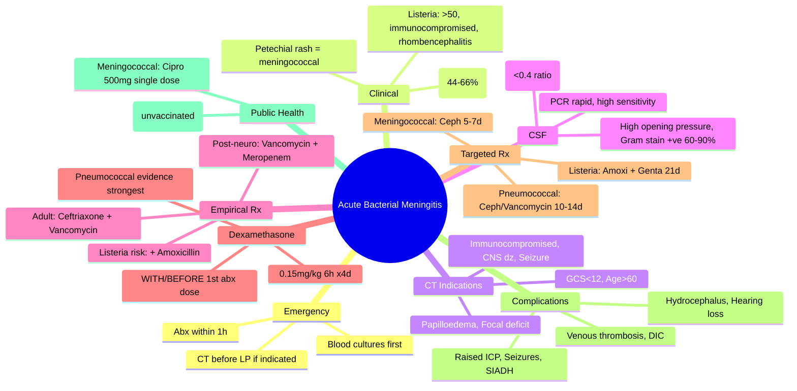

---
tags: [medicine, infectious-disease, davidson, chapter13, meningitis, bacterial, fcps, mrcp]
davidson_chapter: Chapter 13: Infectious disease
topic_category: CNS Infections Domain
status: full-fcps-mrcp-topic-note
---

# Acute Bacterial Meningitis

Related: [[Tuberculous Meningitis]], [[Viral Encephalitis]], [[Brain Abscess]], [[Sepsis and Septic Shock]], [[Fever and Septic Syndrome Approach]], [[Cerebral Malaria]]

> [!important]
> **Acute bacterial meningitis = medical emergency.** **Suspect → blood cultures → LP → antibiotics WITHIN 1 HOUR (do NOT delay for CT/LP).** **Dexamethasone 0.15mg/kg 6h ×4d with/ before 1st antibiotic dose (if pneumococcal suspected).** **Empirical: Ceftriaxone 2g 12h + Vancomycin 15–20mg/kg 6h + Dexamethasone ± Amoxicillin (if Listeria risk).** **Mortality 15–30%; sequelae 20–30%.**

## Learning Objectives
- Recognise classic triad (fever, neck stiffness, altered mental status) — only in 44–66%
- Perform LP safely: contraindications, CSF interpretation (opening pressure, cells, protein, glucose, Gram stain, culture, PCR)
- Select empirical antibiotics by age, risk factors, and local resistance
- Administer dexamethasone correctly (timing, dose, duration)
- Manage complications: raised ICP, seizures, SIADH, cranial nerve palsies, hydrocephalus, DIC
- Recognise specific pathogen clues (petechial rash = meningococcal, rhombencephalitis = Listeria)
- Initiate public health measures (chemoprophylaxis, notification)

## Aetiology by Age / Risk Group
| Group | Common Pathogens |
|-------|------------------|
| **Neonates (<1 month)** | Group B Strep, *E. coli*, *Listeria monocytogenes*, *Klebsiella* |
| **Infants/Children (1m–18y)** | *S. pneumoniae*, *N. meningitidis*, *H. influenzae* type b (Hib) |
| **Adults (18–50y)** | **S. pneumoniae** (50–70%), **N. meningitidis** (15–30%) |
| **Adults >50y / Immunocompromised / Alcoholics** | *S. pneumoniae*, *N. meningitidis*, **Listeria monocytogenes** |
| **Post-neurosurgery / Trauma / CSF shunt** | *S. aureus*, CoNS, Gram-negatives (*Pseudomonas*), *Cutibacterium acnes* |
| **Penetrating head injury** | *S. aureus*, *Clostridium*, Gram-negatives, anaerobes |

> [!tip]
> **Listeria risk: >50y, immunocompromised, pregnancy, alcoholics, steroids.** **Add Ampicillin/Amoxicillin to empirical regimen.** **Cephalosporins DO NOT cover Listeria.**

## Clinical Features
### Classic Triad (Present in 44–66%)
1. **Fever** (≥38°C)
2. **Neck stiffness** (nuchal rigidity)
3. **Altered mental status** (confusion, lethargy, coma)

### Other Signs
| Sign | Description |
|------|-------------|
| **Kernig's sign** | Pain on knee extension with hip flexed |
| **Brudzinski's sign** | Neck flexion → involuntary hip/knee flexion |
| **Photophobia** | Common |
| **Petechial / purpuric rash** | **Meningococcal sepsis** (specific, NOT in pneumococcal) |
| **Focal neurological deficits** | Cranial nerve palsies (III, IV, VI, VII), hemiparesis |
| **Seizures** | 20–30% |
| **Signs of raised ICP** | Papilloedema, hypertension, bradycardia, irregular breathing (Cushing's triad) |

> [!warning]
> **Elderly/immunocompromised: ATYPICAL presentation — may lack fever, neck stiffness, or meningeal signs.** **Altered mental status may be the ONLY sign.**

## Contraindications to Immediate LP
**CT Brain BEFORE LP if ANY of:**
- **Immunocompromised** (HIV, steroids, transplant, chemo)
- **History of CNS disease** (mass lesion, stroke, shunt)
- **New-onset seizure** (within 1 week)
- **Papilloedema** (or fundoscopy not possible)
- **Focal neurological deficit**
- **GCS <12** (or deteriorating)
- **Age >60y** (some guidelines)

> [!critical]
> **If CT indicated → Blood cultures → START antibiotics + dexamethasone IMMEDIATELY → CT → LP.** **Do NOT wait for CT/LP to give antibiotics.** **Delay >1h = ↑ mortality.**

## CSF Interpretation
| Parameter | Bacterial Meningitis | Viral Meningitis | TB Meningitis | Normal |
|-----------|---------------------|------------------|---------------|--------|
| **Opening pressure** | **High (>20 cmH₂O)** | Normal/slightly ↑ | **High** | 10–20 cmH₂O |
| **WCC** | **High (100–10,000+)** | **Lymphocytic (10–1000)** | **Lymphocytic (100–500)** | <5 (all lymphocytes) |
| **Differential** | **Neutrophil-predominant** | Lymphocyte-predominant | Lymphocyte-predominant | Lymphocytes |
| **Protein** | **High (>1 g/L, often >2)** | Mildly ↑ (0.4–1) | **High (1–3 g/L)** | 0.15–0.45 g/L |
| **Glucose (CSF:Serum)** | **Low (<0.4, often <2.2 mmol/L)** | Normal (>0.6) | **Low (<0.5)** | >0.6 (2.5–4.4 mmol/L) |
| **Gram stain** | **Positive 60–90%** | Negative | Negative | Negative |
| **Culture** | Positive 70–90% (↓ if pre-abx) | Negative | Positive 50–70% (slow) | Negative |
| **PCR** | **Rapid, high sensitivity** | Enterovirus, HSV, VZV | TB PCR (Xpert) | N/A |
| **Lactate** | **High (>3.5 mmol/L)** | Normal | High | <2.1 mmol/L |

> [!tip]
> **CSF:Serum glucose ratio <0.4 = bacterial/TB/fungal.** **CSF lactate >3.5 supports bacterial.** **Prior antibiotics ↓ culture yield but NOT PCR/GLucose/Protein/WCC pattern.**

## Empirical Antibiotic Therapy (START WITHIN 1 HOUR)
| Population | Regimen | Doses |
|------------|---------|-------|
| **Adults (standard)** | **Ceftriaxone 2g IV 12h + Vancomycin 15–20mg/kg IV 6h** | Ceftriaxone covers pneumococcus, meningococcus, Hib; Vancomycin covers penicillin-resistant pneumococcus |
| **Adults >50y / Immunocompromised / Alcoholics / Pregnancy (Listeria risk)** | **Ceftriaxone 2g 12h + Vancomycin 15–20mg/kg 6h + Amoxicillin 2g IV 4h** | **Add Amoxicillin for Listeria** (cephalosporins ineffective) |
| **Post-neurosurgery / Trauma / Shunt** | **Vancomycin 15–20mg/kg 6h + Meropenem 2g 8h (or Ceftazidime 2g 8h)** | Covers Staph (including MRSA), Gram-neg (Pseudomonas) |
| **Penicillin allergy (anaphylaxis)** | **Vancomycin + Meropenem (or Moxifloxacin 400mg IV/PO OD)** | Avoid cephalosporins |
| **Children >1 month** | Ceftriaxone 50mg/kg 12h (max 2g) + Vancomycin 15mg/kg 6h | Add Ampicillin if <3m or Listeria risk |
| **Neonates** | Ampicillin 50mg/kg 6–8h + Cefotaxime 50mg/kg 6–8h (or Gentamicin) | No ceftriaxone (bilirubin displacement) |

## Dexamethasone — Adjunctive Therapy
| Indication | **Suspected pneumococcal meningitis** (strongest evidence) |
|------------|------------------------------------------------------------|
| **Dose** | **0.15mg/kg IV 6h ×4 days** |
| **Timing** | **WITH or BEFORE 1st antibiotic dose** (≤1h before; benefit lost if given >4h after abx) |
| **Duration** | 4 days (then stop — no taper) |
| **Contraindications** | Septic shock (relative), post-neurosurgery, immunocompromised (less evidence) |
| **Paediatrics** | Same dose; not for neonates |

> [!key]
> **Dexamethasone reduces mortality and neurological sequelae in pneumococcal meningitis (NNT ~10). Must be given WITH/BEFORE first antibiotic dose.**

## Targeted Therapy (After Culture/Sensitivity)
| Pathogen | Regimen | Duration |
|----------|---------|----------|
| **S. pneumoniae (penicillin-susceptible)** | Penicillin G 24MU/day IV ÷4–6h OR Ceftriaxone 2g 12h | 10–14 days |
| **S. pneumoniae (penicillin-intermediate/resistant)** | Ceftriaxone 2g 12h + Vancomycin 15–20mg/kg 6h | 10–14 days |
| **N. meningitidis** | Ceftriaxone 2g 12h OR Penicillin G 24MU/day | 5–7 days |
| **H. influenzae** | Ceftriaxone 2g 12h | 7–10 days |
| **Listeria monocytogenes** | **Amoxicillin 2g IV 4h + Gentamicin 3mg/kg OD ×7–10d** (synergy) | **21 days** (longer due to brainstem involvement) |
| **S. aureus (MSSA)** | Flucloxacillin 2g 4h (or Cefazolin) | 14–21 days |
| **S. aureus (MRSA)** | Vancomycin 15–20mg/kg 6h (trough 15–20) | 14–21 days |
| **Gram-negative (E. coli, Klebsiella, Pseudomonas)** | Ceftriaxone/Cefepime/Meropenem per susceptibility | 21 days |

## Complications & Management
| Complication | Features | Management |
|--------------|----------|------------|
| **Raised ICP** | Headache, vomiting, papilloedema, Cushing's triad, herniation | **Head up 30°, normocapnia (PaCO₂ 4.5–5), mannitol 0.5–1g/kg / hypertonic saline, consider ICP monitor, ventriculostomy** |
| **Seizures** | 20–30% | **Levetiracetam 500mg IV 12h or Phenytoin**; prophylactics not routine |
| **SIADH** | Hyponatraemia, euvolaemic | Fluid restriction; hypertonic saline if severe symptomatic |
| **Cranial nerve palsies** | III, IV, VI, VII most common | Usually resolve over weeks–months |
| **Hydrocephalus** | Communicating (common), obstructive | **Serial LPs, ventriculoperitoneal shunt if persistent** |
| **Subdural effusion / empyema** | Persistent fever, neuro deficit | Imaging, surgical drainage |
| **Cerebral venous thrombosis** | Headache, seizures, focal signs, papilloedema | **Anticoagulation (LMWH) even with haemorrhage** |
| **DIC** | Purpura, bleeding, low fibrinogen, high D-dimer | Supportive, platelets, FFP, cryo; treat underlying sepsis |
| **Hearing loss** | Sensorineural (pneumococcal) | Audiology at discharge, cochlear implant if profound |

## Public Health Measures
| Pathogen | Chemoprophylaxis (Close Contacts) | Notification |
|----------|-----------------------------------|--------------|
| **N. meningitidis** | **Ciprofloxacin 500mg PO single dose** (preferred) OR Rifampicin 600mg BD ×2d OR Ceftriaxone 250mg IM single dose | **Urgent (within 24h)** |
| **H. influenzae type b** | **Rifampicin 20mg/kg OD ×4d** (if unvaccinated/under-vaccinated contacts <4y) | Yes |
| **S. pneumoniae** | Not routinely recommended | No |
| **Other** | Not indicated | As per local policy |

> [!tip]
> **Close contacts = household, kissing, overnight stay, healthcare workers with unprotected respiratory secretion exposure.**

## Special Situations
| Situation | Adjustment |
|-----------|------------|
| **Pregnancy** | Ceftriaxone + Vancomycin + **Amoxicillin** (Listeria risk); avoid fluoroquinolones; dexamethasone safe |
| **HIV** | Same empirical; higher Listeria, TB, fungal risk; consider cryptococcal antigen if CD4<100 |
| **Immunocompromised** | Broader empirical (add Ampicillin, consider Meropenem); CT before LP usually |
| **Penicillin allergy (non-anaphylaxis)** | Ceftriaxone usually tolerated (cross-reactivity <1–2%) |
| **Post-neurosurgery** | Vancomycin + Meropenem; device removal if shunt infection |
| **Traveller** | Consider *N. meningitidis* serogroups A, C, W, Y, X; *S. pneumoniae* common |

## FCPS/MRCP High-Yield Points
- **Meningitis = medical emergency; antibiotics WITHIN 1 HOUR of suspicion**
- **CT before LP if: immunocompromised, CNS disease, seizure, papilloedema, focal deficit, GCS<12, age>60**
- **If CT needed → blood cultures → antibiotics + dexamethasone → CT → LP**
- **CSF: Neutrophils, high protein, low glucose (CSF:serum <0.4), high opening pressure**
- **Empirical adult: Ceftriaxone 2g 12h + Vancomycin 15–20mg/kg 6h**
- **Add Amoxicillin 2g 4h if >50y, immunocompromised, alcohol, pregnancy (Listeria)**
- **Dexamethasone 0.15mg/kg 6h ×4d WITH/BEFORE 1st antibiotic dose (pneumococcal)**
- **Meningococcal: petechial rash, ciprofloxacin 500mg single dose prophylaxis for contacts**
- **Listeria: rhombencephalitis, brainstem signs, ampicillin/amoxicillin + gentamicin ×21d**
- **Complications: raised ICP, seizures, SIADH, hydrocephalus, hearing loss, DIC**
- **Hearing loss: screen at discharge (pneumococcal most common)**

## Common Viva Questions
1. **What is the classic triad of bacterial meningitis?** Fever, neck stiffness, altered mental status (only 44–66% have all three).
2. **When do you do CT before LP?** Immunocompromised, CNS disease, new seizure, papilloedema, focal deficit, GCS<12, age>60.
3. **What is the empirical antibiotic regimen for an adult with suspected bacterial meningitis?** Ceftriaxone 2g 12h + Vancomycin 15–20mg/kg 6h.
4. **When do you add amoxicillin?** Age >50, immunocompromised, alcoholics, pregnancy (Listeria risk).
5. **Dexamethasone dose and timing?** 0.15mg/kg IV 6h ×4 days, WITH or BEFORE first antibiotic dose.
6. **CSF findings in bacterial meningitis?** High opening pressure, neutrophilic pleocytosis, high protein, low glucose (ratio <0.4), Gram stain +ve 60–90%.
7. **Chemoprophylaxis for meningococcal contacts?** Ciprofloxacin 500mg PO single dose (preferred).
8. **Listeria meningitis treatment?** Amoxicillin 2g IV 4h + Gentamicin 3mg/kg OD ×21 days.
9. **Complications of bacterial meningitis?** Raised ICP, seizures, SIADH, hydrocephalus, cranial nerve palsies, hearing loss, DIC, venous thrombosis.
10. **What is the treatment duration for pneumococcal meningitis?** 10–14 days; meningococcal 5–7 days; Listeria 21 days.

## Common Confusions / Exam Traps
| Confusion | Clarification |
|-----------|---------------|
| Wait for CT/LP before antibiotics | **Antibiotics WITHIN 1 HOUR — never delay for CT/LP** |
| Dexamethasone after antibiotics | **Must be WITH or BEFORE 1st dose — no benefit if >4h after** |
| Ceftriaxone covers Listeria | **Cephalosporins DO NOT cover Listeria — ADD Amoxicillin/Ampicillin** |
| Meningococcal rash always present | **Petechial rash in ~50–60%; absent in 40–50%** |
| All contacts need prophylaxis for all meningitis | **Only N. meningitidis and Hib (unvaccinated contacts) need prophylaxis** |
| Dexamethasone for all bacterial meningitis | **Strongest evidence for pneumococcal; consider for Hib; less clear for meningococcal/Listeria** |
| Listeria treatment duration 10–14d | **Listeria = 21 days (brainstem involvement)** |
| CT contraindication = don't do LP ever | **CT first, then LP after antibiotics started** |
| Viral = low protein | **Viral: protein mildly elevated (0.4–1), glucose NORMAL** |
| Hearing loss only in children | **Adults also — screen at discharge** |

## Mnemonics
- **MENINGITIS TRIAD**: **F**ever, **N**eck stiffness, **A**ltered mental status
- **CT BEFORE LP**: **I**mmunocompromised, **C**NS disease, **S**eizure, **P**apilloedema, **F**ocal deficit, **G**CS<12, **A**ge>60
- **EMPIRICAL ADULT**: **C**eftriaxone + **V**ancomycin (+ **A**moxicillin if Listeria risk)
- **CSF BACTERIAL**: **N**eutrophils, **H**igh protein, **L**ow glucose, **H**igh pressure
- **DEXAMETHASONE**: **0.15mg/kg 6h ×4d, WITH/BEFORE abx**
- **LISTERIA RISK**: **>50, Immunocompromised, Pregnancy, Alcohol, Steroids**
- **MENINGOCOCCAL PROPHYLAXIS**: **C**iprofloxacin 500mg single dose

## Mind Map


## Flowchart
```mermaid
flowchart TD
  A[Suspected Bacterial Meningitis] --> B[Blood Cultures ×2-3]
  B --> C{CT Indicated?}
  C -->|Yes: Immunocompromised, CNS dz, Seizure, Papilloedema, Focal deficit, GCS<12, Age>60| D[START Ceftriaxone + Vancomycin (+Amoxicillin if Listeria risk) + Dexamethasone NOW]
  D --> E[CT Brain]
  E --> F[LP if CT safe]
  C -->|No| F
  F --> G[CSF Analysis: Cells, Protein, Glucose, Gram stain, Culture, PCR]
  G --> H[Continue/Adjust Abx based on results]
  H --> I[Monitor Complications: ICP, Seizures, SIADH, Hydrocephalus, Hearing]
  I --> J[Public Health: Meningococcal contact prophylaxis]
```

## Suggested Visuals / Image Notes
- Classic triad diagram
- CSF findings comparison table (bacterial vs viral vs TB)
- LP technique and contraindications
- Dexamethasone timing diagram
- Meningococcal rash images
- Complication algorithm

## Suggested Video References
- Bacterial meningitis guidelines (IDSA, ESCMID)
- LP technique and interpretation
- Dexamethasone in meningitis (CRASH, MRC trials)
- Meningococcal disease management
- Listeria meningitis

## One-Page Revision Summary
| Topic | Key Points |
|-------|------------|
| **Emergency** | Abx within 1h; blood cultures first; CT before LP if indicated |
| **Triad** | Fever, neck stiffness, AMS (only 44-66%) |
| **CT Indications** | Immunocompromised, CNS dz, seizure, papilloedema, focal deficit, GCS<12, age>60 |
| **CSF Bacterial** | Neutrophils, high protein, low glucose (<0.4), high pressure, Gram+ 60-90% |
| **Empirical Adult** | Ceftriaxone 2g 12h + Vancomycin 15-20mg/kg 6h |
| **Listeria Risk** | >50, immunocompromised, pregnancy, alcohol → add Amoxicillin 2g 4h |
| **Dexamethasone** | 0.15mg/kg 6h ×4d WITH/BEFORE 1st abx (pneumococcal) |
| **Meningococcal** | Petechial rash; contacts: Cipro 500mg single dose |
| **Listeria** | Rhombencephalitis; Amoxi + Genta ×21d |
| **Complications** | ICP, seizures, SIADH, hydrocephalus, hearing loss, DIC, venous thrombosis |

## 24-Hour Recall Prompts
- Classic triad and its sensitivity.
- CT before LP indications (7).
- Empirical regimen for adult (+ Listeria addition).
- Dexamethasone dose, timing, duration.
- CSF findings in bacterial vs viral vs TB.
- Meningococcal chemoprophylaxis.
- Listeria treatment duration.
- Complications list.

## 7-Day / 15-Day / 30-Day Revision Tracker
- [ ] Day 1 completed
- [ ] 24-hour recall completed
- [ ] Day 7 revision completed
- [ ] Day 15 revision completed
- [ ] Day 30 revision completed

## Must Know / Should Know / Nice to Know
### Must Know
- Antibiotics within 1 hour — never delay
- CT before LP indications
- Empirical: Ceftriaxone + Vancomycin (+ Amoxicillin for Listeria risk)
- Dexamethasone 0.15mg/kg 6h ×4d WITH/BEFORE 1st abx
- CSF: neutrophils, high protein, low glucose, high pressure
- Meningococcal: petechial rash, ciprofloxacin prophylaxis
- Listeria: >50/immunocompromised, rhombencephalitis, 21d treatment

### Should Know
- Post-neurosurgery regimen (Vancomycin + Meropenem)
- Targeted durations by pathogen
- Complications management (ICP, seizures, SIADH, hydrocephalus)
- Viral CSF: lymphocytes, normal glucose, mildly elevated protein
- Hearing loss screening at discharge
- Cerebral venous thrombosis: anticoagulate even with haemorrhage

### Nice to Know
- Specific PCR panels (biofire, etc.)
- Neonatal meningitis differs (no ceftriaxone)
- Fungal meningitis (cryptococcal) in HIV
- Long-term sequelae and rehabilitation
- Vaccine prevention (MenACWY, MenB, PCV, Hib)

## My Weak Points
- [ ] Exact dexamethasone trial data (European vs US)
- [ ] Post-neurosurgery specific organisms
- [ ] Cerebral venous thrombosis diagnostic criteria
- [ ] Hearing loss pathophysiology (cochlear ossification timing)

## Self-Test Scorecard
- Understanding: /10
- Recall: /10
- MCQ Performance: /10
- SBA Performance: /10
- Viva Confidence: /10
- Total: /50

> [!tip]
> Interpretation: <35 = weak topic, 35-44 = acceptable but insecure, 45+ = strong exam-ready topic.

## Exam Answer Modes
### Long Answer Skeleton
1. Definition, aetiology by age/risk group
2. Clinical features (triad, meningeal signs, specific pathogen clues)
3. CT before LP indications
4. CSF interpretation (bacterial vs viral vs TB vs normal)
5. Empirical antibiotic regimens by population
6. Dexamethasone: dose, timing, duration, evidence
7. Targeted therapy by pathogen (doses, durations)
8. Complications and management
9. Public health measures (chemoprophylaxis, notification)
10. Special populations (pregnancy, HIV, immunocompromised, post-neuro)

### Short Note Skeleton
- Emergency: abx 1h, blood cx first, CT before LP if indicated
- Triad: fever, neck stiffness, AMS (44-66%)
- CT indications: immunocompromised, CNS dz, seizure, papilloedema, focal deficit, GCS<12, age>60
- CSF bacterial: neutrophils, high protein, low glucose (<0.4), high pressure
- Empirical: Ceftriaxone + Vancomycin; Listeria risk → + Amoxicillin
- Dexamethasone: 0.15mg/kg 6h ×4d WITH/BEFORE 1st abx
- Meningococcal: petechial rash, Cipro 500mg contacts
- Listeria: Amoxi + Genta ×21d
- Complications: ICP, seizures, SIADH, hydrocephalus, hearing loss

### Viva One-Liners
- Abx within 1 hour — never delay for CT/LP
- CT before LP: immunocompromised, CNS dz, seizure, papilloedema, focal deficit, GCS<12, age>60
- Ceftriaxone + Vancomycin empirical; add Amoxicillin if >50/immunocompromised/pregnant
- Dexamethasone 0.15mg/kg 6h ×4d WITH/BEFORE 1st abx
- CSF: neutrophils, high protein, low glucose, high pressure
- Meningococcal: petechial rash, Cipro 500mg single dose contacts
- Listeria: rhombencephalitis, Amoxi+Genta 21d

### Ward-Case Discussion Points
- 25M, fever, headache, confusion, petechial rash → blood cx, ceftriaxone+vanco+dex, LP, meningococcal PCR, ciprofloxacin contacts
- 65F on steroids, fever, lethargy, no neck stiffness → blood cx, ceftriaxone+vanco+amoxi+dex, CT (immunocompromised), LP, Listeria PCR
- 40M post-craniotomy, fever, wound discharge → blood cx, vancomycin+meropenem, CT, LP, device removal likely

### Last-Night-Before-Exam Sheet
**MENINGITIS:** Abx 1h. Blood cx first. **CT before LP if: immunocompromised, CNS dz, seizure, papilloedema, focal deficit, GCS<12, age>60.** CSF bacterial: neutrophils, high protein, low glucose (<0.4), high pressure. **Empirical: Ceftriaxone + Vancomycin.** Listeria risk (>50, immunocompromised, pregnant, alcohol): **+ Amoxicillin.** **Dexamethasone 0.15mg/kg 6h ×4d WITH/BEFORE 1st abx.** Meningococcal: petechial rash, contacts **Cipro 500mg single dose.** Listeria: rhombencephalitis, **Amoxi+Genta 21d.** Complications: ICP, seizures, SIADH, hydrocephalus, hearing loss.

## Summary
**Acute bacterial meningitis = medical emergency.** **Antibiotics within 1 HOUR of suspicion — never delay for CT/LP.** **Classic triad (fever, neck stiffness, AMS) only in 44–66%.** **CT BEFORE LP if: immunocompromised, CNS disease, new seizure, papilloedema, focal deficit, GCS<12, age>60.** If CT indicated → **blood cultures → START antibiotics + dexamethasone NOW → CT → LP.** **CSF bacterial:** high opening pressure, **neutrophilic pleocytosis, high protein, low glucose (CSF:serum <0.4), Gram stain +ve 60–90%.** **Empirical adult: Ceftriaxone 2g 12h + Vancomycin 15–20mg/kg 6h.** **Add Amoxicillin 2g 4h if Listeria risk (>50, immunocompromised, pregnancy, alcohol).** **Dexamethasone 0.15mg/kg IV 6h ×4 days — MUST give WITH or BEFORE 1st antibiotic dose (no benefit if >4h after).** **Meningococcal: petechial/purpuric rash; chemoprophylaxis for close contacts = Ciprofloxacin 500mg PO single dose.** **Listeria: rhombencephalitis/brainstem signs; treatment = Amoxicillin + Gentamicin ×21 days.** **Complications:** raised ICP, seizures, SIADH, hydrocephalus, cranial nerve palsies, hearing loss (screen at discharge), cerebral venous thrombosis (anticoagulate), DIC.

## MCQs (10)
1. **What is the maximum acceptable time from suspicion to antibiotic administration in acute bacterial meningitis?**
   A. 30 minutes
   B. **1 hour**
   C. 2 hours
   D. 4 hours
   E. 6 hours

2. **Which of the following is an INDICATION for CT brain BEFORE lumbar puncture?**
   A. Fever >39°C
   B. **New-onset seizure within 1 week**
   C. Petechial rash
   D. Neck stiffness
   E. Age 30 years

3. **Empirical antibiotic regimen for a 30-year-old immunocompetent adult with suspected bacterial meningitis:**
   A. Ceftriaxone alone
   B. **Ceftriaxone 2g 12h + Vancomycin 15–20mg/kg 6h**
   C. Penicillin G + Chloramphenicol
   D. Vancomycin + Meropenem
   E. Ceftriaxone + Amoxicillin

4. **A 65-year-old man on prednisolone for polymyalgia rheumatica presents with suspected meningitis. Which additional antibiotic should be added to cover Listeria?**
   A. Gentamicin
   B. **Amoxicillin 2g IV 4h**
   C. Ampicillin
   D. Doxycycline
   E. Trimethoprim-sulfamethoxazole

5. **Dexamethasone in bacterial meningitis: correct dose and timing?**
   A. 0.15mg/kg IV 6h ×4d, after antibiotics
   B. **0.15mg/kg IV 6h ×4d, WITH or BEFORE 1st antibiotic dose**
   C. 0.15mg/kg IV 6h ×7d, with antibiotics
   D. 10mg IV 6h ×4d, before antibiotics
   E. 4mg IV 6h ×4d, after antibiotics

6. **CSF findings in bacterial meningitis:**
   A. Lymphocytes, normal protein, normal glucose
   B. **Neutrophils, high protein, low glucose (CSF:serum <0.4)**
   C. Lymphocytes, high protein, low glucose
   D. Neutrophils, normal protein, normal glucose
   E. Eosinophils, high protein, normal glucose

7. **Chemoprophylaxis for close contacts of a patient with meningococcal meningitis:**
   A. Rifampicin 600mg BD ×4d
   B. **Ciprofloxacin 500mg PO single dose**
   C. Ceftriaxone 1g IM single dose
   D. Azithromycin 500mg single dose
   E. No prophylaxis needed

8. **Treatment duration for Listeria monocytogenes meningitis:**
   A. 7–10 days
   B. 10–14 days
   C. **21 days**
   D. 28 days
   E. 6 weeks

9. **Which complication of bacterial meningitis requires anticoagulation even if haemorrhage is present?**
   A. Subdural empyema
   B. **Cerebral venous thrombosis**
   C. Hydrocephalus
   D. Brain abscess
   D. DIC

10. **A 40-year-old man with pneumococcal meningitis develops sensorineural hearing loss. When should audiology be performed?**
    A. At diagnosis
    B. **At discharge / follow-up**
    C. 6 months later
    D. Only if symptoms persist
    E. Not routinely required

## SBA Questions (10)
1. **A 28-year-old woman presents with fever, headache, photophobia, and neck stiffness. GCS 15, no focal signs, no papilloedema, not immunocompromised. Blood cultures taken. Next step?**
   A. CT brain then LP
   B. **LP immediately**
   C. Start antibiotics, wait for CT
   D. Start antibiotics, no LP needed
   E. MRI brain

2. **A 70-year-old man with diabetes presents with confusion and fever. No neck stiffness. GCS 13. Fundoscopy not done. Empirical antibiotics?**
   A. Ceftriaxone + Vancomycin
   B. **Ceftriaxone + Vancomycin + Amoxicillin + Dexamethasone**
   C. Ceftriaxone + Vancomycin + Dexamethasone
   D. Meropenem + Vancomycin
   E. Amoxicillin + Gentamicin

3. **A patient with suspected meningitis has a CT showing mild cerebral oedema but no mass effect. LP shows: WCC 2000 (90% neutrophils), protein 2.5 g/L, glucose 1.2 mmol/L (serum 6.0), Gram stain positive for Gram-positive cocci in pairs. Most likely organism?**
   A. *N. meningitidis*
   B. **S. pneumoniae**
   C. *H. influenzae*
   D. *L. monocytogenes*
   E. *S. aureus*

4. **A 55-year-old woman develops acute bacterial meningitis. She has a history of anaphylaxis to penicillin. Empirical regimen?**
   A. Ceftriaxone + Vancomycin
   B. **Vancomycin + Meropenem** (or Moxifloxacin)
   C. Ceftriaxone + Amoxicillin
   D. Chloramphenicol + Vancomycin
   E. Aztreonam + Vancomycin

5. **A child with Hib meningitis. Unvaccinated 2-year-old sibling at home. Prophylaxis?**
   A. Ciprofloxacin 500mg single dose
   B. **Rifampicin 20mg/kg OD ×4 days**
   C. Ceftriaxone 250mg IM single dose
   D. No prophylaxis needed
   E. Azithromycin

6. **A patient with bacterial meningitis develops hyponatraemia (Na 125) on day 3. Euvolaemic, urine osmolality 450, serum osmolality 260. Management?**
   A. Normal saline bolus
   B. **Fluid restriction + hypertonic saline if symptomatic**
   C. Demeclocycline
   D. Fludrocortisone
   E. Tolvaptan

7. **A 30-year-old man with meningococcal meningitis develops DIC (platelets 40, fibrinogen 1.0, D-dimer high, bleeding). Management?**
   A. Platelets only
   B. **Platelets if <50 + bleeding, FFP, cryoprecipitate if fibrinogen <1.5; treat underlying sepsis**
   C. Heparin infusion
   D. Tranexamic acid
   E. Vitamin K

8. **Which pathogen is associated with rhombencephalitis (brainstem encephalitis) in meningitis?**
   A. *S. pneumoniae*
   B. *N. meningitidis*
   C. **Listeria monocytogenes**
   D. *H. influenzae*
   E. *S. aureus*

9. **Dexamethasone has the STRONGEST evidence for reducing mortality in which type of bacterial meningitis?**
   A. Meningococcal
   B. **Pneumococcal**
   C. Listeria
   D. H. influenzae
   E. All equally

10. **A patient with bacterial meningitis has raised ICP (papilloedema, GCS dropping). Immediate measures?**
    A. Mannitol 1g/kg, hyperventilate to PaCO₂ 3.5
    B. **Head up 30°, normocapnia (PaCO₂ 4.5–5), mannitol 0.5–1g/kg or hypertonic saline, avoid hyperventilation**
    C. Lumbar drain immediately
    D. Dexamethasone 10mg IV
    E. Hyperventilation to PaCO₂ 3.0

## Flashcards
- Q: Meningitis emergency rule
  A: Antibiotics within 1 hour — never delay for CT/LP
- Q: CT before LP indications
  A: Immunocompromised, CNS dz, seizure, papilloedema, focal deficit, GCS<12, age>60
- Q: Empirical adult regimen
  A: Ceftriaxone + Vancomycin
- Q: Listeria risk groups
  A: >50, immunocompromised, pregnancy, alcohol → add Amoxicillin
- Q: Dexamethasone
  A: 0.15mg/kg 6h ×4d WITH/BEFORE 1st abx
- Q: CSF bacterial
  A: Neutrophils, high protein, low glucose (<0.4), high pressure
- Q: Meningococcal prophylaxis
  A: Ciprofloxacin 500mg single dose (contacts)
- Q: Listeria treatment
  A: Amoxicillin + Gentamicin ×21 days
- Q: Complications
  A: ICP, seizures, SIADH, hydrocephalus, hearing loss, venous thrombosis, DIC
- Q: Viral CSF
  A: Lymphocytes, normal glucose, mildly elevated protein

## Answer Key with Explanations
### MCQs
1. **B** — Antibiotics must be given within 1 hour of suspicion of bacterial meningitis. Every hour of delay increases mortality.
2. **B** — New-onset seizure within 1 week is an indication for CT before LP. Others: immunocompromised, CNS disease, papilloedema, focal deficit, GCS<12, age>60.
3. **B** — Standard empirical regimen for immunocompetent adults: Ceftriaxone 2g 12h + Vancomycin 15–20mg/kg 6h.
4. **B** — Listeria risk (>50, immunocompromised, pregnancy, alcohol) → add Amoxicillin 2g IV 4h (cephalosporins ineffective against Listeria).
5. **B** — Dexamethasone 0.15mg/kg IV 6h ×4 days, given WITH or BEFORE the first antibiotic dose. No benefit if given >4h after antibiotics.
6. **B** — Bacterial meningitis CSF: neutrophilic pleocytosis, high protein, low glucose (CSF:serum ratio <0.4), high opening pressure.
7. **B** — Meningococcal contact chemoprophylaxis: Ciprofloxacin 500mg PO single dose (preferred). Alternatives: Rifampicin 600mg BD ×2d, Ceftriaxone 250mg IM single dose.
8. **C** — Listeria meningitis requires 21 days of treatment (Amoxicillin + Gentamicin) due to brainstem involvement (rhombencephalitis).
9. **B** — Cerebral venous thrombosis: anticoagulate with LMWH even if haemorrhagic infarction present (unlike arterial stroke).
10. **B** — Audiology screening at discharge/follow-up for sensorineural hearing loss (most common with pneumococcal meningitis).

### SBAs
1. **B** — No CT indications (immunocompetent, GCS 15, no focal signs, no seizure, no papilloedema) → proceed directly to LP.
2. **B** — Age 70 + diabetes + steroids = Listeria risk (age>50, immunocompromised) → add Amoxicillin. Also dexamethasone indicated (pneumococcal cover).
3. **B** — Gram-positive cocci in pairs (lancet-shaped diplococci) = *S. pneumoniae*. *N. meningitidis* = Gram-negative diplococci. *Listeria* = Gram-positive rods. *H. influenzae* = Gram-negative coccobacilli.
4. **B** — Penicillin anaphylaxis: avoid all β-lactams (including cephalosporins due to small cross-reactivity risk in anaphylaxis). Use Vancomycin + Meropenem (or Moxifloxacin).
5. **B** — Hib contacts: Rifampicin 20mg/kg OD ×4d for unvaccinated/under-vaccinated contacts <4y. Ciprofloxacin is for meningococcal.
6. **B** — SIADH: euvolaemic hyponatraemia with high urine osmolality → fluid restriction first; hypertonic saline if severe symptomatic (<120 or seizures).
7. **B** — DIC management: supportive (treat sepsis), platelets if <50×10⁹/L + bleeding, FFP for coagulopathy, cryoprecipitate if fibrinogen <1.5g/L.
8. **C** — Listeria monocytogenes has tropism for brainstem → rhombencephalitis (cerebellar signs, cranial nerve palsies, respiratory failure).
9. **B** — Dexamethasone evidence strongest for pneumococcal meningitis (European and US trials). Marginal/uncertain for meningococcal, Listeria, Hib.
10. **B** — Raised ICP: head up 30°, normocapnia (PaCO₂ 4.5–5 kPa), mannitol 0.5–1g/kg or hypertonic saline. Avoid aggressive hyperventilation (↓ cerebral perfusion).

---

## PasTest Scenario SBAs (Clinical Vignettes)

> **Auto-generated PasTest/Mediscope-style scenario SBAs** grounded in the authored source. Each scenario tests a real clinical fact (triad, specific sign, contraindication, trial, first-line Rx) extracted from the topic. *Source: Ch 14: Infectious Disease — Acute Bacterial Meningitis*

**Q1.** Which of the following is characterised by the clinical triad: fever, neck stiffness, altered mental status?

  - **A.** Acute Bacterial Meningitis
  - **B.** Encephalitis
  - **C.** Brain abscess
  - **D.** Subarachnoid haemorrhage

  > **Answer: A** — Acute Bacterial Meningitis
  >
  > *Source:* # Learning Objectives
- Recognise classic triad (fever, neck stiffness, altered mental status) — only in 44–66%
- Perform LP safely: contraindications, CSF interpretation (opening pressure, cells, pro

**Q2.** Which of the following features is most specific or characteristic of Acute Bacterial Meningitis?

  - **A.** Petechial / purpuric rash
  - **B.** A feature common to many acute inflammatory conditions
  - **C.** A non-specific sign that does not localise the diagnosis
  - **D.** An investigation finding rather than a clinical feature

  > **Answer: A** — Petechial / purpuric rash
  >
  > *Source:* *Brudzinski's sign** | Neck flexion → involuntary hip/knee flexion |
| **Photophobia** | Common |
| **Petechial / purpuric rash** | **Meningococcal sepsis** (specific, NOT in pneumococcal) |
| **Focal

**Q3.** What is the most appropriate first-line therapy for Acute Bacterial Meningitis?

  - **A.** Ceftriaxone + Add Amoxicillin for Listeria
  - **B.** An advanced/surgical therapy reserved for refractory disease
  - **C.** Symptomatic treatment only, no disease-modifying therapy
  - **D.** Empiric broad-spectrum therapy without specific indication

  > **Answer: A** — Ceftriaxone + Add Amoxicillin for Listeria
  >
  > *Source:* **Adults >50y / Immunocompromised / Alcoholics / Pregnancy (Listeria risk)**   **Ceftriaxone 2g 12h + Vancomycin 15–20mg/kg 6h + Amoxicillin 2g IV 4h**   **Add Amoxicillin for Listeria** (cephalospori

