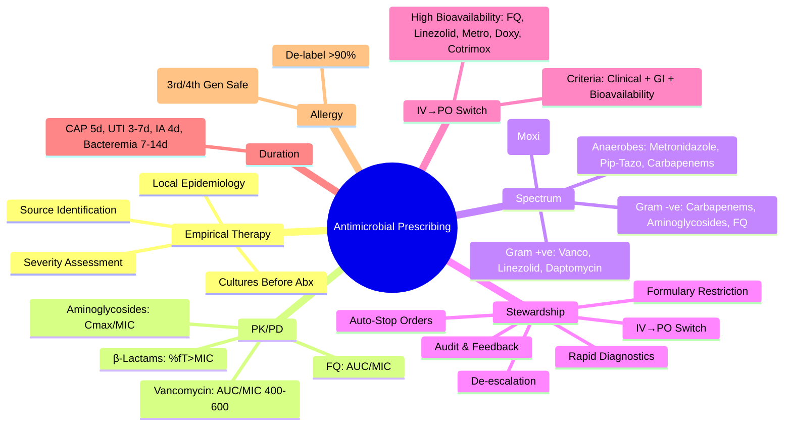

---
tags: [medicine, davidson, infectious-disease, antimicrobial, prescribing, stewardship, fcps, mrcp]
davidson_chapter: Chapter 11: Infectious disease
status: full-fcps-mrcp-note
priority: high
exam_relevance: "FCPS: Essential | MRCP: Core | Empirical therapy, culture-guided therapy, PK/PD principles, resistance patterns, stewardship, allergy management"
see_also: "[[Sepsis and Septic Shock]], [[Community-Acquired Pneumonia (CAP)]], [[Healthcare-Associated Infections]], [[Antimicrobial Stewardship / Resistance]]"
created: 2025-06-17
modified: 2025-06-17
---

# Antimicrobial Prescribing Principles

> [!info] **Davidson Ch 11 Alignment**: Infectious Disease → Principles of Infectious Disease → Antimicrobial Chemotherapy
> **FCPS/MRCP Focus**: Empirical vs directed therapy, PK/PD principles, spectrum of activity, resistance mechanisms, stewardship, allergy cross-reactivity

---

## 🎯 Learning Objectives

- [ ] Apply **empirical therapy** principles: severity assessment, likely pathogens, local epidemiology
- [ ] Interpret **culture & susceptibility** results: MIC, breakpoints, S/I/R categories
- [ ] Apply **PK/PD principles**: time-dependent vs concentration-dependent killing, AUC/MIC, Cmax/MIC
- [ ] Select **appropriate agents**: spectrum, tissue penetration, toxicity, interactions
- [ ] Implement **stewardship**: de-escalation, IV-to-oral switch, duration optimisation
- [ ] Manage **drug allergy**: cross-reactivity, desensitisation, alternative agents
- [ ] Adjust for **special populations**: renal/hepatic impairment, pregnancy, obesity, extremes of age

---

## 📖 Principles of Antimicrobial Therapy

```mermaid
flowchart TD
    A[Suspected Infection] --> B{Clinical Severity}
    B -->|Severe/Septic Shock| C[**Immediate Empirical Therapy** Broad-spectrum + Source Control]
    B -->|Stable| D[**Targeted/Mild Empirical** Narrow-spectrum if possible]
    C & D --> E[**Obtain Cultures** Before Antibiotics when possible]
    E --> F[**Monitor Response** Clinical + Labs + Biomarkers (PCT, CRP)]
    F --> G{**Culture Results**}
    G -->|Positive| H[**Directed Therapy** Narrow spectrum per susceptibilities]
    G -->|Negative| I[**Reassess** De-escalate or Stop if no infection]
    H & I --> J[**Duration Optimisation** Shortest effective course]
```

---

## 📖 Empirical Therapy Principles

### Stepwise Approach

| Step | Action | Rationale |
|------|--------|-----------|
| **1. Assess Severity** | **Severe/Septic Shock** → Immediate broad-spectrum IV | Mortality ↑ with each hour of delay |
| **2. Identify Likely Source** | Clinical syndrome → Predict likely pathogens | CAP vs UTI vs IA vs CNS guide empiric choice |
| **3. Assess Host Factors** | Immunocompromise, recent ABX, travel, device, allergy | Alters pathogen spectrum & resistance risk |
| **4. Check Local Epidemiology** | **Local Antibiogram** → Resistance patterns | Guides spectrum selection |
| **4. Start Empirical Therapy** | **Broad if severe, Narrow if stable** | Balance efficacy vs resistance/C. diff risk |
| **6. Obtain Cultures First** | **Before 1st dose** (blood, urine, sputum, tissue) | Enables de-escalation |
| **7. Monitor & Reassess** | **48-72h** → De-escalate/stop based on cultures/clinical | Limit resistance & toxicity |

> [!tip] **Empirical ≠ Blind**. Always base on syndrome, epidemiology, host factors. **Cultures before antibiotics** (except septic shock - don't delay >45 min).

---

## 📖 Common Empirical Regimens (Adults)

### Community-Acquired Infections

| Syndrome | 1st Line (Low Resistance Areas) | Alternatives (Penicillin Allergy / Resistance) |
|----------|--------------------------------|----------------------------------------------|
| **CAP (Outpatient)** | Amoxicillin 500-1000mg TDS OR Doxycycline 100mg BD | Clarithromycin 500mg BD |
| **CAP (Inpatient, Non-severe)** | Co-amoxiclav 1.2g TDS IV OR Ceftriaxone 2g OD IV | Levofloxacin 500mg OD IV |
| **CAP (Severe/ICU)** | Ceftriaxone 2g OD + Clarithromycin 500mg BD IV | Levofloxacin 500mg OD + Azithromycin 500mg OD |
| **UTI (Uncomplicated)** | Nitrofurantoin 100mg MR BD 5d / Trimethoprim 200mg BD 3d | Fosfomycin 3g single dose |
| **UTI (Complicated/Pyelonephritis)** | Ceftriaxone 2g OD IV / Ciprofloxacin 500mg BD (if susceptible) | Gentamicin 5mg/kg OD / Piperacillin-tazobactam |
| **Cellulitis (Non-purulent)** | Flucloxacillin 1g QDS IV / Co-amoxiclav 1.2g TDS IV | Clindamycin 600mg TDS IV |
| **Animal/Human Bite** | Co-amoxiclav 1.2g TDS IV/PO | Metronidazole 400mg TDS + Doxycycline 100mg BD |
| **Community-Acquired Intra-abdominal** | Co-amoxiclav 1.2g TDS IV / Piperacillin-tazobactam 4.5g TDS | Meropenem 1g TDS (if severe/resistant) |

### Hospital-Acquired / High-Risk

| Syndrome | Preferred Empirical Regimen | Key Addition |
|----------|----------------------------|--------------|
| **HAP/VAP (Non-MDR risk)** | Piperacillin-tazobactam 4.5g TDS / Ceftriaxone 2g OD | Add Vancomycin if MRSA risk |
| **HAP/VAP (MDR Risk)** | Meropenem 1g TDS / Piperacillin-tazobactam + Aminoglycoside | +/- Inhaled Colistin/Polymyxin |
| **Febrile Neutropenia** | Piperacillin-tazobactam 4.5g TDS / Meropenem 1g TDS | Add Vancomycin if line/Hickman/MRSA known |
| **Sepsis Unknown Source** | Piperacillin-tazobactam 4.5g TDS / Meropenem 1g TDS | + Vancomycin if MRSA risk |
| **Suspected IA** | Piperacillin-tazobactam 4.5g TDS / Meropenem 1g TDS | + Metronidazole if not covered |

> [!warning] **Local Antibiogram Essential**. Above are examples - **always consult local guidelines & antibiogram**.

---

## 📖 PK/PD Principles

| Drug Class | PK/PD Index | Dosing Strategy | Examples |
|------------|-------------|-----------------|----------|
| **β-Lactams** (Penicillins, Cephalosporins, Carbapenems) | **Time-dependent** → **%fT>MIC** | **Prolonged/Continuous Infusion** (e.g. Meropenem 2g over 3h q8h) | Piperacillin-tazobactam, Meropenem, Ceftriaxone |
| **Aminoglycosides** | **Concentration-dependent** → **Cmax/MIC** | **Once-Daily Dosing** (Extended Interval) | Gentamicin, Amikacin, Tobramycin |
| **Fluoroquinolones** | **Concentration-dependent** → **AUC/MIC** | **Once-Daily Dosing** | Ciprofloxacin, Levofloxacin, Moxifloxacin |
| **Glycopeptides** (Vancomycin, Teicoplanin) | **Time-dependent** → **AUC/MIC** (AUC/MIC ≥400) | **Continuous Infusion** (Vancomycin) or TDM-guided intermittent | Vancomycin |
| **Azoles** (Fluconazole, Voriconazole) | **Time-dependent** | **Loading Dose** → Maintenance | Voriconazole |
| **Echinocandins** | **Concentration-dependent** | **Once Daily** | Caspofungin, Micafungin, Anidulafungin |

> [!tip] **Extended/Continuous Infusion β-Lactams**: ↑ fT>MIC, ↓ Nephrotoxicity (Pip-Tazo), ↑ Clinical Cure in Severe Sepsis.

---

## 📖 Spectrum of Activity Quick Reference

| Class | Gram +ve Cocci | Gram -ve Bacilli | Atypicals | Anaerobes | Key Exceptions |
|-------|----------------|------------------|-----------|-----------|----------------|
| **Penicillins** (Pen G, Ampicillin) | +++ (MSSA, Strep) | - (H. influenzae +) | - | + (Oral anaerobes) | MSSA only, No Enterobacterales |
| **Aminopenicillins** (Amp/Amox) | ++ | + (H.inf, M.cat) | - | + | No Pseudomonas, No ESBL |
| **β-Lactam/β-Lactamase Inhibitor** (Co-amoxiclav, Pip-Tazo) | +++ | +++ (incl. Pseudomonas for Pip-Tazo) | - | +++ | Not for ESBL (except Pip-Tazo partial) |
| **1st Gen Cephalosporins** | +++ | - | - | + | Skin/Soft tissue, Surgical Prophylaxis |
| **3rd Gen Cephalosporins** (Ceph/Ceftriaxone) | ++ | +++ (Enterobacterales) | - | - | No Pseudomonas (Ceftazidime/Cefepime) |
| **4th Gen / Anti-Pseudomonal** (Cefepime) | ++ | +++ (incl. Pseudomonas) | - | - | CRT often needed |
| **Carbapenems** | +++ | +++ (incl. ESBL, Pseudomonas) | - | +++ | **Last Resort**, Avoid ESBL colonisation |
| **Fluoroquinolones** (Cipro/Levo/Moxi) | + (Moxi +++) | +++ | +++ (Moxi) | - (Moxi +) | Resistance rising, ↓ C. diff risk with Moxi |
| **Glycopeptides** (Vanco/Teico) | +++ (MRSA, CoNS) | - | - | - | No Gram -ve activity |
| **Oxazolidinones** (Linezolid) | +++ (VRE, MRSA) | - | +++ | - | Myelosuppression (long-term) |
| **Lipopeptides** (Daptomycin) | +++ | - | - | - | **Inactivated by Surfactant** (No Pneumonia) |
| **Metronidazole** | - | - | - | +++ | **Anaerobe Specialist** |
| **Carbapenems** | +++ | +++ | - | +++ | **Carbapenem-Sparing** Stewardship |

---

## 📖 Renal & Hepatic Dose Adjustment

| Drug | CrCl 30-50 | CrCl 15-30 | CrCl <15 / HD | Hepatic Impairment |
|------|------------|------------|---------------|-------------------|
| **Vancomycin** | ↓ Dose / ↑ Interval | ↓ Dose / ↑ Interval | Post-HD Dosing | No Adjustment |
| **Gentamicin** | ↓ Dose / ↑ Interval | ↑ Interval | Post-HD | No Adjustment |
| **Meropenem** | Standard | 1g 12hly (CrCl<30) | 500mg 12hly post-HD | No Adjustment |
| **Piperacillin-tazobactam** | Standard | 2.25g Q6H (CrCl<30) | 2.25g 12hly post-HD | No Adjustment |
| **Vancomycin (Continuous)** | Monitor AUC | Monitor AUC | Post-HD Only | Monitor |
| **Linezolid** | No Adjustment | No Adjustment | No Adjustment | No Adjustment |
| **Linezolid** | No Adjustment | No Adjustment | No Adjustment | No Adjustment |

> [!warning] **Dose Adjust ≠ Omit**. Therapeutic Drug Monitoring (TDM) Essential for Vancomycin, Aminoglycosides.

---

## 📖 IV-to-Oral Switch Criteria

| Criteria | Examples |
|----------|----------|
| **Clinical Improvement** | Afebrile 24-48h, ↓ WBC/CRP, Tolerating Oral |
| **GI Function** | Tolerating Oral/NG, No Obstruction/Ileus |
| **Bioavailability** | **High (>90%)**: Fluoroquinolones, Linezolid, Metronidazole, Cotrimoxazole, Doxycycline, Clindamycin |
| **Bioavailability** | **Moderate (50-90%)**: Amoxicillin, Co-amoxiclav, Cephalexin, Metronidazole, Clindamycin |
| **Avoid IV→PO** | **Low Bioavailability**: β-Lactams (except above), Glycopeptides, Aminoglycosides, Carbapenems |

> [!tip] **IV-to-Oral Switch Saves**: Cost, IV Access Complications, LOS, Nursing Time. **Implement by Day 3-5** if criteria met.

---

## 📖 Duration of Therapy (Evidence-Based)

| Infection | Recommended Duration | Evidence |
|-----------|---------------------|----------|
| **CAP (Non-severe)** | **5 days** | CAP-IT, PTC |
| **CAP (Severe)** | **5-7 days** | |
| **UTI (Uncomplicated Cystitis)** | **3 days (Women) / 7 days (Men)** | |
| **Pyelonephritis** | **7-10 days** | |
| **Uncomplicated SSTI** | **5 days** | |
| **Cellulitis** | **5-6 days** | |
| **Intra-abdominal (Adequate Source Control)** | **4 days** | STOP-IT Trial |
| **Catheter-related BS** | **7 days** (Catheter Removed) / **14 days** (Retained) | |
| **Bacteremia (Uncomplicated)** | **7 days** | BALANCE Trial |
| **S. aureus Bacteremia (Uncomplicated)** | **14 days** | |
| **Infective Endocarditis** | **4-6 weeks** (Valve Dependent) | |
| **Osteomyelitis** | **6 weeks** (Chronic) / **4-6 weeks** (Acute) | |
| **Septic Arthritis** | **2-4 weeks** (Joint Dependent) | |

> [!tip] **Shorter = Better**. **Short Course = Less Resistance, Less C. diff, Less Toxicity, Lower Cost**. **Stop Antibiotics When Clinical Criteria Met**.

---

## 📖 Allergy & Cross-Reactivity

| Allergy | Cross-Reactivity Risk | Alternative |
|---------|----------------------|-------------|
| **Penicillin (IgE)** | **~1-2% Cross-Reactivity** with 1st Gen Cephalosporins (Similar R1 Side Chain); **<1% with 3rd/4th Gen** | **Avoid Penicillins**; **3rd/4th Gen Cephalosporins Generally Safe** (Skin Test if Severe) |
| **Cephalosporin** | **Cephalosporin-Cephalosporin** (Shared R1); **Low Penicillin Cross-Reactivity** (<1%) | **Avoid Same Class**; Carbapenems ~1% Cross-Reactivity |
| **Carbapenem** | **~1% Cross-Reactivity with Penicillins** | **Usually Safe** if Penicillin Allergy (Skin Test if Severe) |
| **Sulfonamide** | **Sulfonamide-Sulfonamide** (Not with Sulfones/Dapsone) | Avoid All Sulfonamides |
| **Fluoroquinolone** | **Class Effect** (Cross-Reactivity Within Class) | Avoid All FQs |

> [!warning] **"Penicillin Allergy" Over-Reported**. **>90% Not Truly Allergic** on Testing. **De-labeling** Reduces Broad-Spectrum Use, C. diff, Resistance.

---

## 📖 Antimicrobial Stewardship Core Interventions

| Intervention | Description | Impact |
|--------------|-------------|--------|
| **Prospective Audit & Feedback** | ID Pharmacist/Physician Review → Recommendations | ↓ ABX Use 20-30%, ↓ Resistance |
| **Formulary Restriction** | Pre-authorization for Restricted Agents (Carbapenems, Colistin, Newer Agents) | ↓ Resistance Selection |
| **IV-to-Oral Switch Protocol** | Automatic Switch Criteria at 48-72h | ↓ LOS, Cost, IV Complications |
| **Automatic Stop Orders** | Default Duration (e.g., 5d CAP, 7d UTI) | Prevents Prolonged Courses |
| **De-escalation Protocols** | Mandatory Review at 48-72h | ↓ Broad-Spectrum Exposure |
| **Rapid Diagnostics** (PCR, MALDI-TOF, Syndromic Panels) | **Rapid ID + AST** → Early Targeted Therapy | ↓ Broad-Spectrum Days |
| **Education & Guidelines** | Local Guidelines, Prescriber Education | Sustained Culture Change |

---

## 📖 Common Clinical Scenarios - Quick Reference

| Scenario | Key Action |
|----------|------------|
| **Penicillin Allergy + Need for Cephalosporin** | **3rd/4th Gen Cephalosporin Safe** (Cross-Reactivity <1%); **Skin Test if Anaphylaxis History** |
| **MRSA Bacteremia** | **Vancomycin (AUC 400-600)** ± Daptomycin/Linezolid if Failure/Intolerance |
| **ESBL Bacteremia** | **Carbapenem (Meropenem 1g TDS)**; Avoid β-Lactam/BLI (Inoculum Effect) |
| **CRE Bacteremia** | **Combination**: High-Dose Meropenem + Polymyxin/Tigecycline/Aminoglycoside ± Ceftazidime-Avibactam |
| **C. diff Infection** | **Oral Vancomycin 125mg QID** (Severe: +IV Metronidazole + Rectal Vancomycin) |
| **Febrile Neutropenia** | **Pip-Taz 4.5g TDS / Meropenem 1g TDS**; +Vancomycin if Line/Mucositis/MRSA Known |
| **Prosthetic Joint Infection** | **Rifampin-Based Combination** (Staph); **Debridement + Long Course** |
| **Endocarditis (Native Valve)** | **Native Valve: Pen G + Gent (Strep) / Vancomycin + Gent (Staph)** |

---

## 💡 FCPS/MRCP High-Yield Summary

| Topic | Key Point |
|-------|-----------|
| **Empirical Therapy** | **Cultures First**, Broad if Severe, Narrow if Stable, Local Antibiogram |
| **PK/PD** | **β-Lactams = Time-Dependent (Prolonged Infusion)**; **Aminoglycosides/FQ = Concentration-Dependent** |
| **IV→Oral Switch** | **Criteria**: Clinical Improvement, GI Function, Bioavailability >90% (FQ, Linezolid, Metronidazole, Doxy) |
| **Duration** | **Short Course** Evidence-Based (5d CAP, 7d UTI, 4d IA, 7d Bacteremia) |
| **Penicillin Allergy** | **Cross-Reactivity ~1-2% (1st Gen Ceph)**; **3rd/4th Gen Safe** |
| **Stewardship Core** | **Audit & Feedback, Formulary Restriction, IV→PO, Auto-Stop, De-escalation, Rapid Diagnostics** |
| **Renal Dose Adjust** | **Vancomycin, Aminoglycosides, Carbapenems, Pip-Tazo** - TDM Essential |
| **IV→PO Switch Criteria** | **Clinical Improvement + GI Function + High Bioavailability (>90%)** |
| **Duration** | **Short Course = Less Resistance, Less C. diff, Less Toxicity** |
| **Penicillin Allergy** | **Skin Test if Anaphylaxis**; **De-label >90%** |

---

## ❓ Viva Questions

1. **What are the PK/PD indices for β-Lactams, Aminoglycosides, Fluoroquinolones, Vancomycin?**
   - **β-Lactams**: %fT>MIC (Time-dependent); **Aminoglycosides**: Cmax/MIC (Concentration-dependent); **Fluoroquinolones**: AUC/MIC; **Vancomycin**: AUC/MIC (Target 400-600)

2. **When do you switch IV to Oral antibiotics?**
   - **Clinical Improvement (Afebrile 24-48h, ↓WBC/CRP), GI Function Intact, Bioavailability >90%** (Fluoroquinolones, Linezolid, Metronidazole, Doxycycline, Cotrimoxazole)

3. **What is the recommended duration for CAP, UTI, Intra-abdominal Infection?**
   - **CAP: 5 days**; **UTI (Cystitis): 3d (F) / 7d (M)**; **Pyelonephritis: 7-10d**; **Intra-abdominal (Source Control): 4 days**

4. **What is the cross-reactivity between Penicillin and Cephalosporins?**
   - **~1-2% with 1st Gen Cephalosporins**; **<1% with 3rd/4th Gen**; **Shared R1 Side Chain**

5. **When do you use Extended/Continuous Infusion β-Lactams?**
   - **Severe Sepsis, High MIC Organisms, Prolonged fT>MIC Needed**; **Meropenem 2g over 3h q8h, Pip-Tazo 4.5g over 4h q6h**

6. **What is the first-line empirical therapy for Febrile Neutropenia?**
   - **Piperacillin-Tazobactam 4.5g TDS IV** or **Meropenem 1g TDS**; **Add Vancomycin if Line/MRSA/Catheter**

7. **When do you use Combination Therapy for CRE?**
   - **High-Dose Meropenem + Polymyxin/Tigecycline/Aminoglycoside** ± Ceftazidime-Avibactam

8. **What is the recommended duration for Uncomplicated S. aureus Bacteremia?**
   - **14 Days** (2 Weeks); **Complicated: 4-6 Weeks**

8. **When do you use Idarucizumab vs Andexanet Alfa?**
   - **Idarucizumab = Dabigatran Only (5g IV)**; **Andexanet Alfa = Factor Xa Inhibitors (Rivaroxaban, Apixaban, Edoxaban)**

9. **What is the dose of Vancomycin for MRSA Bacteremia and Target AUC/MIC?**
   - **15-20 mg/kg q8-12h (Adjusted by AUC/MIC)**; **Target AUC/MIC 400-600**

10. **When do you use Extended Infusion β-Lactams?**
    - **Severe Sepsis, High MIC, Critically Ill**; **Meropenem 2g over 3h q8h, Pip-Tazo 4.5g over 4h q6h**; **↑ fT>MIC, ↓ Nephrotoxicity**

---

## 🧠 Confusions & Mnemonics

| Confusion | Clarification |
|-----------|---------------|
| **Time vs Concentration Dependent** | **β-Lactams = Time (fT>MIC)**; **Aminoglycosides/FQ = Concentration (Cmax/MIC, AUC/MIC)** |
| **Vancomycin TDM** | **AUC/MIC 400-600** (Not Trough-Only); **AUC = AUC24 / MIC** |
| **Penicillin Allergy ≠ Cephalosporin Allergy** | **Cross-Reactivity ~1-2% (1st Gen) <1% (3rd/4th Gen)**; **De-label if Low Risk** |
| **IV → PO Switch** | **Not Just Bioavailability** - Need Clinical Improvement + GI Function |
| **Duration** | **Shorter is Better** (5d CAP, 7d UTI, 4d IA, 7d Bacteremia) |

| Mnemonic | Meaning |
|----------|---------|
| **"Time for β-Lactams, Concentration for Aminoglycosides/FQ"** | PK/PD |
| **"AUC 400-600 = Vanco Target"** | Vancomycin TDM |
| **"Penicillin Allergy ≠ Cephalosporin Allergy (3rd/4th Gen Safe)"** | Cross-Reactivity |
| **"Short Course = Less Resistance"** | Duration |
| **"Cultures Before Antibiotics"** | Stewardship |

---

## 🗺️ Mind Map



---

## 📋 One-Page Revision Card

| **ANTIMICROBIAL PRESCRIBING – FCPS/MRCP REVISION CARD** |
|----------------------------------------------------------|
| **Empirical Rx**: Cultures 1st → Severity-Based Spectrum → Local Antibiogram |
| **PK/PD**: β-Lactams = %fT>MIC (Prolonged Infusion); Aminoglycosides = Cmax/MIC (Once Daily); FQ = AUC/MIC; Vancomycin = AUC/MIC 400-600 |
| **IV→PO Switch**: Clinical Improvement + GI Intact + Bioavailability >90% (FQ, Linezolid, Metronidazole, Doxy, Cotrimox) |
| **Duration**: CAP 5d, UTI 3-7d, IA 4d, Bacteremia 7-14d, Endocarditis 4-6wks |
| **Allergy**: PCN Allergy ≠ Ceph Allergy (3rd/4th Gen Safe); De-label >90% |
| **Stewardship**: Audit & Feedback, Formulary Restriction, IV→PO, Auto-Stop, De-escalation, Rapid Diagnostics |
| **Renal Adjust**: Vanco/Aminoglycosides/Carbapenems/Pip-Tazo - TDM Essential |
| **IV→PO**: Clinical Improvement + GI Function + High Bioavailability |

---

## 📅 Spaced Repetition Tracker

| Review | Date | Score (1-5) | Next Review |
|--------|------|-------------|-------------|
| Day 1 | 2025-06-17 | | 2025-06-18 |
| Day 3 | | | |
| Day 7 | | | |
| Day 15 | | | |
| Day 30 | | | |

---

## 🎯 Must Know / Should Know / Nice to Know

| Level | Content |
|-------|---------|
| **Must Know** | PK/PD indices, Empirical therapy principles, IV→PO criteria, Duration guidelines, Penicillin allergy cross-reactivity, Stewardship interventions, Renal dose adjustment, IV→PO switch criteria |
| **Should Know** | Extended infusion β-lactam evidence, TDM methods (AUC vs Trough), De-escalation algorithms, Rapid diagnostic impact, Drug interaction specifics, Outpatient parenteral therapy (OPAT), De-labeling protocols |
| **Nice to Know** | PK/PD modelling (Monte Carlo), Novel β-lactam/β-lactamase inhibitors (Cefiderocol, Imipenem-Relebactam), Resistance mechanisms (MCR, NDM, OXA), Antimicrobial pipeline, Pharmacoeconomics, AI-guided prescribing |

---

## ✅ Self-Test Scorecard

| Section | Score (0-10) | Notes |
|---------|--------------|-------|
| PK/PD Principles | | |
| Empirical Therapy Selection | | |
| Spectrum of Activity | | |
| IV-to-Oral Switch | | |
| Duration Guidelines | | |
| Allergy Cross-Reactivity | | |
| Stewardship Interventions | | |
| Renal/Hepatic Dosing | | |
| Viva Questions | | |

---

## 🔗 Local Navigation

- **Previous**: [[Sepsis and Septic Shock]]
- **Next**: [[Fever in Returned Traveller / FUO]]
- **Section Hub**: [[Infectious Disease MOC]]
- **MOC**: [[Infectious Disease MOC]]
- **Template**: [[../Templates/Hematology Topic Template]]

---

*Generated for FCPS/MRCP exam preparation. Based on Davidson Medicine 24th Ed Chapter 11.*