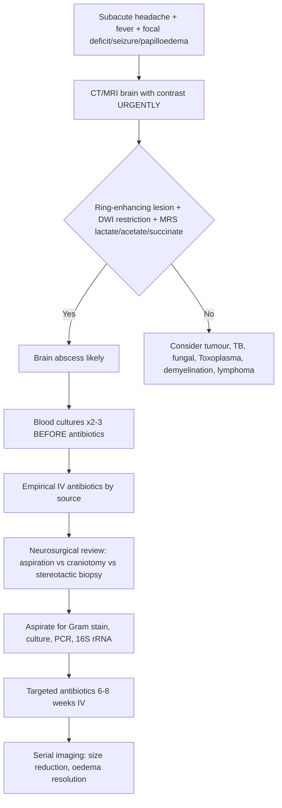
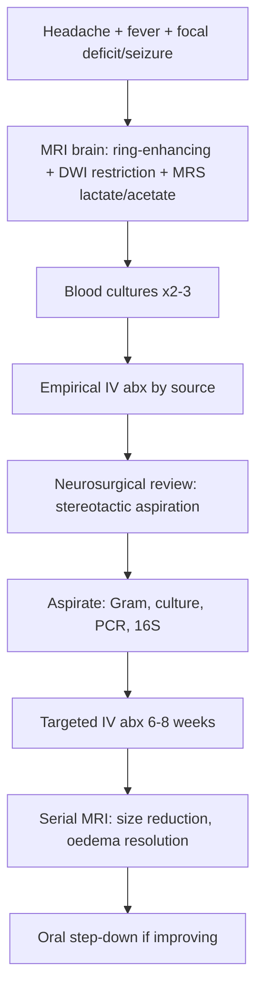

---
tags: [medicine, infectious-disease, davidson, chapter13, cns, brain-abscess, fcps, mrcp]
davidson_chapter: Chapter 13: Infectious disease
topic_category: Central Nervous System Infections Domain
status: full-fcps-mrcp-topic-note
---

# Brain Abscess

Related: [[Acute Bacterial Meningitis]], [[Tuberculous Meningitis]], [[Sepsis and Septic Shock]], [[Infective Endocarditis]], [[Post-Transplant Infections]]

> [!important]
> **Brain abscess = focal suppurative infection within brain parenchyma.** **Ring-enhancing lesion on imaging with surrounding oedema.** **Polymicrobial (anaerobes, streptococci, staphylococci).** **Neurosurgical drainage + 6–8 weeks IV antibiotics.** **Source identification critical (sinusitis, otitis, dental, endocarditis, pulmonary, trauma).**

## Learning Objectives
- Recognise subacute presentation: headache, fever, focal deficits, seizures, papilloedema
- Identify predisposing sources: contiguous spread (sinus/ear/dental), haematogenous, trauma/surgery
- Select empirical antibiotics covering likely pathogens by source
- Interpret imaging: ring-enhancing lesion, DWI restriction, MR spectroscopy (lactate, acetate, succinate)
- Manage raised ICP, seizures, timing of surgical intervention
- Duration and monitoring of antibiotic therapy

## Definition
**Brain abscess** = encapsulated collection of pus within brain parenchyma. **Stages:** cerebritis (days 1–3) → capsule formation (days 10–14) → mature abscess. **Incidence:** ~0.5–1/100,000; higher in immunocompromised, cyanotic heart disease, IVDU.

## Core Microbiology — Aetiology by Source
| Source / Route | Common Pathogens | Notes |
|----------------|------------------|-------|
| **Contiguous spread** (sinusitis, otitis, mastoiditis, dental) | **Anaerobes** (Bacteroides, Peptostreptococcus, Fusobacterium, Prevotella), **Streptococci** (S. milleri group, viridans), **Enterobacteriaceae** | Frontal lobe (sinusitis), temporal lobe/cerebellum (otitis) |
| **Haematogenous** (cyanotic CHD, endocarditis, pulmonary AVM, IVDU) | **Streptococci** (viridans, S. milleri), **Staphylococci** (S. aureus), **Anaerobes**, **Gram-negatives**, **Fungi** (Aspergillus, Candida), **Nocardia** | Multiple abscesses common (MCA territory); septic emboli |
| **Post-trauma / Post-neurosurgery** | **S. aureus** (MSSA/MRSA), **CoNS**, **Gram-negatives** (Pseudomonas, Enterobacter), **Anaerobes** | Early (<1m) vs late (>1m) |
| **Immunocompromised** (HIV, transplant, steroids, chemo) | **Toxoplasma** (HIV CD4<100), **Nocardia**, **Aspergillus**, **Mucorales**, **Cryptococcus**, **Listeria**, **TB**, **Lymphoma** (mimic) | **Toxoplasma #1 in HIV CD4<100** — ring-enhancing, multiple, basal ganglia |
| **Cryptogenic** | Streptococci, anaerobes | No source identified (~15–25%) |

## Normal Values / Important Cut-offs
| Parameter | Brain Abscess | Tumour / Necrotic Tumour | Demyelination |
|-----------|---------------|--------------------------|---------------|
| **CT/MRI** | **Ring-enhancing lesion, smooth thin wall, surrounding oedema** | Irregular thick wall, heterogeneous enhancement | Open-ring / incomplete ring, perivenular |
| **DWI** | **Restricted diffusion (pus = high viscosity)** | Variable (not typically restricted) | Not restricted |
| **MR Spectroscopy** | **Lactate ↑, acetate ↑, succinate ↑, alanine ↑; NO NAA, NO creatine, NO choline** | Choline ↑, NAA ↓, lipids/lactate ↑ | Choline ↑, NAA ↓ |
| **CSF** | **Usually normal or mild neutrophilic pleocytosis; protein ↑; DO NOT LP if mass effect** | Variable | Oligoclonal bands, IgG index ↑ |
| **Blood cultures** | Positive 10–25% (haematogenous) | Negative | Negative |

> [!warning]
> **Contraindication to LP:** Mass effect, midline shift, papilloedema, GCS<10 — risk of herniation. **Diagnosis by imaging + blood cultures + surgical aspirate.**

## Clinical Features
| Feature | Frequency | Notes |
|---------|-----------|-------|
| **Headache** | 70–90% | Progressive, severe, worse with Valsalva |
| **Fever** | 50–70% | May be absent in immunocompromised, elderly |
| **Focal neurological deficits** | 50–70% | Hemiparesis, aphasia, visual field defect (depends on location) |
| **Seizures** | 25–50% | Focal or generalised; may be presenting feature |
| **Altered mental status** | 30–50% | Late sign = raised ICP / herniation |
| **Papilloedema** | 25–40% | Sign of raised ICP |
| **Nuchal rigidity** | <20% | If rupture → ventriculitis → meningism |

## Approach / Algorithm


## Investigations
| Test | Role |
|------|------|
| **MRI brain (contrast, DWI, MRS)** | **Gold standard**: ring-enhancement, DWI restriction (pus), MRS (lactate, acetate, succinate = abscess; choline/NAA = tumour) |
| **CT brain (contrast)** | Alternative if MRI unavailable; ring-enhancement, oedema |
| **Blood cultures (×2–3 sets)** | Before antibiotics; positive in haematogenous spread |
| **Surgical aspirate** | **Gram stain, aerobic/anaerobic culture, PCR, 16S rRNA, fungal AFB, Nocardia** |
| **CRP, PCT, FBC, U&E, LFTs, coag** | Baseline, monitoring |
| **Echocardiogram (TTE/TOE)** | If haematogenous suspected (endocarditis, CHD) |
| **Chest CT** | If pulmonary source suspected (AVM, abscess, tumour) |
| **Sinuses/ears/dental imaging** | If contiguous spread suspected |
| **HIV test, CD4** | If immunocompromised (Toxoplasma, fungal, Nocardia) |
| **Serology (Toxoplasma IgG)** | HIV CD4<100 with ring-enhancing lesions |

## Empirical Antibiotic Therapy (Start AFTER Blood Cultures)
| Clinical Scenario | Regimen | Rationale |
|-------------------|---------|-----------|
| **Community-acquired (contiguous: sinus/ear/dental)** | **Ceftriaxone 2g IV 12h + Metronidazole 500mg IV 8h + Vancomycin 15–20mg/kg IV 6h** | Streptococci, anaerobes, staphylococci |
| **Haematogenous (endocarditis, cyanotic CHD, IVDU, pulmonary)** | **Vancomycin 15–20mg/kg IV 6h + Ceftriaxone 2g IV 12h + Metronidazole 500mg IV 8h** (+/- Meropenem if Gram-neg suspected) | Staphylococci, streptococci, anaerobes, Gram-negatives |
| **Post-neurosurgery / Trauma (<1 month)** | **Vancomycin 15–20mg/kg IV 6h + Meropenem 2g IV 8h** | MSSA/MRSA, Gram-negatives (Pseudomonas), CoNS |
| **Post-neurosurgery / Trauma (>1 month)** | **Vancomycin 15–20mg/kg IV 6h + Ceftriaxone 2g IV 12h** | Less Pseudomonas risk late |
| **Immunocompromised (HIV CD4<100)** | **Pyrimethamine + Sulfadiazine + Folinic acid (for Toxoplasma) + broad antibacterial** | Toxoplasma #1; empirical anti-Toxoplasma if multiple ring-enhancing |
| **Suspected Nocardia** | **TMP-SMX high-dose (15–20mg/kg TMP IV/PO 6–8h) + Meropenem/Imipenem + Amikacin** | Nocardia: sulfonamides first-line |
| **Suspected Fungal (Aspergillus, Mucorales)** | **Voriconazole/L-AmB per fungal pneumonia guidelines** | See Fungal Pneumonias note |

> [!important]
> **Metronidazole** essential for anaerobic coverage in contiguous spread. **Vancomycin** for staphylococcal coverage (MSSA/MRSA). **Ceftriaxone/meropenem** for streptococci/Gram-negatives. **Duration 6–8 weeks IV** after surgical drainage.

## Targeted Therapy (Post-Aspirate Culture)
| Pathogen | Targeted Regimen | Duration |
|----------|------------------|----------|
| **S. milleri / viridans streptococci** | Penicillin G 24MU/day IV ÷4–6h OR Ceftriaxone 2g 12h | 6–8 weeks |
| **Anaerobes (Bacteroides, Fusobacterium, etc.)** | Metronidazole 500mg IV 8h + Penicillin/Ceftriaxone | 6–8 weeks |
| **S. aureus (MSSA)** | Flucloxacillin 2g IV 4h OR Cefazolin 2g IV 8h | 6–8 weeks |
| **S. aureus (MRSA)** | Vancomycin 15–20mg/kg 6h (trough 15–20) OR Daptomycin 8–10mg/kg IV OD | 6–8 weeks |
| **Gram-negatives (Enterobacteriaceae)** | Ceftriaxone 2g 12h OR Meropenem 2g 8h (if ESBL) | 6–8 weeks |
| **Pseudomonas** | Meropenem 2g 8h + Ciprofloxacin 400mg IV 12h | 6–8 weeks |
| **Nocardia** | TMP-SMX high-dose + Meropenem/Imipenem + Amikacin | **12 months** (prolonged) |
| **Aspergillus** | Voriconazole 6mg/kg 12h ×2d → 4mg/kg 12h (TDM) | **8–12 weeks** |
| **Toxoplasma** | Pyrimethamine 75mg load → 25–50mg OD + Sulfadiazine 1–1.5g 6h + Folinic acid 10–25mg OD | **6 weeks after resolution** (then secondary prophylaxis) |

## Surgical Management
| Approach | Indications |
|----------|-------------|
| **Stereotactic aspiration** | **Preferred** for deep, eloquent, single, accessible abscess; diagnostic + therapeutic |
| **Craniotomy + excision** | Multiloculated, superficial, failed aspiration, cerebellar abscess (herniation risk), fungal (debulking) |
| **Burr hole drainage** | Limited access; less common now |
| **Ventriculostomy (EVD)** | Intraventricular rupture → ventriculitis, hydrocephalus |

> [!tip]
> **Stereotactic aspiration = lower morbidity, shorter stay, diagnostic yield.** **Total excision for fungal, multiloculated, cerebellar.** **Antibiotics continue 6–8w post-drainage.**

## Duration & Monitoring
| Parameter | Schedule |
|-----------|----------|
| **Antibiotics IV** | **6–8 weeks total** (including pre-drainage empirical) |
| **Oral step-down** | Sometimes used for last 2–4w (e.g., metronidazole PO, co-amoxiclav, linezolid PO) if clinical/radiological improvement |
| **MRI/CT** | Baseline, 1–2w post-drainage, then 2–4w intervals until resolution |
| **CRP, FBC, LFTs** | Weekly |
| **Vancomycin trough** | 2–3x/week (target 15–20 for CNS) |
| **Seizure prophylaxis** | Levetiracetam during acute phase; continue if seizures occurred |

## Complications
| Complication | Management |
|--------------|------------|
| **Rupture into ventricle** | **Ventriculitis, hydrocephalus, high mortality** → EVD + intraventricular antibiotics (vancomycin, gentamicin, amphotericin) + systemic antibiotics |
| **Raised ICP / Herniation** | Mannitol, hypertonic saline, hyperventilation, dexamethasone (controversial — may reduce capsule formation), surgical decompression |
| **Seizures** | Levetiracetam; long-term AED if recurrent |
| **Recurrence** | Repeat imaging, re-aspiration, extended antibiotics |
| **Empyema (subdural/epidural)** | Surgical drainage + antibiotics |
| **Neurological deficits** | Rehabilitation; may be permanent |

## Red Flags / Emergencies
- **Rapid neurosurgical deterioration** (GCS drop, pupil asymmetry) → herniation → emergency decompression
- **Intraventricular rupture** → sudden deterioration, meningism, hydrocephalus → EVD + intraventricular antibiotics
- **Cerebellar abscess** → high risk of tonsillar herniation → urgent posterior fossa decompression
- **Septic shock** (haematogenous source) → fluids, vasopressors, source control

## Differential Diagnosis (Ring-Enhancing Lesions)
| Condition | Key Differentiators |
|-----------|---------------------|
| **Brain abscess** | DWI restriction (pus), MRS: lactate/acetate/succinate, smooth thin ring, clinical infection |
| **Necrotic tumour (glioblastoma, metastasis)** | Irregular thick wall, MRS: choline↑, NAA↓, lipids; no DWI restriction |
| **Toxoplasmosis (HIV CD4<100)** | Multiple, basal ganglia, IgG +ve, responds to anti-Toxoplasma Rx in 2w |
| **TB (tuberculoma)** | Subacute, basal exudates, CSF low glucose, GeneXpert +ve, responds to anti-TB |
| **Fungal (Aspergillus, Mucorales)** | Immunocompromised, haemorrhagic, angioinvasion, galactomannan/CrAg |
| **Nocardia** | Immunocompromised, multiple, beading on imaging, TMP-SMX responsive |
| **Demyelination (tumefactive MS)** | Open ring, perivenular, CSF oligoclonal bands, no infection markers |
| **Primary CNS lymphoma (immunocompromised)** | Homogeneous enhancement (if not treated with steroids), EBV +ve CSF |
| **Infected aneurysm / mycotic aneurysm** | Vascular location, CT angiography, blood cultures +ve |

## Special Situations
| Situation | Adjustment |
|-----------|------------|
| **Pregnancy** | Ceftriaxone + metronidazole safe; avoid fluoroquinolones; vancomycin OK |
| **Renal impairment** | Adjust vancomycin, aminoglycosides, meropenem; ceftriaxone no adjustment |
| **Hepatic impairment** | Metronidazole caution; ceftriaxone (biliary excretion) |
| **Penicillin allergy (anaphylaxis)** | Meropenem + vancomycin (avoid cephalosporins if true IgE) |
| **HIV CD4<100** | Empirical anti-Toxoplasma + broad antibacterial if multiple ring-enhancing; brain biopsy if no response in 2w |

## FCPS/MRCP High-Yield Points
- **Brain abscess = ring-enhancing lesion + DWI restriction + MRS (lactate, acetate, succinate)**
- **Sources:** contiguous (sinus/ear/dental → anaerobes + streptococci), haematogenous (endocarditis, CHD, IVDU → multiple, MCA territory), post-trauma/surgery (S. aureus, Gram-neg)
- **Empirical abx:** Ceftriaxone + Metronidazole + Vancomycin (covers streptococci, anaerobes, staphylococci)
- **Stereotactic aspiration preferred** — diagnostic + therapeutic
- **Duration: 6–8 weeks IV antibiotics** after drainage
- **CSF usually normal** — **DO NOT LP if mass effect/papilloedema** (herniation risk)
- **Intraventricular rupture = catastrophe** → ventriculitis, hydrocephalus, EVD + intraventricular antibiotics
- **Toxoplasma in HIV CD4<100:** multiple ring-enhancing, basal ganglia, empirical pyrimethamine/sulfadiazine
- **Nocardia:** immunocompromised, TMP-SMX high-dose, 12-month duration
- **Cerebellar abscess:** high herniation risk → urgent posterior fossa decompression

## Common Viva Questions
1. **What is the classic imaging triad for brain abscess?** Ring-enhancing lesion, DWI restriction (pus), MR spectroscopy showing lactate/acetate/succinate peaks.
2. **What are the three main routes of infection?** Contiguous spread (sinus/ear/dental), haematogenous (endocarditis, CHD, IVDU), post-trauma/surgery.
3. **What is the empirical antibiotic regimen for a community-acquired brain abscess?** Ceftriaxone 2g 12h + Metronidazole 500mg 8h + Vancomycin 15–20mg/kg 6h.
4. **Why is lumbar puncture contraindicated in brain abscess?** Mass effect, risk of tonsillar/uncal herniation.
5. **What is the treatment duration?** 6–8 weeks IV antibiotics after surgical drainage.
6. **How do you differentiate brain abscess from necrotic tumour on MRI?** DWI restriction + MRS lactate/acetate/succinate = abscess; choline↑/NAA↓ + irregular thick wall = tumour.
7. **What is the management of intraventricular rupture?** EVD + intraventricular antibiotics (vancomycin, gentamicin) + systemic antibiotics.

## Common Confusions / Exam Traps
| Confusion | Clarification |
|-----------|---------------|
| LP safe in brain abscess | **CONTRAINDICATED** if mass effect, midline shift, papilloedema, GCS<10 |
| Single antibiotic sufficient | **Polymicrobial** — need streptococcal, anaerobic, staphylococcal coverage |
| Duration same as meningitis | **6–8 weeks IV** (meningitis 10–14d for pneumococcus) |
| Aspiration not needed if antibiotics started | **Surgical drainage essential** — antibiotics alone fail in encapsulated abscess |
| All ring-enhancing = abscess | **DWI restriction + MRS** distinguishes; tumour, TB, Toxoplasma, fungal, lymphoma mimic |
| Toxoplasma only in HIV | Also in transplant, steroids; but #1 in HIV CD4<100 |
| Nocardia = short course | **12 months** (prolonged) |
| Dexamethasone routine in abscess | **NOT routine** — may impair capsule formation; only for raised ICP/herniation |

## Mnemonics
- **BRAIN ABSCESS**: **B**lood cultures first, **R**ing-enhancing + **D**WI restriction + **M**RS lactate, **A**naerobes + **S**trep + **S**taph, **I**ntracranial source (sinus/ear), **N**eurosurgical aspiration
- **MRS ABScess**: **A**cetate, **B**succinate, **S**Lactate = **ABS** (NO NAA, NO creatine, NO choline)
- **SOURCES**: **S**inus/ear/dental (contiguous), **O**prehaematogenous (endocarditis, CHD), **U**trauma/surgery, **R**IVDU, **C**ryptic, **E**ndocarditis, **S**eptic emboli

## Mind Map
```mermaid
mindmap
  root((Brain Abscess))
    Pathogenesis
      Cerebritis (1-3d) -> Capsule (10-14d) -> Mature abscess
    Routes
      Contiguous (sinus/ear/dental) -> anaerobes + strep
      Haematogenous (endocarditis, CHD, IVDU) -> multiple, MCA
      Trauma/surgery -> Staph + Gram-neg
      Immunocompromised -> Toxo, Nocardia, fungal, TB
    Imaging
      Ring-enhancing, smooth thin wall
      DWI RESTRICTION (pus)
      MRS: lactate, acetate, succinate (NO NAA, creatine, choline)
    Treatment
      Aspiration (stereotactic preferred)
      Empirical: Ceftriaxone + Metronidazole + Vancomycin
      Targeted 6-8w IV
    Complications
      Ventricular rupture -> ventriculitis, EVD + intraventricular abx
      Raised ICP, herniation
      Seizures
      Recurrence
```

## Flowchart


## Suggested Visuals / Image Notes
- MRI: ring-enhancement, DWI restriction, MRS spectra (abscess vs tumour)
- CT: ring-enhancement with oedema
- Stereotactic aspiration procedure
- Intraventricular rupture appearance

## Suggested Video References
- Brain abscess imaging (RSNA/ECR)
- Stereotactic aspiration technique
- Intraventricular antibiotic administration
- Toxoplasma encephalitis in HIV

## One-Page Revision Summary
| Topic | Key Points |
|-------|------------|
| **Imaging** | Ring-enhancing + **DWI restriction** + **MRS lactate/acetate/succinate** |
| **Sources** | Contiguous (sinus/ear/dental: anaerobes+strep), Haematogenous (endocarditis/CHD/IVDU: multiple), Trauma/surgery (Staph+Gram-neg) |
| **Empirical abx** | Ceftriaxone 2g12h + Metronidazole 500mg8h + Vancomycin 15-20mg/kg6h |
| **Surgery** | Stereotactic aspiration (preferred); craniotomy if multiloculated/cerebellar/fungal |
| **Duration** | 6–8 weeks IV total |
| **LP** | **Contraindicated** if mass effect/papilloedema/GCS<10 |
| **Rupture into ventricle** | Catastrophe → EVD + intraventricular abx + systemic |
| **HIV CD4<100** | Toxoplasma #1: multiple, basal ganglia; empirical pyrimethamine/sulfadiazine |
| **Nocardia** | TMP-SMX high-dose + meropenem/amikacin ×12 months |
| **Cerebellar abscess** | Urgent posterior fossa decompression (herniation risk) |

## 24-Hour Recall Prompts
- Name the 3 routes of brain abscess infection.
- Write the empirical antibiotic regimen.
- What is the MRI signature of brain abscess (3 features)?
- Why is LP contraindicated?
- Duration of treatment?

## 7-Day / 15-Day / 30-Day Revision Tracker
- [ ] Day 1 completed
- [ ] 24-hour recall completed
- [ ] Day 7 revision completed
- [ ] Day 15 revision completed
- [ ] Day 30 revision completed

## Must Know / Should Know / Nice to Know
### Must Know
- Imaging: ring-enhancement + DWI restriction + MRS lactate/acetate/succinate
- 3 sources: contiguous, haematogenous, post-trauma/surgery
- Empirical: Ceftriaxone + Metronidazole + Vancomycin
- Stereotactic aspiration preferred
- 6–8 weeks IV antibiotics
- LP contraindicated with mass effect
- Ventricular rupture = EVD + intraventricular abx

### Should Know
- Pathogen by source
- Targeted regimens (Staph, anaerobes, Gram-neg, Nocardia, Toxoplasma, fungal)
- Cerebellar abscess urgency
- Differentiation from tumour, TB, Toxoplasma, lymphoma
- Seizure prophylaxis
- Oral step-down options

### Nice to Know
- MR spectroscopy details
- Intraventricular antibiotic dosing
- Paediatric considerations
- Outcome predictors
- Role of dexamethasone (controversial)

## My Weak Points
- [ ] Intraventricular antibiotic exact doses
- [ ] Nocardia exact combination and duration
- [ ] Toxoplasma prophylaxis after treatment
- [ ] Cerebellar abscess surgical timing

## Self-Test Scorecard
- Understanding: /10
- Recall: /10
- MCQ Performance: /10
- SBA Performance: /10
- Viva Confidence: /10
- Total: /50

> [!tip]
> Interpretation: <35 = weak topic, 35-44 = acceptable but insecure, 45+ = strong exam-ready topic.

## Exam Answer Modes
### Long Answer Skeleton
1. Definition, pathogenesis (cerebritis → capsule)
2. Aetiology by route (contiguous, haematogenous, trauma, immunocompromised)
3. Clinical features
4. Imaging: CT/MRI, DWI, MRS (key differentiators)
5. Investigations: blood cultures, aspirate, serology, source search
6. Empirical antibiotics by scenario
7. Surgical management: aspiration vs craniotomy
8. Targeted therapy, duration (6–8w IV)
9. Complications: ventricular rupture, raised ICP, seizures, recurrence
10. Special populations: immunocompromised (Toxoplasma, Nocardia, fungal), HIV

### Short Note Skeleton
- Ring-enhancing + DWI restrict + MRS lactate/acetate/succinate = abscess
- Sources: contiguous (anaerobes+strep), haematogenous (multiple), trauma (Staph)
- Empirical: Ceftriaxone + Metro + Vanco
- Aspiration (stereotactic) + targeted 6-8w IV
- LP contraindicated (herniation risk)
- Ventricular rupture → EVD + intraventricular abx
- HIV CD4<100: Toxoplasma empirical
- Nocardia: TMP-SMX high-dose ×12m

### Viva One-Liners
- Brain abscess = ring-enhancing + DWI restriction + MRS lactate/acetate/succinate
- 3 sources: contiguous (sinus/ear), haematogenous (endocarditis), trauma/surgery
- Empirical: Ceftriaxone + Metronidazole + Vancomycin
- Aspiration essential; 6-8w IV
- No LP if mass effect
- Ventricular rupture = catastrophe → EVD + intraventricular abx
- HIV CD4<100: Toxoplasma empirical

### Ward-Case Discussion Points
- 40M, frontal headache, fever, right hemiparesis → MRI frontal ring-enhancing + DWI restrict → sinusitis hx → aspiration + Ceftriaxone/Metro/Vanco → cultures: S. milleri + anaerobes → targeted 6w
- HIV CD4 50, multiple ring-enhancing basal ganglia → empirical pyrimethamine/sulfadiazine + broad abx → Toxoplasma IgG +ve → continue anti-Toxoplasma 6w post-resolution
- Post-craniotomy day 10, fever, wound breakdown → MRI ring-enhancing → aspiration + Vancomycin + Meropenem → MRSA + Pseudomonas

### Last-Night-Before-Exam Sheet
**BRAIN ABSCESS:** Ring-enhancing + DWI restrict + MRS lactate/acetate/succinate. Sources: contiguous (sinus/ear/dental → anaerobes+strep), haematogenous (endocarditis/CHD/IVDU → multiple), trauma/surgery (Staph+Gram-neg). Empirical: Ceftriaxone+Metro+Vanco. Stereotactic aspiration. 6-8w IV. **NO LP if mass effect.** Ventricular rupture → EVD + intraventricular abx. HIV CD4<100: Toxoplasma empirical (pyrimethamine/sulfadiazine). Nocardia: TMP-SMX high-dose ×12m. Cerebellar → urgent decompression.

## Summary
**Brain abscess** is a focal suppurative parenchymal infection presenting subacutely with **headache, fever, focal deficits, seizures**. **Imaging hallmark: ring-enhancing lesion with smooth thin wall, surrounding oedema, DWI restriction (pus viscosity), and MR spectroscopy showing lactate, acetate, succinate peaks (NO NAA, creatine, choline).** **Three main routes:** **(1) Contiguous spread** (sinusitis→frontal, otitis→temporal/cerebellar, dental) → **anaerobes + streptococci**; **(2) Haematogenous** (endocarditis, cyanotic CHD, IVDU, pulmonary AVM) → **multiple abscesses, MCA territory**; **(3) Post-trauma/surgery** → **S. aureus, Gram-negatives**. **Empirical antibiotics: Ceftriaxone 2g 12h + Metronidazole 500mg 8h + Vancomycin 15–20mg/kg 6h** (covers streptococci, anaerobes, staphylococci). **Stereotactic aspiration preferred** (diagnostic + therapeutic). **Duration: 6–8 weeks IV antibiotics total.** **LP CONTRAINDICATED if mass effect/papilloedema/GCS<10.** **Intraventricular rupture = catastrophe → EVD + intraventricular antibiotics (vancomycin, gentamicin) + systemic.** **HIV CD4<100: Toxoplasma #1 (multiple, basal ganglia) → empirical pyrimethamine + sulfadiazine + folinic acid.** **Nocardia: immunocompromised, TMP-SMX high-dose + meropenem/amikacin ×12 months.** **Cerebellar abscess: high herniation risk → urgent posterior fossa decompression.**

## MCQs (10)
1. **What is the classic MR spectroscopy finding in a brain abscess?**
   A. Choline ↑, NAA ↓, creatine ↑
   B. **Lactate ↑, acetate ↑, succinate ↑; NO NAA, NO creatine, NO choline**
   C. Lipids ↑, lactate ↑, NAA normal
   D. Alanine ↑, choline ↑, NAA ↓
   E. Normal spectrum

2. **DWI restriction in a ring-enhancing lesion indicates:**
   A. Tumour necrosis
   B. **Pus (high viscosity) — brain abscess**
   C. Acute infarct
   D. Demyelination
   E. Haemorrhage

3. **A 30-year-old man with frontal sinusitis presents with headache, fever, and right hemiparesis. MRI shows a 3cm right frontal ring-enhancing lesion with DWI restriction. Blood cultures growing Streptococcus milleri group. Best empirical regimen while awaiting aspirate culture?**
   A. Ceftriaxone 2g IV 12h alone
   B. **Ceftriaxone 2g IV 12h + Metronidazole 500mg IV 8h + Vancomycin 15–20mg/kg IV 6h**
   C. Vancomycin 15mg/kg IV 12h + Meropenem 2g IV 8h
   D. Penicillin G 24MU/day IV + Metronidazole
   E. Ceftriaxone + Vancomycin (no metronidazole)

4. **Which is a CONTRAINDICATION to lumbar puncture in brain abscess?**
   A. Mild headache
   B. **Papilloedema**
   C. Fever >39°C
   D. Seizure history
   E. Age >60

5. **Duration of IV antibiotic therapy for brain abscess after surgical drainage:**
   A. 2–3 weeks
   B. **6–8 weeks**
   C. 10–14 days
   D. 12 weeks
   D. Until CRP normalises

6. **A patient with brain abscess deteriorates suddenly with headache, vomiting, meningism, and dropping GCS. CT shows intraventricular extension of pus. Management?**
   A. Increase IV antibiotics only
   B. **EVD + intraventricular vancomycin + gentamicin + systemic antibiotics**
   C. Urgent craniotomy for total excision
   D. Dexamethasone 10mg IV 6h
   E. Repeat LP for CSF analysis

7. **Toxoplasma encephalitis in HIV (CD4<100): typical imaging?**
   A. Single frontal ring-enhancing lesion
   B. **Multiple ring-enhancing lesions, basal ganglia predilection**
   C. Diffuse white matter enhancement
   D. Cerebellar lesion only
   E. Normal MRI

8. **Nocardia brain abscess: first-line treatment and duration?**
   A. Ceftriaxone ×6 weeks
   B. **TMP-SMX high-dose + Meropenem/Imipenem + Amikacin ×12 months**
   C. Vancomycin + Meropenem ×8 weeks
   D. Linezolid ×6 weeks
   E. Doxycycline ×12 months

9. **Cerebellar brain abscess: why is it particularly dangerous?**
   A. High seizure risk
   B. **Risk of tonsillar herniation and brainstem compression**
   C. Poor antibiotic penetration
   D. Always fungal
   E. No surgical access

10. **Differentiation of brain abscess from necrotic glioblastoma on MRI:**
    A. Both show DWI restriction
    B. **Abscess: DWI restriction + MRS lactate/acetate/succinate; Tumour: irregular thick wall, MRS choline↑/NAA↓**
    C. Tumour has smooth thin wall
    D. Absence of oedema favours tumour
    E. MRS identical in both

## SBA Questions (10)
1. **A 45-year-old woman, 2 weeks post-craniotomy for meningioma, develops fever, headache, and new left hemiparesis. MRI shows a 2.5cm right frontal ring-enhancing lesion with DWI restriction. Empirical regimen?**
   A. Ceftriaxone + Metronidazole
   B. **Vancomycin 15–20mg/kg IV 6h + Meropenem 2g IV 8h**
   C. Ceftriaxone + Vancomycin + Metronidazole
   D. Penicillin + Gentamicin
   E. Meropenem alone

2. **An IV drug user with known tricuspid valve endocarditis (MSSA) presents with multiple ring-enhancing lesions in MCA territories. Blood cultures positive for MSSA. Best antibiotic regimen?**
   A. Vancomycin + Meropenem
   B. **Flucloxacillin 2g IV 4h (or Cefazolin) + Ceftriaxone + Metronidazole**
   C. Vancomycin + Ceftriaxone + Metronidazole
   D. Daptomycin + Ceftriaxone
   E. Linezolid + Meropenem

3. **A 35-year-old man with HIV (CD4 60, not on ART) presents with 2 weeks confusion, fever, and right hemiparesis. MRI: multiple ring-enhancing lesions in basal ganglia and cortex. Toxoplasma IgG positive. Empirical treatment while arranging brain biopsy?**
   A. Ceftriaxone + Vancomycin + Metronidazole
   B. **Pyrimethamine 75mg load → 50mg OD + Sulfadiazine 1.5g 6h + Folinic acid 25mg OD + broad antibacterial cover**
   C. High-dose dexamethasone + anti-TB
   D. Aciclovir + Ceftriaxone
   E. Voriconazole + Amphotericin B

4. **A patient with brain abscess on Ceftriaxone + Metronidazole + Vancomycin develops neutropenia (neutrophils 0.8) on week 3. Most likely culprit?**
   A. Ceftriaxone
   B. Metronidazole
   C. **Vancomycin**
   D. All equally likely
   E. None (unrelated to antibiotics)

5. **Stereotactic aspiration vs craniotomy for brain abscess: which is TRUE?**
   A. Craniotomy always preferred for better visualisation
   B. **Stereotactic aspiration preferred for deep, eloquent, single abscess; lower morbidity**
   C. Aspiration has higher recurrence than excision
   D. Craniotomy required for all fungal abscesses
   E. Aspiration contraindicated in multiloculated abscess

6. **Intraventricular antibiotics for ventriculitis post-abscess rupture: standard regimen includes:**
   A. Vancomycin 10mg IV daily via EVD + Ceftriaxone IV
   B. **Vancomycin 10–20mg IV daily via EVD + Gentamicin 1–2mg IV daily via EVD + systemic antibiotics**
   C. Meropenem only via EVD
   D. No intraventricular antibiotics needed if systemic given
   E. Amphotericin B only via EVD

7. **A 25-year-old man with tetralogy of Fallot (cyanotic CHD) presents with brain abscess. Most likely route?**
   A. Contiguous sinusitis
   B. **Haematogenous (right-to-left shunt bypasses pulmonary filtration)**
   C. Post-traumatic
   D. Dental spread
   E. Cryptogenic

8. **Metronidazole in brain abscess empirical regimen covers:**
   A. *Staphylococcus aureus*
   B. *Streptococcus pneumoniae*
   C. **Anaerobes (Bacteroides, Fusobacterium, Prevotella, Peptostreptococcus)**
   D. Gram-negative bacilli
   E. *Nocardia*

9. **Which immunocompromised patient group has the HIGHEST risk of Toxoplasma encephalitis?**
   A. Renal transplant on tacrolimus
   B. **HIV CD4 <100 (not on prophylaxis)**
   C. Rheumatoid arthritis on methotrexate
   D. Post-splenectomy
   E. Diabetes mellitus

10. **Oral step-down therapy for brain abscess (after clinical/radiological improvement on IV):**
    A. Always required for full 6-8 weeks
    B. **Metronidazole PO 400mg 8h + Co-amoxiclav 1.2g 8h (or Linezolid 600mg 12h PO) for last 2-4 weeks**
    C. Switch all to PO at 2 weeks
    D. Only fluoroquinolone PO
    E. No oral options available

## Flashcards
- Q: Brain abscess imaging triad
  A: Ring-enhancing + DWI restriction + MRS lactate/acetate/succinate
- Q: 3 routes of infection
  A: Contiguous (sinus/ear/dental), Haematogenous (endocarditis/CHD/IVDU), Trauma/surgery
- Q: Empirical antibiotics
  A: Ceftriaxone 2g12h + Metronidazole 500mg8h + Vancomycin 15-20mg/kg6h
- Q: LP contraindication
  A: Mass effect, midline shift, papilloedema, GCS<10 → herniation risk
- Q: Duration IV antibiotics
  A: 6-8 weeks total
- Q: Ventricular rupture management
  A: EVD + intraventricular vancomycin + gentamicin + systemic abx
- Q: HIV CD4<100 + ring-enhancing = 
  A: Toxoplasma empirical (pyrimethamine/sulfadiazine/folinic acid)
- Q: Nocardia treatment
  A: TMP-SMX high-dose + meropenem/amikacin ×12 months
- Q: Cerebellar abscess
  A: Urgent posterior fossa decompression (herniation risk)
- Q: Abscess vs tumour MRS
  A: Abscess = lactate/acetate/succinate (NO NAA/creatine/choline); Tumour = choline↑/NAA↓

## Answer Key with Explanations
### MCQs
1. **B** — Brain abscess MRS: lactate, acetate, succinate peaks; absence of normal brain metabolites (NAA, creatine, choline). Tumour shows choline↑, NAA↓.
2. **B** — DWI restriction = high viscosity fluid (pus) — hallmark of brain abscess. Tumour necrosis typically not restricted.
3. **B** — Contiguous spread from sinusitis → streptococci + anaerobes → Ceftriaxone + Metronidazole + Vancomycin covers Strep, anaerobes, Staph.
4. **B** — Papilloedema = raised ICP = mass effect = contraindication to LP (herniation risk).
5. **B** — Standard duration 6–8 weeks IV after drainage. Longer than meningitis.
6. **B** — Intraventricular rupture → ventriculitis → EVD + intraventricular vancomycin (10–20mg daily) + gentamicin (1–2mg daily) + systemic antibiotics.
7. **B** — Toxoplasma in HIV CD4<100: multiple ring-enhancing lesions, basal ganglia predilection.
8. **B** — Nocardia: TMP-SMX high-dose (sulfonamide backbone) + meropenem/imipenem + amikacin for 12 months (prolonged).
9. **B** — Cerebellar abscess → risk of tonsillar herniation through foramen magnum → urgent decompression.
10. **B** — Abscess: DWI restriction + MRS lactate/acetate/succinate. Tumour: irregular thick wall, MRS choline↑/NAA↓.

### SBAs
1. **B** — Post-neurosurgery (<1 month): MRSA + Gram-negatives (Pseudomonas) → Vancomycin + Meropenem.
2. **B** — MSSA endocarditis → haematogenous septic emboli → MSSA covered by flucloxacillin/cefazolin; add ceftriaxone + metronidazole for possible polymicrobial.
3. **B** — HIV CD4<100 + multiple ring-enhancing basal ganglia + Toxo IgG +ve → empirical anti-Toxoplasma (pyrimethamine/sulfadiazine/folinic acid) + broad antibacterial.
4. **C** — Vancomycin can cause neutropenia (usually after 1–2 weeks); monitor CBC weekly.
5. **B** — Stereotactic aspiration preferred for deep, eloquent, single abscess; lower morbidity, diagnostic yield. Craniotomy for multiloculated, superficial, cerebellar, fungal.
6. **B** — Intraventricular antibiotics: vancomycin 10–20mg daily + gentamicin 1–2mg daily via EVD + systemic antibiotics.
7. **B** — Cyanotic CHD (right-to-left shunt) → haematogenous spread bypassing pulmonary filter.
8. **C** — Metronidazole = anaerobic coverage (Bacteroides, Fusobacterium, Prevotella, Peptostreptococcus).
9. **B** — HIV CD4<100 not on prophylaxis = highest Toxoplasma risk. Transplant also at risk but lower incidence.
10. **B** — Oral step-down after improvement: metronidazole PO + co-amoxiclav/linezolid PO for last 2–4 weeks.

---

## PasTest Scenario SBAs (Clinical Vignettes)

> **Auto-generated PasTest/Mediscope-style scenario SBAs** grounded in the authored source. Each scenario tests a real clinical fact (triad, specific sign, contraindication, trial, first-line Rx) extracted from the topic. *Source: Ch 14: Infectious Disease — Brain Abscess*

**Q1.** What is the most appropriate first-line therapy for Brain Abscess?

  - **A.** Immunocompromised
  - **B.** An advanced/surgical therapy reserved for refractory disease
  - **C.** Symptomatic treatment only, no disease-modifying therapy
  - **D.** Empiric broad-spectrum therapy without specific indication

  > **Answer: A** — Immunocompromised
  >
  > *Source:* **Immunocompromised (HIV CD4<100)**   **Pyrimethamine + Sulfadiazine + Folinic acid (for Toxoplasma) + broad antibacterial**   Toxoplasma #1; empirical anti-Toxoplasma if multiple ring-enhancing

