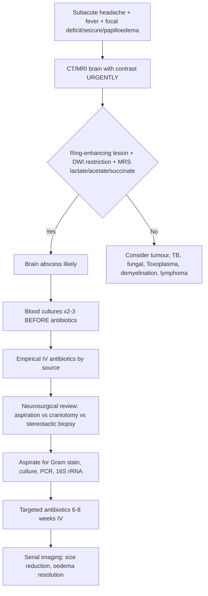

Related: [[Acute Bacterial Meningitis]], [[Tuberculous Meningitis]], [[Sepsis and Septic Shock]], [[Infective Endocarditis]], [[Post-Transplant Infections]]

> [!important]
> **Brain abscess = focal suppurative infection within brain parenchyma.** **Ring-enhancing lesion on imaging with surrounding oedema.** **Polymicrobial (anaerobes, streptococci, staphylococci).** **Neurosurgical drainage + 6–8 weeks IV antibiotics.** **Source identification critical (sinusitis, otitis, dental, endocarditis, pulmonary, trauma).**

## 1. Learning Objectives
- Recognise subacute presentation: headache, fever, focal deficits, seizures, papilloedema
- Identify predisposing sources: contiguous spread (sinus/ear/dental), haematogenous, trauma/surgery
- Select empirical antibiotics covering likely pathogens by source
- Interpret imaging: ring-enhancing lesion, DWI restriction, MR spectroscopy (lactate, acetate, succinate)
- Manage raised ICP, seizures, timing of surgical intervention
- Duration and monitoring of antibiotic therapy

## 2. Definition
**Brain abscess** = encapsulated collection of pus within brain parenchyma. **Stages:** cerebritis (days 1–3) → capsule formation (days 10–14) → mature abscess. **Incidence:** ~0.5–1/100,000; higher in immunocompromised, cyanotic heart disease, IVDU.

## 3. Core Microbiology — Aetiology by Source
| Source / Route | Common Pathogens | Notes |
|----------------|------------------|-------|
| **Contiguous spread** (sinusitis, otitis, mastoiditis, dental) | **Anaerobes** (Bacteroides, Peptostreptococcus, Fusobacterium, Prevotella), **Streptococci** (S. milleri group, viridans), **Enterobacteriaceae** | Frontal lobe (sinusitis), temporal lobe/cerebellum (otitis) |
| **Haematogenous** (cyanotic CHD, endocarditis, pulmonary AVM, IVDU) | **Streptococci** (viridans, S. milleri), **Staphylococci** (S. aureus), **Anaerobes**, **Gram-negatives**, **Fungi** (Aspergillus, Candida), **Nocardia** | Multiple abscesses common (MCA territory); septic emboli |
| **Post-trauma / Post-neurosurgery** | **S. aureus** (MSSA/MRSA), **CoNS**, **Gram-negatives** (Pseudomonas, Enterobacter), **Anaerobes** | Early (<1m) vs late (>1m) |
| **Immunocompromised** (HIV, transplant, steroids, chemo) | **Toxoplasma** (HIV CD4<100), **Nocardia**, **Aspergillus**, **Mucorales**, **Cryptococcus**, **Listeria**, **TB**, **Lymphoma** (mimic) | **Toxoplasma #1 in HIV CD4<100** — ring-enhancing, multiple, basal ganglia |
| **Cryptogenic** | Streptococci, anaerobes | No source identified (~15–25%) |

## 4. Normal Values / Important Cut-offs
| Parameter | Brain Abscess | Tumour / Necrotic Tumour | Demyelination |
|-----------|---------------|--------------------------|---------------|
| **CT/MRI** | **Ring-enhancing lesion, smooth thin wall, surrounding oedema** | Irregular thick wall, heterogeneous enhancement | Open-ring / incomplete ring, perivenular |
| **DWI** | **Restricted diffusion (pus = high viscosity)** | Variable (not typically restricted) | Not restricted |
| **MR Spectroscopy** | **Lactate ↑, acetate ↑, succinate ↑, alanine ↑; NO NAA, NO creatine, NO choline** | Choline ↑, NAA ↓, lipids/lactate ↑ | Choline ↑, NAA ↓ |
| **CSF** | **Usually normal or mild neutrophilic pleocytosis; protein ↑; DO NOT LP if mass effect** | Variable | Oligoclonal bands, IgG index ↑ |
| **Blood cultures** | Positive 10–25% (haematogenous) | Negative | Negative |

> [!warning]
> **Contraindication to LP:** Mass effect, midline shift, papilloedema, GCS<10 — risk of herniation. **Diagnosis by imaging + blood cultures + surgical aspirate.**

## 5. Clinical Features
| Feature | Frequency | Notes |
|---------|-----------|-------|
| **Headache** | 70–90% | Progressive, severe, worse with Valsalva |
| **Fever** | 50–70% | May be absent in immunocompromised, elderly |
| **Focal neurological deficits** | 50–70% | Hemiparesis, aphasia, visual field defect (depends on location) |
| **Seizures** | 25–50% | Focal or generalised; may be presenting feature |
| **Altered mental status** | 30–50% | Late sign = raised ICP / herniation |
| **Papilloedema** | 25–40% | Sign of raised ICP |
| **Nuchal rigidity** | <20% | If rupture → ventriculitis → meningism |

## 6. Approach / Algorithm

## 7. Investigations
| Test | Role |
|------|------|
| **MRI brain (contrast, DWI, MRS)** | **Gold standard**: ring-enhancement, DWI restriction (pus), MRS (lactate, acetate, succinate = abscess; choline/NAA = tumour) |
| **CT brain (contrast)** | Alternative if MRI unavailable; ring-enhancement, oedema |
| **Blood cultures (×2–3 sets)** | Before antibiotics; positive in haematogenous spread |
| **Surgical aspirate** | **Gram stain, aerobic/anaerobic culture, PCR, 16S rRNA, fungal AFB, Nocardia** |
| **CRP, PCT, FBC, U&E, LFTs, coag** | Baseline, monitoring |
| **Echocardiogram (TTE/TOE)** | If haematogenous suspected (endocarditis, CHD) |
| **Chest CT** | If pulmonary source suspected (AVM, abscess, tumour) |
| **Sinuses/ears/dental imaging** | If contiguous spread suspected |
| **HIV test, CD4** | If immunocompromised (Toxoplasma, fungal, Nocardia) |
| **Serology (Toxoplasma IgG)** | HIV CD4<100 with ring-enhancing lesions |

## 8. Empirical Antibiotic Therapy (Start AFTER Blood Cultures)
| Clinical Scenario | Regimen | Rationale |
|-------------------|---------|-----------|
| **Community-acquired (contiguous: sinus/ear/dental)** | **Ceftriaxone 2g IV 12h + Metronidazole 500mg IV 8h + Vancomycin 15–20mg/kg IV 6h** | Streptococci, anaerobes, staphylococci |
| **Haematogenous (endocarditis, cyanotic CHD, IVDU, pulmonary)** | **Vancomycin 15–20mg/kg IV 6h + Ceftriaxone 2g IV 12h + Metronidazole 500mg IV 8h** (+/- Meropenem if Gram-neg suspected) | Staphylococci, streptococci, anaerobes, Gram-negatives |
| **Post-neurosurgery / Trauma (<1 month)** | **Vancomycin 15–20mg/kg IV 6h + Meropenem 2g IV 8h** | MSSA/MRSA, Gram-negatives (Pseudomonas), CoNS |
| **Post-neurosurgery / Trauma (>1 month)** | **Vancomycin 15–20mg/kg IV 6h + Ceftriaxone 2g IV 12h** | Less Pseudomonas risk late |
| **Immunocompromised (HIV CD4<100)** | **Pyrimethamine + Sulfadiazine + Folinic acid (for Toxoplasma) + broad antibacterial** | Toxoplasma #1; empirical anti-Toxoplasma if multiple ring-enhancing |
| **Suspected Nocardia** | **TMP-SMX high-dose (15–20mg/kg TMP IV/PO 6–8h) + Meropenem/Imipenem + Amikacin** | Nocardia: sulfonamides first-line |
| **Suspected Fungal (Aspergillus, Mucorales)** | **Voriconazole/L-AmB per fungal pneumonia guidelines** | See Fungal Pneumonias note |

> [!important]
> **Metronidazole** essential for anaerobic coverage in contiguous spread. **Vancomycin** for staphylococcal coverage (MSSA/MRSA). **Ceftriaxone/meropenem** for streptococci/Gram-negatives. **Duration 6–8 weeks IV** after surgical drainage.

## 9. Targeted Therapy (Post-Aspirate Culture)
| Pathogen | Targeted Regimen | Duration |
|----------|------------------|----------|
| **S. milleri / viridans streptococci** | Penicillin G 24MU/day IV ÷4–6h OR Ceftriaxone 2g 12h | 6–8 weeks |
| **Anaerobes (Bacteroides, Fusobacterium, etc.)** | Metronidazole 500mg IV 8h + Penicillin/Ceftriaxone | 6–8 weeks |
| **S. aureus (MSSA)** | Flucloxacillin 2g IV 4h OR Cefazolin 2g IV 8h | 6–8 weeks |
| **S. aureus (MRSA)** | Vancomycin 15–20mg/kg 6h (trough 15–20) OR Daptomycin 8–10mg/kg IV OD | 6–8 weeks |
| **Gram-negatives (Enterobacteriaceae)** | Ceftriaxone 2g 12h OR Meropenem 2g 8h (if ESBL) | 6–8 weeks |
| **Pseudomonas** | Meropenem 2g 8h + Ciprofloxacin 400mg IV 12h | 6–8 weeks |
| **Nocardia** | TMP-SMX high-dose + Meropenem/Imipenem + Amikacin | **12 months** (prolonged) |
| **Aspergillus** | Voriconazole 6mg/kg 12h ×2d → 4mg/kg 12h (TDM) | **8–12 weeks** |
| **Toxoplasma** | Pyrimethamine 75mg load → 25–50mg OD + Sulfadiazine 1–1.5g 6h + Folinic acid 10–25mg OD | **6 weeks after resolution** (then secondary prophylaxis) |

## 10. Surgical Management
| Approach | Indications |
|----------|-------------|
| **Stereotactic aspiration** | **Preferred** for deep, eloquent, single, accessible abscess; diagnostic + therapeutic |
| **Craniotomy + excision** | Multiloculated, superficial, failed aspiration, cerebellar abscess (herniation risk), fungal (debulking) |
| **Burr hole drainage** | Limited access; less common now |
| **Ventriculostomy (EVD)** | Intraventricular rupture → ventriculitis, hydrocephalus |

> [!tip]
> **Stereotactic aspiration = lower morbidity, shorter stay, diagnostic yield.** **Total excision for fungal, multiloculated, cerebellar.** **Antibiotics continue 6–8w post-drainage.**

## 11. Duration & Monitoring
| Parameter | Schedule |
|-----------|----------|
| **Antibiotics IV** | **6–8 weeks total** (including pre-drainage empirical) |
| **Oral step-down** | Sometimes used for last 2–4w (e.g., metronidazole PO, co-amoxiclav, linezolid PO) if clinical/radiological improvement |
| **MRI/CT** | Baseline, 1–2w post-drainage, then 2–4w intervals until resolution |
| **CRP, FBC, LFTs** | Weekly |
| **Vancomycin trough** | 2–3x/week (target 15–20 for CNS) |
| **Seizure prophylaxis** | Levetiracetam during acute phase; continue if seizures occurred |

## 12. Complications
| Complication | Management |
|--------------|------------|
| **Rupture into ventricle** | **Ventriculitis, hydrocephalus, high mortality** → EVD + intraventricular antibiotics (vancomycin, gentamicin, amphotericin) + systemic antibiotics |
| **Raised ICP / Herniation** | Mannitol, hypertonic saline, hyperventilation, dexamethasone (controversial — may reduce capsule formation), surgical decompression |
| **Seizures** | Levetiracetam; long-term AED if recurrent |
| **Recurrence** | Repeat imaging, re-aspiration, extended antibiotics |
| **Empyema (subdural/epidural)** | Surgical drainage + antibiotics |
| **Neurological deficits** | Rehabilitation; may be permanent |

## 13. Red Flags / Emergencies
- **Rapid neurosurgical deterioration** (GCS drop, pupil asymmetry) → herniation → emergency decompression
- **Intraventricular rupture** → sudden deterioration, meningism, hydrocephalus → EVD + intraventricular antibiotics
- **Cerebellar abscess** → high risk of tonsillar herniation → urgent posterior fossa decompression
- **Septic shock** (haematogenous source) → fluids, vasopressors, source control

## 14. Differential Diagnosis (Ring-Enhancing Lesions)
| Condition | Key Differentiators |
|-----------|---------------------|
| **Brain abscess** | DWI restriction (pus), MRS: lactate/acetate/succinate, smooth thin ring, clinical infection |
| **Necrotic tumour (glioblastoma, metastasis)** | Irregular thick wall, MRS: choline↑, NAA↓, lipids; no DWI restriction |
| **Toxoplasmosis (HIV CD4<100)** | Multiple, basal ganglia, IgG +ve, responds to anti-Toxoplasma Rx in 2w |
| **TB (tuberculoma)** | Subacute, basal exudates, CSF low glucose, GeneXpert +ve, responds to anti-TB |
| **Fungal (Aspergillus, Mucorales)** | Immunocompromised, haemorrhagic, angioinvasion, galactomannan/CrAg |
| **Nocardia** | Immunocompromised, multiple, beading on imaging, TMP-SMX responsive |
| **Demyelination (tumefactive MS)** | Open ring, perivenular, CSF oligoclonal bands, no infection markers |
| **Primary CNS lymphoma (immunocompromised)** | Homogeneous enhancement (if not treated with steroids), EBV +ve CSF |
| **Infected aneurysm / mycotic aneurysm** | Vascular location, CT angiography, blood cultures +ve |

## 15. Special Situations
| Situation | Adjustment |
|-----------|------------|
| **Pregnancy** | Ceftriaxone + metronidazole safe; avoid fluoroquinolones; vancomycin OK |
| **Renal impairment** | Adjust vancomycin, aminoglycosides, meropenem; ceftriaxone no adjustment |
| **Hepatic impairment** | Metronidazole caution; ceftriaxone (biliary excretion) |
| **Penicillin allergy (anaphylaxis)** | Meropenem + vancomycin (avoid cephalosporins if true IgE) |
| **HIV CD4<100** | Empirical anti-Toxoplasma + broad antibacterial if multiple ring-enhancing; brain biopsy if no response in 2w |

## 16. FCPS/MRCP High-Yield Points
- **Brain abscess = ring-enhancing lesion + DWI restriction + MRS (lactate, acetate, succinate)**
- **Sources:** contiguous (sinus/ear/dental → anaerobes + streptococci), haematogenous (endocarditis, CHD, IVDU → multiple, MCA territory), post-trauma/surgery (S. aureus, Gram-neg)
- **Empirical abx:** Ceftriaxone + Metronidazole + Vancomycin (covers streptococci, anaerobes, staphylococci)
- **Stereotactic aspiration preferred** — diagnostic + therapeutic
- **Duration: 6–8 weeks IV antibiotics** after drainage
- **CSF usually normal** — **DO NOT LP if mass effect/papilloedema** (herniation risk)
- **Intraventricular rupture = catastrophe** → ventriculitis, hydrocephalus, EVD + intraventricular antibiotics
- **Toxoplasma in HIV CD4<100:** multiple ring-enhancing, basal ganglia, empirical pyrimethamine/sulfadiazine
- **Nocardia:** immunocompromised, TMP-SMX high-dose, 12-month duration
- **Cerebellar abscess:** high herniation risk → urgent posterior fossa decompression

## 17. Common Viva Questions
1. **What is the classic imaging triad for brain abscess?** Ring-enhancing lesion, DWI restriction (pus), MR spectroscopy showing lactate/acetate/succinate peaks.
2. **What are the three main routes of infection?** Contiguous spread (sinus/ear/dental), haematogenous (endocarditis, CHD, IVDU), post-trauma/surgery.
3. **What is the empirical antibiotic regimen for a community-acquired brain abscess?** Ceftriaxone 2g 12h + Metronidazole 500mg 8h + Vancomycin 15–20mg/kg 6h.
4. **Why is lumbar puncture contraindicated in brain abscess?** Mass effect, risk of tonsillar/uncal herniation.
5. **What is the treatment duration?** 6–8 weeks IV antibiotics after surgical drainage.
6. **How do you differentiate brain abscess from necrotic tumour on MRI?** DWI restriction + MRS lactate/acetate/succinate = abscess; choline↑/NAA↓ + irregular thick wall = tumour.
7. **What is the management of intraventricular rupture?** EVD + intraventricular antibiotics (vancomycin, gentamicin) + systemic antibiotics.

## 18. Common Confusions / Exam Traps
| Confusion | Clarification |
|-----------|---------------|
| LP safe in brain abscess | **CONTRAINDICATED** if mass effect, midline shift, papilloedema, GCS<10 |
| Single antibiotic sufficient | **Polymicrobial** — need streptococcal, anaerobic, staphylococcal coverage |
| Duration same as meningitis | **6–8 weeks IV** (meningitis 10–14d for pneumococcus) |
| Aspiration not needed if antibiotics started | **Surgical drainage essential** — antibiotics alone fail in encapsulated abscess |
| All ring-enhancing = abscess | **DWI restriction + MRS** distinguishes; tumour, TB, Toxoplasma, fungal, lymphoma mimic |
| Toxoplasma only in HIV | Also in transplant, steroids; but #1 in HIV CD4<100 |
| Nocardia = short course | **12 months** (prolonged) |
| Dexamethasone routine in abscess | **NOT routine** — may impair capsule formation; only for raised ICP/herniation |

## 19. Mnemonics
- **BRAIN ABSCESS**: **B**lood cultures first, **R**ing-enhancing + **D**WI restriction + **M**RS lactate, **A**naerobes + **S**trep + **S**taph, **I**ntracranial source (sinus/ear), **N**eurosurgical aspiration
- **MRS ABScess**: **A**cetate, **B**succinate, **S**Lactate = **ABS** (NO NAA, NO creatine, NO choline)
- **SOURCES**: **S**inus/ear/dental (contiguous), **O**prehaematogenous (endocarditis, CHD), **U**trauma/surgery, **R**IVDU, **C**ryptic, **E**ndocarditis, **S**eptic emboli

*...continued (truncated to 200 lines for renderer)*