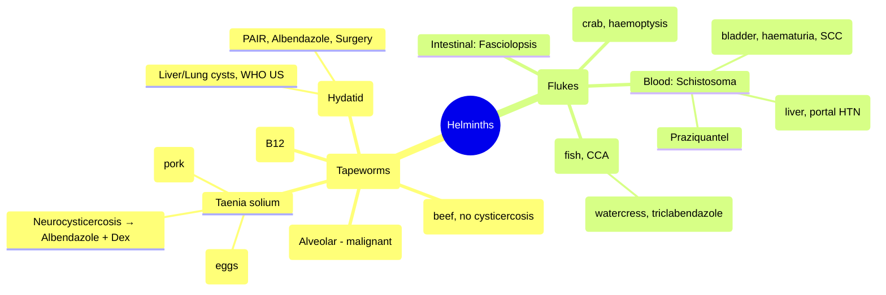

> [!info] **Davidson Ch 11 Alignment**: Infectious Disease → Specific Organism Groups → Parasites → Helminths → Cestodes (Tapeworms) & Trematodes (Flukes)
> **FCPS/MRCP Focus**: Neurocysticercosis (*T. solium*), hydatid disease (*E. granulosus*), schistosomiasis, liver flukes (*Clonorchis, Fasciola*), lung fluke (*Paragonimus*), praziquantel/albendazole

---

## 1. 🎯 Learning Objectives

- [ ] Classify **cestodes** (tapeworms): *Taenia* (intestinal), *Echinococcus* (hydatid), *Hymenolepis*, *Diphyllobothrium*
- [ ] Classify **trematodes** (flukes): Blood (*Schistosoma*), Liver (*Clonorchis, Opisthorchis, Fasciola*), Lung (*Paragonimus*), Intestinal (*Fasciolopsis, Heterophyes*)
- [ ] Recognise **Neurocysticercosis**: Seizures, cysts (vesicular, colloidal, granular, calcified), Del Bruto criteria
- [ ] Recognise **Hydatid disease**: Liver/lung cysts, anaphylaxis risk, "water-lily" sign, PAIR procedure
- [ ] Recognise **Schistosomiasis**: Katayama fever, hepatic/intestinal/urinary chronic disease, bladder cancer
- [ ] Diagnose: Stool O&P, serology, imaging (CT/MRI/US), antigen detection
- [ ] Manage: **Praziquantel** (most trematodes/cestodes), **Albendazole** (neurocysticercosis, hydatid), **Triclabendazole** (*Fasciola*)

---

## 2. 📚 Cestodes (Tapeworms)

| Species | Disease | Transmission | Key Features |
|---------|---------|--------------|--------------|
| **Taenia solium** | Taeniasis (adult worm), **Cysticercosis** (larval) | Undercooked pork (taeniasis); **faecal-oral eggs** (cysticercosis) | **Neurocysticercosis** = major cause of epilepsy in endemic areas |
| **Taenia saginata** | Taeniasis only | Undercooked beef | No cysticercosis in humans; proglottids motile (pass per anus) |
| **Taenia asiatica** | Taeniasis | Undercooked pig viscera | SE Asia; similar to *T. saginata* |
| **Echinococcus granulosus** | **Cystic echinococcosis (Hydatid disease)** | Dog feces (sheep/dog cycle) | **Liver (65%), Lung (25%)**; unilocular cysts, anaphylaxis if rupture |
| **Echinococcus multilocularis** | **Alveolar echinococcosis** | Fox/rodent cycle | **Infiltrative, malignant-like**, liver → metastases; high mortality |
| **Hymenolepis nana** | Hymenolepiasis | Faecal-oral (auto-infection) | Dwarf tapeworm; children, institutionalised; asymptomatic or GI |
| **Diphyllobothrium latum** | Diphyllobothriasis | Raw/undercooked fish | **Vitamin B12 deficiency** (worm competes), megaloblastic anaemia |
| **Dipylidium caninum** | Dipylidiasis | Dog/cat fleas | Children; proglottids like rice grains |

---

## 3. 📚 Trematodes (Flukes)

### Blood Flukes — *Schistosoma*
| Species | Location | Distribution | Key Features |
|---------|----------|--------------|--------------|
| **S. haematobium** | Venous plexus of **bladder/ureters** | Africa, Middle East | **Haematuria**, bladder fibrosis, **SCC bladder**, hydronephrosis |
| **S. mansoni** | Portal veins → **mesenteric** | Africa, S. America, Caribbean | **Hepatosplenic** disease, portal hypertension, varices, colonic polyposis |
| **S. japonicum** | Portal veins → **mesenteric** | China, Philippines, Indonesia | **More severe** hepatic disease, higher egg output, animal reservoirs |
| **S. intercalatum** | Mesenteric veins | Central/West Africa | Mild intestinal disease |
| **S. mekongi** | Mesenteric veins | Mekong River basin | Similar to *S. japonicum* |

### Liver Flukes
| Species | Transmission | Key Features |
|---------|--------------|--------------|
| **Clonorchis sinensis** | Raw/undercooked **freshwater fish** | **Biliary dilatation**, cholangitis, **cholangiocarcinoma** (high risk), stones |
| **Opisthorchis viverrini/felineus** | Raw fish | Similar to *Clonorchis*; **cholangiocarcinoma** (NE Thailand) |
| **Fasciola hepatica/gigantica** | **Watercress, aquatic plants** (metacercariae) | **Acute**: fever, RUQ pain, hepatomegaly, eosinophilia; **Chronic**: biliary obstruction, stones |

### Lung Fluke
| Species | Transmission | Key Features |
|---------|--------------|--------------|
| **Paragonimus westermani** | Raw/undercooked **crab/crayfish** | **Haemoptysis**, "rusty sputum", eosinophilia, **CXR: ring shadows, cavities**; mimics TB; ectopic (brain, skin) |

### Intestinal Flukes
| Species | Transmission | Key Features |
|---------|--------------|--------------|
| **Fasciolopsis buski** | Aquatic plants (water chestnut) | Intestinal: diarrhoea, malabsorption, oedema |
| **Heterophyes/Metagonimus** | Raw fish | Mild intestinal symptoms |

---

## 4. 🩺 Key Clinical Syndromes

### 1. Neurocysticercosis (*T. solium* larval cysts in CNS)
| Stage | Imaging | Clinical |
|-------|---------|----------|
| **Vesicular** (viable) | **Single/multiple cysts**, thin wall, clear fluid, **scolex** (dot) | Often asymptomatic |
| **Colloidal** (degenerating) | Ring-enhancing, perilesional **oedema** | **Seizures**, headache, focal deficits |
| **Granular-nodular** | Enhancing nodule, decreasing oedema | Resolving |
| **Calcified** | **Calcified nodules** | **Late seizures** (epileptogenic focus) |

**Del Bruto Diagnostic Criteria** (Definite = 1 Absolute + 1 Major OR 2 Major + 1 Minor + Epidemiologic)
- **Absolute**: Scolex on CT/MRI, histopathology
- **Major**: Lesions suggestive (ring-enhancing, calcifications), positive serology (EITB), cysticercosis elsewhere
- **Minor**: Clinical manifestations, epidemiologic exposure

### 2. Cystic Echinococcosis / Hydatid Disease (*E. granulosus*)
| Stage (WHO Ultrasound Classification) | Features |
|--------------------------------------|----------|
| **CE1** | Active, unilocular, anechoic (pure fluid) |
| **CE2** | Active, multiple septa ("**honeycomb**", "**wheel-spoke**") |
| **CE3** | **Detached membrane** ("**water-lily sign**") - transitional |
| **CE4** | Inactive, heterogeneous, hyperechoic (degenerate) |
| **CE5** | Inactive, **calcified** wall |

**Complications**: Anaphylaxis (rupture), secondary infection, biliary fistula, mass effect

### 3. Schistosomiasis
| Phase | Features |
|-------|----------|
| **Acute (Katayama fever)** | 4-8 weeks post-exposure: fever, cough, urticaria, hepatosplenomegaly, **marked eosinophilia** |
| **Chronic - *S. haematobium*** | **Terminal haematuria**, dysuria, bladder calcification, **SCC bladder**, obstructive uropathy |
| **Chronic - *S. mansoni/japonicum*** | **Portal hypertension**, varices, ascites, splenomegaly, **colonic polyposis** (pipe-stem fibrosis) |

---

## 5. 🔬 Diagnosis

| Parasite | Diagnostic Tests |
|----------|------------------|
| **Neurocysticercosis** | **CT/MRI** (stages), **EITB/Western blot** (serum/CSF), stool O&P (taeniasis) |
| **Hydatid disease** | **Ultrasound** (WHO classification), **serology** (ELISA, IgG), CT/MRI, **PCR** (cyst fluid) |
| **Schistosomiasis** | **Stool/urine microscopy** (eggs: *S. haematobium* = terminal spine; *S. mansoni* = lateral spine; *S. japonicum* = small lateral spine), **CAAs/CCAs** (antigen), serology, rectal biopsy |
| **Clonorchis/Opisthorchis** | **Stool O&P** (small operculated eggs), **ERCP/MRCP** (biliary dilatation), serology |
| **Fasciola** | **Stool O&P** (large operculated eggs - late), **serology** (early), imaging (liver tracts) |
| **Paragonimus** | **Sputum/stool O&P** (large operculated eggs), **CXR/CT** (ring shadows, cavities), serology |

> [!tip] **Exam Pearl**: *T. solium* eggs = **indistinguishable from *T. saginata*** on microscopy; need proglottids or PCR. **Cysticercosis from faecal-oral eggs, not pork**.

---

## 6. 💊 Management

### Cestodes
| Infection | Drug | Dose | Duration |
|-----------|------|------|----------|
| **Taeniasis** (*T. solium, T. saginata*) | **Praziquantel** | 5-10 mg/kg single dose | 1 dose |
| | **Niclosamide** | 2 g single dose | 1 dose |
| **Neurocysticercosis** | **Albendazole** + **Dexamethasone** | 15 mg/kg/day (max 800mg) bd | **14-28 days** |
| | **Praziquantel** (alternative) | 50 mg/kg/day tds | 14 days |
| | **Seizure control** | AEDs (levetiracetam, valproate) | As needed |
| **Hydatid disease (CE1, CE3a)** | **Albendazole** | 15 mg/kg/day bd (max 800mg) | **3-6 months** (cycles 28d on/14d off) |
| | **PAIR** (Puncture, Aspiration, Injection, Re-aspiration) | 95% ethanol / hypertonic saline | Single procedure + albendazole |
| | **Surgery** | Perioperative albendazole | Definitive for CE2, CE3b, complicated |
| **Hymenolepis nana** | **Praziquantel** | 25 mg/kg single dose | 1 dose (repeat 2 weeks) |
| **Diphyllobothrium** | **Praziquantel** | 25 mg/kg single dose | 1 dose + **B12 replacement** |

### Trematodes
| Infection | Drug | Dose | Duration |
|-----------|------|------|----------|
| **Schistosomiasis** (all species) | **Praziquantel** | 40 mg/kg single dose (or split) | 1 day |
| | *S. haematobium*: **40 mg/kg**; *S. mansoni/japonicum*: **60 mg/kg** (2 doses 4h apart) | | |
| **Clonorchis / Opisthorchis** | **Praziquantel** | 25 mg/kg tds | **1-3 days** |
| **Fasciola** | **Triclabendazole** | 10 mg/kg single dose (or bd) | 1-2 days |
| | **Praziquantel** (ineffective) | - | - |
| **Paragonimus** | **Praziquantel** | 25 mg/kg tds | **2-3 days** |
| | **Triclabendazole** | 10 mg/kg bd | 1 day |
| **Fasciolopsis / Heterophyes** | **Praziquantel** | 25 mg/kg tds | 1 day |

> [!warning] **Neurocysticercosis**: **ALWAYS give dexamethasone** (0.1 mg/kg/day) **before and during** albendazole to reduce perilesional oedema/seizures. **Contraindicated** in cysticercal encephalitis (numerous cysts + oedema) — treat oedema first.

---

## 7. 📋 FCPS/MRCP High-Yield Summary

| Topic | Key Point |
|-------|-----------|
| **Neurocysticercosis** | Most common cause of acquired epilepsy in endemic areas; **Albendazole + Dexamethasone** |
| **Hydatid disease** | *E. granulosus*; liver/lung cysts; **WHO US classification**; **PAIR** for CE1/CE3a; **Albendazole** adjunct |
| **Alveolar echinococcosis** | *E. multilocularis*; **infiltrative, malignant-like**, poor prognosis |
| **Schistosomiasis** | *haematobium* = haematuria/bladder cancer; *mansoni/japonicum* = portal HTN; **Praziquantel** |
| **Clonorchis/Opisthorchis** | Raw fish → **cholangiocarcinoma**; Praziquantel |
| **Fasciola** | Watercress → **acute hepatitis + eosinophilia**; **Triclabendazole** (NOT praziquantel) |
| **Paragonimus** | Raw crab → **haemoptysis, ring shadows on CXR**; Praziquantel/Triclabendazole |
| **Diphyllobothrium** | Raw fish → **B12 deficiency**; Praziquantel + B12 |

---

## 8. ❓ Viva Questions (FCPS/MRCP)

1. **Differentiate *Taenia solium* taeniasis from cysticercosis. How does human cysticercosis occur?**
2. **What are the Del Bruto criteria for neurocysticercosis?**
3. **Describe WHO ultrasound classification of hydatid cysts. Which stages are suitable for PAIR?**
4. **Compare *E. granulosus* vs *E. multilocularis* clinical features and prognosis.**
5. **A patient presents with terminal haematuria after travel to Egypt. Diagnosis and treatment?**
6. **Why is praziquantel ineffective for *Fasciola*? What is the drug of choice?**
7. **Describe the life cycle of *Paragonimus westermani*.**
8. **How do you differentiate *Schistosoma* eggs on microscopy?**
9. **Management of neurocysticercosis with multiple viable cysts vs calcified nodules.**
10. **A vegetarian has B12 deficiency and passes proglottids. Diagnosis?**

---

## 9. 🧠 Confusions & Mnemonics

| Confusion | Clarification |
|-----------|---------------|
| **T. solium vs T. saginata** | *T. solium*: Pork, **cysticercosis risk**, non-motile proglottids (<13 uterine branches); *T. saginata*: Beef, **no cysticercosis**, motile proglottids (>15 branches) |
| **Cysticercosis vs Taeniasis** | Cysticercosis = **larval cysts in tissue** (ingest eggs); Taeniasis = **adult worm in intestine** (ingest cysticerci in pork) |
| **Hydatid cyst vs Liver abscess** | Hydatid: **WHO US classification**, daughter cysts, water-lily sign, eosinophilia, anaphylaxis risk; Abscess: Pyogenic, septations, no daughter cysts |
| **Fasciola vs Clonorchis** | *Fasciola*: Watercress, **acute hepatitis + eosinophilia**, **Triclabendazole**; *Clonorchis*: Raw fish, **chronic biliary dilatation, cholangiocarcinoma**, Praziquantel |
| **Paragonimus vs TB** | Paragonimus: **Eosinophilia**, haemoptysis, **ring shadows/cavities on CXR**, responds to praziquantel; TB: AFB+, caseating, ATT |

**Mnemonic - Cestodes**: **"TAENIA"** → **T**aenia solium (pork, cysticercosis), **A**lbendazole (neurocysticercosis), **E**chinococcus granulosus (hydatid), **N**iclosamide/Praziquantel (taeniasis), **I**nfective eggs (faecal-oral), **A**lveolar (multilocularis = bad)

**Mnemonic - Trematodes**: **"SCHISTO"** → **S**chistosoma (blood fluke, praziquantel), **C**lonorchis (liver fluke, fish, cholangiocarcinoma), **H**epatic fasciola (watercress, triclabendazole), **I**ntestinal flukes (fasciolopsis), **S**tages of schisto (Katayama → chronic), **T**rematodes = flukes, **O**perculated eggs (most)

**Mnemonic - Neurocysticercosis Stages**: **"VESC"** → **V**esicular (viable, scolex), **E**nhancing/Colloidal (oedema, seizures), **S**tage/C**alcified** (epilepsy focus)

---

## 10. 🗺️ Mind Map

---

## 11. 📄 One-Page Revision Card

| **Cestodes** | **Drug** | **Trematodes** | **Drug** |
|--------------|----------|----------------|----------|
| *T. solium* taeniasis | Praziquantel 5-10mg/kg | *Schistosoma* | Praziquantel 40-60mg/kg |
| *T. solium* neurocysticercosis | **Albendazole + Dex** | *Clonorchis/Opisthorchis* | Praziquantel 25mg/kg tds |
| *E. granulosus* hydatid | Albendazole ± PAIR/Surgery | *Fasciola* | **Triclabendazole** 10mg/kg |
| *E. multilocularis* | Albendazole long-term + Surgery | *Paragonimus* | Praziquantel / Triclabendazole |
| *H. nana* | Praziquantel 25mg/kg | *Fasciolopsis* | Praziquantel |
| *D. latum* (B12 deficiency) | Praziquantel + B12 | | |

---

## 12. 📊 Spaced Repetition Tracker

| Review Interval | Date | Score (1-5) | Notes |
|-----------------|------|-------------|-------|
| 24 hours | | | |
| 7 days | | | |
| 15 days | | | |
| 30 days | | | |
| 90 days | | | |

---

## 13. 🧪 Self-Test Scorecard

| Topic | Known? (✓/✗) | Last Reviewed |
|-------|--------------|---------------|
| T. solium taeniasis vs cysticercosis | | |
| Neurocysticercosis stages & Del Bruto criteria | | |
| Hydatid cyst WHO classification & PAIR indications | | |
| Schistosoma species & clinical syndromes | | |
| Liver flukes: Clonorchis vs Fasciola | | |
| Paragonimus vs TB differentiation | | |
| Drug of choice for each parasite | | |

---

## 14. 🔗 Navigation

- [[Infectious Disease MOC]]
- [[Davidson Chapter 13 - Infectious Disease Hierarchy]]
- [[Neurocysticercosis]]
- [[Hydatid Disease]]
- [[Schistosomiasis]]
- [[Liver Fluke Infections]]
- [[Lung Fluke]]
- [[Parasitic Infections]]
- [[Travel Medicine & Pre-travel Advice]]

---

*Last Updated: 2025-06-17 | Based on Davidson 24e Ch 11 | FCPS/MRCP Focused*