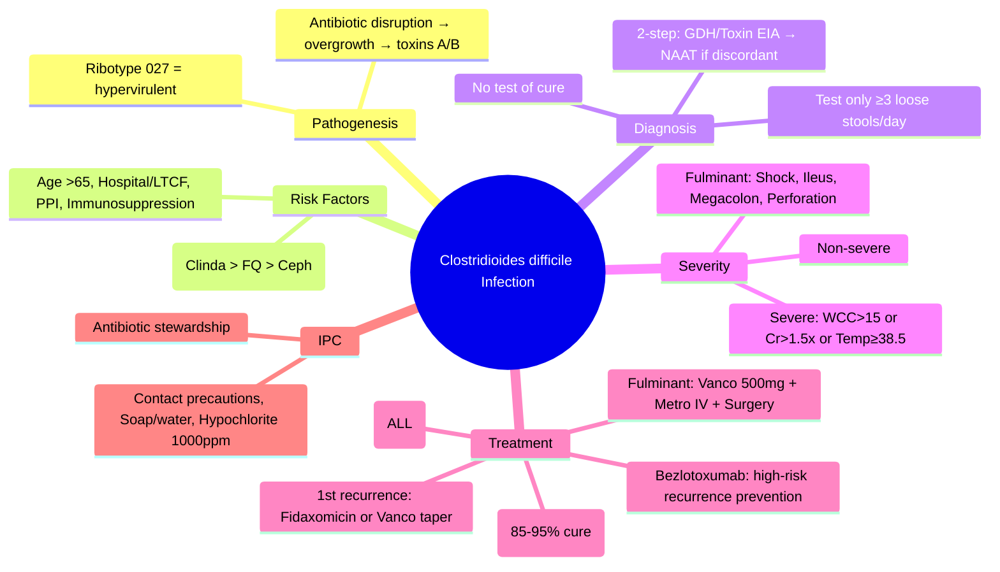

---
tags: [medicine, infectious-disease, davidson, chapter13, cdi, clostridioides-difficile, fcps, mrcp]
davidson_chapter: Chapter 13: Infectious disease
topic_category: Gastrointestinal Infections Domain
status: full-fcps-mrcp-topic-note
---

# Clostridioides difficile Infection (CDI)

Related: [[Antibiotic-Associated Diarrhoea]], [[Sepsis and Septic Shock]], [[Inflammatory Bowel Disease]], [[Antimicrobial Stewardship]]

> [!important]
> **CDI = toxin-mediated diarrhoea/colitis from *C. difficile* overgrowth after antibiotic disruption of normal flora.** **Diagnosis: toxin EIA/GDH + PCR or NAAT (2-step algorithm).** **Severity: non-severe, severe, fulminant.** **Treatment: Vancomycin 125mg PO 6h ×10d (1st line); Fidaxomicin 200mg PO 12h ×10d (if recurrence risk); Metronidazole ONLY if no access to vancomycin/fidaxomicin (non-severe only).** **Recurrence: 15–30%; treat with fidaxomicin or vancomycin taper/pulse. FMT for multiple recurrences.** **IPC: contact precautions, sporicidal cleaning, antibiotic stewardship.**

## Learning Objectives
- Define CDI diagnostic criteria (clinical + laboratory)
- Apply 2-step testing algorithm (GDH/EIA → PCR/NAAT)
- Assess severity (non-severe, severe, fulminant)
- Select first-line treatment by severity
- Manage first recurrence and multiple recurrences
- Understand faecal microbiota transplantation (FMT) indications
- Implement infection prevention and control measures
- Recognise fulminant CDI requiring surgery

## Pathogenesis & Risk Factors
| Factor | Mechanism |
|--------|-----------|
| **Antibiotics** (clindamycin, fluoroquinolones, cephalosporins, penicillins, carbapenems) | Disrupt normal anaerobic flora → *C. difficile* overgrowth |
| **Age ≥65** | Immunosenescence, comorbidity, healthcare exposure |
| **Hospitalisation / LTCF** | Acquisition pressure, environmental spores |
| **PPI use** | Gastric acid barrier loss (controversial, modest risk) |
| **Immunosuppression** | Chemo, steroids, biologics, transplant, HIV |
| **GI surgery / Ileus** | Stasis, loss of colonisation resistance |
| **Renal failure** | Altered microbiome, healthcare exposure |
| **Prior CDI** | Recurrence risk 15–30% after 1st episode |

> [!tip]
> **Highest risk antibiotics: clindamycin > fluoroquinolones > cephalosporins > penicillins.** **Ribotype 027/NAP1/BI = hypervirulent, increased toxin production, fluoroquinolone resistance, higher severity/recurrence.**

## Clinical Features
| Presentation | Features |
|--------------|----------|
| **Mild/Non-severe** | Watery diarrhoea ≥3/day, mild abdominal cramps, no systemic toxicity |
| **Severe** | Diarrhoea ≥3/day + **WCC >15×10⁹/L OR creatinine >1.5×baseline OR temp ≥38.5°C** |
| **Fulminant** | **Hypotension/shock, ileus, toxic megacolon, perforation, lactate ↑, WCC >35 or <2, lactate >5** |
| **Asymptomatic carriage** | Positive test, no diarrhoea — **DO NOT TREAT** |

> [!warning]
> **Ileus = diarrhoea may be ABSENT in fulminant CDI (toxic megacolon).** **Abdominal distension, pain, tachycardia, leukopenia/leukocytosis, lactate ↑ = surgical emergency.**

## Diagnosis — 2-Step Algorithm (Recommended)
### Step 1: Screen (High Sensitivity)
| Test | Target | Sensitivity | Specificity | Turnaround |
|------|--------|-------------|-------------|------------|
| **GDH EIA** | Glutamate dehydrogenase (enzyme produced by all *C. difficile*) | High (~95%) | Moderate | 1–2h |
| **Toxin A/B EIA** | Toxins A and B | Low (~70–80%) | High (>95%) | 1–2h |
| **Combined GDH + Toxin EIA** | Both | Moderate | High | 1–2h |

### Step 2: Confirm (If Step 1 Discordant or Positive)
| Test | Target | Sensitivity | Specificity |
|------|--------|-------------|-------------|
| **NAAT / PCR** | *tcdB* (toxin B gene) | Very high (>95%) | High (>95%) |
| **Toxigenic culture** | Viable toxin-producing organism | Gold standard | Gold standard |

### Algorithm
```
Diarrhoea (≥3 loose stools/24h) + clinical suspicion
         ↓
   Step 1: GDH EIA + Toxin A/B EIA
         ↓
   GDH− / Toxin−       → CDI EXCLUDED (NPV >99%)
   GDH+ / Toxin+       → CDI CONFIRMED (PPV >95%)
   GDH+ / Toxin−       → **Step 2: NAAT/PCR**
         ↓
   NAAT+               → CDI CONFIRMED
   NAAT−               → CDI EXCLUDED
```

> [!key]
> **NAAT alone NOT recommended as stand-alone (low PPV in low prevalence = overdiagnosis).** **Toxigenic culture = reference standard but slow (48–72h).** **Test only if ≥3 unformed stools/24h.**

## Severity Assessment
| Category | Criteria |
|----------|----------|
| **Non-severe** | WCC ≤15, Creatinine ≤1.5×baseline, Temp <38.5°C, No organ failure |
| **Severe** | **WCC >15×10⁹/L OR Creatinine >1.5×baseline OR Temp ≥38.5°C** |
| **Fulminant** | **Hypotension/shock, Ileus, Toxic megacolon, Perforation, Lactate >5, WCC >35 or <2** |

## Treatment by Severity
### First Episode
| Severity | Preferred | Alternative | Notes |
|----------|-----------|-------------|-------|
| **Non-severe** | **Vancomycin 125mg PO 6h ×10d** | Fidaxomicin 200mg PO 12h ×10d | Metronidazole NO LONGER 1st line (inferior cure, ↑ recurrence) |
| **Severe** | **Vancomycin 125mg PO 6h ×10d** | Fidaxomicin 200mg PO 12h ×10d | High-dose vancomycin 500mg 6h NOT superior |
| **Fulminant** | **Vancomycin 500mg PO/NG 6h + Metronidazole 500mg IV 8h** | Fidaxomicin + Metronidazole IV | **Surgical consult early**; consider IV tigecycline if ileus |

> [!critical]
> **Oral vancomycin NOT absorbed systemically — achieves high colonic concentrations.** **IV vancomycin does NOT treat CDI.** **Fidaxomicin: narrower spectrum, less microbiome disruption, lower recurrence (if available).** **Metronidazole: only if vancomycin/fidaxomicin unavailable AND non-severe.**

### First Recurrence
| Option | Regimen |
|--------|---------|
| **Preferred** | **Fidaxomicin 200mg PO 12h ×10d** (lowest recurrence) |
| **Alternative** | **Vancomycin taper/pulse**: 125mg 6h ×10d → 125mg 12h ×7d → 125mg 24h ×7d → 125mg every 48h ×7d → 125mg every 72h ×7d |

### Second/Subsequent Recurrence (≥2 recurrences)
| Option | Regimen |
|--------|---------|
| **Preferred** | **Faecal Microbiota Transplantation (FMT)** |
| **Alternative** | Vancomycin taper/pulse +/− Rifaximin 400mg 12h ×20d (chaser) |
| **Alternative** | Fidaxomicin ×10d + Bezlotoxumab (monoclonal anti-toxin B, single IV dose with antibiotics) |

> [!tip]
> **FMT: cure rate 85–95% for recurrent CDI.** **Delivery: colonoscopy (preferred), enema, capsules, nasogastric.** **Donor screening mandatory.** **Bezlotoxumab: reduces recurrence in high-risk (age>65, immunocompromised, severe CDI, prior CDI) — give with standard antibiotics.**

## Fulminant CDI — Surgical Indications
| Indication | Action |
|------------|--------|
| **Toxic megacolon** (colonic dilatation >6cm + systemic toxicity) | **Urgent subtotal colectomy + end ileostomy** |
| **Perforation** | **Urgent laparotomy** |
| **Refractory shock** | **Surgery if medical management failing** |
| **Lactate >5, WCC >35 or <2, rising lactate** | **Early surgical consult** |

> [!warning]
> **Diverting loop ileostomy + antegrade vancomycin flushes = alternative to colectomy in selected centres.**

## Infection Prevention & Control (IPC)
| Measure | Detail |
|---------|--------|
| **Contact precautions** | **Private room or cohort; gown/gloves for ALL contact** |
| **Duration** | **≥48h after diarrhoea resolves** (some guidelines: until discharge) |
| **Hand hygiene** | **Soap and water** (alcohol gel NOT sporicidal) |
| **Environmental cleaning** | **Sporicidal agent: hypochlorite 1000ppm OR peracetic acid OR hydrogen peroxide vapour** |
| **Equipment** | **Dedicated or sporicidal wipe between patients** |
| **Antibiotic stewardship** | **Restrict clindamycin, fluoroquinolones, cephalosporins; review at 48–72h** |
| **Diagnostic stewardship** | **Test only ≥3 unformed stools/24h; no test of cure** |

## Special Situations
| Situation | Management |
|-----------|------------|
| **Pregnancy** | Vancomycin PO safe (not absorbed); fidaxomicin limited data; metronidazole avoid 1st trimester |
| **Immunosuppressed** | Higher risk severe/fulminant; lower threshold for fidaxomicin/FMT |
| **IBD flare vs CDI** | Test for CDI in ALL IBD flares (co-infection common); treat CDI first |
| **Ileus** | Vancomycin 500mg PR q6h + Metronidazole 500mg IV q8h; consider fidaxomicin oral if some motility |
| **Paediatric** | Metronidazole 1st line (mild); Vancomycin PO (severe); FMT established |
| **Test of cure** | **NOT RECOMMENDED** (colonisation persists weeks after cure) |

## FCPS/MRCP High-Yield Points
- **CDI: toxin-mediated diarrhoea post-antibiotics**
- **Risk: antibiotics (clindamycin > fluoroquinolones > cephalosporins), age>65, hospital/LTCF, PPI, immunosuppression**
- **Diagnosis: 2-step algorithm (GDH/Toxin EIA → NAAT if discordant); test only ≥3 loose stools/day**
- **Severity: non-severe, severe (WCC>15 or Cr>1.5×baseline or temp≥38.5), fulminant (shock, ileus, toxic megacolon)**
- **1st line ALL severity: Vancomycin 125mg PO 6h ×10d (fidaxomicin alternative)**
- **Metronidazole: ONLY if vancomycin/fidaxomicin unavailable AND non-severe**
- **Fulminant: Vancomycin 500mg PO/NG 6h + Metronidazole 500mg IV 8h + SURGICAL CONSULT**
- **Recurrence: 1st → Fidaxomicin or Vancomycin taper/pulse; ≥2 → FMT (85–95% cure)**
- **Bezlotoxumab: anti-toxin B monoclonal, single IV dose with antibiotics for high-risk recurrence**
- **IPC: Contact precautions, soap/water hand hygiene, hypochlorite 1000ppm cleaning, antibiotic stewardship**
- **No test of cure; asymptomatic carriage not treated**

## Common Viva Questions
1. **What is the recommended diagnostic algorithm for CDI?** 2-step: GDH + Toxin EIA → if discordant (GDH+/Toxin−), confirm with NAAT/PCR.
2. **When do you test for CDI?** ≥3 unformed stools/24h with clinical suspicion. No test of cure.
3. **First-line treatment for non-severe CDI?** Vancomycin 125mg PO 6h ×10d (fidaxomicin alternative). Metronidazole no longer 1st line.
4. **First-line treatment for severe CDI?** Vancomycin 125mg PO 6h ×10d (same as non-severe). Fidaxomicin alternative.
5. **Fulminant CDI treatment?** Vancomycin 500mg PO/NG 6h + Metronidazole 500mg IV 8h + urgent surgical consult.
6. **First recurrence management?** Fidaxomicin 200mg 12h ×10d preferred OR Vancomycin taper/pulse.
7. **Multiple recurrences (≥2) management?** Faecal microbiota transplantation (FMT) preferred (85–95% cure).
8. **Bezlotoxumab indication?** High-risk recurrence (age>65, immunocompromised, severe CDI, prior CDI) — single IV dose with standard antibiotics.
9. **IPC measures for CDI?** Contact precautions, soap/water hand hygiene, hypochlorite 1000ppm cleaning, antibiotic stewardship.
10. **Why is IV vancomycin NOT used for CDI?** Not absorbed orally → no colonic concentration. Oral vancomycin achieves high colonic levels.

## Common Confusions / Exam Traps
| Confusion | Clarification |
|-----------|---------------|
| Metronidazole 1st line for all CDI | **Vancomycin 1st line for ALL severity; Metronidazole only if no access to vancomycin/fidaxomicin AND non-severe** |
| IV vancomycin for CDI | **IV vancomycin does not reach colon; MUST be oral/NG/PR** |
| NAAT alone sufficient | **NAAT alone = overdiagnosis (low PPV); 2-step algorithm recommended** |
| Test of cure needed | **No test of cure; colonisation persists weeks after clinical cure** |
| Asymptomatic carrier = treat | **Asymptomatic carriage: DO NOT TREAT** |
| Fidaxomicin for all = cost-effective | **Fidaxomicin preferred for recurrence prevention; cost may limit 1st line use** |
| FMT only for 3+ recurrences | **FMT for ≥2 recurrences (some guidelines: after 2nd recurrence)** |
| Alcohol gel kills spores | **Alcohol gel NOT sporicidal; SOAP AND WATER required** |
| Hypochlorite 100ppm sufficient | **Hypochlorite 1000ppm (0.1%) required for sporicidal activity** |
| Diarrhoea always present in fulminant | **Ileus/toxic megacolon = diarrhoea may be ABSENT; distension, pain, lactate ↑** |

## Mnemonics
- **CDI RISK**: **C**lindamycin, **F**luoroquinolones, **C**ephalosporins, **P**PI, **A**ge>65, **H**ospital, **I**mmunosuppression
- **2-STEP ALGORITHM**: **G**DH + **T**oxin EIA → **D**iscordant → **N**AAT
- **SEVERITY**: **N**on-severe (none), **S**evere (WCC>15 or Cr↑ or Temp≥38.5), **F**ulminant (Shock, Ileus, Megacolon, Perforation)
- **TREATMENT**: **V**anco 125mg PO 6h ×10d (ALL); **F**ulminant = **V**anco 500mg + **M**etro IV + **S**urgery
- **RECURRENCE**: **1st** → **F**idaxomicin or **V**anco taper; **≥2** → **F**MT
- **IPC**: **C**ontact, **S**oap/**W**ater, **H**ypochlorite **1000ppm**, **A**b**x** stewardship
- **BEZLOTOXUMAB**: **B**ezlo = **R**ecurrence reduction in **H**igh-**R**isk (single IV with abx)

## Mind Map


## Flowchart
```mermaid
flowchart TD
  A[Diarrhoea ≥3/day + suspicion] --> B[Step 1: GDH EIA + Toxin EIA]
  B --> C{GDH−/Toxin−}
  C -->|Yes| D[CDI EXCLUDED]
  C -->|No| E{GDH+/Toxin+}
  E -->|Yes| F[CDI CONFIRMED]
  E -->|No (GDH+/Toxin−)| G[Step 2: NAAT/PCR]
  G --> H{NAAT+?}
  H -->|Yes| F
  H -->|No| D
  F --> I[Assess Severity]
  I --> J{Severity?}
  J -->|Non-severe| K[Vancomycin 125mg PO 6h x10d]
  J -->|Severe| K
  J -->|Fulminant| L[Vancomycin 500mg PO/NG 6h + Metro 500mg IV 8h + Surgical Consult]
  K --> M[Recurrence?]
  M -->|1st| N[Fidaxomicin 200mg 12h x10d OR Vanco taper/pulse]
  M -->|≥2| O[FMT preferred]
```

## Suggested Visuals / Image Notes
- 2-step diagnostic algorithm
- Severity criteria table
- Vancomycin taper/pulse schedule
- FMT delivery methods
- IPC bundle checklist
- Toxic megacolon CXR/CT

## Suggested Video References
- IDSA/SHEA CDI guidelines 2021
- FMT procedure and donor screening
- CDI severity assessment
- Antibiotic stewardship for CDI prevention
- Fulminant CDI surgical management

## One-Page Revision Summary
| Topic | Key Points |
|-------|------------|
| **Risk** | Clindamycin > Fluoroquinolones > Cephalosporins; Age>65, Hospital, PPI, Immunosuppression |
| **Diagnosis** | 2-step: GDH/Toxin EIA → NAAT if discordant; Test ≥3 loose stools/day |
| **Severity** | Non-severe; Severe (WCC>15, Cr>1.5x, Temp≥38.5); Fulminant (Shock, Ileus, Megacolon) |
| **1st Episode** | Vancomycin 125mg PO 6h ×10d (ALL); Fidaxomicin alternative |
| **Fulminant** | Vancomycin 500mg PO/NG 6h + Metronidazole 500mg IV 8h + SURGERY |
| **1st Recurrence** | Fidaxomicin 200mg 12h ×10d OR Vancomycin taper/pulse |
| **≥2 Recurrences** | FMT (85–95% cure) ± Bezlotoxumab |
| **IPC** | Contact precautions, Soap/water, Hypochlorite 1000ppm, Abx stewardship |
| **Don't** | IV vancomycin, NAAT alone, test of cure, treat asymptomatic, alcohol gel |

## 24-Hour Recall Prompts
- CDI risk factors (antibiotic hierarchy).
- 2-step diagnostic algorithm.
- Severity criteria (non-severe, severe, fulminant).
- First-line treatment all severities.
- Fulminant CDI management.
- Recurrence management (1st, ≥2).
- FMT indications and cure rate.
- Bezlotoxumab indication.
- IPC measures (soap/water, hypochlorite 1000ppm).

## 7-Day / 15-Day / 30-Day Revision Tracker
- [ ] Day 1 completed
- [ ] 24-hour recall completed
- [ ] Day 7 revision completed
- [ ] Day 15 revision completed
- [ ] Day 30 revision completed

## Must Know / Should Know / Nice to Know
### Must Know
- 2-step diagnostic algorithm
- Severity classification
- Vancomycin 125mg PO 6h ×10d = 1st line ALL severity
- Fulminant: Vanco 500mg + Metro IV + Surgery
- 1st recurrence: Fidaxomicin or Vanco taper
- ≥2 recurrences: FMT
- IPC: Contact, soap/water, hypochlorite 1000ppm, abx stewardship
- No test of cure, no asymptomatic treatment

### Should Know
- Ribotype 027 significance
- Vancomycin taper/pulse schedule
- Fidaxomicin advantages (narrow spectrum, lower recurrence)
- Bezlotoxumab mechanism and indication
- FMT delivery methods and donor screening
- CDI in IBD flare distinction
- Paediatric/pregnancy adjustments

### Nice to Know
- Novel therapeutics (ridinilazole, surotomycin, vaccines)
- Microbiome restoration therapies beyond FMT
- CDI in community-onset vs healthcare-onset epidemiology
- Cost-effectiveness of fidaxomicin vs vancomycin
- Environmental persistence of spores (months)

## My Weak Points
- [ ] Exact vancomycin taper/pulse schedule details
- [ ] FMT donor screening criteria detail
- [ ] Bezlotoxumab trial data (MODIFY I/II)
- [ ] Paediatric dosing differences
- [ ] Community-onset CDI epidemiology

## Self-Test Scorecard
- Understanding: /10
- Recall: /10
- MCQ Performance: /10
- SBA Performance: /10
- Viva Confidence: /10
- Total: /50

> [!tip]
> Interpretation: <35 = weak topic, 35-44 = acceptable but insecure, 45+ = strong exam-ready topic.

## Exam Answer Modes
### Long Answer Skeleton
1. Pathogenesis, risk factors (antibiotic hierarchy)
2. Clinical features by severity
3. Diagnostic algorithm (2-step, why not NAAT alone)
4. Severity assessment criteria
5. Treatment by severity (1st episode)
6. Recurrence management (1st, multiple)
7. FMT and bezlotoxumab
8. Fulminant CDI and surgical indications
9. IPC measures
10. Special populations

### Short Note Skeleton
- CDI: toxin A/B post-antibiotics; Risk: Clinda>FQ>Ceph, age>65, hosp, PPI, immunocompromised
- Diagnosis: 2-step GDH/Toxin EIA → NAAT if discordant; test ≥3 loose stools
- Severity: Non-severe; Severe (WCC>15/Cr>1.5x/Temp≥38.5); Fulminant (shock/ileus/megacolon)
- Rx: Vanco 125mg PO 6h×10d ALL; Fulminant: Vanco 500mg+Metro IV+Surgery
- Recurrence: 1st→Fidaxomicin/Vanco taper; ≥2→FMT (85-95%)
- IPC: Contact, soap/water, hypochlorite 1000ppm, abx stewardship

### Viva One-Liners
- 2-step: GDH/Toxin EIA → NAAT if discordant
- Vanco 125mg PO 6h×10d = 1st line ALL severity
- Fulminant: Vanco 500mg + Metro IV + Surgery
- 1st recurrence: Fidaxomicin or Vanco taper
- ≥2 recurrences: FMT
- IPC: Contact, soap/water, hypochlorite 1000ppm
- No IV vanco, no NAAT alone, no test of cure

### Ward-Case Discussion Points
- 75F, post-ceftriaxone for CAP, diarrhoea 6/day, WCC 18, Cr 1.8×baseline → Severe CDI → Vancomycin 125mg PO 6h×10d + IPC
- 60M, 3rd CDI recurrence, immunosuppressed → FMT via colonoscopy + bezlotoxumab
- 40F, post-clindamycin, abdominal distension, no stool, lactate 6, WCC 40 → Fulminant CDI (ileus) → Vanco 500mg PR + Metro IV + urgent surgery

### Last-Night-Before-Exam Sheet
**CDI:** Risk: Clinda>FQ>Ceph, age>65, hosp, PPI, immunocompromised. **Dx: 2-step GDH/Toxin EIA → NAAT if discordant. Test ≥3 loose stools.** Severity: Non-severe; **Severe: WCC>15 or Cr>1.5x or Temp≥38.5; Fulminant: Shock/Ileus/Megacolon.** **Rx: Vanco 125mg PO 6h×10d ALL.** Fulminant: **Vanco 500mg + Metro IV + Surgery.** Recurrence: **1st→Fidaxomicin/Vanco taper; ≥2→FMT (85-95%).** Bezlo: high-risk recurrence. **IPC: Contact, soap/water, hypochlorite 1000ppm, abx stewardship. NO: IV vanco, NAAT alone, test of cure, asymptomatic Rx.**

## Summary
**Clostridioides difficile infection (CDI)** = toxin-mediated diarrhoea/colitis from *C. difficile* overgrowth after antibiotic disruption of normal colonic flora. **Risk factors:** antibiotics (clindamycin > fluoroquinolones > cephalosporins > penicillins), age ≥65, hospitalisation/LTCF, PPI use, immunosuppression, GI surgery, renal failure, prior CDI. **Diagnosis:** **2-step algorithm** — Step 1: GDH EIA + Toxin A/B EIA; GDH−/Toxin− = excluded; GDH+/Toxin+ = confirmed; GDH+/Toxin− = **Step 2: NAAT/PCR** (confirm). Test only if ≥3 unformed stools/24h. **No test of cure.** **Severity:** Non-severe; **Severe** = WCC >15 OR Creatinine >1.5×baseline OR Temp ≥38.5°C; **Fulminant** = hypotension/shock, ileus, toxic megacolon (>6cm), perforation, lactate >5, WCC >35 or <2. **Treatment (1st episode):** **Vancomycin 125mg PO 6h ×10d** for ALL severities (fidaxomicin 200mg PO 12h ×10d alternative). **Metronidazole ONLY if vancomycin/fidaxomicin unavailable AND non-severe.** **Fulminant:** Vancomycin 500mg PO/NG 6h + Metronidazole 500mg IV 8h + **urgent surgical consult** (subtotal colectomy if toxic megacolon/perforation). **Recurrence:** 1st = fidaxomicin preferred OR vancomycin taper/pulse; **≥2 recurrences = FMT preferred (85–95% cure)** ± bezlotoxumab (anti-toxin B monoclonal, single IV dose with antibiotics for high-risk). **IPC:** Contact precautions ≥48h after diarrhoea resolves, **soap and water hand hygiene** (alcohol not sporicidal), **hypochlorite 1000ppm (0.1%) environmental cleaning**, antibiotic stewardship (restrict clindamycin, fluoroquinolones, cephalosporins).

## MCQs (10)
1. **Recommended FIRST-LINE treatment for non-severe CDI:**
   A. Metronidazole 500mg PO 8h ×10d
   B. **Vancomycin 125mg PO 6h ×10d**
   C. Fidaxomicin 200mg PO 12h ×10d
   D. Vancomycin 500mg PO 6h ×10d
   E. Metronidazole IV + Vancomycin PO

2. **2-step diagnostic algorithm for CDI — Step 1 is:**
   A. NAAT/PCR
   B. Toxigenic culture
   C. **GDH EIA + Toxin A/B EIA**
   D. Glutamate dehydrogenase PCR
   E. Toxin B ELISA alone

3. **Fulminant CDI is defined by ALL EXCEPT:**
   A. Hypotension/shock
   B. Ileus
   C. Toxic megacolon
   D. **Diarrhoea >10/day**
   E. Perforation

4. **First recurrence of CDI — preferred treatment:**
   A. Metronidazole 500mg PO 8h ×10d
   B. Vancomycin 125mg PO 6h ×10d (same as 1st)
   C. **Fidaxomicin 200mg PO 12h ×10d** (or vancomycin taper/pulse)
   D. Vancomycin 500mg PO 6h ×14d
   E. FMT immediately

5. **Multiple recurrences (≥2) — preferred management:**
   A. Vancomycin taper/pulse ×2
   B. **Faecal Microbiota Transplantation (FMT)**
   C. Fidaxomicin ×20d
   D. Metronidazole + Vancomycin
   E. IVIG

6. **IPC measure for CDI that is DIFFERENT from standard contact precautions:**
   A. Gown and gloves
   B. Private room
   C. **Soap and water hand hygiene (alcohol not sporicidal)**
   D. Dedicated equipment
   E. Cohorting

7. **Environmental cleaning agent for CDI spores:**
   A. Alcohol 70%
   B. **Hypochlorite 1000ppm (0.1%)**
   C. Quaternary ammonium
   D. Chlorhexidine 2%
   E. Hydrogen peroxide 1%

8. **Why is oral vancomycin used instead of IV vancomycin for CDI?**
   A. IV vancomycin is nephrotoxic
   B. **IV vancomycin is not absorbed orally → no colonic concentration**
   C. Oral vancomycin is cheaper
   D. IV vancomycin Causes red man syndrome
   E. Oral has better bioavailability

9. **Bezlotoxumab indication:**
   A. Primary CDI treatment
   B. **Recurrence prevention in high-risk patients (single IV dose with antibiotics)**
   C. Fulminant CDI
   D. Asymptomatic carriage
   E. Test of cure

10. **Test of cure for CDI:**
    A. Recommended at day 10
    B. Recommended if symptoms persist
    C. **NOT recommended (colonisation persists weeks after cure)**
    D. Required for infection control clearance
    E. Only for recurrent CDI

## SBA Questions (10)
1. **A 72-year-old woman completed ceftriaxone for CAP 5 days ago. Now has diarrhoea 5/day, mild cramps, temp 37.8°C, WCC 11, Cr baseline. GDH+, Toxin+. Severity and treatment?**
   A. Severe → Vancomycin 500mg PO 6h
   B. **Non-severe → Vancomycin 125mg PO 6h ×10d**
   C. Non-severe → Metronidazole 500mg PO 8h
   D. Severe → Fidaxomicin 200mg PO 12h
   E. Fulminant → Vanco 500mg + Metro IV

2. **A 65-year-old man with CDI (1st episode) has WCC 18, Cr 1.6×baseline, temp 38.6°C. GDH+, Toxin+. Treatment?**
   A. Metronidazole 500mg PO 8h ×10d
   B. **Vancomycin 125mg PO 6h ×10d**
   C. Vancomycin 500mg PO 6h ×10d
   D. Fidaxomicin only if vancomycin fails
   E. IV vancomycin + metronidazole

3. **A 55-year-old woman with 3rd CDI recurrence. Previous: vancomycin ×2, fidaxomicin ×1. Best next step?**
   A. Vancomycin taper/pulse
   B. **FMT (faecal microbiota transplantation)**
   C. Fidaxomicin again
   D. Metronidazole + Vancomycin
   E. Bezlotoxumab alone

4. **A patient with fulminant CDI develops toxic megacolon (colonic diameter 8cm), lactate 6, hypotension. Management?**
   A. Vancomycin 500mg PO 6h + Metronidazole IV + observe
   B. **Urgent subtotal colectomy + end ileostomy**
   C. Diverting loop ileostomy only
   D. IVIG + Vancomycin PR
   E. Fidaxomicin + Metronidazole IV

5. **A 40-year-old man on clindamycin for skin infection develops diarrhoea 4/day. NAAT positive, GDH negative, Toxin negative. Next step?**
   A. Treat for CDI (NAAT+)
   B. **Repeat with 2-step algorithm (GDH/Toxin EIA)**
   C. No treatment needed (discordant)
   D. Toxigenic culture
   E. Treat with fidaxomicin

6. **A patient with severe CDI starting vancomycin 125mg PO 6h. High-risk for recurrence (age>65, immunocompromised). Adjunct to reduce recurrence?**
   A. Rifaximin chaser
   B. **Bezlotoxumab single IV dose with antibiotics**
   C. Probiotics
   D. IVIG
   E. Extend vancomycin to 14 days

7. **IPC for CDI — correct statement?**
   A. Alcohol gel sufficient for hand hygiene
   B. Contact precautions until 24h after diarrhoea stops
   C. **Hypochlorite 1000ppm for environmental cleaning**
   D. Cohorting not required if private room unavailable
   E. No antibiotic stewardship needed

8. **A patient with IBD flare (ulcerative colitis) develops diarrhoea 8/day. CDI testing?**
   A. Not needed (IBD flare explains symptoms)
   B. **Test for CDI (co-infection common)**
   C. Only if bloody diarrhoea
   D. Only if on biologics
   E. Only if recent antibiotics

9. **Vancomycin taper/pulse regimen for 1st recurrence:**
   A. 125mg 6h ×10d → STOP
   B. **125mg 6h ×10d → 125mg 12h ×7d → 125mg 24h ×7d → 125mg every 48h ×7d → 125mg every 72h ×7d**
   C. 125mg 6h ×14d → 125mg 12h ×7d
   D. 500mg 6h ×10d → 250mg 6h ×7d
   E. 125mg 6h ×10d → 125mg 12h ×14d

10. **A patient with CDI and ileus (no diarrhoea), abdominal distension, lactate 4. Vancomycin delivery?**
    A. PO only
    B. **PO/NG 500mg 6h + PR 500mg 6h + Metronidazole 500mg IV 8h**
    C. IV vancomycin 1g 12h
    D. Fidaxomicin PO only
    E. Metronidazole IV only

## Flashcards
- Q: CDI 1st line all severity
  A: Vancomycin 125mg PO 6h ×10d
- Q: CDI fulminant Rx
  A: Vanco 500mg PO/NG/PR 6h + Metro 500mg IV 8h + Surgery
- Q: 2-step algorithm
  A: GDH/Toxin EIA → if discordant → NAAT
- Q: Severity criteria
  A: Severe: WCC>15 or Cr>1.5x or Temp≥38.5; Fulminant: shock/ileus/megacolon
- Q: 1st recurrence
  A: Fidaxomicin or Vanco taper/pulse
- Q: ≥2 recurrences
  A: FMT (85-95% cure)
- Q: Bezlotoxumab
  A: Anti-toxin B mAb, single IV with abx, high-risk recurrence
- Q: IPC
  A: Contact, soap/water, hypochlorite 1000ppm, abx stewardship
- Q: No-no's
  A: No IV vanco, no NAAT alone, no test of cure, no asymptomatic Rx, no alcohol gel

## Answer Key with Explanations
### MCQs
1. **B** — Vancomycin 125mg PO 6h ×10d is 1st line for ALL severity CDI (IDSA 2021). Metronidazole no longer 1st line.
2. **C** — Step 1: GDH EIA + Toxin A/B EIA. If discordant (GDH+/Toxin−), Step 2: NAAT/PCR.
3. **D** — Fulminant CDI: shock, ileus, toxic megacolon, perforation, lactate>5, WCC>35 or <2. Diarrhoea >10/day is NOT a specific criterion (ileus may mean NO diarrhoea).
4. **C** — 1st recurrence: Fidaxomicin 200mg PO 12h ×10d preferred (lower recurrence) OR vancomycin taper/pulse.
5. **B** — ≥2 recurrences: FMT preferred (cure 85–95%).
6. **C** — Alcohol gel NOT sporicidal; soap and water REQUIRED for CDI.
7. **B** — Hypochlorite 1000ppm (0.1%) is sporicidal. Quaternary ammonium and standard concentrations NOT sporicidal.
8. **B** — Oral vancomycin NOT absorbed → high colonic concentrations. IV vancomycin does not reach colonic lumen.
9. **B** — Bezlotoxumab: monoclonal anti-toxin B antibody, single IV dose GIVEN WITH standard antibiotics for high-risk recurrence prevention.
10. **C** — No test of cure recommended; colonisation persists weeks after clinical cure.

### SBAs
1. **B** — Non-severe CDI (no severe criteria met): Vancomycin 125mg PO 6h ×10d.
2. **B** — Severe CDI (WCC>15, Cr>1.5×baseline, Temp≥38.5): SAME 1st line — Vancomycin 125mg PO 6h ×10d. Not 500mg (that's for fulminant).
3. **B** — 3rd recurrence = ≥2 recurrences → FMT preferred.
4. **B** — Toxic megacolon + shock + lactate >5 = fulminant CDI requiring urgent subtotal colectomy.
5. **B** — NAAT+ but GDH−/Toxin− = likely false positive/colonisation. Must use 2-step algorithm. Do NOT treat on NAAT alone.
6. **B** — Bezlotoxumab indicated for high-risk recurrence (age>65, immunocompromised, severe CDI, prior CDI) — single IV dose WITH standard antibiotics.
7. **C** — Hypochlorite 1000ppm required for sporicidal activity. Contact precautions ≥48h after diarrhoea resolves. Alcohol gel not sporicidal.
8. **B** — CDI co-infection common in IBD flares; MUST test (treat CDI first, then reassess IBD).
9. **B** — Standard vancomycin taper/pulse schedule for 1st recurrence.
10. **B** — Ileus: oral/NG vancomycin may not reach colon; use PR vancomycin 500mg 6h + IV metronidazole. IV vancomycin ineffective.

---