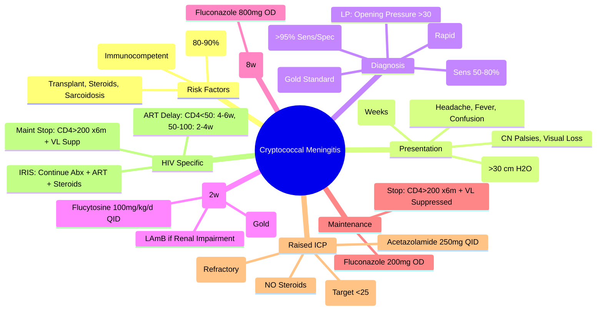

---
tags: [medicine, davidson, infectious-disease, cryptococcus, meningitis, cryptococcosis, fcps, mrcp]
davidson_chapter: Chapter 11: Infectious disease
status: full-fcps-mrcp-note
priority: high
exam_relevance: "FCPS: Essential | MRCP: Core | Cryptococcal meningitis, HIV/AIDS, induction/consolidation/maintenance, amphotericin B + flucytosine, fluconazole, ICP management, IRIS"
see_also: "[[HIV Infection and AIDS]], [[Fungal Pneumonias]], [[Invasive Candidiasis & Candidaemia]], [[Viral Encephalitis and Meningitis]]"
created: 2025-06-17
modified: 2025-06-17
---

# Cryptococcal Meningitis

> [!info] **Davidson Ch 11 Alignment**: Infectious Disease → Specific Organism Groups → Fungi → Cryptococcus
> **FCPS/MRCP Focus**: HIV/AIDS association, induction/consolidation/maintenance phases, amphotericin B + flucytosine, fluconazole, raised ICP management, IRIS

---

## 🎯 Learning Objectives

- [ ] Recognise **Clinical Presentation**: Subacute Meningitis (Weeks), Headache, Fever, Confusion, Cranial Nerve Palsies, Visual Loss
- [ ] Identify **Risk Factors**: **HIV/AIDS (CD4<100)**, Immunosuppression, Transplant, Steroids, Sarcoidosis
- [ ] Diagnose: **India Ink** (Rapid), **CrAg (LFA/ELISA)** — Serum/CSF (High Sens/Spec), **Culture** (Gold Standard), **PCR**
- [ ] Manage **3-Phase Therapy**: **Induction** (Amphotericin B + Flucytosine), **Consolidation** (Fluconazole), **Maintenance** (Fluconazole)
- [ ] Manage **Raised ICP**: **Serial LPs**, **Acetazolamide**, **VP Shunt**, **Avoid Steroids**
- [ ] Recognise **IRIS**: Paradoxical Worsening on ART Initiation, Continue Antifungals + ART, Steroids if Severe
- [ ] Apply **Prophylaxis**: Fluconazole 200mg OD (CD4<100), Discontinue if CD4>200 + VL Suppressed

---

## 📖 Definition & Epidemiology

| Feature | Details |
|---------|---------|
| **Causative Agent** | **Cryptococcus neoformans** (Var. grubii — Serotype A, Global); **C. gattii** (Var. gattii — Tropical/Subtropical, Immunocompetent) |
| **Environmental Reservoir** | **Bird Droppings** (Pigeon Guano), **Soil**, **Eucalyptus Trees** (C. gattii) |
| **Transmission** | **Inhalation** of Spores → **Primary Pulmonary** → **Haematogenous Dissemination → CNS** |
| **Risk Groups** | **HIV/AIDS (CD4<100)** — 80-90% of Cases; **Transplant**, **Corticosteroids**, **Cirrhosis**, **Sarcoidosis**, **Immunocompetent (C. gattii)** |
| **Incubation** | **Weeks to Months** (Variable, Often Subacute) |
| **Global Burden** | **~200,000 Cases/Year**, **~150,000 Deaths** (Mostly Sub-Saharan Africa, HIV-Associated) |

> [!tip] **Cryptococcal Meningitis = #1 Cause of Fungal Meningitis in HIV/AIDS**. **CD4<100 = Major Risk**. **Subacute Meningitis (Weeks) = Typical Presentation**.

---

## 📖 Clinical Presentation

### Typical Presentation (Subacute Meningitis)

| Feature | Frequency |
|---------|-----------|
| **Headache** | **>90%** (Progressive, Worsening, Morning Worse) |
| **Fever** | **50-70%** (Often Low-Grade / Absent in HIV) |
| **Confusion / Altered Mental Status** | **30-50%** |
| **Cranial Nerve Palsies** | **CN II, III, IV, VI** (Visual Loss, Diplopia, Ptosis) |
| **Nausea/Vomiting** | Common (Raised ICP) |
| **Neck Stiffness** | **Variable** (Often Absent in HIV) |
| **Visual Loss** | **Papilloedema**, **Optic Atrophy** (Raised ICP, Optic Nerve Compression) |

### HIV vs Non-HIV Presentation

| Feature | **HIV (CD4<100)** | **Immunocompetent / Non-HIV** |
|--------|-------------------|-------------------------------|
| **Fever** | Often Absent / Low-Grade | **Present** (High Fever) |
| **Neck Stiffness** | **Often Absent** | **Present** (Classic Meningism) |
| **Headache** | **Progressive, Subacute** | **Acute/Subacute, Severe** |
| **CT Head** | Often Normal / Mild Atrophy | **Hydrocephalus**, Cryptococcomas |
| **CSF Opening Pressure** | **Markedly Elevated (>30 cm H₂O)** | **Markedly Elevated** |
| **Mortality (High-Income)** | **15-25%** (With Optimal Rx) | **Lower (If Immunocompetent)** |

> [!tip] **Cryptococcal Meningitis = Subacute Meningitis + HIV (CD4<100) + Raised ICP + India Ink+/CrAg+**. **Raised ICP = Major Cause of Morbidity/Mortality**.

---

## 🔬 Diagnostic Workup

```mermaid
flowchart TD
    A[Subacute Meningitis + HIV/CD4<100 / Immunocompromised] --> B[**LP: Opening Pressure (Mandatory)**]
    B --> C[**CSF: India Ink** (Rapid, Sens 50-80%)]
    C --> D[**CrAg LFA/ELISA (CSF/Serum)**]
    D --> E{**CrAg Positive?**}
    E -->|Yes| F[**Diagnosis Confirmed**]
    E -->|No| G[**Culture (Gold Standard)** / **PCR**]
    G --> H[**Repeat LP if High Suspicion**]
    H --> I[**Cryptococcomas?** — MRI Brain]
```

### CSF Findings

| Parameter | Classic Cryptococcal Meningitis | HIV-Associated |
|-----------|----------------------------------|----------------|
| **Opening Pressure** | **Markedly Elevated (>30 cm H₂O)** | **Markedly Elevated (>30 cm H₂O)** |
| **WBC** | **Lymphocytic Pleocytosis** (50-500/µL) | **Normal / Mild ↑** (Often <20/µL in HIV) |
| **Protein** | **Elevated (100-500 mg/dL)** | Normal / Mild ↑ |
| **Glucose** | **Low** (<40% Serum) | **Normal / Mildly Low** |
| **India Ink** | **Positive** (Encapsulated Yeasts, Capsule) | **Positive** (Sensitivity 50-80%) |
| **CrAg (LFA/ELISA)** | **Positive (Sens >95%)** | **Positive (Sens >95%)** |
| **Culture** | **Positive (Gold Standard)** | Positive (Slower Growth) |
| **CRAG LFA (Serum/CSF)** | **Positive** (High Sens/Spec) | **Highly Sensitive/Specific** |

> [!tip] **Opening Pressure >30 cm H₂O = Key Feature** in Both HIV & Non-HIV. **CSF Lymphocytes May Be Normal in HIV** (Immunosuppression). **CrAg = Rapid, Highly Sensitive/Specific**.

---

## 💊 Management — 3-Phase Therapy (WHO/IDSA Guidelines)

### Phase 1: Induction (Weeks 1-2)

| Regimen | Dose | Duration | Notes |
|---------|------|----------|-------|
| **Amphotericin B Deoxycholate** + **Flucytosine** | **AmB 0.7-1.0 mg/kg/day IV** + **Flucytosine 100 mg/kg/day PO (QID)** | **14 Days** | **Gold Standard** (Survival Benefit) |
| **Liposomal Amphotericin B (LAmB)** + **Flucytosine** | **LAmB 3-5 mg/kg/day IV** + **Flucytosine 100 mg/kg/day PO** | **14 Days** | **Preferred if Renal Impairment / High Mortality Risk** |
| **Flucytosine Dose** | **100 mg/kg/day** (25mg 1-2-1-2 OR QID) | **14 Days** | **Monitor: CBC, Renal, LFT q48h** (Bone Marrow / Renal / Hepatic Toxicity) |

> [!warning] **Flucytosine**: **Dose Adjustment for Renal Impairment** (CrCl<50 → Dose Reduce); **Monitor CBC, Renal, LFT q48h** (Bone Marrow Suppression, Nephrotoxicity, Hepatotoxicity).

> [!warning] **Amphotericin B**: **Infusion-Related Reactions** (Fever, Chills, Hypotension) → **Pre-medicate** (Paracetamol, Hydrocortisone, Antihistamine). **Renal Toxicity** → **Hydration, Electrolyte Replacement (K+, Mg2+)**.

### Phase 2: Consolidation (Weeks 3-8)

| Agent | Dose | Duration |
|-------|------|----------|
| **Fluconazole** | **800 mg PO/IV Daily** (12 mg/kg/day) | **8 Weeks (Total 10 Weeks Induction+Consolidation)** |
| **Alternative** | **Voriconazole 200mg BD** / **Itraconazole 200mg BD** | If Fluconazole Intolerance |

> [!tip] **Fluconazole 800mg Daily** = **High Dose for CNS Penetration**. **Duration 8 Weeks** (Total 10 Weeks Induction+Consolidation).

### Phase 3: Maintenance (Secondary Prophylaxis)

| Agent | Dose | Duration | Discontinuation Criteria |
|-------|------|----------|---------------------------|
| **Fluconazole** | **200 mg PO Daily** | **≥1 Year** | **Immune Reconstitution: CD4>100-200 for ≥6 Months on ART + Viral Suppression** |
| **Alternative** | **Itraconazole 200mg BD** / **Voriconazole 200mg BD** | | If Fluconazole Intolerance |

---

## 🩺 Raised ICP Management (Critical)

| Intervention | Indication / Details |
|-----------|----------------------|
| **Therapeutic LP (Daily)** | **Opening Pressure >25-30 cm H₂O** → **Remove CSF to ≤20 cm H₂O** (or 50% Reduction); **Daily Until Stable** |
| **Acetazolamide** | **250mg QID PO/IV** (Adjunct, Carbonic Anhydrase Inhibitor → ↓ CSF Production) |
| **VP Shunt** | **Refractory Raised ICP** (Failed Serial LPs + Acetazolamide), **Hydrocephalus**, **Visual Loss** |
| **Corticosteroids** | **CONTRAINDICATED** (↑ Mortality, ↑ Fungal Burden) |
| **Mannitol / Hypertonic Saline** | **Acute Herniation** (Emergency Temporising) |

> [!warning] **Corticosteroids CONTRAINDICATED in Cryptococcal Meningitis** (↑ Mortality, ↑ Fungal Burden). **Raised ICP = Daily Therapeutic LPs + Acetazolamide → VP Shunt if Refractory**.

---

## 🔄 HIV-Associated Specifics

### ART Timing (IRIS Risk)

| CD4 Count | ART Initiation |
|-----------|----------------|
| **CD4 <50** | **Delay ART 4-6 Weeks** (After Induction) — **Reduce IRIS Risk** |
| **CD4 50-100** | **Start ART 2-4 Weeks** (After Induction Started) |
| **CD4 >100** | **Standard ART Timing** |

> [!warning] **Cryptococcal IRIS** = **Paradoxical Worsening** on ART Initiation (Worsening Meningitis, New Lesions, Rising CrAg). **Management**: **Continue Antifungals + ART**, **Add Steroids (Prednisolone 1mg/kg)** if Severe, **Therapeutic LPs**, **Do Not Stop ART/Antifungals**.

### Discontinuation of Maintenance Therapy

| Criteria | Duration |
|---------|----------|
| **CD4 >200** for **≥6 Months** on ART | **At Least 12 Months** Total Therapy |
| **Viral Suppression** (VL <50) | **Sustained** |
| **No Active Cryptococcal Disease** | Clinical + Radiological + CrAg Negative |

---

## 🔬 Laboratory Findings

| Test | Findings |
|-----------|----------|
| **CSF Opening Pressure** | **>30 cm H₂O (Markedly Elevated)** |
| **CSF WBC** | **Lymphocytic (50-500/µL)**; **Normal/Mild ↑ in HIV** |
| **CSF Protein** | **Elevated (100-500 mg/dL)** |
| **CSF Glucose** | **Low (<40% Serum)** |
| **India Ink** | **Positive** (Encapsulated Yeasts, Halo = Capsule); **Sens 50-80%** |
| **CrAg LFA (CSF/Serum)** | **Positive (Sens >95%, Spec >95%)** |
| **Culture** | **Gold Standard** (4-7 Days) |
| **Serum CrAg** | **Screening** (High Sensitivity) |

---

## 🔄 Differential Diagnosis

| Condition | Differentiating Features |
|----------|--------------------------|
| **TB Meningitis (TBM)** | **Subacute (Weeks)**, **CSF: Lymphocytic, Low Glucose, High Protein**, **Acid-Fast Bacilli/PCR/Xpert MTB/RIF**, **Exudates on Imaging**, **Basal Exudates** |
| **Viral Encephalitis/Meningitis** | **Acute Onset**, **CSF Lymphocytic**, **Viral PCR Panel+**, **Normal Pressure** |
| **Bacterial Meningitis** | **Acute**, **Neutrophilic CSF**, **Low Glucose**, **Gram Stain+**, **Culture+** |
| **TB Meningitis vs Crypto** | **TBM: Basal Exudates, Hydrocephalus, Cranial Nerve Palsies**, **Crypto: Raised ICP, CrAg+, India Ink+** |
| **CNS Lymphoma (HIV)** | **Ring-Enhancing Lesions**, **CSF Cytology+**, **EBV PCR+** |
| **Toxoplasma Encephalitis** | **Ring-Enhancing Lesions**, **IgG+, PCR+**, **Seizures Common** |

---

## 💡 FCPS/MRCP High-Yield Summary

| Topic | Key Point |
|-------|-----------|
| **Population** | **HIV/AIDS (CD4<100) = 80-90%**; **Immunocompromised / C. gattii (Immunocompetent)** |
| **Presentation** | **Subacute Meningitis (Weeks)**: Headache, Fever, Confusion, CN Palsies, Visual Loss |
| **CSF** | **Opening Pressure >30 cm H₂O**, **Lymphocytic Pleocytosis**, **Low Glucose**, **High Protein** |
| **Diagnosis** | **CrAg LFA (CSF/Serum) >95% Sens/Spec**, **India Ink** (Rapid), **Culture** (Gold Standard) |
| **Induction (2 Weeks)** | **Amphotericin B + Flucytosine** (Gold Standard); **LAmB Preferred if Renal Impairment** |
| **Consolidation (8 Weeks)** | **Fluconazole 800mg Daily** |
| **Maintenance** | **Fluconazole 200mg Daily** → **Stop: CD4>200 for 6mo on ART + VL Suppressed** |
| **Raised ICP** | **Daily Therapeutic LPs (Target <25 cm H₂O), Acetazolamide, VP Shunt (Refractory), NO Steroids** |
| **ART Timing** | **CD4<50: Delay 4-6 Weeks**; **CD4 50-100: Delay 2-4 Weeks**; **IRIS Risk** |
| **IRIS** | **Continue Antifungals + ART, Steroids if Severe** |

---

## ❓ Viva Questions

1. **What is the most common cause of fungal meningitis in HIV/AIDS?**
   - **Cryptococcus neoformans** (Cryptococcal Meningitis).

2. **What is the classic CSF opening pressure in Cryptococcal Meningitis?**
   - **>30 cm H₂O (Markedly Elevated)**.

3. **What is the induction regimen for Cryptococcal Meningitis?**
   - **Amphotericin B (0.7-1 mg/kg/day IV) + Flucytosine 100 mg/kg/day PO (QID) × 14 Days**.

3. **Why is Flucytosine combined with Amphotericin B?**
   - **Synergistic Fungicidal Activity**; **Reduces Duration & Mortality**; **Prevents Amphotericin Resistance**.

4. **What is the target CSF opening pressure during therapeutic LP?**
   - **≤25 cm H₂O** (or 50% Reduction from Baseline).

4. **Why are corticosteroids contraindicated in Cryptococcal Meningitis?**
   - **Increase Mortality & Fungal Burden**; **Worsen Outcome** (Clinical Trial Evidence).

5. **When should ART be started in HIV+ Cryptococcal Meningitis?**
   - **CD4<50: Delay 4-6 Weeks**; **CD4 50-100: Delay 2-4 Weeks**; **CD4>100: Standard Timing**.

5. **What is Cryptococcal IRIS and how is it managed?**
   - **Paradoxical Worsening on ART** → **Continue Antifungals + ART**, **Add Prednisolone 1mg/kg** if Severe, **Therapeutic LPs**.

6. **When can maintenance fluconazole be stopped?**
   - **CD4>200 for ≥6 Months on ART + Viral Suppression + No Active Disease + ≥12 Months Total Therapy**.

7. **What is the role of Flucytosine in Induction?**
   - **Synergistic with Amphotericin B**; **Rapid Fungicidal Activity**; **Reduces Mortality & Duration**; **Prevents Resistance**.

9. **What is the target CSF opening pressure during therapeutic LP?**
   - **≤25 cm H₂O** (or 50% Reduction from Baseline).

10. **Why is Amphotericin B + Flucytosine preferred over Fluconazole monotherapy for Induction?**
    - **Fungicidal (vs Fungistatic)**, **Superior Survival (RCT Evidence)**, **Rapid Sterilisation of CSF**, **Prevents Resistance**.

---

## 🧠 Confusions & Mnemonics

| Confusion | Clarification |
|-----------|---------------|
| **Induction vs Consolidation** | **Induction = AmB + 5-FC (2 Weeks)**; **Consolidation = Fluconazole 800mg (8 Weeks)** |
| **Fluconazole 800mg vs 200mg** | **800mg = Consolidation (Induction Dose)**; **200mg = Maintenance** |
| **ART Timing** | **CD4<50 = Delay 4-6w**; **CD4 50-100 = Delay 2-4w**; **CD4>100 = Standard** |
| **IRIS vs Treatment Failure** | **IRIS = Paradoxical Worsening on ART (CrAg↑, Symptoms↑)**; **Failure = No Improvement on Optimal Rx** |
| **Steroids in Crypto** | **CONTRAINDICATED** (↑ Mortality); **IRIS = Steroids OK** |

| Mnemonic | Meaning |
|----------|---------|
| **"Induction = AmB + 5FC (2w), Consolidation = Flu 800mg (8w), Maint = Flu 200mg (≥1yr)"** | 3-Phase Therapy |
| **"ICP >30 = Daily LP + Acetazolamide"** | Raised ICP Management |
| **"No Steroids in Crypto"** | Contraindicated |
| **"ART Delay: <50 = 4-6w, 50-100 = 2-4w"** | ART Timing |
| **"IRIS = Worsening on ART + Continue Abx + Steroids"** | IRIS Management |
| **"CrAg = Rapid, >95% Sens/Spec"** | Diagnosis |

---

## 🗺️ Mind Map



---

## 📋 One-Page Revision Card

| **CRYPTOCOCCAL MENINGITIS – FCPS/MRCP REVISION CARD** |
|--------------------------------------------------------|
| **Population**: **HIV CD4<100 (80-90%)**, Immunocompromised, C. gattii (Immunocompetent) |
| **Presentation**: Subacute Meningitis (Weeks), Headache, Fever, Confusion, CN Palsies, Visual Loss |
| **CSF**: **Opening Pressure >30 cm H₂O**, Lymphocytic, Low Glucose, High Protein |
| **Diagnosis**: **CrAg LFA (>95% Sens/Spec)**, India Ink, Culture (Gold) |
| **Induction (2w)**: **AmB + Flucytosine (100mg/kg/d QID)** — **Gold Standard** |
| **Consolidation (8w)**: **Fluconazole 800mg OD** |
| **Maintenance**: **Fluconazole 200mg OD** → Stop: **CD4>200 ×6m + VL Suppressed** |
| **ICP Management**: **Daily LP → Target <25 cm H₂O**, Acetazolamide, **NO Steroids**, VP Shunt if Refractory |
| **ART Timing**: **CD4<50: Delay 4-6w; 50-100: 2-4w; >100: Standard** |
| **IRIS**: Worsening on ART → **Continue Antifungals + ART + Steroids** |
| **Maintenance Stop**: **CD4>200 ×6m + VL Suppressed + ≥1yr Total Therapy** |

---

## 📅 Spaced Repetition Tracker

| Review | Date | Score (1-5) | Next Review |
|--------|------|-------------|-------------|
| Day 1 | 2025-06-17 | | 2025-06-18 |
| Day 3 | | | |
| Day 7 | | | |
| Day 15 | | | |
| Day 30 | | | |

---

## 🎯 Must Know / Should Know / Nice to Know

| Level | Content |
|-------|---------|
| **Must Know** | HIV/CD4<100 risk, Subacute meningitis, CSF opening pressure >30, CrAg LFA diagnosis, Induction AmB+5FC (2w), Consolidation Flu 800mg (8w), Maintenance Flu 200mg, ICP management (daily LP, acetazolamide, VP shunt), No steroids, ART timing (CD4<50: 4-6w), IRIS management, Maintenance stop criteria |
| **Should Know** | LAmB vs AmB deoxycholate, Flucytosine monitoring (CBC, renal, hepatic), Acetazolamide dosing/mechanism, VP shunt indications, IRIS pathophysiology, IRIS vs treatment failure differentiation, ART delay evidence (COAT trial), Flucytosine dose adjustment for renal impairment, C. gattii vs C. neoformans differences |
| **Nice to Know** | Cryptococcal IRIS pathophysiology, Novel antifungals (ibrexafungerp, rezafungin), Vaccine development, Cryptococcal antigen lateral flow assay validation, Cost-effectiveness of screening, Cryptococcal IRIS in non-HIV, Optimal LP frequency, Cost-effectiveness in resource-limited settings, Genetic susceptibility (FCGR, TLR variants), Cryptococcal antigen clearance kinetics |

---

## ✅ Self-Test Scorecard

| Section | Score (0-10) | Notes |
|---------|--------------|-------|
| Clinical Presentation & CSF Findings | | |
| Diagnosis (CrAg, India Ink, Culture) | | |
| Induction Therapy (AmB + 5FC) | | |
| Consolidation & Maintenance | | |
| Raised ICP Management | | |
| ART Timing & IRIS | | |
| HIV-Specific Management | | |
| Viva Questions | | |

---

## 🔗 Local Navigation

- **Previous**: [[Invasive Candidiasis & Candidaemia]]
- **Next**: [[Mucormycosis]]
- **Section Hub**: [[Infectious Disease MOC]]
- **MOC**: [[Infectious Disease MOC]]
- **Template**: [[../Templates/Hematology Topic Template]]

---

*Generated for FCPS/MRCP exam preparation. Based on Davidson Medicine 24th Ed Chapter 11.*