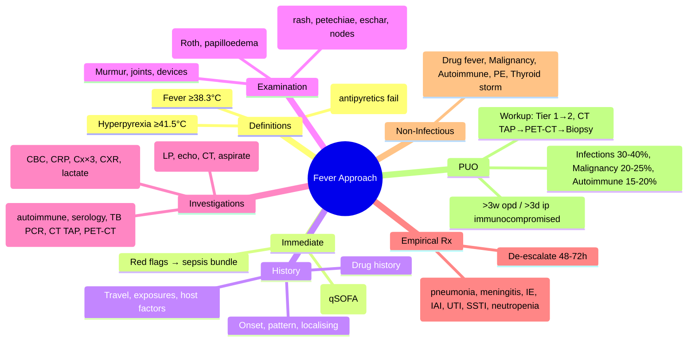

---
tags: [medicine, infectious-disease, davidson, chapter13, fever, septic-syndrome, approach, fcps, mrcp]
davidson_chapter: Chapter 13: Infectious disease
topic_category: General Principles / Clinical Approach Domain
status: full-fcps-mrcp-topic-note
---

# Fever and Septic Syndrome Approach

Related: [[Sepsis and Septic Shock]], [[Acute Bacterial Meningitis]], [[Infective Endocarditis]], [[Tuberculosis (Pulmonary and Extrapulmonary)],], [[HIV-Associated Opportunistic Infections]], [[Fungal Pneumonias]], [[Pyrexia of Unknown Origin (PUO)]]

> [!important]
> **Fever = core temperature ≥38.3°C (101°F) or ≥38.0°C sustained.** **Septic syndrome = fever + systemic inflammation ± organ dysfunction.** **Structured approach: history → examination → targeted investigations → empirical therapy → source identification.** **Do NOT treat fever alone — treat the underlying cause.**

## Learning Objectives
- Define fever, hyperpyrexia, hyperthermia, and septic syndrome
- Apply structured clinical approach: history (onset, pattern, travel, exposures), examination (focus, fundi, skin, joints, neurological), investigations (stepwise)
- Recognise red flags for urgent intervention (sepsis, meningitis, endocarditis, necrotising infection)
- Select empirical antibiotics by syndrome and local epidemiology
- Differentiate infectious from non-infectious fever (drug, malignancy, autoimmune, thromboembolic)
- Approach pyrexia of unknown origin (PUO) systematically

## Definitions
| Term | Definition |
|------|------------|
| **Fever** | Core temperature ≥38.3°C (101°F) once OR ≥38.0°C for ≥1 hour |
| **Hyperpyrexia** | Temperature ≥41.5°C (106.7°F) — medical emergency |
| **Hyperthermia** | Uncontrolled temperature rise (failed thermoregulation): heat stroke, NMS, MH, thyrotoxicosis — **no hypothalamic set-point change; antipyretics INEFFECTIVE** |
| **Septic syndrome** | Fever + SIRS criteria (2/4: T>38, HR>90, RR>20, WCC>12/<4) ± organ dysfunction |
| **SIRS** | Systemic Inflammatory Response Syndrome — non-specific |
| **PUO (Classic)** | Fever ≥38.3°C on multiple occasions >3 weeks, diagnosis uncertain after 1 week inpatient investigation |
| **PUO (Modern)** | Fever >3 weeks (outpatient) or >3 days (inpatient immunocompromised) without diagnosis after standard workup |

## Fever Patterns (Historical — Limited Specificity)
| Pattern | Description | Classic Associations |
|---------|-------------|---------------------|
| **Continuous** | Minimal diurnal variation (<1°C) | Typhoid, TB, bacterial endocarditis, pneumonia |
| **Remittent** | Diurnal variation >1°C but never normal | Infective endocarditis, TB, intra-abdominal abscess |
| **Intermittent** | Spikes to normal daily | Malaria, abscess, TB, urinary infection |
| **Quotidian** | Daily spikes | Malaria (falciparum), sepsis |
| **Tertian** | Every 48h (every 3rd day) | *P. vivax/ovale* malaria |
| **Quartan** | Every 72h (every 4th day) | *P. malariae* |
| **Relapsing** | Febrile periods separated by afebrile days | Borrelia (relapsing fever), rat-bite fever |
| **Pel-Ebstein** | Week febrile, week afebrile | Hodgkin lymphoma |

> [!tip]
> **Fever patterns have POOR sensitivity/specificity** in modern practice — do not rely for diagnosis.

## Structured Clinical Approach
```mermaid
flowchart TD
  A[Patient with fever] --> B[IMMEDIATE: ABCDE, vitals, sepsis screen (qSOFA/SOFA)]
  B --> C{Septic shock / red flags?}
  C -->|Yes| D[Activate sepsis bundle: lactate, Cx, abx 1h, fluids, vasopressors]
  C -->|No| E[Detailed History]
  E --> F[Focused Examination]
  F --> G[Stepwise Investigations]
  G --> H[Syndrome-based Empirical Therapy]
  H --> I[Source Identification & Targeted Therapy]
```

### 1. History — Key Domains
| Domain | Critical Questions |
|--------|-------------------|
| **Onset & Pattern** | Acute vs subacute vs chronic; rigors (bacteraemia); night sweats (TB, lymphoma) |
| **Localising Symptoms** | Cough/pleurisy (resp), dysuria/flank pain (UTI), abdominal pain (IAI), headache/neck stiffness (CNS), joint pain (septic arthritis) |
| **Travel & Geography** | Malaria (endemic + <1y), dengue, typhoid, TB, rickettsial, schistosomiasis, viral haemorrhagic fevers |
| **Exposures** | Animal contact (brucellosis, leptospirosis, Q fever), ticks (rickettsial, Lyme), freshwater (leptospira, schisto), sexual (STI, HIV), IVDU (endocarditis, abscesses) |
| **Host Factors** | Immunosuppression (steroids, chemo, transplant, HIV), diabetes, cirrhosis, asplenia, prosthetic devices, recent antibiotics/hospitalisation/surgery |
| **Drug History** | **Drug fever** (beta-lactams, sulfonamides, allopurinol, anticonvulsants, ATT, checkpoint inhibitors) — diagnosis of exclusion |
| **Vaccination Status** | COVID, influenza, pneumococcal, meningococcal, Hib, typhoid, yellow fever |

### 2. Examination — Systematic & Targeted
| System | Key Signs |
|--------|-----------|
| **General** | Temperature (core), rigors, haemodynamic status, hydration, cachexia |
| **Skin** | **Petechiae/purpura** (meningococcal, DIC), **erythema migrans** (Lyme), **eschar** (rickettsial, scrub typhus), **necrotising fasciitis** (pain↑, crepitus, bronzing), **cellulitis**, **abscess**, **drug rash**, **Janeway/Osler nodes** (endocarditis), **splinter haemorrhages**, **Roth spots** |
| **Eyes** | **Fundoscopy**: Roth spots, papilloedema (ICP), CMV retinitis, endophthalmitis; **conjunctival haemorrhage** (meningococcal, leptospira) |
| **ENT** | Pharyngitis, peritonsillar abscess, sinus tenderness, otitis media |
| **Neck** | Stiffness (meningitis), lymphadenopathy (local/generalised), JVP |
| **Respiratory** | Consolidation, effusion, wheeze, cavity signs |
| **Cardiovascular** | **Murmurs** (new/regurgitant = endocarditis), pericardial rub, signs of heart failure |
| **Abdomen** | Hepatosplenomegaly, tenderness, guarding, masses, ascites, peritonitis |
| **Neurological** | GCS, meningeal signs (Kernig, Brudzinski), focal deficits, cranial nerves |
| **Musculoskeletal** | **Hot swollen joint** (septic arthritis — emergency), osteomyelitis, discitis |
| **Genitourinary** | Urethral discharge, epididymo-orchitis, pelvic exam (PID) |
| **Devices** | **Line sites** (erythema, purulence), urinary catheter, drains, prostheses |

### 3. Stepwise Investigations
| Tier | Tests | Indication |
|------|-------|------------|
| **Tier 1 (All)** | FBC + diff, CRP, PCT, U&E, LFTs, Ca²⁺/Mg²⁺/PO₄, glucose, **blood cultures ×2–3 sets (aerobic/anaerobic) BEFORE antibiotics**, lactate, coagulation, urinalysis + culture, **CXR** | Baseline for all |
| **Tier 2 (Syndrome-driven)** | **LP** (CNS symptoms), **echo** (new murmur, IVDU, embolic phenomena), **CT abdomen/pelvis** (abdominal symptoms), **joint aspiration** (hot joint), **sputum** (cough), **stool** (diarrhoea), **wound/line tip cultures** | Targeted |
| **Tier 3 (PUO / Unresolved)** | HIV, ANA, ANCA, RF, ACE, ferritin, LDH, urine TB PCR/GeneXpert, **CT TAP**, **PET-CT**, **bone marrow** (if cytopenias), **temporal artery biopsy** (if >50), **serology** (brucella, leptospira, rickettsia, EBV, CMV, HIV, syphilis), **IGRA/TST** | PUO protocol |
| **Tier 4 (Specialised)** | **16S rRNA PCR** (culture-negative), **metagenomic sequencing**, **autoantibody panel**, **lymph node biopsy**, **liver biopsy** | Refractory |

## Syndrome-Based Empirical Approach
| Clinical Syndrome | Likely Sources | Empirical Antibiotics (adjust local) |
|-------------------|----------------|--------------------------------------|
| **Septic shock / severe sepsis** | Any — see Sepsis note | See Sepsis and Septic Shock note |
| **Community-acquired pneumonia (severe)** | *S. pneumoniae*, atypicals, *H. influenzae* | Ceftriaxone 2g IV 12h + Azithromycin 500mg IV/PO OD |
| **Healthcare-associated / ventilator pneumonia** | *Pseudomonas*, MRSA, Gram-negatives | Pip-tazo 4.5g 6h OR Meropenem 1g 8h + Vancomycin 15–20mg/kg 6h |
| **Meningitis / encephalitis** | See Acute Bacterial Meningitis / Viral Encephalitis notes | Ceftriaxone + Vancomycin + Dexamethasone ± Aciclovir |
| **Infective endocarditis** | See IE note | See IE note |
| **Intra-abdominal sepsis** | Enterobacteriaceae, *Bacteroides*, *Enterococcus* | Pip-tazo 4.5g 6h OR Meropenem 1g 8h |
| **Complicated UTI / Pyelonephritis** | *E. coli*, *Klebsiella*, *Enterococcus*, *Pseudomonas* | Ceftriaxone 2g 12h OR Pip-tazo 4.5g 6h |
| **Skin/Soft tissue (severe/necrotising)** | MSSA/MRSA, streptococci, anaerobes, Gram-neg | Pip-tazo + Vancomycin + Clindamycin |
| **Septic arthritis** | *S. aureus*, streptococci, *N. gonorrhoeae* (young) | Flucloxacillin 2g 4h + Ceftriaxone 2g 12h (add vancomycin if MRSA risk) |
| **Febrile neutropenia** | Gram-negatives (Pseudomonas), Gram-positives | Pip-tazo 4.5g 6h OR Meropenem 1g 8h (+ vancomycin if indicated) |
| **Line sepsis** | CoNS, *S. aureus*, Gram-neg, Candida | Vancomycin + Pip-tazo/Meropenem (remove line if S. aureus/Candida/BCx+ve) |
| **Post-surgical fever (day 0–2)** | Atelectasis, drugs, transfusion | Usually no antibiotics |
| **Post-surgical fever (day 3–7)** | Wound infection, UTI, line, DVT/PE | Targeted by source |
| **Post-surgical fever (>7d)** | Abscess, anastomotic leak, DVT/PE, drug | CT abdomen, cultures |

## Red Flags — Urgent/Immediate Action
| Red Flag | Implication | Action |
|----------|-------------|--------|
| **Hyperpyrexia ≥41.5°C** | Heat stroke, NMS, malignant hyperthermia, severe sepsis | Cooling, dantrolene (MH/NMS), ICU |
| **Rigors + hypotension** | Bacteraemia, sepsis | Blood cultures, sepsis bundle |
| **Petechial/purpuric rash + fever** | Meningococcal sepsis, DIC, vasculitis | Sepsis bundle, ceftriaxone, ICU |
| **New murmur + fever + embolic phenomena** | Infective endocarditis | 3 sets blood cultures, TTE/TOE, empirical IE antibiotics |
| **Hot swollen joint** | Septic arthritis | **Urgent joint aspiration → antibiotics → orthopaedics** |
| **Neck stiffness + AMS** | Meningitis/encephalitis | LP if safe, aciclovir + empirical meningitis abx |
| **Focal neurological deficit** | Brain abscess, stroke, TB meningitis | Urgent MRI/CT, LP if safe |
| **Immunocompromised + fever** | Neutropenic sepsis, opportunistic | Broad abx immediately, G-CSF, antifungal if persistent |
| **Returning traveller + fever** | Malaria (falciparum = emergency), dengue, typhoid, VHF | **Thick/thin films ×3 (or RDT), malaria PCR**; isolate if VHF suspected |

## Non-Infectious Fever (Differential)
| Category | Examples | Clues |
|----------|----------|-------|
| **Drug fever** | Beta-lactams, sulfonamides, allopurinol, anticonvulsants, ATT, checkpoint inhibitors, biologics | Temporal relation, rash, eosinophilia, resolves on stopping |
| **Malignancy** | Lymphoma (Pel-Ebstein), leukaemia, renal cell, hepatocellular, metastases | Weight loss, night sweats, lymphadenopathy, cytopenias |
| **Autoimmune / Autoinflammatory** | SLE, Still disease, vasculitis (GCA, PAN), AOSD, FMF, TRAPS, CAPS | Rash, arthritis, serositis, high ferritin, rash evanescent (Still) |
| **Thromboembolic** | PE, DVT, cerebral venous thrombosis | Hypoxia, pleuritic pain, Wells score, D-dimer |
| **Endocrine** | Thyrotoxicosis (thyroid storm), adrenal crisis, phaeochromocytoma | Tachycardia, tremor, hypotension, hyperglycaemia |
| **Factitious** | Self-induced (thermometer manipulation, injection) | Unexplained fever, healthcare access, psychiatric history |
| **Post-procedural** | Post-embolisation, post-ablation, post-chemo | Temporal, self-limiting |

## Pyrexia of Unknown Origin (PUO) — Modern Approach
### Definition
- **Classic:** Fever ≥38.3°C on multiple occasions >3 weeks, uncertain after 1 week inpatient workup
- **Nosocomial:** Fever >38.3°C on multiple occasions in hospitalised patient, uncertain after 3 days workup
- **Immunocompromised:** Fever >38.3°C in neutropenic/immunosuppressed, uncertain after 3 days
- **HIV-associated:** Fever >38.3°C for >4 weeks (outpatient) or >3 days (inpatient), CD4<200

### Aetiology Distribution (Classic PUO)
| Category | % | Examples |
|----------|----|----------|
| **Infections** | 30–40% | TB (extrapulmonary), endocarditis, abscesses, EBV/CMV, HIV, brucellosis, typhoid, disseminated fungal |
| **Malignancy** | 20–25% | Lymphoma, leukaemia, renal cell, hepatocellular, metastatic |
| **Autoimmune / Inflammatory** | 15–20% | SLE, Still disease, GCA, PAN, sarcoidosis, AOSD |
| **Miscellaneous / Undiagnosed** | 10–15% | Drug fever, factitious, thromboembolic, endocrine |
| **Truly Unknown** | 5–10% | Resolves spontaneously |

### PUO Workup Protocol
```mermaid
flowchart TD
  A[PUO: Fever >3w (opd) / >3d (ip immunocompromised) no dx after standard workup] --> B[Repeat History + Exam daily]
  B --> C[Tier 1: FBC, CRP, PCT, U&E, LFTs, Ca, glucose, lactate, coag, urine Cx, blood Cx×3, CXR, HIV, TST/IGRA]
  C --> D[Tier 2: ANA, ANCA, RF, ACE, ferritin, LDH, ESR, urine TB PCR, stool Cx, serology (brucella, lepto, rickettsia, EBV, CMV, syphilis)]
  D --> E{Localising clues?}
  E -->|Yes| F[Targeted imaging: CT TAP, PET-CT, echo, LP, joint aspiration, bone scan]
  E -->|No| G[Non-localised: CT TAP → PET-CT → Bone marrow biopsy (if cytopenias) → Temporal artery biopsy (if >50)]
  F --> H[Targeted biopsies: lymph node, liver, bone marrow, temporal artery]
  G --> H
  H --> I[Empirical therapeutic trials ONLY if life-threatening: ATT (TB), steroids (Still/GCA), doxycycline (rickettsial)]
```

## Special Populations
| Population | Key Considerations |
|------------|-------------------|
| **Elderly** | Atypical presentation (hypothermia, confusion, falls), polymorbidity, polypharmacy, blunted fever response |
| **Pregnancy** | Physiological leukocytosis, reduced cell-mediated immunity, listeriosis, pyelonephritis, chorioamnionitis; avoid fluoroquinolones/doxycycline |
| **Returning Traveller** | **Malaria until proven otherwise** — thick/thin films ×3 at 12–24h intervals or RDT+PCR; consider dengue, typhoid, rickettsial, schistosomiasis, VHF |
| **Immunocompromised (HIV CD4<200, transplant, chemo, steroids)** | **Broader differential:** atypical TB, fungal (crypto, histoplasma, PCP), CMV, EBV, MAC, toxoplasma, nocardia, strongyloides; **lower threshold for empirical broad abx + antifungal**; G-CSF if neutropenic |
| **Post-splenectomy / Functional Hyposplenism** | **Overwhelming post-splenectomy infection (OPSI):** *S. pneumoniae*, *H. influenzae*, *N. meningitidis*, *Capnocytophaga*; **vaccinate + lifelong penicillin prophylaxis**; urgent abx if fever |

## FCPS/MRCP High-Yield Points
- **Fever ≥38.3°C; hyperpyrexia ≥41.5°C = emergency; hyperthermia = antipyretics don't work**
- **Structured approach: ABCDE → sepsis screen → history (travel, exposures, host factors, drugs) → targeted exam (skin, fundi, murmur, joints, devices) → stepwise investigations**
- **Blood cultures BEFORE antibiotics (×2–3 sets) — do not delay abx >45min for cultures**
- **Syndrome-based empirical therapy** (see table) — de-escalate at 48–72h
- **Red flags:** rigors+hypotension, petechial rash, new murmur+emboli, hot joint, neck stiffness+AMS, focal neuro deficit, immunocompromised, returning traveller
- **Non-infectious fever:** drug fever (temporal, eosinophilia), malignancy (lymphoma), autoimmune (Still, GCA, vasculitis), PE/DVT, thyroid storm
- **PUO:** Infections 30–40%, malignancy 20–25%, autoimmune 15–20%; workup: repeat Hx/Ex, Tier 1→2 labs, CT TAP→PET-CT→biopsy
- **Returning traveller:** **Malaria first** — thick/thin films ×3 or RDT+PCR; falciparum = emergency
- **Immunocompromised:** broader differential, lower threshold for broad abx+antifungal, consider PCP, CMV, MAC, TB, fungal
- **Drug fever:** diagnosis of exclusion; temporal relation, eosinophilia, rash, resolves on stopping

## Common Viva Questions
1. **What is the difference between fever and hyperthermia?** Fever = hypothalamic set-point ↑ (antipyretics work); Hyperthermia = failed thermoregulation, set-point normal (antipyretics DON'T work) — heat stroke, NMS, MH, thyrotoxicosis.
2. **What are the tier 1 investigations for a patient with fever?** FBC, CRP, PCT, U&E, LFTs, glucose, lactate, coag, blood cultures ×2–3, urinalysis+Cx, CXR.
3. **How do you approach a returning traveller with fever?** Malaria first: thick/thin films ×3 at 12–24h intervals OR RDT+PCR. If negative, consider dengue, typhoid, rickettsial, VHF. Isolate if VHF suspected.
4. **What are the common causes of PUO?** Infections (TB, endocarditis, abscesses) 30–40%, Malignancy (lymphoma) 20–25%, Autoimmune (Still, GCA, vasculitis) 15–20%.
5. **What is the workup for PUO?** Repeat Hx/Ex daily; Tier 1 labs (FBC, CRP, blood cx×3, HIV, TST/IGRA, CXR); Tier 2 (autoimmune, serology, TB PCR); CT TAP → PET-CT → biopsies (lymph node, bone marrow, temporal artery if >50).
6. **When do you suspect drug fever?** Temporal relation to drug start, rash, eosinophilia, fever resolves on stopping — diagnosis of exclusion.

## Common Confusions / Exam Traps
| Confusion | Clarification |
|-----------|---------------|
| Treat fever with antipyretics routinely | **Treat the CAUSE; antipyretics only for comfort/hyperpyrexia/underlying cardiac/respiratory compromise** |
| Fever pattern diagnoses specific disease | **Patterns have POOR specificity** — do not rely |
| Single blood culture sufficient | **2–3 sets (aerobic/anaerobic) from DIFFERENT sites** |
| Start antibiotics before cultures in all fever | **Cultures BEFORE abx if stable; if septic/unstable → abx within 1h, cultures concurrent** |
| PUO = just infections | **Malignancy 20–25%, Autoimmune 15–20% — must investigate all** |
| Empirical steroids in PUO | **Therapeutic trials ONLY if life-threatening (TB meningitis, Still, GCA) — otherwise delays diagnosis** |
| Returning traveller = just malaria | **Dengue, typhoid, rickettsial, VHF, schisto — broad differential** |
| Immunocompromised = same workup | **Lower threshold for broad abx, antifungal, early imaging, bronchoscopy, LP** |
| All post-op fever = infection | **Day 0–2: atelectasis, drugs, transfusion; Day 3–7: wound, UTI, line, DVT; >7d: abscess, leak** |

## Mnemonics
- **FEVER HISTORY**: **F**ever pattern, **E**xposures (travel, animal, sexual), **V**accines, **E**xam focus, **R**igors; **H**ost factors, **I**mmunosuppression, **S**urgery/hosp, **T**ravel, **O**ccupation, **R**ecent abx, **Y**ear (seasonal)
- **EXAM FOCUS**: **F**undi (Roth, papilloedema), **O**toscope/sinuses, **C**ardiac (murmur), **U**rine/genital, **S**kin (rash, petechiae, eschar, nodes, line sites), **J**oints (hot, swollen)
- **PUO CAUSES**: **I**nfections (TB, IE, abscess), **M**alignancy (lymphoma), **A**utoimmune (Still, GCA, vasculitis), **D**rug fever, **U**ndiagnosed
- **TRAVEL FEVER**: **M**alaria (films x3), **D**engue, **T**yphoid, **R**ickettsial, **V**HF (isolate), **S**chisto, **L**eptospirosis

## Mind Map


## Flowchart
```mermaid
flowchart TD
  A[Fever] --> B[ABCDE, Vitals, qSOFA/SOFA]
  B --> C{Red flags / Septic shock?}
  C -->|Yes| D[Sepsis Bundle: Lactate, Cx, Abx 1h, Fluids, Vasopressors]
  C -->|No| E[History: Onset, Localising, Travel, Exposures, Host, Drugs]
  E --> F[Targeted Exam: Skin, Fundi, Murmur, Joints, Devices]
  F --> G[Tier 1 Investigations: CBC, CRP, PCT, U&E, LFTs, Lactate, Coag, Cx×3, Urine Cx, CXR]
  G --> H{Syndrome identified?}
  H -->|Yes| I[Syndrome-based Empirical Abx + Source Control]
  H -->|No| J[Tier 2: Targeted by clues (LP, Echo, CT, Aspirate)]
  J --> K{Diagnosis?}
  K -->|Yes| I
  K -->|No| L[PUO Pathway: Tier 3 (Autoimmune, Serology, TB PCR), CT TAP, PET-CT, Biopsies]
  L --> M[Empirical trials ONLY if life-threatening]
```

## Suggested Visuals / Image Notes
- Fever approach algorithm
- Skin lesions: petechiae, purpura, eschar, erythema migrans, Janeway/Osler nodes, Roth spots
- Fundoscopy findings
- PUO workup algorithm
- Returning traveller algorithm

## Suggested Video References
- Fever of unknown origin workup (NEJM/JAMA)
- Returning traveller fever approach
- Sepsis recognition and bundle
- Drug fever diagnosis
- PUO case discussions

## One-Page Revision Summary
| Topic | Key Points |
|-------|------------|
| **Definitions** | Fever ≥38.3°C; Hyperpyrexia ≥41.5°C (emergency); Hyperthermia = antipyretics fail |
| **Immediate** | ABCDE, qSOFA/SOFA; Red flags → sepsis bundle |
| **History** | Onset, localising, travel, exposures, host factors, drugs |
| **Exam** | Skin (rash, petechiae, eschar, nodes), Fundi (Roth, papilloedema), Murmur, Joints, Devices |
| **Tier 1 Labs** | CBC, CRP, PCT, U&E, LFTs, Lactate, Coag, **Blood Cx×3**, Urine Cx, CXR, HIV, TST/IGRA |
| **Empirical Rx** | Syndrome-based: CAP, meningitis, IE, IAI, UTI, SSTI, neutropenia, line sepsis |
| **Red Flags** | Rigors+hypotension, petechial rash, new murmur+emboli, hot joint, neck stiffness+AMS, focal neuro, immunocompromised, traveller |
| **Non-Infectious** | Drug fever, Lymphoma, Autoimmune (Still, GCA), PE/DVT, Thyroid storm |
| **PUO** | >3w opd / >3d ip immuno; Infections 30-40%, Malignancy 20-25%, Autoimmune 15-20%; Workup: Tier 1→2, CT TAP→PET-CT→Biopsy |
| **Traveller** | **Malaria first** (films×3/RDT+PCR); Falciparum=emergency; Dengue, typhoid, rickettsial, VHF |

## 24-Hour Recall Prompts
- Difference between fever and hyperthermia.
- Tier 1 investigations for fever.
- Red flags requiring immediate sepsis bundle.
- PUO definition and top 3 aetiologies.
- Returning traveller fever: first test.

## 7-Day / 15-Day / 30-Day Revision Tracker
- [ ] Day 1 completed
- [ ] 24-hour recall completed
- [ ] Day 7 revision completed
- [ ] Day 15 revision completed
- [ ] Day 30 revision completed

## Must Know / Should Know / Nice to Know
### Must Know
- Fever vs hyperthermia distinction
- Sepsis screen (qSOFA/SOFA) and red flags
- Blood cultures BEFORE antibiotics (×2–3 sets)
- Syndrome-based empirical therapy
- Non-infectious fever causes (drug, malignancy, autoimmune, PE)
- PUO definition, aetiology split, workup sequence
- Returning traveller: malaria first (films×3/RDT)

### Should Know
- Fever patterns (historical, low utility)
- Detailed examination focus (skin, fundi, murmur, joints, devices)
- Tier 2/3 investigations for unresolved fever
- Special populations (elderly, pregnant, immunocompromised, post-splenectomy)
- Drug fever clues (temporal, eosinophilia, rash)
- Empirical therapeutic trials in PUO (only life-threatening)

### Nice to Know
- Pel-Ebstein fever (Hodgkin)
- Factitious fever
- Autoinflammatory syndromes (FMF, TRAPS, CAPS)
- Metagenomic sequencing in culture-negative fever
- Post-procedural fever syndromes

## My Weak Points
- [ ] Autoinflammatory syndrome details (FMF, TRAPS, CAPS)
- [ ] Specific serology for tropical infections
- [ ] PET-CT vs CT TAP yield in PUO
- [ ] Drug fever common culprits list

## Self-Test Scorecard
- Understanding: /10
- Recall: /10
- MCQ Performance: /10
- SBA Performance: /10
- Viva Confidence: /10
- Total: /50

> [!tip]
> Interpretation: <35 = weak topic, 35-44 = acceptable but insecure, 45+ = strong exam-ready topic.

## Exam Answer Modes
### Long Answer Skeleton
1. Definitions: fever, hyperpyrexia, hyperthermia, septic syndrome, PUO
2. Immediate assessment: ABCDE, sepsis screen, red flags
3. History domains: onset, pattern, localising, travel, exposures, host factors, drugs
4. Targeted examination: skin, fundi, cardiovascular, joints, devices, neurological
4. Investigations: Tier 1 (all), Tier 2 (syndrome-driven), Tier 3 (PUO)
5. Syndrome-based empirical therapy table
6. Red flags and immediate actions
7. Non-infectious fever differential
8. PUO: aetiology distribution, stepwise workup, empirical trial indications
9. Special populations: traveller, immunocompromised, elderly, pregnant, post-surgical

### Short Note Skeleton
- Fever ≥38.3°C; Hyperthermia = antipyretics fail (heat stroke, NMS, MH)
- Immediate: ABCDE, qSOFA/SOFA; Red flags → sepsis bundle
- History: travel, exposures, host, drugs; Exam: skin, fundi, murmur, joints, devices
- Tier 1: CBC, CRP, PCT, lactate, coag, Cx×3, urine Cx, CXR, HIV, TST/IGRA
- Empirical: syndrome-based (CAP, meningitis, IE, IAI, UTI, SSTI, neutropenia)
- Non-infectious: drug, lymphoma, autoimmune, PE, thyroid storm
- PUO: >3w opd/>3d ip immuno; Inf 30-40%, Malig 20-25%, Autoimm 15-20%; CT TAP→PET→Biopsy
- Traveller: Malaria first (films×3/RDT)

### Viva One-Liners
- Fever = set-point↑ (antipyretics work); Hyperthermia = set-point normal (antipyretics fail)
- Blood cultures ×3 BEFORE abx; Abx 1h if sepsis
- PUO: Inf 30-40%, Malig 20-25%, Autoimm 15-20%
- Traveller: Malaria films×3 first
- Red flags: petechial rash, new murmur, hot joint, neck stiffness+AMS

### Ward-Case Discussion Points
- 45M, fever 2w, weight loss, night sweats, cervical lymphadenopathy → Tier 1, HIV, TST/IGRA, CXR → CT TAP → lymph node biopsy (TB vs lymphoma)
- 30F returning from Thailand, fever 5d, headache, myalgia, petechiae → dengue NS1/IgM, thick/thin films ×3 (malaria), FBC (thrombocytopenia), supportive
- 65M post-op day 5, fever, abdominal distension → CT abdomen (abscess/leak), blood/urine Cx, empirical pip-tazo, surgical review

### Last-Night-Before-Exam Sheet
**FEVER APPROACH:** ABCDE→qSOFA→Red flags→Sepsis bundle. Hx: travel, exposures, host, drugs. Exam: skin, fundi, murmur, joints, devices. Tier 1: CBC, CRP, PCT, lactate, coag, **Cx×3**, urine Cx, CXR. **Empirical: syndrome-based (CAP, meningitis, IE, IAI, UTI, SSTI, neutropenia).** Non-infectious: drug, lymphoma, autoimmune, PE, thyroid storm. **PUO:** >3w opd/>3d ip; Inf 30-40%, Malig 20-25%, Autoimm 15-20%; Tier1→2, CT TAP→PET→Biopsy. **Traveller: Malaria films×3 first.**

## Summary
**Fever** = core temperature ≥38.3°C; **Hyperpyrexia** ≥41.5°C (emergency); **Hyperthermia** = failed thermoregulation (heat stroke, NMS, malignant hyperthermia, thyrotoxicosis) — **antipyretics INEFFECTIVE**. **Immediate:** ABCDE, sepsis screen (qSOFA/SOFA); **red flags** (rigors+hypotension, petechial rash, new murmur+emboli, hot joint, neck stiffness+AMS, focal neuro deficit, immunocompromised, returning traveller) → **sepsis bundle within 1 hour**. **Structured approach:** History (onset, localising, travel, exposures, host factors, drug history) → Targeted examination (skin: rash/petechiae/eschar/nodes; fundi: Roth/papilloedema; cardiac murmur; joints; devices) → **Stepwise investigations: Tier 1 (all: CBC, CRP, PCT, U&E, LFTs, lactate, coag, blood cultures ×3, urine culture, CXR, HIV, TST/IGRA) → Tier 2 (syndrome-driven: LP, echo, CT, aspirate) → Tier 3 (PUO: autoimmune, serology, TB PCR, CT TAP, PET-CT, biopsies).** **Syndrome-based empirical antibiotics** (CAP, meningitis, IE, IAI, UTI, SSTI, febrile neutropenia, line sepsis) — **de-escalate at 48–72h.** **Non-infectious fever:** drug fever (temporal, eosinophilia, rash), malignancy (lymphoma), autoimmune (Still, GCA, vasculitis), thromboembolic (PE/DVT), endocrine (thyroid storm, adrenal crisis). **PUO:** Fever >3 weeks (OPD) or >3 days (IP immunocompromised) without diagnosis after standard workup; **Infections 30–40% (TB, IE, abscesses), Malignancy 20–25% (lymphoma), Autoimmune 15–20% (Still, GCA, vasculitis);** Workup: repeat Hx/Ex daily → Tier 1→2 → CT TAP → PET-CT → biopsies (lymph node, bone marrow, temporal artery if >50); **empirical trials ONLY if life-threatening.** **Returning traveller:** **Malaria first** (thick/thin films ×3 at 12–24h intervals OR RDT+PCR); *P. falciparum* = emergency; also consider dengue, typhoid, rickettsial, VHF (isolate).

## MCQs (10)
1. **What is the key difference between fever and hyperthermia?**
   A. Fever has higher temperature
   B. **Fever = hypothalamic set-point increased (antipyretics work); Hyperthermia = set-point normal, failed thermoregulation (antipyretics fail)**
   C. Hyperthermia only occurs in heat stroke
   D. Fever is always infectious
   E. Hyperthermia responds to paracetamol

2. **How many blood culture sets should be drawn before starting antibiotics in a stable febrile patient?**
   A. 1 set
   B. **2–3 sets (aerobic/anaerobic) from different sites**
   C. 4 sets
   D. 1 aerobic + 1 anaerobic
   E. Not needed if starting broad antibiotics

3. **A 35-year-old man returns from Nigeria with 4 days of fever, headache, and myalgia. What is the FIRST investigation?**
   A. Dengue NS1
   B. **Thick and thin blood films for malaria ×3 at 12–24h intervals (or RDT + PCR)**
   C. Typhoid blood culture
   D. Leptospira PCR
   E. HIV test

4. **Which of the following is a RED FLAG requiring immediate sepsis bundle activation?**
   A. Fever 38.5°C with mild cough
   B. **Petechial/purpuric rash + fever + hypotension**
   C. Low back pain + fever
   D. Fever + dysuria
   E. Fever after COVID vaccination

5. **Classic PUO aetiology distribution: which is the MOST COMMON category?**
   A. Malignancy
   B. Autoimmune
   C. **Infections (30–40%)**
   D. Drug fever
   E. Undiagnosed

6. **In PUO workup, after Tier 1 and Tier 2 investigations are unrevealing, what is the next imaging step?**
   A. MRI brain
   B. **CT thorax/abdomen/pelvis (CT TAP)**
   C. Ultrasound abdomen
   D. Bone scan
   E. Plain X-rays

7. **Drug fever: which feature is MOST suggestive?**
   A. Fever starts 2 weeks after drug initiation
   B. **Temporal relation to drug start, rash, eosinophilia, resolves on stopping**
   C. Fever only at night
   D. High CRP >200
   E. Positive blood cultures

8. **Post-splenectomy patient with fever: most concerning pathogen?**
   A. *E. coli*
   B. **Streptococcus pneumoniae** (also *H. influenzae*, *N. meningitidis*, *Capnocytophaga*)
   C. *S. aureus*
   D. *Pseudomonas*
   E. *Klebsiella*

9. **Empirical therapeutic trials in PUO are indicated ONLY for:**
   A. All PUO cases after 1 week
   B. **Life-threatening conditions: TB meningitis, Still disease, Giant cell arteritis** (where delay = irreversible harm)
   C. Suspected typhoid
   D. Suspected brucellosis
   E. Any undiagnosed fever >2 weeks

10. **qSOFA ≥2 indicates:**
    A. Definite sepsis
    B. Septic shock
    C. **High risk for poor outcome / ICU referral**
    D. Need for immediate antibiotics
    E. Lactate >4mmol/L

## SBA Questions (10)
1. **A 70-year-old man on pembrolizumab (checkpoint inhibitor) for melanoma presents with fever 39°C, fatigue, and mild transaminitis. No localising signs. Blood cultures negative ×2. CRP 120. What is the most likely cause?**
   A. Disease progression
   B. **Drug fever / immune-related adverse event (hepatitis)**
   C. Occult infection
   D. Paraneoplastic fever
   E. Thyroiditis (immune-related)

2. **A 25-year-old woman with SLE on prednisolone 20mg/day presents with fever 38.8°C, malar rash, and arthralgias. CRP 15, ESR 85, complement low, anti-dsDNA high. Urine: protein++. Best interpretation?**
   A. Overwhelming sepsis
   B. **SLE flare (lupus nephritis) — CRP typically only mildly elevated in SLE flare vs infection**
   C. Drug fever
   D. TB reactivation
   E. Viral infection

3. **An 80-year-old nursing home resident presents with confusion, temperature 37.8°C, and new incontinence. No cough, dysuria, or abdominal pain. WCC 11, CRP 45. What is the most appropriate initial approach?**
   A. Treat as UTI empirically
   B. **Treat as possible sepsis: lactate, blood cultures, CXR, urine culture, antibiotics if sepsis criteria met**
   C. Observe — temperature not high enough for fever
   D. Start antibiotics for aspiration pneumonia
   E. LP for meningitis

4. **A patient with PUO undergoes CT TAP showing multiple splenic microabscesses. Blood cultures ×3 negative. Next step?**
   A. Start empirical pip-tazo
   B. **Percutaneous aspiration of splenic lesion for culture/PCR**
   C. Start anti-TB therapy
   D. PET-CT
   E. Bone marrow biopsy

5. **A 40-year-old man has fever for 18 days. He took a 5-day course of amoxicillin for "sinusitis" 10 days ago, fever persisted. No other drugs. No travel. Exam normal. CRP 85, normal WCC, eosinophils 0.8. Blood cultures negative. Most likely?**
   A. Endocarditis
   B. **Drug fever (amoxicillin)**
   C. TB
   D. Lymphoma
   E. Still disease

6. **Returning traveller from Brazil with fever day 7, conjunctival injection, myalgia, rash. Dengue NS1 negative. What test next?**
   A. Malaria films
   B. **Dengue IgM/IgG (convalescent) or PCR**
   C. Leptospira MAT
   D. Chikungunya PCR
   E. Zika PCR

7. **In immunocompromised host (post-renal transplant on tacrolimus/mycophenolate) with fever, which empirical regimen is MOST appropriate?**
   A. Ceftriaxone alone
   B. **Pip-tazo 4.5g 6h (or Meropenem) ± Vancomycin ± Antifungal if persistent >4–5d**
   C. Ceftriaxone + Azithromycin
   D. Amoxicillin-clavulanate
   E. Ciprofloxacin + Metronidazole

8. **A patient with fever and new diastolic murmur at left sternal edge. Blood cultures ×3 growing *Streptococcus gallolyticus* (bovis). What investigation is MANDATORY?**
   A. Echocardiogram only
   B. **Colonoscopy** (association with colonic neoplasia)
   C. CT abdomen
   D. Bone scan
   E. PET-CT

9. **Post-operative day 2 fever after elective cholecystectomy. Patient afebrile day 0–1. WCC 13, CRP 60. Chest clear. Wound clean. No dysuria. Most likely cause?**
   A. Wound infection
   B. UTI
   C. **Atelectasis / Physiological (no antibiotics needed)**
   D. DVT/PE
   E. Drug fever

10. **Which non-infectious cause of fever typically presents with evanescent salmon-pink rash, very high ferritin (>10,000), and sore throat?**
    A. Giant cell arteritis
    B. **Adult-onset Still disease (AOSD)**
    C. SLE
    D. Drug fever
    E. Lymphoma

## Flashcards
- Q: Fever definition
  A: Core temp ≥38.3°C once or ≥38.0°C sustained 1h
- Q: Hyperpyrexia
  A: ≥41.5°C — emergency
- Q: Hyperthermia vs Fever
  A: Hyperthermia = set-point normal, thermoregulation fail (antipyretics DON'T work) — heat stroke, NMS, MH, thyroid storm
- Q: Blood cultures
  A: 2-3 sets (aerobic/anaerobic) from DIFFERENT sites BEFORE antibiotics
- qSOFA
  A: RR≥22, GCS<15, SBP≤100 (≥2 = high risk screen)
- Q: Red flags for sepsis bundle
  A: Rigors+hypotension, petechial rash, new murmur+emboli, hot joint, neck stiffness+AMS, focal neuro, immunocompromised, traveller
- Q: PUO definition
  A: Fever >3w opd / >3d ip immunocompromised, no dx after standard workup
- Q: PUO aetiology
  A: Infections 30-40%, Malignancy 20-25%, Autoimmune 15-20%
- Q: PUO workup
  A: Tier 1 (CBC, CRP, Cx×3, CXR, HIV, TST/IGRA) → Tier 2 (autoimmune, serology, TB PCR) → CT TAP → PET-CT → Biopsy
- Q: Traveller fever
  A: Malaria FIRST (films×3 or RDT+PCR); Falciparum = emergency
- Q: Drug fever clues
  A: Temporal relation, rash, eosinophilia, resolves on stopping
- Q: Post-splenectomy
  A: OPSI risk: S. pneumoniae, H. influenzae, N. meningitidis, Capnocytophaga; vaccinate + lifelong penicillin prophylaxis
- Q: Post-op fever day 0-2
  A: Atelectasis, drugs, transfusion — usually NO antibiotics
- Q: Empirical trials in PUO
  A: ONLY life-threatening: TB meningitis, Still, GCA

## Answer Key with Explanations
### MCQs
1. **B** — Fever = hypothalamic set-point ↑ (prostaglandin-mediated), antipyretics (COX inhibitors) work. Hyperthermia = set-point normal, thermoregulation overwhelmed (heat stroke, NMS, MH, thyrotoxicosis), antipyretics ineffective.
2. **B** — 2–3 sets (aerobic + anaerobic) from different venipuncture sites. Increases yield for bacteraemia and detects contaminants.
3. **B** — Returning traveller from malaria-endemic area: **malaria first**. Thick/thin films ×3 at 12–24h intervals (gold standard) or RDT + PCR. *P. falciparum* can be fatal within 24–48h.
4. **B** — Petechial/purpuric rash + fever + hypotension = meningococcal sepsis / DIC / vasculitis → immediate sepsis bundle.
5. **C** — Infections (TB, endocarditis, abscesses, HIV, brucellosis) are the most common cause of PUO (30–40%).
6. **B** — CT TAP is the standard next imaging step in PUO after basic labs; PET-CT if CT negative or for malignancy/inflammation localisation.
7. **B** — Drug fever: temporal relationship to drug initiation, rash, eosinophilia, resolution on discontinuation. Diagnosis of exclusion.
8. **B** — Post-splenectomy / hyposplenism: OPSI risk from encapsulated organisms — *S. pneumoniae* most common, then *H. influenzae*, *N. meningitidis*, *Capnocytophaga canimorsus*.
9. **B** — Therapeutic trials in PUO only for life-threatening conditions where diagnostic delay causes irreversible harm: TB meningitis, Still disease (steroids), GCA (steroids — prevent blindness).
10. **C** — qSOFA ≥2 = screening tool for high risk of in-hospital mortality/ICU referral; NOT diagnostic for sepsis.

### SBAs
1. **B** — Checkpoint inhibitors cause immune-related adverse events (hepatitis, colitis, pneumonitis, endocrinopathies) with fever; temporal relation, negative cultures, transaminitis = likely immune-related hepatitis/drug fever.
2. **B** — SLE flare: high ESR, low complement, high anti-dsDNA, proteinuria; CRP typically only mildly elevated in SLE (unlike infection where CRP ↑↑). Discordant ESR/CRP = flare.
3. **B** — Elderly often present atypically (confusion, falls, hypothermia); temperature 37.8°C may be significant; sepsis screen + cultures + CXR + urine culture before/with antibiotics.
4. **B** — Splenic microabscesses with negative cultures → percutaneous aspiration for culture, PCR, 16S rRNA, fungal/TB PCR before empirical therapy.
5. **B** — Drug fever: temporal relation (amoxicillin started before fever, continued through), negative cultures, mild eosinophilia possible, normal exam. Diagnosis of exclusion but highly likely.
6. **B** — Dengue NS1 negative day 7 (sensitivity drops after day 5); dengue IgM/IgG or PCR next. Malaria films also indicated but dengue more likely with conjunctival injection + rash.
7. **B** — Immunocompromised (transplant): broad antipseudomonal β-lactam (pip-tazo/meropenem) ± vancomycin; add antifungal (caspofungin/voriconazole) if persistent fever >4–5 days or clinical deterioration.
8. **B** — *Streptococcus gallolyticus* (bovis) bacteraemia/endocarditis has strong association with **colonic neoplasia (adenoma/carcinoma)** — mandatory colonoscopy.
9. **C** — Post-op day 0–2: atelectasis, drug fever, transfusion reaction most common; no antibiotics unless sepsis criteria met.
10. **B** — AOSD: evanescent salmon-pink rash, very high ferritin (>10,000 = highly specific), sore throat, arthralgias, high WBC; exclusion diagnosis.

---