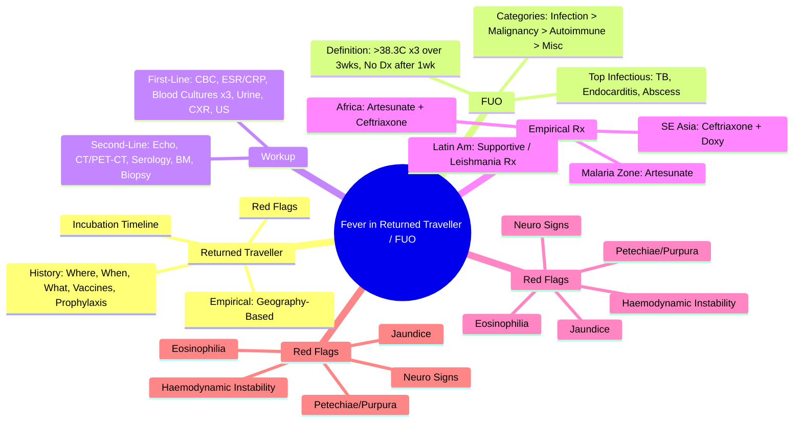

> [!info] **Davidson Ch 11 Alignment**: Infectious Disease → Clinical Syndromes → Fever in Returned Traveller & FUO
> **FCPS/MRCP Focus**: Systematic approach, geographic exposure, timeline, red flags, initial workup, empirical therapy

---

## 1. 🎯 Learning Objectives

- [ ] Define **FUO**: Fever >38.3°C on ≥3 occasions over ≥3 weeks with uncertain diagnosis after 1 week of inpatient investigation
- [ ] Apply **Returned Traveller Approach**: Geographic exposure, timeline, activities, pre-travel interventions
- [ ] Apply **Systematic Initial Workup**: "First-Line" vs "Second-Line" investigations
- [ ] Identify **Red Flags**: Haemodynamic instability, neurological signs, rash patterns, eosinophilia
- [ ] Select **Empirical Therapy**: Geography-based, syndrome-based, resistance patterns
- [ ] Recognise **Common Tropical Causes**: Malaria, Typhoid, Dengue, Typhus, Rickettsia, Enteric Fever, Viral Haemorrhagic Fevers

---

## 2. 📖 Definitions

| Term | Definition |
|------|------------|
| **Fever in Returned Traveller** | Fever in person returning from **tropical/subtropical region** within **6 months** (up to 12 months for some parasites) |
| **Classic FUO** (Petersdorf & Beeson) | Fever **>38.3°C** on **≥3 occasions** over **≥3 weeks** with **uncertain diagnosis after 1 week of inpatient investigation** |
| **Nosocomial FUO** | Fever in hospitalised patient **>48h after admission** with no clear cause after 3 days investigation |
| **Immunodeficient FUO** | **Neutropenia (<500/µL)** or **Immunosuppression** with fever, no cause after 3 days |
| **HIV-associated FUO** | **HIV+** with fever >4 weeks (or >3 days if CD4<200), no cause after appropriate workup |

---

## 3. 📖 Returned Traveller with Fever — Systematic Approach

### 1. Pre-Travel & Travel History (The "Where, When, What")

```mermaid
flowchart TD
    A[Returned Traveller with Fever] --> B[**Detailed Travel History**]
    B --> B1[**Destinations** (Countries, Regions, Urban/Rural)]
    B --> B2[**Dates** (Departure, Return, Duration)]
    B --> B3[**Activities** (Swimming, Caving, Animal Contact, Sexual, Medical/Dental)]
    B --> B4[**Pre-Travel** (Vaccines, Chemoprophylaxis, Insurance)]
    B --> B5[**Illness During Travel** (Self-Treatment, Hospitalisation)]
    B --> C[**Timeline**]
    C --> C1[**Incubation Period** → Narrows Differential]
    C --> C2[**Time Since Return** → Most Acute <1 Month]
    B --> D[**Red Flags** → Urgent Investigations / Admission]
```

### 2. Incubation Period — The Key to Differential

| **Incubation <10 Days** | **5-21 Days** | **2-6 Weeks** | **>6 Weeks** |
|-------------------------|---------------|---------------|--------------|
| **Malaria** (Falciparum 9-14d) | **Typhoid/Paratyphoid** (7-21d) | **Acute HIV** (2-4 wks) | **TB** (Weeks-Months) |
| **Dengue** (4-7d) | **Acute HIV Seroconversion** (2-4 wks) | **TB Meningitis** (2-6 wks) | **Schistosomiasis** (2-12 wks) |
| **Dengue Haemorrhagic Fever** | **Acute Viral Hepatitis** (A: 15-50d, B: 30-180d) | **Brucellosis** (1-8 wks) | **Strongyloides** (Months-Years) |
| **Chikungunya** (2-7d) | **Leptospirosis** (5-14d) | **Q Fever** (2-3 wks) | **Strongyloides Hyperinfection** (Immunosuppressed) |
| **Zika** (3-14d) | **Rickettsial** (5-14d) | **Lyme Disease** (3-30d) | **TB Reactivation** |
| **Chikungunya/Zika** | **Relapsing Fever** (4-18d) | **Cat Scratch Disease** (3-10d) | **Chronic Q Fever** |
| **Influenza/COVID** (1-4d) | **Acute Schistosomiasis** (Katayama, 2-8 wks) | **Acute Q Fever** (2-3 wks) | **Chronic Brucellosis** |
| **Food Poisoning** (Hours-Days) | **Acute HIV** | **Acute Brucellosis** | **Chronic Hepatitis B/C** |
| **Cholera** (Hours-5d) | **Typhoid** | **Acute Q Fever** | **Chronic Strongyloides** |

> [!tip] **Malaria = Rule Out First** in any febrile traveller from **malaria-endemic area** within **3 months** (up to 1 year for P. vivax/ovale).

---

## 4. 📖 FUO — Structured Approach

### Definition (Durack & Street, 1991)

| Criteria | Details |
|----------|---------|
| **Fever** | **>38.3°C** on **≥3 occasions** |
| **Duration** | **≥3 Weeks** |
| **Uncertain Diagnosis** | After **1 Week** of **Inpatient** Investigation (or 3 Outpatient Visits) |
| **Exclusions** | **Not** Immunocompromised (separate category) |

### Aetiological Categories (Classic FUO)

| Category | % of Cases | Examples |
|----------|------------|----------|
| **Infection** | **30-40%** | TB, Endocarditis, Abscess, TB, TB, TB, Brucellosis, EBV, CMV |
| **Malignancy** | **20-25%** | Lymphoma (NHL > HL), RCC, Hepatoma, Leukaemia |
| **Inflammatory/Connective Tissue** | **15-20%** | SLE, RA, Vasculitis (GCA, PAN), AOSD, Sarcoidosis |
| **Miscellaneous** | **10-15%** | Drug Fever, Thrombosis, Factitious, Thyroiditis |
| **Undiagnosed** | **5-15%** | — |

> [!tip] **Infection Still #1 Cause** of FUO even in developed countries. **TB + Endocarditis + Occult Abscess** = Top 3 Infectious Causes.

---

## 5. 📖 Initial Workup — "First-Line" (All Patients)

| Investigation | Indication |
|---------------|------------|
| **CBC + Film** | Anaemia, Leukocytosis/Leukopenia, Atypical Lymphs, Eosinophilia, Thrombocytopenia |
| **ESR / CRP** | Inflammatory Marker (CRP > ESR for Acute) |
| **LFT, Renal, Glucose, Electrolytes** | Organ Dysfunction Baseline |
| **Blood Cultures** | **3 Sets** (Aerobic/Anaerobic) **Before Antibiotics** — *Gold Standard for Endocarditis, Bacteremia* |
| **Urinalysis + Culture** | Occult UTI, Renal TB, Schistosomiasis |
| **Chest X-Ray** | TB, Malignancy, Sarcoidosis, Abscess |
| **Abdominal US / CT** | Abscess, Lymphadenopathy, Splenomegaly, Hepatomegaly |

> [!tip] **"First-Line" = Do These First**. If Negative → **Second-Line**.

---

## 6. 📖 Second-Line Investigations (If First-Line Negative)

| System | Investigations |
|--------|----------------|
| **Infection** | **Blood Cultures (Repeat)**, **Echo (TEE > TTE)** for Endocarditis, **PET-CT** (Occult Abscess/Malignancy), **Serology** (Brucella, Bartonella, Coxiella, Bartonella, Viral Serology), **TB Workup** (IGRA, Sputum AFB×3, PCR, Adenosine Deaminase), **HIV/HTLV** Serology |
| **Malignancy** | **CT Chest/Abd/Pelvis**, **Bone Marrow Biopsy** (if Cytopenias), **Lymph Node Biopsy** (if Nodes), **Tumour Markers** (LDH, β2M, CA-125, PSA, AFP) |
| **Inflammatory** | **ANA, ANCA, RF, CCP, ACE, Immunoglobulins, Complement (C3/C4), Cryoglobulins** |
| **Rare** | **FDG-PET/CT** (Occult Abscess, Vasculitis, Malignancy), **Bone Marrow** (Culture, Histology), **Temporal Artery Biopsy** (GCA), **Liver Biopsy** (Granulomatous Hepatitis) |

---

## 7. 📖 Geographic Syndromes — Common Tropical Causes

| Region | Top Differential Diagnoses |
|--------|---------------------------|
| **Sub-Saharan Africa** | **Malaria (P. falciparum)**, **Typhoid**, **Dengue**, **Rickettsial (African Tick Typhus)**, **African Trypanosomiasis**, **Schistosomiasis**, **HIV Acute** |
| **South Asia (India, SE Asia)** | **Typhoid/Paratyphoid**, **Malaria (P. vivax > falciparum)**, **Dengue**, **Chikungunya**, **Scrub Typhus**, **Leptospirosis**, **Enteric Fever** |
| **Latin America** | **Malaria (P. vivax)**, **Dengue**, **Zika**, **Chikungunya**, **Leishmaniasis**, **Typhoid**, **Typhus (Rickettsia)** |
| **Middle East** | **Brucellosis**, **MERS-CoV**, **Crimean-Congo HF**, **Leishmaniasis**, **TB** |
| **Oceania / Pacific** | **Dengue**, **Malaria**, **Leptospirosis**, **Filariasis**, **Ciguatera** |

> [!tip] **Ask: "Where exactly? Urban vs Rural? Activities? Animal Contact? Insect Bites? Sexual Contact? Medical/Dental Procedures?"**

---

## 8. 📖 Red Flags — Urgent Admission / Intervention

| Red Flag | Action |
|----------|--------|
| **Haemodynamic Instability** (SBP<90, Lactate>4) | **ICU**, **Sepsis Bundle**, **Broad-Spectrum ABX** |
| **Altered Mental Status** | **LP** (Meningitis/Encephalitis), **CT Head** |
| **Petechiae / Purpura** | **Meningococcaemia**, **DIC Screen**, **Empirical Ceftriaxone** |
| **Jaundice + Fever** | **Malaria**, **Leptospirosis**, **Viral Hepatitis**, **Severe Sepsis** |
| **Eosinophilia (>500/µL)** | **Parasitic** (Strongyloides, Schisto, Filaria, Ascaris), **Drug Reaction**, **Eosinophilic Leukaemia** |
| **Returning from Malaria Zone + Fever** | **Urgent Malaria Screen** (RDT + Thick/Thin Film ×3) |
| **Returning from Ebola/Lassa Area + Fever** | **Isolation**, **VHF Protocol**, **Notify Public Health** |

---

## 9. 📖 Empirical Therapy — Geography-Based

| Syndrome / Region | Likely Pathogens | Empirical Therapy (If Severe/Uncertain) |
|-------------------|------------------|----------------------------------------|
| **Fever + Traveller from Malaria Zone** | **Malaria (P. falciparum)** | **IV Artesunate 2.4mg/kg** (WHO) / IV Quinine + Doxycycline **DO NOT DELAY** |
| **Fever + Traveller from SE Asia / India** | **Typhoid (S. Typhi/Paratyphi)**, **Dengue**, **Scrub Typhus** | **Ceftriaxone 2g IV BD** + **Doxycycline 100mg BD** (Covers Typhus, Leptospira, Rickettsia) |
| **Fever + Sub-Saharan Africa** | **Malaria (P. falciparum)**, **Typhoid**, **Rickettsia** | **Artesunate + Ceftriaxone** (Cover both) |
| **Fever + Latin America** | **Dengue, Zika, Chikungunya, Malaria, Leishmania** | **Supportive** (Dengue: Fluids, No NSAIDs); **Leishmania: Liposomal Amphotericin** |
| **Fever + Middle East** | **Brucellosis, MERS-CoV, CCHF, TB** | **Doxycycline + Rifampicin** (Brucella +/-); **Isolate if VHF Suspected** |
| **FUO (No Travel)** | **TB, Endocarditis, Abscess, Lymphoma, Autoimmune** | **Hold ABx** unless Sepsis; **TTE/TEE, CT, PET-CT, Biopsy** |

> [!warning] **Malaria = Medical Emergency**. **Do Not Delay Treatment** for Confirmatory Tests in High Suspicion. **Artesunate IV Preferred Over Quinine**.

---

## 10. 📖 FUO — Management Algorithm

```mermaid
flowchart TD
    A[FUO: Fever >38.3°C x≥3 over ≥3wks, No Dx After 1wk Workup] --> B[**First-Line Workup Complete?**]
    B -->|No| C[**Complete First-Line**]
    B -->|Yes| D[**Second-Line Workup**]
    C --> D
    D --> E{**Diagnosis?**}
    E -->|Yes| F[**Treat Specific Cause**]
    E -->|No| G[**Consider PET-CT / Bone Marrow / Biopsy**]
    G --> H{**Diagnosis?**}
    H -->|Yes| F
    H -->|No| I[**Therapeutic Trial** (TB / Steroids) OR **Palliative** if Terminal]
```

---

## 11. 💡 FCPS/MRCP High-Yield Summary

| Topic | Key Point |
|-------|-----------|
| **FUO Definition** | **>38.3°C x≥3 over ≥3wks**, No Dx after **1 Week Inpatient Workup** |
| **Returned Traveller** | **Timeline = Incubation** → **Geography = Pathogen** |
| **Malaria** | **Rule Out First** in Endemic Area Traveler; **RDT + Thick/Thin Film ×3**; **IV Artesunate** |
| **Typhoid** | **Ceftriaxone**; **Widal Test = Low Sensitivity/Specificity**; **Blood Culture Gold Standard** |
| **Dengue** | **NS1 Ag Day 1-9**, IgM Day 3-5; **Supportive Only**; **Avoid NSAIDs** |
| **FUO Categories** | **Infection (30-40%) > Malignancy (20-25%) > Connective Tissue (15-20%)** |
| **FUO Top Infectious** | **TB, Endocarditis, Occult Abscess** |
| **Red Flags** | **Haemodynamic Instability, Neuro Signs, Petechiae, Eosinophilia, Jaundice** |
| **Returned Traveller Red Flags** | **Malaria Zone + Fever = Treat Empirically for Malaria** |

---

## 12. ❓ Viva Questions

1. **What is the definition of classic FUO?**
   - Fever >38.3°C on ≥3 occasions over ≥3 weeks, with no diagnosis after 1 week of inpatient investigation.

2. **What is the most common cause of FUO?**
   - **Infection (30-40%)**, with TB, Endocarditis, and Occult Abscess being top infectious causes.

3. **What is the most important investigation in a returned traveller with fever?**
   - **Malaria Screen** (RDT + Thick/Thin Film ×3) — **Rule Out First** if from Malaria-Endemic Area.

4. **How do you differentiate Typhoid from other causes of fever in a returned traveller?**
   - **Blood Culture = Gold Standard** (Sensitivity 40-80%); **Widal Test = Low Sensitivity/Specificity**; **Relative Bradycardia**, Rose Spots (Rare), Relative Leukopenia.

5. **What is the empirical treatment for a returned traveller with fever from Southeast Asia?**
   - **Ceftriaxone 2g IV BD + Doxycycline 100mg BD** (Covers Typhoid, Rickettsia, Leptospira).

6. **What is the incubation period for Falciparum Malaria?**
   - **9-14 Days** (Range 7-30 Days); **P. vivax/ovale Can Relapse Months Later** (Hypnozoites).

7. **What investigations are "First-Line" for FUO?**
   - **CBC, ESR/CRP, LFT, Renal, Blood Cultures ×3, Urinalysis, CXR, Abdominal US**.

8. **When do you use PET-CT in FUO?**
   - **After Negative First-Line & Second-Line**; Detects Occult Abscess, Malignancy, Vasculitis, Sarcoidosis.

9. **What is the most common cause of FUO in immunocompromised hosts?**
   - **Infection** (Bacterial, Fungal, Viral, TB); **Opportunistic Infections** based on CD4/CD4 Count.

10. **How do you approach a febrile patient returning from Africa?**
    - **Rule Out Malaria First** (RDT + Microscopy ×3), Consider **Typhoid, Rickettsia, Dengue, Schistosomiasis**; **Empirical Artesunate + Ceftriaxone** if Severe.

---

## 13. 🧠 Confusions & Mnemonics

| Confusion | Clarification |
|-----------|---------------|
| **FUO vs Prolonged Fever** | **FUO = Formal Criteria (Durack)**; **Prolonged Fever = Any Fever >2 Weeks** |
| **Typhoid vs Typhus** | **Typhoid = Salmonella Typhi (Enteric)**; **Typhus = Rickettsia (Vector-Borne, Rash)** |
| **Dengue vs Chikungunya** | **Dengue = NS1 Ag, Thrombocytopenia, Plasma Leakage**; **Chikungunya = Severe Arthralgia, Rare Bleeding** |
| **Malaria Relapse** | **P. vivax/ovale = Hypnozoites → Relapse (Primaquine Needed)**; **P. falciparum = No Relapse** |
| **FUO vs Nosocomial FUO** | **Nosocomial = >48h Post-Admission**; **Immunodeficient = Separate Category** |

| Mnemonic | Meaning |
|----------|---------|
| **"FUO = 3 Weeks, 3 Fevers, 1 Week Workup"** | FUO Definition |
| **"Malaria First = Test & Treat Immediately"** | Traveller Fever |
| **"Typhoid = Ceftriaxone; Typhus = Doxycycline"** | Enteric vs Rickettsial |
| **"FUO = Infection > Cancer > Autoimmune"** | Differential Order |
| **"Eosinophilia = Think Parasites / Drugs / Allergy / Haematology"** | Eosinophilia Differential |

---

## 14. 🗺️ Mind Map



---

## 15. 📋 One-Page Revision Card

| **FEVER IN RETURNED TRAVELLER & FUO – FCPS/MRCP REVISION CARD** |
|------------------------------------------------------------------|
| **FUO Def**: >38.3°C x≥3 over ≥3wks, No Dx after 1wk inpatient workup |
| **Traveller Fever**: **Incubation = Diagnosis**; **Geography = Pathogen** |
| **Malaria**: **RDT + Film x3**, **Artesunate IV** (Severe), **Rule Out First** |
| **Typhoid**: Ceftriaxone; Blood Culture Gold Standard; Relative Bradycardia |
| **Dengue**: NS1 Ag Day 1-9; Supportive; **Avoid NSAIDs**; Monitor Plasma Leak |
| **FUO Categories**: Infection (30-40%) > Malignancy (20-25%) > CTD (15-20%) |
| **FUO Infectious Top 3**: TB, Endocarditis, Occult Abscess |
| **Red Flags**: Shock, Neuro, Petechiae, Eosinophilia, Jaundice |
| **Traveller Red Flag**: Malaria Zone + Fever = **Immediate Malaria Screen** |
| **Empirical**: Africa = Artesunate + Ceftriaxone; SE Asia = Ceftriaxone + Doxy; ME = Doxy/Rifampicin |

---

## 16. 📅 Spaced Repetition Tracker

| Review | Date | Score (1-5) | Next Review |
|--------|------|-------------|-------------|
| Day 1 | 2025-06-17 | | 2025-06-18 |
| Day 3 | | | |
| Day 7 | | | |
| Day 15 | | | |
| Day 30 | | | |

---

## 17. 🎯 Must Know / Should Know / Nice to Know

| Level | Content |
|-------|---------|
| **Must Know** | FUO definition, Traveller fever approach (incubation + geography), Malaria/Typhoid/Dengue basics, FUO categories, Red flags, Empirical therapy by region, Malaria = treat empirically if suspected |
| **Should Know** | Detailed incubation periods, FUO workup algorithm (first/second line), PET-CT role, Nosocomial/Immunocompromised FUO definitions, HIV-associated FUO, Tropical disease specifics (Scrub typhus, Leptospirosis, Rickettsial, Brucellosis) |
| **Nice to Know** | Emerging pathogens (Mpox, Zika, novel coronaviruses), Molecular diagnostics (Syndromic PCR panels), FUO outcome statistics, Cost-effectiveness of PET-CT, Outbreak investigation principles, Public health notification |

---

## 18. ✅ Self-Test Scorecard

| Section | Score (0-10) | Notes |
|---------|--------------|-------|
| Definitions (FUO, Traveller Fever) | | |
| Approach to Returned Traveller | | |
| Malaria / Typhoid / Dengue | | |
| FUO Categories & Workup | | |
| Empirical Therapy by Region | | |
| Red Flags | | |
| Viva Questions | | |

---

## 19. 🔗 Local Navigation

- **Previous**: [[Antimicrobial Prescribing Principles]]
- **Next**: [[Leptospirosis]]
- **Section Hub**: [[Infectious Disease MOC]]
- **MOC**: [[Infectious Disease MOC]]
- **Template**: [[../Templates/Hematology Topic Template]]

---

*Generated for FCPS/MRCP exam preparation. Based on Davidson Medicine 24th Ed Chapter 11.*