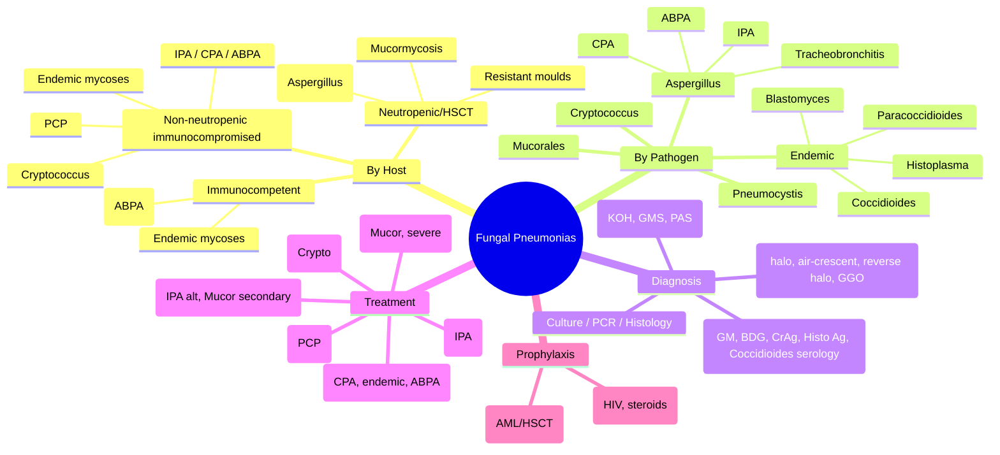
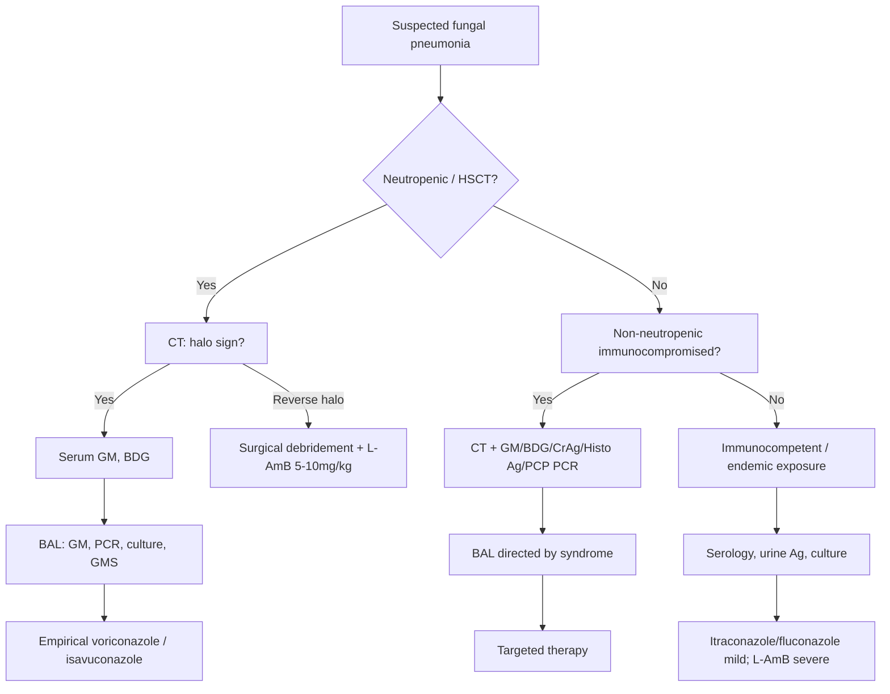

---
tags: [medicine, infectious-disease, davidson, chapter13, fungal, pneumonia, fcps, mrcp]
davidson_chapter: Chapter 13: Infectious disease
topic_category: Respiratory Infections Domain
status: full-fcps-mrcp-topic-note
---

# Fungal Pneumonias

Related: [[Community-Acquired Pneumonia (CAP)]], [[Hospital-Acquired and Ventilator-Associated Pneumonia (HAP-VAP)]], [[Neutropenic Sepsis]], [[Post-Transplant Infections]], [[HIV-Associated Opportunistic Infections]]

> [!important]
> Fungal pneumonias are **opportunistic** — they target immunocompromised hosts (neutropenia, transplant, HIV, steroids, biologics). **Early diagnosis requires low threshold for invasive diagnostics (BAL, biopsy) and rapid antigen/PCR testing.** Empirical therapy often needed before confirmation.

## Learning Objectives
- Classify fungal pneumonias by host immune deficit and geographic epidemiology
- Recognise clinical-radiological syndromes: angioinvasive, airway-invasive, chronic, endemic mycoses
- Select appropriate diagnostics: galactomannan, β-D-glucan, PCR, culture, histopathology
- Initiate empirical and targeted antifungal therapy (azole, echinocandin, polyene)
- Understand prophylaxis strategies in high-risk groups

## Definition
**Fungal pneumonia** = lower respiratory tract infection caused by pathogenic or opportunistic fungi. Classified by:
- **Host immune status**: neutropenic vs non-neutropenic immunocompromised vs immunocompetent
- **Pathogenesis**: angioinvasive (Aspergillus, Mucorales), airway-invasive (Aspergillus tracheobronchitis), chronic (CPA, ABPA), endemic dimorphic (Histoplasma, Coccidioides, Blastomyces)
- **Acquisition**: inhalation of conidia/spores (moulds), reactivation (endemic), aspiration (Candida)

## Core Microbiology — Key Pathogens by Host Context
| Host Context | Primary Pathogens | Key Features |
|--------------|-------------------|--------------|
| **Prolonged neutropenia (AML, HSCT)** | *Aspergillus fumigatus* (80%), *A. flavus*, *A. niger*, *A. terreus* (azole resistance) | Angioinvasive, hemorrhagic infarcts, halo sign → air-crescent |
| | *Mucorales* (Rhizopus, Mucor, Lichtheimia) | Ribbon-like aseptate hyphae, 90° branching, vascular invasion, palate/sinus involvement |
| | *Fusarium*, *Scedosporium*, *Lomentospora* | Resistant moulds; fusarium = bloodstream invasion |
| **Non-neutropenic immunocompromised** (steroids, COPD, transplant, biologics, CGD) | *Aspergillus* (chronic, allergic, invasive) | CPA, ABPA, invasive aspergillosis (IA) |
| | *Pneumocystis jirovecii* | HIV CD4<200, transplant, steroids; ground-glass, ↑β-D-glucan |
| | *Candida* (pneumonia rare) | Usually haematogenous dissemination; consider in VAP |
| | *Cryptococcus neoformans/gattii* | HIV, transplant; nodular/miliary, meningoencephalitis common |
| | *Nocardia* (bacterium, mimics fungus) | Subacute, cavitating, immunocompromised; sulfa treatment |
| **Endemic mycoses** (immunocompetent or immunocompromised) | *Histoplasma capsulatum* | Ohio/Mississippi valleys; bat/bird droppings; intracellular yeast |
| | *Coccidioides immitis/posadasii* | SW USA, CA, Mexico; "Valley fever"; spherules in tissue |
| | *Blastomyces dermatitidis* | Great Lakes, SE USA; broad-based budding yeast |
| | *Paracoccidioides*, *Talaromyces (Penicillium) marneffei* | Latin America, SE Asia; HIV-associated |
| | *Emergomyces* | Emerging, HIV, Africa/Asia |

## Normal Values / Important Cut-offs
| Biomarker | Threshold | Interpretation |
|-----------|-----------|----------------|
| **Serum galactomannan (GM)** | Index ≥0.5 (or ≥1.0 for specificity) | IA in neutropenic; false +ve: π-lactams, Candida, food |
| **BAL galactomannan** | Index ≥1.0 | Higher specificity for pulmonary aspergillosis |
| **Serum β-D-glucan (BDG)** | ≥80 pg/mL (varies by assay) | Pan-fungal (Aspergillus, Candida, Pneumocystis, Histoplasma); **not Mucorales, Cryptococcus** |
| **Aspergillus PCR (blood/BAL)** | Positive (validated assay) | Emerging; not yet standard |
| **Histoplasma antigen (urine/serum)** | Positive | High sensitivity in disseminated/histoplasmosis; cross-reacts Blastomyces |
| **Coccidioides serology (IgM/IgG)** | Positive | IgM = acute; IgG = past/complement fixation titre for severity |
| **Cryptococcal antigen (CrAg)** | Positive (LFA, serum/CSF) | High sensitivity/specificity; titre correlates with burden |

> [!tip]
> **Galactomannan:** False positives with piperacillin-tazobactam (cross-reactivity), certain foods, gut translocation. **β-D-glucan:** False positives with haemodialysis (cellulose membranes), IVIG, gauze, bacteraemia. **Cryptococcal Ag:** Not detected by BDG (capsular polysaccharide).

## Clinical Syndromes and Radiology
| Syndrome | Typical Host | Radiology | Key Features |
|----------|--------------|-----------|--------------|
| **Invasive pulmonary aspergillosis (IPA)** | Neutropenic, HSCT, steroids | **Halo sign** (early, CT) → **air-crescent sign** (recovery), nodules, cavitation | Fever refractory, pleuritic pain, haemoptysis; angioinvasion → thrombosis, infarction |
| **Chronic pulmonary aspergillosis (CPA)** | Pre-existing lung disease (TB, COPD, sarcoid) | Cavities ± fungal ball (aspergilloma), pleural thickening | ≥3 months; weight loss, cough, haemoptysis |
| **Allergic bronchopulmonary aspergillosis (ABPA)** | Asthma, CF | Central bronchiectasis (glove-finger), mucoid impaction, fleeting infiltrates | High IgE, Aspergillus-specific IgE/IgG, eosinophilia |
| **Aspergillus tracheobronchitis** | Lung transplant, airway stENTS | Ulcerative/pseudomembranous/obstructing tracheobronchitis | Cough, dyspnoea, wheeze; bronchoscopy diagnostic |
| **Pneumocystis pneumonia (PCP)** | HIV CD4<200, transplant, steroids | **Bilateral perihilar ground-glass** (classic), cysts, pneumothorax | Subacute dyspnoea, dry cough, fever; LDH ↑, SpO₂ ↓ on exertion |
| **Mucormycosis** | DKA, neutropenia, deferoxamine, transplant | **Reverse halo sign**, sinus/orbital/palate invasion, vascular thrombosis | Rapid progression; KOH: ribbon-like aseptate hyphae 90° branching |
| **Disseminated histoplasmosis** | HIV CD4<150, endemic area | Miliary, mediastinal LAD, hepatosplenomegaly | Fever, weight loss, pancytopenia; urine Ag +ve |
| **Coccidioidal pneumonia** | Endemic area exposure | Lobar/complex pneumonia, hilar LAD, eosinophilia | "Valley fever"; erythema nodosum, arthralgia; spherules on histology |
| **Blastomycosis** | Endemic area, outdoor exposure | Mass-like pneumonia, skin lesions, osteoarticular, GU | Broad-based budding yeast on KOH/histology |

## Approach / Algorithm
```mermaid
flowchart TD
  A[Suspected fungal pneumonia] --> B{Host immune status}
  B -->|Neutropenic / HSCT| C[High suspicion IPA / Mucorales]
  C --> D[CT chest (halo/air-crescent/reverse halo)]
  D --> E[Serum GM + BDG]
  E --> F[BAL for GM, PCR, culture, histopathology]
  F --> G[Empirical voriconazole / isavuconazole<br/>+ liposomal ampho B if Mucorales suspected]
  B -->|Non-neutropenic immunocompromised| H[Consider IPA, CPA, PCP, Cryptococcus, endemic]
  H --> I[CT chest + serum GM/BDG/CrAg/Histoplasma Ag]
  I --> J[BAL if PCP/IPA suspected<br/>Bronchoscopy if airway disease]
  J --> K[Targeted therapy based on pathogen]
  B -->|Immunocompetent / traveller| L[Endemic mycoses: Histoplasma, Coccidioides, Blastomyces]
  L --> M[Serology, urine Ag, culture, histology]
  M --> N[Itraconazole for mild-moderate; ampho B for severe]
```

## Investigations
| Test | Sample | Pathogen(s) | Utility |
|------|--------|-------------|---------|
| **CT chest (HRCT)** | — | All | Halo sign, air-crescent, reverse halo, tree-in-bud, cavities, GGO |
| **Serum galactomannan** | Blood | Aspergillus | Screening in neutropenic; serial monitoring |
| **BAL galactomannan** | BAL | Aspergillus | Higher specificity for IPA |
| **Serum β-D-glucan** | Blood | Pan-fungal (not Mucorales, Cryptococcus) | Rule-out; monitor response |
| **Aspergillus PCR** | Blood/BAL | Aspergillus | Adjunct; not standalone |
| **Histoplasma antigen** | Urine/serum/BAL | Histoplasma | High sensitivity disseminated; cross-reacts Blastomyces |
| **Coccidioides serology (IgM/IgG, CF titre)** | Blood | Coccidioides | Diagnosis + severity monitoring |
| **Blastomyces antigen** | Urine/serum | Blastomyces | Emerging |
| **Cryptococcal antigen (CrAg LFA)** | Blood/CSF | Cryptococcus | Rapid, high sensitivity |
| **Pneumocystis PCR / DFA** | BAL / induced sputum | P. jirovecii | Gold standard for PCP |
| **KOH / Calcofluor white** | BAL / sputum / tissue | Moulds, yeasts | Rapid morphology |
| **Fungal culture** | BAL / blood / tissue | All | Species ID, susceptibility; slow (days-weeks) |
| **Histopathology (H&E, PAS, GMS)** | Tissue (biopsy) | All | **Gold standard** for invasive moulds; hyphal morphology |

## Antifungal Therapy
| Pathogen | First-Line | Alternative / Salvage | Duration / Notes |
|----------|------------|------------------------|------------------|
| **Invasive aspergillosis** | **Voriconazole** 6mg/kg IV BD ×2d → 4mg/kg IV/PO BD (TDM target 1–5.5 mg/L) | Isavuconazole 372mg (200mg ×3) IV/PO BD ×2d → 372mg OD (no TDM needed); L-AmB 3–5mg/kg IV OD | **≥6–12 weeks**; until immune recovery + clinical/radiological resolution; surgery for solitary lesions |
| **Mucormycosis** | **Liposomal amphotericin B** 5–10mg/kg IV OD | Isavuconazole (secondary); posaconazole delayed-release 300mg PO BD | **Surgical debridement mandatory**; continue until resolution + immune recovery |
| **Chronic pulmonary aspergillosis (CPA)** | **Itraconazole** 200mg BD (TDM target 1–2 mg/L) or **Voriconazole** | Posaconazole DR 300mg OD; isavuconazole | **Months to years**; monitor IgE, imaging, symptoms |
| **ABPA** | **Prednisolone** 0.5mg/kg OD ×2w → taper + **itraconazole** 200mg BD ×16w (TDM) | Voriconazole; omalizumab (refractory) | Monitor IgE, CXR, spirometry |
| **Pneumocystis (PCP)** | **TMP-SMX** 15–20mg/kg TMP IV/PO TID (HIV: 21d; non-HIV: 14d) | Clindamycin + primaquine; pentamidine IV; atovaquone; dapsone + TMP | **Adjunctive steroids** if PaO₂<70 or A-a gradient≥35 (HIV) |
| **Cryptococcal pneumonia** | **L-AmB 3–5mg/kg + flucytosine 100mg/kg** ×2w → fluconazole 400mg OD ×8w | Fluconazole monotherapy if mild | **Screen for meningitis** (LP); manage raised ICP |
| **Histoplasmosis (moderate-severe/disseminated)** | **L-AmB 3mg/kg IV OD ×1–2w** → **Itraconazole 200mg BD ×12m** | Fluconazole if itraconazole intolerant | Monitor urine Ag clearance; chronic cavitary → itraconazole ≥12m |
| **Coccidioidomycosis (moderate-severe/disseminated)** | **Fluconazole 400–800mg OD** or **Itraconazole 200mg BD** | L-AmB if severe/meningitis | **Meningitis: fluconazole 800–1200mg OD lifelong** |
| **Blastomycosis (moderate-severe/disseminated)** | **L-AmB 3–5mg/kg ×1–2w** → **Itraconazole 200mg BD ×6–12m** | Fluconazole (less effective) | CNS/meningitis: L-AmB + fluconazole 800mg OD |

> [!important]
> **Voriconazole TDM:** Essential — non-linear kinetics, drug interactions (CYP2C19, CYP3A4), hepatotoxicity, visual disturbances, phototoxicity, periostitis (long-term). **Isavuconazole** = no TDM needed, fewer interactions, QTc shortening (not prolongation), renal adjust not needed.

## Prophylaxis
| Population | Agent | Duration |
|------------|-------|----------|
| **AML induction / HSCT (neutropenic)** | Posaconazole DR 300mg PO OD (or IV) | Until neutrophil recovery |
| | Voriconazole (if posaconazole intolerant) | |
| | Micafungin 50mg IV OD (echinocandin) | |
| **Lung transplant** | Voriconazole / itraconazole / nebulised amphotericin | 3–12 months (centre-specific) |
| **HIV CD4<200** | TMP-SMX 960mg PO OD (or 3x/week) | Until CD4>200 ×3m |
| | Dapsone; atovaquone; aerosolised pentamidine | Alternatives |
| **Prolonged steroids (≥20mg prednisolone >4w)** | TMP-SMX 960mg OD 3x/week | Duration of immunosuppression |

## Red Flags / Emergencies
- **Haemoptysis** (massive) in IPA → bronchial artery embolisation, surgery
- **Airway obstruction** from Aspergillus tracheobronchitis / mucormycosis → bronchoscopic debridement, stenting
- **Cavitary rupture** → pneumothorax, pyopneumothorax
- **Cerebral mucormycosis** (rhino-orbito-cerebral) → emergent surgical debridement + L-AmB
- **Raised ICP in cryptococcal meningitis** → serial LP, ventriculostomy
- **Adrenal insufficiency** in disseminated histoplasmosis/coccidioidomycosis → steroid replacement

## Differential Diagnosis
| Mimic | Clues |
|-------|-------|
| **TB** | Cavitation, upper lobe, night sweats, AFB +ve, GeneXpert; endemic overlap |
| **Malignancy** | Mass, weight loss, smoking history; PET-CT; biopsy |
| **Granulomatosis with polyangiitis (GPA)** | Cavitary nodules, renal, sinuses, c-ANCA/PR3 +ve |
| **Septic emboli** | Multiple cavitary nodules, IVDU, tricuspid endocarditis, blood cultures |
| **Organising pneumonia** | COP pattern, responsive to steroids, no organism |
| **Nocardia** | Subacute, cavitating, immunocompromised; modified AFB +ve; sulfa treatment |

## Special Situations
| Situation | Adjustment |
|-----------|------------|
| **Renal impairment** | L-AmB preferred over conventional AmB; voriconazole IV (SBECD vehicle) accumulates — use PO or isavuconazole; flucytosine adjust by CrCl; echinocandins safe |
| **Hepatic impairment** | Voriconazole/itraconazole/posaconazole caution (hepatotoxicity); isavuconazole safer; L-AmB safe |
| **Drug interactions (voriconazole/itraconazole/posaconazole)** | **Strong CYP3A4 inhibitors/inducers** — avoid with rifampicin, carbamazepine, phenytoin, St John's wort; **check all meds** (TDM essential) |
| **Pregnancy** | **Avoid azoles** (teratogenic); L-AmB safe; echinocandins 2nd/3rd trimester if needed; TMP-SMX avoid 1st trimester |
| **Liver transplant** | Voriconazole/posaconazole interactions with tacrolimus/ciclosporin — **dose reduce CNI 50–75%, TDM mandatory** |

## FCPS/MRCP High-Yield Points
- **IPA diagnosis:** Host + halo sign/air-crescent + GM + culture/histology (EORTC/MSG criteria: proven/probable/possible)
- **Halo sign** = early CT finding in neutropenic IPA (haemorrhagic infarct); **air-crescent** = recovery (cavitation)
- **Reverse halo sign** = mucormycosis (central GGO + consolidated ring)
- **Galactomannan:** serum ≥0.5 (screening), BAL ≥1.0 (diagnostic); false +ve with pip-tazo
- **β-D-glucan:** pan-fungal; **negative in Mucorales and Cryptococcus**
- **PCP:** bilateral perihilar GGO, CD4<200, high LDH, ↑BDG; induced sputum/BAL PCR/DFA
- **First-line IPA:** voriconazole (TDM); alternative isavuconazole (no TDM)
- **First-line mucormycosis:** L-AmB 5–10mg/kg + **urgent surgical debridement**
- **PCP treatment:** TMP-SMX high-dose; **adjunctive steroids if hypoxic** (PaO₂<70)
- **Cryptococcal pneumonia:** screen for meningitis (LP); L-AmB + flucytosine induction
- **Endemic mycoses:** Histoplasma (urine Ag), Coccidioides (serology CF titre), Blastomyces (broad-based budding yeast, urine Ag)
- **Prophylaxis:** posaconazole in AML/HSCT; TMP-SMX in HIV CD4<200 and steroid immunosuppression

## Common Viva Questions
1. **What is the halo sign and in which condition is it seen?** Early CT in neutropenic IPA — haemorrhagic infarction around nodule; indicates angioinvasion.
2. **How does β-D-glucan differ from galactomannan?** BDG = pan-fungal (Aspergillus, Candida, Pneumocystis, Histoplasma); GM = Aspergillus-specific. BDG negative in Mucorales, Cryptococcus.
3. **First-line treatment for invasive aspergillosis?** Voriconazole (with TDM); alternative isavuconazole.
4. **Mucormycosis management cornerstone?** Liposomal amphotericin B + **urgent surgical debridement**.
5. **When do you give adjunctive steroids in PCP?** HIV + PaO₂<70 mmHg or A-a gradient≥35; non-HIV: also if severe hypoxia.
6. **What is the reverse halo sign?** Central ground-glass opacity surrounded by ring of consolidation — suggestive of mucormycosis (also organising pneumonia, TB).
7. **Which antifungal requires TDM?** Voriconazole, itraconazole, posaconazole, flucytosine. Isavuconazole does not.
8. **Histoplasma vs Blastomyces urine antigen cross-reactivity?** Histoplasma Ag cross-reacts with Blastomyces (~80%); Blastomyces Ag more specific.

## Common Confusions / Exam Traps
| Confusion | Clarification |
|-----------|---------------|
| Halo sign = air-crescent sign | Halo = early (hemorrhagic rim); air-crescent = late (cavitation with crescent of air) |
| BDG positive in all fungi | **Negative in Mucorales (no β-glucan in cell wall) and Cryptococcus (capsule masks)** |
| Voriconazole = first-line for everything | Mucormycosis = L-AmB; CPA = itraconazole; ABPA = steroids + itraconazole |
| GM positive = proven aspergillosis | GM = probable (with host + radiology); **proven = histology + culture from sterile site** |
| PCP only in HIV | Also in transplant, steroids, biologics, rheumatology — any T-cell defect |
| Itraconazole capsules = solution | **Solution has better bioavailability**; capsules need food/acid; use solution for prophylaxis |
| Fluconazole for aspergillosis | **No activity against moulds** (Aspergillus, Mucorales) — only yeasts |
| Echinocandins for mucormycosis | **No activity against Mucorales** (lack target β-1,3-glucan synthase) |

## Mnemonics
- **HALO**: **H**aemorrhagic **A**ngioinvasion in **L**eukopenia **O**n CT = IPA
- **AIR-CRESCENT**: **A**ir crescent = **R**ecovery in **C**hest = **E**arly **S**ign of **C**avitation **E**merging **N**ow **T**reatment working
- **REVERSE HALO** = **MUCOR** (central GGO + consolidation ring)
- **GM FALSE +VE**: **P**ip-tazo, **F**ood, **G**ut translocation, **C**andida, **A**ntibiotics (β-lactams)
- **BDG NEGATIVE**: **M**ucorales, **C**ryptococcus

## Mind Map


## Flowchart


## Suggested Visuals / Image Notes
- CT chest: halo sign, air-crescent sign, reverse halo sign, IPA nodules, CPA cavitation, PCP GGO
- KOH prep: Aspergillus (septate, acute-angle branching), Mucorales (ribbon-like, 90°, aseptate), Histoplasma (intracellular yeast), Blastomyces (broad-based budding), Coccidioides (spherule)
- GMS/PAS stained tissue sections
- Galactomannan/BDG kinetics charts
- Antifungal spectrum table

## Suggested Video References
- EORTC/MSG criteria for IPA (ECCMID/ESCMID talks)
- CT patterns in fungal pneumonia (RSNA/ECR)
- Bronchoscopy for fungal tracheobronchitis
- Antifungal TDM practical guides
- Surgical management of mucormycosis

## One-Page Revision Summary
| Pathogen | Host | Radiology | Biomarker | First-Line Rx |
|----------|------|-----------|-----------|---------------|
| **IPA (Aspergillus)** | Neutropenic, HSCT, steroids | Halo → air-crescent | Serum GM≥0.5, BAL GM≥1.0, BDG + | Voriconazole (TDM) / Isavuconazole |
| **Mucormycosis** | DKA, neutropenia, deferoxamine | Reverse halo, sinus/orbit | **BDG negative**, KOH 90° hyphae | **L-AmB 5-10mg/kg + surgery** |
| **PCP** | HIV CD4<200, steroids, transplant | Bilateral perihilar GGO | BDG ↑↑, induced sputum/BAL PCR | TMP-SMX high-dose ± steroids if hypoxic |
| **Cryptococcus** | HIV, transplant | Nodular, miliary, meningoencephalitis | **CrAg +ve (serum/CSF)**, BDG - | L-AmB + flucytosine → fluconazole |
| **Histoplasma** | Endemic, HIV CD4<150 | Miliary, LAD, hepatosplenomegaly | **Urine Ag +ve** (cross-reacts Blastomyces) | L-AmB → itraconazole ×12m |
| **Coccidioides** | SW USA, travellers | Pneumonia, hilar LAD, eosinophilia | **IgM/IgG serology, CF titre** | Fluconazole/itraconazole; meningitis = fluconazole lifelong |
| **Blastomyces** | Great Lakes, outdoors | Mass-like pneumonia, skin/bone | **Broad-based budding yeast**, urine Ag | L-AmB → itraconazole ×6-12m |
| **CPA** | Pre-existing lung disease | Cavities, aspergilloma | GM variable, Aspergillus IgG | Itraconazole (TDM) months-years |
| **ABPA** | Asthma, CF | Central bronchiectasis, mucoid impaction | High IgE, Aspergillus IgE/IgG, eosinophilia | Prednisolone + itraconazole |

## 24-Hour Recall Prompts
- Draw the halo sign vs air-crescent sign vs reverse halo sign.
- List 3 differences between voriconazole and isavuconazole.
- When is BDG negative despite invasive fungal infection?
- What is the first-line treatment for mucormycosis?
- Name the 3 endemic mycoses and their key diagnostic tests.

## 7-Day / 15-Day / 30-Day Revision Tracker
- [ ] Day 1 completed
- [ ] 24-hour recall completed
- [ ] Day 7 revision completed
- [ ] Day 15 revision completed
- [ ] Day 30 revision completed

## Must Know / Should Know / Nice to Know
### Must Know
- IPA: host, halo/air-crescent, GM, voriconazole (TDM)
- Mucormycosis: reverse halo, BDG negative, L-AmB + surgery
- PCP: GGO, CD4<200, BDG, TMP-SMX ± steroids
- Cryptococcus: CrAg, L-AmB + flucytosine, screen meningitis
- Endemic mycoses: Histoplasma (urine Ag), Coccidioides (serology), Blastomyces (broad-based budding)
- Prophylaxis: posaconazole (AML/HSCT), TMP-SMX (HIV CD4<200, steroids)

### Should Know
- CPA vs ABPA vs IPA distinction
- Itraconazole solution vs capsules, TDM
- Isavuconazole advantages (no TDM, fewer interactions)
- Flucytosine dosing by CrCl, toxicity (myelosuppression)
- Antifungal drug interactions (CYP3A4)
- Echinocandins: role in Candida, no mould activity

### Nice to Know
- Resistant moulds: A. terreus (ampho B resistant), Scedosporium, Lomentospora, Fusarium
- Newer agents: olorofim, fosmanogepix, rezafungin
- Antifungal stewardship in ICU
- PCP in non-HIV (shorter course 14d, steroids less clear)
- Chronic cavitary histoplasmosis / coccidioidal meningitis management

## My Weak Points
- [ ] Memorise voriconazole dose adjustments for liver/renal impairment
- [ ] Itraconazole TDM targets for different indications
- [ ] Flucytosine CrCl dosing table
- [ ] Coccidioidal CF titre interpretation for meningitis risk

## Self-Test Scorecard
- Understanding: /10
- Recall: /10
- MCQ Performance: /10
- SBA Performance: /10
- Viva Confidence: /10
- Total: /50

> [!tip]
> Interpretation: <35 = weak topic, 35-44 = acceptable but insecure, 45+ = strong exam-ready topic.

## Exam Answer Modes
### Long Answer Skeleton
1. Classification by host immune status
2. Key pathogens per host group
3. Clinical-radiological syndromes (IPA, CPA, ABPA, PCP, mucormycosis, endemic)
4. Diagnostic approach: CT, biomarkers (GM, BDG, CrAg, Ag), microscopy, culture, histology
5. EORTC/MSG criteria for IPA (proven/probable/possible)
6. Antifungal therapy by pathogen (first-line, alternatives, duration)
7. Prophylaxis strategies
8. Drug interactions, TDM, special populations

### Short Note Skeleton
- Neutropenic: IPA (halo→air-crescent, GM, voriconazole); Mucor (reverse halo, BDG -, L-AmB + surgery)
- Non-neutropenic immunocompromised: PCP (GGO, BDG, TMP-SMX ± steroids); Crypto (CrAg, L-AmB+5FC); CPA/ABPA
- Endemic: Histo (urine Ag), Cocci (serology), Blasto (broad-based yeast)
- Biomarkers: GM (Aspergillus), BDG (pan-fungal, not Mucor/Crypto), CrAg (Crypto)
- Prophylaxis: posaconazole (neutropenic), TMP-SMX (HIV/steroids)

### Viva One-Liners
- Halo sign = early IPA in neutropenia; air-crescent = recovery
- Reverse halo = mucormycosis
- BDG negative in Mucorales and Cryptococcus
- Voriconazole = IPA first-line (TDM); isavuconazole = no TDM
- Mucormycosis = L-AmB + urgent surgery
- PCP = bilateral GGO + TMP-SMX high-dose + steroids if hypoxic
- Histoplasma urine Ag cross-reacts with Blastomyces

### Ward-Case Discussion Points
- AML induction, day 10 neutropenic, fever, CXR nodule → CT halo sign → serum GM + start voriconazole
- DKA, sinus pain, black eschar on palate → mucormycosis → L-AmB + ENT/neurosurgery urgent debridement
- HIV CD4 80, 2w dyspnoea, bilateral GGO, SpO₂ 88% → PCP → TMP-SMX IV + prednisolone 40mg BD ×5d
- Lung transplant, cough, wheeze → bronchoscopy: Aspergillus tracheobronchitis → voriconazole + bronchoscopic debridement

### Last-Night-Before-Exam Sheet
**FUNGAL PNEUMONIAS:** Neutropenic: IPA (halo→air-crescent, GM≥0.5, vorico TDM); Mucor (reverse halo, BDG -, L-AmB + surgery). Non-neutro: PCP (GGO, BDG↑, TMP-SMX ± steroids); Crypto (CrAg, L-AmB+5FC); CPA (cavities, itraco); ABPA (bronchiectasis, IgE↑, steroids+itraco). Endemic: Histo (urine Ag), Cocci (IgM/IgG CF titre), Blasto (broad-based budding). Prophy: posaco (AML/HSCT), TMP-SMX (HIV CD4<200, steroids). TDM: vorico, itraco, posaco, 5FC. Interactions: CYP3A4.

## Summary
Fungal pneumonias are opportunistic infections stratified by host immunity. In **neutropenic/HSCT** patients, **invasive pulmonary aspergillosis (IPA)** dominates — hallmark CT **halo sign** (early) → **air-crescent** (recovery); diagnosed by galactomannan (serum ≥0.5, BAL ≥1.0) ± PCR; treated with **voriconazole (TDM)** or **isavuconazole**. **Mucormycosis** (DKA, neutropenia) shows **reverse halo sign**, **BDG negative**, ribbon-like 90° aseptate hyphae; needs **L-AmB + urgent surgical debridement**. **PCP** (HIV CD4<200, steroids): bilateral perihilar **GGO**, high **BDG**, **TMP-SMX high-dose** ± **steroids if hypoxic**. **Cryptococcal pneumonia**: **CrAg positive**, screen for meningitis, **L-AmB + flucytosine** induction. **Endemic mycoses**: Histoplasma (urine Ag), Coccidioides (IgM/IgG serology, CF titre), Blastomyces (broad-based budding yeast). **Prophylaxis**: posaconazole in AML/HSCT; TMP-SMX in HIV CD4<200 and prolonged steroids. **TDM essential** for voriconazole, itraconazole, posaconazole, flucytosine; isavuconazole does not require TDM.

## MCQs (10)
1. **A 28-year-old man with AML on day 12 of induction chemotherapy (neutrophils 0.1×10⁹/L) develops fever refractory to broad-spectrum antibiotics. CT chest shows a 2cm right upper lobe nodule with surrounding ground-glass halo. Serum galactomannan index is 1.8. What is the most likely diagnosis?**
   A. Bacterial pneumonia
   B. Invasive pulmonary aspergillosis
   C. Mucormycosis
   D. Pneumocystis pneumonia
   E. Septic pulmonary emboli

2. **Which CT finding is CHARACTERISTIC of mucormycosis (not IPA)?**
   A. Halo sign
   B. Air-crescent sign
   C. Reverse halo sign
   D. Tree-in-bud
   E. Centrilobular nodules

3. **β-D-glucan is typically NEGATIVE in which invasive fungal infection?**
   A. Invasive aspergillosis
   B. Invasive candidiasis
   C. Pneumocystis pneumonia
   D. Mucormycosis
   E. Histoplasmosis

4. **First-line treatment for invasive pulmonary aspergillosis in a 45-year-old HSCT recipient?**
   A. Liposomal amphotericin B 5mg/kg
   B. Voriconazole 6mg/kg BD IV ×2d → 4mg/kg BD (with TDM)
   C. Fluconazole 400mg OD
   D. Caspofungin 70mg then 50mg OD
   E. Itraconazole 200mg BD

5. **A 35-year-old woman with HIV (CD4 80) presents with 2 weeks dyspnoea, dry cough, fever. CXR shows bilateral perihilar ground-glass. SpO₂ 89% on room air. LDH 450. Induced sputum PCR positive for P. jirovecii. Besides TMP-SMX, what adjunctive therapy is indicated?**
   A. Corticosteroids (prednisolone 40mg BD ×5d → taper)
   B. G-CSF
   C. IVIG
   D. Anticoagulation
   E. No adjunctive therapy needed

6. **Cryptococcal antigen (CrAg) lateral flow assay: which statement is TRUE?**
   A. Detects capsular glucuronoxylomannan
   B. Positive in serum but negative in CSF
   C. Cross-reacts with Histoplasma antigen
   D. Low sensitivity in HIV-associated cryptococcosis
   E. Titre does not correlate with fungal burden

7. **Histoplasma urine antigen cross-reacts significantly with which other endemic mycosis?**
   A. Coccidioides
   B. Blastomyces
   C. Paracoccidioides
   D. Talaromyces
   E. Emergomyces

8. **Which antifungal does NOT require therapeutic drug monitoring?**
   A. Voriconazole
   B. Itraconazole
   C. Posaconazole
   D. Isavuconazole
   E. Flucytosine

9. **Management of rhino-orbito-cerebral mucormycosis in a patient with DKA: what is the single most critical intervention?**
   A. Intravenous insulin infusion
   B. Liposomal amphotericin B 10mg/kg
   C. **Urgent surgical debridement** of sinuses/orbit
   D. Posaconazole delayed-release 300mg BD
   E. Hyperbaric oxygen

10. **Allergic bronchopulmonary aspergillosis (ABPA) diagnostic criteria include ALL EXCEPT:**
    A. Asthma or cystic fibrosis
    B. Immediate skin test reactivity to Aspergillus / specific IgE
    C. Total IgE >1000 IU/mL
    D. **Positive Aspergillus galactomannan in serum**
    E. Central bronchiectasis on CT

## SBA Questions (10)
1. **A 50-year-old man, 100 days post-allogeneic HSCT for AML (on tacrolimus for mild GVHD), presents with fever, cough, pleuritic chest pain. CT shows multiple nodules with halo sign. BAL galactomannan index 2.5, culture grows Aspergillus fumigatus. He is on tacrolimus 3mg BD. Best antifungal choice?**
   A. Voriconazole 4mg/kg BD (reduce tacrolimus dose ~50–75%, TDM both)
   B. Isavuconazole 372mg OD (reduce tacrolimus ~50%, no voriconazole TDM needed)
   C. Liposomal amphotericin B 5mg/kg
   D. Caspofungin 50mg OD
   E. Itraconazole 200mg BD

2. **A 60-year-old man with poorly controlled diabetes (HbA1c 9.5%) presents with facial pain, nasal congestion, black eschar on hard palate, and blurred vision. CT shows sinus opacification with orbital extension. KOH from nasal scraping shows broad, ribbon-like, aseptate hyphae with 90° branching. Immediate management?**
   A. IV insulin infusion + liposomal amphotericin B 5mg/kg
   B. **IV insulin infusion + liposomal amphotericin B 10mg/kg + URGENT ENT/neurosurgical debridement**
   C. Posaconazole 300mg BD + surgical debridement next week
   D. Voriconazole 6mg/kg BD + surgical debridement
   E. Amphotericin B deoxycholate 1mg/kg + debridement

3. **Regarding galactomannan testing, which statement is CORRECT?**
   A. Serum GM ≥1.0 is diagnostic of proven IPA
   B. BAL GM ≥1.0 has higher specificity than serum GM for pulmonary aspergillosis
   C. Piperacillin-tazobactam causes false NEGATIVE GM
   D. GM is positive in mucormycosis
   E. GM testing replaces need for histopathology

4. **A 40-year-old woman on high-dose prednisolone (40mg/day ×6 weeks) for SLE flare presents with 10 days progressive dyspnoea, non-productive cough, fever. CXR bilateral interstitial infiltrates. SpO₂ 90% on air. β-D-glucan 350 pg/mL. Induced sputum negative for Pneumocystis PCR. What is the next best diagnostic step?**
   A. Start TMP-SMX empirically
   B. **Bronchoscopy with BAL for Pneumocystis PCR/DFA, galactomannan, culture**
   C. High-resolution CT only
   D. Serum galactomannan only
   E. Lung biopsy

5. **Which statement about isavuconazole is TRUE?**
   A. Requires therapeutic drug monitoring like voriconazole
   B. Prolongs QTc interval
   C. **Loaded as 372mg (200mg ×3 capsules) IV/PO every 8h ×6 doses, then 372mg OD**
   D. Contraindicated in hepatic impairment
   E. No activity against Mucorales

6. **A 30-year-old HIV-positive man (CD4 150, not on ART) returns from caving in Ohio Valley. 3 weeks fever, weight loss, hepatosplenomegaly, pancytopenia. Blood culture grows small intracellular yeast. Urine antigen positive. Best initial therapy?**
   A. Fluconazole 400mg OD
   B. Itraconazole 200mg BD
   C. **Liposomal amphotericin B 3mg/kg IV OD**
   D. Voriconazole 4mg/kg BD
   E. TMP-SMX DS BD

7. **Coccidioidal meningitis: what is the preferred lifelong suppressive therapy?**
   A. Itraconazole 200mg BD
   B. **Fluconazole 800–1200mg OD**
   C. Liposomal amphotericin B
   D. Voriconazole 4mg/kg BD
   E. Posaconazole 300mg OD

8. **In a lung transplant recipient with Aspergillus tracheobronchitis (ulcerative type on bronchoscopy), what is the optimal management?**
   A. Oral itraconazole alone
   B. Voriconazole + bronchoscopic debridement
   C. Nebulised amphotericin alone
   D. Caspofungin + voriconazole
   E. Observation only

9. **Which patient does NOT need Pneumocystis prophylaxis?**
   A. HIV CD4 180
   B. Allogeneic HSCT day +30 (on tacrolimus)
   C. **Solid organ transplant 2 years post, on low-dose tacrolimus only, no recent rejection**
   D. Rheumatoid arthritis on prednisolone 25mg + methotrexate + infliximab
   E. AML induction chemotherapy (neutropenic)

10. **Blastomyces dermatitidis: which microscopic feature is PATHOGNOMONIC?**
    A. Narrow-based budding yeast
    B. **Broad-based budding yeast (single, wide-based daughter cell)**
    C. Spherule with endospores
    D. Intracellular yeast in macrophages
    E. Capsular polysaccharide on India ink

## Flashcards
- Q: Halo sign = ?
  A: Early CT finding in neutropenic IPA — ground-glass rim around nodule = haemorrhagic infarction from angioinvasion
- Q: Air-crescent sign = ?
  A: Late CT finding in IPA recovery — crescent of air within cavity = cavitation separating from viable lung
- Q: Reverse halo sign = ?
  A: Central GGO surrounded by consolidation ring — suggestive of mucormycosis (also organising pneumonia, TB)
- Q: Mucormycosis KOH morphology
  A: Ribbon-like, aseptate (rare septae), 90° branching
- Q: Aspergillus KOH morphology
  A: Septate hyphae, acute-angle (45°) branching
- Q: Galactomannan serum threshold
  A: ≥0.5 (screening); ≥1.0 for higher specificity
- Q: Galactomannan BAL threshold
  A: ≥1.0
- Q: Galactomannan false positives
  A: Piperacillin-tazobactam, certain foods, gut translocation, Candida, other β-lactams
- Q: β-D-glucan = ?
  A: Pan-fungal marker (1,3-β-D-glucan in cell wall); positive in Aspergillus, Candida, Pneumocystis, Histoplasma
- Q: β-D-glucan NEGATIVE in
  A: Mucorales (no β-glucan), Cryptococcus (capsule masks)
- Q: First-line IPA treatment
  A: Voriconazole 6mg/kg BD ×2d → 4mg/kg BD (TDM target 1–5.5); alternative isavuconazole
- Q: First-line mucormycosis
  A: L-AmB 5–10mg/kg IV OD + urgent surgical debridement
- Q: PCP classic CXR/CT
  A: Bilateral perihilar ground-glass; cysts, pneumothorax possible
- Q: PCP treatment
  A: TMP-SMX 15–20mg/kg TMP TID (HIV 21d, non-HIV 14d); + steroids if PaO₂<70 or A-a≥35
- Q: Cryptococcus diagnosis
  A: CrAg LFA serum/CSF (high sensitivity); India ink (low sensitivity); culture
- Q: Cryptococcus pneumonia treatment
  A: L-AmB 3–5mg/kg + flucytosine 100mg/kg ×2w → fluconazole 400mg OD ×8w; screen for meningitis
- Q: Histoplasma diagnosis
  A: Urine/serum antigen (high sensitivity disseminated); cross-reacts Blastomyces; yeast in macrophages
- Q: Coccidioides diagnosis
  A: Serology IgM (acute) / IgG (past), CF titre (severity); spherules on histology
- Q: Blastomyces diagnosis
  A: Broad-based budding yeast on KOH/histology; urine Ag emerging
- Q: CPA treatment
  A: Itraconazole 200mg BD (TDM) long-term; alternatives vorico, posaco, isavuco
- Q: ABPA treatment
  A: Prednisolone 0.5mg/kg ×2w taper + itraconazole 200mg BD ×16w (TDM)
- Q: Posaconazole prophylaxis
  A: AML induction, HSCT — until neutrophil recovery
- Q: TMP-SMX prophylaxis
  A: HIV CD4<200; prolonged steroids >20mg/day >4w; transplant

## Answer Key with Explanations
### MCQs
1. **B** — Neutropenic host + halo sign + elevated GM = classic IPA. Bacterial pneumonia no halo. Mucormycosis = reverse halo. PCP = GGO. Septic emboli = multiple nodules in IVDU.
2. **C** — Reverse halo sign (central GGO + consolidation ring) is characteristic of mucormycosis; halo/air-crescent = IPA.
3. **D** — β-D-glucan detects 1,3-β-D-glucan in fungal cell wall. Mucorales lack β-glucan (cell wall = chitosan, chitin). Cryptococcus capsule masks glucan. All others positive.
4. **B** — Voriconazole is first-line for IPA per IDSA/ECIL guidelines. TDM mandatory. Isavuconazole alternative. L-AmB = mucormycosis/severe refractory. Fluconazole/caspofungin/itraconazole not first-line.
5. **A** — PCP with hypoxia (PaO₂<70 or SpO₂<90% / A-a gradient≥35) → adjunctive corticosteroids (prednisolone 40mg BD ×5d → taper over 21d). Proven mortality benefit in HIV.
6. **A** — CrAg LFA detects capsular glucuronoxylomannan (GXM). High sensitivity in serum and CSF. Titre correlates with burden. No cross-reaction with Histoplasma Ag.
7. **B** — Histoplasma urine antigen cross-reacts with Blastomyces (~80% cross-reactivity). Does not cross-react significantly with Coccidioides, Paracoccidioides, Talaromyces.
8. **D** — Isavuconazole does not require TDM (linear kinetics, wide therapeutic window). Voriconazole, itraconazole, posaconazole, flucytosine all require TDM.
9. **C** — Mucormycosis = L-AmB + **urgent surgical debridement** is cornerstone. Medical therapy alone fails due to vascular thrombosis/necrosis. Insulin for DKA concurrent.
10. **D** — ABPA criteria: asthma/CF, immediate hypersensitivity (skin test/specific IgE), total IgE >1000, central bronchiectasis, precipitating antibodies (IgG), eosinophilia. **GM NOT a criterion**.

### SBAs
1. **B** — HSCT + GVHD on tacrolimus + IPA. Voriconazole interacts strongly with tacrolimus (CYP3A4) — requires 50–75% tacrolimus dose reduction + TDM both. Isavuconazole has less interaction, no TDM needed, similar efficacy — preferred in transplant. L-AmB nephrotoxic with tacrolimus. Caspofungin monotherapy not standard for IPA. Itraconazole absorption variable.
2. **B** — Rhino-orbito-cerebral mucormycosis in DKA = **triad: glycaemic control + L-AmB 10mg/kg + URGENT surgical debridement**. Delaying surgery increases mortality. Posaconazole/voriconazole not first-line. Deoxycholate ampho B more nephrotoxic.
3. **B** — BAL GM ≥1.0 has higher specificity than serum for pulmonary aspergillosis. Serum GM ≥0.5 = probable (with host/radiology); proven = histology + culture. Pip-tazo causes false POSITIVE. GM negative in mucormycosis. Histopathology still gold standard.
4. **B** — Steroid immunosuppression + subacute dyspnoea + bilateral infiltrates + elevated BDG = high suspicion PCP. Induced sputum PCR sensitivity ~80%; BAL PCR/DFA >95%. Bronchoscopy indicated if non-invasive negative and high suspicion.
5. **C** — Isavuconazole loading: 372mg (200mg ×3) IV/PO q8h ×6 doses, then 372mg OD. QTc shortening (not prolongation). No TDM. Hepatic impairment caution but not contraindicated. Has activity against Mucorales (secondary).
6. **C** — Disseminated histoplasmosis in HIV (CD4<150) = moderate-severe → L-AmB 3mg/kg IV ×1–2w → itraconazole 200mg BD ×12m. Fluconazole less effective. Itraconazole alone for mild. TMP-SMX not for histo.
7. **B** — Coccidioidal meningitis = lifelong fluconazole 800–1200mg OD (itraconazole alternative but fluconazole better CNS penetration). L-AmB for induction if severe.
8. **B** — Aspergillus tracheobronchitis in lung transplant = voriconazole + bronchoscopic debridement (mechanical removal of plaques/mucus plugs). Nebulised ampho adjunct. Caspofungin not for mould tracheobronchitis.
9. **C** — PCP prophylaxis indicated: HIV CD4<200, HSCT (until engraftment + GVHD), SOT first 6–12m (or lifelong if high immunosuppression), steroids >20mg >4w, biologics + steroids. **Low-dose tacrolimus alone at 2 years = not indicated**.
10. **B** — Blastomyces = broad-based budding yeast (single wide-based daughter cell). Narrow-based = Candida. Spherule = Coccidioides. Intracellular = Histoplasma. Capsule = Cryptococcus.

---

## PasTest Scenario SBAs (Clinical Vignettes)

> **Auto-generated PasTest/Mediscope-style scenario SBAs** grounded in the authored source. Each scenario tests a real clinical fact (triad, specific sign, contraindication, trial, first-line Rx) extracted from the topic. *Source: Ch 14: Infectious Disease — Fungal Pneumonias*

**Q1.** Which of the following features is most specific or characteristic of Fungal Pneumonias?

  - **A.** BAL galactomannan
  - **B.** A feature common to many acute inflammatory conditions
  - **C.** A non-specific sign that does not localise the diagnosis
  - **D.** An investigation finding rather than a clinical feature

  > **Answer: A** — BAL galactomannan
  >
  > *Source:* |
| **Serum galactomannan** | Blood | Aspergillus | Screening in neutropenic; serial monitoring |
| **BAL galactomannan** | BAL | Aspergillus | Higher specificity for IPA |
| **Serum β-D-glucan** | Bl

**Q2.** What is the most appropriate first-line therapy for Fungal Pneumonias?

  - **A.** Invasive aspergillosis + Voriconazole + ≥6–12 weeks
  - **B.** An advanced/surgical therapy reserved for refractory disease
  - **C.** Symptomatic treatment only, no disease-modifying therapy
  - **D.** Empiric broad-spectrum therapy without specific indication

  > **Answer: A** — Invasive aspergillosis + Voriconazole + ≥6–12 weeks
  >
  > *Source:* **Invasive aspergillosis**   **Voriconazole** 6mg/kg IV BD ×2d → 4mg/kg IV/PO BD (TDM target 1–5.5 mg/L)   Isavuconazole 372mg (200mg ×3) IV/PO BD ×2d → 372mg OD (no TDM needed); L-AmB 3–5mg/kg IV OD 

