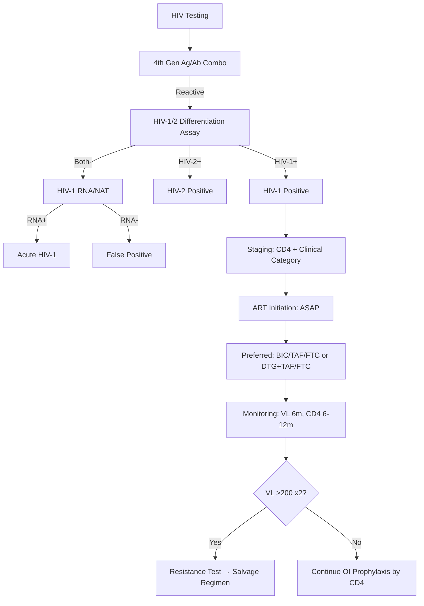

---
tags: [medicine, infectious-disease, davidson, chapter13, hiv, aids, fcps, mrcp]
davidson_chapter: Chapter 13: Infectious disease
topic_category: HIV/AIDS Domain
status: full-fcps-mrcp-topic-note
---

# HIV Infection and AIDS

Related: [[Tuberculosis (Pulmonary and Extrapulmonary)]], [[Pneumocystis Pneumonia]], [[Cryptococcal Meningitis]], [[Toxoplasma Encephalitis]], [[CMV Disease]], [[Kaposi Sarcoma]], [[Antiretroviral Therapy]], [[Opportunistic Infections Prophylaxis]]

> [!important]
> **HIV = human immunodeficiency virus (retrovirus, Lentivirus).** **Targets CD4+ T cells → progressive immune deficiency.** **Diagnosis: 4th generation Ag/Ab combo → confirmatory HIV-1/HIV-2 differentiation assay.** **Staging: CDC clinical categories (A/B/C) + CD4 count.** **ART = lifelong combination therapy (2 NRTI + INSTI preferred).** **Goal: viral load <50 copies/mL (undetectable = untransmittable, U=U).** **OI prophylaxis by CD4 thresholds.** **Cryptococcal antigen screen if CD4<100.**

## Learning Objectives
- Understand HIV virology, transmission, natural history
- Diagnose HIV using recommended testing algorithm
- Stage HIV using CDC clinical categories and CD4 count
- Initiate ART using preferred regimens (2 NRTI + INSTI)
- Monitor treatment response (viral load, CD4)
- Manage virological failure and resistance
- Prescribe OI prophylaxis by CD4 thresholds
- Manage HIV in special populations (pregnancy, TB coinfection, HBV/HCV coinfection)
- Recognise and manage immune reconstitution inflammatory syndrome (IRIS)

## Virology & Transmission
| Aspect | Detail |
|--------|--------|
| **Virus** | HIV-1 (global), HIV-2 (West Africa, slower progression) |
| **Target** | CD4+ T lymphocytes (also macrophages, dendritic cells) |
| **Coreceptors** | **CCR5** (R5-tropic, early infection), **CXCR4** (X4-tropic, late) |
| **Transmission** | Sexual (vaginal, anal), Blood (needles, transfusion), Vertical (MTCT), **NOT** casual contact |
| **Risk per act** | Receptive anal > Insertive anal > Receptive vaginal > Insertive vaginal > Oral (negligible) |
| **Infectiousness** | ↑ with high VL, acute infection, STI co-infection; ↓ with ART (U=U) |

## Natural History
| Stage | Features |
|-------|----------|
| **Acute (Primary) HIV** | 2–4 weeks post-exposure: **mononucleosis-like illness** (fever, pharyngitis, lymphadenopathy, rash, arthralgia), **high VL (>10⁶), p24 Ag+, Ab-** |
| **Clinical Latency** | Asymptomatic, progressive CD4 decline (~50–100 cells/year), VL stabilises (set point) |
| **Symptomatic HIV** | Persistent generalised lymphadenopathy, mild constitutional symptoms, OIs (e.g., herpes zoster, thrush) |
| **AIDS** | **CD4 <200** OR **AIDS-defining illness** (Category C) |

## Diagnosis — Testing Algorithm
```
Step 1: 4th Generation HIV Ag/Ab Combo (p24 Ag + HIV-1/2 Ab)
    ↓
Reactive → Step 2: HIV-1/HIV-2 Differentiation Assay (Geenius, Multispot)
    ↓
    HIV-1 + / HIV-2 −  → HIV-1 POSITIVE
    HIV-1 − / HIV-2 +  → HIV-2 POSITIVE
    HIV-1 + / HIV-2 +  → HIV DUAL POSITIVE
    HIV-1 − / HIV-2 −  → **Step 3: HIV-1 RNA (Viral Load) / NAT**
        ↓
        RNA +  → ACUTE HIV-1 INFECTION
        RNA −  → FALSE POSITIVE (repeat testing)
```

> [!key]
> **Window period: 4th gen ~18–45 days; NAT ~10–15 days.** **Acute HIV: p24 Ag+, Ab-, RNA+.** **Test at baseline, 6 weeks, 3 months if high-risk exposure.**

## Staging — CDC Classification (1993/2014)
### CD4 Categories
| Category | CD4 Count |
|----------|-----------|
| **1** | ≥500 cells/μL |
| **2** | 200–499 cells/μL |
| **3** | **<200 cells/μL** (AIDS threshold) |

### Clinical Categories
| Category | Description |
|----------|-------------|
| **A** | Asymptomatic, acute HIV, PGL only |
| **B** | Symptomatic, not Category C (e.g., herpes zoster, thrush, Listeria, bacillary angiomatosis, cervical dysplasia) |
| **C** | **AIDS-defining illnesses** (see below) |

### AIDS-Defining Illnesses (Category C) — Key Examples
| System | Conditions |
|--------|------------|
| **Fungal** | Cryptococcal meningitis, Pneumocystis pneumonia (PCP), Oesophageal candidiasis, Histoplasmosis, Coccidioidomycosis |
| **Mycobacterial** | TB (pulmonary/extrapulmonary), MAC, M. kansasii |
| **Viral** | CMV (retinitis, colitis, encephalitis), HSV (chronic ulcer >1m), VZV (disseminated), HIV encephalopathy, Progressive multifocal leukoencephalopathy (PML) |
| **Parasitic** | Toxoplasma encephalitis, Cryptosporidiosis (>1m), Isosporiasis, Microsporidiosis |
| **Bacterial** | Recurrent bacterial pneumonia (≥2/year), Salmonella sepsis (recurrent) |
| **Malignancy** | Kaposi sarcoma, NHL (primary CNS, Burkitt, immunoblastic), Invasive cervical cancer |
| **Other** | HIV wasting syndrome, HIV encephalopathy |

## Antiretroviral Therapy (ART)
### Goals
1. **Viral suppression:** VL <50 copies/mL (undetectable)
2. **Immune recovery:** CD4 increase, reduce OIs
3. **Prevent transmission:** **U=U (Undetectable = Untransmittable)**
4. **Improve quality of life and survival**

### Preferred First-Line Regimens (2 NRTI + INSTI)
| Regimen | NRTI Backbone | INSTI | Notes |
|---------|---------------|-------|-------|
| **Bictegravir/Tenofovir alafenamide/Emtricitabine (BIC/TAF/FTC)** | **TAF/FTC** (single tablet) | **BIC** | **Preferred** (once daily, minimal SE, no boosting, high barrier) |
| **Dolutegravir (DTG) + TAF/FTC** | TAF/FTC | DTG 50mg OD | Preferred (DTG separate tablet) |
| **DTG + TDF/FTC** | TDF/FTC | DTG 50mg OD | If TAF unavailable; TDF = renal/bone toxicity |
| **DTG + Abacavir/Lamivudine (ABC/3TC)** | ABC/3TC | DTG 50mg OD | **Only if HLA-B*57:01 NEGATIVE** (hypersensitivity) |

### Alternative First-Line Regimens
| Regimen | Use Case |
|---------|----------|
| **Raltegravir (RAL) + TAF/FTC** | INSTI option (twice daily) |
| **Elvitegravir/cobicistat/TAF/FTC (EVG/c/TAF/FTC)** | Single tablet, but boosting (cobicistat) = interactions |
| **Darunavir/ritonavir (DRV/r) + TAF/FTC** | PI-based (if INSTI contraindicated) |
| **Doravirine (DOR) + TDF/3TC** | NNRTI-based (if INSTI/PI contraindicated) |

> [!critical]
> **INSTI-based = preferred (high barrier, fewer SE, rapid VL suppression).** **DTG: 50mg OD with rifampicin → 50mg BD.** **BIC: no dose adjustment with rifampicin (avoid if possible).** **ABC: MANDATORY HLA-B*57:01 testing before use.**

### NRTI Backbone Options
| NRTI Pair | Dose | Key Toxicity |
|-----------|------|--------------|
| **TAF/FTC** | 25/200mg OD | **Preferred** (less renal/bone toxicity than TDF) |
| **TDF/FTC** | 300/200mg OD | Renal (Fanconi), bone loss (↓ BMD) |
| **ABC/3TC** | 600/300mg OD | **HLA-B*57:01 hypersensitivity** (fever, rash, hypoxia); CVD risk signal |

## ART Initiation — When to Start
| Scenario | Timing |
|----------|--------|
| **All HIV+ (regardless of CD4)** | **ASAP (same day/rapid start if ready)** |
| **TB coinfection** | CD4 <50: within 2 weeks; CD4 50–100: 2–8 weeks; CD4 >100: within 8 weeks |
| **Cryptococcal meningitis** | **Defer ART 4–6 weeks** (after amphotericin induction, to reduce IRIS) |
| **TB meningitis** | Defer ART 4–6 weeks |
| **Acute OI (non-CM, non-TBM)** | Start ART as soon as OI treatment tolerated (usually within 2 weeks) |

## Monitoring on ART
| Parameter | Timing |
|-----------|--------|
| **Viral Load (VL)** | Baseline, 4–8 weeks, 3–4 months, then **every 6 months** (if suppressed) |
| **CD4 Count** | Baseline, 3 months, then every 6–12 months (can stop if VL suppressed >1 year + CD4>350) |
| **Renal function (eGFR)** | Baseline, 1 month, then 6-monthly (TAF/TDF) |
| **Bone density (DEXA)** | If TDF long-term, risk factors |
| **Lipids, Glucose** | Baseline, 3–6 months (PIs, some INSTIs) |
| **HLA-B*57:01** | Before ABC |
| **Resistance testing** | Baseline (before ART), at virological failure |

### Virological Response Definitions
| Term | Definition |
|------|------------|
| **Virological suppression** | VL <50 copies/mL (or <200 copies/mL for some assays) |
| **Virological failure** | **VL >200 copies/mL on 2 consecutive tests** (after 6 months on ART) |
| **Low-level viraemia** | VL 50–200 copies/mL (blips usually transient) |
| **Blip** | Single VL 50–1000 then re-suppressed (not failure) |

## Management of Virological Failure
| Step | Action |
|------|--------|
| **1. Confirm failure** | VL >200 on 2 tests, adherence assessment |
| **2. Resistance testing** | **Genotypic (protease, RT, integrase)** on current failing regimen |
| **3. New regimen** | **≥2 (preferably 3) fully active agents** based on resistance |
| **4. Preferred salvage** | **DTG/BIC + optimised NRTI backbone + DRV/r or new agent (lenacapavir, fostemsavir, ibalizumab)** |

> [!tip]
> **DTG/BIC have high genetic barrier; resistance rare with INSTI-based first-line.** **PI (DRV/r) also high barrier.** **NNRTI (EFV, NVP, RPV, DOR) low barrier — single mutation = resistance.**

## Opportunistic Infection Prophylaxis — CD4 Thresholds
| OI | Prophylaxis Indication | Agent | Discontinue When |
|----|------------------------|-------|------------------|
| **PCP** | CD4 <200 OR oropharyngeal candidiasis OR prior PCP | **TMP-SMX 160/800mg PO daily** (or 3×/week) | CD4 >200 for ≥3 months on ART |
| **Toxoplasma** | CD4 <100 + IgG+ | **TMP-SMX** (same as PCP) | CD4 >200 for ≥3 months on ART |
| **MAC** | CD4 <50 | **Azithromycin 1200mg PO weekly** (or Clarithromycin 500mg PO daily + Rifabutin) | CD4 >100 for ≥3 months on ART |
| **Cryptococcal** | Screen: **CrAg if CD4 <100** | If CrAg+: Fluconazole 800mg OD ×2w → 400mg OD ×8w → 200mg OD maintenance | CD4 >100 on ART + VL suppressed |
| **HSV/VZV** | Seropositive (or all if unknown) | **Acyclovir 400mg PO 12h** (or Valacyclovir) | Usually lifelong if seropositive |
| **CMV** | Not routinely (pre-emptive therapy) | Valganciclovir if reactivation | N/A |

> [!key]
> **PCP/Toxo prophylaxis: TMP-SMX covers both.** **CrAg screen at CD4<100: if positive, pre-emptive fluconazole prevents meningitis.** **MAC prophylaxis: Azithromycin weekly.**

## Immune Reconstitution Inflammatory Syndrome (IRIS)
| Type | Timing | Features |
|------|--------|----------|
| **Paradoxical IRIS** | 2–12 weeks post-ART | Worsening of **known, treated OI** (TB, Cryptococcus, MAC, CMV, herpes) |
| **Unmasking IRIS** | 2–12 weeks post-ART | **New OI diagnosis** after ART start (subclinical → clinical) |

### Risk Factors
- Low CD4 at ART initiation (<50, especially <25)
- High baseline VL
- Rapid VL decline
- Recent OI treatment (especially TB, Cryptococcus)

### Management
| Severity | Management |
|----------|------------|
| **Mild** | Continue ART + OI treatment; NSAIDs |
| **Moderate** | Continue ART + OI treatment; **Prednisolone 1–1.5mg/kg/day taper 2–4 weeks** |
| **Severe** | **Hold ART temporarily** (rare); high-dose steroids; specialist input |

> [!warning]
> **TB-IRIS: do NOT stop TB treatment; add prednisolone.** **Cryptococcal IRIS: higher mortality; manage aggressively.** **Do NOT delay ART for fear of IRIS (except CM/TBM).**

## HIV/TB Coinfection
| CD4 | ART Timing |
|-----|------------|
| **<50** | **Within 2 weeks** of TB treatment |
| **50–100** | **2–8 weeks** |
| **>100** | **Within 8 weeks** |

- **Rifampicin + DTG:** DTG 50mg BD (double dose)
- **Rifampicin + BIC:** Avoid (significant interaction)
- **Rifampicin + PI:** Avoid (use DRV/r with dose adjustment or DTG)
- **Rifampicin + EFV:** Standard dose OK

## HIV/HBV Coinfection
- **TAF/FTC or TDF/FTC** covers **both HIV and HBV** (preferred backbone)
- **If HBV+ and HIV+:** MUST use HBV-active NRTIs (TDF or TAF + FTC/3TC)
- **If switching off TDF/TAF:** Risk of HBV flare → continue HBV suppression or monitor HBV DNA

## HIV/HCV Coinfection
- **DAA (direct-acting antivirals) cure HCV** regardless of HIV
- **Check drug interactions** (e.g., ledipasvir/sofosbuvir + PI boosting)
- **Treat HCV early** (reduces liver-related mortality)

## HIV in Pregnancy
| Principle | Detail |
|-----------|--------|
| **ART for all** | Start immediately regardless of CD4/VL |
| **Preferred regimen** | **DTG + TAF/FTC** (or TDF/FTC) — DTG safe in pregnancy (neural tube defect signal resolved) |
| **Avoid** | EFV (historical concern), DRV/c (PK in pregnancy), TAF/FTC + BIC (less pregnancy data) |
| **VL monitoring** | Monthly until suppressed, then 3-monthly; target <50 at delivery |
| **Delivery** | Vaginal if VL <50 at 36w; C-section if VL >1000 or unknown |
| **Infant prophylaxis** | **Zidovudine (AZT) 4mg/kg 12h ×4–6 weeks** + Nevirapine (if maternal VL >50 at delivery) |
| **Breastfeeding** | **NOT recommended in resource-rich settings** (formula feeding); U=U applies to sexual transmission only |

## Malignancy in HIV
| Cancer | Association |
|--------|-------------|
| **Kaposi Sarcoma (KS)** | HHV-8; CD4 <200; skin, mucosa, viscera; ART first, then chemo (liposomal doxorubicin, paclitaxel) |
| **Non-Hodgkin Lymphoma** | EBV-driven; primary CNS lymphoma, Burkitt, immunoblastic; ART + chemo (R-CHOP, high-dose MTX for CNS) |
| **Invasive Cervical Cancer** | HPV; screen annually (vs 3-yearly); ART + standard oncologic treatment |
| **Anal Cancer** | HPV; MSM high risk; screen with anal cytology/HPV |

## FCPS/MRCP High-Yield Points
- **HIV diagnosis: 4th gen Ag/Ab → differentiation assay → RNA if discordant**
- **Acute HIV: fever, pharyngitis, lymphadenopathy, rash, high VL, p24+, Ab-**
- **AIDS: CD4 <200 OR Category C illness (PCP, Crypto, Toxo, CMV, KS, NHL, invasive cervical Ca)**
- **ART: start ASAP for all; 2 NRTI + INSTI (BIC/TAF/FTC or DTG+TAF/FTC) = preferred**
- **DTG + rifampicin: 50mg BD; BIC avoid with rifampicin**
- **ABC: HLA-B*57:01 mandatory**
- **Monitoring: VL every 6 months (suppressed); CD4 every 6–12m (stop if VL suppressed >1y + CD4>350)**
- **Virological failure: VL >200 x2 → resistance test → ≥2 fully active agents**
- **OI prophylaxis: PCP/Toxo CD4<200 (TMP-SMX); MAC CD4<50 (Azithro); CrAg screen CD4<100**
- **IRIS: paradoxical (worsening known OI) vs unmasking (new OI); prednisolone if moderate**
- **TB/HIV: ART <50=2w, 50-100=2-8w, >100=8w; DTG 50mg BD with rifampicin**
- **HIV/HBV: TAF/FTC or TDF/FTC backbone covers both**
- **Pregnancy: DTG+TAF/FTC preferred; C-section if VL>1000; infant AZT×4-6w; no breastfeeding (UK/US)**

## Common Viva Questions
1. **HIV testing algorithm?** 4th gen Ag/Ab → HIV-1/2 differentiation assay → RNA if indeterminate.
2. **Acute HIV presentation?** Mononucleosis-like: fever, pharyngitis, lymphadenopathy, rash, arthralgia; high VL, p24+, Ab-.
3. **AIDS diagnosis?** CD4 <200 OR Category C illness (PCP, Cryptococcal meningitis, Toxo, CMV, KS, NHL, etc.).
4. **Preferred first-line ART?** 2 NRTI + INSTI (BIC/TAF/FTC or DTG+TAF/FTC).
5. **When to start ART?** ASAP for all. TB coinfection: CD4<50=2w, 50-100=2-8w, >100=8w. Cryptococcal meningitis: defer 4-6w.
6. **DTG + rifampicin dosing?** DTG 50mg BD.
7. **ABC hypersensitivity?** HLA-B*57:01 testing mandatory before use.
8. **OI prophylaxis CD4 thresholds?** PCP/Toxo <200 (TMP-SMX); MAC <50 (Azithro); CrAg screen <100.
9. **IRIS types?** Paradoxical (worsening treated OI) vs Unmasking (new OI); prednisolone for moderate.
10. **HIV/HBV coinfection ART?** TAF/FTC or TDF/FTC backbone (covers both).
11. **Pregnancy ART?** DTG+TAF/FTC preferred; C-section if VL>1000; infant AZT 4-6w.

## Common Confusions / Exam Traps
| Confusion | Clarification |
|-----------|---------------|
| Wait for CD4 to start ART | **Start ART immediately for ALL** |
| DTG 50mg OD with rifampicin | **DTG 50mg BD with rifampicin** |
| BIC safe with rifampicin | **Avoid BIC with rifampicin (significant interaction)** |
| ABC without HLA testing | **HLA-B*57:01 MANDATORY before ABC** |
| Stop OI prophylaxis at CD4>200 immediately | **Continue until CD4>200 for ≥3 months ON ART** |
| CrAg screen at CD4<200 | **CrAg screen at CD4<100** |
| Fluconazole for all fungal OI prophylaxis | **Fluconazole for CrAg+; not for primary prophylaxis** |
| IRIS = stop ART | **Continue ART (except severe); add steroids; stop TB treatment never** |
| Breastfeeding safe if VL undetectable | **U=U = sexual transmission only; breastfeeding NOT recommended in resource-rich** |
| Efavirenz preferred in pregnancy | **DTG preferred (EFV historical neural tube concern)** |

## Mnemonics
- **HIV TEST**: **4**th gen **Ag/Ab** → **D**ifferentiation → **R**NA
- **ACUTE HIV**: **F**ever, **P**haryngitis, **L**ymphadenopathy, **R**ash, **A**rthralgia
- **AIDS**: **C**D4 **<200** or **C**ategory **C** illness
- **ART START**: **A**ll **S**tart **A**P (ASAP)
- **ART REGIMEN**: **2 NRTI + INSTI** (BIC/TAF/FTC or DTG/TAF/FTC)
- **DTG + RIF**: **D**ouble **D**ose (50mg **BD**)
- **ABC**: **H**LA-**B*57:01** **M**andatory
- **OI PROPHYLAXIS**: **PCP/Toxo <200** (TMP-SMX); **MAC <50** (Azithro); **CrAg <100** (Screen)
- **IRIS**: **P**aradoxical (worsening known) vs **U**nmasking (new); **P**rednisolone moderate
- **TB/HIV ART**: **CD4 <50 = 2W**, **50-100 = 2-8W**, **>100 = 8W**
- **HBV/HIV**: **TAF/FTC or TDF/FTC** covers both
- **PREGNANCY**: **DTG + TAF/FTC**; C-section if **VL>1000**; Infant **AZT 4-6w**

## Mind Map
```mermaid
mindmap
  root((HIV Infection & AIDS))
    Virology
      HIV-1 (global), HIV-2 (West Africa)
      CD4+ T cell target, CCR5/CXCR4 coreceptors
    Transmission
      Sexual, Blood, Vertical
      U=U (undetectable = untransmittable)
    Natural History
      Acute (mono-like, high VL, p24+) → Latency → Symptomatic → AIDS
    Diagnosis
      4th gen Ag/Ab → Differentiation → RNA if discordant
      Acute: p24+, Ab-, RNA+
    Staging (CDC)
      CD4: 1(≥500), 2(200-499), 3(<200)
      Clinical: A(asympt), B(sympt), C(AIDS-defining)
    ART
      Start: ASAP for all
      Preferred: 2 NRTI + INSTI (BIC/TAF/FTC or DTG+TAF/FTC)
      DTG+RIF: 50mg BD; ABC: HLA-B*57:01 mandatory
    Monitoring
      VL: baseline, 4-8w, 3-4m, then 6m
      CD4: baseline, 3m, then 6-12m (stop if VL suppr>1y + CD4>350)
      Failure: VL>200 x2 → Resistance test → ≥2 active agents
    OI Prophylaxis
      PCP/Toxo CD4<200: TMP-SMX
      MAC CD4<50: Azithro weekly
      CrAg screen CD4<100
    Coinfections
      TB/HIV: ART timing by CD4; DTG 50mg BD w/ RIF
      HBV: TAF/FTC or TDF/FTC backbone
      HCV: DAA cure
    Pregnancy
      DTG+TAF/FTC preferred; C-section if VL>1000; Infant AZT 4-6w; No BF
    IRIS
      Paradoxical vs Unmasking; 2-12w post-ART; Prednisolone moderate
    Malignancy
      KS (HHV-8), NHL (EBV), Cervical (HPV), Anal (HPV)
```

## Flowchart


## Suggested Visuals / Image Notes
- HIV testing algorithm
- CDC staging table
- ART regimen options
- OI prophylaxis CD4 thresholds
- IRIS timeline
- TB/HIV ART timing algorithm
- Pregnancy management pathway

## Suggested Video References
- HIV testing and diagnosis
- ART guidelines (WHO, DHHS, BHIVA, EACS)
- OI prophylaxis
- IRIS recognition and management
- TB/HIV coinfection
- HIV in pregnancy

## One-Page Revision Summary
| Topic | Key Points |
|-------|------------|
| **Diagnosis** | 4th gen Ag/Ab → Differentiation → RNA |
| **Acute HIV** | Mono-like, high VL, p24+, Ab- |
| **AIDS** | CD4<200 or Category C (PCP, Crypto, Toxo, CMV, KS, NHL) |
| **ART** | Start ASAP; 2 NRTI + INSTI (BIC/TAF/FTC or DTG+TAF/FTC) |
| **DTG + Rifampicin** | 50mg BD (double dose) |
| **ABC** | HLA-B*57:01 mandatory |
| **Monitoring** | VL 6m (suppressed); CD4 6-12m |
| **Failure** | VL>200 x2 → Resistance → ≥2 active agents |
| **OI Prophylaxis** | PCP/Toxo <200 (TMP-SMX); MAC <50 (Azithro); CrAg <100 |
| **IRIS** | Paradoxical vs Unmasking; Prednisolone moderate |
| **TB/HIV** | ART: <50=2w, 50-100=2-8w, >100=8w; DTG 50mg BD |
| **HBV/HIV** | TAF/FTC or TDF/FTC backbone |
| **Pregnancy** | DTG+TAF/FTC; C-section VL>1000; Infant AZT 4-6w; No BF |

## 24-Hour Recall Prompts
- HIV testing algorithm (3 steps).
- Acute HIV presentation.
- AIDS diagnosis (CD4 + Category C examples).
- Preferred ART regimens.
- DTG + rifampicin dosing.
- ABC HLA testing.
- Monitoring schedule.
- OI prophylaxis CD4 thresholds (3 key ones).
- IRIS types and management.
- TB/HIV ART timing.
- Pregnancy key points.

## 7-Day / 15-Day / 30-Day Revision Tracker
- [ ] Day 1 completed
- [ ] 24-hour recall completed
- [ ] Day 7 revision completed
- [ ] Day 15 revision completed
- [ ] Day 30 revision completed

## Must Know / Should Know / Nice to Know
### Must Know
- 4th gen Ag/Ab → differentiation → RNA
- Acute HIV: mono-like, high VL, p24+
- AIDS: CD4<200 or Category C
- ART: ASAP, 2 NRTI + INSTI (BIC/TAF/FTC or DTG+TAF/FTC)
- DTG 50mg BD with rifampicin
- ABC: HLA-B*57:01 mandatory
- VL <50 = suppression; >200 x2 = failure
- OI prophylaxis: PCP/Toxo <200, MAC <50, CrAg <100
- IRIS: paradoxical vs unmasking; prednisolone moderate
- TB/HIV ART timing; DTG 50mg BD with RIF
- Pregnancy: DTG+TAF/FTC, C-section VL>1000

### Should Know
- Resistance testing at failure
- Salvage regimen principles (DTG/DRV-based)
- HIV/HBV coinfection management
- HIV/HCV coinfection (DAA)
- Immune reconstitution details
- Malignancy screening (cervical, anal)
- PrEP/PEP basics

### Nice to Know
- Long-acting ART (Cabotegravir/Rilpivirine LA)
- Novel agents (Lenacapavir, Fostemsavir, Ibalizumab)
- HIV cure strategies
- Aging with HIV (comorbidities)
- Transgender HIV care

## My Weak Points
- [ ] Exact salvage regimen construction
- [ ] Long-acting ART dosing and monitoring
- [ ] Novel agent mechanisms
- [ ] HIV cure trial landscape
- [ ] Transplant in HIV+

## Self-Test Scorecard
- Understanding: /10
- Recall: /10
- MCQ Performance: /10
- SBA Performance: /10
- Viva Confidence: /10
- Total: /50

> [!tip]
> Interpretation: <35 = weak topic, 35-44 = acceptable but insecure, 45+ = strong exam-ready topic.

## Exam Answer Modes
### Long Answer Skeleton
1. Virology, transmission, natural history
2. Diagnosis (testing algorithm, acute HIV)
3. CDC staging (CD4 + clinical categories)
4. ART initiation (when, preferred regimens, alternatives)
5. Monitoring (VL, CD4, resistance, failure definitions)
5. Virological failure management
6. OI prophylaxis (CD4 thresholds, agents, discontinuation)
7. IRIS (types, risk factors, management)
8. Coinfections (TB, HBV, HCV)
9. Pregnancy
10. Malignancy

### Short Note Skeleton
- Test: 4th gen Ag/Ab → Differentiation → RNA
- Acute: mono-like, high VL, p24+, Ab-
- AIDS: CD4<200 or Cat C
- ART: ASAP; BIC/TAF/FTC or DTG+TAF/FTC
- DTG+RIF=50mg BD; ABC=HLA-B*57:01
- Monitor: VL 6m, CD4 6-12m
- Failure: VL>200x2 → Resistance → ≥2 active
- OI Proph: PCP/Toxo<200 TMP-SMX; MAC<50 Azithro; CrAg<100
- IRIS: Paradoxical/Unmasking; Pred moderate
- TB/HIV: <50=2w, 50-100=2-8w, >100=8w; DTG 50mg BD
- HBV: TAF/FTC backdrop
- Preg: DTG+TAF/FTC; C-sec VL>1000; AZT 4-6w

### Viva One-Liners
- Test: 4th gen → diff → RNA
- Acute: mono-like, p24+, Ab-
- AIDS: CD4<200 or Cat C
- ART: 2NRTI+INSTI (BIC/TAF/FTC or DTG/TAF/FTC)
- DTG+RIF: 50mg BD
- ABC: HLA-B*57:01
- Failure: VL>200x2
- OI Proph: PCP<200, MAC<50, CrAg<100
- IRIS: Para vs Unmask; Pred moderate
- TB/HIV: CD4<50=2w, 50-100=2-8w, >100=8w
- Preg: DTG+TAF/FTC; C-sec VL>1000

### Ward-Case Discussion Points
- 30M MSM, new HIV dx, CD4 350, VL 50,000 → Start BIC/TAF/FTC today; VL at 4w, CD4 at 3m; PCP prophylaxis (CD4<200? No)
- 25F, HIV+, CD4 80, newly diagnosed TB → Start TB Rx; ART within 2-8 weeks (CD4 50-100); DTG 50mg BD with rifampicin; TMP-SMX for PCP/Toxo
- 40M, HIV+, CD4 30, headache, fever → LP: high opening pressure, India ink+, CrAg+ → Cryptococcal meningitis: Amphotericin B + Flucytosine ×2w → Fluconazole 400mg ×8w → 200mg maintenance; ART defer 4-6w
- 28F pregnant, HIV+, VL 20,000 at 20w → DTG+TAF/FTC now; VL monthly; C-section if VL>1000 at 36w; Infant AZT 4mg/kg 12h ×6w

### Last-Night-Before-Exam Sheet
**HIV:** Test: 4th gen Ag/Ab → diff → RNA. **Acute: mono-like, high VL, p24+, Ab-.** **AIDS: CD4<200 or Cat C (PCP, Crypto, Toxo, CMV, KS, NHL).** **ART: ASAP; 2NRTI+INSTI (BIC/TAF/FTC or DTG/TAF/FTC).** **DTG+RIF: 50mg BD.** **ABC: HLA-B*57:01.** **Monitor: VL 6m; CD4 6-12m.** **Failure: VL>200x2.** **OI Proph: PCP/Toxo<200 TMP-SMX; MAC<50 Azithro; CrAg<100 screen.** **IRIS: Para vs Unmask; Pred moderate.** **TB/HIV: <50=2w, 50-100=2-8w, >100=8w; DTG 50mg BD.** **HBV: TAF/FTC backbone.** **Preg: DTG+TAF/FTC; C-sec VL>1000; AZT 4-6w; No BF.**

## Summary
**Human Immunodeficiency Virus (HIV)** is a retrovirus (Lentivirus) targeting **CD4+ T lymphocytes**, causing progressive immune deficiency. **Transmission:** sexual, blood, vertical. **Acute HIV (2–4 weeks):** mononucleosis-like illness (fever, pharyngitis, lymphadenopathy, rash), **high VL (>10⁶), p24 Ag+, Ab−**. **Diagnosis:** **4th generation Ag/Ab combo → HIV-1/2 differentiation assay → HIV-1 RNA if discordant.** **Staging (CDC):** CD4 categories 1 (≥500), 2 (200–499), 3 (<200); Clinical A (asymptomatic), B (symptomatic non-C), C (AIDS-defining: PCP, cryptococcal meningitis, toxoplasmosis, CMV, KS, NHL, invasive cervical cancer). **AIDS = CD4 <200 OR Category C illness.** **Antiretroviral Therapy (ART):** **Start ASAP for ALL.** **Preferred first-line: 2 NRTI + INSTI** — **Bictegravir/TAF/FTC (single tablet)** or **Dolutegravir + TAF/FTC**. **Dolutegravir 50mg OD; with rifampicin → 50mg BD.** **Abacavir: HLA-B*57:01 testing MANDATORY.** **Monitoring:** VL baseline, 4–8w, 3–4m, then 6-monthly (target <50 copies/mL). CD4 baseline, 3m, then 6–12m (stop if VL suppressed >1y + CD4>350). **Virological failure:** VL >200 copies/mL on 2 consecutive tests → resistance testing → new regimen with ≥2 fully active agents. **OI Prophylaxis:** **PCP/Toxoplasma CD4<200 → TMP-SMX**; **MAC CD4<50 → Azithromycin 1200mg weekly**; **Cryptococcal antigen screen CD4<100 → pre-emptive fluconazole if positive**. **IRIS:** Paradoxical (worsening treated OI) vs Unmasking (new OI) 2–12 weeks post-ART; risk: low CD4, high VL; **moderate → prednisolone 1–1.5mg/kg taper; severe → hold ART rarely**. **TB/HIV:** ART timing by CD4 — <50: 2 weeks; 50–100: 2–8 weeks; >100: 8 weeks; **DTG 50mg BD with rifampicin**. **HIV/HBV:** TAF/FTC or TDF/FTC backbone covers both. **Pregnancy:** DTG+TAF/FTC preferred; C-section if VL>1000 at 36w; infant AZT 4mg/kg 12h ×4–6w; **no breastfeeding** in resource-rich settings.

## MCQs (10)
1. **Recommended HIV testing algorithm first step:**
   A. HIV-1/2 differentiation assay
   B. **4th generation HIV Ag/Ab combination assay**
   C. HIV-1 RNA PCR
   D. Western blot
   E. p24 antigen alone

2. **Acute HIV infection is characterised by:**
   A. High CD4, low VL
   B. **High VL, p24 Ag positive, HIV antibody negative**
   C. Low VL, positive antibody
   D. CD4 <200
   E. AIDS-defining illness

3. **AIDS is diagnosed when:**
   A. CD4 <350
   B. **CD4 <200 OR Category C illness**
   C. Any Category B illness
   D. VL >100,000
   E. Positive HIV test

4. **Preferred first-line ART regimen for treatment-naïve patient:**
   A. Efavirenz + TDF/FTC
   B. **Bictegravir/TAF/FTC (or Dolutegravir + TAF/FTC)**
   C. Ritonavir-boosted Darunavir + TDF/FTC
   D. Raltegravir + ABC/3TC
   E. Doravirine + TDF/3TC

5. **Dolutegravir dose with rifampicin (TB coinfection):**
   A. 50mg OD
   B. **50mg BD (double dose)**
   C. 50mg TDS
   D. Avoid dolutegravir
   E. 100mg OD

6. **Abacavir hypersensitivity is associated with:**
   A. HLA-A*02:01
   B. **HLA-B*57:01**
   C. HLA-DRB1*15:01
   D. HLA-C*07:02
   E. No HLA association

7. **Virological failure on ART is defined as:**
   A. Single VL >50 copies/mL
   B. **VL >200 copies/mL on 2 consecutive tests after 6 months**
   C. CD4 decline >50
   D. New OI
   E. VL >1000 on 1 test

8. **Pneumocystis pneumonia (PCP) prophylaxis indicated at CD4:**
   A. <50
   B. <100
   C. **<200 (or oropharyngeal candidiasis, prior PCP)**
   D. <350
   E. <500

9. **Cryptococcal antigen (CrAg) screening is recommended at CD4:**
   A. <50
   B. **<100**
   C. <200
   D. <350
   E. All HIV+

10. **IRIS typically occurs within:**
    A. 1–2 weeks of ART
    B. **2–12 weeks of ART**
    C. 3–6 months of ART
    D. 1 year of ART
    D. Only if CD4 <50

## SBA Questions (10)
1. **A 30-year-old man presents with fever, pharyngitis, cervical lymphadenopathy, and maculopapular rash 3 weeks after unprotected anal intercourse. HIV 4th gen Ag/Ab is reactive. Differentiation assay: HIV-1 negative, HIV-2 negative. Next test?**
   A. Repeat 4th gen in 4 weeks
   B. **HIV-1 RNA PCR (viral load)**
   C. Western blot
   D. p24 antigen
   E. CD4 count

2. **A 40-year-old woman newly diagnosed with HIV has CD4 450, VL 80,000. No comorbidities. HLA-B*57:01 negative. Preferred ART?**
   A. EFV + TDF/FTC
   B. **BIC/TAF/FTC (single tablet daily)**
   C. DRV/r + TAF/FTC
   D. RAL + ABC/3TC
   E. DOR + TDF/3TC

3. **A 35-year-old man with HIV (CD4 30) starts TB treatment. When to start ART?**
   A. Immediately
   B. **Within 2 weeks** (CD4 <50)
   C. After 8 weeks
   D. After TB treatment completion
   E. When CD4 >100

4. **The same patient (CD4 30, on TB treatment) is started on DTG-based ART. DTG dose with rifampicin?**
   A. 50mg OD
   B. **50mg BD**
   C. 50mg TDS
   D. 100mg OD
   E. Avoid DTG

5. **A patient on ART for 18 months has VL 450 copies/mL (previous VL <50). Repeat VL 2 weeks later: 380. Adherence good. Next step?**
   A. Continue current regimen
   B. **Resistance testing (genotypic)**
   C. Switch to PI-based regimen
   D. Add an NRTI
   E. Intensify with DTG

6. **A patient with HIV (CD4 150) on ART for 6 months. OI prophylaxis indicated?**
   A. None (on ART)
   B. **TMP-SMX for PCP/Toxo prophylaxis (CD4 <200)**
   C. Azithromycin for MAC (CD4 <50)
   D. Fluconazole for Crypto
   E. Only if CD4 <100

7. **A patient with HIV (CD4 40) presents with Cryptococcal meningitis (CrAg+). When to start ART?**
   A. Immediately
   B. **After 4–6 weeks (post amphotericin induction)**
   C. After 2 weeks
   D. After 8 weeks
   E. After CSF sterilisation

8. **A pregnant woman (24 weeks) newly diagnosed with HIV, VL 50,000. Preferred ART?**
   A. EFV + TDF/FTC
   B. **DTG + TAF/FTC**
   C. DRV/r + TAF/FTC
   D. BIC/TAF/FTC
   E. RAL + TAF/FTC

9. **A breastfeeding woman in the UK with HIV on ART, VL <50. Infant prophylaxis?**
   A. Breastfeeding safe if VL <50
   B. **Formula feeding recommended; infant AZT 4mg/kg 12h ×4–6 weeks**
   C. Breastfeeding with maternal ART only
   D. Infant NVP only
   E. No infant prophylaxis needed

10. **An HIV+ patient (CD4 450, VL <50) on DTG/TAF/FTC presents with herpes zoster (shingles). Category?**
    A. Category A
    B. **Category B** (herpes zoster = Category B)
    C. Category C
    D. Not staged
    E. AIDS

## Flashcards
- Q: HIV test algorithm
  A: 4th gen Ag/Ab → Differentiation → RNA
- Q: Acute HIV
  A: Mono-like, high VL, p24+, Ab-
- Q: AIDS diagnosis
  A: CD4<200 or Category C
- Q: Preferred ART
  A: BIC/TAF/FTC or DTG+TAF/FTC (2NRTI+INSTI)
- Q: DTG + RIF
  A: 50mg BD
- Q: ABC
  A: HLA-B*57:01 mandatory
- Q: Failure
  A: VL>200 x2 → Resistance → ≥2 active
- Q: OI Proph CD4
  A: PCP/Toxo<200 TMP-SMX; MAC<50 Azithro; CrAg<100
- Q: IRIS
  A: 2-12w; Para vs Unmask; Pred moderate
- Q: TB/HIV ART
  A: <50=2w, 50-100=2-8w, >100=8w; DTG 50mg BD
- Q: HBV/HIV
  A: TAF/FTC backbone
- Q: Pregnancy
  A: DTG+TAF/FTC; C-sec VL>1000; AZT 4-6w

## Answer Key with Explanations
### MCQs
1. **B** — 4th generation Ag/Ab combo is the recommended screening test (detects p24 Ag + antibodies, window period ~18–45 days).
2. **B** — Acute HIV: high viraemia, p24 Ag detectable before antibodies (Ab− window period); clinical mono-like syndrome.
3. **B** — AIDS = CD4 <200 cells/μL OR Category C (AIDS-defining) illness.
4. **B** — INSTI-based 2 NRTI + INSTI preferred (BIC/TAF/FTC or DTG+TAF/FTC). High barrier, rapid suppression, fewer SE.
5. **B** — Rifampicin induces DTG metabolism; DTG 50mg BD (double dose) compensates.
6. **B** — Abacavir hypersensitivity strongly associated with HLA-B*57:01; testing mandatory before prescription.
7. **B** — Virological failure: confirmed VL >200 copies/mL on 2 occasions after ≥6 months on ART (not single blip).
8. **C** — PCP prophylaxis at CD4 <200 (or oropharyngeal candidiasis, prior PCP). TMP-SMX also covers Toxoplasma.
9. **B** — CrAg screen at CD4 <100 (pre-emptive fluconazole if positive prevents meningitis).
10. **B** — IRIS typically 2–12 weeks post-ART initiation (paradoxical or unmasking).

### SBAs
1. **B** — Acute HIV: 4th gen reactive (p24+), differentiation HIV-1/2 negative (Ab not yet developed) → HIV-1 RNA PCR confirms acute infection.
2. **B** — Treatment-naïve, no comorbidities: BIC/TAF/FTC single tablet preferred (or DTG+TAF/FTC).
3. **B** — TB/HIV CD4 <50: ART within 2 weeks.
4. **B** — DTG 50mg BD with rifampicin (induces UGT1A1/CYP3A4).
5. **B** — Confirmed virological failure (VL>200 x2, adherent) → genotypic resistance testing before regimen change.
6. **B** — CD4 150 <200 → TMP-SMX for PCP/Toxo prophylaxis indicated (continue until CD4>200 ×3m on ART).
7. **B** — Cryptococcal meningitis: defer ART 4–6 weeks after amphotericin induction (reduce IRIS mortality).
8. **B** — Pregnancy: DTG+TAF/FTC preferred (DTG safe, TAF less bone/renal toxicity).
9. **B** — UK/US guidelines: formula feeding recommended (U=U = sexual transmission only); infant AZT 4–6w.
10. **B** — Herpes zoster (shingles) = Category B illness (symptomatic, not AIDS-defining).

---