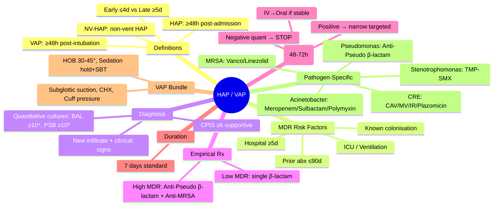

---
tags: [medicine, infectious-disease, davidson, chapter13, hap, vap, hospital-acquired, ventilator-associated, fcps, mrcp]
davidson_chapter: Chapter 13: Infectious disease
topic_category: Respiratory Infections Domain
status: full-fcps-mrcp-topic-note
---

# Hospital-Acquired and Ventilator-Associated Pneumonia (HAP/VAP)

Related: [[Community-Acquired Pneumonia (CAP)]], [[Aspiration Pneumonia]], [[Sepsis and Septic Shock]], [[Clostridioides difficile Infection]], [[Antimicrobial Stewardship]]

> [!important]
> **HAP = pneumonia ≥48h after hospital admission, not incubating at admission.** **VAP = pneumonia ≥48h after endotracheal intubation.** **Non-ventilator HAP (NV-HAP) = HAP without intubation.** **Diagnosis: clinical + radiographic + microbiological.** **Empirical antibiotics by local epidemiology, risk factors for MDR.** **De-escalate at 48–72h.** **Duration 7 days (shorter if clinical criteria met).** **VAP prevention bundle.**

## Learning Objectives
- Define HAP, VAP, NV-HAP and distinguish from CAP
- Apply clinical, radiological, and microbiological diagnostic criteria
- Identify risk factors for MDR pathogens
- Select empirical antibiotics by local antibiogram and MDR risk
- Interpret quantitative vs qualitative cultures (VAP)
- De-escalate therapy at 48–72h based on cultures
- Apply 7-day treatment duration (shorter if criteria met)
- Implement VAP prevention bundle

## Definitions & Epidemiology
| Term | Definition | Timing | Typical Pathogens |
|------|------------|--------|-------------------|
| **HAP** | Pneumonia ≥48h after admission, not incubating at admission | ≥48h post-admission | *S. aureus*, *Pseudomonas*, Enterobacteriaceae, *Acinetobacter* |
| **VAP** | Pneumonia ≥48h after endotracheal intubation | ≥48h post-intubation | *Pseudomonas*, *S. aureus*, Enterobacteriaceae, *Acinetobacter* |
| **NV-HAP** | HAP without mechanical ventilation | ≥48h post-admission | Similar to HAP but more *S. pneumoniae*, *H. influenzae* |
| **Early-onset HAP/VAP** | ≤4 days hospitalisation | ≤4 days | Similar to CAP (*S. pneumoniae*, *H. influenzae*, MSSA) |
| **Late-onset HAP/VAP** | ≥5 days hospitalisation | ≥5 days | MDR pathogens (*Pseudomonas*, MRSA, *Acinetobacter*, ESBL) |

> [!tip]
> **HAP/VAP = 2nd most common nosocomial infection (after UTI).** **Mortality 20–50% (attributable ~10–15%).** **VAP increases ICU stay by 4–6 days, cost $40K+.**

## Risk Factors for MDR Pathogens
| Risk Factor | Pathogens of Concern |
|-------------|---------------------|
| **Prior IV antibiotics (≤90 days)** | ESBL Enterobacteriaceae, MDR *Pseudomonas*, MRSA, *Acinetobacter* |
| **Current hospitalisation ≥5 days** | Late-onset flora (MDR Gram-neg, MRSA) |
| **ICU admission** | *Pseudomonas*, *Acinetobacter*, *Stenotrophomonas* |
| **Mechanical ventilation** | *Pseudomonas*, *Acinetobacter* |
| **Structural lung disease (bronchiectasis, COPD)** | *Pseudomonas*, *S. aureus* |
| **Immunosuppression** | Fungi, *Pneumocystis*, CMV, *Nocardia*, *Mycobacteria* |
| **Recent travel (high MDR regions)** | NDM/ESBL Enterobacteriaceae, *Acinetobacter* |
| **Known colonisation** | Same organism likely |

> [!key]
> **MDR risk factors: prior antibiotics, ≥5 days hospitalisation, ICU, ventilation, known colonisation.** **Local antibiogram essential for empirical choice.**

## Diagnostic Criteria
### Clinical + Radiological (All Required for Possible HAP/VAP)
1. **New/progressive infiltrate on CXR/CT** (or ≥2 serial CXRs for VAP)
2. **Plus ≥2 of:**
   - Fever >38.3°C or hypothermia <36°C
   - Leukocytosis (>10×10⁹/L) or leukopenia (<4×10⁹/L)
   - Purulent respiratory secretions
   - Worsening gas exchange (↑FiO₂, ↓PaO₂/FiO₂, new/increased ventilator support)

### Microbiological (For Probable/Confirmed)
| Sample Type | Threshold | Significance |
|-------------|-----------|--------------|
| **Endotracheal aspirate (ETA)** | ≥10⁵ CFU/mL | Good sensitivity, low specificity (colonisation) |
| **Bronchoalveolar lavage (BAL)** | ≥10⁴ CFU/mL | Better specificity |
| **Protected specimen brush (PSB)** | ≥10³ CFU/mL | Higher specificity, more invasive |
| **Mini-BAL** | ≥10⁴ CFU/mL | Compromise |
| **Blood culture** | Positive | Definitive (haematogenous spread rare) |
| **Pleural fluid** | Positive | Definitive if empyema |

> [!tip]
> **Quantitative cultures (BAL ≥10⁴, PSB ≥10³) > qualitative for VAP — reduce overtreatment.** **Clinical Pulmonary Infection Score (CPIS) ≥6 supports VAP but not diagnostic alone.**

## Empirical Antibiotic Therapy (Start IMMEDIATELY after cultures)
### Strategy: Cover likely pathogens based on LOCAL ANTIBIOGRAM + MDR risk factors

#### Low MDR Risk (Early-onset, no risk factors, low local MDR prevalence)
| Regimen | Dose |
|---------|------|
| **Piperacillin-tazobactam** | 4.5g IV 6h |
| **OR Cefepime** | 2g IV 8h |
| **OR Ceftriaxone** | 2g IV 12h |
| **OR Levofloxacin** | 750mg IV OD |
| **OR Meropenem** | 1g IV 8h |

#### High MDR Risk (≥1 risk factor) — MUST Cover: Pseudomonas, MRSA, ESBL
| Regimen (Dual Pseudomonas + MRSA + ESBL coverage) | Doses |
|---------------------------------------------------|-------|
| **Anti-pseudomonal β-lactam + Anti-MRSA agent** | |
| Pip-tazo 4.5g 6h **OR** Cefepime 2g 8h **OR** Meropenem 1g 8h **OR** Ceftazidime 2g 8h | + |
| **Vancomycin 15–20mg/kg IV 6h** (trough 15–20) **OR** Linezolid 600mg IV 12h | |

> [!warning]
> **If local Pseudomonas resistance to Pip-tazo >10–15% → use Meropenem/Cefepime as primary β-lactam.** **If MRSA prevalence >10–20% → ADD anti-MRSA agent empirically.** **If ESBL prevalence high → Carbapenem preferred.**

#### Additional Coverage if Indicated
| Scenario | Add |
|----------|-----|
| **Anaerobes suspected** (aspiration, necrotising) | Metronidazole 500mg IV 8h (if β-lactam not anaerobic-active) |
| **Legionella** (immunocompromised, water system outbreak) | Azithromycin 500mg IV/PO OD |
| **Fungal** (prolonged ICU, immunosuppressed) | Echinocandin (Caspofungin/Micafungin) |

## Culture Interpretation & De-escalation (At 48–72 Hours)
| Culture Result | Action |
|----------------|--------|
| **Negative (no growth)**
   - Qualitative: Consider stopping antibiotics if clinical improvement
   - Quantitative (BAL <10⁴, PSB <10³): **Stop antibiotics** (high NPV) |
| **Single pathogen susceptible** | **De-escalate to narrowest effective agent** |
| **MDR pathogen confirmed** | Continue/Adjust targeted therapy |
| **Polymicrobial** | Cover all; consider anaerobes if aspiration |

### De-escalation Principles
1. **Stop antibiotics if cultures negative + clinical improvement** (especially quantitative)
2. **Narrow spectrum** to targeted pathogen(s)
3. **Switch IV → oral** if clinical stability (same criteria as CAP)
4. **Remove redundant agents** (e.g., drop vancomycin if MSSA, drop second Gram-neg agent)

## Treatment Duration
| Scenario | Duration |
|----------|----------|
| **Uncomplicated HAP/VAP** | **7 days** (IDSA/ATS 2016) |
| **Non-fermenting Gram-neg (Pseudomonas, Acinetobacter)** | 7 days (extend if slow response) |
| **MRSA** | 7 days |
| **Clinical stability criteria at day 7** | Stop if: afebrile 48h, WBC normalising, improving gas exchange, tolerating oral |
| **Slow response / immunocompromised / empyema / abscess** | Extend to 10–14 days |

> [!key]
> **7 days = standard for uncomplicated HAP/VAP.** **Shorter (5–7d) non-inferior in RCTs.** **Do NOT prolong "just in case" — drives resistance.**

## VAP Prevention Bundle (Institute for Healthcare Improvement)
| Component | Action |
|-----------|--------|
| **Head of bed elevation** | **30–45°** (unless contraindicated) |
| **Daily sedation interruption + SBT** | **Daily** (spontaneous breathing trial) |
| **Peptic ulcer prophylaxis** | PPI/H2 blocker (balance with C. diff risk) |
| **DVT prophylaxis** | LMWH/UFH + mechanical |
| **Oral care with chlorhexidine** | **0.12–2% CHX q6–12h** (controversial for mortality, reduces VAP) |
| **Subglottic secretion drainage** | **Endotracheal tube with subglottic suction port** (reduces VAP ~50%) |
| **Cuff pressure** | **20–30 cmH₂O** (prevents microaspiration) |
| **Avoid unnecessary intubation** | NIV when appropriate |
| **Early extubation** | Daily readiness assessment |

## Pathogen-Specific Targeted Therapy
| Pathogen | Preferred Agent(s) | Alternatives | Duration |
|----------|-------------------|--------------|----------|
| **MSSA** | Flucloxacillin/Cefazolin 2g 4–6h | Pip-tazo, Meropenem | 7 days |
| **MRSA** | Vancomycin (trough 15–20) **OR** Linezolid 600mg 12h | Daptomycin, Ceftaroline | 7 days |
| **P. aeruginosa (susceptible)** | Pip-tazo/Cefepime/Meropenem/Ceftazidime | Ciprofloxacin/Levofloxacin | 7 days |
| **MDR Pseudomonas (XDR)** | Ceftolozane-tazobactam, Ceftazidime-avibactam, Imipenem-relebactam, Polymyxin + high-dose meropenem | Aminoglycoside + β-lactam | 7–14 days |
| **ESBL Enterobacteriaceae** | **Meropenem 1g 8h** (preferred) | Ertapenem (if no Pseudomonas risk) | 7 days |
| **Carbapenem-resistant Enterobacteriaceae (CRE)** | Ceftazidime-avibactam, Meropenem-vaborbactam, Imipenem-relebactam, Plazomicin, Polymyxin-based | Tigecycline (not for VAP — poor lung penetration) | 7–14 days |
| **Acinetobacter baumannii** | Meropenem/Sulbactam (if susceptible) | Polymyxin, Tigecycline, Minocycline, Ampicillin-sulbactam | 7–14 days |
| **Stenotrophomonas maltophilia** | **TMP-SMX 5mg/kg (TMP) 6h** | Levofloxacin, Minocycline, Ceftazidime-avibactam | 7–14 days |

## Special Situations
| Situation | Adjustment |
|-----------|------------|
| **Immunocompromised** | Broader empirical (add antifungal, PJP cover, antiviral); BAL preferred |
| **Post-lung transplant** | Cover Pseudomonas, Aspergillus, CMV, Nocardia; BAL mandatory |
| **Structural lung disease (bronchiectasis, CF)** | Higher Pseudomonas risk; antipseudomonal β-lactam + fluoroquinolone/aminoglycoside |
| **Penicillin allergy (anaphylaxis)** | Aztreonam + Fluoroquinolone + Vancomycin/Linezolid |
| **Renal impairment** | Dose adjust all; avoid aminoglycosides if possible |

## FCPS/MRCP High-Yield Points
- **HAP = ≥48h post-admission; VAP = ≥48h post-intubation; NV-HAP = HAP without vent**
- **Early-onset (≤4d) = CAP-like flora; Late-onset (≥5d) = MDR flora**
- **MDR risk factors: prior antibiotics (90d), ≥5d hospitalisation, ICU, vent, known colonisation**
- **Diagnosis: new infiltrate + clinical signs + microbiological confirmation (quantitative cultures preferred for VAP)**
- **Empirical: local antibiogram + MDR risk → anti-pseudomonal β-lactam ± anti-MRSA agent**
- **Quantitative cultures: BAL ≥10⁴, PSB ≥10³ = positive; negative = stop antibiotics if improving**
- **De-escalate at 48–72h: stop if negative, narrow if positive, switch IV→oral if stable**
- **Duration: 7 days standard (shorter if criteria met)**
- **VAP bundle: HOB 30–45°, daily sedation hold + SBT, subglottic suction, chlorhexidine oral care, cuff pressure 20–30**
- **CRE: ceftazidime-avibactam/meropenem-vaborbactam/imipenem-relebactam; avoid tigecycline for VAP**
- **Stenotrophomonas: TMP-SMX first-line**

## Common Viva Questions
1. **Difference between HAP, VAP, NV-HAP?** HAP ≥48h post-admission; VAP ≥48h post-intubation; NV-HAP = HAP without ventilation.
2. **Early vs late onset HAP/VAP?** Early ≤4d = CAP-like flora; Late ≥5d = MDR flora (Pseudomonas, MRSA, Acinetobacter).
3. **MDR risk factors for HAP/VAP?** Prior IV antibiotics ≤90d, hospitalisation ≥5d, ICU, mechanical ventilation, known colonisation.
4. **VAP diagnostic criteria?** New/progressive infiltrate + ≥2 clinical signs + quantitative culture (BAL ≥10⁴, PSB ≥10³).
5. **Empirical antibiotics for high MDR risk VAP?** Anti-pseudomonal β-lactam (Pip-tazo/Meropenem/Cefepime) + anti-MRSA (Vancomycin/Linezolid).
6. **When to de-escalate?** 48–72h: stop if cultures negative + improving; narrow to targeted pathogen; switch IV→oral if stable.
7. **Standard treatment duration?** 7 days for uncomplicated HAP/VAP.
8. **VAP prevention bundle components?** HOB 30–45°, daily sedation hold + SBT, subglottic suction, chlorhexidine oral care, cuff pressure 20–30 cmH₂O, DVT/PUD prophylaxis.
9. **CRE treatment options?** Ceftazidime-avibactam, Meropenem-vaborbactam, Imipenem-relebactam, Plazomicin, Polymyxin-based.
10. **Stenotrophomonas maltophilia treatment?** TMP-SMX first-line (5mg/kg TMP 6h).

## Common Confusions / Exam Traps
| Confusion | Clarification |
|-----------|---------------|
| HCAP still exists | **HCAP retired — assess MDR risk factors within HAP/VAP** |
| Qualitative cultures enough for VAP | **Quantitative (BAL/PSB) preferred — higher specificity, allows stopping if negative** |
| Always need dual Gram-neg coverage | **Dual only if high resistance prevalence or severe sepsis; monotherapy with appropriate β-lactam often sufficient** |
| Vancomycin for all HAP/VAP | **Only if MRSA risk factors (prevalence >10–20%, prior MRSA, necrotising)** |
| 14–21 days standard duration | **7 days standard; extend only if slow response / complications** |
| Tigecycline for VAP | **Poor lung penetration — avoid for VAP** |
| Colistin first-line for CRE | **Newer β-lactam/β-lactamase inhibitors preferred (ceftazidime-avibactam etc.)** |
| Chlorhexidine oral care reduces mortality | **Reduces VAP incidence but NOT mortality** |
| Subglottic suction for all vents | **Only for expected >24–48h ventilation** |
| Stop antibiotics if qualitative culture negative | **Qualitative negative ≠ no infection; quantitative negative (BAL<10⁴) has high NPV** |

## Mnemonics
- **HAP/VAP DEFINITIONS**: **H**AP = **H**ospital ≥48h; **V**AP = **V**ent ≥48h; **NV**-HAP = **N**on-**V**ent HAP
- **MDR RISK**: **P**rior abx (90d), **H**ospital ≥5d, **I**CU, **V**ent, **K**nown colonisation (PHI VK)
- **EARLY vs LATE**: **E**arly (≤4d) = **E**asy flora (CAP-like); **L**ate (≥5d) = **L**ethal MDR flora
- **VAP CULTURE THRESHOLDS**: **BAL** = **10⁴**, **PSB** = **10³**, **ETA** = **10⁵**
- **VAP BUNDLE**: **H**ead **O**f **B**ed 30–45°, **S**edation hold + **S**BT, **S**ubglottic **S**uction, **C**HX oral care, **C**uff **P**ressure
- **HAP/VAP EMPIRICAL**: **L**ow MDR risk = single β-lactam; **H**igh MDR risk = **Anti-Pseudo β-lactam + Anti-MRSA**
- **DURATION**: **7 DAYS** (stop if stable)
- **CRE Rx**: **CAV** (Ceftazidime-**A**vibactam), **MV** (Meropenem-**V**aborbactam), **IR** (Imipenem-**R**elebactam)
- **STENOTROPHOMONAS**: **TMP-SMX** first-line

## Mind Map


## Flowchart
```mermaid
flowchart TD
  A[Suspected HAP/VAP] --> B[CXR: New/Progressive Infiltrate]
  B --> C[Clinical Signs: Fever, WBC, Purulent secretions, Gas exchange]
  C --> D[Microbiological: Quantitative cultures (BAL/PSB preferred)]
  D --> E{MDR Risk Factors?}
  E -->|No (Early, no risk factors)| F[Single β-lactam: Pip-tazo/Cefepime/Ceftriaxone/Levo/Mero]
  E -->|Yes| G[Anti-Pseudo β-lactam + Anti-MRSA agent]
  G --> H[Cultures at 48-72h]
  H --> I{Result?}
  I -->|Negative quantitative| J[STOP antibiotics if improving]
  I -->|Single pathogen| K[De-escalate to narrowest active agent]
  I -->|MDR confirmed| L[Continue/Adjust targeted therapy]
  I -->|Polymicrobial| M[Cover all ± anaerobes]
  J --> N[7 days total if uncomplicated]
  K --> N
  L --> O[7-14 days per pathogen]
  M --> O
```

## Suggested Visuals / Image Notes
- HAP/VAP diagnostic criteria algorithm
- VAP bundle checklist
- MDR risk factor assessment
- De-escalation decision tree
- CRE treatment algorithm
- Antibiotic spectrum comparison

## Suggested Video References
- IDSA/ATS HAP/VAP guidelines 2016
- VAP prevention bundle implementation
- Quantitative vs qualitative cultures
- CRE management
- Antimicrobial stewardship in ICU

## One-Page Revision Summary
| Topic | Key Points |
|-------|------------|
| **Definitions** | HAP ≥48h admission; VAP ≥48h intubation; NV-HAP = non-vent HAP |
| **Onset** | Early ≤4d = CAP-like; Late ≥5d = MDR |
| **MDR Risk** | Prior abx 90d, hosp ≥5d, ICU, vent, colonisation |
| **Diagnosis** | Infiltrate + clinical signs + quant culture (BAL ≥10⁴, PSB ≥10³) |
| **Low MDR Rx** | Single β-lactam (Pip-tazo/Cefepime/Ceftriaxone/Levo/Mero) |
| **High MDR Rx** | Anti-Pseudo β-lactam + Anti-MRSA (Vanco/Linezolid) |
| **De-escalation** | 48-72h: neg quant → STOP; pos → narrow; IV→Oral if stable |
| **Duration** | 7 days standard |
| **VAP Bundle** | HOB 30-45°, daily sedation hold+SBT, subglottic suction, CHX, cuff 20-30 |
| **CRE** | CAV/MV/IR/Plazomicin/Polymyxin (avoid tigecycline for VAP) |
| **Stenotrophomonas** | TMP-SMX first-line |

## 24-Hour Recall Prompts
- HAP vs VAP vs NV-HAP definitions.
- Early vs late onset flora.
- MDR risk factors (5).
- VAP quantitative culture thresholds.
- High MDR risk empirical regimen.
- De-escalation at 48–72h.
- Standard duration (7 days).
- VAP bundle (6 components).
- CRE treatment options.
- Stenotrophomonas treatment.

## 7-Day / 15-Day / 30-Day Revision Tracker
- [ ] Day 1 completed
- [ ] 24-hour recall completed
- [ ] Day 7 revision completed
- [ ] Day 15 revision completed
- [ ] Day 30 revision completed

## Must Know / Should Know / Nice to Know
### Must Know
- HAP/VAP definitions and timing
- Early vs late onset flora difference
- MDR risk factors
- Quantitative culture thresholds
- High MDR empirical: anti-pseudomonal β-lactam + anti-MRSA
- 7-day duration
- De-escalation at 48–72h
- VAP bundle components
- CRE: newer β-lactamase inhibitors
- Stenotrophomonas: TMP-SMX

### Should Know
- CPIS score
- NV-HAP specifics
- Immunocompromised Host adjustments
- Post-transplant VAP
- Antibiotic dosing in renal impairment
- Subglottic suction evidence

### Nice to Know
- Novel diagnostics (PCR, NGS, biomarkers)
- Inhaled antibiotics for VAP
- Microbiome modulation
- Vaccine prevention (Pseudomonas, Staphylococcus)
- Long-term outcomes post-VAP

## My Weak Points
- [ ] Exact CPIS scoring
- [ ] Inhaled antibiotic regimens
- [ ] Post-lung transplant VAP specifics
- [ ] Novel β-lactam/β-lactamase inhibitor nuances
- [ ] Antifungal prophylaxis in VAP

## Self-Test Scorecard
- Understanding: /10
- Recall: /10
- MCQ Performance: /10
- SBA Performance: /10
- Viva Confidence: /10
- Total: /50

> [!tip]
> Interpretation: <35 = weak topic, 35-44 = acceptable but insecure, 45+ = strong exam-ready topic.

## Exam Answer Modes
### Long Answer Skeleton
1. Definitions (HAP, VAP, NV-HAP, early vs late onset)
2. MDR risk factors
3. Diagnostic criteria (clinical, radiological, microbiological)
4. Quantitative vs qualitative cultures
5. Empirical therapy by MDR risk (local antibiogram)
6. De-escalation strategy at 48–72h
7. Treatment duration
8. VAP prevention bundle
9. Pathogen-specific targeted therapy (MSSA, MRSA, Pseudomonas, ESBL, CRE, Acinetobacter, Stenotrophomonas)
10. Special populations

### Short Note Skeleton
- HAP: ≥48h admission; VAP: ≥48h intubation; Early ≤4d CAP-like; Late ≥5d MDR
- MDR risk: prior abx, hosp≥5d, ICU, vent, colonisation
- Diagnosis: infiltrate + signs + quant culture (BAL≥10⁴, PSB≥10³)
- Low MDR: single β-lactam; High MDR: anti-Pseudo β-lactam + anti-MRSA
- De-escalate 48-72h: neg quant→STOP; pos→narrow; IV→Oral if stable
- Duration: 7 days
- VAP bundle: HOB 30-45°, sedation hold+SBT, subglottic suction, CHX, cuff pressure
- CRE: CAV/MV/IR/Plazomicin; Stenotrophomonas: TMP-SMX

### Viva One-Liners
- HAP ≥48h admission; VAP ≥48h intubation
- Early ≤4d = CAP flora; Late ≥5d = MDR flora
- MDR risk: PHI VK (Prior abx, Hosp≥5d, ICU, Vent, Known colonisation)
- VAP culture: BAL 10⁴, PSB 10³, ETA 10⁵
- High MDR empirical: Anti-Pseudo β-lactam + Vanco/Linezolid
- 7 days duration
- VAP bundle: HOB, SBT, subglottic, CHX, cuff
- CRE: CAV/MV/IR; Stenotrophomonas: TMP-SMX

### Ward-Case Discussion Points
- 65M, post-op day 6, vented, new infiltrate, purulent secretions. Prior pip-tazo 2w ago. MDR risk: YES (prior abx, ≥5d, vent). Empirical: Meropenem + Vancomycin. BAL at 48h: Pseudomonas susceptible → Meropenem monotherapy 7d.
- 40F, ICU day 10, VAP. BAL: CRE (NDM+). Empirical: Meropenem + Vanco. Targeted: Ceftazidime-avibactam 2.5g 8h ×7-14d.
- 55M, bronchiectasis, HAP day 4. CXR: new consolidation. Low MDR risk (early, no prior abx). Ceftriaxone + Azithromycin (atypical cover). Sputum: H. influenzae → Amoxicillin 7d.

### Last-Night-Before-Exam Sheet
**HAP/VAP:** HAP ≥48h admission; VAP ≥48h intubation. **Early ≤4d = CAP flora; Late ≥5d = MDR flora.** **MDR risk: prior abx 90d, hosp≥5d, ICU, vent, colonisation.** **Diagnosis: infiltrate + signs + quant culture (BAL≥10⁴, PSB≥10³).** **Low MDR: single β-lactam. High MDR: anti-Pseudo β-lactam + anti-MRSA (Vanco/Linezolid).** **De-escalate 48-72h: neg quant→STOP; pos→narrow; IV→Oral if stable.** **7 days duration.** **VAP bundle: HOB 30-45°, daily sedation hold+SBT, subglottic suction, CHX oral care, cuff 20-30.** **CRE: CAV/MV/IR/Plazomicin (avoid tigecycline VAP). Stenotrophomonas: TMP-SMX.**

## Summary
**Hospital-acquired pneumonia (HAP)** = pneumonia ≥48h after hospital admission, not incubating at admission. **Ventilator-associated pneumonia (VAP)** = pneumonia ≥48h after endotracheal intubation. **Non-ventilator HAP (NV-HAP)** = HAP without mechanical ventilation. **Early-onset (≤4 days hospitalisation)** = CAP-like flora (*S. pneumoniae*, *H. influenzae*, MSSA). **Late-onset (≥5 days)** = MDR flora (*Pseudomonas*, MRSA, *Acinetobacter*, ESBL Enterobacteriaceae). **MDR risk factors:** prior IV antibiotics ≤90 days, hospitalisation ≥5 days, ICU admission, mechanical ventilation, known colonisation. **Diagnosis:** new/progressive infiltrate + ≥2 clinical signs (fever, leukocytosis/leukopenia, purulent secretions, worsening gas exchange) + microbiological confirmation. **Quantitative cultures preferred for VAP:** BAL ≥10⁴ CFU/mL, PSB ≥10³ CFU/mL, ETA ≥10⁵ CFU/mL. **Empirical antibiotics:** guided by LOCAL antibiogram + MDR risk. **Low MDR risk** = single anti-pseudomonal β-lactam (Pip-tazo, Cefepime, Meropenem, Ceftriaxone, Levofloxacin). **High MDR risk** = anti-pseudomonal β-lactam + anti-MRSA agent (Vancomycin 15–20mg/kg 6h or Linezolid 600mg 12h). **De-escalation at 48–72h:** negative quantitative culture + improving → STOP; single pathogen → narrow to targeted agent; switch IV→oral if clinically stable. **Duration: 7 days** standard for uncomplicated HAP/VAP. **VAP prevention bundle:** HOB 30–45°, daily sedation interruption + SBT, subglottic secretion drainage, chlorhexidine oral care, cuff pressure 20–30 cmH₂O, DVT/PUD prophylaxis. **CRE:** ceftazidime-avibactam, meropenem-vaborbactam, imipenem-relebactam, plazomicin, polymyxin-based; avoid tigecycline for VAP (poor lung penetration). **Stenotrophomonas maltophilia:** TMP-SMX 5mg/kg (TMP) 6h first-line.

## MCQs (10)
1. **VAP is defined as pneumonia developing:**
   A. ≥24h after intubation
   B. **≥48h after intubation**
   C. ≥72h after intubation
   D. ≥5 days after intubation
   E. Any time after intubation

2. **Which is a risk factor for MDR pathogens in HAP/VAP?**
   A. Hospitalisation 2 days
   B. **Prior IV antibiotics within 90 days**
   C. Age >65
   D. COPD without recent antibiotics
   E. Single comorbidity

3. **Quantitative culture threshold for BAL in VAP:**
   A. ≥10³ CFU/mL
   B. **≥10⁴ CFU/mL**
   C. ≥10⁵ CFU/mL
   D. ≥10⁶ CFU/mL
   E. Any growth

4. **Preferred empirical regimen for HIGH MDR risk VAP:**
   A. Ceftriaxone alone
   B. Levofloxacin alone
   C. **Piperacillin-tazobactam + Vancomycin**
   D. Meropenem alone
   E. Cefepime + Azithromycin

5. **Standard treatment duration for uncomplicated HAP/VAP:**
   A. 5 days
   B. **7 days**
   C. 10 days
   D. 14 days
   E. 21 days

6. **Which VAP bundle component has the STRONGEST evidence for reducing VAP incidence?**
   A. Chlorhexidine oral care
   B. **Subglottic secretion drainage**
   C. HOB elevation 30–45°
   D. Daily sedation hold
   E. Peptic ulcer prophylaxis

7. **First-line treatment for Stenotrophomonas maltophilia pneumonia:**
   A. Meropenem
   B. **TMP-SMX**
   C. Ciprofloxacin
   C. Ceftazidime-avibactam
   E. Tigecycline

8. **Carbapenem-resistant Enterobacteriaceae (CRE) VAP — AVOID:**
   A. Ceftazidime-avibactam
   B. Meropenem-vaborbactam
   C. **Tigecycline** (poor lung penetration)
   D. Imipenem-relebactam
   E. Plazomicin

9. **De-escalation at 48–72h: quantitative BAL culture negative (<10⁴) + patient improving:**
   A. Continue empirical antibiotics for 7 days
   B. **Stop antibiotics**
   C. Switch to oral antibiotics
   D. Repeat BAL in 24h
   E. Add antifungal

10. **Early-onset HAP (day 3 post-admission) most likely pathogen:**
    A. *Pseudomonas aeruginosa*
    B. **S. pneumoniae**
    C. *Acinetobacter baumannii*
    D. MRSA
    E. ESBL *Klebsiella*

## SBA Questions (10)
1. **A 70-year-old man, post-abdominal surgery day 6, mechanically ventilated 4 days. New infiltrate, purulent secretions, fever 39°C. Received piperacillin-tazobactam for intra-abdominal infection 3 weeks ago. MDR risk factors?**
   A. None
   B. **Prior antibiotics (within 90d) + hospitalisation ≥5d + mechanical ventilation**
   C. Only hospitalisation ≥5d
   D. Only mechanical ventilation
   E. Only prior antibiotics

2. **A patient with VAP. BAL quantitative culture: 5×10³ CFU/mL *P. aeruginosa*. Clinical status improving. Action?**
   A. Continue empirical broad-spectrum
   B. **De-escalate to targeted anti-pseudomonal monotherapy ×7 days total**
   C. Stop antibiotics (culture <10⁴)
   D. Add second Gram-negative agent
   E. Extend to 14 days

3. **A 60-year-old woman with VAP day 10. Known MRSA colonised (nares). Empirical regimen?**
   A. Cefepime alone
   B. **Meropenem + Vancomycin**
   C. Pip-tazo + Linezolid
   D. Ceftriaxone + Vancomycin
   E. Levofloxacin + Vancomycin

4. **A patient with VAP. Quantitative PSB culture: no growth. Patient afebrile, improving gas exchange, WBC normalising. Best action?**
   A. Continue antibiotics 7 days
   B. **Stop antibiotics**
   C. Switch to oral levofloxacin
   D. Repeat PSB in 24h
   E. Start antifungals

5. **CRE VAP (NDM-producing *Klebsiella*). Targeted regimen?**
   A. Tigecycline + Polymyxin B
   B. **Ceftazidime-avibactam 2.5g IV 8h**
   C. High-dose meropenem alone
   D. Ertapenem + Polymyxin
   E. Fosfomycin IV

6. **VAP prevention: subglottic secretion drainage endotracheal tube indicated for:**
   A. All intubated patients
   B. **Expected ventilation >24–48 hours**
   C. Only COPD patients
   D. Only if VAP already diagnosed
   E. Only immunocompromised

7. **A 55-year-old man with HAP day 5. No MDR risk factors. CXR: right lower lobe consolidation. Blood cultures negative. Sputum: *H. influenzae* (ampicillin-susceptible). Targeted therapy?**
   A. Meropenem ×7d
   B. **Amoxicillin/Amoxicillin-clavulanate ×7d**
   C. Levofloxacin ×7d
   D. Ceftriaxone ×14d
   E. Pip-tazo ×7d

8. **A patient with *Acinetobacter baumannii* VAP (carbapenem-susceptible). Preferred targeted therapy?**
   A. Tigecycline
   B. **Meropenem 1g IV 8h (or Ampicillin-sulbactam high-dose)**
   C. Polymyxin B
   C. Ceftazidime-avibactam
   E. Minocycline

9. **IV to oral switch in HAP/VAP — criteria same as CAP EXCEPT:**
   A. Afebrile 24h
   B. HR ≤100
   C. **Chest X-ray cleared** (NOT required)
   D. SBP ≥90
   E. Tolerating oral

10. **Duration of therapy for uncomplicated VAP with clinical stability at day 7:**
    A. **Stop antibiotics (7 days total)**
    B. Continue to 10 days
    C. Continue to 14 days
    D. Switch to oral for 7 more days
    E. Extend until CXR clear

## Flashcards
- Q: HAP definition
  A: Pneumonia ≥48h after admission, not incubating at admission
- Q: VAP definition
  A: Pneumonia ≥48h after endotracheal intubation
- Q: Early vs Late onset
  A: Early ≤4d = CAP flora; Late ≥5d = MDR flora
- Q: MDR risk factors
  A: Prior abx 90d, hosp ≥5d, ICU, vent, colonisation
- Q: VAP quant culture thresholds
  A: BAL ≥10⁴, PSB ≥10³, ETA ≥10⁵
- Q: High MDR empirical
  A: Anti-Pseudo β-lactam + Anti-MRSA
- Q: Low MDR empirical
  A: Single β-lactam
- Q: De-escalation 48-72h
  A: Neg quant→STOP; Pos→narrow; IV→Oral if stable
- Q: Duration
  A: 7 days standard
- Q: VAP bundle
  A: HOB 30-45°, sedation hold+SBT, subglottic suction, CHX, cuff 20-30
- Q: CRE treatment
  A: CAV/MV/IR/Plazomicin/Polymyxin (not tigecycline for VAP)
- Q: Stenotrophomonas
  A: TMP-SMX first-line
- Q: Acinetobacter
  A: Meropenem/Sulbactam/Polymyxin

## Answer Key with Explanations
### MCQs
1. **B** — VAP = pneumonia ≥48h after endotracheal intubation.
2. **B** — Prior IV antibiotics within 90 days is a major MDR risk factor. Hospitalisation ≥5d, ICU, ventilation, and known colonisation are the others.
3. **B** — BAL quantitative threshold for VAP = ≥10⁴ CFU/mL. PSB = ≥10³, ETA = ≥10⁵.
4. **C** — High MDR risk VAP: anti-pseudomonal β-lactam (Pip-tazo/Meropenem/Cefepime) + anti-MRSA agent (Vancomycin/Linezolid).
5. **B** — 7 days is standard for uncomplicated HAP/VAP (IDSA/ATS 2016).
6. **B** — Subglottic secretion drainage reduces VAP incidence by ~50% (strongest evidence). Chlorhexidine reduces VAP but not mortality.
7. **B** — *Stenotrophomonas maltophilia* is intrinsically resistant to most β-lactams; TMP-SMX is first-line.
8. **C** — Tigecycline has poor lung penetration (low ELF concentrations); avoid for VAP. Use newer β-lactam/β-lactamase inhibitors.
9. **B** — Negative quantitative culture (BAL <10⁴) has high NPV; if patient improving, STOP antibiotics.
10. **B** — Early-onset (≤4d) HAP/VAP has CAP-like flora; *S. pneumoniae* most common.

### SBAs
1. **B** — Prior antibiotics 3 weeks ago (within 90d) + hospitalisation day 6 (≥5d) + mechanical ventilation = 3 MDR risk factors.
2. **B** — BAL 5×10³ = below threshold (10⁴) but *P. aeruginosa* grown; targeted anti-pseudomonal monotherapy for 7 days total. Not "stop" because pathogen identified.
3. **B** — MRSA colonisation = MDR risk factor for MRSA; Meropenem (anti-pseudomonal) + Vancomycin (anti-MRSA) covers both. Cefepime less reliable for Pseudomonas in high-resistance settings.
4. **B** — Negative quantitative PSB + clinical improvement = STOP antibiotics (high NPV).
5. **B** — NDM CRE: Ceftazidime-avibactam preferred (active vs NDM). Meropenem-vaborbactam/Imipenem-relebactam NOT active vs NDM. Tigecycline avoid for VAP.
6. **B** — Subglottic suction tubes indicated for expected ventilation >24–48h (cost-benefit).
7. **B** — *H. influenzae* ampicillin-susceptible: narrow to amoxicillin/co-amoxiclav ×7 days. No need for broader agents.
8. **B** — Carbapenem-susceptible *Acinetobacter*: Meropenem high-dose (or ampicillin-sulbactam high-dose) preferred. Tigecycline/polymyxin for resistant strains.
9. **C** — CXR clearance NOT required for IV→oral switch; same clinical stability criteria as CAP.
10. **A** — Clinical stability at day 7 = stop antibiotics (7 days total). Do not extend for CXR clearance.

---

## PasTest Scenario SBAs (Clinical Vignettes)

> **Auto-generated PasTest/Mediscope-style scenario SBAs** grounded in the authored source. Each scenario tests a real clinical fact (triad, specific sign, contraindication, trial, first-line Rx) extracted from the topic. *Source: Ch 14: Infectious Disease — Hospital-Acquired and Ventilator-Associated Pneumo*

**Q1.** What is the most appropriate first-line therapy for Hospital-Acquired and Ventilator-Associated Pneumo?

  - **A.** Vancomycin
  - **B.** An advanced/surgical therapy reserved for refractory disease
  - **C.** Symptomatic treatment only, no disease-modifying therapy
  - **D.** Empiric broad-spectrum therapy without specific indication

  > **Answer: A** — Vancomycin
  >
  > *Source:* **Vancomycin 15–20mg/kg IV 6h** (trough 15–20) **OR** Linezolid 600mg IV 12h    

> [!warning]
> **If local Pseudomonas resistance to Pip-tazo >10–15% → use Meropenem/Cefepime as primary β-lactam.** *

