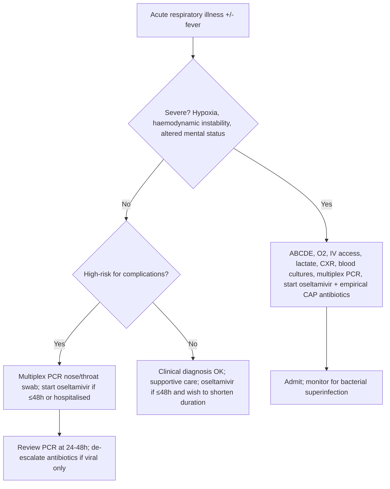
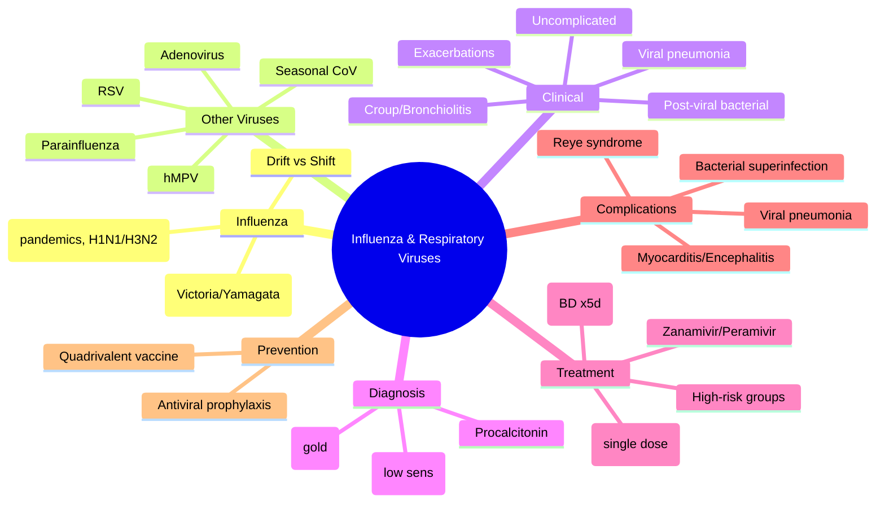
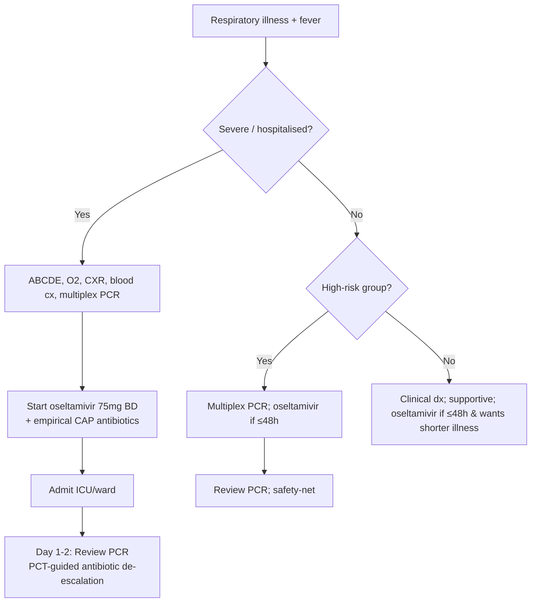

---
tags: [medicine, infectious-disease, davidson, chapter13, respiratory, viruses, fcps, mrcp]
davidson_chapter: Chapter 13: Infectious disease
topic_category: Respiratory Infections Domain
status: full-fcps-mrcp-topic-note
---

# Influenza and Respiratory Viruses

Related: [[Community-Acquired Pneumonia (CAP)]], [[Hospital-Acquired and Ventilator-Associated Pneumonia (HAP-VAP)]], [[Fever and Septic Syndrome Approach]], [[Sepsis and Septic Shock]]

> [!important]
> **Influenza** causes seasonal epidemics and occasional pandemics. **Rapid diagnosis, early antivirals (≤48h), and complication recognition** are exam essentials. Other respiratory viruses (RSV, hMPV, parainfluenza, adenovirus, coronaviruses) cause overlapping syndromes — distinguish by epidemiology, age, and testing.

## Learning Objectives
- Classify influenza viruses and understand antigenic drift vs shift
- Recognise clinical syndromes: uncomplicated flu, flu pneumonia, exacerbations, post-viral complications
- Apply testing strategies (POC PCR, multiplex panels) and interpret results
- Initiate early antiviral therapy (oseltamivir, baloxavir) in high-risk groups
- Manage complications: secondary bacterial pneumonia, myocarditis, encephalitis, ARDS
- Understand vaccination indications, timing, and effectiveness

## Definition
- **Influenza A/B/C/D**: Orthomyxoviridae; A and B cause human epidemics; C = mild; D = cattle
- **Influenza A subtypes**: Defined by HA (H1–H18) and NA (N1–N11); current seasonal = H1N1, H3N2
- **Antigenic drift**: Point mutations in HA/NA → seasonal epidemics
- **Antigenic shift**: Reassortment of gene segments → novel subtype → pandemic potential

## Core Microbiology
| Virus | Family | Key Features |
|-------|--------|--------------|
| **Influenza A** | Orthomyxoviridae | Pandemics, avian/swine reservoirs, H1N1/H3N2 seasonal |
| **Influenza B** | Orthomyxoviridae | No pandemics, two lineages (Victoria, Yamagata), seasonal |
| **RSV** | Pneumoviridae | Bronchiolitis in infants, severe in elderly/immunocompromised |
| **hMPV** | Pneumoviridae | RSV-like, all ages, winter/spring |
| **Parainfluenza 1–4** | Paramyxoviridae | Croup (PIV-1,2), bronchiolitis (PIV-3), year-round |
| **Adenovirus** | Adenoviridae | Pharyngoconjunctival fever, pneumonia (types 3, 4, 7, 14), military recruits |
| **Seasonal coronaviruses** | Coronaviridae | OC43, 229E, NL63, HKU1 — common cold, sometimes LRTI |
| **SARS-CoV-2** | Coronaviridae | COVID-19 — separate chapter |

## Normal Values / Important Cut-offs
| Parameter | Threshold | Significance |
|-----------|-----------|--------------|
| **Rapid antigen test sensitivity** | 50–70% | High specificity; **negative does not rule out** |
| **RT-PCR / multiplex PCR** | Sensitivity >95% | Gold standard; detects co-infections |
| **Oseltamivir window** | **≤48h from onset** | Max benefit; still consider if severe/hospitalised >48h |
| **Baloxavir window** | ≤48h | Single dose; active against oseltamivir-resistant strains |
| **Vaccine effectiveness** | 40–60% (good match) | Lower in elderly; reduces severity/hospitalisation |

## Clinical Syndromes
| Syndrome | Features | Key Viruses |
|----------|----------|-------------|
| **Uncomplicated influenza** | Abrupt fever, myalgia, headache, dry cough, sore throat, fatigue | Influenza A/B |
| **Influenza pneumonia** | Primary viral pneumonia — dyspnoea, hypoxia, bilateral infiltrates | Influenza A (H1N1, H3N2, avian) |
| **Exacerbation of chronic disease** | COPD/asthma/heart failure decompensation | Influenza, RSV, hMPV |
| **Croup** | Barking cough, stridor, hoarseness — children | Parainfluenza 1, 2, 3 |
| **Bronchiolitis** | Wheeze, crackles, respiratory distress <2y | RSV, hMPV, PIV-3 |
| **Post-influenza bacterial pneumonia** | Biphasic illness: flu → improvement → fever/cough/purulent sputum | *S. pneumoniae*, *S. aureus*, *H. influenzae* |

## Approach / Algorithm

## Investigations
| Test | Indication | Interpretation |
|------|------------|----------------|
| **Multiplex respiratory PCR** (nose/throat swab) | Hospitalised, immunocompromised, high-risk, outbreak investigation | Detects 15–25 pathogens; co-infection 5–10% |
| **POC rapid antigen (flu/RSV/SARS-CoV-2)** | ED, primary care, triage | Fast (15 min); **low sensitivity** — negative ≠ rule out |
| **Viral culture** | Reference lab, surveillance | Slow (days); not for clinical management |
| **Serology (paired acute/convalescent)** | Retrospective diagnosis, surveillance | Not acute management |
| **CXR** | Suspected pneumonia | Influenza: bilateral interstitial/ground-glass; bacterial superinfection: lobar consolidation |
| **Procalcitonin** | Distinguish viral vs bacterial; guide antibiotics | Low (<0.25) supports viral; high (>0.5) suggests bacterial co-infection |
| **Full blood count** | All | Lymphopenia common in influenza; neutrophilia suggests bacterial |

## Antiviral Therapy
| Drug | Dose | Window | Key Points |
|------|------|--------|------------|
| **Oseltamivir** | 75mg BD PO ×5d (adult); renal adjust | ≤48h ideal; **still give if hospitalised/severe >48h** | Reduces duration 1–2d, complications, mortality in hospitalised; nausea common |
| **Baloxavir marboxil** | 40mg (<80kg) or 80mg (≥80kg) single dose PO | ≤48h | Cap-dependent endonuclease inhibitor; single dose; active vs oseltamivir-resistant; not in pregnancy/severe immunosuppression |
| **Zanamivir** | 10mg (2 inhalations) BD ×5d | ≤48h | Inhaled; avoid in asthma/COPD (bronchospasm risk) |
| **Peramivir** | 600mg IV single dose | ≤48h | IV option; renal adjust |

> [!important]
> **Oseltamivir in severe/hospitalised influenza: give regardless of time since onset** — observational data show mortality benefit even >48h. **Dose: 75mg BD; consider 150mg BD in critically ill/ICU (off-label, some guidelines).**

## High-Risk Groups for Antivirals (Treat Empirically)
- Age ≥65 or <2 years
- Pregnancy / ≤2 weeks postpartum
- Chronic pulmonary (COPD, asthma), cardiac, renal, hepatic, haematological, metabolic (diabetes), neurological/neuromuscular
- Immunosuppression (HIV, transplant, chemo, steroids ≥20mg prednisolone/day)
- BMI ≥40
- Nursing home residents
- **All hospitalised patients with suspected/confirmed influenza**

## Complications
| Complication | Features | Management |
|--------------|----------|------------|
| **Primary viral pneumonia** | Progressive dyspnoea, hypoxia, bilateral ground-glass — high mortality | ICU, oseltamivir, supportive; corticosteroids controversial (avoid routine) |
| **Secondary bacterial pneumonia** | Biphasic: flu → improvement → recrudescence fever/purulent sputum; **S. pneumoniae, S. aureus (MRSA), H. influenzae** | Empirical antibiotics covering above; CXR consolidation |
| **Myositis/rhabdomyolysis** | Severe calfpain, elevated CK, myoglobinuria | Hydration, monitor renal function |
| **Myocarditis/pericarditis** | Chest pain, elevated troponin, ECG changes, arrhythmia | Supportive, cardiology input |
| **Encephalitis/encephalopathy** | Altered mental status, seizures — esp. children | ICU, oseltamivir IV (if available), supportive |
| **ARDS** | Refractory hypoxia, bilateral infiltrates | Lung-protective ventilation, prone, ECMO if refractory |
| **Reye syndrome** | **Aspirin in children + viral illness** → hepatic encephalopathy | **Avoid aspirin <16y**; stavudine? |

## Red Flags / Emergencies
- **Hypoxia (SpO₂ <92%)** → admit, oxygen, consider HFNC/NIV/ICU
- **Haemodynamic instability** → septic shock protocol
- **Altered mental status** → consider encephalitis, treat empirically
- **Rapid progression** → primary viral pneumonia or bacterial superinfection
- **Immunocompromised + respiratory symptoms** → low threshold for admission, multiplex PCR, early antivirals

## Differential Diagnosis
| Condition | Distinguishing Features |
|-----------|------------------------|
| **COVID-19** | Anosmia/ageusia, longer incubation, higher thrombosis risk, multiplex PCR distinguishes |
| **CAP (bacterial)** | Lobar consolidation, high procalcitonin, neutrophilia, purulent sputum from onset |
| **Atypical pneumonia** | Mycoplasma, Legionella, Chlamydia — subacute, extrapulmonary features |
| **Pulmonary embolism** | Sudden dyspnoea, pleuritic pain, risk factors, CTI D-dimer/CTPA |
| **Heart failure** | Orthopnoea, PND, elevated BNP, fluid overload signs |

## Special Situations
| Situation | Management |
|-----------|------------|
| **Pregnancy** | Oseltamivir 75mg BD ×5d (category C, but benefit > risk); baloxavir contraindicated; vaccinate any trimester |
| **Immunocompromised** | PCR testing mandatory; oseltamivir 75mg BD ×10d (prolonged); consider IV peramivir; monitor for prolonged shedding/resistance |
| **Renal impairment** | Oseltamivir: CrCl 10–30 → 30mg BD; CrCl <10 → 30mg OD; dialysis → 30mg post-HD |
| **Oseltamivir resistance (H275Y)** | Rare in current strains; if suspected → baloxavir or IV zanamivir/peramivir |
| **Outbreak in care home** | Treat all symptomatic + post-exposure prophylaxis for contacts (oseltamivir 75mg OD ×10d) |

## FCPS/MRCP High-Yield Points
- **Influenza A vs B**: A = pandemics, avian reservoirs, H1N1/H3N2; B = two lineages, no pandemics
- **Antigenic drift vs shift**: drift = point mutations (seasonal); shift = reassortment (pandemic)
- **Oseltamivir window**: ≤48h for outpatients; **give to all hospitalised regardless of timing**
- **High-risk groups for antivirals**: age extremes, pregnancy, chronic disease, immunosuppression, obesity
- **Secondary bacterial pneumonia**: biphasic illness — *S. pneumoniae* > *S. aureus* > *H. influenzae*
- **Procalcitonin**: low = viral; high = bacterial co-infection — guides antibiotics
- **Vaccine**: quadrivalent (2A + 2B); annual; effectiveness 40–60%; reduces severity even if mismatch
- **Baloxavir**: single dose; not in pregnancy/severe immunosuppression; active vs oseltamivir-resistant
- **Reye syndrome**: aspirin + viral illness in children — **avoid aspirin <16y**
- **Multiplex PCR**: gold standard; detects co-infections; preferred over rapid antigen for hospitalised

## Common Viva Questions
1. **When do you give oseltamivir >48h after symptom onset?** Hospitalised patients, severe disease, immunocompromised — observational mortality benefit.
2. **What is the typical CXR finding in primary influenza pneumonia?** Bilateral interstitial/ground-glass infiltrates (ARDS pattern).
3. **Name three bacterial pathogens causing post-influenzal pneumonia.** *S. pneumoniae*, *S. aureus* (including MRSA), *H. influenzae*.
4. **How does baloxavir differ from oseltamivir?** Single dose, cap-dependent endonuclease inhibitor, active vs oseltamivir-resistant strains, not in pregnancy.
5. **What is Reye syndrome and how is it prevented?** Aspirin in children with viral illness → hepatic encephalopathy; avoid aspirin <16y.

## Common Confusions / Exam Traps
| Confusion | Clarification |
|-----------|---------------|
| Rapid antigen negative = no flu | Sensitivity 50–70% — **never rule out based on negative antigen**; PCR if high suspicion |
| Oseltamivir only if ≤48h | **Hospitalised/severe: give regardless of timing** |
| Influenza B milder than A | Can be equally severe; both cause hospitalisation/death |
| Vaccine prevents all flu | Effectiveness 40–60%; mismatch years lower; still reduces severity |
| Baloxavir for everyone | Contraindicated in pregnancy, severe immunosuppression, <5y (some regions) |
| Secondary pneumonia = same as CAP | Biphasic history key; different empiric cover (add MRSA if recent flu) |

## Mnemonics
- **FLU HIGH-RISK**: **F**lu season, **L**ungs (COPD/asthma), **U** (immunocompromised), **H**eart disease, **I**mportant (pregnancy), **G**lucose (diabetes), **H**eavy (BMI≥40), **R**enal failure, **I**nfants/elderly, **S**teroids, **K**ids in care homes
- **ANTIVIRALS**: **A**bilify? no — **A**gent (oseltamivir/baloxavir), **N**ephro adjust, **T**ime (≤48h ideal but hospitalised anyway), **I**CU (higher dose considered), **V**accine annually, **I**mmunocompromised (longer course), **R**esistance rare (H275Y), **A**spirin avoid <16y, **L**actation OK, **S**econdary bacterial pneumonia

## Mind Map

## Flowchart

## Suggested Visuals / Image Notes
- Influenza virion structure (HA, NA, M2, RNA segments)
- Antigenic drift vs shift diagram
- Multiplex PCR panel output example
- CXR: primary influenza pneumonia vs bacterial superinfection
- Vaccine strain selection timeline (WHO GISRS)

## Suggested Video References
- WHO GISRS influenza surveillance (WHO YouTube)
- CDC seasonal influenza updates
- Oseltamivir/baloxavir mechanism animations
- Multiplex PCR workflow (BioFire, Roche, Seegene)

## One-Page Revision Summary
| Topic | Key Points |
|-------|------------|
| **Virus** | Influenza A (H1N1/H3N2, pandemics), B (2 lineages); RSV, hMPV, PIV, adenovirus |
| **Drift vs Shift** | Drift = point mutations (seasonal); Shift = reassortment (pandemic) |
| **Diagnosis** | Multiplex PCR = gold; rapid Ag = low sensitivity; PCT guides bacterial co-infection |
| **Antivirals** | Oseltamivir 75mg BD×5d (renal adjust); Baloxavir single dose; Zanamivir inhaled |
| **Window** | ≤48h ideal; **hospitalised/severe → give anyway** |
| **High-risk** | Age extremes, pregnancy, chronic disease, immunosuppression, BMI≥40 |
| **Complications** | Viral pneumonia, bacterial superinfection (biphasic), myocarditis, encephalitis, Reye |
| **Prevention** | Quadrivalent vaccine annually; effectiveness 40–60%; reduces severity |

## 24-Hour Recall Prompts
- Define antigenic drift vs shift.
- List 5 high-risk groups who should receive oseltamivir.
- What is the biphasic pattern of post-influenzal bacterial pneumonia?
- Name the three main bacterial pathogens in post-flu pneumonia.
- When do you give oseltamivir >48h after onset?

## 7-Day / 15-Day / 30-Day Revision Tracker
- [ ] Day 1 completed
- [ ] 24-hour recall completed
- [ ] Day 7 revision completed
- [ ] Day 15 revision completed
- [ ] Day 30 revision completed

## Must Know / Should Know / Nice to Know
### Must Know
- Influenza A/B classification, drift vs shift
- Oseltamivir indications, dosing, renal adjustment, >48h in hospitalised
- High-risk groups for antivirals
- Secondary bacterial pneumonia: biphasic, pathogens
- Procalcitonin interpretation
- Quadrivalent vaccine

### Should Know
- Baloxavir: mechanism, single dose, contraindications
- Other respiratory viruses: RSV, hMPV, PIV, adenovirus syndromes
- Multiplex PCR vs rapid antigen
- Oseltamivir resistance (H275Y) management
- Special populations: pregnancy, immunocompromised, renal

### Nice to Know
- Antiviral prophylaxis in outbreaks
- IV zanamivir/peramivir for resistant strains
- Corticosteroids in severe influenza (controversial)
- Influenza surveillance systems (GISRS)
- Novel antivirals in development (pimodivir, favipiravir)

## My Weak Points
- [ ] Memorise exact oseltamivir renal dosing table
- [ ] Baloxavir paediatric dosing
- [ ] Corticosteroid evidence in influenza ARDS

## Self-Test Scorecard
- Understanding: /10
- Recall: /10
- MCQ Performance: /10
- SBA Performance: /10
- Viva Confidence: /10
- Total: /50

> [!tip]
> Interpretation: <35 = weak topic, 35-44 = acceptable but insecure, 45+ = strong exam-ready topic.

## Exam Answer Modes
### Long Answer Skeleton
1. Virology: Influenza A/B, drift vs shift, other respiratory viruses
2. Clinical syndromes: uncomplicated, pneumonia, exacerbations, croup, bronchiolitis, post-viral bacterial
3. Diagnosis: multiplex PCR, rapid Ag limitations, PCT, CXR patterns
4. Antivirals: oseltamivir, baloxavir, zanamivir, peramivir — mechanisms, dosing, windows
5. High-risk groups and indications for treatment
6. Complications: viral pneumonia, bacterial superinfection, extra-pulmonary
6. Prevention: vaccine, prophylaxis

### Short Note Skeleton
- Flu A: drift/shift, H1N1/H3N2; Flu B: 2 lineages
- Dx: multiplex PCR (gold), rapid Ag (low sens), PCT (bacterial co-infection)
- Rx: oseltamivir 75mg BD×5d (renal adj); baloxavir single dose; >48h if hospitalised
- High-risk: age extremes, pregnancy, chronic disease, immunosuppression, obesity
- Complications: viral pneumonitis, 2° bacterial (S.pn, S.au, H.inf), myocarditis, encephalitis, Reye
- Vaccine: quadrivalent, annual, 40–60% effective

### Viva One-Liners
- Drift = point mutations (seasonal); Shift = reassortment (pandemic)
- Oseltamivir: 75mg BD×5d; give to hospitalised regardless of timing
- Secondary bacterial pneumonia = biphasic illness
- Baloxavir: single dose, endonuclease inhibitor, not in pregnancy
- PCT low = viral; PCT high = bacterial co-infection
- Reye: aspirin + viral in children — avoid <16y

### Ward-Case Discussion Points
- 70M, COPD, day 2 flu symptoms → oseltamivir 75mg BD×5d even if >48h? Yes — high-risk
- 30F pregnant, flu confirmed → oseltamivir safe, baloxavir contraindicated
- ICU patient, flu+, day 5, deteriorating → continue oseltamivir, PCT for bacterial co-infection, consider baloxavir if resistance suspected

### Last-Night-Before-Exam Sheet
**FLU:** A (drift/shift, H1N1/H3N2) vs B (2 lineages). **Dx:** multiplex PCR gold; Ag 50-70% sens. **Rx:** oseltamivir 75mg BD×5d (renal adj); baloxavir 1 dose. **Indications:** high-risk (age, preg, chronic, immuno, BMI≥40); hospitalised ANY timing. **Complications:** 1° viral pneum (bilat GGO), 2° bacterial (biphasic, S.pn/S.au/H.inf), myocarditis, encephalitis, Reye (aspirin<16y). **Vaccine:** quad, annual, 40-60%.

## Summary
Influenza (A and B) and other respiratory viruses (RSV, hMPV, parainfluenza, adenovirus) cause overlapping acute respiratory syndromes. **Diagnosis**: multiplex PCR is gold standard; rapid antigen has low sensitivity (50–70%). **Treatment**: oseltamivir 75mg BD ×5d (renal adjust) initiated ≤48h for outpatients, **but given to all hospitalised/severe/high-risk patients regardless of timing**. Baloxavir single dose is alternative (not pregnancy/severe immunocompromise). **High-risk groups**: age extremes, pregnancy, chronic cardiopulmonary/renal/hepatic/metabolic/neurological disease, immunosuppression, BMI≥40. **Complications**: primary viral pneumonia (bilateral GGO), secondary bacterial pneumonia (biphasic — *S. pneumoniae*, *S. aureus*, *H. influenzae*), myocarditis, encephalitis, Reye syndrome (aspirin <16y). **Prevention**: quadrivalent vaccine annually (40–60% effectiveness, reduces severity). Procalcitonin guides antibiotic stewardship for bacterial co-infection.

## MCQs (10)
1. **Which statement about influenza antigenic shift is CORRECT?**
   A. Results from point mutations in HA/NA genes
   B. Occurs annually and drives seasonal epidemics
   C. Involves reassortment of gene segments between different influenza A viruses
   D. Occurs in both influenza A and B
   E. Is the mechanism for oseltamivir resistance

2. **A 68-year-old man with COPD presents on day 3 of fever, cough, and myalgia. Multiplex PCR confirms influenza A. He is not hypoxic. Most appropriate management?**
   A. Supportive care only — >48h window missed
   B. Oseltamivir 75mg BD ×5 days
   C. Baloxavir 40mg single dose
   D. Zanamivir 10mg BD inhaled ×5 days
   E. Amoxicillin for secondary bacterial pneumonia prophylaxis

3. **What is the characteristic "biphasic" pattern of post-influenza bacterial pneumonia?**
   A. Fever → defervescence → recurrence of fever with purulent sputum
   B. Dry cough → productive cough → haemoptysis
   C. Unilateral infiltrate → bilateral infiltrates → cavitation
   D. Lymphocytosis → neutrophilia → eosinophilia
   E. Mild illness → sudden ARDS → recovery

4. **Which antiviral is a cap-dependent endonuclease inhibitor given as a single dose?**
   A. Oseltamivir
   B. Zanamivir
   C. Peramivir
   D. Baloxavir marboxil
   E. Amantadine

5. **Baloxavir is CONTRAINDICATED in which group?**
   A. Age >65
   B. Pregnancy
   C. COPD
   D. Diabetes
   E. Renal impairment (CrCl <30)

6. **Procalcitonin in a patient with confirmed influenza and suspected bacterial superinfection: which level MOST strongly supports bacterial co-infection?**
   A. <0.05 ng/mL
   B. 0.1 ng/mL
   C. 0.3 ng/mL
   D. 1.5 ng/mL
   E. PCT is not useful in viral infections

7. **Reye syndrome is classically associated with which combination?**
   A. Influenza B + ibuprofen in children
   B. Varicella + aspirin in children
   C. Influenza A + aspirin in children
   D. RSV + paracetamol in infants
   E. Adenovirus + aspirin in adults

8. **Which is the recommended oseltamivir dose for a patient on intermittent haemodialysis (CrCl <10)?**
   A. 75mg BD
   B. 75mg OD
   C. 30mg post-dialysis
   D. 30mg BD
   E. Contraindicated

9. **Multiplex respiratory PCR panel: what is the approximate rate of viral-viral co-infection detected?**
   A. <1%
   B. 5–10%
   C. 20–30%
   D. 40–50%
   E. >60%

10. **Quadrivalent influenza vaccine contains:**
    A. Two influenza A strains + one influenza B strain
    B. One influenza A strain + two influenza B strains
    C. Two influenza A strains + two influenza B strains
    D. Four influenza A strains
    E. Live attenuated strains only

## SBA Questions (10)
1. **A 45-year-old woman, 32 weeks pregnant, presents with 36h of fever (38.9°C), cough, myalgia. Rapid flu antigen positive. No hypoxia. Best antiviral?**
   A. Oseltamivir 75mg BD ×5 days
   B. Baloxavir 40mg single dose
   C. Zanamivir 10mg BD ×5 days
   D. Peramivir 600mg IV single dose
   E. No antiviral — >48h window

2. **A 70-year-old man with diabetes is admitted with influenza A pneumonia (hypoxic, bilateral GGO on CXR). He receives oseltamivir 75mg BD. On day 4, he spikes fever to 39.5°C, purulent sputum, new right lower lobe consolidation on CXR, CRP 280, PCT 4.2 ng/mL. Blood cultures pending. Best empirical antibiotic addition?**
   A. Amoxicillin 1g TDS
   B. Co-amoxiclav 1.2g TDS
   C. Ceftriaxone 2g OD + clarithromycin 500mg BD
   D. Ceftriaxone 2g OD + vancomycin 15mg/kg BD
   E. Piperacillin-tazobactam 4.5g TDS

3. **An immunocompromised patient (post-allogeneic BMT, day +40) develops rhinorrhoea, cough, low-grade fever. Multiplex PCR positive for RSV. No hypoxia. Management?**
   A. Supportive only
   B. Ribavirin IV
   C. Oseltamivir 75mg BD ×10 days
   D. Palivizumab 15mg/kg IM monthly
   E. Baloxavir single dose

4. **Which statement about influenza vaccination is TRUE?**
   A. Live attenuated vaccine preferred in immunocompromised
   B. Effectiveness is 80–90% in well-matched years
   C. Should be given annually, ideally before flu season
   D. Contraindicated in egg allergy
   E. Single dose provides lifelong immunity

5. **A care home resident with dementia develops acute confusion, fever 38.2°C, cough. Two other residents have confirmed influenza. Rapid flu test negative. Next step?**
   A. Treat as flu — start oseltamivir, send PCR
   B. Dismiss flu — negative rapid test rules it out
   C. Start amoxicillin for aspiration pneumonia
   D. CT head for confusion
   E. LP for encephalitis

6. **A 5-year-old child with influenza is given aspirin by parents for fever. Three days later, develops vomiting, lethargy, hepatomegaly. ALT 1200, ammonia 180. Diagnosis?**
   A. Acute liver failure from influenza
   B. Reye syndrome
   C. Drug-induced liver injury (paracetamol)
   D. Acute viral hepatitis
   E. Mitochondrial disorder

7. **In a patient with severe influenza pneumonia on oseltamivir 75mg BD, day 5, still hypoxic, new infiltrate. What is the most appropriate next step?**
   A. Increase oseltamivir to 150mg BD
   B. Switch to baloxavir
   C. Add empirical antibiotics for bacterial superinfection, check PCT
   D. Start high-dose corticosteroids
   E. Stop oseltamivir (failed)

8. **Regarding oseltamivir resistance (H275Y mutation): which is CORRECT?**
   A. Confers resistance to all neuraminidase inhibitors
   B. Common in circulating H1N1 and H3N2
   C. Baloxavir retains activity against H275Y strains
   D. Zanamivir is ineffective against H275Y
   E. Resistance develops in >50% of treated patients

9. **A 25-year-old healthcare worker receives seasonal flu vaccine in October. In January, develops flu-like illness. PCR positive for influenza A H3N2. What does this indicate?**
   A. Vaccine failure — vaccine was ineffective
   B. Vaccine mismatch — circulating strain differs from vaccine strain
   C. Waning immunity — vaccine protection lasts <3 months
   D. Primary vaccine failure — immune response inadequate
   E. Normal — vaccine reduces severity but not infection

10. **Which respiratory virus is MOST commonly associated with croup (laryngotracheobronchitis) in children?**
    A. RSV
    B. Influenza A
    C. Parainfluenza virus type 1 and 2
    D. Adenovirus
    E. hMPV

## Flashcards
- Q: Antigenic drift vs shift
  A: Drift = point mutations in HA/NA (seasonal epidemics); Shift = reassortment of RNA segments (pandemic potential)
- Q: Influenza A subtypes in current seasonal circulation
  A: H1N1, H3N2
- Q: Influenza B lineages
  A: Victoria, Yamagata
- Q: Oseltamivir dose and duration (adult, normal renal)
  A: 75mg BD PO ×5 days
- Q: Oseltamivir renal dosing: CrCl 10-30
  A: 30mg BD
- Q: Oseltamivir renal dosing: CrCl <10 / dialysis
  A: 30mg post-dialysis (or 30mg OD if not on dialysis)
- Q: When to give oseltamivir >48h after onset?
  A: Hospitalised patients, severe disease, immunocompromised, high-risk groups
- Q: Baloxavir dose
  A: 40mg (<80kg) or 80mg (≥80kg) single dose PO
- Q: Baloxavir contraindications
  A: Pregnancy, severe immunocompromise, <5y (varies by region)
- Q: Secondary bacterial pneumonia pathogens (post-flu)
  A: S. pneumoniae > S. aureus (incl MRSA) > H. influenzae
- Q: Biphasic pattern of post-flu bacterial pneumonia
  A: Flu illness → improvement → recrudescence with fever/purulent sputum/consolidation
- Q: Procalcitonin interpretation in flu
  A: Low (<0.25) = viral; High (>0.5) = bacterial co-infection
- Q: Reye syndrome
  A: Aspirin + viral illness in children → hepatic encephalopathy; avoid aspirin <16y
- Q: Quadrivalent vaccine composition
  A: 2 influenza A (H1N1, H3N2) + 2 influenza B (Victoria, Yamagata)
- Q: Vaccine effectiveness
  A: 40–60% when well-matched; lower in elderly; reduces severity/hospitalisation
- Q: RSV typical syndrome
  A: Bronchiolitis in infants <2y; severe in elderly/immunocompromised
- Q: Parainfluenza typical syndrome
  A: Croup (PIV-1,2) — barking cough, stridor; bronchiolitis (PIV-3)
- Q: Adenovirus severe pneumonia types
  A: Types 3, 4, 7, 14 — military recruits, immunocompromised
- Q: Multiplex PCR co-infection rate
  A: 5–10%
- Q: Oseltamivir resistance mutation
  A: H275Y (histidine→tyrosine at 275 in NA); rare in current strains
- Q: H275Y resistance — alternative antiviral
  A: Baloxavir (retains activity); IV zanamivir/peramivir

## Answer Key with Explanations
### MCQs
1. **C** — Antigenic shift = reassortment of gene segments between different influenza A viruses (e.g., human + avian) creating novel subtype with pandemic potential. Drift = point mutations (A). Shift does not occur in influenza B (D).
2. **B** — High-risk (age >65, COPD) → oseltamivir indicated even >48h. Baloxavir not preferred in elderly (less data). Zanamivir inhaled — avoid COPD. Antibiotics not for prophylaxis.
3. **A** — Classic biphasic: initial flu → clinical improvement → recrudescence fever/purulent sputum/consolidation = secondary bacterial pneumonia.
4. **D** — Baloxavir = cap-dependent endonuclease inhibitor, single dose. Oseltamivir/zanamivir/peramivir = neuraminidase inhibitors. Amantadine = M2 blocker (obsolete, resistance universal).
5. **B** — Baloxavir contraindicated in pregnancy (animal teratogenicity). Not contraindicated in elderly, COPD, diabetes, renal impairment (no renal adjustment needed).
6. **D** — PCT >0.5 ng/mL strongly suggests bacterial co-infection; 1.5 ng/mL = high probability. <0.25 supports viral.
7. **C** — Reye syndrome: aspirin + viral illness (influenza A/B, varicella) in children → hepatic encephalopathy. Avoid aspirin <16y.
8. **C** — Oseltamivir in HD: 30mg post-dialysis (standard recommendation). 75mg BD = normal renal. 30mg BD = CrCl 10-30.
9. **B** — Viral-viral co-infection rate ~5–10% on multiplex panels.
10. **C** — Quadrivalent = 2 A strains (H1N1, H3N2) + 2 B lineages (Victoria, Yamagata).

### SBAs
1. **A** — Pregnancy + flu = oseltamivir 75mg BD ×5d (category C but benefit > risk). Baloxavir contraindicated in pregnancy. Zanamivir inhaled but oseltamivir preferred. Peramivir IV not first-line. Window not absolute in high-risk.
2. **D** — Post-flu bacterial pneumonia day 4: new consolidation, high PCT (4.2) = bacterial superinfection. Most likely pathogens: S. pneumoniae, S. aureus (MRSA risk in post-viral), H. influenzae. Ceftriaxone + vancomycin covers all three. Pip-tazo also reasonable but ceftriaxone + vancomycin more targeted for this syndrome.
3. **A** — RSV in immunocompromised: no specific antiviral proven effective (ribavirin limited evidence, toxic). Palivizumab = prophylaxis (monthly), not treatment. Oseltamivir/baloxavir = influenza only. Supportive care, monitor for LRTI progression.
4. **C** — Annual vaccination before flu season is standard. LAIV contraindicated in immunocompromised. Effectiveness 40–60%. Egg allergy not contraindication (cell-based/recombinant available). No lifelong immunity.
5. **A** — Care home outbreak + compatible illness + negative rapid test (low sensitivity) → treat as flu (start oseltamivir) + send PCR for confirmation. High pre-test probability.
6. **B** — Reye syndrome: aspirin + viral in child → vomiting, lethargy, hepatomegaly, hyperammonaemia, elevated LFTs.
7. **C** — Day 5 severe flu + new infiltrate + persistent hypoxia → bacterial superinfection most likely. Add empirical antibiotics (ceftriaxone + vancomycin), check PCT. Oseltamivir 150mg BD off-label, not first step. Steroids not routinely recommended.
8. **C** — H275Y = oseltamivir resistance; zanamivir usually retains activity; baloxavir (different target) retains activity. Resistance uncommon (<1-2%).
9. **E** — Vaccine reduces severity/hospitalisation but does not prevent all infection. 40-60% effectiveness against symptomatic infection; breakthrough infections expected.
10. **C** — Parainfluenza 1 and 2 = classic croup (barking cough, stridor). RSV = bronchiolitis. Influenza = flu syndrome. Adenovirus = pharyngoconjunctival fever, pneumonia. hMPV = RSV-like.

---

## PasTest Scenario SBAs (Clinical Vignettes)

> **Auto-generated PasTest/Mediscope-style scenario SBAs** grounded in the authored source. Each scenario tests a real clinical fact (triad, specific sign, contraindication, trial, first-line Rx) extracted from the topic. *Source: Ch 14: Infectious Disease — Influenza and Respiratory Viruses*

**Q1.** What is the most appropriate first-line therapy for Influenza and Respiratory Viruses?

  - **A.** Oseltamivir
  - **B.** An advanced/surgical therapy reserved for refractory disease
  - **C.** Symptomatic treatment only, no disease-modifying therapy
  - **D.** Empiric broad-spectrum therapy without specific indication

  > **Answer: A** — Oseltamivir
  >
  > *Source:* **Oseltamivir**   75mg BD PO ×5d (adult); renal adjust   ≤48h ideal; **still give if hospitalised/severe >48h**   Reduces duration 1–2d, complications, mortality in hospitalised; nausea common

