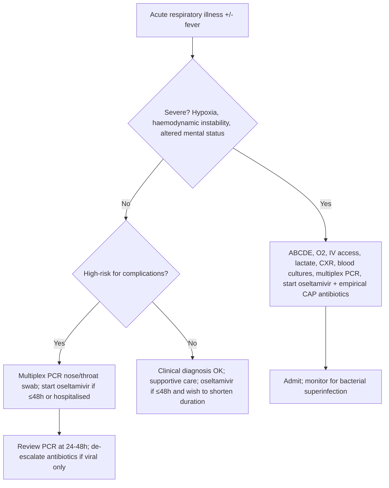
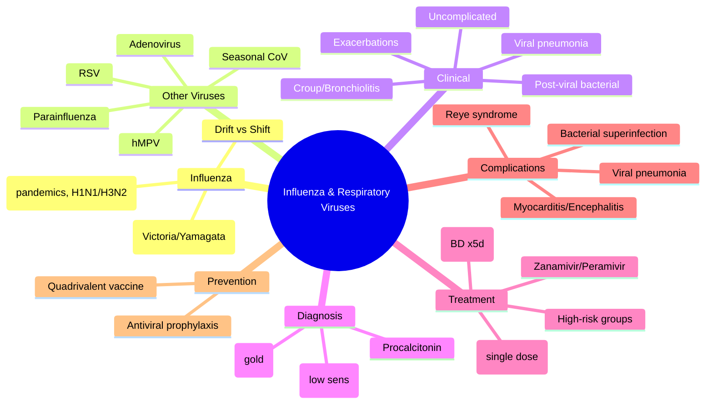

Related: [[Community-Acquired Pneumonia (CAP)]], [[Hospital-Acquired and Ventilator-Associated Pneumonia (HAP-VAP)]], [[Fever and Septic Syndrome Approach]], [[Sepsis and Septic Shock]]

> [!important]
> **Influenza** causes seasonal epidemics and occasional pandemics. **Rapid diagnosis, early antivirals (≤48h), and complication recognition** are exam essentials. Other respiratory viruses (RSV, hMPV, parainfluenza, adenovirus, coronaviruses) cause overlapping syndromes — distinguish by epidemiology, age, and testing.

## 1. Learning Objectives
- Classify influenza viruses and understand antigenic drift vs shift
- Recognise clinical syndromes: uncomplicated flu, flu pneumonia, exacerbations, post-viral complications
- Apply testing strategies (POC PCR, multiplex panels) and interpret results
- Initiate early antiviral therapy (oseltamivir, baloxavir) in high-risk groups
- Manage complications: secondary bacterial pneumonia, myocarditis, encephalitis, ARDS
- Understand vaccination indications, timing, and effectiveness

## 2. Definition
- **Influenza A/B/C/D**: Orthomyxoviridae; A and B cause human epidemics; C = mild; D = cattle
- **Influenza A subtypes**: Defined by HA (H1–H18) and NA (N1–N11); current seasonal = H1N1, H3N2
- **Antigenic drift**: Point mutations in HA/NA → seasonal epidemics
- **Antigenic shift**: Reassortment of gene segments → novel subtype → pandemic potential

## 3. Core Microbiology
| Virus | Family | Key Features |
|-------|--------|--------------|
| **Influenza A** | Orthomyxoviridae | Pandemics, avian/swine reservoirs, H1N1/H3N2 seasonal |
| **Influenza B** | Orthomyxoviridae | No pandemics, two lineages (Victoria, Yamagata), seasonal |
| **RSV** | Pneumoviridae | Bronchiolitis in infants, severe in elderly/immunocompromised |
| **hMPV** | Pneumoviridae | RSV-like, all ages, winter/spring |
| **Parainfluenza 1–4** | Paramyxoviridae | Croup (PIV-1,2), bronchiolitis (PIV-3), year-round |
| **Adenovirus** | Adenoviridae | Pharyngoconjunctival fever, pneumonia (types 3, 4, 7, 14), military recruits |
| **Seasonal coronaviruses** | Coronaviridae | OC43, 229E, NL63, HKU1 — common cold, sometimes LRTI |
| **SARS-CoV-2** | Coronaviridae | COVID-19 — separate chapter |

## 4. Normal Values / Important Cut-offs
| Parameter | Threshold | Significance |
|-----------|-----------|--------------|
| **Rapid antigen test sensitivity** | 50–70% | High specificity; **negative does not rule out** |
| **RT-PCR / multiplex PCR** | Sensitivity >95% | Gold standard; detects co-infections |
| **Oseltamivir window** | **≤48h from onset** | Max benefit; still consider if severe/hospitalised >48h |
| **Baloxavir window** | ≤48h | Single dose; active against oseltamivir-resistant strains |
| **Vaccine effectiveness** | 40–60% (good match) | Lower in elderly; reduces severity/hospitalisation |

## 5. Clinical Syndromes
| Syndrome | Features | Key Viruses |
|----------|----------|-------------|
| **Uncomplicated influenza** | Abrupt fever, myalgia, headache, dry cough, sore throat, fatigue | Influenza A/B |
| **Influenza pneumonia** | Primary viral pneumonia — dyspnoea, hypoxia, bilateral infiltrates | Influenza A (H1N1, H3N2, avian) |
| **Exacerbation of chronic disease** | COPD/asthma/heart failure decompensation | Influenza, RSV, hMPV |
| **Croup** | Barking cough, stridor, hoarseness — children | Parainfluenza 1, 2, 3 |
| **Bronchiolitis** | Wheeze, crackles, respiratory distress <2y | RSV, hMPV, PIV-3 |
| **Post-influenza bacterial pneumonia** | Biphasic illness: flu → improvement → fever/cough/purulent sputum | *S. pneumoniae*, *S. aureus*, *H. influenzae* |

## 6. Approach / Algorithm

## 7. Investigations
| Test | Indication | Interpretation |
|------|------------|----------------|
| **Multiplex respiratory PCR** (nose/throat swab) | Hospitalised, immunocompromised, high-risk, outbreak investigation | Detects 15–25 pathogens; co-infection 5–10% |
| **POC rapid antigen (flu/RSV/SARS-CoV-2)** | ED, primary care, triage | Fast (15 min); **low sensitivity** — negative ≠ rule out |
| **Viral culture** | Reference lab, surveillance | Slow (days); not for clinical management |
| **Serology (paired acute/convalescent)** | Retrospective diagnosis, surveillance | Not acute management |
| **CXR** | Suspected pneumonia | Influenza: bilateral interstitial/ground-glass; bacterial superinfection: lobar consolidation |
| **Procalcitonin** | Distinguish viral vs bacterial; guide antibiotics | Low (<0.25) supports viral; high (>0.5) suggests bacterial co-infection |
| **Full blood count** | All | Lymphopenia common in influenza; neutrophilia suggests bacterial |

## 8. Antiviral Therapy
| Drug | Dose | Window | Key Points |
|------|------|--------|------------|
| **Oseltamivir** | 75mg BD PO ×5d (adult); renal adjust | ≤48h ideal; **still give if hospitalised/severe >48h** | Reduces duration 1–2d, complications, mortality in hospitalised; nausea common |
| **Baloxavir marboxil** | 40mg (<80kg) or 80mg (≥80kg) single dose PO | ≤48h | Cap-dependent endonuclease inhibitor; single dose; active vs oseltamivir-resistant; not in pregnancy/severe immunosuppression |
| **Zanamivir** | 10mg (2 inhalations) BD ×5d | ≤48h | Inhaled; avoid in asthma/COPD (bronchospasm risk) |
| **Peramivir** | 600mg IV single dose | ≤48h | IV option; renal adjust |

> [!important]
> **Oseltamivir in severe/hospitalised influenza: give regardless of time since onset** — observational data show mortality benefit even >48h. **Dose: 75mg BD; consider 150mg BD in critically ill/ICU (off-label, some guidelines).**

## 9. High-Risk Groups for Antivirals (Treat Empirically)
- Age ≥65 or <2 years
- Pregnancy / ≤2 weeks postpartum
- Chronic pulmonary (COPD, asthma), cardiac, renal, hepatic, haematological, metabolic (diabetes), neurological/neuromuscular
- Immunosuppression (HIV, transplant, chemo, steroids ≥20mg prednisolone/day)
- BMI ≥40
- Nursing home residents
- **All hospitalised patients with suspected/confirmed influenza**

## 10. Complications
| Complication | Features | Management |
|--------------|----------|------------|
| **Primary viral pneumonia** | Progressive dyspnoea, hypoxia, bilateral ground-glass — high mortality | ICU, oseltamivir, supportive; corticosteroids controversial (avoid routine) |
| **Secondary bacterial pneumonia** | Biphasic: flu → improvement → recrudescence fever/purulent sputum; **S. pneumoniae, S. aureus (MRSA), H. influenzae** | Empirical antibiotics covering above; CXR consolidation |
| **Myositis/rhabdomyolysis** | Severe calfpain, elevated CK, myoglobinuria | Hydration, monitor renal function |
| **Myocarditis/pericarditis** | Chest pain, elevated troponin, ECG changes, arrhythmia | Supportive, cardiology input |
| **Encephalitis/encephalopathy** | Altered mental status, seizures — esp. children | ICU, oseltamivir IV (if available), supportive |
| **ARDS** | Refractory hypoxia, bilateral infiltrates | Lung-protective ventilation, prone, ECMO if refractory |
| **Reye syndrome** | **Aspirin in children + viral illness** → hepatic encephalopathy | **Avoid aspirin <16y**; stavudine? |

## 11. Red Flags / Emergencies
- **Hypoxia (SpO₂ <92%)** → admit, oxygen, consider HFNC/NIV/ICU
- **Haemodynamic instability** → septic shock protocol
- **Altered mental status** → consider encephalitis, treat empirically
- **Rapid progression** → primary viral pneumonia or bacterial superinfection
- **Immunocompromised + respiratory symptoms** → low threshold for admission, multiplex PCR, early antivirals

## 12. Differential Diagnosis
| Condition | Distinguishing Features |
|-----------|------------------------|
| **COVID-19** | Anosmia/ageusia, longer incubation, higher thrombosis risk, multiplex PCR distinguishes |
| **CAP (bacterial)** | Lobar consolidation, high procalcitonin, neutrophilia, purulent sputum from onset |
| **Atypical pneumonia** | Mycoplasma, Legionella, Chlamydia — subacute, extrapulmonary features |
| **Pulmonary embolism** | Sudden dyspnoea, pleuritic pain, risk factors, CTI D-dimer/CTPA |
| **Heart failure** | Orthopnoea, PND, elevated BNP, fluid overload signs |

## 13. Special Situations
| Situation | Management |
|-----------|------------|
| **Pregnancy** | Oseltamivir 75mg BD ×5d (category C, but benefit > risk); baloxavir contraindicated; vaccinate any trimester |
| **Immunocompromised** | PCR testing mandatory; oseltamivir 75mg BD ×10d (prolonged); consider IV peramivir; monitor for prolonged shedding/resistance |
| **Renal impairment** | Oseltamivir: CrCl 10–30 → 30mg BD; CrCl <10 → 30mg OD; dialysis → 30mg post-HD |
| **Oseltamivir resistance (H275Y)** | Rare in current strains; if suspected → baloxavir or IV zanamivir/peramivir |
| **Outbreak in care home** | Treat all symptomatic + post-exposure prophylaxis for contacts (oseltamivir 75mg OD ×10d) |

## 14. FCPS/MRCP High-Yield Points
- **Influenza A vs B**: A = pandemics, avian reservoirs, H1N1/H3N2; B = two lineages, no pandemics
- **Antigenic drift vs shift**: drift = point mutations (seasonal); shift = reassortment (pandemic)
- **Oseltamivir window**: ≤48h for outpatients; **give to all hospitalised regardless of timing**
- **High-risk groups for antivirals**: age extremes, pregnancy, chronic disease, immunosuppression, obesity
- **Secondary bacterial pneumonia**: biphasic illness — *S. pneumoniae* > *S. aureus* > *H. influenzae*
- **Procalcitonin**: low = viral; high = bacterial co-infection — guides antibiotics
- **Vaccine**: quadrivalent (2A + 2B); annual; effectiveness 40–60%; reduces severity even if mismatch
- **Baloxavir**: single dose; not in pregnancy/severe immunosuppression; active vs oseltamivir-resistant
- **Reye syndrome**: aspirin + viral illness in children — **avoid aspirin <16y**
- **Multiplex PCR**: gold standard; detects co-infections; preferred over rapid antigen for hospitalised

## 15. Common Viva Questions
1. **When do you give oseltamivir >48h after symptom onset?** Hospitalised patients, severe disease, immunocompromised — observational mortality benefit.
2. **What is the typical CXR finding in primary influenza pneumonia?** Bilateral interstitial/ground-glass infiltrates (ARDS pattern).
3. **Name three bacterial pathogens causing post-influenzal pneumonia.** *S. pneumoniae*, *S. aureus* (including MRSA), *H. influenzae*.
4. **How does baloxavir differ from oseltamivir?** Single dose, cap-dependent endonuclease inhibitor, active vs oseltamivir-resistant strains, not in pregnancy.
5. **What is Reye syndrome and how is it prevented?** Aspirin in children with viral illness → hepatic encephalopathy; avoid aspirin <16y.

## 16. Common Confusions / Exam Traps
| Confusion | Clarification |
|-----------|---------------|
| Rapid antigen negative = no flu | Sensitivity 50–70% — **never rule out based on negative antigen**; PCR if high suspicion |
| Oseltamivir only if ≤48h | **Hospitalised/severe: give regardless of timing** |
| Influenza B milder than A | Can be equally severe; both cause hospitalisation/death |
| Vaccine prevents all flu | Effectiveness 40–60%; mismatch years lower; still reduces severity |
| Baloxavir for everyone | Contraindicated in pregnancy, severe immunosuppression, <5y (some regions) |
| Secondary pneumonia = same as CAP | Biphasic history key; different empiric cover (add MRSA if recent flu) |

## 17. Mnemonics
- **FLU HIGH-RISK**: **F**lu season, **L**ungs (COPD/asthma), **U** (immunocompromised), **H**eart disease, **I**mportant (pregnancy), **G**lucose (diabetes), **H**eavy (BMI≥40), **R**enal failure, **I**nfants/elderly, **S**teroids, **K**ids in care homes
- **ANTIVIRALS**: **A**bilify? no — **A**gent (oseltamivir/baloxavir), **N**ephro adjust, **T**ime (≤48h ideal but hospitalised anyway), **I**CU (higher dose considered), **V**accine annually, **I**mmunocompromised (longer course), **R**esistance rare (H275Y), **A**spirin avoid <16y, **L**actation OK, **S**econdary bacterial pneumonia

## 18. Mind Map

*...continued (truncated to 200 lines for renderer)*