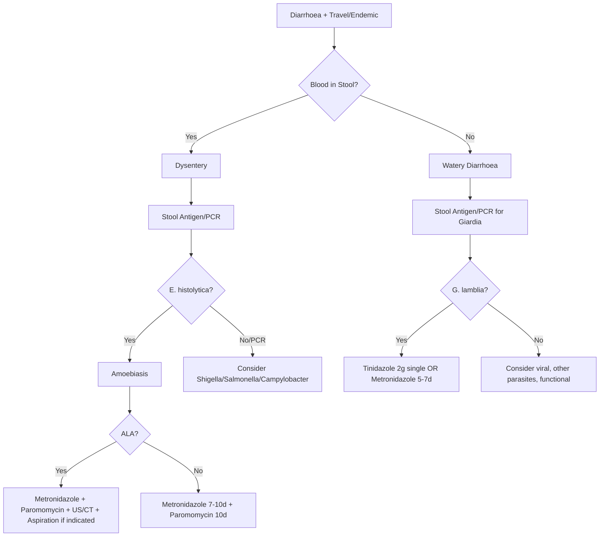

---
tags: [medicine, infectious-disease, davidson, chapter13, parasites, amoebiasis, giardiasis, fcps, mrcp]
davidson_chapter: Chapter 13: Infectious disease
topic_category: Parasitic Infections Domain
status: full-fcps-mrcp-topic-note
---

# Intestinal Protozoa — Amoebiasis & Giardiasis

Related: [[Fever in Returned Traveller and FUO]], [[Infective Diarrhoea and Food Poisoning]], [[HIV-Associated Opportunistic Infections]], [[Infection in Immunocompromised Host (Transplant, Biologics)]], [[Travel Medicine and Pre-Travel Advice]]

> [!important]
> **Amoebiasis = *Entamoeba histolytica*; faecal-oral; dysentery + liver abscess.** **Giardiasis = *Giardia lamblia*; faecal-oral; malabsorption + steatorrhoea.** **Both: cysts in stool = diagnosis; metronidazole = treatment.** **Amoebic liver abscess = metronidazole + luminal agent.**

## Learning Objectives
- Differentiate pathogenic *E. histolytica* from non-pathogenic *E. dispar*
- Recognise clinical syndromes: amoebic dysentery, amoebic liver abscess, giardiasis
- Select appropriate diagnostics (antigen, PCR, microscopy)
- Choose appropriate therapy: tissue-active + luminal agent for amoebiasis; metronidazole for giardiasis
- Apply prevention strategies for travellers and endemic areas

---

## Entamoeba histolytica (Amoebiasis)

### Epidemiology & Transmission
| Aspect | Details |
|--------|---------|
| **Agent** | *Entamoeba histolytica* (pathogenic); *E. dispar, E. moshkovskii* (non-pathogenic) |
| **Transmission** | **Faecal-oral** (cysts in contaminated food/water, person-to-person); sexual (MSM) |
| **Geography** | Tropical/subtropical; endemic in India, Africa, Latin America, SE Asia |
| **Risk** | Travellers, immigrants, MSM, institutionalised, immunocompromised |

### Pathogenesis
| Step | Mechanism |
|------|-----------|
| **1. Ingestion** | Mature quadrinucleate cysts survive gastric acid |
| **2. Excystation** | Terminal ileum/caecum → 8 trophozoites per cyst |
| **3. Colonisation** | Trophozoites adhere to colonic mucosa (lectin-galactose) |
| **4. Invasion** | **Lytic enzymes** → flask-shaped ulcers (caecum, ascending colon, rectosigmoid) |
| **5. Haematogenous Spread** | **Portal venous** → **liver abscess** (right lobe); rare: lung, brain, spleen |

### Clinical Syndromes
| Syndrome | Features |
|----------|----------|
| **Asymptomatic Cyst Passer** | Cysts in stool; no symptoms; carrier |
| **Intestinal Amoebiasis (Dysentery)** | **Bloody mucoid diarrhoea** (10–20/day), tenesmus, lower abdominal pain, low-grade fever; weight loss |
| **Fulminant Colitis** | Severe bloody diarrhoea, fever, peritoneal signs, toxic megacolon, perforation; high mortality |
| **Amoeboma** | Granulomatous mass (caecum/ascending colon) mimicking carcinoma |
| **Amoebic Liver Abscess (ALA)** | **Most common extraintestinal**; right lobe (80%); fever, RUQ pain, hepatomegaly, **anchovy sauce pus**; **no concurrent dysentery in 50%** |
| **Rare Extraintestinal** | Pleuropulmonary (rupture), cerebral (haematogenous), cutaneous, genital |

### Diagnosis
| Test | Sensitivity/Specificity | Utility |
|------|------------------------|---------|
| **Stool Antigen (EIA)** | **High (>95%)**; distinguishes *E. histolytica* from *E. dispar* | **1st-line** |
| **Stool PCR** | **Highest (near 100%)**; species-specific | Gold standard if available |
| **Stool Microscopy** | Low (60%); trophozoites with ingested RBCs = pathogenic | Immediate; look for cysts (quadrinucleate) |
| **Serology (IHA/ELISA)** | High sensitivity; persists years | ALA (stool often negative); not for acute dysentery |
| **Imaging (US/CT/MRI)** | Liver abscess: round, hypoechoic, peripheral enhancement | ALA diagnosis; rule out pyogenic |

> [!warning]
> **Stool microscopy cannot distinguish *E. histolytica* from *E. dispar*.** **Antigen/PCR required for species ID.** **ALA: stool often negative; serology + imaging diagnostic.**

### Treatment
| Syndrome | Regimen | Duration |
|----------|---------|----------|
| **Intestinal Amoebiasis / ALA** | **Metronidazole 800mg PO 8h** (or Tinidazole 2g OD) | **7–10 days** |
| **Severe/Fulminant** | **Metronidazole 500mg IV 8h** | 7–10 days |
| **Luminal Agent (ESSENTIAL after tissue-active)** | **Paromomycin 500mg PO 8h** OR **Diloxanide furoate 500mg PO 8h** OR **Iodoquinol 650mg PO 8h** | **10 days** (start after metronidazole) |

> [!critical]
> **Metronidazole alone = high relapse (luminal cysts persist).** **ALWAYS follow with luminal agent (paromomycin/diloxanide/iodoquinol).** **Tinidazole single-dose alternative for intestinal amoebiasis.**

### Amoebic Liver Abscess — Specific Management
| Aspect | Management |
|--------|------------|
| **Medical** | Metronidazole 800mg 8h ×7–10d → **Paromomycin 500mg 8h ×10d** |
| **Aspiration** | **Indicated**: imminent rupture, >5cm, left lobe, no response 5–7d, diagnostic uncertainty |
| **Antibiotics** | Add ceftriaxone if secondary bacterial infection suspected |
| **Follow-up** | US at 2–4w; serology may persist years |

---

## Giardia lamblia (Giardiasis)
### Epidemiology & Transmission
| Aspect | Details |
|--------|---------|
| **Agent** | *Giardia lamblia* (*G. intestinalis, G. duodenalis*) |
| **Transmission** | **Faecal-oral** (cysts in water/food, person-to-person); **waterborne outbreaks**; day-care centres, hikers (stream water), MSM |
| **Geography** | Worldwide; endemic in areas with poor sanitation; travellers' diarrhoea |
| **Risk** | Children, hikers, swimmers, immunocompromised, hypogammaglobulinaemia |

### Clinical Features
| Presentation | Features |
|--------------|----------|
| **Asymptomatic** | Cyst shedding; common in endemic areas |
| **Acute Diarrhoea** | Watery, foul-smelling, **no blood/mucus**; cramps, bloating, flatulence, nausea, **steatorrhoea** (floating, foul stools) |
| **Chronic Giardiasis** | **Recurrent diarrhoea, weight loss, malabsorption** (vitamins A, D, E, K, B12), lactose intolerance, failure to thrive (children) |
| **Extraintestinal** | Rare; urticaria, reactive arthritis, retinal arteritis |

### Diagnosis
| Test | Utility |
|------|---------|
| **Stool Antigen (EIA)** | **High sensitivity/specificity**; **1st-line** |
| **Stool PCR** | High sensitivity; multiplex panels |
| **Stool Microscopy** | Cysts (oval, 4 nuclei) / trophozoites (pear-shaped, "falling leaf" motility); **3 samples** = 90% sensitivity |
| **String Test (Enterotest)** | Duodenal sampling; historical |
| **Serology** | Not useful for acute diagnosis |

### Treatment
| Regimen | Dose | Duration |
|---------|------|----------|
| **Metronidazole** | 400mg PO 8h (2g single dose alternative) | **5–7 days** |
| **Tinidazole** | **2g PO single dose** | **Single dose** (preferred) |
| **Nitazoxanide** | 500mg PO 12h | 3 days (alternative, paediatric) |
| **Paromomycin** | 500mg 8h | 5–10 days (pregnancy: 1st trimester) |
| **Albendazole** | 400mg 12h | 5–10 days (alternative) |

> [!tip]
> **Tinidazole 2g single dose = preferred (high cure, compliance).** **Metronidazole 5–7d = standard.** **Pregnancy: paromomycin 1st trimester; metronidazole 2nd/3rd trimester.**

### Chronic/Refractory Giardiasis
| Cause | Management |
|-------|------------|
| **Reinfection** | Repeat treatment; hygiene; screen contacts |
| **Hypogammaglobulinaemia** | IVIG replacement; prolonged metronidazole/tinidazole |
| **Drug Resistance** | Switch class (nitazoxanide, albendazole, paromomycin) |
| **Post-Giardia Syndrome** | IBS-like; low FODMAP; exclude SIBO |

---

## Differential Diagnosis
| Feature | Amoebiasis | Giardiasis | Bacterial Dysentery |
|---------|------------|------------|---------------------|
| **Stool** | Bloody, mucoid | Watery, fatty, **no blood** | Bloody, mucoid |
| **Tenesmus** | Prominent | Mild/absent | Prominent |
| **Steatorrhoea** | No | **Yes** | No |
| **Liver Abscess** | **Common (ALA)** | No | No |
| **Microscopy** | Trophozoites + ingested RBCs | Cysts/trophozoites (no RBCs) | WBCs, bacteria |
| **Antigen/PCR** | E. histolytica specific | Giardia specific | Culture |

---

## Prevention
| Measure | Amoebiasis | Giardiasis |
|---------|------------|------------|
| **Water** | Boil/filter/iodine/chlorine (cysts resistant to chlorine) | Same; **cysts resistant to chlorine** |
| **Food** | Cook/peel; avoid raw salads in endemic areas | Same |
| **Hygiene** | Handwashing; safe faecal disposal | Handwashing; day-care hygiene |
| **Sexual** | Barrier protection (MSM) | Barrier protection (MSM) |
| **Travellers** | Boil/peel/cook; bottled water | Same; avoid stream water |

---

## FCPS/MRCP High-Yield Points
- **Amoebiasis**: *E. histolytica*; dysentery (bloody mucoid stool) + **liver abscess (ALA)**; **metronidazole + luminal agent (paromomycin/diloxanide)**; ALA = metronidazole + aspiration if >5cm/imminent rupture
- **Giardiasis**: *G. lamblia*; watery diarrhoea, **steatorrhoea, bloating, no blood**; **tinidazole 2g single dose** (preferred) or metronidazole 5–7d
- **Diagnosis**: **Antigen/PCR** for both (microscopy insufficient for *E. histolytica* vs *E. dispar*); **stool antigen 1st-line**
- **Amoebic liver abscess**: RUQ pain, fever, hepatomegaly, "anchovy sauce" pus; serology + imaging; metronidazole + **paromomycin** (luminal agent essential)
- **Tinidazole**: 2g single dose = preferred for giardiasis; also for amoebiasis
- **Luminal agent mandatory after metronidazole** (paromomycin, diloxanide, iodoquinol) to eradicate cysts
- **Amoebic liver abscess aspiration**: >5cm, left lobe, imminent rupture, no response 5–7d

## Common Viva Questions
1. **Difference between *E. histolytica* and *E. dispar*?** *E. histolytica* = pathogenic (ingested RBCs in trophozoites, causes dysentery/ALA); *E. dispar* = non-pathogenic commensal.
2. **Why luminal agent after metronidazole for amoebiasis?** Metronidazole kills trophozoites (tissue) but not cysts (lumen); luminal agent eradicates cysts → prevents relapse.
3. **Diagnosis of amoebic liver abscess?** RUQ pain, fever, hepatomegaly; US/CT: hypoechoic lesion right lobe; serology positive; "anchovy sauce" pus on aspiration.
4. **Giardiasis treatment of choice?** Tinidazole 2g single dose (preferred) or metronidazole 400mg 8h ×5–7d.
5. **Difference amoebic vs bacillary dysentery?** Amoebic: bloody mucoid stool, tenesmus, **no high fever**, trophozoites with RBCs; Bacillary: high fever, profuse bloody stool, neutrophils, culture positive.
6. **Trophozoite with ingested RBCs = ?** *Entamoeba histolytica* (pathogenic).
7. **Amoebic liver abscess aspiration indications?** >5cm, left lobe, imminent rupture, no clinical response 5–7 days, diagnostic uncertainty.
8. **Giardia cyst vs trophozoite?** Cyst: oval, 4 nuclei, resistant; Trophozoite: pear-shaped, 2 nuclei, 4 flagella, "falling leaf" motility.

## Common Confusions / Exam Traps
| Confusion | Clarification |
|-----------|---------------|
| Metronidazole alone cures amoebiasis | **Luminal agent (paromomycin/diloxanide) MANDATORY after metronidazole** to eradicate cysts |
| Microscopy distinguishes *E. histolytica* from *E. dispar* | **Cannot distinguish microscopically**; need antigen/PCR |
| Amoebic liver abscess always with dysentery | **50% have NO concurrent dysentery** |
| Giardia always causes diarrhoea | **Asymptomatic carriage common** (especially endemic) |
| Metronidazole 1st trimester safe | **Avoid 1st trimester**; paromomycin preferred; tinidazole avoid |
| Tinidazole single dose ineffective | **2g single dose = preferred for giardiasis (high cure, compliance)** |
| Amoebic liver abscess = pyogenic | **ALA: "anchovy sauce" pus, serology +ve, single right lobe; Pyogenic: multiple, polymicrobial, septic** |

## Mnemonics
- **AMOEBIASIS**: **A**moebic **L**iver **A**bscess = **M**etronidazole + **P**aromomycin; **D**ysentery = **M**etronidazole + **L**uminal
- **E. HISTOLYTICA**: **E**ntamoeba **H**istolytica = **E**rythrophagia (ingests RBCs); **E**ndemic tropics; **F**lask ulcers
- **GIARDIASIS**: **G**iardia = **S**teatorrhoea + **B**loating; **T**inidazole **2g** single; **M**etronidazole 5-7d
- **ALA**: **A**nchovy **S**auce pus; **R**ight lobe; **M**etronidazole + **P**aromomycin; **A**spiration if >5cm
- **LUMINAL AGENT**: **P**aromomycin / **D**iloxanide / **I**odoquinol = **P**ost-**M**etronidazole **E**ssential

## Mind Map
```mermaid
mindmap
  root((Intestinal Protozoa))
    Amoebiasis (E. histolytica)
      Transmission: Faecal-oral, cysts
      Dysentery: Bloody mucoid, tenesmus
      ALA: RUQ pain, fever, anchovy sauce pus
      Diagnosis: Antigen/PCR (E. histolytica vs dispar); Serology for ALA
      Treatment: Metronidazole 7-10d + Luminal agent (Paromomycin 10d)
      ALA: Metronidazole + Paromomycin; Aspiration if >5cm/rupture risk
    Giardiasis (G. lamblia)
      Transmission: Faecal-oral, waterborne
      Symptoms: Watery diarrhoea, steatorrhoea, bloating, NO blood
      Diagnosis: Antigen/PCR (1st line); Microscopy (cysts/trophozoites)
      Treatment: Tinidazole 2g single (preferred) OR Metronidazole 5-7d
      Chronic: Hypogammaglobulinaemia, post-infectious IBS
    Differential
      Amoebic dysentery: Blood, tenesmus, ALA risk
      Giardiasis: Watery, steatorrhoea, NO blood
      Bacillary: High fever, neutrophils, culture
    Prevention
      Water: Boil/filter (cysts chlorine-resistant)
      Hygiene: Handwashing, safe faecal disposal
```

## Flowchart


## Suggested Visuals / Image Notes
- *E. histolytica* trophozoite with ingested RBCs
- *E. histolytica* cyst (4 nuclei)
- *G. lamblia* trophozoite (pear-shaped, falling leaf)
- *G. lamblia* cyst (4 nuclei)
- Amoebic liver abscess US/CT
- Flask-shaped ulcer colonoscopy
- Stool antigen test strips

## Suggested Video References
- Amoebiasis diagnosis and management
- Giardiasis diagnosis and treatment
- Amoebic liver abscess aspiration technique
- Stool microscopy for parasites

## One-Page Revision Summary
| Feature | Amoebiasis | Giardiasis |
|---------|------------|------------|
| **Agent** | *Entamoeba histolytica* | *Giardia lamblia* |
| **Transmission** | Faecal-oral (cysts) | Faecal-oral (cysts) |
| **Key Symptom** | **Bloody mucoid dysentery** | **Watery diarrhoea, steatorrhoea** |
| **Liver Abscess** | **Common (ALA)** | No |
| **Diagnosis** | **Antigen/PCR** (E. histolytica specific) | **Antigen/PCR** (G. lamblia specific) |
| **Microscopy** | Trophozoite + **ingested RBCs** | Trophozoite (pear-shaped), cyst (4 nuclei) |
| **Treatment** | **Metronidazole 7-10d + Luminal agent (10d)** | **Tinidazole 2g single** (preferred) or Metronidazole 5-7d |
| **ALA** | RUQ pain, fever, hepatomegaly; US/CT; **Metronidazole + Paromomycin**; Aspiration if >5cm/rupture risk | N/A |
| **Luminal Agent** | **MANDATORY** (Paromomycin/Diloxanide/Iodoquinol 10d) | Not needed |
| **Pregnancy** | Paromomycin 1st tri; Metronidazole 2nd/3rd | Paromomycin 1st tri; Metronidazole/Tinidazole 2nd/3rd |

## 24-Hour Recall Prompts
- Amoebiasis vs giardiasis stool features.
- *E. histolytica* vs *E. dispar* distinction.
- ALA features and management.
- Metronidazole + luminal agent rationale.
- Tinidazole vs metronidazole for giardiasis.
- ALA aspiration indications.
- Diagnosis methods (antigen/PCR vs microscopy).
- Pregnancy treatment adjustments.

## 7-Day / 15-Day / 30-Day Revision Tracker
- [ ] Day 1 completed
- [ ] 24-hour recall completed
- [ ] Day 7 revision completed
- [ ] Day 15 revision completed
- [ ] Day 30 revision completed

## Must Know / Should Know / Nice to Know
### Must Know
- Amoebiasis: bloody dysentery + ALA; metronidazole + luminal agent
- Giardiasis: watery diarrhoea, steatorrhoea; tinidazole 2g single dose
- *E. histolytica* vs *E. dispar*: antigen/PCR distinguishes
- ALA: metronidazole + paromomycin; aspirate if >5cm/rupture risk
- Luminal agent MANDATORY after metronidazole for amoebiasis

### Should Know
- Fulminant amoebic colitis management
- Giardiasis chronic/refractory causes
- Amoeboma vs carcinoma
- Pregnancy treatment adjustments
- Non-pathogenic *Entamoeba* species

### Nice to Know
- Amoebic pericarditis/peritonitis
- Giardia in hypogammaglobulinaemia
- New diagnostics (POC PCR, loop-mediated isothermal amplification)
- Amoebic brain abscess
- Drug resistance in Giardia

## Self-Test Scorecard
- Understanding: /10
- Recall: /10
- MCQ Performance: /10
- SBA Performance: /10
- Viva Confidence: /10
- Total: /50

> [!tip]
> Interpretation: <35 = weak topic, 35-44 = acceptable but insecure, 45+ = strong exam-ready topic.

## Exam Answer Modes
### Long Answer Skeleton
1. *E. histolytica* vs *E. dispar* differentiation
2. Amoebic dysentery (clinical, diagnosis, treatment)
3. Amoebic liver abscess (clinical, diagnosis, management, aspiration)
4. *E. histolytica* vs *E. dispar* differentiation
5. *E. histolytica* pathogenesis
6. *E. histolytica* vs *E. dispar* differentiation

### Short Note Skeleton
- Amoebiasis: *E. histolytica*; dysentery (bloody) + ALA; Ag/PCR dx; Metronidazole+Luminal
- ALA: RUQ pain, fever, US/CT; Metronidazole+Paromomycin; Aspirate >5cm
- Giardiasis: *G. lamblia*; watery, steatorrhoea; Ag/PCR; Tinidazole 2g single
- Dysentery: Amoebic (blood, tenesmus) vs Bacillary (high fever, neutrophils)
- Luminal agent mandatory post-metronidazole for amoebiasis

### Viva One-Liners
- Amoebiasis: *E. histolytica*; bloody dysentery + ALA
- *E. histolytica* vs *dispar*: Ag/PCR distinguishes
- ALA: Metronidazole + Paromomycin; Aspirate >5cm
- Giardiasis: *G. lamblia*; watery + steatorrhoea; Tinidazole 2g single
- Dysentery: Amoebic = bloody + tenesmus; Bacillary = high fever + neutrophils

### Ward-Case Discussion Points
- 30M, returned from India, bloody diarrhoea 10/d, tenesmus → stool antigen E. histolytica + → metronidazole 800mg 8h ×10d + paromomycin 500mg 8h ×10d
- 40F, returned from Bangladesh, RUQ pain, fever, hepatomegaly, US: 6cm right lobe lesion → ALA → metronidazole 800mg 8h ×10d + paromomycin 500mg 8h ×10d; aspirate (size >5cm)
- 25M, hiker, watery diarrhoea, bloating, steatorrhoea, no blood → stool Ag Giardia + → tinidazole 2g single dose
- 30F pregnant 12w, giardiasis → paromomycin 500mg 8h ×7d (1st trimester safe)

### Last-Night-Before-Exam Sheet
**AMOEBIASIS:** *E. histolytica*; **Dysentery:** bloody mucoid, tenesmus; **ALA:** RUQ pain, fever, hepatomegaly, anchovy sauce pus. **Dx:** Ag/PCR (E. histolytica vs dispar); serology for ALA. **Rx:** Metronidazole 800mg 8h ×7-10d + **Luminal agent (Paromomycin 10d) MANDATORY**. **ALA:** US/CT right lobe; Metronidazole + Paromomycin; Aspirate >5cm/rupture risk. **GIARDIASIS:** *G. lamblia*; watery, steatorrhoea, NO blood; **Tinidazole 2g single dose** (preferred) or Metronidazole 5-7d. **Dx:** Ag/PCR. **DYSENTERY:** Amoebic = blood + tenesmus; Bacillary = high fever + neutrophils. **Luminal agent POST-metronidazole essential for amoebiasis.**

## Summary
**Amoebiasis** (*Entamoeba histolytica*) and **Giardiasis** (*Giardia lamblia*) are the two most common pathogenic intestinal protozoa. **Transmission:** faecal-oral (cysts in contaminated food/water, person-to-person, sexual). **Amoebiasis** = **Amoebic dysentery** (bloody mucoid diarrhoea, tenesmus, weight loss) + **Amoebic liver abscess (ALA)** (RUQ pain, fever, hepatomegaly, "anchovy sauce" pus; right lobe 80%). **Giardiasis** = **watery diarrhoea, steatorrhoea, bloating, flatulence, NO blood**; malabsorption, weight loss. **Diagnosis:** **Stool antigen/PCR** (1st-line, species-specific); **Microscopy**: *E. histolytica* trophozoites with **ingested RBCs** (pathogenic); *G. lamblia* trophozoites (pear-shaped, "falling leaf" motility), cysts (4 nuclei). **Serology** for ALA. **Treatment — Amoebiasis:** **Metronidazole 800mg 8h ×7–10d** + **luminal agent (Paromomycin 500mg 8h ×10d OR Diloxanide furoate 500mg 8h ×10d OR Iodoquinol 650mg 8h ×10d) — MANDATORY to eradicate cysts**. **ALA:** Metronidazole 800mg 8h ×7–10d + Paromomycin 500mg 8h ×10d; **Aspiration** if >5cm, left lobe, imminent rupture, no response 5–7d. **Giardiasis:** **Tinidazole 2g PO single dose** (preferred) **OR Metronidazole 400mg 8h ×5–7d**; chronic/refractory → screen for hypogammaglobulinaemia, retreatment with alternative (nitazoxanide, albendazole, paromomycin). **Pregnancy:** Amoebiasis — paromomycin 1st trimester; Giardiasis — paromomycin 1st trimester. **Prevention:** boil/filter water (cysts chlorine-resistant), hygiene, safe food.

## MCQs (10)
1. **Pathognomonic finding in *Entamoeba histolytica* trophozoite:**
   A. Four nuclei
   B. **Ingested red blood cells**
   C. Flagella
   D. Chromatoid bars
   E. Glycogen vacuole

2. **Amoebic liver abscess — most common site:**
   A. Left lobe
   B. **Right lobe (80%)**
   C. Caudate lobe
   D. Both lobes equally
   E. Diffuse hepatic involvement

3. **Treatment of choice for amoebic liver abscess:**
   A. Metronidazole alone
   B. **Metronidazole + Paromomycin (luminal agent)**
   C. Tinidazole alone
   C. Diloxanide furoate alone
   E. Chloroquine

4. **Giardiasis — stool characteristically:**
   A. Bloody, mucoid
   B. **Watery, frothy, foul-smelling, steatorrhoea**
   C. Mucoid with tenesmus
   D. Bloody with pus
   E. Rice-water

5. **Diagnosis of choice for *Giardia lamblia*:**
   A. Stool microscopy (single sample)
   B. **Stool antigen detection (EIA) / PCR**
   C. Serology
   D. String test
   E. Colonoscopy with biopsy

6. **Treatment of choice for giardiasis (non-pregnant adult):**
   A. Metronidazole 400mg 8h ×7d
   B. **Tinidazole 2g PO single dose**
   C. Albendazole 400mg 12h ×5d
   D. Paromomycin 500mg 8h ×10d
   E. Nitazoxanide 500mg 12h ×3d

7. **Amoebiasis — why is a luminal agent MANDATORY after metronidazole?**
   A. Metronidazole causes resistance
   B. **Metronidazole kills trophozoites but NOT cysts (luminal); luminal agent eradicates cysts**
   C. Prevents metronidazole side effects
   D. Enhances metronidazole absorption
   D. Reduces treatment duration

8. **Amoebic liver abscess — indication for percutaneous aspiration:**
   A. All cases
   B. **Size >5cm, left lobe, imminent rupture, no clinical response 5–7 days**
   C. Only if >10cm
   D. Only if bacterial superinfection suspected
   E. Never indicated

9. **Giardiasis — treatment of choice in non-pregnant adult:**
   A. Metronidazole 400mg 8h ×7d
   B. **Tinidazole 2g PO single dose**
   C. Albendazole 400mg 12h ×5d
   D. Paromomycin 500mg 8h ×10d
   E. Nitazoxanide 500mg 12h ×3d

10. **Amoebic liver abscess — "anchovy sauce" pus refers to:**
    A. Thick yellow pus
    B. **Brownish-red, mucoid material (haemolysed blood + necrotic tissue)**
    C. Greenish purulent material
    D. Clear serous fluid
    E. White creamy pus

## SBA Questions (10)
1. **A 35-year-old man returns from India with 5 days of bloody diarrhoea, tenesmus, low-grade fever. Stool antigen: *E. histolytica* positive. Best treatment?**
   A. Metronidazole 800mg 8h ×7d alone
   B. **Metronidazole 800mg 8h ×10d + Paromomycin 500mg 8h ×10d**
   C. Tinidazole 2g single dose
   D. Diloxanide furoate 500mg 8h ×10d alone
   E. Ciprofloxacin 500mg 12h ×5d

2. **A 40-year-old woman returns from Bangladesh with 2 weeks of RUQ pain, fever 39°C, hepatomegaly. US: 8cm right lobe liver lesion, "anchovy sauce" pus on aspiration. Serology positive. Best management?**
   A. Metronidazole 800mg 8h ×7d alone
   B. Ceftriaxone + Metronidazole ×14d
   C. **Metronidazole 800mg 8h ×10d + Paromomycin 500mg 8h ×10d; Percutaneous aspiration (size >5cm)**
   D. Albendazole 400mg 12h ×28d
   E. Surgical open drainage

3. **A 28-year-old hiker returns from Nepal with 2 weeks of watery diarrhoea, bloating, foul-smelling stools, weight loss. Stool antigen: *Giardia* positive. Best treatment?**
   A. Metronidazole 400mg 8h ×7d
   B. **Tinidazole 2g PO single dose**
   C. Albendazole 400mg 12h ×5d
   D. Paromomycin 500mg 8h ×10d
   E. Nitazoxanide 500mg 12h ×3d

4. **A 30-year-old pregnant woman (10 weeks) diagnosed with giardiasis. Best treatment?**
   A. Metronidazole 400mg 8h ×5d
   B. Tinidazole 2g single dose
   C. **Paromomycin 500mg 8h ×7d** (safe 1st trimester)
   D. Nitazoxanide
   E. No treatment until 2nd trimester

5. **A 45-year-old man presents with RUQ pain, fever 39°C, hepatomegaly. US: 6cm right lobe liver lesion with peripheral enhancement. Serum amoebic serology positive. Blood cultures negative. Best next step?**
   A. Immediate surgical drainage
   B. **Percutaneous needle aspiration + Metronidazole + Paromomycin**
   C. Metronidazole alone ×14d
   C. Ceftriaxone + Metronidazole ×14d
   E. Albendazole ×28d

6. **A 30-year-old woman with chronic giardiasis (recurrent after 2 courses of metronidazole). Stool antigen positive. IgG low. Best next step?**
   A. Repeat metronidazole longer course
   B. **Tinidazole 2g single dose** (if not tried) OR Nitazoxanide/Albendazole
   C. IVIG replacement
   D. Paromomycin ×21d
   E. Colonoscopy

7. **Amoebiasis — which stool finding distinguishes *E. histolytica* from *E. dispar*?**
   A. Cysts with 4 nuclei
   B. **Trophozoites with ingested RBCs**
   C. Cysts with chromatoid bars
   D. Trophozoites with glycogen vacuole
   E. Cysts with 1 nucleus

8. **A 60-year-old man with amoebic liver abscess (7cm right lobe) fails to improve after 7 days of metronidazole + paromomycin. Temperature 39.5°C, worsening pain. Best next step?**
   A. Continue metronidazole + add ceftriaxone
   B. **Percutaneous aspiration + continue metronidazole/paromomycin**
   C. Switch to tinidazole
   D. Surgical open drainage
   E. Add chloroquine

9. **A 25-year-old pregnant woman (14 weeks) diagnosed with amoebiasis (dysentery). Best treatment?**
   A. Metronidazole 800mg 8h ×10d
   B. **Paromomycin 500mg 8h ×10d** (1st trimester safe; metronidazole 2nd/3rd tri)
   C. Diloxanide furoate 500mg 8h ×10d
   D. Tinidazole 2g single dose
   E. Chloroquine

10. **A 40-year-old man with giardiasis fails tinidazole 2g single dose. Stool antigen still positive. IgG normal. Best next step?**
    A. Repeat tinidazole
    B. **Metronidazole 400mg 8h ×7d** (alternative class)
    C. Albendazole 400mg 12h ×10d
    D. Paromomycin 500mg 8h ×10d
    E. Nitazoxanide 500mg 12h ×3d

## Flashcards
- Q: Amoebic liver abscess Rx
  A: Metronidazole + Paromomycin (luminal agent essential); Aspirate >5cm/rupture risk
- Q: Amoebiasis dysentery Rx
  A: Metronidazole 7-10d + Luminal agent 10d (MANDATORY)
- Q: E. histolytica vs dispar
  A: Antigen/PCR distinguishes; trophozoite with RBCs = histolytica
- Q: ALA Rx
  A: Metronidazole + Paromomycin; Aspirate >5cm/rupture/left lobe/no response
- Q: Giardiasis 1st line
  A: Tinidazole 2g single dose
- Q: Giardia Dx
  A: Stool Ag/PCR
- Q: Luminal agent amoebiasis
  A: Paromomycin/Diloxanide/Iodoquinol 10d POST-metronidazole
- Q: Pregnancy giardiasis
  A: Paromomycin 1st tri; Metronidazole/Tinidazole 2nd/3rd
- Q: ALA aspiration
  A: >5cm, left lobe, rupture risk, no response 5-7d
- Q: Amoebic vs bacillary dysentery
  A: Amoebic: blood, tenesmus, no high fever; Bacillary: high fever, neutrophils

## Answer Key with Explanations
### MCQs
1. **B** — Ingested RBCs in trophozoite = pathognomonic for *E. histolytica* (vs non-pathogenic *E. dispar*).
2. **B** — ALA predominantly affects right lobe of liver (80%).
3. **B** — Metronidazole (tissue-active) + Paromomycin (luminal agent) = standard for ALA; luminal agent mandatory to eradicate cysts.
4. **B** — Giardiasis: watery, frothy, foul-smelling, steatorrhoea (fat malabsorption); no blood.
5. **B** — Stool antigen EIA or PCR = 1st-line for Giardia (high sensitivity/specificity).
6. **B** — Tinidazole 2g single dose = preferred for giardiasis (high cure, compliance, single dose).
7. **B** — Metronidazole kills trophozoites (tissue) but NOT cysts in lumen; luminal agent eradicates cysts to prevent relapse.
8. **B** — ALA aspiration indications: size >5cm, left lobe, imminent rupture, no clinical response after 5–7 days medical therapy.
9. **B** — Tinidazole 2g PO single dose = preferred for giardiasis (single dose, high cure).
10. **B** — "Anchovy sauce" = brownish-red, mucoid material from haemolysed blood + necrotic liver tissue.

### SBAs
1. **B** — Intestinal amoebiasis: Metronidazole 800mg 8h ×10d + Paromomycin 500mg 8h ×10d (luminal agent mandatory).
2. **C** — ALA >5cm with imminent rupture risk: aspiration + metronidazole + paromomycin.
3. **B** — Tinidazole 2g single dose = preferred for giardiasis (high cure, compliance).
4. **C** — 1st trimester pregnancy: paromomycin safe; metronidazole/tinidazole avoided.
5. **B** — ALA 6cm + serology +ve: percutaneous aspiration + metronidazole + paromomycin.
6. **B** — Refractory giardiasis: try alternative class (tinidazole if metronidazole failed, or nitazoxanide/albendazole).
7. **B** — Ingested RBCs in trophozoite = specific for *E. histolytica* (pathogenic).
8. **B** — ALA no response 7d + size 7cm = aspiration indicated; continue medical therapy.
9. **B** — 1st trimester pregnancy: paromomycin safe; metronidazole contraindicated 1st tri.
10. **B** — Failed tinidazole → switch to metronidazole (alternative class) or nitazoxanide/albendazole.

---