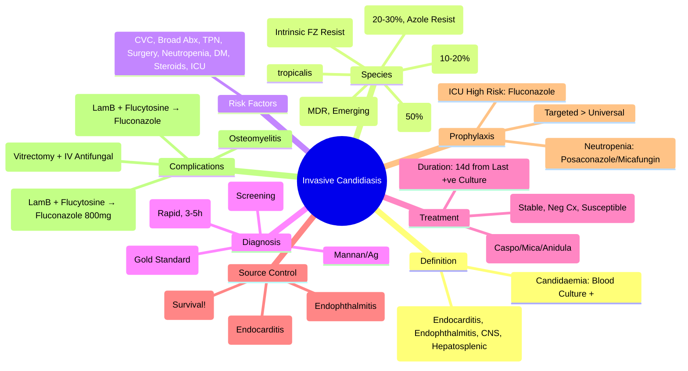

> [!info] **Davidson Ch 11 Alignment**: Infectious Disease → Specific Organism Groups → Fungi → Candida
> **FCPS/MRCP Focus**: Candidaemia, invasive candidiasis, echinocandins (1st line), azoles, source control (CVC removal), TEE, ophthalmology, prophylaxis in ICU

---

## 1. 🎯 Learning Objectives

- [ ] Define **Candidaemia**: Candida in Blood Culture; **Invasive Candidiasis**: Deep-seated Infection (Candidemia, Deep-Seated Candidiasis, Chronic Disseminated)
- [ ] Identify **Risk Factors**: ICU, CVC, Broad-Spectrum ABX, TPN, Surgery, Neutropenia, Diabetes, Corticosteroids
- [ ] Recognise **Species Distribution**: *C. albicans* (50%), *C. glabrata* (20-30%), *C. parapsilosis* (10-20%), *C. tropicalis*, *C. krusei*
- [ ] Diagnose: **Blood Culture** (Gold Standard), **T2Candida** (Rapid), **β-D-Glucan** (Screening), **Fundoscopy** (Ocular), **TEE** (Endocarditis)
- [ ] Manage: **Echinocandins (1st Line)** — Caspofungin/Micafungin/Anidulafungin; **Azoles** (Step-Down, Step-Up), **Source Control** (CVC Removal), **TEE**, **Fundoscopy**
- [ ] Apply **Prophylaxis**: Fluconazole in High-Risk ICU (Expected Stay >3d, High Candida Colonisation), Neutropenia

---

## 2. 📖 Definition & Epidemiology

| Term | Definition |
|------|------------|
| **Candidaemia** | **Candida spp. Isolated from Blood Culture** |
| **Invasive Candidiasis** | **Deep-Seated Infection**: Candidaemia, Deep-Seated Candidiasis (Hepatosplenic, Osteomyelitis, Endocarditis, Meningitis), Chronic Disseminated |
| **Incidence** | **~10-15/100,000** (Increasing); **ICU Mortality 30-40%** |
| **Species Distribution** | *C. albicans* (~50%), *C. glabrata* (20-30%), *C. parapsilosis* (10-20%), *C. tropicalis*, *C. krusei* |
| **Mortality** | **30-40%** (Attributable 20-30%) |

> [!tip] **Candidaemia = Blood Culture Positive**. **Invasive Candidiasis = Candidaemia + Deep-Seated Infection**. **C. albicans ~50%, C. glabrata 20-30% (Azole Resistance), C. krusei (Intrinsic Fluconazole Resistance)**.

---

## 3. 📖 Risk Factors

| Major Risk Factors | Population |
|--------------------|------------|
| **Central Venous Catheter (CVC)** | **Most Common** Source (Biofilm Formation) |
| **Broad-Spectrum Antibiotics** | Prolonged, Multiple Classes |
| **Total Parenteral Nutrition (TPN)** | Hyperglycaemia, Catheter |
| **Abdominal Surgery** | Gastrectomy, Whipple, Transplant, Perforation |
| **Neutropenia** | **ANC <500**, Prolonged (>7-10 Days) |
| **Diabetes Mellitus** | Poor Glycaemic Control |
| **Corticosteroids / Immunosuppression** | High-Dose, Prolonged |
| **ICU Stay** | Prolonged >7 Days, Mechanical Ventilation |
| **Dialysis / Renal Failure** | Catheters, Immune Dysfunction |
| **Age Extremes** | Neonates (VLBW), Elderly |
| **Malignancy / Chemotherapy** | Mucositis, Neutropenia, CVC |

---

## 4. 📖 Candida Species — Resistance Profiles

| Species | Frequency | Fluconazole | Voriconazole | Echinocandins | Key Features |
|---------|-----------|------------|--------------|---------------|--------------|
| **C. albicans** | ~50% | **Susceptible** | Susceptible | Susceptible | **Most Common**, Hyphae/Formation, Biofilm |
| **C. glabrata** | 20-30% | **Resistant (Dose-Dependent / Resistant)** | Variable (Often Resistant) | **Susceptible** | **Increasing**, **Azole Resistance Common**, Biofilm |
| **C. parapsilosis** | 10-20% | Susceptible | Susceptible | **Higher MICs** (Reduced Susceptibility) | **Catheter-Related**, Biofilm Former |
| **C. tropicalis** | 5-10% | Susceptible | Susceptible | Susceptible | Neutropenic Hosts |
| **C. krusei** | 1-5% | **Intrinsically Resistant** | Susceptible | Susceptible | **Intrinsic Fluconazole Resistance** |
| **C. auris** | Emerging | **Multidrug Resistant** | Often Resistant | Variable | **Outbreaks**, **Multidrug Resistant**, **Environmental Persistence** |

> [!warning] **C. glabrata**: **Fluconazole Resistance Common** → **Echinocandin 1st Line**. **C. krusei**: **Intrinsic Fluconazole Resistance** → **Avoid Fluconazole**. **C. auris**: **XDR**, **Infection Control Critical**.

---

## 5. 🔬 Diagnostic Workup

```mermaid
flowchart TD
    A[Suspected Invasive Candidiasis] --> B[**Blood Culture** (Gold Standard)]
    B --> C{**Positive?**}
    C -->|Yes| D[**Species ID + Susceptibility** (MALDI-TOF / PCR / Sequencing)]
    C -->|No (High Suspicion)| E[**Non-Culture Diagnostics**]
    E --> E1[**β-D-Glucan (BDG)** — Serum, High NPV, Serial]
    E --> E2[**T2Candida Panel (T2MR)** — Direct Blood, 3-5h, Species ID]
    E --> E3[**Mannan/Anti-Mannan Ab** — Serology]
    D & E --> F[**Source Control Assessment**]
    F --> F1[**CVC Removal** (Strongest Predictor of Survival)]
    F --> F2[**TEE (Endocarditis)** / **Fundoscopy (Ocular)** / **Imaging (CT/MRI)**]
```

### Key Diagnostic Tests

| Test | Sensitivity/Specificity | Role | Turnaround |
|------|------------------------|------|-----------|
| **Blood Culture** | **Gold Standard** (Sens 50-70% per Set) | **Definitive** (Species + Susceptibility) | 24-48h |
| **T2Candida Panel (T2MR)** | **Sens 85-95%, Spec >95%** | **Rapid Species ID** (Direct Blood) | **3-5 Hours** |
| **β-D-Glucan (BDG)** | **Sens 70-85%, Spec 75-85%** | **Screening / Serial Monitoring** (Trend) | Hours |
| **Mannan/Anti-Mannan Ag** | Sens 50-70%, Spec 80-90% | **Adjunct** | Hours |
| **Candida Score** | Clinical Score (Colonisation, Surgery, TPN, Sepsis, ICU) | **Risk Stratification** (Score ≥3 = High Risk) | Bedside |

> [!tip] **T2Candida = Rapid Species ID Direct from Blood (3-5h)**. **BDG = Screening/Monitoring (Serial Trends)**. **Blood Culture = Gold Standard but Slow**.

---

## 6. 💊 Management

### 1. Initial Antifungal Therapy (Empirical / Directed)

| Species / Clinical Scenario | 1st Line | Alternative | Duration |
|----------------------------|----------|-------------|----------|
| **Candidaemia / Invasive Candidiasis (Most)** | **Echinocandin** (Caspofungin 70mg LD → 50mg OD; **Micafungin 100mg OD**; **Anidulafungin 200mg LD → 100mg OD**) | **Liposomal Amphotericin B 3-5mg/kg** (If Echinocandin Contraindicated) | **14 Days** from Last Positive Blood Culture + Clinical Resolution |
| **C. krusei / C. glabrata (Fluconazole Resistant)** | **Echinocandin** (1st Line) | **Liposomal Amphotericin B** | **As Above** |
| **Step-Down Therapy** (Stable, Negative Blood Cultures, Susceptible Isolate) | **Fluconazole 400-800mg OD** (C. albicans, C. tropicalis, C. parapsilosis) | **Voriconazole** (If Fluconazole Resistance) | **Complete 14 Days Total** |
| **Neonates** | **Liposomal Amphotericin B 3-5mg/kg** OR **Micafungin** (Dose by Weight) | **Fluconazole** (If Susceptible) | **14 Days** |

> [!tip] **Echinocandins = 1st Line for Candidaemia/Invasive Candidiasis** (Caspofungin/Micafungin/Anidulafungin). **Step-Down to Fluconazole** ONLY if: Stable, Negative Blood Cultures, Susceptible Isolate (C. albicans, tropicalis, parapsilosis).

### Source Control (Critical)

| Intervention | Impact |
|-------------|--------|
| **CVC Removal** | **Strongest Predictor of Survival**; **Remove ASAP** (Within 24h of Positive Culture) |
| **Infected Device Removal** (Pacemaker, Prosthetic Joint, Drain) | Essential for Cure |
| **Drainage** (Abscess, Pleural Empyema, Peritonitis) | Source Control Essential |
| **Ophthalmology Review** | **All Candidaemia** → **Fundoscopy** (Endophthalmitis 5-15%) |
| **Echocardiography** (TEE Preferred) | **All Candidaemia** → Rule Out Endocarditis (5-10%) |

> [!warning] **CVC Removal = Single Strongest Predictor of Survival** in Candidaemia. **Do Not Delay**.

---

## 7. 🩺 Complications & Organ-Specific Management

| Complication | Management |
|--------------|------------|
| **Endocarditis** | **Liposomal Ampho B 5mg/kg + Flucytosine 25mg/kg Q6H** → Step-Down Fluconazole; **Valve Surgery** Usually Required |
| **Endophthalmitis** | **Vitrectomy + Intravitreal Amphotericin/Voriconazole** + **Systemic Echinocandin/Fluconazole** |
| **CNS (Meningitis/Abscess)** | **Liposomal Ampho B 5mg/kg + Flucytosine 25mg/kg Q6H** → **Step-Down Fluconazole 800mg OD** |
| **Hepatosplenic Candidiasis** (Chronic Disseminated) | **Echinocandin / Fluconazole** (Months); **Immunosuppression Reduction** |
| **Osteomyelitis / Septic Arthritis** | **Echinocandin / Fluconazole** + **Surgical Debridement** |

---

## 8. 🛡️ Prophylaxis

| Population | Agent | Duration | Evidence |
|------------|-------|----------|----------|
| **ICU (High Risk)** | **Fluconazole 400mg OD** | **Until ICU Discharge / Day 14** | **Cochrane: ↓ Invasive Candidiasis, No Mortality Benefit** |
| **Selective (High Candida Colonisation + Risk Factors)** | Fluconazole 400mg OD / Micafungin 50mg OD | ICU Stay | Targeted Better Than Universal |
| **Neutropenia (Prolonged >7d, ANC<100)** | **Posaconazole / Fluconazole / Micafungin** | **Until Neutrophil Recovery** | **↓ Invasive Fungal Infections** |
| **Stem Cell Transplant** | **Posaconazole / Fluconazole / Micafungin** | **Engraftment + 30-100d** | **GVHD Prophylaxis Protocol** |
| **Solid Organ Transplant (Liver/Intestinal)** | **Fluconazole / Micafungin** | **4-12 Weeks** | **High-Risk Period** |

> [!warning] **Universal Prophylaxis NOT Recommended** — **Targeted/Selective** to High-Risk Only. **Stewardship: Avoid Unnecessary Azole Exposure** (Resistance Selection).

---

## 9. 🔄 Differential Diagnosis

| Condition | Differentiating Features |
|-----------|--------------------------|
| **Candidaemia vs Contamination** | **Multiple Positive Sets**, **Clinical Signs**, **Risk Factors**, **Persistent Positivity** |
| **Candidaemia vs Other Fungaemia** | **Species ID** (Cryptococcus, Aspergillus, Mucormycosis, Histoplasma) |
| **Candidaemia vs Bacteriemia** | **Gram Stain (Yeast vs Bacteria)**, **Culture**, **Clinical Context** |
| **C. glabrata vs C. albicans** | **Fluconazole Resistance**, **Higher Mortality**, **Elderly, ICU** |
| **C. auris vs Other Candida** | **MDR**, **Outbreak Setting**, **Environmental Persistence**, **Infection Control** |

---

## 10. 💡 FCPS/MRCP High-Yield Summary

| Topic | Key Point |
|-------|-----------|
| **Definition** | **Candidaemia = Blood Culture +**; **Invasive Candidiasis = Candidaemia + Deep-Seated** |
| **Species** | **C. albicans (50%)**, **C. glabrata (20-30%, Azole Resistant)**, **C. parapsilosis (10-20%)**, **C. krusei (Intrinsic Fluconazole Resistance)** |
| **1st Line Rx** | **Echinocandin** (Caspofungin/Micafungin/Anidulafungin) — **All Species, Including Resistant** |
| **Step-Down** | **Fluconazole 400-800mg OD** — **Only if Stable, Negative Cultures, Susceptible (C. albicans, tropicalis, parapsilosis)** |
| **Source Control** | **CVC Removal = Survival Predictor**; **TEE, Fundoscopy Mandatory** |
| **Prophylaxis** | **Fluconazole/ICU High-Risk**; **Targeted > Universal**; **Posaconazole/Micafungin in Neutropenia** |
| **C. krusei / C. glabrata** | **Intrinsic / Acquired Fluconazole Resistance** → **Echinocandin 1st Line** |
| **C. auris** | **MDR, Outbreak Risk, IPC Critical** |
| **Duration** | **14 Days from Last Positive Culture + Clinical Resolution** |

---

## 11. ❓ Viva Questions

1. **What is the first-line treatment for candidaemia?**
   - **Echinocandin** (Caspofungin 70mg LD → 50mg OD / Micafungin 100mg OD / Anidulafungin 200mg LD → 100mg OD).

2. **Why are echinocandins preferred over fluconazole for initial therapy?**
   - **Broad Spectrum (Incl. C. glabrata, C. krusei)**, **Fungicidal**, **Less Drug Interactions**, **Less Hepatotoxicity**, **Superior Outcomes in RCTs**.

3. **When can you step down from echinocandin to fluconazole?**
   - **Clinically Stable**, **Blood Cultures Negative ×2**, **Isolate Susceptible to Fluconazole** (C. albicans, C. tropicalis, C. parapsilosis).

4. **What is the single most important intervention for survival in candidaemia?**
   - **Central Venous Catheter Removal** (Within 24h of Positive Culture).

5. **Which Candida species are intrinsically resistant to fluconazole?**
   - **C. krusei** (Intrinsic Resistance); **C. glabrata** (Dose-Dependent/High-Level Resistance Common).

5. **What is the recommended duration of therapy for candidaemia?**
   - **14 Days from Last Positive Blood Culture + Clinical Resolution**.

6. **What is the role of β-D-Glucan in candidaemia?**
   - **Screening / Serial Monitoring** (High NPV); Not Diagnostic Alone.

6. **How do you manage C. auris candidaemia?**
   - **Infection Control Paramount (Isolation, Contact Precautions, Environmental Cleaning)**; **Echinocandin 1st Line**; **Susceptibility-Guided**; **Infection Control Team Involvement**.

7. **What is the role of Fluconazole step-down therapy?**
   - **After Clinical Stability + Negative Cultures + Susceptible Isolate**; **Cost-Effective, Oral Bioavailability**.

7. **What are the key complications of candidaemia requiring specific management?**
   - **Endocarditis (TEE + Surgery), Endophthalmitis (Fundoscopy + Vitrectomy), CNS (LAmB + Flucytosine), Hepatosplenic (Prolonged Therapy)**.

8. **How do you screen for invasive candidiasis in ICU?**
   - **Candida Score (≥3 = High Risk)** → **Empirical Echinocandin**; **Serial β-D-Glucan / T2Candida** (If Available).

10. **What is the management of C. auris candidaemia?**
    - **Strict Isolation, Contact Precautions, Environmental Disinfection**; **Echinocandin 1st Line**; **Susceptibility Testing Critical**; **Infection Control Team Involvement**.

---

## 12. 🧠 Confusions & Mnemonics

| Confusion | Clarification |
|-----------|---------------|
| **Fluconazole vs Echinocandin 1st Line** | **Echinocandin 1st Line** (Broad, Cidal, Resistant Species); **Fluconazole = Step-Down Only** |
| **C. glabrata vs C. albicans** | **C. glabrata**: Azole Resistance, Higher Mortality, Elderly/ICU; **C. albicans**: Most Common, Fluconazole Susceptible |
| **C. krusei vs C. glabrata** | **C. krusei = Intrinsic Fluconazole Resistance**; **C. glabrata = Dose-Dependent/Acquired Resistance** |
| **C. auris vs C. haemulonii** | **C. auris = MDR, Outbreaks, Identification by MALDI-TOF/PCR** |
| **Fluconazole Step-Down Criteria** | **Stable + Negative Blood Cultures + Fluconazole-Susceptible Isolate** |

| Mnemonic | Meaning |
|----------|---------|
| **"Echinocandin = 1st Line for Candidaemia"** | 1st Line Therapy |
| **"CVC Out = Survival Up"** | Source Control |
| **"Krusei = Fluconazole Resistant (Intrinsic)"** | Intrinsic Resistance |
| **"Glabrata = Azole Resistant (Often)"** | Acquired Resistance |
| **"Fundoscopy + TEE = Mandatory"** | Complications Screening |
| **"Duration = 14d from Last Positive Culture"** | Duration Rule |

---

## 13. 🗺️ Mind Map



---

## 14. 📋 One-Page Revision Card

| **INVASIVE CANDIDIASIS – FCPS/MRCP REVISION CARD** |
|------------------------------------------------------|
| **Definition**: **Candidaemia = Blood Culture +**; **Invasive = Candidaemia + Deep-Seated** |
| **Species**: **C. albicans 50%**, **glabrata 20-30% (Azole Resist)**, **krusei (Intrinsic FZ Resist)** |
| **1st Line**: **Echinocandin** (Caspo/Mica/Anidula) — **All Species, Cidal, Broad** |
| **Step-Down**: **Fluconazole 400-800mg** — **Stable + Neg Cx + Susceptible** (Albicans/Tropicalis/Parapsilosis) |
| **CVC Removal** = **#1 Survival Predictor** (Within 24h) |
| **Screening**: **TEE (Endocarditis) + Fundoscopy (Endophthalmitis) Mandatory** |
| **Duration**: **14d from Last +ve Culture + Clinical Resolution** |
| **C. krusei/glabrata** = **FZ Resistant** → **Echinocandin Only** |
| **Prophylaxis**: ICU High-Risk = Fluconazole; Neutropenia = Posaconazole/Micafungin |
| **C. auris** = MDR, Outbreak, IPC Critical |
| **Duration Rule**: 14d from Last +ve BC + Clinical Resolution |

---

## 15. 📅 Spaced Repetition Tracker

| Review | Date | Score (1-5) | Next Review |
|--------|------|-------------|-------------|
| Day 1 | 2025-06-17 | | 2025-06-18 |
| Day 3 | | | |
| Day 7 | | | |
| Day 15 | | | |
| Day 30 | | | |

---

## 16. 🎯 Must Know / Should Know / Nice to Know

| Level | Content |
|-------|---------|
| **Must Know** | Echinocandin 1st line, CVC removal mandatory, Fluconazole step-down criteria, Species resistance patterns (glabrata/krusei), CVC removal = survival, TEE/fundoscopy mandatory, 14d from last positive culture, C. krusei intrinsic fluconazole resistance |
| **Should Know** | Echinocandin pharmacokinetics (Caspofungin hepatic, Micafungin/Anidulafungin non-hepatic), Liposomal Amphotericin B alternative, Neonatal dosing, Hepatosplenic candidiasis management, Endophthalmitis management (vitrectomy), C. auris infection control, β-D-Glucan/T2Candida utility, Fluconazole 800mg for CNS |
| **Nice to Know** | Echinocandin pharmacodynamics (concentration-dependent), C. auris molecular mechanisms, Novel antifungals (ibrexafungerp, fosmanogepix, rezafungin), Combination therapy evidence, Diagnostic stewardship (T2Candida cost-effectiveness), Candida biofilms, Echinocandin resistance mechanisms (FKS mutations), Immunopathogenesis of candidiasis |

---

## 17. ✅ Self-Test Scorecard

| Section | Score (0-10) | Notes |
|---------|--------------|-------|
| Species & Resistance Patterns | | |
| 1st Line Therapy (Echinocandins) | | |
| Step-Down Criteria | | |
| Source Control (CVC Removal) | | |
| Complications (Endocarditis, Endophthalmitis, CNS) | | |
| Prophylaxis Strategies | | |
| Viva Questions | | |

---

## 18. 🔗 Local Navigation

- **Previous**: [[Chlamydial Pneumonia & Psittacosis]]
- **Next**: [[Cryptococcal Meningitis]]
- **Section Hub**: [[Infectious Disease MOC]]
- **MOC**: [[Infectious Disease MOC]]
- **Template**: [[../Templates/Hematology Topic Template]]

---

*Generated for FCPS/MRCP exam preparation. Based on Davidson Medicine 24th Ed Chapter 11.*