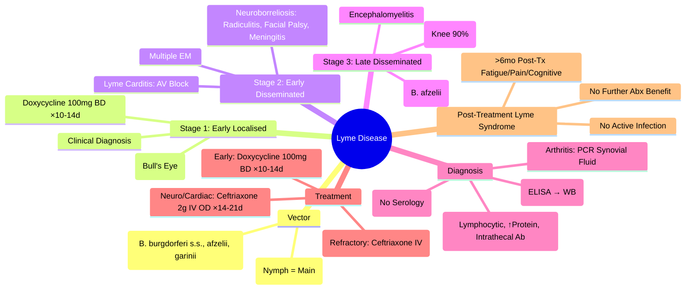

---
tags: [medicine, davidson, infectious-disease, lyme-disease, borrelia, tick-borne, fcps, mrcp]
davidson_chapter: Chapter 11: Infectious disease
status: full-fcps-mrcp-note
priority: high
exam_relevance: "FCPS: High-yield | MRCP: Core | Erythema migrans, stages, serology, CSF, doxycycline/ceftriaxone, post-treatment Lyme syndrome"
see_also: "[[Leptospirosis]], [[Rickettsial Infections]], [[Fever in Returned Traveller & FUO]], [[Viral Encephalitis and Meningitis]]"
created: 2025-06-17
modified: 2025-06-17
---

# Lyme Disease (Lyme Borreliosis)

> [!info] **Davidson Ch 11 Alignment**: Infectious Disease → Specific Organism Groups → Spirochaetes → Borrelia burgdorferi sensu lato
> **FCPS/MRCP Focus**: Erythema migrans, stages, two-tier serology, CSF analysis, doxycycline/ceftriaxone, post-treatment Lyme syndrome, Lyme carditis/neuroborreliosis

---

## 🎯 Learning Objectives

- [ ] Identify **Transmission**: *Ixodes* Tick Bite (Nymph → Larva → Adult), *B. burgdorferi* sensu lato (B. burgdorferi s.s., *B. afzelii*, *B. garinii*, *B. bavariensis*)
- [ ] Recognise **Stage 1 (Early Localised)**: **Erythema Migrans (EM)** — Expanding Annular Rash, "Bull's Eye"
- [ ] Recognise **Stage 2 (Early Disseminated)**: Multiple EM, **Neuroborreliosis** (Radiculoneuritis, Facial Palsy, Meningitis), **Lyme Carditis** (AV Block)
- [ ] Recognise **Stage 3 (Late Disseminated)**: **Lyme Arthritis** (Large Joint, Knee), **Acrodermatitis Chronica Atrophicans** (ACA), **Encephalomyelitis**
- [ ] Diagnose: **Clinical (EM = Clinical Diagnosis)**, **Two-Tier Serology** (ELISA → Western Blot), **CSF Analysis** (Neuroborreliosis), **PCR** (Joint Fluid/CSF)
- [ ] Manage: **Doxycycline** (Early/Non-CNS), **Ceftriaxone IV** (CNS/Carditis/Arthritis), **Post-Treatment Lyme Syndrome** (Symptomatic Management)

---

## 📖 Definition & Epidemiology

| Feature | Details |
|---------|---------|
| **Causative Agent** | **Borrelia burgdorferi sensu lato** Complex: *B. burgdorferi* s.s. (USA), *B. afzelii* (Europe/Asia), *B. garinii* (Europe/Asia), *B. bavariensis* |
| **Vector** | **Ixodes Ticks**: *I. scapularis* (NE USA), *I. pacificus* (West USA), *I. ricinus* (Europe), *I. persulcatus* (Asia) |
| **Reservoir** | **Small Mammals** (White-Footed Mouse, Rodents), Birds, Deer (Amplification Host) |
| **Transmission** | **Ixodes Tick Bite** (Nymph = Primary Vector, Spring/Summer); **Attachment ≥36-48h** for Transmission |
| **Geography** | **Endemic**: NE/Mid-Atlantic/Upper Midwest USA, Europe (Scandinavia, Germany, Austria, Eastern Europe), Asia |
| **Incubation** | **3-30 Days** (Median 7-10 Days) for EM; **Weeks-Months** for Disseminated |
| **Seasonality** | **Spring/Summer** (Nymphal Activity Peak May-July) |

> [!tip] **Lyme = Tick Bite + Erythema Migrans + Endemic Area**. **Transmission Risk >36-48h Attachment**. **Not Transmitted Person-to-Person**.

---

## 📖 Clinical Stages

### Stage 1: Early Localised (Days-Weeks)

| Feature | Details |
|---------|---------|
| **Erythema Migrans (EM)** | **Pathognomonic** — **Expanding Annular Erythematous Rash** (≥5cm), Central Clearing ("Bull's Eye") in 20-30%, **Expands ~1-2cm/Day**, **Non-Pruritic**, **Non-Painful** |
| **Location** | **Bite Site** (Often Groin, Axilla, Popliteal Fossa, Trunk, Behind Ear) |
| **Systemic Symptoms** | Low-Grade Fever, Fatigue, Myalgia, Arthralgia, Headache, Lymphadenopathy (Regional) |
| **Diagnosis** | **Clinical** (EM in Endemic Area + Exposure) — **No Serology Needed** |

> [!tip] **EM = Clinical Diagnosis**. **Do Not Order Serology for Solitary EM** (False Negative Early). **Treat Empirically**.

### Stage 2: Early Disseminated (Weeks-Months)

| Manifestation | Frequency | Key Features |
|---------------|-----------|--------------|
| **Multiple EM Lesions** | 20-50% | Disseminated Haematogenous Spread |
| **Neuroborreliosis** | 10-15% | **Radiculoneuritis** (Radicular Pain, Paresis), **Facial Nerve Palsy** (Bilateral ~25%), **Lymphocytic Meningitis** (Headache, Neck Stiffness, Photophobia) |
| **Lyme Carditis** | 1-5% | **AV Block** (1st→2nd→3rd Degree), **Myopericarditis**, **Palpitations, Syncope**, **ECG: PR Prolongation, AV Block** |
| **Musculoskeletal** | Common | Migratory Arthralgia/Myalgia, Transient Joint Swelling |
| **Ocular** | Rare | Conjunctivitis, Uveitis, Keratitis, Optic Neuritis |
| **Borrelial Lymphocytoma** | Rare (Europe) | Bluish-Red Nodule (Earlobe, Nipple, Scrotum) — *B. afzelii* |

### Stage 3: Late Disseminated (Months-Years)

| Manifestation | Features |
|---------------|----------|
| **Lyme Arthritis** | **Large Joint (Knee 90%)**, **Recurrent/Oligoarticular**, **Effusion**, **Minimal Constitutional Symptoms**, **PCR+ in Synovial Fluid** |
| **Acrodermatitis Chronica Atrophicans (ACA)** | **Late *B. afzelii* Infection**, **Progressive Atrophic Skin Changes** (Distal Extremities), **Peripheral Neuropathy**, **Fibrosis** |
| **Encephalomyelitis** | Rare, **Cognitive Impairment, Spastic Paresis, Ataxia**, **CSF: Lymphocytic Pleocytosis, Intrathecal Antibody** |

---

## 🔬 Diagnostic Workup

```mermaid
flowchart TD
    A[Suspected Lyme Disease] --> B{**Clinical Presentation**}
    B -->|**Solitary EM**| C[**Clinical Diagnosis** → **Treat Empirically** (No Serology)]
    B -->|**Disseminated / Late**| D[**Serology: Two-Tier Testing**]
    D --> E1[**Step 1: ELISA / EIA** (Screening — High Sensitivity)]
    E1 --> F{**Positive/Equivocal?**}
    F -->|Yes| G[**Step 2: Western Blot** (Confirmatory — Specificity)]
    F -->|No| H[**Negative** — Consider Other Dx / Early Infection]
    G --> I[**Interpretation**: IgM ≥2/3 Bands (Early), IgG ≥5/10 Bands (Late)]
    I --> J[**Positive Two-Tier = Confirmed**]
    B -->|**Neuroborreliosis Suspected**| K[**LP: CSF Analysis (Cell Count, Protein, Glucose, Intrathecal Ab Index)**]
    B -->|**Lyme Arthritis**| L[**Joint Aspiration: PCR (High Sens), Culture (Low)**]
    B -->|**Lyme Carditis**| M[**ECG (AV Block), Echo, Troponin**]
```

### Serology — Two-Tier Testing (CDC/IDSA)

| Step | Test | Interpretation |
|------|------|----------------|
| **Step 1** | **ELISA / EIA / CIA** (Whole-Cell Sonicate or Peptide) | **Negative = No Further Testing** (Unless Early Infection — Repeat 2-4 Weeks) |
| **Step 2** | **Western Blot (IgM + IgG)** | **IgM Positive: ≥2 of 3 Specific Bands** (23, 39, 41 kDa) — *Early (<4 Weeks)*<br>**IgG Positive: ≥5 of 10 Specific Bands** (18, 21, 28, 30, 39, 41, 45, 58, 66, 93 kDa) — *Late (>4 Weeks)* |

> [!warning] **IgM Western Blot Only Valid <4 Weeks**. **Do Not Use IgM Alone for Late Disease** (False Positive). **IgG Western Blot Required for Late Disease**.

### CSF Analysis (Neuroborreliosis)

| Parameter | Neuroborreliosis |
|-----------|------------------|
| **Opening Pressure** | Normal / Mildly Elevated |
| **WBC** | **Lymphocytic Pleocytosis** (50-500/µL) |
| **Protein** | **Elevated** (50-200 mg/dL) |
| **Glucose** | Normal / Mildly Low |
| **Intrathecal Antibody Index** | **AI = (CSF Ab/Serum Ab) / (CSF Albumin/Serum Albumin) >1.5** (Positive) |
| **CSF PCR** | **Low Sensitivity** (~10-30%) |
| **Oligoclonal Bands** | Often Present (Not Specific) |

---

## 💊 Management

### Antibiotic Regimens (Adults)

| Clinical Syndrome | 1st Line | Alternative (Penicillin Allergy) | Duration |
|-------------------|----------|----------------------------------|----------|
| **Erythema Migrans (Early Localised)** | **Doxycycline 100mg PO BD** | **Amoxicillin 500mg TDS** / **Cefuroxime Axetil 500mg BD** | **10-14 Days** |
| **Early Disseminated (No CNS/Carditis)** | **Doxycycline 100mg BD PO** | **Amoxicillin 500mg TDS PO** / **Cefuroxime 500mg BD PO** | **14-21 Days** |
| **Neuroborreliosis (Meningitis/Radiculitis/Facial Palsy)** | **Ceftriaxone 2g IV OD** (or Cefotaxime 2g Q6H) | **Penicillin G 4MU IV Q4H** | **14-21 Days** |
| **Lyme Carditis (AV Block)** | **Ceftriaxone 2g IV OD** (Monitored Setting) | **Penicillin G 4MU IV Q4H** | **14-21 Days** (IV → PO Switch When Stable) |
| **Lyme Arthritis** | **Doxycycline 100mg BD PO** (28 Days) | **Amoxicillin 500mg TDS PO** / **Ceftriaxone 2g IV OD** (If Refractory) | **28 Days** |
| **Acrodermatitis Chronica Atrophicans** | **Doxycycline 100mg BD PO** / **Amoxicillin 500mg TDS** | **Ceftriaxone 2g IV OD** | **21-28 Days** |

> [!warning] **Doxycycline Contraindicated**: **Pregnancy, Children <8 Years** — **Use Amoxicillin / Cefuroxime / Ceftriaxone**.

> [!tip] **No Proven Benefit of Extended Therapy** (>28 Days for Arthritis). **Post-Treatment Lyme Syndrome (PTLS)** = Persistent Symptoms >6 Months Post-Treatment — **Symptomatic Management, No Further Antibiotics**.

---

## 🔬 Diagnostic Algorithms

### Erythema Migrans → **Clinical Diagnosis** → **Treat Empirically** (No Serology)

### Disseminated Disease → **Two-Tier Serology** (ELISA → Western Blot)

### Neuroborreliosis → **LP + CSF Analysis + Intrathecal Antibody Index**

### Lyme Arthritis → **Joint Aspiration (PCR High Sens, Culture Low Sens)** + **Serology**

### Lyme Carditis → **ECG (AV Block), Troponin, Echo** → **Admit, Monitor, Ceftriaxone IV**

---

## 🔬 Laboratory Findings

| Test | Findings |
|-----------|----------|
| **CBC** | Normal / Mild Leukocytosis / Eosinophilia (Rare) |
| **ESR/CRP** | **Elevated** (Acute Phase) |
| **LFT/Renal** | Normal |
| **ECG** | **PR Prolongation / AV Block** (Carditis) |
| **Synovial Fluid (Arthritis)** | **Inflammatory** (WBC 25,000-100,000, Neutrophilic), **PCR Positive**, **Culture Rarely Positive** |
| **CSF** | **Lymphocytic Pleocytosis**, **Elevated Protein**, **Normal Glucose**, **Intrathecal Ab Index >1.5** |
| **Serology** | **Two-Tier: ELISA → Western Blot** (IgM <4wks, IgG >4wks) |

---

## 🔄 Differential Diagnosis

| Condition | Differentiating Features |
|-----------|--------------------------|
| **Southern Tick-Associated Rash Illness (STARI)** | **EM-like Rash**, **Lone Star Tick (Amblyomma americanum)**, **No B. burgdorferi**, Milder, Self-Limited |
| **Cellulitis** | **Rapidly Spreading**, **Hot/Tender**, **No Central Clearing**, **No Tick Bite History** |
| **Erythema Multiforme** | **Target Lesions**, **Mucosal Involvement**, **Drug/Infection Trigger** |
| **Fibromyalgia / CFS** | **Chronic Widespread Pain**, **No Objective Inflammatory Signs**, **Negative Serology** |
| **Rheumatoid Arthritis** | **Symmetrical Polyarthritis**, **RF/CCP+**, **Morning Stiffness >1h** |
| **Viral Meningitis** | **Acute Onset**, **CSF Lymphocytic**, **Negative Lyme Serology/PCR** |
| **Bell's Palsy (Idiopathic)** | **Unilateral**, **No Other Neurological Signs**, **Negative Lyme Serology** |

---

## 💡 FCPS/MRCP High-Yield Summary

| Topic | Key Point |
|-------|-----------|
| **Transmission** | **Ixodes Tick Bite**, **≥36-48h Attachment** for Transmission; **Nymph = Primary Vector** |
| **Stage 1 (EM)** | **Clinical Diagnosis**, **No Serology**, **Doxycycline 100mg BD ×10-14d** |
| **Stage 2 (Disseminated)** | **Multiple EM, Neuroborreliosis (Radiculitis, Facial Palsy, Meningitis), Carditis (AV Block)** |
| **Stage 3 (Late)** | **Arthritis (Knee)**, **ACA (B. afzelii)**, **Encephalomyelitis** |
| **Serology** | **Two-Tier: ELISA → Western Blot**; **IgM <4wks, IgG >4wks**; **IgM Alone Not Diagnostic for Late Disease** |
| **Neuroborreliosis** | **CSF: Lymphocytic Pleocytosis, ↑Protein, Normal Glucose, Intrathecal Ab Index >1.5** |
| **Carditis** | **AV Block (1st→3rd Degree)**, **Ceftriaxone IV**, **Monitor in ICU** |
| **Arthritis** | **Knee (90%)**, **PCR+ Synovial Fluid**, **Doxy 28d / Ceftriaxone IV if Refractory** |
| **Treatment** | **Doxycycline 100mg BD PO** (Early/Disseminated, Non-CNS); **Ceftriaxone 2g IV OD** (CNS/Carditis/Refractory Arthritis) |
| **Post-Treatment Lyme Syndrome** | **Symptoms >6mo Post-Tx**, **No Active Infection**, **No Benefit from Further Abx** |

---

## ❓ Viva Questions

1. **What is the typical appearance of Erythema Migrans?**
   - **Expanding Annular Erythematous Rash** (≥5cm), **Central Clearing ("Bull's Eye") in 20-30%**, **Expands 1-2cm/Day**, Non-Pruritic/Non-Painful.

2. **When is serology indicated in Lyme disease?**
   - **Not for Solitary EM** (Clinical Diagnosis). **Indicated for Disseminated/Late Disease** (Multiple EM, Neuro/Cardiac/Arthritis).

3. **Describe the Two-Tier Serology for Lyme disease.**
   - **Step 1: ELISA/EIA (Sensitive Screening)** → **If Positive/Equivocal → Step 2: Western Blot**; **IgM ≥2/3 Bands (Early <4wks); IgG ≥5/10 Bands (Late >4wks)**.

4. **Why is IgM Western Blot not used for late Lyme disease?**
   - **IgM Persists/False Positives**; **False Positive Rate High in Late Disease**; **IgG Western Blot Standard for Late Disease**.

6. **What is the treatment for Erythema Migrans?**
   - **Doxycycline 100mg PO BD × 10-14 Days**; **Alternative: Amoxicillin 500mg TDS / Cefuroxime 500mg BD**.

7. **How do you treat Neuroborreliosis?**
   - **Ceftriaxone 2g IV OD × 14-21 Days** (or Penicillin G 4MU IV Q4H).

8. **What are the ECG findings in Lyme Carditis?**
   - **PR Prolongation → 1st Degree AV Block → 2nd Degree (Mobitz I/II) → 3rd Degree (Complete AV Block)**; **Monitor in ICU**.

8. **What is the treatment for Lyme Arthritis?**
   - **Doxycycline 100mg BD PO × 28 Days** (1st Line); **Refractory: Ceftriaxone 2g IV OD × 2-4 Weeks**.

9. **What is Post-Treatment Lyme Syndrome (PTLS)?**
   - **Persistent Symptoms (Fatigue, Pain, Cognitive) >6 Months Post-Treatment** — **No Active Infection, No Benefit from Further Antibiotics**, **Symptomatic Management**.

10. **How do you diagnose Lyme Carditis?**
    - **Clinical (AV Block in Endemic Area + Exposure) + ECG (AV Block) + Positive Serology** → **Admit, Continuous ECG Monitoring, Ceftriaxone IV**.

---

## 🧠 Confusions & Mnemonics

| Confusion | Clarification |
|-----------|---------------|
| **Lyme vs STARI** | **STARI = Lone Star Tick (Amblyomma), Southern US, Milder, No B. burgdorferi, Self-Limited** |
| **EM vs Cellulitis** | **EM = Expanding, Central Clearing, Non-Tender, No Heat/Purulence**; **Cellulitis = Spreading, Hot, Tender, Purulent** |
| **IgM vs IgG Western Blot** | **IgM: Early (<4wks), ≥2 Bands**; **IgG: Late (>4wks), ≥5 Bands**; **IgM Alone Not Diagnostic Late** |
| **Lyme vs Viral Meningitis** | **Lymphocytic CSF Both**; **Lyme = Intrathecal Ab+, Endemic Exposure, Radiculitis/Facial Palsy** |
| **Lyme Carditis vs Heart Block** | **Lyme = Young, Endemic Exposure, Lyme Serology+**; **Other = Ischaemic, Drug, Idiopathic** |

| Mnemonic | Meaning |
|----------|---------|
| **"Lyme = Tick (Ixodes) + Bull's Eye Rash"** | Transmission + EM |
| **"Stages: 1=EM, 2=Disseminated (Neuro/Cardiac), 3=Late (Arthritis/ACA)"** | Stages |
| **"Doxy for Early, Ceftriaxone for CNS/Heart/Arthritis"** | Treatment |
| **"Western Blot: IgM 2/3 Bands (<4wks), IgG 5/10 Bands (>4wks)"** | Serology Interpretation |
| **"Carditis = AV Block → Ceftriaxone IV + ICU Monitoring"** | Lyme Carditis |
| **"PTLS = >6mo Post-Tx Symptoms, No Active Infection, No More Abx"** | PTLS |

---

## 🗺️ Mind Map



---

## 📋 One-Page Revision Card

| **LYME DISEASE – FCPS/MRCP REVISION CARD** |
|---------------------------------------------|
| **Vector**: *Ixodes* Tick (Nymph), **≥36h Attachment** for Transmission |
| **Stage 1**: **Erythema Migrans** (≥5cm, Bull's Eye) → **Clinical Dx**, **Doxy 100mg BD ×10-14d** |
| **Stage 2**: Multiple EM, **Neuroborreliosis** (Radiculitis, Facial Palsy, Meningitis), **Carditis (AV Block)** |
| **Stage 3**: **Arthritis (Knee 90%)**, **ACA** (*B. afzelii*), **Encephalomyelitis** |
| **Serology**: **2-Tier** (ELISA → WB); **IgM ≥2/3 Bands (<4wks)**, **IgG ≥5/10 Bands (>4wks)** |
| **Neuroborreliosis**: CSF Lymphocytic Pleocytosis, **Intratheal Ab Index >1.5** |
| **Carditis**: **AV Block (1°→2°→3°)** → **Ceftriaxone 2g IV OD + ICU Monitoring** |
| **Arthritis**: **Knee 90%**, **PCR+ Synovial Fluid**, **Doxy 100mg BD ×28d** (Refractory: Ceftriaxone IV) |
| **Treatment**: **Early = Doxy 100mg BD**; **CNS/Heart = Ceftriaxone 2g IV** |
| **PTLS**: >6mo Post-Tx Symptoms, **No Active Infection**, **No Further Abx** |

---

## 📅 Spaced Repetition Tracker

| Review | Date | Score (1-5) | Next Review |
|--------|------|-------------|-------------|
| Day 1 | 2025-06-17 | | 2025-06-18 |
| Day 3 | | | |
| Day 7 | | | |
| Day 15 | | | |
| Day 30 | | | |

---

## 🎯 Must Know / Should Know / Nice to Know

| Level | Content |
|-------|---------|
| **Must Know** | EM = Clinical Dx, Two-Tier Serology (IgM <4wks, IgG >4wks), Neuroborreliosis CSF findings, Carditis = AV block + Ceftriaxone IV, Lyme arthritis treatment, Post-treatment Lyme syndrome, Tick bite prophylaxis |
| **Should Know** | Borrelia species differences (B. burgdorferi s.s. vs afzelii vs garinii), STARI differentiation, Lyme carditis monitoring/prognosis, Acrodermatitis chronica atrophicans, PCR utility in synovial fluid/CSF, Pregnancy management (Amoxicillin/Cefuroxime), Breastfeeding safety, Co-infections (Anaplasma, Babesia) |
| **Nice to Know** | Borrelia genomics/ospeciation, VlsE antigenic variation, Xenodiagnosis, Persistence mechanisms, Post-treatment Lyme syndrome pathophysiology, Vaccine development (VLA15), Climate change impact on tick distribution, Cost-effectiveness of testing, One Health approach |

---

## ✅ Self-Test Scorecard

| Section | Score (0-10) | Notes |
|---------|--------------|-------|
| Stages & Clinical Features | | |
| Erythema Migrans / Clinical Diagnosis | | |
| Two-Tier Serology Interpretation | | |
| Neuroborreliosis / CSF | | |
| Lyme Carditis / AV Block | | |
| Lyme Arthritis | | |
| Treatment Protocols | | |
| Post-Treatment Lyme Syndrome | | |
| Viva Questions | | |

---

## 🔗 Local Navigation

- **Previous**: [[Leptospirosis]]
- **Next**: [[Rickettsial Infections]]
- **Section Hub**: [[Infectious Disease MOC]]
- **MOC**: [[Infectious Disease MOC]]
- **Template**: [[../Templates/Hematology Topic Template]]

---

*Generated for FCPS/MRCP exam preparation. Based on Davidson Medicine 24th Ed Chapter 11.*