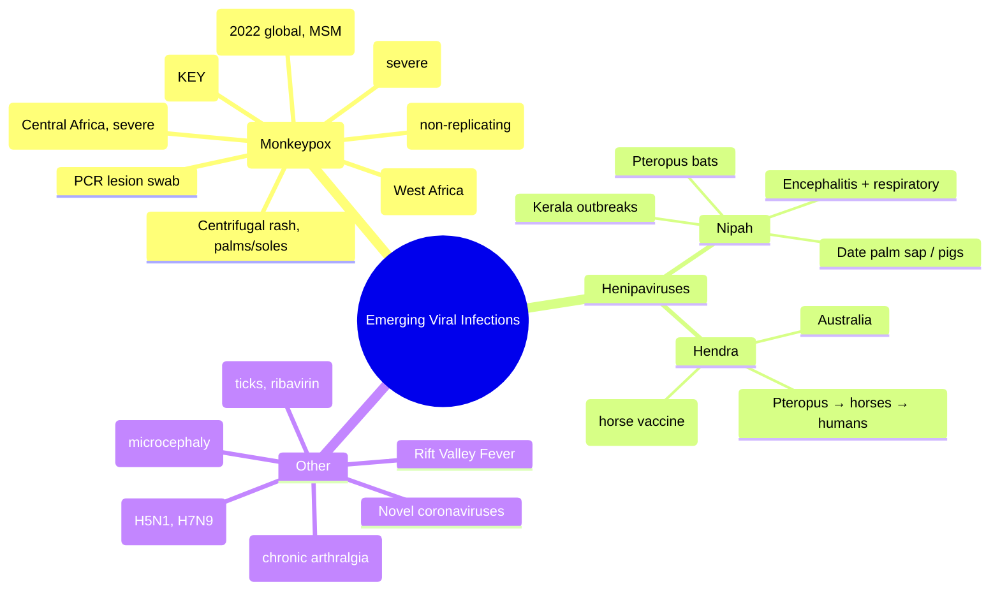

---
tags: [medicine, davidson, infectious-disease, mpox, monkeypox, emerging-infections, nipah, hendra, fcps, mrcp]
davidson_chapter: Chapter 11: Infectious disease
status: full-fcps-mrcp-note
priority: high
exam_relevance: "FCPS: 2022 global outbreak, vaccination | MRCP: Poxvirus, zoonotic, WHO PHEIC, vaccine (MVA-BN)"
see_also: "[[Smallpox]], [[Vaccinia]], [[Emerging Infections]], [[Travel Medicine]], [[Viral Exanthems]]"
created: 2025-06-17
modified: 2025-06-17
---

# Mpox (Monkeypox) & Emerging Viral Infections

> [!info] **Davidson Ch 11 Alignment**: Infectious Disease → Specific Organism Groups → Viruses → Emerging and Re-emerging Infections
> **FCPS/MRCP Focus**: 2022 global outbreak (Clade IIb), clinical features, transmission, vaccination (MVA-BN), IPC, differential from chickenpox/smallpox

---

## 🎯 Learning Objectives

- [ ] Describe **Mpox virology**: Orthopoxvirus, Clade I (Central Africa, severe) vs Clade II (West Africa, milder); Clade IIb = 2022 outbreak
- [ ] Recognise **clinical features**: Prodrome (fever, lymphadenopathy) → **centrifugal rash** (face, extremities, palms/soles, genital/perianal)
- [ ] Differentiate from **chickenpox** (centripetal, crops, no lymphadenopathy) and **smallpox** (eradicated, centrifugal, severe)
- [ ] Diagnose: **PCR** (lesion swab - gold standard), antigen, electron microscopy
- [ ] Manage: **Supportive**, **Tecovirimat** (severe/immunocompromised), **Vaccination** (MVA-BN - pre/post-exposure), IPC
- [ ] Know **Nipah, Hendra** (henipaviruses): Bat-borne, encephalitis, respiratory, high mortality

---

## 📚 Mpox (Monkeypox)

### Virology & Clades
| Clade | Former Name | Region | Severity | CFR |
|-------|-------------|--------|----------|-----|
| **Clade I** | Congo Basin | Central Africa | Severe | 10-15% |
| **Clade IIa** | West Africa | West Africa | Milder | <1-3% |
| **Clade IIb** | 2022 Outbreak lineage | Global (2022-) | Mild-moderate | <0.1% |

### Transmission (2022 Outbreak - Clade IIb)
- **Close contact**: Sexual networks (MSM predominant), skin-to-skin, mucosal contact
- **Fomites**: Contaminated bedding, towels, surfaces
- **Respiratory**: Prolonged face-to-face (less efficient)
- **Vertical**: Mother to fetus (congenital mpox)
- **Animal**: Rodents, primates (endemic areas)

### Clinical Features

| Phase | Timeline | Features |
|-------|----------|----------|
| **Incubation** | 5-21 days (median 7) | Asymptomatic |
| **Prodrome** | 1-5 days before rash | **Fever**, **lymphadenopathy** (cervical, inguinal, submandibular - KEY), headache, myalgia, back pain, asthenia |
| **Rash** | 1-4 days after fever | **Centrifugal** (face → extremities → palms/soles), **synchronous** (same stage), **deep-seated**, **umbilicated**, **pseudopustular** → crusts |
| **Genital/Perianal** | Prominent in 2022 outbreak | Painful lesions, proctitis, urethritis, rectal pain, tenesmus |
| **Resolution** | 2-4 weeks | Crusts fall off, scarring, hypo/hyperpigmentation |

### Complications
- **Secondary bacterial infection**, **pneumonia**, **encephalitis**, **corneal scarring**, **sepsis**
- **Immunocompromised** (HIV/CD4<200): Severe, disseminated, atypical, prolonged
- **Pregnancy**: Fetal loss, preterm, congenital mpox
- **Children**: Higher severity historically

---

## 🔬 Diagnosis

| Test | Details |
|------|---------|
| **PCR (lesion swab)** | **Gold standard**: Orthopoxvirus generic + Mpox-specific (Clade I/II); lesion roof/fluid/crust |
| **Antigen detection** | Rapid tests (lower sensitivity); not for definitive diagnosis |
| **Serology (IgM/IgG)** | Retrospective; cross-reacts with other orthopoxviruses/vaccinia |
| **Electron microscopy** | "Brick-shaped" virions; reference labs |
| **Viral culture** | BSL-3; not routine |

> [!tip] **Exam Pearl**: **Lymphadenopathy** = key differentiator from smallpox/chickenpox. **PCR lesion swab** = diagnostic standard.

---

## 💊 Management

### Supportive Care (Most Cases)
- Analgesia, antipyretics, hydration, wound care (antiseptic, prevent secondary infection)
- **Isolation** until all crusts fallen off + fresh skin (typically 2-4 weeks)

### Antivirals (Severe/High-Risk)
| Drug | Indication | Regimen |
|------|------------|---------|
| **Tecovirimat (TPOXX)** | **First-line**: Severe disease, immunocompromised, children <8, pregnancy, ocular/genital involvement, atypical | **600 mg PO bd × 14 days** (weight-based IV if unable oral) |
| **Cidofovir / Brincidofovir** | Refractory / tecovirimat unavailable | Nephrotoxicity risk (cidofovir); brincidofovir better tolerated |

### Vaccination (MVA-BN / Jynneos / Imvanex)
| Strategy | Schedule | Notes |
|----------|----------|-------|
| **Pre-exposure (PrEP)** | **2 doses SC, 28 days apart** | Lab workers, healthcare workers, high-risk MSM |
| **Post-exposure (PEP)** | **Single dose within 4 days** (up to 14 days) | Reduces severity; ideally <4d |
| **Immunocompromised (HIV CD4<200)** | **3 doses** (0, 28, 56 days) | Reduced immunogenicity |

> [!warning] **Contraindications**: **Live vaccines** (ACAM2000) contraindicated in immunocompromised, pregnancy, eczema. **MVA-BN is non-replicating = safe**.

### Infection Prevention & Control
- **Isolation**: Airborne + contact + standard precautions (negative pressure if aerosol-generating)
- **PPE**: Gown, gloves, N95/FFP2, eye protection
- **Environmental**: EPA-registered disinfectants (QAT, bleach), laundry handling
- **Duration**: Until all lesions crusted, crusts separated, fresh skin intact

---

## 📋 FCPS/MRCP High-Yield Summary

| Topic | Key Point |
|-------|-----------|
| **Clades** | Clade I (Central Africa, severe); Clade IIb (2022 global, MSM networks, milder) |
| **Key clinical** | **Lymphadenopathy** (vs smallpox/chickenpox), centrifugal rash, palms/soles, genital |
| **Diagnosis** | **PCR lesion swab** (roof/fluid/crust) |
| **Treatment** | Supportive; **Tecovirimat** for severe/high-risk |
| **Vaccine** | **MVA-BN (Jynneos)** - non-replicating, 2 doses PrEP, 1 dose PEP |
| **IPC** | Isolation until crusts off + fresh skin; airborne/contact precautions |

---

## 🦠 Other Emerging Viral Infections (High-Yield)

### Nipah Virus (Henipavirus)
| Feature | Details |
|---------|---------|
| **Reservoir** | *Pteropus* fruit bats (flying foxes) |
| **Transmission** | Bat → human (date palm sap), pig → human (Malaysia), human-to-human (Bangladesh/India) |
| **Clinical** | **Encephalitis** (fever, headache, drowsiness, confusion, coma), **respiratory** (cough, ARDS) |
| **Mortality** | 40-75% |
| **Diagnosis** | **RT-PCR** (CSF, blood, throat), **IgM ELISA**, virus isolation (BSL-4) |
| **Treatment** | **Supportive**; **Ribavirin** (in vitro, limited human data); **Monoclonal antibody (m102.4)** experimental |
| **Outbreaks** | Malaysia 1998 (pigs), Bangladesh/India annual (date palm sap), Kerala 2018/2021/2023 |

### Hendra Virus (Henipavirus)
| Feature | Details |
|---------|---------|
| **Reservoir** | *Pteropus* bats |
| **Transmission** | Bat → horse → human (equine respiratory secretions) |
| **Clinical** | **Encephalitis** or **severe respiratory** (few human cases, high CFR ~60%) |
| **Geography** | Australia (Queensland, NSW) |
| **Treatment** | Supportive; m102.4 monoclonal antibody (compassionate) |
| **Vaccine** | **Equivac HeV** (horse vaccine - One Health) |

### Other Emerging/Re-emerging
| Virus | Key Points |
|-------|------------|
| **Novel Coronaviruses** | SARS-CoV-2, MERS-CoV; zoonotic, respiratory, pandemic potential |
| **Avian Influenza (H5N1, H7N9)** | Poultry exposure, severe pneumonia, high mortality, limited human-to-human |
| **Crimean-Congo HF** | Tick-borne (*Hyalomma*), nosocomral, ribavirin |
| **Rift Valley Fever** | Mosquito-borne, livestock, haemorrhagic/ocular/encephalitic forms |
| **Zika** | Mosquito/sexual, microcephaly, GBS |
| **Chikungunya** | Mosquito, severe arthralgia (chronic), no specific Rx |
| **Oropouche** | Midge/mosquito, Amazon, febrile, neuroinvasive |

---

## ❓ Viva Questions (FCPS/MRCP)

1. **Differentiate Mpox from chickenpox and smallpox.**
2. **What are the clades of Mpox? Which caused the 2022 outbreak?**
3. **Describe the rash of Mpox. Where is it distributed?**
4. **What is the diagnostic test of choice for Mpox?**
5. **When do you use tecovirimat for Mpox?**
6. **Describe MVA-BN vaccine schedule for PrEP and PEP.**
7. **A patient returns from Kerala with fever, encephalitis, and pig contact. Diagnosis?**
8. **What is the reservoir for Nipah virus? How does transmission occur?**
9. **Why is ACAM2000 contraindicated in immunocompromised patients?**
10. **What IPC precautions for suspected Mpox?**

---

## 🧠 Confusions & Mnemonics

| Confusion | Clarification |
|-----------|---------------|
| **Mpox vs Chickenpox** | Mpox: **Lymphadenopathy**, centrifugal, synchronous, deep/umbilicated, palms/soles; Chickenpox: **No lymphadenopathy**, centripetal, crops, superficial, spares palms/soles |
| **Mpox vs Smallpox** | Smallpox: **Eradicated**, no lymphadenopathy, more severe, centrifugal; Mpox: **Lymphadenopathy**, milder, zoonotic |
| **Clade I vs Clade II** | Clade I: Central Africa, severe, higher CFR, community spread; Clade II: West Africa, milder, Clade IIb = 2022 sexual network spread |
| **MVA-BN vs ACAM2000** | MVA-BN: **Non-replicating**, safe in immunocompromised/HIV/eczema/pregnancy; ACAM2000: **Live replicating**, contraindicated above |

**Mnemonic - Mpox**: **"MPOX"** → **M**onkeypox, **P**rodrome (fever + **lymphadenopathy**), **O**rthopoxvirus (Clade I/II), **X** (sex - 2022 MSM spread), **C**entrifugal rash, **R**ash synchronous/P59; **Tecovirimat** severe; **MVA-BN** vaccine

**Mnemonic - Nipah**: **"NIPAH"** → **N**ipah, **I**ndia/Bangladesh (date palm), **P**teropus bats, **A**ncephalitis + respiratory, **H**igh mortality (40-75%), **R**ibavirin/m102.4 experimental

---

## 🗺️ Mind Map

---

## 📄 One-Page Revision Card

| **Mpox** | **Key Facts** |
|----------|---------------|
| **Virus** | Orthopoxvirus; Clade I (severe), Clade IIb (2022 outbreak) |
| **Transmission** | Close contact (sexual networks), fomites, respiratory |
| **Clinical** | **Lymphadenopathy** (KEY), centrifugal rash, palms/soles, genital |
| **Diagnosis** | **PCR lesion swab** (gold standard) |
| **Treatment** | Supportive; **Tecovirimat 600mg bd × 14d** (severe/high-risk) |
| **Vaccine** | **MVA-BN**: 2 doses PrEP (28d), 1 dose PEP (<4d ideal) |
| **IPC** | Airborne + contact; isolate until crusts off + fresh skin |

| **Nipah** | **Key Facts** |
|-----------|---------------|
| **Reservoir** | *Pteropus* fruit bats |
| **Transmission** | Date palm sap, pigs, human-to-human |
| **Clinical** | Encephalitis + respiratory; CFR 40-75% |
| **Diagnosis** | RT-PCR (CSF/blood), IgM ELISA |
| **Treatment** | Supportive; m102.4 mAb experimental |

---

## 📊 Spaced Repetition Tracker

| Review Interval | Date | Score (1-5) | Notes |
|-----------------|------|-------------|-------|
| 24 hours | | | |
| 7 days | | | |
| 15 days | | | |
| 30 days | | | |
| 90 days | | | |

---

## 🧪 Self-Test Scorecard

| Topic | Known? (✓/✗) | Last Reviewed |
|-------|--------------|---------------|
| Mpox clades & 2022 outbreak | | |
| Mpox vs chickenpox vs smallpox | | |
| Mpox diagnosis & treatment | | |
| MVA-BN vaccine schedule | | |
| Nipah virus reservoir, transmission, clinical | | |
| Hendra virus & equine vaccine | | |

---

## 🔗 Navigation

- [[Infectious Disease MOC]]
- [[Davidson Chapter 13 - Infectious Disease Hierarchy]]
- [[Viral Exanthems]]
- [[Smallpox]]
- [[Vaccinia]]
- [[Travel Medicine & Pre-travel Advice]]
- [[Emerging Infections]]

---

*Last Updated: 2025-06-17 | Based on Davidson 24e Ch 11 | FCPS/MRCP Focused*

## PasTest Scenario SBAs (Clinical Vignettes)

> **Auto-generated PasTest/Mediscope-style scenario SBAs** grounded in the authored source. Each scenario tests a real clinical fact (triad, specific sign, contraindication, trial, first-line Rx) extracted from the topic. *Source: Ch 14: Infectious Disease — Mpox and Emerging Viral Infections*

**Q1.** Which of the following features is most specific or characteristic of Mpox and Emerging Viral Infections?

  - **A.** Prodrome
  - **B.** A feature common to many acute inflammatory conditions
  - **C.** A non-specific sign that does not localise the diagnosis
  - **D.** An investigation finding rather than a clinical feature

  > **Answer: A** — Prodrome
  >
  > *Source:* atures |
|-------|----------|----------|
| **Incubation** | 5-21 days (median 7) | Asymptomatic |
| **Prodrome** | 1-5 days before rash | **Fever**, **lymphadenopathy** (cervical, inguinal, submandibu

**Q2.** What is the most appropriate first-line therapy for Mpox and Emerging Viral Infections?

  - **A.** Tecovirimat + 600 mg PO bd ×
  - **B.** An advanced/surgical therapy reserved for refractory disease
  - **C.** Symptomatic treatment only, no disease-modifying therapy
  - **D.** Empiric broad-spectrum therapy without specific indication

  > **Answer: A** — Tecovirimat + 600 mg PO bd ×
  >
  > *Source:* **Tecovirimat (TPOXX)**   **First-line**: Severe disease, immunocompromised, children <8, pregnancy, ocular/genital involvement, atypical   **600 mg PO bd × 14 days** (weight-based IV if unable oral)

