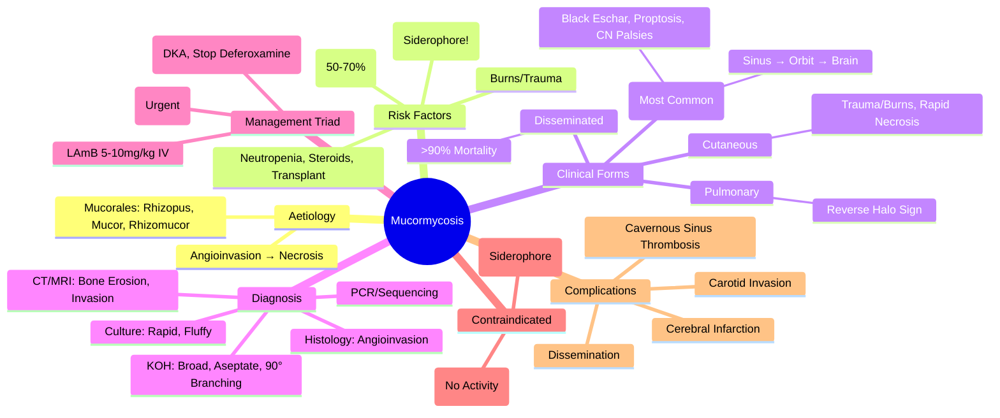

> [!info] **Davidson Ch 11 Alignment**: Infectious Disease → Specific Organism Groups → Fungi → Mucorales (Mucormycosis)
> **FCPS/MRCP Focus**: Rhino-orbital-cerebral (ROCM), pulmonary, cutaneous, disseminated, diabetic ketoacidosis, iron overload, deferoxamine, amphotericin B, surgical debridement, mortality

---

## 1. 🎯 Learning Objectives

- [ ] Identify **Aetiology**: **Mucorales** (Rhizopus, Mucor, Rhizomucor, Lichtheimia, Cunninghamella) — **Angioinvasion**, **Tissue Necrosis**
- [ ] Recognise **Risk Factors**: **Diabetes (DKA)**, **Iron Overload / Deferoxamine**, **Neutropenia**, **Transplant**, **Corticosteroids**, **Malignancy**, **Burns**, **Trauma**
- [ ] Recognise **Clinical Forms**: **Rhino-Orbital-Cerebral (ROCM)** (Most Common), **Pulmonary**, **Cutaneous**, **GI**, **Disseminated**
- [ ] Diagnose: **KOH Mount / Histopathology** (Broad, Aseptate, Right-Angle Branching Hyphae), **Culture**, **PCR**, **Imaging** (CT/MRI)
- [ ] Manage: **Liposomal Amphotericin B (High Dose)** + **Surgical Debridement** (Urgent), **Iron Chelation Discontinue**, **Glycaemic Control**
- [ ] Recognise **Complications**: **Cerebral Invasion**, **Carotid Artery Invasion**, **Cavernous Sinus Thrombosis**, **Dissemination**
- [ ] Recognise **C. auris vs Mucormycosis**: Different Organisms, Different Treatment

---

## 2. 📖 Definition & Epidemiology

| Feature | Details |
|---------|---------|
| **Causative Agents** | **Mucorales**: *Rhizopus* (Most Common), *Mucor*, *Rhizomucor*, *Lichtheimia*, *Cunninghamella*, *Apophysomyces*, *Saksenaea* |
| **Pathophysiology** | **Angioinvasion** → **Vascular Thrombosis** → **Tissue Necrosis** → **Haematogenous Dissemination** |
| **Risk Factors** | **Diabetes (DKA) — 50-70%**, **Iron Overload / Deferoxamine**, **Neutropenia**, **HSCT**, **Corticosteroids**, **Malignancy**, **Burns**, **Trauma**, **Prematurity** |
| **Iron Overload** | **Deferoxamine** → Acts as **Siderophore** for Mucorales → **Enhanced Growth** |
| **Geography** | **Worldwide**; **India** (High Burden, Rhino-Orbital-Cerebral), **Diabetes/DKA** Major Driver |
| **Mortality** | **Overall 50-80%**; **ROCM 50-85%**; **Disseminated >90%** |

> [!warning] **Mucormycosis = Angioinvasion → Tissue Necrosis → Rapid Progression**. **Diabetes/DKA = #1 Risk Factor**. **Deferoxamine = Siderophore for Mucorales**. **Mortality 50-80%** even with treatment.

---

## 3. 📖 Clinical Forms

| Form | Frequency | Key Features |
|------|-----------|--------------|
| **Rhino-Orbital-Cerebral (ROCM)** | **Most Common (40-50%)** | **Sinusitis**, **Periorbital Swelling**, **Proptosis**, **Ophthalmoplegia**, **Vision Loss**, **Palatal/Nasal Eschar (Black Necrosis)**, **Cranial Nerve Palsies**, **Cerebral Invasion → Altered Mental Status** |
| **Pulmonary** | **20-30%** | **Fever, Cough, Haemoptysis**, **Dyspnoea**, **Pleural Effusion**, **CXR/CT: Nodules, Consolidation, Cavitation, Reverse Halo Sign** |
| **Cutaneous** | **10-15%** | **Trauma/Burns/Surgery Site**, **Erythema → Necrosis → Eschar**, **Rapid Spread**, **Necrotising Fasciitis** |
| **GI** | **<5%** | **Abdominal Pain**, **Nausea/Vomiting**, **GI Bleeding**, **Perforation**, **Ischaemic Bowel** |
| **Disseminated** | **10-20%** | **Multiple Organs** (Brain, Lungs, Skin, Spleen, Heart), **High Mortality (>90%)** |

---

## 4. 📖 Risk Factors — The "Classic" Triad

| Risk Factor | Mechanism |
|-------------|-----------|
| **Diabetes + DKA** | **Acidosis** → **Enhanced Fungal Growth**; **Iron Availability** (Ketones Chelate Iron); **Neutrophil Dysfunction** |
| **Iron Overload / Deferoxamine** | **Deferoxamine = Siderophore** for Mucorales → **Enhanced Iron Acquisition** → **Rapid Growth** |
| **Neutropenia / Immunosuppression** | **Impaired Neutrophil Function** → **Impaired Phagocytosis/Killing** |

> [!warning] **Diabetes + DKA = #1 Risk Factor (50-70%)**. **Deferoxamine = Siderophore for Mucorales** → **Contraindicated in Suspected Mucormycosis**. **Steroid Use = ↑ Risk** (COVID-19 Associated Mucormycosis).

---

## 5. 📖 Clinical Presentations

### Rhino-Orbital-Cerebral (ROCM) — Most Common

| Feature | Details |
|---------|---------|
| **Initial** | **Facial Pain**, **Nasal Congestion/Discharge (Bloody/Black)**, **Facial Swelling**, **Headache**, **Fever** |
| **Orbital** | **Periorbital Swelling**, **Proptosis**, **Ophthalmoplegia** (III, IV, VI Palsies), **Vision Loss**, **Chemosis** |
| **Palate/Nose** | **Black Eschar** (Necrotic Turbinates/Palate), **Nasal Obliteration** |
| **Cerebral** | **Altered Mental Status**, **Seizures**, **Hemiparesis**, **Cavernous Sinus Thrombosis**, **Carotid Artery Invasion** |

### Pulmonary

| Feature | Details |
|---------|---------|
| **Symptoms** | **Fever**, **Cough**, **Haemoptysis**, **Dyspnoea**, **Chest Pain** |
| **Imaging** | **Nodules, Consolidation, Cavitation**, **Reverse Halo Sign** (Atoll Sign), **Air-Crescent Sign** |
| **Host** | **Neutropenic, HSCT, Leukaemia, Steroids** |

### Cutaneous

| Feature | Details |
|---------|---------|
| **Portal** | **Trauma, Burns, Surgery, IV Catheter, Injections** |
| **Appearance** | **Erythema → Rapid Necrosis → Black Eschar**, **Rapid Spread**, **Necrotising Fasciitis** |

---

## 6. 🔬 Diagnostic Workup

```mermaid
flowchart TD
    A[Suspected Mucormycosis: Risk Factors + Clinical Syndrome] --> B[**Imaging (Urgent)**]
    B --> B1[**CT Sinuses/Orbit/Brain** (ROCM): Sinus Opacification, Bone Erosion, Orbital Invasion, Cerebral Invasion]
    B --> B2[**CT Chest** (Pulmonary): Nodules, Consolidation, Reverse Halo Sign]
    B --> B3[**MRI Brain** (Superior for Cerebral Invasion): Perineural Spread, Cavernous Sinus Thrombosis]
    A --> C[**Tissue Biopsy (Gold Standard)**]
    C --> C1[**KOH Mount / Calcofluor White** (Rapid): **Broad, Aseptate, Right-Angle Branching Hyphae**]
    C --> C2[**Histopathology (H&E/GMS/PAS)**: **Broad, Aseptate, Right-Angle Branching Hyphae**, **Angioinvasion**]
    C --> C3[**Culture** (Sabouraud): **Rapid Growth (24-48h), Fluffy, Grey-Brown**]
    C --> C4[**PCR / Sequencing** (Species ID) |
```

### Key Diagnostic Features (Histopathology)

| Feature | Mucormycosis | Aspergillosis | Candidiasis |
|--------|--------------|---------------|-------------|
| **Hyphae** | **Broad (10-20µm), Aseptate (Coenocytic)** | **Septate (3-5µm), Acute Angle Branching (45°)** | **Yeast + Pseudohyphae (Septate)** |
| **Branching** | **Right-Angle (90°)** | **Acute Angle (45°)** | **Pseudohyphae (Elongated Yeast)** |
| **Angioinvasion** | **Prominent** | **Present** | **Rare** |
| **Staining** | **H&E: Pale, Wide, Ribbon-Like** | **H&E: Narrow, Septate** | **H&E: Yeast + Pseudohyphae** |

> [!tip] **KOH Mount / Histopathology = Rapid Diagnosis**. **Broad, Aseptate, Right-Angle Branching Hyphae = Mucormycosis**. **Angioinvasion = Hallmark**.

---

## 7. 💊 Management — The "Iron Triangle": Antifungal + Surgical + Metabolic Control

### 1. Antifungal Therapy

| Agent | Dose | Indication | Notes |
|-------|------|----------|-------|
| **Liposomal Amphotericin B (LAmB)** | **5-10 mg/kg/day IV** (Up to 10 mg/kg in CNS) | **1st Line** (All Forms) | **Renal Sparing**, **Higher Doses for CNS** |
| **Amphotericin B Deoxycholate** | **1-1.5 mg/kg/day IV** | Alternative if LAmB Unavailable | **Nephrotoxicity**, **Infusion Reactions** |
| **Posaconazole** | **300mg BD (Day 1) → 300mg OD PO/IV** | **Step-Down / Salvage / Prophylaxis** | **Good CNS Penetration**, **CYP3A4 Interactions** |
| **Isavuconazole** | **200mg IV/PO TID ×2d → 200mg OD** | **Alternative / Step-Down** | **Good CNS Penetration**, **Less Drug Interactions** |
| **Combination** | **LAmB + Posaconazole/Isavuconazole** | **Severe/Refractory** | **No Strong RCT Evidence** |

> [!warning] **Echinocandins (Caspofungin/Micafungin/Anidulafungin) = NO ACTIVITY against Mucorales** — **DO NOT USE**.

### 2. Surgical Debridement — **Urgent & Radical**

| Principle | Details |
|-----------|---------|
| **Timing** | **ASAP** (Within Hours of Diagnosis) — **Delay = ↑ Mortality** |
| **Extent** | **Radical Debridement** → **Violable Tissue Removal** (Necrotic Bone, Sinus, Orbit, Palate) |
| **Repeat** | **Re-Look Surgery q24-48h** Until Healthy Tissue |
| **Specialised** | **Maxillofacial/ENT/Neurosurgery/Ophthalmology** — **Multidisciplinary Team** |

> [!warning] **Surgical Debridement = Life-Saving**. **Radical + Early = Survival**. **Orbital Exenteration** if Orbital Invasion. **Palatal/Maxillary Resection** if Palatal Necrosis.

### 3. Metabolic Control (Critical Adjunct)

| Factor | Target / Action |
|--------|-----------------|
| **Glycaemic Control** | **Strict Glycaemic Control** (Insulin Infusion) — **DKA Resolution Critical** |
| **Iron Chelation** | **STOP Deferoxamine IMMEDIATELY** — **Siderophore for Mucorales** |
| **Acidosis Correction** | **Bicarbonate / Insulin** — Correct DKA |
| **Immunosuppression** | **Reduce/Stop Steroids/Immunosuppressants** if Possible |

---

## 8. 🩺 Clinical Forms & Complications

| Form | Key Features | Mortality |
|------|-------------|-----------|
| **ROCM** | **Sinusitis → Orbital → Cerebral**, **Palatal Eschar**, **Cranial Nerve Palsies**, **Cavernous Sinus Thrombosis**, **Carotid Artery Invasion** | **50-85%** |
| **Pulmonary** | **Nodules, Consolidation, Cavitation, Reverse Halo Sign**, **Haemoptysis** | **50-70%** |
| **Cutaneous** | **Trauma/Burns/IV Site**, **Rapid Necrosis**, **Eschar** | **30-50%** |
| **Disseminated** | **Multi-Organ**, **Cerebral Haemorrhage**, **Septic Shock** | **>90%** |

### Complications

| Complication | Mechanism | Management |
|--------------|-----------|------------|
| **Cavernous Sinus Thrombosis** | **Angioinvasion → Cavernous Sinus** | **Anticoagulation (Controversial) + Antifungals + Surgery** |
| **Carotid Artery Invasion** | **Angioinvasion → ICA** | **Stroke Risk, Endovascular/Surgical** |
| **Cerebral Infarction** | **Angioinvasion → MCA/ACA Occlusion** | **Anticoagulation (Cautious) + Antifungals** |
| **Cranial Nerve Palsies** | **Orbital Apex / Cavernous Sinus Invasion** | **Antifungals + Surgery** |

---

## 9. 🔬 Diagnosis Summary

| Test | Sensitivity/Specificity | Role |
|------|------------------------|------|
| **KOH Mount / Calcofluor White** | **Rapid (Minutes)**, **High Sens (Broad, Aseptate, 90° Branching)** | **Bedside Rapid Screening** |
| **Histopathology (H&E/GMS/PAS)** | **Gold Standard** (Tissue Invasion, Angioinvasion) | **Confirmatory** |
| **Culture (Sabouraud)** | **Rapid Growth (24-48h), Fluffy, Grey-Brown**, **No Cycloheximide Inhibition** | **Species ID** |
| **PCR / Sequencing** | **Species ID (Rhizopus, Mucor, Lichtheimia)** | **Definitive** |
| **Imaging (CT/MRI)** | **Extent, Invasion, Surgical Planning** | **Staging/Surgical Planning** |

---

## 10. 💊 Management Algorithm

```mermaid
flowchart TD
    A[Suspected Mucormycosis] --> B[**Urgent Imaging (CT/MRI)**]
    B --> C[**Tissue Biopsy + KOH Mount**]
    C --> D{**Confirmed?**}
    D -->|Yes| E[**Immediate LAmB 5-10mg/kg IV**]
    E --> F[**Urgent Surgical Debridement**]
    F --> G[**Metabolic Control**: DKA Correction, Stop Deferoxamine, Glycaemic Control]
    G --> H[**Monitor**: Renal, Electrolytes, Electrolytes, Imaging Follow-up]
    H --> I[**Step-Down**: Posaconazole/Isavuconazole (After Improvement)]
    I --> J[**Duration**: 3-6 Weeks Minimum, Until Clinical/Radiological Resolution]
```

---

## 11. 💊 Antifungal Regimens

| Agent | Dose | Indication |
|-------|------|-----------|
| **Liposomal Amphotericin B (LAmB)** | **5-10 mg/kg/day IV** (Up to 10 mg/kg CNS) | **1st Line** (All Forms) |
| **Posaconazole** | **300mg BD (Day 1) → 300mg OD PO/IV** | **Step-Down / Salvage / Prophylaxis** |
| **Isavuconazole** | **200mg IV/PO TID ×2d → 200mg OD** | **Alternative / Step-Down** |
| **Amphotericin B Deoxycholate** | **1-1.5 mg/kg/day IV** | **If LAmB Unavailable** |
| **Combination** | **LAmB + Posaconazole/Isavuconazole** | **Severe/Refractory** (No RCT Evidence) |

> [!warning] **ECHINOCANDINS (CASPOFUNGIN/MICAFUNGIN/ANIDULAFUNGIN) = NO ACTIVITY VS MUCORALES** — **CONTRAINDICATED AS MONOTHERAPY**.

---

## 12. 💡 FCPS/MRCP High-Yield Summary

| Topic | Key Point |
|-------|-----------|
| **Aetiology** | **Mucorales (Rhizopus, Mucor, Rhizomucor)**, **Angioinvasion → Necrosis** |
| **Risk Factors** | **Diabetes/DKA (50-70%)**, **Deferoxamine (Siderophore)**, **Neutropenia, Steroids, Transplant, Burns** |
| **Clinical Forms** | **ROCM (Most Common), Pulmonary, Cutaneous, GI, Disseminated** |
| **ROCM** | **Sinusitis → Orbit → Brain**, **Black Eschar, Proptosis, Ophthalmoplegia, CN Palsies, Cavernous Sinus Thrombosis** |
| **Diagnosis** | **KOH Mount (Broad, Aseptate, 90° Branching)**, **Histology (Angioinvasion)**, **Culture, PCR**, **CT/MRI (Erosion, Invasion)** |
| **Treatment Triad** | **LAmB 5-10mg/kg IV + Urgent Radical Debridement + Metabolic Control (DKA, Stop Deferoxamine)** |
| **Antifungals** | **LAmB 5-10mg/kg (1st Line)**; **Posaconazole/Isavuconazole (Step-Down/Salvage)**; **NO ECHINOCANDINS** |
| **Surgery** | **Urgent, Radical, Multidisciplinary** (ENT, Neurosurgery, Ophthalmology, Maxillofacial) |
| **Metabolic** | **DKA Correction, STOP Deferoxamine, Glycaemic Control, Reduce Steroids** |
| **Mortality** | **ROCM 50-85%, Disseminated >90%** |

---

## 13. ❓ Viva Questions

1. **What is the hallmark histopathological feature of Mucormycosis?**
   - **Broad (10-20µm), Aseptate (Coenocytic), Right-Angle (90°) Branching Hyphae** with **Angioinvasion**.

2. **Why are Echinocandins contraindicated in Mucormycosis?**
   - **Mucorales Lack β-1,3-D-Glucan in Cell Wall** (Target of Echinocandins) → **Inherently Resistant**.

3. **What is the significance of Deferoxamine in Mucormycosis?**
   - **Deferoxamine Acts as Siderophore for Mucorales** → **Enhances Iron Acquisition → Rapid Fungal Growth** → **Contraindicated in Suspected/Proven Mucormycosis**.

4. **Describe the classic presentation of Rhino-Orbital-Cerebral Mucormycosis.**
   - **Diabetic/DKA Patient**, **Facial Pain/Swelling**, **Nasal Discharge (Bloody/Black)**, **Periorbital Swelling, Proptosis, Ophthalmoplegia**, **Palatal/Nasal Black Eschar**, **Cranial Nerve Palsies**, **Altered Sensorium**.

4. **What is the drug of choice for Mucormycosis?**
   - **Liposomal Amphotericin B 5-10 mg/kg/day IV** (1st Line); **Posaconazole/Isavuconazole for Step-Down/Salvage**.

5. **Why are Echinocandins ineffective against Mucormycosis?**
   - **Mucorales Lack β-1,3-D-Glucan** in Cell Wall (Target of Echinocandins) → **Inherently Resistant**.

5. **What is the "Iron Triangle" of Mucormycosis Management?**
   - **High-Dose LAmB + Radical Surgical Debridement + Metabolic Control (DKA Correction, Stop Deferoxamine, Glycaemic Control)**.

6. **Why is Deferoxamine contraindicated in Mucormycosis?**
   - **Acts as Siderophore** → **Binds Iron → Delivers to Mucorales** → **Enhances Fungal Growth & Virulence**.

6. **What are the typical MRI findings in Rhino-Orbital-Cerebral Mucormycosis?**
   - **Sinus Opacification, Bone Erosion, Orbital Invasion, Perineural Spread, Cavernous Sinus Thrombosis, Cerebral Infarcts, Carotid Artery Invasion**.

7. **How do you manage a patient with Cutaneous Mucormycosis at an insulin injection site?**
   - **Urgent Surgical Debridement + LAmB 5-10mg/kg IV + Glycaemic Control + Stop Deferoxamine**.

8. **What is the "Reverse Halo Sign" and in which condition is it seen?**
   - **Central Ground-Glass Opacity Surrounded by Dense Consolidation Ring** — **Seen in Pulmonary Mucormycosis** (Also Organising Pneumonia, TB).

8. **What is the role of Posaconazole in Mucormycosis?**
   - **Step-Down Therapy (After LAmB Improvement)**, **Salvage (Refractory)**, **Primary Prophylaxis (High-Risk: HSCT, GVHD)**.

---

## 14. 🧠 Confusions & Mnemonics

| Confusion | Clarification |
|-----------|---------------|
| **Mucormycosis vs Aspergillosis** | **Mucor: Broad, Aseptate, 90° Branching, Angioinvasion**; **Aspergillus: Septate, 45° Branching** |
| **Echinocandins in Mucormycosis** | **NO ACTIVITY** — **Mucorales Lack β-1,3-D-Glucan** |
| **Deferoxamine** | **Siderophore for Mucorales** → **CONTRAINDICATED** |
| **Mucormycosis vs Aspergillosis on Imaging** | **Mucor: Rapid, Aggressive, Bone Erosion, Palatal Necrosis**; **Aspergillus: Slower, Cavitation, Halo Sign** |
| **ROCM vs Invasive Aspergillus Sinusitis** | **Mucor: Rapid, Palatal Eschar, Cranial Nerves, Carotid Invasion**; **Aspergillus: Slower, Less Bone Destruction Initially** |

| Mnemonic | Meaning |
|----------|---------|
| **"Mucor = Broad, Aseptate, 90° Branching, Angioinvasion"** | Histology |
| **"DKA + Deferoxamine = Mucor's Best Friends"** | Risk Factors |
| **"Echinocandins = NO GO for Mucor"** | Contraindicated |
| **"LAmB + Surgery + DKA Control = Survival Triad"** | Management |
| **"Rhino-Orbital-Cerebral = Sinus → Orbit → Brain"** | ROCM Spread |
| **"Deferoxamine = Siderophore = Mucor Fuel"** | Deferoxamine Danger |

---

## 15. 🗺️ Mind Map



---

## 16. 📋 One-Page Revision Card

| **MUCORMYCOSIS – FCPS/MRCP REVISION CARD** |
|---------------------------------------------|
| **Aetiology**: **Mucorales** (Rhizopus, Mucor) — **Angioinvasion → Necrosis** |
| **Risk Factors**: **DKA (50-70%)**, **Deferoxamine (Siderophore!)**, Neutropenia, Steroids, Transplant |
| **Histology**: **Broad, Aseptate, Right-Angle (90°) Branching Hyphae + Angioinvasion** |
| **ROCM**: **Sinus → Orbit → Brain** — Black Eschar, Proptosis, CN Palsies, Cavernous Sinus Thrombosis |
| **Diagnosis**: **KOH Mount** (Broad, Aseptate, 90° Branching) **Rapid**; **Histology**: Angioinvasion; **Culture/PCR** |
| **Azole/Echinocandin**: **Echinocandins NO ACTIVITY**; **Azoles (Posaconazole/Isavuconazole) = Step-Down/Salvage** |
| **Treatment Triad**: **LAmB 5-10mg/kg IV + Urgent Radical Debridement + Metabolic Control (DKA, Stop Deferoxamine!)** |
| **Echinocandins**: **CONTRAINDICATED** (No β-1,3-D-Glucan in Mucorales Wall) |
| **Deferoxamine**: **SIDEROPHORE → CONTRADICATED** (Enhances Growth) |
| **Mortality**: ROCM 50-85%, Disseminated >90% |

---

## 17. 📅 Spaced Repetition Tracker

| Review | Date | Score (1-5) | Next Review |
|--------|------|-------------|-------------|
| Day 1 | 2025-06-17 | | 2025-06-18 |
| Day 3 | | | |
| Day 7 | | | |
| Day 15 | | | |
| Day 30 | | | |

---

## 18. 🎯 Must Know / Should Know / Nice to Know

| Level | Content |
|-------|---------|
| **Must Know** | Mucormycosis = Mucorales, Angioinvasion, KOH: Broad/Aseptate/90°, LAmB 5-10mg/kg + Surgery + DKA Control, Deferoxamine Contraindicated, Echinocandins No Activity, ROCM Spread (Sinus→Orbit→Brain), Mortality, Deferoxamine = Siderophore Contraindicated |
| **Should Know** | ROCM staging, Cavernous sinus thrombosis management, Carotid artery invasion, Reverse halo sign pulmonary, Cutaneous mucormycosis (burns/trauma), Posaconazole/isavuconazole step-down, Renal dosing LAmB, Paediatric dosing, Pregnancy management, Isavuconazole advantages, C. auris vs mucormycosis differentiation |
| **Nice to Know** | Mucorales genomics, Spore germination triggers, Iron acquisition mechanisms, Host immune response (neutrophils, macrophages), Iron chelation therapy beyond deferoxamine, Posaconazole pharmacokinetics (food effect), Isavuconazole BALANCE trial, Mucormycosis in COVID-19 (CAMCO), Global epidemiology shifts, Climate change impact, Novel antifungals (ibrexafungerp, rezafungin, fosmanogepix), One Health approach |

---

## 19. ✅ Self-Test Scorecard

| Section | Score (0-10) | Notes |
|---------|--------------|-------|
| Aetiology & Pathophysiology | | |
| Risk Factors & Clinical Forms | | |
| Histopathology & Diagnosis | | |
| Management Triad (LAmB, Surgery, Metabolic) | | |
| Antifungal Selection & Contraindications | | |
| Complications & Mortality | | |
| Viva Questions | | |

---

## 20. 🔗 Local Navigation

- **Previous**: [[Cryptococcal Meningitis]]
- **Next**: [[Endemic Mycoses]]
- **Section Hub**: [[Infectious Disease MOC]]
- **MOC**: [[Infectious Disease MOC]]
- **Template**: [[../Templates/Hematology Topic Template]]

---

*Generated for FCPS/MRCP exam preparation. Based on Davidson Medicine 24th Ed Chapter 11.*