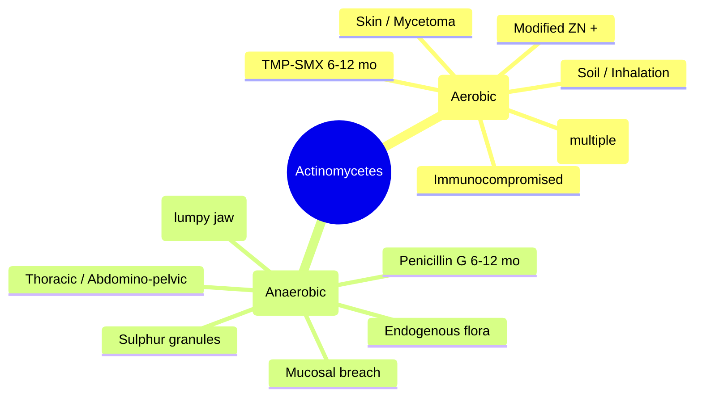

> [!info] **Davidson Ch 11 Alignment**: Infectious Disease → Specific Organism Groups → Aerobic Actinomycetes (Nocardia) & Anaerobic Actinomycetes (Actinomyces)
> **FCPS/MRCP Focus**: Pulmonary nocardiosis (immunocompromised), cervicofacial actinomycosis, brain abscess, sulphur granules, penicillin vs TMP-SMX

---

## 1. 🎯 Learning Objectives

- [ ] Distinguish **Nocardia** (aerobic, acid-fast, immunocompromised) vs **Actinomyces** (anaerobic, endogenous, mucosal breach)
- [ ] Recognise **Pulmonary nocardiosis**: Subacute pneumonia, cavitation, dissemination to brain/skin
- [ ] Recognise **Cervicofacial actinomycosis**: "Lumpy jaw", sulphur granules, dental/oral origin
- [ ] Diagnose: **Modified Ziehl-Neelsen** (Nocardia), **sulphur granules** (Actinomyces), culture (both), PCR
- [ ] Manage: **TMP-SMX** (Nocardia), **High-dose Penicillin G** (Actinomyces)

---

## 2. 📚 Comparison: Nocardia vs Actinomyces

| Feature | **Nocardia** | **Actinomyces** |
|---------|--------------|-----------------|
| **Classification** | Aerobic actinomycete (Gram+, branching, beaded) | Anaerobic actinomycete (Gram+, branching, non-acid-fast) |
| **Acid-fast** | **Partial/Weak +ve** (modified ZN) | Negative |
| **Oxygen** | Aerobic | **Anaerobic/Microaerophilic** |
| **Habitat** | Soil, decaying organic matter | **Human oropharyngeal/GI/GU flora** (endogenous) |
| **Transmission** | Inhalation (pulmonary), inoculation (cutaneous) | **Mucosal breach** (dental, surgery, trauma, IUD) |
| **Risk Groups** | **Immunocompromised** (transplant, HIV, steroids, MALT lymphoma) | Immunocompetent (dental disease, trauma, IUD) |
| **Key Species** | *N. asteroides* complex, *N. brasiliensis*, *N. cyriacigeorgica* | *A. israelii*, *A. gerencseriae*, *A. naeslundii* |

---

## 3. 🩺 Nocardiosis

### Clinical Syndromes
| Syndrome | Features |
|----------|----------|
| **Pulmonary** (80%) | Subacute: cough, fever, weight loss, night sweats; **cavitation**, consolidation, nodules; mimics TB/cancer |
| **CNS** (30-50% dissemination) | **Brain abscesses** (multiple, supratentorial, rim-enhancing); meningitis rare |
| **Cutaneous** | Cellulitis, abscesses, mycetoma (*N. brasiliensis*), sporotrichoid spread |
| **Disseminated** | Skin, brain, kidneys, bones, joints; high mortality |

### Radiology
- **CXR/CT**: Irregular nodules, **cavitation** (thick-walled), consolidation, pleural effusion
- **Brain MRI**: **Multiple ring-enhancing lesions** (supratentorial, grey-white junction)

---

## 4. 🩺 Actinomycosis

### Clinical Syndromes (by Site)
| Syndrome | Features |
|----------|----------|
| **Cervicofacial** (50-60%) | "**Lumpy jaw**"; indurated mass at angle of mandible, **sinus tracts**, **sulphur granules**; dental caries, extraction, trauma |
| **Thoracic** (15-20%) | Pneumonia, mass, **empyema**, "rib destruction"; mimics lung cancer/TB; aspiration of oral flora |
| **Abdomino-pelvic** (20%) | **IUD-associated** (pelvic actinomycosis), post-surgical, appendicitis mimic; mass, sinus tracts, sulphur granules |
| **CNS** | Brain abscess (single), meningitis; haematogenous or direct extension |

### Sulphur Granules
- **Pathognomonic**: Yellow-white, 1-2 mm, **friable**; colonies of filamentous bacteria + calcium phosphate
- **Microscopy**: Gram+ **filamentous bacilli**, **clubs at periphery** (rosettes)

---

## 5. 🔬 Diagnosis

| Test | Nocardia | Actinomyces |
|------|----------|-------------|
| **Gram stain** | Gram+, branching, beaded **filaments** | Gram+, branching filaments |
| **Acid-fast (Modified ZN)** | **Weakly +ve** (beaded) | **Negative** |
| **Culture** | **Aerobic**; 24-72h on BAP/chocolate; **BCYE** (Legionella media) | **Anaerobic**; 5-14 days; **sulphur granules** crush for culture |
| **Sulphur granules** | Not typical | **Diagnostic** (crush + Gram stain/culture) |
| **PCR / 16S rRNA** | Species ID; rapid | Species ID; rapid |
| **Histopathology** | Granulomatous, microabscesses | **Sulphur granules**, "sulfur granules" in abscesses |

> [!tip] **Exam Pearl**: Nocardia = **modified ZN +ve, aerobic, immunocompromised**; Actinomyces = **anaerobic, sulphur granules, endogenous, dental/IUD**.

---

## 6. 💊 Management

### Nocardiosis
| Scenario | Regimen | Duration |
|----------|---------|----------|
| **Pulmonary / Disseminated / CNS** | **TMP-SMX 15-20 mg/kg/day (TMP component) IV/PO divided q6-8h** | **6-12 months** (CNS: 12 months; immunocompromised: lifelong suppression) |
| **Alternative (sulfa allergy)** | **Imipenem** OR **Meropenem** + **Amikacin** OR **Linezolid** + **Cefotaxime** | Same |
| **Cutaneous / Mycetoma** | **TMP-SMX** + **Amikacin** OR **Linezolid** | 6-12 months |
| **Suppressive therapy** (post-treatment, immunocompromised) | **TMP-SMX DS 1 tab daily** | Indefinite |

### Actinomycosis
| Scenario | Regimen | Duration |
|----------|---------|----------|
| **All forms (IV induction)** | **Penicillin G 18-24 MU IV daily** (divided q4h) | **2-6 weeks** |
| **All forms (Oral consolidation)** | **Penicillin V 2-4 g PO q6h** OR **Amoxicillin 1g q8h** | **6-12 months** (total) |
| **Penicillin allergy** | **Doxycycline 100mg bd** OR **TMP-SMX DS bd** OR **Clindamycin 600mg q8h** | 6-12 months |
| **Adjunct** | **Surgical drainage/debridement** (abscesses, necrotic tissue, IUD removal) | As needed |

> [!warning] **Duration**: Actinomycosis requires **prolonged therapy (6-12 months)** to prevent relapse. Short courses fail.

---

## 7. 📋 FCPS/MRCP High-Yield Summary

| Topic | Key Point |
|-------|-----------|
| **Nocardia** | Aerobic, **modified ZN +ve**, soil, **immunocompromised**, pulmonary → brain, **TMP-SMX** |
| **Actinomyces** | Anaerobic, **endogenous oral flora**, dental/IUD, **sulphur granules**, cervicofacial, **Penicillin G** |
| **Brain abscess** | Nocardia: **multiple**, supratentorial; Actinomyces: **single** |
| **Sulphur granules** | Pathognomonic for Actinomyces; crush for Gram/culture |
| **HIV/Transplant** | Nocardia = opportunistic; Actinomyces = not typically opportunistic |

---

## 8. ❓ Viva Questions (FCPS/MRCP)

1. **How do you differentiate Nocardia from Actinomyces on microscopy?**
2. **A renal transplant patient presents with cavitary pneumonia and multiple brain lesions. Diagnosis?**
3. **What are sulphur granules? Which organism produces them?**
4. **Compare treatment of nocardiosis vs actinomycosis.**
5. **Why does actinomycosis require 6-12 months of antibiotics?**
6. **A woman with IUD presents with pelvic mass and draining sinuses. Diagnosis?**
7. **What is the modified Ziehl-Neelsen stain used for?**
8. **Nocardia brain abscess vs Toxoplasma in HIV: key imaging difference?**
9. **Alternative treatment for Nocardia if sulfa allergy?**
10. **Actinomycosis vs TB: distinguishing features?**

---

## 9. 🧠 Confusions & Mnemonics

| Confusion | Clarification |
|-----------|---------------|
| **Nocardia vs Actinomyces (both branching Gram+)** | Nocardia: **aerobic, modified ZN +ve, soil, immunocompromised**; Actinomyces: **anaerobic, ZN -ve, endogenous, sulphur granules** |
| **Nocardia vs Mycobacterium (both acid-fast)** | Nocardia: **weak/partial ZN +ve, aerobic, branching filaments fragment**; Mycobacterium: **strong ZN +ve, non-branching** |
| **Actinomycosis vs Botryomycosis** | Actinomycosis: Anaerobic, sulphur granules, "lumpy jaw"; Botryomycosis: Staph aureus, "grains", no sulphur granules |
| **Cervicofacial actinomycosis vs TB lymphadenitis** | Actinomycosis: Dental origin, sulphur granules, responds to penicillin; TB: Caseating nodes, AFB+, needs ATT |

**Mnemonic - Nocardia**: **"NOCARD"** → **N**ocardia, **O**pportunistic (immunocompromised), **C**avitary pneumonia, **A**cid-fast (weak), **R**esistant to routine abx, **D**isseminates to brain, **T**MP-SMX treats

**Mnemonic - Actinomyces**: **"ACTINO"** → **A**naerobic, **C**ervicofacial (lumpy jaw), **T**horacic (aspiration), **I**UD (pelvic), **N**o acid-fast, **O**wn flora (endogenous), **S**ulphur granules, **P**enicillin G

---

## 10. 🗺️ Mind Map

---

## 11. 📄 One-Page Revision Card

| **Nocardia** | **Actinomyces** |
|--------------|-----------------|
| **Aerobic** | **Anaerobic** |
| **Modified ZN +ve** (weak) | **ZN -ve** |
| Soil (inhalation) | Endogenous oral/GI/GU flora |
| Immunocompromised | Immunocompetent (dental, IUD, trauma) |
| Pulmonary → brain (multiple abscesses) | Cervicofacial (lumpy jaw), thoracic, pelvic |
| **TMP-SMX** (15-20mg/kg/d) × 6-12mo | **Penicillin G** 18-24MU IV → **Pen V** × 6-12mo |
| Alternatives: Carbapenem, Linezolid, Amikacin | Alternatives: Doxy, TMP-SMX, Clinda |

---

## 12. 📊 Spaced Repetition Tracker

| Review Interval | Date | Score (1-5) | Notes |
|-----------------|------|-------------|-------|
| 24 hours | | | |
| 7 days | | | |
| 15 days | | | |
| 30 days | | | |
| 90 days | | | |

---

## 13. 🧪 Self-Test Scorecard

| Topic | Known? (✓/✗) | Last Reviewed |
|-------|--------------|---------------|
| Nocardia vs Actinomyces (microscopy, oxygen, host) | | |
| Pulmonary nocardiosis presentation | | |
| Actinomycosis clinical forms | | |
| Sulphur granules (what, which organism, diagnosis) | | |
| Treatment regimens & duration | | |
| Brain abscess differences (single vs multiple) | | |

---

## 14. 🔗 Navigation

- [[Infectious Disease MOC]]
- [[Davidson Chapter 13 - Infectious Disease Hierarchy]]
- [[Brain Abscess]]
- [[Immunocompromised Host Infections]]
- [[Pulmonary Infections]]
- [[Dental Infections]]

---

*Last Updated: 2025-06-17 | Based on Davidson 24e Ch 11 | FCPS/MRCP Focused*