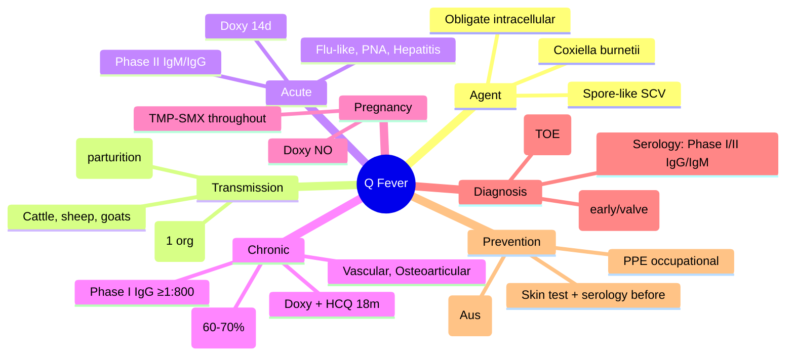

---
tags: [medicine, infectious-disease, davidson, chapter13, q-fever, coxiella, fcps, mrcp]
davidson_chapter: Chapter 13: Infectious disease
topic_category: Zoonotic Infections Domain
status: full-fcps-mrcp-topic-note
---

# Q Fever (Coxiella burnetii)

Related: [[Fever in Returned Traveller and FUO]], [[Infective Endocarditis]], [[Viral Haemorrhagic Fevers]], [[Travel Medicine and Pre-Travel Advice]], [[Pneumonia (Atypical)]]

> [!important]
> **Q Fever = *Coxiella burnetii* (obligate intracellular bacterium).** **Zoonosis:** cattle, sheep, goats → **aerosol inhalation** (parturition products); **highly infectious** (1 organism). **Acute: flu-like, pneumonia, hepatitis.** **Chronic: endocarditis (high mortality), vascular infection.** **Phase I/II antibodies = diagnosis; Phase I IgG ≥1:800 = chronic.** **Acute: doxycycline 2w; Chronic endocarditis: doxycycline + hydroxychloroquine 18m.**

## Learning Objectives
- Recognise acute and chronic Q fever presentations
- Apply serological diagnosis (Phase I/II antibodies)
- Differentiate acute vs chronic Q fever
- Select appropriate antibiotic therapy (acute vs chronic)
- Manage Q fever endocarditis and vascular infections
- Apply prevention (vaccine, occupational hygiene)

---

## Epidemiology & Transmission
| Aspect | Details |
|--------|---------|
| **Agent** | *Coxiella burnetii* (obligate intracellular, spore-like small cell variant) |
| **Reservoirs** | **Cattle, sheep, goats** (primary); cats, dogs, wildlife; placenta/amniotic fluid = high concentration |
| **Transmission** | **Aerosol inhalation** (parturition products, dust, wool, straw); **direct contact** with infected tissues; **ingestion** (unpasteurised milk); **tick bite** (rare); **person-to-person: extremely rare** |
| **Infectivity** | **Extremely high** — **1 organism** can cause infection |
| **Risk Occupations** | Farmers, veterinarians, abattoir workers, shearers, dairy workers, lab personnel |
| **Geography** | Worldwide (except New Zealand); outbreaks near livestock |

---

## Clinical Manifestations

### Acute Q Fever (60% symptomatic)
| Feature | Details |
|---------|---------|
| **Incubation** | 2–3 weeks (range 1–6 weeks) |
| **Presentation** | **Flu-like**: fever (39–40°C), severe headache, myalgia, fatigue, chills, sweats |
| **Respiratory** | **Atypical pneumonia** (dry cough, minimal sputum, patchy CXR), **pleuritic chest pain** |
| **Hepatic** | **Granulomatous hepatitis** (RUQ pain, hepatomegaly, ↑ ALT/AST, alkaline phosphatase) |
| **Other** | Myocarditis, pericarditis, meningitis, encephalitis, rash (maculopapular) |

### Chronic Q Fever (≥6 months)
| Syndrome | Features |
|----------|----------|
| **Endocarditis** | **Most common (60–70%)**; culture-negative; native/ prosthetic valves; vascular grafts; **high mortality (25–60%)** |
| **Vascular Infection** | Aortic aneurysm, vascular graft infection |
| **Osteoarticular** | Osteomyelitis, spondylodiscitis, prosthetic joint infection |
| **Chronic Hepatitis** | Granulomatous; fibrosis/cirrhosis |
| **Chronic Fatigue Syndrome** | Post-Q fever fatigue syndrome (QFS) — persistent fatigue >6m |

### Q Fever in Pregnancy
| Risk | Outcome |
|------|---------|
| **Acute Q Fever** | ** Miscarriage, stillbirth, preterm delivery, intrauterine growth restriction** |
| **Chronic Q Fever** | Rare in pregnancy |
| **Management** | **Doxycycline CONTRAINDICATED**; **Cotrimoxazole (TMP-SMX) 160/800mg 12h** throughout pregnancy + 6w postpartum; folic acid; monitor fetal growth |

---

## Diagnosis
### Serology (Gold Standard) — Phase I / Phase II Antibodies
| Phase | Antigen | Acute Q Fever | Chronic Q Fever (Endocarditis) |
|-------|---------|---------------|--------------------------------|
| **Phase II** | Lipopolysaccharide (LPS) truncated | **IgM appears first (1–2w), peaks 4–8w**; IgG rises later | Low/absent |
| **Phase I** | Full LPS (virulent) | Low/absent | **IgG Phase I ≥1:800 (or ≥1:1600) = DIAGNOSTIC**; IgG Phase I > Phase II |

| Antibody Pattern | Interpretation |
|------------------|----------------|
| **Phase II IgM + Phase II IgG** (Phase I negative/low) | **Acute Q Fever** |
| **Phase I IgG ≥1:800 (or ≥1:1600) + Phase I IgG > Phase II IgG** | **Chronic Q Fever (Endocarditis)** |
| **Phase I IgG + Phase II IgG high (no IgM)** | Past infection / convalescent |

> [!critical]
> **Phase I IgG ≥1:800 (or ≥1:1600) = CHRONIC Q FEVER (endocarditis).** **Phase II IgM + IgG = Acute Q Fever.** **IgM appears first (1–2w); Phase I IgG rises late in chronic.**

### Other Diagnostics
| Test | Utility |
|------|---------|
| **PCR (blood, tissue, valve tissue)** | Early acute (before seroconversion); valve tissue in endocarditis |
| **Culture** | **BSL-3**; not routine; slow (weeks); definitive |
| **Immunohistochemistry** | Valve tissue, placenta, liver biopsy |
| **CXR** | Patchy opacities, pleural effusion (atypical pneumonia) |
| **Echocardiography** | **TOE > TTE** for vegetations, abscess, prosthetic valve dehiscence |

---

## Treatment

### Acute Q Fever
| Regimen | Dose | Duration | Notes |
|---------|------|----------|-------|
| **Doxycycline** | **100mg PO 12h** | **14 days** | **1st-line**; start ASAP (↓ chronic risk) |
| **Alternative (pregnancy/contraindication)** | **Cotrimoxazole 960mg 12h** | 14 days | 1st trimester safe; 2nd/3rd controversial |
| **Severe/Complicated** | Doxycycline 100mg IV/PO 12h + Hydroxychloroquine 200mg 8h | 14 days | Add hydroxychloroquine (raises phagosomal pH) |

> [!tip]
> **Early doxycycline (within 3 days of fever) ↓ risk of chronic Q fever and complications.**

### Chronic Q Fever (Endocarditis)
| Regimen | Dose | Duration | Notes |
|---------|------|----------|-------|
| **Doxycycline + Hydroxychloroquine** | **Doxycycline 100mg PO 12h + Hydroxychloroquine 200mg 8h** | **18 months minimum** (up to 24–36m) | **1st-line**; **Hydroxychloroquine raises phagosomal pH → doxycycline bactericidal** |
| **Alternative (doxycycline intolerance)** | Cotrimoxazole 960mg 12h + Rifampicin 300mg 12h | 18–24 months | Less effective |
| **Surgery** | Valve replacement | If haemodynamic compromise, persistent sepsis, embolism | **Often required** |

> [!critical]
> **Doxycycline + Hydroxychloroquine ×18m = standard for chronic Q fever endocarditis.** **Hydroxychloroquine 200mg 8h raises phagosomal pH → doxycycline bactericidal.** **Monitor: ECGs (QTc), eye exams (retinopathy), LFTs, CBC.**

### Chronic Q Fever (Vascular Infection)
| Regimen | Duration |
|---------|----------|
| Doxycycline + Hydroxychloroquine | **24 months** (minimum) |

### Chronic Fatigue Syndrome (Post-Q Fever)
| Management | Details |
|------------|---------|
| **No specific antiviral** | Graded exercise therapy, CBT, pacing; symptomatic management |

---

## Diagnosis Algorithm
```
Suspected Q Fever
    ↓
Acute presentation (fever, pneumonia, hepatitis)
    ↓
Serology: Phase II IgM + IgG (1-2w) → Acute Q Fever
    ↓
Treat: Doxycycline 100mg 12h ×14d
    ↓
Chronic suspicion (endocarditis, vascular, >6m fever)
    ↓
Serology: Phase I IgG ≥1:800 + Phase I > Phase II → Chronic Q Fever
    ↓
Echo (TOE) + PCR blood/valve
    ↓
Treat: Doxycycline + Hydroxychloroquine ×18-24m
```

---

## Prevention & Vaccination
| Measure | Details |
|---------|---------|
| **Vaccine (Q-Vax®)** | **Whole-cell formalin-inactivated**; **single dose**; **pre-exposure**; **licensed in Australia**; **highly effective** |
| **Pre-vaccination Screening** | **Skin test + serology** (exclude prior exposure — severe reaction if sensitised) |
| **Occupational** | PPE (N95/FFP3, gloves, goggles); vaccination of abattoir/farm/veterinary workers |
| **Animal** | Vaccination of livestock (Coxevac®); proper disposal of birth products; pasteurisation of milk |
| **Environmental** | Dust control, ventilation, proper manure management |

---

## FCPS/MRCP High-Yield Points
- **Q Fever = *Coxiella burnetii*; highly infectious (1 organism); aerosol from parturition products**
- **Acute: flu-like, atypical pneumonia, granulomatous hepatitis; Phase II IgM/IgG**
- **Chronic: endocarditis (most common); Phase I IgG ≥1:800; doxycycline + hydroxychloroquine ×18m**
- **Acute treatment: doxycycline 100mg 12h ×14d (early = ↓ chronic risk)**
- **Chronic endocarditis: doxycycline + hydroxychloroquine ×18–24m (hydroxychloroquine raises pH → doxy bactericidal)**
- **Phase I IgG ≥1:800 = chronic Q fever (endocarditis); Phase II IgM/IgG = acute**
- **Pregnancy: doxycycline contraindicated; TMP-SMX throughout pregnancy**
- **Vaccine: Q-Vax (Australia); pre-screening (skin test + serology) mandatory**
- **Infective endocarditis culture-negative: think Q fever (Phase I IgG), Bartonella, Brucella, HACEK**

## Common Viva Questions
1. **Which serological finding defines chronic Q fever endocarditis?** Phase I IgG ≥1:800 (or ≥1:1600) with Phase I > Phase II.
2. **Acute vs Chronic Q Fever serology?** Acute = Phase II IgM + IgG; Chronic = Phase I IgG ≥1:800 (Phase I > Phase II).
3. **Treatment of acute Q fever?** Doxycycline 100mg 12h ×14d.
4. **Treatment of chronic Q fever endocarditis?** Doxycycline 100mg 12h + Hydroxychloroquine 200mg 8h ×18–24 months.
5. **Why hydroxychloroquine in chronic Q fever?** Raises phagosomal pH → doxycycline bactericidal.
5. **Q Fever in pregnancy?** Doxycycline contraindicated; TMP-SMX throughout pregnancy + 6w postpartum.
6. **Transmission?** Aerosol inhalation of parturition products (placenta, amniotic fluid); highly infectious (1 organism).
6. **Diagnosis of acute Q fever?** Phase II IgM + IgG seroconversion.
7. **Culture-negative endocarditis — think?** Q fever, Bartonella, Brucella, HACEK, T. whipplei.

## Common Confusions / Exam Traps
| Confusion | Clarification |
|-----------|---------------|
| Phase I = acute | **Phase II = acute (IgM/IgG); Phase I = chronic (IgG ≥1:800)** |
| Chronic Q Fever = just longer acute | **Different serology (Phase I IgG ≥1:800); different treatment (18m vs 14d); different prognosis** |
| Doxycycline alone for chronic endocarditis | **Hydroxychloroquine ESSENTIAL (raises phagosomal pH); doxy alone = failure** |
| Q fever endocarditis = same as other culture-negative | **Phase I IgG ≥1:800 specific; chronic Q fever = 60-70% of chronic cases** |
| Vaccine available everywhere | **Q-Vax only licensed in Australia; pre-screening (skin test + serology) mandatory** |
| Q fever only from direct contact | **Aerosol inhalation primary; highly infectious (1 organism); wind-borne spread kilometres** |
| Chronic Q fever = just fatigue | **Endocarditis = 60-70%; vascular, osteoarticular, hepatitis also chronic** |

## Mnemonics
- **Q FEVER PHASES**: **P**hase **I** = **C**hronic (**I**gG **≥1:800**); **P**hase **II** = **A**cute (**I**gM + **I**gG)
- **Q FEVER ACUTE**: **D**oxycycline **14** days (early = ↓ chronic)
- **Q FEVER CHRONIC**: **D**oxy + **H**ydroxychloroquine **18** months; **H**ydroxychloroquine = **pH** ↑ → doxy bactericidal
- **Q FEVER ENDOCARDITIS**: **P**hase **I** IgG **≥1:800** = **C**hronic; **P**hase **II** = **A**cute
- **PREGNANCY**: **D**oxy = **NO**; **TMP-SMX** throughout + 6w post
- **VACCINE**: **Q-Vax** (Australia); **S**kin test + **S**erology **BEFORE**

## Mind Map


## Flowchart
```mermaid
flowchart TD
  A[Suspected Q Fever] --> B{Acute or Chronic?}
  B -->|Acute (fever, PNA, hepatitis)| C[Serology: Phase II IgM + IgG]
  C --> D{Phase II IgM+?}
  D -->|Yes| E[Acute Q Fever → Doxycycline 100mg 12h ×14d]
  D -->|No| F[Consider Chronic or Other]
  B -->|Chronic (>6m, endocarditis)| G[Serology: Phase I IgG ≥1:800, Phase I > Phase II]
  G --> H{Phase I IgG ≥1:800?}
  H -->|Yes| I[Chronic Q Fever → Doxy + HCQ ×18-24m]
  H -->|No| J[Consider Other]
  E --> K[Early treatment ↓ chronic risk]
```

## Suggested Visuals / Image Notes
- Phase I vs Phase II antibody kinetics graph
- Q fever endocarditis echocardiography (TOE)
- Q fever serology interpretation table
- Coxiella burnetii lifecycle
- Endemic regions map

## Suggested Video References
- Q fever serology interpretation
- Chronic Q fever endocarditis management
- Q fever in pregnancy
- Q-Vax vaccine program

## One-Page Revision Summary
| Aspect | Acute Q Fever | Chronic Q Fever (Endocarditis) |
|--------|---------------|--------------------------------|
| **Serology** | **Phase II IgM + IgG** | **Phase I IgG ≥1:800 (Phase I > Phase II)** |
| **Clinical** | Flu-like, atypical PNA, granulomatous hepatitis | Culture-negative endocarditis (60–70%), vascular, osteoarticular |
| **Treatment** | **Doxycycline 100mg 12h ×14d** | **Doxycycline 100mg 12h + Hydroxychloroquine 200mg 8h ×18–24m** |
| **Key Principle** | **Early doxycycline ↓ chronic risk** | **Hydroxychloroquine raises phagosomal pH → doxy bactericidal** |
| **Pregnancy** | **Doxycycline CONTRAINDICATED; TMP-SMX** | Avoid pregnancy if possible; expert management |

## 24-Hour Recall Prompts
- Acute vs Chronic Q fever serology (Phase I vs II).
- Acute Q fever treatment (doxycycline 14d).
- Chronic Q fever endocarditis treatment (doxy + HCQ 18m).
- Why hydroxychloroquine in chronic? (raises phagosomal pH).
- Phase I IgG ≥1:800 = chronic endocarditis.
- Pregnancy: doxycycline NO; TMP-SMX.
- Transmission: aerosol from parturition.
- Culture-negative endocarditis differential: Q fever, Bartonella, Brucella, HACEK.

## 7-Day / 15-Day / 30-Day Revision Tracker
- [ ] Day 1 completed
- [ ] 24-hour recall completed
- [ ] Day 7 revision completed
- [ ] Day 15 revision completed
- [ ] Day 30 revision completed

## Must Know / Should Know / Nice to Know
### Must Know
- Acute: Phase II IgM/IgG; Doxycycline 14d
- Chronic Endocarditis: Phase I IgG ≥1:800; Doxy + HCQ 18m
- Hydroxychloroquine raises phagosomal pH → doxy bactericidal
- Pregnancy: Doxy NO; TMP-SMX
- Early doxy ↓ chronic risk

### Should Know
- Q fever in pregnancy (miscarriage, stillbirth risk)
- Vaccine Q-Vax (Australia) + pre-screening
- Chronic fatigue syndrome post-Q fever
- Vascular/osteoarticular chronic Q fever
- Culture-negative endocarditis differential

### Nice to Know
- Bulevirtide/lonafarnib for HDV (not Q fever)
- Q fever in immunocompromised
- New diagnostics (NGS, metagenomics)
- Q fever in military/deployed populations
- Economic burden of Q fever outbreaks

## Self-Test Scorecard
- Understanding: /10
- Recall: /10
- MCQ Performance: /10
- SBA Performance: /10
- Viva Confidence: /10
- Total: /50

> [!tip]
> Interpretation: <35 = weak topic, 35-44 = acceptable but insecure, 45+ = strong exam-ready topic.

## Exam Answer Modes
### Long Answer Skeleton
1. Epidemiology, transmission, reservoirs
2. Acute Q fever (clinical, serology, treatment)
3. Chronic Q fever (endocarditis, vascular, osteoarticular; serology, treatment)
4. Diagnosis (serology phases, PCR, culture, imaging)
4. Treatment (acute vs chronic; hydroxychloroquine rationale)
5. Pregnancy, vaccination, prevention
5. Differential diagnosis (culture-negative endocarditis)

### Short Note Skeleton
- **Acute**: Phase II IgM/IgG; Doxy 100mg 12h ×14d
- **Chronic**: Phase I IgG ≥1:800; Doxy + HCQ 18m
- **Serology**: Phase II = acute; Phase I = chronic
- **HCQ**: raises phagosomal pH → doxy bactericidal
- **Pregnancy**: Doxy NO; TMP-SMX
- **Vaccine**: Q-Vax (Aus); skin test + serology pre-vax

### Viva One-Liners
- Acute Q fever: Phase II IgM/IgG; Doxy 14d
- Chronic: Phase I IgG ≥1:800; Doxy+HCQ 18m
- HCQ raises phagosomal pH → doxy bactericidal
- Endocarditis: Phase I IgG ≥1:800
- Pregnancy: TMP-SMX (doxy NO)
- Vaccine: Q-Vax (Aus); pre-screen

### Ward-Case Discussion Points
- Farmer, fever, pneumonia, hepatitis → Phase II IgM+ → doxy 14d; early ↓ chronic
- Prosthetic valve, fever 3m, Phase I IgG 1:1600 → chronic Q fever endocarditis → doxy+HCQ 18m + valve surgery
- Pregnant sheep farmer, fever → TMP-SMX (doxy contraindicated)
- Culture-negative endocarditis, rural exposure → Q fever serology + PCR valve

### Last-Night-Before-Exam Sheet
**Q FEVER:** *Coxiella burnetii*; aerosol parturition; **Acute: Phase II IgM/IgG → Doxy 14d**. **Chronic Endocarditis: Phase I IgG ≥1:800 → Doxy + HCQ 18m (HCQ ↑ pH → doxy bactericidal)**. **Acute: flu-like, PNA, hepatitis**. **Chronic: endocarditis (60-70%), vascular, osteoarticular**. **Pregnancy: Doxy NO; TMP-SMX**. **Vaccine: Q-Vax (Aus); skin test + serology first**. **Endocarditis culture-neg: Q fever, Bartonella, Brucella, HACEK**.

## Summary
**Q Fever** is caused by ***Coxiella burnetii***, an obligate intracellular bacterium with a **spore-like small cell variant** that is **highly infectious (1 organism)** and environmentally resistant. **Reservoirs**: cattle, sheep, goats (placenta, amniotic fluid, milk, urine, faeces). **Transmission**: primarily **aerosol inhalation** of contaminated dust/parturition products; also direct contact, unpasteurised milk, tick bite (rare). **High-risk occupations**: farmers, veterinarians, abattoir workers, shearers. **Acute Q Fever** (60% symptomatic): incubation 2–3 weeks; **flu-like illness**, fever, severe headache, myalgia; **atypical pneumonia** (dry cough, patchy CXR); **granulomatous hepatitis** (RUQ pain, elevated transaminases); myocarditis, pericarditis, meningitis. **Serology**: **Phase II IgM + IgG** = acute (IgM appears 1–2w, IgG follows). **Treatment**: **Doxycycline 100mg PO 12h ×14 days** (early treatment ↓ chronic risk); add hydroxychloroquine if severe. **Chronic Q Fever** (≥6 months): **endocarditis (60–70%)**, vascular infection, osteoarticular, chronic fatigue syndrome. **Endocarditis**: culture-negative; **Phase I IgG ≥1:800 (or ≥1:1600) with Phase I > Phase II = diagnostic**. **Echocardiography (TOE)**: vegetations, abscess, prosthetic dehiscence. **Treatment**: **Doxycycline 100mg 12h + Hydroxychloroquine 200mg 8h ×18–24 months**; hydroxychloroquine raises phagosomal pH → restores doxycycline bactericidal activity; surgery often needed. **Vascular infection**: doxycycline + hydroxychloroquine ×24 months. **Pregnancy**: **doxycycline contraindicated**; **cotrimoxazole (TMP-SMX) throughout pregnancy + 6 weeks postpartum**; risk of miscarriage, stillbirth, preterm delivery. **Diagnosis**: serology (Phase I/II IgG/IgM), PCR (blood, valve tissue), culture (BSL-3, slow), echocardiography (TOE). **Prevention**: **Q-Vax (Australia)** — whole-cell formalin-inactivated, pre-vaccination skin test + serology mandatory (exclude prior exposure); PPE, animal vaccination, pasteurisation. **Culture-negative endocarditis differential**: Q fever, *Bartonella*, *Brucella*, HACEK, *T. whipplei*, fungi.

## MCQs (10)
1. **Acute Q fever serology is characterised by:**
   A. Phase I IgG ≥1:800
   B. Phase I IgM positive
   C. **Phase II IgM and IgG positive**
   D. Phase I IgG > Phase II IgG
   E. Phase I IgG ≥1:1600

2. **Chronic Q fever endocarditis is serologically defined by:**
   A. Phase II IgG > Phase I IgG
   B. **Phase I IgG ≥1:800 (Phase I > Phase II)**
   C. Phase II IgM positive only
   D. Phase I IgM positive
   E. Phase II IgG ≥1:1600

3. **Recommended treatment for acute Q fever:**
   A. Cotrimoxazole 960mg 12h ×14d
   B. **Doxycycline 100mg PO 12h ×14 days**
   C. Azithromycin 500mg OD ×3d
   D. Ciprofloxacin 500mg 12h ×14d
   E. Rifampicin + Doxycycline

4. **Hydroxychloroquine is added to doxycycline in chronic Q fever endocarditis because it:**
   A. Enhances doxycycline absorption
   B. **Raises phagosomal pH → restores doxycycline bactericidal activity**
   C. Reduces doxycycline side effects
   D. Has independent anti-Coxiella activity
   C. Shortens treatment duration

5. **Chronic Q fever endocarditis — standard treatment duration:**
   A. 6 months
   B. 12 months
   C. **18–24 months**
   D. 6 weeks
   E. Lifelong

6. **Q fever in pregnancy — doxycycline is:**
   A. Safe in all trimesters
   B. Safe in 2nd/3rd trimester only
   C. **Contraindicated (teratogenic); use cotrimoxazole**
   D. Safe if <14 days course
   E. Safe with folic acid supplementation

7. **Q fever vaccine (Q-Vax) — pre-vaccination requirement:**
   A. None
   B. **Skin test + serology (exclude prior exposure)**
   C. Only serology
   C. Only skin test
   E. Chest X-ray

8. **Q fever transmission — most common route:**
   A. Tick bite
   B. Ingestion of unpasteurised milk
   C. **Aerosol inhalation of parturition products**
   D. Person-to-person contact
   E. Sexual transmission

9. **Culture-negative endocarditis — differential includes all EXCEPT:**
   A. Q fever
   B. Bartonella
   C. Brucella
   D. HACEK organisms
   E. **Staphylococcus aureus**

10. **Q fever chronic fatigue syndrome — management:**
    A. Doxycycline 12 months
    B. Hydroxychloroquine 6 months
    C. **Graded exercise therapy, CBT, pacing (no specific antiviral)**
    D. Rituximab
    E. Antivirals

## SBA Questions (10)
1. **A 45-year-old sheep farmer presents with 10 days of fever, headache, dry cough, and RUQ pain. CXR: patchy bilateral infiltrates. LFTs: ALT 180, AST 200. Phase II IgM positive, Phase II IgG positive, Phase I negative. Management?**
   A. Cotrimoxazole 960mg 12h ×14d
   B. **Doxycycline 100mg PO 12h ×14 days**
   C. Azithromycin 500mg OD ×5d
   D. Ciprofloxacin 500mg 12h ×14d
   E. Clarithromycin 500mg 12h ×14d

2. **A 55-year-old man with a prosthetic aortic valve presents with 3 months of fever, weight loss, and new diastolic murmur. Blood cultures ×3 negative. Serology: Phase I IgG 1:1600, Phase I > Phase II. Echocardiogram: 8mm vegetation on prosthetic valve. Diagnosis and management?**
   A. Culture-negative endocarditis — empirical vancomycin + gentamicin
   B. **Chronic Q fever endocarditis — Doxycycline 100mg 12h + Hydroxychloroquine 200mg 8h ×18–24 months**
   C. Bartonella endocarditis — doxycycline + gentamicin
   D. Brucella endocarditis — doxycycline + rifampicin
   E. Fungal endocarditis — amphotericin B

3. **A 30-year-old pregnant woman (16 weeks) works in an abattoir. She presents with fever, headache, and hepatitis. Q fever IgM Phase II positive. Best treatment?**
   A. Doxycycline 100mg 12h ×14d
   B. **Cotrimoxazole 960mg 12h ×14d (throughout pregnancy + 6w postpartum)**
   C. Azithromycin 500mg OD ×5d
   C. Clarithromycin 500mg 12h ×14d
   E. No treatment (self-limiting)

4. **A 50-year-old man with culture-negative endocarditis on a native valve. Serology: Phase I IgG 1:1280, Phase II IgG 1:320. Echocardiography: 10mm vegetation on mitral valve, no abscess. Best treatment?**
   A. Vancomycin + Gentamicin ×6 weeks
   B. **Doxycycline 100mg 12h + Hydroxychloroquine 200mg 8h ×18 months**
   C. Ceftriaxone + Gentamicin ×6 weeks
   D. Doxycycline alone ×12 months
   E. Cotrimoxazole + Rifampicin ×12 months

5. **A 40-year-old woman with Q fever endocarditis on doxycycline + hydroxychloroquine for 6 months develops blurred vision and difficulty reading. Most likely cause?**
   A. Doxycycline-induced optic neuritis
   B. **Hydroxychloroquine retinopathy**
   C. Q fever ocular involvement
   D. Diabetic retinopathy
   E. Hypertensive retinopathy

5. **A 35-year-old veterinarian receives Q-Vax vaccine. Pre-vaccination screening includes:**
   A. CBC and LFTs only
   B. **Skin test + serology (to exclude prior exposure)**
   C. HLA typing
   D. Chest X-ray only
   E. No screening required

6. **A 60-year-old man with an aortic graft presents with fever, back pain, and elevated inflammatory markers. CT: perigraft fluid, gas. Blood cultures negative. Phase I IgG 1:3200. Diagnosis?**
   A. Bacterial graft infection
   B. **Chronic Q fever vascular infection (aortic graft)**
   C. Mycobacterial graft infection
   C. Syphilitic aortitis
   E. Inflammatory aneurysm

7. **A culture-negative endocarditis workup is negative for HACEK, Bartonella, Brucella, and Coxiella. Next most likely cause?**
   A. *Tropheryma whipplei*
   B. *Legionella*
   C. Fungal (Candida)
   D. *Mycoplasma*
   E. *Chlamydia*

8. **A 28-year-old pregnant sheep farmer (20 weeks) presents with fever and flu-like symptoms. Q fever Phase II IgM positive. Management?**
   A. Doxycycline 100mg 12h ×14d
   B. **Cotrimoxazole 960mg 12h ×14d (continue throughout pregnancy + 6w postpartum)**
   C. Azithromycin 500mg OD
   D. No treatment (self-limiting)
   E. Clarithromycin

8. **A patient with chronic Q fever endocarditis on doxycycline + hydroxychloroquine develops QTc prolongation to 520ms. Next step?**
   A. Stop both drugs
   B. **Stop hydroxychloroquine; continue doxycycline; consider alternative (rifampicin/cotrimoxazole)**
   C. Reduce hydroxychloroquine dose
   D. Add magnesium
   E. Switch to azithromycin

9. **A patient with culture-negative endocarditis has positive Phase II IgM and IgG, but negative Phase I. Most likely diagnosis?**
   A. Chronic Q fever endocarditis
   B. **Acute Q fever with endocarditis (rare) OR other cause**
   C. Bartonella endocarditis
   D. Brucella endocarditis
   E. HACEK endocarditis

10. **Q fever vaccine (Q-Vax) contraindications include:**
    A. Age >60
    B. **Prior Q fever exposure (positive skin test or serology)**
    C. Egg allergy
    D. Immunocompromise
    E. Pregnancy only

## Flashcards
- Q: Acute Q fever serology
  A: Phase II IgM + IgG
- Q: Chronic Q fever serology
  A: Phase I IgG ≥1:800 (Phase I > Phase II)
- Q: Acute Q fever Rx
  A: Doxycycline 100mg 12h ×14d
- Q: Chronic Q fever endocarditis Rx
  A: Doxycycline 100mg 12h + HCQ 200mg 8h ×18-24m
- Q: HCQ role
  A: Raises phagosomal pH → doxy bactericidal
- Q: Q fever pregnancy
  A: Doxycycline NO; TMP-SMX throughout + 6w post
- Q: Q fever transmission
  A: Aerosol from parturition products
- Q: Q fever vaccine
  A: Q-Vax (Aus); skin test + serology pre-vax
- Q: Culture-negative IE differential
  A: Q fever, Bartonella, Brucella, HACEK, T. whipplei

## Answer Key with Explanations
### MCQs
1. **C** — Acute Q fever: Phase II IgM and IgG are the hallmark serological markers.
2. **B** — Chronic Q fever endocarditis: Phase I IgG ≥1:800 with Phase I > Phase II.
3. **B** — Doxycycline 100mg PO 12h ×14 days is first-line for acute Q fever.
4. **B** — Hydroxychloroquine raises phagosomal pH, allowing doxycycline to be bactericidal against Coxiella.
5. **C** — Chronic Q fever endocarditis requires 18–24 months of combination therapy.
6. **C** — Doxycycline contraindicated in pregnancy; cotrimoxazole is the alternative.
7. **B** — Q-Vax requires pre-vaccination skin test + serology to exclude prior exposure (severe reaction if primed).
8. **C** — Aerosol inhalation of contaminated parturition products (placenta, amniotic fluid) is the primary route.
9. **E** — S. aureus is typically culture-positive; culture-negative IE differential: Q fever, Bartonella, Brucella, HACEK, T. whipplei.
10. **C** — Post-Q fever fatigue syndrome: no antiviral; management is graded exercise, CBT, pacing.

### SBAs
1. **B** — Acute Q fever (Phase II IgM/IgG + clinical) = doxycycline 100mg 12h ×14d.
2. **B** — Prosthetic valve + Phase I IgG 1:1600 + negative cultures = chronic Q fever endocarditis; standard = doxy + HCQ 18–24m.
3. **B** — Pregnancy: doxycycline contraindicated; cotrimoxazole safe throughout pregnancy.
4. **B** — Phase I IgG 1:1280 >> Phase II = chronic Q fever endocarditis; standard = doxy + HCQ 18m.
5. **B** — Hydroxychloroquine causes dose-dependent retinopathy; monitor with eye exams.
6. **B** — Q-Vax requires skin test + serology before vaccination to exclude prior sensitisation.
7. **B** — Aortic graft + Phase I IgG 1:3200 + culture-negative = Q fever vascular infection.
7. **A** — T. whipplei (Whipple's disease) can cause culture-negative endocarditis; other major causes listed.
8. **B** — Pregnancy + acute Q fever = cotrimoxazole (doxycycline contraindicated).
9. **B** — QTc >500ms on HCQ = stop HCQ; continue doxycycline; consider alternative (rifampicin/cotrimoxazole).
10. **B** — Acute Q fever (Phase II IgM/IgG positive, Phase I negative) with endocarditis is extremely rare; most likely another cause if Phase I negative.

---