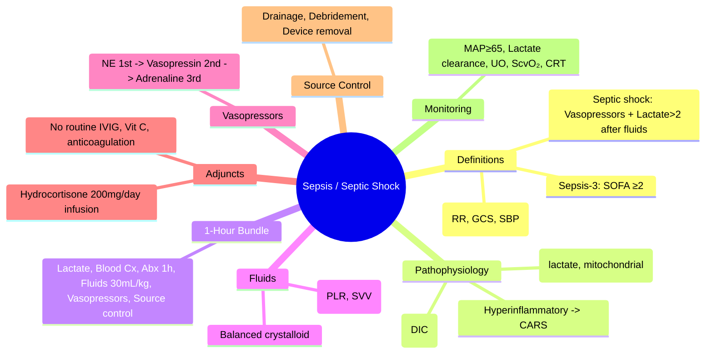
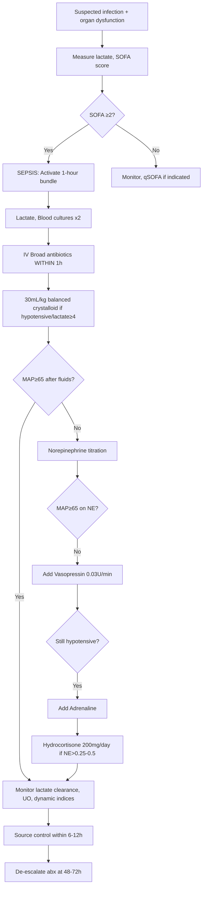

---
tags: [medicine, infectious-disease, davidson, chapter13, sepsis, septic-shock, fcps, mrcp]
davidson_chapter: Chapter 13: Infectious disease
topic_category: General Principles / Sepsis Domain
status: full-fcps-mrcp-topic-note
---

# Sepsis and Septic Shock

Related: [[Fever and Septic Syndrome Approach]], [[Acute Bacterial Meningitis]], [[Brain Abscess]], [[Infective Endocarditis]], [[Post-Transplant Infections]]

> [!important]
> **Sepsis = life-threatening organ dysfunction caused by dysregulated host response to infection.** **Septic shock = sepsis + persisting hypotension requiring vasopressors to maintain MAP ≥65mmHg + lactate >2mmol/L despite adequate fluid resuscitation.** **TIME IS TISSUE — sepsis bundle within 1 hour.** **Source control is as important as antibiotics.**

## Learning Objectives
- Apply Sepsis-3 definitions (SOFA/qSOFA) and identify septic shock
- Execute 1-hour sepsis bundle: lactate, blood cultures, broad antibiotics, fluid resuscitation, vasopressors
- Select empirical antibiotics by suspected source and local epidemiology
- Manage fluid resuscitation, vasopressor escalation (norepinephrine → vasopressin → adrenaline), and adjuncts
- Recognise and treat lactic acidosis, coagulopathy, AKI, ARDS
- Implement source control (drainage, debridement, device removal)
- Understand corticosteroids in septic shock (hydrocortisone 200mg/day)
- Monitor dynamic indices of fluid responsiveness

## Definitions (Sepsis-3, 2016)
| Term | Definition |
|------|------------|
| **Infection** | Suspected/documented pathogen invasion |
| **Sepsis** | **Life-threatening organ dysfunction** caused by dysregulated host response to infection = **SOFA score increase ≥2 points** from baseline |
| **Septic shock** | **Subset of sepsis** with **circulatory, cellular, metabolic abnormalities** substantially increasing mortality: **vasopressor requirement to maintain MAP ≥65mmHg + serum lactate >2mmol/L despite adequate fluid resuscitation** |
| **qSOFA** | **Quick SOFA** (screening tool, NOT diagnostic): RR ≥22, AMS (GCS<15), SBP ≤100mmHg — **≥2 points = high risk for poor outcome** |

> [!tip]
> **SOFA ≥2 = sepsis diagnosis.** **qSOFA ≥2 = screen for ICU referral/early intervention.** Do NOT use qSOFA to rule out sepsis.

## SOFA Score (Sepsis-related Organ Failure Assessment)
| System | 0 | 1 | 2 | 3 | 4 |
|--------|---|---|---|---|---|
| **Respiratory (PaO₂/FiO₂)** | ≥400 | <400 | <300 | <200 (vent) | <100 (vent) |
| **Coagulation (Platelets)** | ≥150 | <150 | <100 | <50 | <20 |
| **Liver (Bilirubin)** | <1.2 | 1.2–1.9 | 2.0–5.9 | 6.0–11.9 | >12.0 |
| **Cardiovascular** | MAP≥70 | MAP<70 | **Dopamine ≤5 or Dobutamine** | **Dopamine >5 or Epi ≤0.1 or NorEpi ≤0.1** | **Dopamine >15 or Epi >0.1 or NorEpi >0.1** |
| **CNS (GCS)** | 15 | 13–14 | 10–12 | 6–9 | <6 |
| **Renal (Creatinine/UO)** | <1.2 | 1.2–1.9 | 2.0–3.4 | 3.5–4.9 / <500mL/d | >5.0 / <200mL/d |

> [!tip]
> **Baseline SOFA assumed 0 if unknown.** Increase ≥2 = sepsis. Cardiovascular SOFA drives septic shock definition.

## Pathophysiology — Dysregulated Host Response
| Phase | Mechanism |
|-------|-----------|
| **Hyperinflammatory** | PAMPs/DAMPs → TLRs → NF-κB → cytokine storm (TNF-α, IL-1, IL-6, IFN-γ) → vasodilation, capillary leak, myocardial depression |
| **Immunosuppressive** (CARS) | Anti-inflammatory cytokines (IL-10, TGF-β), HLA-DR downregulation, lymphocyte apoptosis, endotoxin tolerance → secondary infections |
| **Coagulopathy** | Tissue factor → thrombin → fibrin deposition → DIC; Protein C/S depletion, antithrombin consumption |
| **Metabolic** | Mitochondrial dysfunction → aerobic glycolysis (Warburg effect) → **lactate ↑** (not just hypoperfusion); cytopathic hypoxia |

## 1-Hour Sepsis Bundle (Surviving Sepsis Campaign 2021)
| Action | Target |
|--------|--------|
| **1. Measure lactate** | **Initial + repeat if >2mmol/L** |
| **2. Blood cultures** (×2 sets, aerobic/anaerobic) | **BEFORE antibiotics** (but do NOT delay abx >45min for cultures) |
| **3. Broad-spectrum IV antibiotics** | **Within 1 HOUR** of recognition |
| **4. Fluid resuscitation** | **30mL/kg crystalloid** for hypotension or lactate ≥4mmol/L |
| **5. Vasopressors** | If hypotensive after fluids → **Norepinephrine first-line** to MAP ≥65mmHg |
| **6. Source control** | Identify and intervene within **6–12 hours** (drainage, debridement, device removal) |

## Sepsis-3 Septic Shock Criteria (Clinical)
**ALL 3 must be present:**
1. **Sepsis** (SOFA ≥2 / suspected infection + organ dysfunction)
2. **Vasopressor requirement** to maintain MAP ≥65mmHg
3. **Lactate >2mmol/L** despite **adequate fluid resuscitation** (30mL/kg crystalloid)

> [!warning]
> **Mortality: Sepsis ~25–30%, Septic shock ~40–50%.** Every hour of antibiotic delay ↑ mortality ~7–8%.

## qSOFA (Bedside Screen — NOT for Diagnosis)
| Parameter | Points |
|-----------|--------|
| Respiratory rate ≥22/min | 1 |
| Altered mental status (GCS <15) | 1 |
| Systolic BP ≤100mmHg | 1 |
| **Total ≥2** | **High risk for in-hospital mortality / ICU admission** |

> [!tip]
> **qSOFA ≥2 → activate sepsis protocol, consider ICU, measure lactate, start bundle.** qSOFA sensitivity ~60%, specificity ~80% for sepsis.

## Empirical Antibiotic Selection — Source-Based
| Suspected Source | Empirical Regimen | Key Coverage |
|------------------|-------------------|--------------|
| **Unknown source** (community) | **Piperacillin-tazobactam 4.5g IV 6h** OR **Meropenem 1g IV 8h** + **Vancomycin 15–20mg/kg IV 6h** (if MRSA risk) | Gram-negatives (including Pseudomonas), anaerobes, Gram-positives |
| **Pneumonia (CAP severe)** | Ceftriaxone 2g IV 12h + Azithromycin 500mg IV/PO OD OR Levofloxacin 750mg IV OD | S. pneumoniae, atypicals |
| **Pneumonia (HAP/VAP)** | **Pip-tazo 4.5g 6h OR Meropenem 1g 8h OR Cefepime 2g 8h** + **Vancomycin 15–20mg/kg 6h** (+/- Aztreonam if Pseudomonas) | Pseudomonas, MRSA, Gram-negatives |
| **Intra-abdominal** | **Pip-tazo 4.5g 6h OR Meropenem 1g 8h** + **Vancomycin if MRSA risk** | Enterobacteriaceae, anaerobes (Bacteroides), Enterococcus |
| **UTI / Pyelonephritis** | **Ceftriaxone 2g 12h OR Pip-tazo 4.5g 6h** + **Vancomycin if enterococcal/MRSA risk** | E. coli, Klebsiella, Enterococcus, Pseudomonas |
| **Skin/Soft tissue (necrotising)** | **Pip-tazo 4.5g 6h + Vancomycin 15–20mg/kg 6h + Clindamycin 900mg 8h** | MSSA/MRSA, streptococci, anaerobes, Gram-neg; **clindamycin = toxin suppression** |
| **CNS (meningitis)** | See Acute Bacterial Meningitis note | |
| **Endocarditis (native valve)** | See Infective Endocarditis note | |
| **Febrile neutropenia** | **Pip-tazo 4.5g 6h OR Meropenem 1g 8h** (+ Vancomycin if catheter/HSV/mucositis) | Pseudomonas, Gram-negatives |

> [!important]
> **Vancomycin 15–20mg/kg IV 6h** (trough 15–20) for MRSA coverage. **Add if:** MRSA risk factors (colonisation, prior MRSA, skin/soft tissue, prosthesis, IVDU, hospital exposure). **De-escalate at 48–72h** based on cultures.

## Fluid Resuscitation
| Principle | Detail |
|-----------|--------|
| **Fluid type** | **Balanced crystalloid** (Plasma-Lyte, Ringer's lactate) preferred over 0.9% saline (less hyperchloraemic acidosis, less AKI) |
| **Initial bolus** | **30mL/kg** over 1–3 hours (e.g., 2–3L for 70kg) |
| **Reassessment** | **Dynamic indices** after each bolus: passive leg raise (PLR), stroke volume variation (SVV), pulse pressure variation (PPV), echocardiographic IVC variation |
| **Stopping point** | No fluid responsiveness (ΔSV <10–15% with PLR/500mL bolus) OR signs of fluid overload (pulmonary oedema, rising CVP/JVP) |
| **Albumin** | Consider if large-volume resuscitation (>4–5L crystalloid) or persistent hypoalbuminaemia |
| **Avoid** | Hydroxyethyl starch (HES) — ↑ AKI, mortality; gelatin — similar |

## Vasopressor Escalation
| Agent | Dose | Role | Key Points |
|-------|------|------|------------|
| **Norepinephrine** | **0.01–3μg/kg/min** | **First-line** | α₁ > β₁; ↑ MAP, ↑ SVR, mild ↑ CO; **start peripherally if central line delayed** |
| **Vasopressin** | **0.03U/min (fixed)** | **Second-line (add-on)** | V₁ receptors; spares catecholamines; ↓ norepinephrine dose; **do NOT titrate** |
| **Adrenaline (Epinephrine)** | 0.01–3μg/kg/min | Third-line / alternative | α₁+β₁+β₂; ↑ CO, ↑ HR, ↑ lactate (β₂), arrhythmia risk |
| **Dopamine** | 2–20μg/kg/min | Avoid (arrhythmia, ↑ mortality) | β₁ > α₁ at low dose; α₁ at high; **not recommended** |
| **Phenylephrine** | 0.5–10μg/kg/min | Alternative if tachycardia/arrhythmia | Pure α₁; ↓ CO, ↓ splanchnic perfusion |

> [!tip]
> **MAP target ≥65mmHg** (individualise: chronic HTN may need 70–75mmHg). **Norepinephrine first, add vasopressin 0.03U/min to reduce NE dose, then adrenaline if needed.**

## Adjunctive Therapies
| Therapy | Indication | Dose / Detail |
|---------|------------|---------------|
| **Hydrocortisone** | **Septic shock requiring vasopressors** (NE >0.25–0.5μg/kg/min) | **200mg/day IV continuous infusion OR 50mg IV 6h** ×7–10d taper; **do NOT give bolus** |
| **Vitamin C / Thiamine / Hydrocortisone (HAT)** | Not routinely recommended | Evidence inconsistent (VITAMINS, VICTAS trials negative); not standard |
| **IVIG** | Not routine | Consider in streptococcal/staphylococcal toxic shock, necrotising fasciitis |
| **Anticoagulation** | DIC with thrombosis / VTE prophylaxis | **LMWH prophylactic dose**; therapeutic if VTE; **no routine heparin for DIC** |
| **Renal replacement** | AKI stage 2–3 (KDIGO) | CRRT preferred (haemodynamic stability); early initiation debated |
| **Mechanical ventilation** | ARDS (Berlin criteria) | Low tidal volume 6mL/kg PBW, PEEP table, prone >12h if PaO₂/FiO₂ <150 |

## Source Control — TIME-CRITICAL
| Source | Intervention | Timeline |
|--------|--------------|----------|
| **Abscess / empyema** | Percutaneous drainage / surgical drainage | **Within 6–12h** |
| **Necrotising fasciitis** | **Urgent surgical debridement** (often multiple) | **IMMEDIATE** |
| **Cholangitis** | ERCP ± sphincterotomy / stent | **Within 24h (urgent if septic)** |
| **Infected device (line, prosthesis, pacemaker)** | **Remove device** | **As soon as possible** |
| **Peritonitis (perforated viscus)** | Laparotomy / laparoscopy + washout | **Urgent** |
| **Infected vascular graft** | Surgical excision + extra-anatomic bypass | **Urgent** |

## Monitoring & Targets
| Parameter | Target |
|-----------|--------|
| **MAP** | ≥65mmHg (individualise) |
| **Lactate** | **Clearance ≥10–20% per 2h** (or normalisation) |
| **Urine output** | ≥0.5mL/kg/h |
| **ScvO₂ / SvO₂** | ≥70% / ≥65% (if measured) |
| **Capillary refill time** | <3 seconds (peripheral perfusion) |
| **Skin mottling** | Resolution |
| **Dynamic fluid responsiveness** | PLR ΔSV >10–15% = fluid responsive |

## Complications
| Complication | Management |
|--------------|------------|
| **ARDS** | Low Vt, PEEP, prone, neuromuscular blockade (early), conservative fluids |
| **AKI** | Avoid nephrotoxins, optimise perfusion, CRRT if indicated |
| **DIC** | Treat underlying sepsis; platelets if <10×10⁹/L or bleeding; cryo if fibrinogen <1.5g/L |
| **Myocardial depression** | Echo-guided inotropes (dobutamine 2.5–20μg/kg/min) if low CO despite NE |
| **Immune paralysis** | Secondary infections (fungal, viral, resistant bacteria); HLA-DR monitoring |
| **Critical illness polyneuropathy/myopathy** | Early mobilisation, glycaemic control, avoid prolonged paralysis |

## Special Situations
| Situation | Adjustment |
|-----------|------------|
| **Pregnancy** | Ceftriaxone + azithromycin (avoid fluoroquinolones, doxycycline); norepinephrine first-line; hydrocortisone OK |
| **Immunocompromised** | Broader coverage (antifungal, antiviral, PJP); earlier source control; lower threshold for ICU |
| **Cirrhosis** | Albumin 1g/kg day 1 + 1g/kg day 3 (if SBP); terlipressin for HRS; avoid NSAIDs |
| **Burns** | Parkland formula + sepsis bundle; Pseudomonas/MRSA coverage |
| **Post-cardiac arrest** | Sepsis mimic; therapeutic hypothermia; procalcitonin-guided antibiotics |

## FCPS/MRCP High-Yield Points
- **Sepsis-3: SOFA ≥2 = sepsis; Septic shock = vasopressors + lactate >2 despite 30mL/kg fluids**
- **1-hour bundle: lactate, blood cultures, antibiotics, 30mL/kg crystalloid, vasopressors if needed**
- **Antibiotics within 1 HOUR — every hour delay ↑ mortality ~7–8%**
- **Fluid: balanced crystalloid (Plasma-Lyte/RL) 30mL/kg; reassess with dynamic indices (PLR, SVV)**
- **Vasopressors: Norepinephrine first → add Vasopressin 0.03U/min → Adrenaline third-line**
- **Hydrocortisone 200mg/day IV infusion if NE >0.25–0.5μg/kg/min (not bolus)**
- **Source control within 6–12h (drainage, debridement, device removal)**
- **Lactate clearance ≥10–20%/2h = resuscitation adequacy**
- **De-escalate antibiotics at 48–72h based on cultures**
- **qSOFA ≥2 = screen for ICU referral (RR≥22, GCS<15, SBP≤100)**

## Common Viva Questions
1. **What is the Sepsis-3 definition of septic shock?** Vasopressor requirement to maintain MAP ≥65mmHg + lactate >2mmol/L despite adequate fluid resuscitation (30mL/kg).
2. **What is the 1-hour sepsis bundle?** Lactate, blood cultures (before abx), broad IV antibiotics within 1h, 30mL/kg crystalloid for hypotension/lactate≥4, vasopressors if still hypotensive.
3. **First-line vasopressor in septic shock?** Norepinephrine.
4. **When do you add vasopressin?** As second-line to reduce norepinephrine dose (fixed 0.03U/min).
5. **When do you give hydrocortisone in septic shock?** Vasopressor-dependent shock (NE >0.25–0.5μg/kg/min); 200mg/day IV infusion ×7–10d taper.
6. **What fluid for resuscitation?** Balanced crystalloid (Plasma-Lyte, Ringer's lactate) preferred over 0.9% saline.
7. **How do you assess fluid responsiveness?** Passive leg raise (PLR) with cardiac output monitoring, SVV/PPV (if ventilated, regular rhythm), echo IVC variation.
8. **When do you de-escalate antibiotics?** At 48–72h based on culture results and clinical response.

## Common Confusions / Exam Traps
| Confusion | Clarification |
|-----------|---------------|
| qSOFA diagnoses sepsis | **qSOFA screens risk; SOFA ≥2 diagnoses sepsis** |
| Lactate >4 = septic shock | **Septic shock = vasopressors + lactate >2 AFTER fluids** |
| Give 0.9% saline for resuscitation | **Balanced crystalloid preferred (less AKI, less hyperchloraemic acidosis)** |
| Fluid bolus until CVP 8–12 | **Static CVP unreliable; use dynamic indices (PLR, SVV)** |
| Hydrocortisone as bolus | **Continuous infusion 200mg/day (or 50mg 6h) — bolus not recommended** |
| Dopamine as first-line | **Norepinephrine first-line; dopamine ↑ arrhythmia, mortality** |
| Vasopressin titrated | **Fixed dose 0.03U/min — do NOT titrate** |
| IVIG routine in sepsis | **Only streptococcal/staphylococcal TSS, necrotising fasciitis** |
| Procalcitonin guides antibiotics start | **PCT supports de-escalation/stop; do NOT delay antibiotics for PCT** |
| All septic shock needs central line | **Start norepinephrine peripherally if central access delayed** |

## Mnemonics
- **SEPSIS BUNDLE**: **S**erum lactate, **E**xercise blood cultures, **P**rompt antibiotics (1h), **S**aline 30mL/kg, **I**nitiate vasopressors, **S**ource control (6-12h)
- **VASOPRESSORS**: **N**orepinephrine 1st, **V**asopressin 2nd (0.03U fix), **A**drenaline 3rd, **D**opamine avoid
- **SEPTIC SHOCK**: **S**OFA≥2 + **V**asopressors + **L**actate>2 after fluids = **SVL**
- **FLUID RESPONSE**: **P**LR (gold standard), **S**VV/PPV (ventilated), **E**cho IVC, **C**VP NOT reliable

## Mind Map

## Flowchart

## Suggested Visuals / Image Notes
- Sepsis-3 definitions diagram
- SOFA score table
- Vasopressor escalation algorithm
- Passive leg raise technique
- Source control timeline

## Suggested Video References
- Surviving Sepsis Campaign 2021 guidelines
- SSC hour-1 bundle implementation
- Dynamic fluid responsiveness (PLR, SVV)
- Vasopressor pharmacology
- Hydrocortisone in septic shock (ADRENAL, APROCCHSS trials)

## One-Page Revision Summary
| Topic | Key Points |
|-------|------------|
| **Sepsis-3** | SOFA ≥2 = sepsis; Septic shock = vasopressors + lactate>2 after 30mL/kg fluids |
| **qSOFA** | RR≥22, GCS<15, SBP≤100 — ≥2 = high risk (screen, NOT diagnose) |
| **1-Hour Bundle** | Lactate, Blood Cx, Abx 1h, 30mL/kg crystalloid, Vasopressors, Source control |
| **Fluids** | Balanced crystalloid 30mL/kg; dynamic assessment (PLR, SVV) — NOT CVP |
| **Vasopressors** | NE 1st (0.01–3μg/kg/min) → Vasopressin 0.03U/min 2nd → Adrenaline 3rd |
| **Hydrocortisone** | 200mg/day IV infusion if NE >0.25–0.5; 7–10d taper |
| **Antibiotics** | Source-based, within 1h, de-escalate 48–72h |
| **Source Control** | Drain/debride/remove device within 6–12h |
| **Monitoring** | MAP≥65, Lactate clearance ≥10–20%/2h, UO≥0.5mL/kg/h, CRT<3s |

## 24-Hour Recall Prompts
- Write the 1-hour sepsis bundle.
- Sepsis-3 septic shock definition (3 components).
- Vasopressor escalation order.
- Hydrocortisone indication and dose.
- Fluid type and volume for initial resuscitation.

## 7-Day / 15-Day / 30-Day Revision Tracker
- [ ] Day 1 completed
- [ ] 24-hour recall completed
- [ ] Day 7 revision completed
- [ ] Day 15 revision completed
- [ ] Day 30 revision completed

## Must Know / Should Know / Nice to Know
### Must Know
- Sepsis-3 definitions (SOFA, septic shock, qSOFA)
- 1-hour bundle (lactate, cultures, abx 1h, fluids 30mL/kg, vasopressors)
- Balanced crystalloid, dynamic fluid assessment
- NE → Vasopressin → Adrenaline
- Hydrocortisone 200mg/day infusion for vasopressor-dependent shock
- Source control 6–12h
- Antibiotic de-escalation 48–72h
- Lactate clearance monitoring

### Should Know
- SOFA scoring details
- Pathophysiology phases (hyperinflammatory → CARS)
- Cardiovascular SOFA (vasopressor doses)
- Adjuncts: IVIG indications, DIC management, AKI/ARDS
- Special populations (pregnancy, cirrhosis, immunocompromised)
- Procalcitonin-guided de-escalation

### Nice to Know
- HAT therapy trial data (VITAMINS, VICTAS)
- HLA-DR monitoring for immune paralysis
- Mitochondrial dysfunction in sepsis
- Long-term outcomes (PICS)
- Sepsis biomarkers beyond lactate/PCT

## My Weak Points
- [ ] Exact NE dose equivalents for cardiovascular SOFA
- [ ] Hydrocortisone taper schedule
- [ ] Procalcitonin cut-offs for de-escalation
- [ ] Dynamic indices thresholds (PLR ΔSV, SVV%)

## Self-Test Scorecard
- Understanding: /10
- Recall: /10
- MCQ Performance: /10
- SBA Performance: /10
- Viva Confidence: /10
- Total: /50

> [!tip]
> Interpretation: <35 = weak topic, 35-44 = acceptable but insecure, 45+ = strong exam-ready topic.

## Exam Answer Modes
### Long Answer Skeleton
1. Definitions: Sepsis-3 (SOFA ≥2), septic shock (vasopressors + lactate>2 after fluids), qSOFA (screening)
2. Pathophysiology: hyperinflammatory → immunosuppressive (CARS), coagulopathy, metabolic
3. 1-hour bundle: lactate, blood cultures, antibiotics 1h, 30mL/kg crystalloid, vasopressors, source control
4. Fluid resuscitation: balanced crystalloid, dynamic assessment (PLR, SVV), stopping criteria
5. Vasopressor escalation: NE first, vasopressin second (fixed), adrenaline third, avoid dopamine
6. Adjuncts: hydrocortisone 200mg/day infusion (indication, dose, taper), IVIG (selective), DIC management
6. Source control: drainage, debridement, device removal timelines
7. Monitoring: MAP, lactate clearance, UO, ScvO₂, CRT, mottling
8. Complications: ARDS, AKI, DIC, myocardial depression, immune paralysis
9. Special situations: pregnancy, cirrhosis, immunocompromised, burns

### Short Note Skeleton
- Sepsis = SOFA≥2; Septic shock = vasopressors + lactate>2 after 30mL/kg
- qSOFA: RR≥22, GCS<15, SBP≤100 (≥2 = screen for ICU)
- 1h bundle: lactate, Cx, abx, 30mL/kg crystalloid, vasopressors, source control
- Fluids: balanced crystalloid, PLR/SVV dynamic assessment
- Vasopressors: NE 1st → Vasopressin 0.03U/min 2nd → Adrenaline 3rd
- Hydrocortisone 200mg/day infusion if NE>0.25-0.5
- Source control 6-12h; de-escalate abx 48-72h
- Monitor: MAP≥65, lactate clearance ≥10-20%/2h, UO≥0.5, CRT<3s

### Viva One-Liners
- Sepsis-3: SOFA≥2; Septic shock: vasopressors + lactate>2 after fluids
- 1h bundle: lactate, cultures, abx 1h, 30mL/kg crystalloid, vasopressors, source control
- NE first, vasopressin 0.03U/min fixed second, adrenaline third
- Hydrocortisone 200mg/day infusion for NE-dependent shock
- Balanced crystalloid > saline; PLR > CVP for fluid responsiveness
- Source control 6-12h; abx de-escalate 48-72h

### Ward-Case Discussion Points
- 65M, pneumonia, BP 80/45, lactate 5.2, UO 15mL/h → lactate, Cx, pip-tazo+azithro, 2L RL, NE titration, MAP≥65, lactate clearance, source control (none needed for CAP)
- 40F, necrotising fasciitis, septic shock → lactate, Cx, pip-tazo+vanco+clinda, 30mL/kg RL, NE, urgent surgical debridement (source control), hydrocortisone if NE>0.5
- 70M, cholangitis, septic shock → lactate, Cx, pip-tazo, 30mL/kg RL, NE, ERCP within 24h (urgent if septic)

### Last-Night-Before-Exam Sheet
**SEPSIS:** SOFA≥2. **SEPTIC SHOCK:** Vasopressors + lactate>2 after 30mL/kg fluids. **qSOFA:** RR≥22, GCS<15, SBP≤100 (≥2=ICU screen). **1H BUNDLE:** Lactate, Cx, Abx 1h, 30mL/kg balanced crystalloid, Vasopressors, Source control. **FLUIDS:** RL/Plasma-Lyte, dynamic (PLR, SVV). **VASOPRESSORS:** NE 1st → Vasso 0.03U/min 2nd → Adrenaline 3rd. **STEROIDS:** Hydrocortisone 200mg/day infusion if NE>0.25-0.5. **SOURCE CONTROL:** 6-12h. **DE-ESCALATE:** 48-72h.

## Summary
**Sepsis** = life-threatening organ dysfunction from dysregulated host response to infection = **SOFA score increase ≥2**. **Septic shock** = sepsis subset with **vasopressor requirement to maintain MAP ≥65mmHg + lactate >2mmol/L despite adequate fluid resuscitation (30mL/kg crystalloid)**. **Mortality: sepsis ~25–30%, septic shock ~40–50%.** **1-Hour Bundle:** (1) Measure lactate, (2) Blood cultures ×2 BEFORE antibiotics, (3) **Broad IV antibiotics WITHIN 1 HOUR**, (4) **30mL/kg balanced crystalloid** (Plasma-Lyte/RL) for hypotension/lactate≥4, (5) **Vasopressors** if still hypotensive, (6) **Source control within 6–12h**. **Vasopressor escalation:** **Norepinephrine first-line** (0.01–3μg/kg/min) → **add Vasopressin 0.03U/min fixed** → **Adrenaline third-line**; avoid dopamine. **Hydrocortisone 200mg/day IV continuous infusion** (or 50mg 6h) if norepinephrine >0.25–0.5μg/kg/min; taper 7–10d. **Fluid responsiveness:** passive leg raise (gold standard), SVV/PPV (ventilated), echo IVC — NOT static CVP. **De-escalate antibiotics at 48–72h** based on cultures. **qSOFA ≥2** (RR≥22, GCS<15, SBP≤100) = screen for ICU referral/early intervention.

## MCQs (10)
1. **According to Sepsis-3, septic shock is defined by which combination?**
   A. SOFA ≥2 + lactate >4mmol/L
   B. **Vasopressor requirement for MAP ≥65mmHg + lactate >2mmol/L despite 30mL/kg crystalloid**
   C. qSOFA ≥2 + hypotension + lactate >2mmol/L
   D. SBP <90mmHg + lactate >4mmol/L + oliguria
   E. MAP <65mmHg on fluids + lactate >4mmol/L

2. **What is the recommended initial fluid bolus for sepsis-induced hypotension or lactate ≥4mmol/L?**
   A. 10mL/kg 0.9% saline
   B. **30mL/kg balanced crystalloid (Plasma-Lyte / Ringer's lactate)**
   C. 20mL/kg albumin 5%
   D. 500mL 0.9% saline bolus, repeat to CVP 8–12
   E. 30mL/kg 0.9% saline

3. **First-line vasopressor for septic shock:**
   A. Vasopressin 0.03U/min
   B. **Norepinephrine 0.01–3μg/kg/min**
   C. Adrenaline 0.01–3μg/kg/min
   D. Dopamine 5–20μg/kg/min
   E. Phenylephrine 0.5–10μg/kg/min

4. **Hydrocortisone in septic shock: correct indication and dose?**
   A. All septic shock: 100mg IV bolus 6h
   B. **Vasopressor-dependent shock (NE >0.25–0.5μg/kg/min): 200mg/day IV continuous infusion ×7–10d taper**
   C. Lactate >4mmol/L: 50mg IV 6h
   D. Refractory shock on 3 vasopressors: 300mg/day infusion
   E. Not recommended in any septic shock

5. **Best method to assess fluid responsiveness in a mechanically ventilated patient on norepinephrine?**
   A. CVP target 8–12mmHg
   B. **Stroke volume variation (SVV) or pulse pressure variation (PPV)**
   C. Urine output >0.5mL/kg/h
   D. MAP response to 250mL bolus
   E. Lactate clearance

6. **When should broad-spectrum IV antibiotics be administered in the sepsis bundle?**
   A. Within 3 hours
   B. **Within 1 hour of recognition**
   C. After blood cultures are drawn (no time limit)
   D. After CT scan identifies source
   E. Within 6 hours

7. **Which fluid is preferred for sepsis resuscitation?**
   A. 0.9% saline
   B. **Balanced crystalloid (Plasma-Lyte / Ringer's lactate)**
   C. Albumin 5%
   D. Hydroxyethyl starch 6%
   E. Gelatin

8. **Vasopressin in septic shock: correct dosing?**
   A. 0.01–0.04U/min, titrate to MAP
   B. **Fixed 0.03U/min, do NOT titrate**
   C. 0.06U/min bolus then 0.03U/min
   D. 0.04U/min, increase by 0.01U/min q15min
   E. 2U IV bolus then 0.03U/min

9. **Source control in sepsis should be achieved within:**
   A. 1 hour
   B. **6–12 hours**
   C. 24 hours
   D. 48 hours
   E. Before antibiotics

10. **qSOFA ≥2 indicates:**
    A. Definite sepsis
    B. Septic shock
    C. **High risk for poor outcome / need for ICU referral**
    D. Need for immediate vasopressors
    E. Lactate >4mmol/L

## SBA Questions (10)
1. **A 68-year-old man with community-acquired pneumonia presents with BP 85/50, RR 28, GCS 14, lactate 4.8mmol/L. He receives 30mL/kg Ringer's lactate. Repeat BP 88/52, lactate 4.2. Next step?**
   A. Another 30mL/kg fluid bolus
   B. **Start norepinephrine infusion targeting MAP ≥65mmHg**
   C. Add vasopressin 0.03U/min
   D. Hydrocortisone 200mg/day infusion
   E. Dobutamine for low cardiac output

2. **A 45-year-old woman with necrotising fasciitis is in septic shock on norepinephrine 0.6μg/kg/min, vasopressin 0.03U/min, MAP 62mmHg. Lactate 3.5mmol/L. Best next intervention?**
   A. Increase norepinephrine to 1.0μg/kg/min
   B. Add adrenaline infusion
   C. **Hydrocortisone 200mg/day IV continuous infusion**
   D. IVIG 1g/kg
   E. Transfuse FFP for coagulopathy

3. **In a patient with septic shock from cholangitis, which source control intervention has the strongest evidence for timing?**
   A. Percutaneous drainage within 1 hour
   B. **ERCP within 24 hours (urgent if septic shock)**
   C. Laparoscopic cholecystectomy within 6 hours
   D. IV antibiotics alone for 48 hours before drainage
   E. Endoscopic sphincterotomy within 1 hour

4. **A mechanically ventilated patient on norepinephrine 0.3μg/kg/min receives a 500mL fluid bolus. SVV decreases from 18% to 8%. Interpretation?**
   A. Not fluid responsive
   B. **Fluid responsive (ΔSVV >10–15% or absolute <10–13%)**
   C. Needs vasopressin
   D. Needs dobutamine
   E. SVV unreliable on norepinephrine

5. **Procalcitonin (PCT) use in sepsis: which statement is CORRECT?**
   A. PCT <0.25 rules out sepsis — withhold antibiotics
   B. PCT guides initial antibiotic selection
   C. **PCT supports de-escalation/discontinuation (e.g., drop >80% or <0.25)**
   D. PCT >10 confirms septic shock
   E. PCT replaces lactate for resuscitation monitoring

6. **A 30-year-old pregnant woman (28 weeks) develops septic shock from pyelonephritis. Vasopressor choice?**
   A. Dopamine (safe in pregnancy)
   B. **Norepinephrine (first-line in pregnancy)**
   C. Vasopressin (preferred in pregnancy)
   D. Adrenaline (first-line in pregnancy)
   E. Phenylephrine only

7. **Which patient with sepsis should receive empirical antifungal coverage?**
   A. All septic shock patients
   B. **Immunocompromised (prolonged neutropenia, transplant, high-dose steroids) with risk factors**
   C. Community-acquired pneumonia with sepsis
   D. Post-operative sepsis day 2
   E. UTI sepsis with diabetes

8. **Hydrocortisone taper in septic shock (standard 7–10 day course):**
   A. Stop abruptly after shock resolves
   B. **50mg 6h ×2d → 25mg 6h ×2d → 25mg 12h ×2d → 25mg 24h ×2d → stop**
   C. 100mg 6h ×3d → 50mg 6h ×3d → stop
   D. 200mg/day infusion ×7d → stop abruptly
   E. No taper needed if <7 days

9. **A patient with septic shock has lactate 8mmol/L initially. After 2 hours of resuscitation (fluids, NE, source control), lactate 6mmol/L. Assessment?**
   A. Inadequate resuscitation (clearance <10%)
   B. **Adequate (clearance 25% >10–20% target)**
   C. Need more fluids
   D. Add vasopressin
   E. Start CRRT

10. **In febrile neutropenia (absolute neutrophil count <500), empirical antibiotic regimen?**
    A. Ceftriaxone + Azithromycin
    B. **Piperacillin-tazobactam 4.5g IV 6h OR Meropenem 1g IV 8h** (+/- Vancomycin if catheter/mucositis)
    C. Vancomycin + Meropenem
    D. Ciprofloxacin + Clindamycin
    E. Ceftriaxone + Metronidazole

## Flashcards
- Q: Sepsis-3 sepsis definition
  A: SOFA score increase ≥2 points from baseline
- Q: Sepsis-3 septic shock definition
  A: Vasopressors for MAP≥65 + lactate>2 despite 30mL/kg fluids
- Q: qSOFA components
  A: RR≥22, GCS<15, SBP≤100 (≥2 = high risk screen)
- Q: 1-hour bundle
  A: Lactate, Blood Cx, Abx 1h, 30mL/kg balanced crystalloid, Vasopressors, Source control
- Q: Fluid type
  A: Balanced crystalloid (Plasma-Lyte/RL) > 0.9% saline
- Q: Fluid responsiveness
  A: PLR (gold), SVV/PPV (ventilated), echo IVC — NOT CVP
- Q: Vasopressor order
  A: NE 1st → Vasopressin 0.03U/min fixed 2nd → Adrenaline 3rd
- Q: Hydrocortisone
  A: 200mg/day infusion if NE>0.25-0.5; 7-10d taper
- Q: Source control timing
  A: 6-12h (immediate for necrotising fasciitis)
- Q: Antibiotic de-escalation
  A: 48-72h based on cultures
- Q: Lactate clearance target
  A: ≥10-20% per 2h
- Q: PCT role
  A: De-escalation/discontinuation (drop >80% or <0.25)

## Answer Key with Explanations
### MCQs
1. **B** — Sepsis-3 septic shock: vasopressor requirement for MAP≥65 + lactate>2mmol/L despite adequate fluid resuscitation (30mL/kg crystalloid).
2. **B** — 30mL/kg balanced crystalloid (Plasma-Lyte/RL) preferred over 0.9% saline (less hyperchloraemic acidosis, less AKI).
3. **B** — Norepinephrine is first-line vasopressor for septic shock.
4. **B** — Hydrocortisone 200mg/day IV continuous infusion (or 50mg 6h) if vasopressor-dependent (NE >0.25–0.5μg/kg/min); taper 7–10d.
5. **B** — Dynamic indices: SVV/PPV (if ventilated, regular rhythm, tidal volume ≥8mL/kg) or PLR with CO monitoring. CVP static = unreliable.
6. **B** — Antibiotics within 1 HOUR of sepsis recognition. Every hour delay increases mortality ~7–8%.
7. **B** — Balanced crystalloid preferred over 0.9% saline (less AKI, less hyperchloraemic metabolic acidosis).
8. **B** — Vasopressin fixed dose 0.03U/min, do NOT titrate. Added to reduce norepinephrine dose.
9. **B** — Source control (drainage, debridement, device removal) within 6–12 hours. Necrotising fasciitis = immediate.
10. **C** — qSOFA ≥2 = screening tool for high risk of poor outcome/ICU referral; NOT diagnostic for sepsis.

### SBAs
1. **B** — After 30mL/kg fluids, still hypotensive (MAP<65) → start norepinephrine. Lactate not cleared adequately.
2. **C** — NE 0.6μg/kg/min (>0.5) = vasopressor-dependent shock → hydrocortisone 200mg/day infusion indicated.
3. **B** — Cholangitis with septic shock: ERCP within 24h (urgent if septic). Tokyo guidelines.
4. **B** — SVV decreased from 18% to 8% = fluid responsive (SVV <10–13% or Δ>10–15%).
5. **C** — PCT supports de-escalation/discontinuation (e.g., >80% drop or <0.25). Do NOT use to withhold initial antibiotics.
6. **B** — Norepinephrine first-line in pregnancy (and all adults). Dopamine not preferred (arrhythmia).
7. **B** — Empirical antifungals for immunocompromised with risk factors (neutropenia, transplant, steroids), not routine.
8. **B** — Standard taper: 50mg 6h ×2d → 25mg 6h ×2d → 25mg 12h ×2d → 25mg 24h ×2d → stop (7–10d total).
9. **B** — Lactate clearance = (8-6)/8 = 25% > 10–20% target = adequate resuscitation.
10. **B** — Febrile neutropenia: Pip-tazo or Meropenem monotherapy (antipseudomonal β-lactam); add vancomycin if catheter/mucositis/hemodynamically unstable.

---