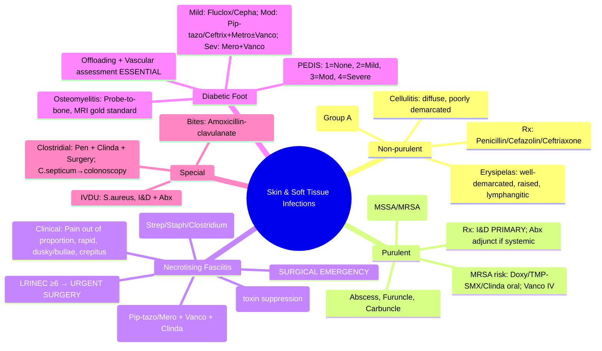

---
tags: [medicine, infectious-disease, davidson, chapter13, ssti, cellulitis, necrotising-fasciitis, diabetic-foot, fcps, mrcp]
davidson_chapter: Chapter 13: Infectious disease
topic_category: Skin and Soft Tissue Infections Domain
status: full-fcps-mrcp-topic-note
---

# Skin and Soft Tissue Infections (SSTI)

Related: [[Sepsis and Septic Shock]], [[Diabetic Foot Infection]], [[Bone and Joint Infections]], [[Clostridioides difficile Infection]], [[Antimicrobial Stewardship]]

> [!important]
> **SSTI = infection of skin, subcutaneous tissue, fascia, muscle.** **Classification: non-purulent (cellulitis, erysipelas) vs purulent (abscess, furuncle, carbuncle).** **Severity: mild, moderate, severe (sepsis, necrotising).** **Non-purulent: β-haemolytic streptococci (Group A) → Penicillin/Cefazolin/Ceftriaxone.** **Purulent: S. aureus (MSSA/MRSA) → drainage + anti-staph.** **Necrotising fasciitis = SURGICAL EMERGENCY (LRINEC ≥6); broad antibiotics + urgent debridement.** **Diabetic foot: PEDIS classification; osteomyelitis probe-to-bone; offloading + vascular assessment.**

## Learning Objectives
- Classify SSTI: non-purulent vs purulent; mild/moderate/severe/necrotising
- Diagnose using clinical features, LRINEC score for necrotising fasciitis
- Select empirical antibiotics by type, severity, MRSA risk
- Manage abscess: incision & drainage primary; antibiotics adjunct
- Recognise and urgently manage necrotising fasciitis (LRINEC, surgery)
- Classify and manage diabetic foot infections (PEDIS, IDSA/IWGDF)
- Determine treatment duration and IV→oral switch

## Classification
| Category | Subtypes | Typical Pathogens |
|----------|----------|-------------------|
| **Non-purulent** | Cellulitis, Erysipelas | **β-haemolytic streptococci (Group A, C, G)**, *S. aureus* (less common) |
| **Purulent** | Abscess, Furuncle, Carbuncle, Infected wound | **S. aureus (MSSA/MRSA)**, *Streptococci* |
| **Necrotising** | Necrotising fasciitis, Myonecrosis (clostridial/non-clostridial) | **Polymicrobial** (Type I) or **Group A Strep / S. aureus / Clostridium** (Type II) |
| **Device-related** | IV site infection, Surgical site infection (SSI) | *S. aureus*, CoNS, Gram-neg, *Enterococcus* |
| **Special** | Diabetic foot, Animal/human bite, Burn wound, Immunocompromised | Varies |

## Clinical Features & Diagnosis
### Non-purulent Cellulitis/Erysipelas
| Feature | Cellulitis | Erysipelas |
|---------|------------|------------|
| **Depth** | Subcutaneous tissue | Superficial dermis + lymphatics |
| **Appearance** | Diffuse, poorly demarcated erythema, warmth, swelling | **Well-demarcated, raised, shiny erythema** |
| **Lymphatics** | Not prominent | **Lymphangitic streaking** |
| **Systemic** | Variable | Often high fever, rigors |
| **Common site** | Lower leg | Face, lower leg |

### Purulent (Abscess)
- Fluctuant, tender mass with surrounding erythema
- **Incision & drainage = PRIMARY treatment; antibiotics adjunct**

### Necrotising Fasciitis — SURGICAL EMERGENCY
| Clinical Clue | Significance |
|---------------|--------------|
| **Pain out of proportion to exam** | Early hallmark |
| **Rapid progression** (hours) | |
| **Skin changes**: erythema → dusky → bullae → necrosis | |
| **Crepitus** (gas in tissues) | Clostridial / polymicrobial |
| **Systemic toxicity**: sepsis, delirium, hypotension | |
| **LRINEC score ≥6** | High probability (see below) |

### LRINEC Score (Laboratory Risk Indicator for Necrotising Fasciitis)
| Parameter | Points |
|-----------|--------|
| **CRP >150 mg/L** | 4 |
| **WCC >25 ×10⁹/L** | 2 |
| **WCC <15 ×10⁹/L** | 1 |
| **Hb <11 g/dL** | 1 |
| **Na <135 mmol/L** | 2 |
| **Creatinine >1.6 mg/dL (141 μmol/L)** | 2 |
| **Glucose >10 mmol/L (180 mg/dL)** | 1 |

| Score | Probability |
|-------|-------------|
| **≥6** | High (>75%) — **Urgent surgical exploration** |
| 4–5 | Moderate |
| ≤3 | Low |

> [!critical]
> **LRINEC ≥6 = URGENT SURGICAL EXPLORATION.** **Do NOT delay for MRI/CT if clinical suspicion high.** **Time to debridement = survival.**

## Empirical Antibiotic Therapy
### Non-purulent Cellulitis/Erysipelas (β-haemolytic Strep dominant)
| Severity | Regimen | Duration |
|----------|---------|----------|
| **Mild (afebrile, no sepsis, small area)** | **Flucloxacillin 500mg PO 6h** OR **Cephalexin 500mg PO 6h** OR **Cefazolin 1g IV 8h** (if IV needed) | **5–7 days** |
| **Moderate (febrile, spreading, comorbidities)** | **Cefazolin 2g IV 8h** OR **Ceftriaxone 2g IV 24h** OR **Penicillin G 1.2MU IV 4–6h** | 7–10 days (IV→oral at stability) |
| **Severe (sepsis, rapid progression, immunocompromised)** | **Ceftriaxone 2g IV 24h + Flucloxacillin 2g IV 6h** (covers strep + staph) | 10–14 days |
| **Penicillin allergy (anaphylaxis)** | **Clindamycin 600mg IV/PO 6h** OR **Vancomycin 15–20mg/kg IV 6h** | 7–10 days |

### Purulent SSTI (Abscess, MSSA/MRSA)
| Step | Action |
|------|--------|
| **1. Incision & Drainage (I&D)** | **PRIMARY treatment** — adequate drainage, culture purulent material |
| **2. Antibiotics** | **Adjunct** if: severe/extensive, rapid progression, comorbidities, immunocompromised, failed I&D alone, SIRS/sepsis, extremes of age |
| **Mild/Moderate (post-I&D, no systemic signs)** | **Often NO antibiotics needed if adequate drainage** |

| If Antibiotics Indicated | Regimen | Duration |
|-------------------------|---------|----------|
| **Low MRSA risk** (community, no risk factors) | **Flucloxacillin 500mg PO 6h** OR **Cefazolin 1g IV 8h** | 5–7 days |
| **High MRSA risk** (known MRSA, prior MRSA, healthcare, incarceration, IVDU, sports teams) | **Doxycycline 100mg PO 12h** OR **TMP-SMX 160/800mg PO 12h** OR **Clindamycin 300mg PO 6h** (if susceptible) | 5–7 days |
| **Severe/Sepsis (IV needed)** | **Vancomycin 15–20mg/kg IV 6h** (trough 15–20) | 7–10 days |

> [!key]
> **Abscess: I&D PRIMARY; antibiotics only if systemic signs/comorbidities.** **MRSA: Doxy/TMP-SMX/Clinda oral; Vancomycin IV.**

### Necrotising Fasciitis
| Type | Pathogens | Empirical Regimen |
|------|-----------|-------------------|
| **Type I (Polymicrobial)** | Gram-neg + Anaerobes + Enterococcus ± Strep | **Pip-tazo 4.5g IV 6h** OR **Meropenem 1g IV 8h** + **Vancomycin 15–20mg/kg IV 6h** + **Clindamycin 600mg IV 6h** (toxin suppression) |
| **Type II (Monomicrobial)** | Group A Strep **OR** S. aureus (MSSA/MRSA) **OR** *Clostridium* | **Ceftriaxone 2g IV 24h + Flucloxacillin 2g IV 6h + Clindamycin 600mg IV 6h** (if Strep/Staph) OR **Pip-tazo + Vancomycin + Clindamycin** (if uncertain) |
| **Clostridial myonecrosis (gas gangrene)** | *C. perfringens*, *C. septicum* | **Penicillin G 4MU IV 4h + Clindamycin 600mg IV 6h** + **URGENT SURGERY** |

> [!critical]
> **Necrotising fasciitis: CLINDAMYCIN ESSENTIAL** (protein synthesis inhibitor → toxin suppression). **Surgery = definitive; antibiotics adjunct.** **Multiple debridements often needed.**

### Diabetic Foot Infection — IDSA/IWGDF PEDIS Classification
| Grade | Definition |
|-------|------------|
| **1** | No infection |
| **2 (Mild)** | **Superficial** (≥2 signs inflammation: erythema, warmth, swelling, pain, purulent), **<2cm**, **no systemic signs** |
| **3 (Moderate)** | **Deeper** (abscess, osteomyelitis, septic arthritis, fasciitis) OR **>2cm** OR **systemic signs** (fever, leukocytosis) but **stable** |
| **4 (Severe)** | **Systemic sepsis** (hypotension, confusion, tachycardia, tachypnoea, fever/hypothermia) |

| Severity | Pathogens | Empirical Antibiotics |
|----------|-----------|----------------------|
| **Mild (Grade 2)** | **MSSA, β-haemolytic Strep** (usually monomicrobial) | **Flucloxacillin 500mg PO 6h** OR **Cephalexin 500mg PO 6h** OR **Clindamycin 300mg PO 6h** |
| **Moderate (Grade 3)** | **Polymicrobial**: MSSA/MRSA, Strep, Gram-neg (*E. coli*, *Klebsiella*, *Pseudomonas*), Anaerobes | **Pip-tazo 4.5g IV 6h** OR **Ceftriaxone 2g IV 24h + Metronidazole 500mg IV 8h** +/− **Vancomycin** (if MRSA risk) |
| **Severe (Grade 4)** | **Polymicrobial MDR** | **Meropenem 1g IV 8h + Vancomycin 15–20mg/kg IV 6h** OR **Pip-tazo + Vancomycin** |

> [!tip]
> **Osteomyelitis diagnosis: Probe-to-bone test (positive = high likelihood); MRI gold standard; plain X-ray changes late.**
> **Offloading (total contact cast) + Vascular assessment (ABI, TBI, referral) = ESSENTIAL non-antibiotic management.**
> **Duration: Mild 1–2w; Moderate 2–4w; Severe 4–6w; Osteomyelitis 6w (if no resection) or 2w post-resection.**

## IV to Oral Switch Criteria
| Criteria | Threshold |
|----------|-----------|
| **Afebrile** | ≥24–48h |
| **Haemodynamically stable** | No vasopressors, HR <100, SBP >90 |
| **Improving clinical signs** | Decreasing erythema, pain, swelling |
| **Ability to tolerate oral** | No nausea/vomiting/ileus |
| **Available oral agent** | With appropriate spectrum |

## Treatment Duration
| Syndrome | Duration |
|----------|----------|
| **Non-purulent cellulitis** | **5–7 days** (extend to 10–14d if slow response) |
| **Abscess (post-I&D, antibiotics indicated)** | **5–7 days** |
| **Necrotising fasciitis** | **10–14 days** post-debridement (adjust per clinical course) |
| **Diabetic foot (mild)** | **1–2 weeks** |
| **Diabetic foot (moderate)** | **2–4 weeks** |
| **Diabetic foot (severe, osteomyelitis)** | **4–6 weeks** (6w if no resection; 2w post-resection) |

## Special Situations
| Scenario | Key Points |
|----------|------------|
| **Animal/Human bite** | **Amoxicillin-clavulanate 625mg PO 8h** (covers Pasteurella, Capnocytophaga, Eikenella, anaerobes) |
| **Burn wound infection** | Pseudomonas, Staph, Strep; topical + systemic; excision + graft |
| **Surgical site infection (SSI)** | Superficial: open, drain; Deep/Organ space: re-explore, drain |
| **Immunocompromised** | Broader coverage (Pseudomonas, fungi, Nocardia, mycobacteria); MRI for depth |
| **IVDU (injection site)** | S. aureus (MSSA/MRSA), Strep, Gram-neg; abscess → I&D + antibiotics |
| **Water exposure (marine)** | *Vibrio vulnificus* (severe, necrotising); *Aeromonas*, *Mycobacterium marinum* |
| **Necrotising fasciitis — Clostridial** | Penicillin + Clindamycin + Surgery; *C. septicum* → occult colonic malignancy (colonoscopy) |

## FCPS/MRCP High-Yield Points
- **Non-purulent (cellulitis/erysipelas): β-haemolytic Strep → Penicillin/Cefazolin/Ceftriaxone**
- **Purulent (abscess): S. aureus → I&D PRIMARY; antibiotics adjunct if systemic/comorbidities**
- **MRSA risk factors: known MRSA, healthcare, incarceration, IVDU, sports teams → Doxy/TMP-SMX/Clinda oral; Vanco IV**
- **Necrotising fasciitis: SURGICAL EMERGENCY; LRINEC ≥6 → urgent exploration; CLINDAMYCIN essential (toxin suppression)**
- **Type I = polymicrobial (Pip-tazo/Mero + Vanco + Clinda); Type II = Group A Strep/Staph/Clostridium**
- **Diabetic foot: PEDIS grades 1–4; Mild: Fluclox/Cephalexin; Moderate: Pip-tazo/Ceftriaxone+Metro ± Vanco; Severe: Mero + Vanco**
- **Osteomyelitis: Probe-to-bone; MRI gold standard; offloading + vascular assessment essential**
- **Duration: Cellulitis 5–7d; Abscess 5–7d; Necrotising 10–14d; Diabetic foot mild 1–2w, mod 2–4w, severe/osteo 4–6w**
- **Bites: Amoxicillin-clavulanate (Pasteurella, Eikenella, anaerobes)**
- **Clostridial myonecrosis: Penicillin + Clindamycin + Surgery; C. septicum → colonoscopy**

## Common Viva Questions
1. **Difference between cellulitis and erysipelas?** Cellulitis = deeper, poorly demarcated; Erysipelas = superficial, well-demarcated raised border, lymphangitic streaking.
2. **Primary treatment of skin abscess?** Incision & drainage. Antibiotics adjunct only if systemic signs/comorbidities.
3. **When do you suspect necrotising fasciitis?** Pain out of proportion, rapid progression, skin changes (dusky/bullae), crepitus, sepsis, LRINEC ≥6.
4. **LRINEC score components?** CRP>150 (4), WCC>25 (2), WCC<15 (1), Hb<11 (1), Na<135 (2), Cr>1.6 (2), Glucose>10 (1). ≥6 = high probability.
5. **Empirical antibiotics for necrotising fasciitis?** Type I: Pip-tazo/Mero + Vanco + Clinda; Type II: Ceftriaxone + Fluclox + Clinda; Clostridial: Pen + Clinda.
6. **Why is clindamycin essential in necrotising fasciitis?** Protein synthesis inhibitor → suppresses toxin production (streptococcal/staphylococcal).
7. **Diabetic foot infection classification (PEDIS)?** Grade 1: none; 2: mild superficial <2cm; 3: moderate deep/>2cm/systemic stable; 4: severe sepsis.
8. **Mild diabetic foot empirical antibiotics?** Flucloxacillin or Cephalexin (covers MSSA, Strep).
9. **Osteomyelitis diagnosis in diabetic foot?** Probe-to-bone test (clinical); MRI (gold standard); X-ray late.
10. **Animal bite prophylaxis?** Amoxicillin-clavulanate (covers Pasteurella, Capnocytophaga, Eikenella, anaerobes).

## Common Confusions / Exam Traps
| Confusion | Clarification |
|-----------|---------------|
| Antibiotics primary for abscess | **I&D PRIMARY; antibiotics adjunct** |
| Flucloxacillin covers Strep well | **Flucloxacillin = anti-staph; poor Strep coverage. Cellulitis/erysipelas = Strep dominant → Penicillin/Cefazolin/Ceftriaxone** |
| MRSA coverage for all purulent | **Only if risk factors present** |
| LRINEC ≥6 = diagnose NF | **LRINEC ≥6 = high probability; clinical suspicion + urgent surgery = diagnosis** |
| MRI before surgery for NF | **Clinical suspicion + LRINEC ≥6 = URGENT SURGERY; do NOT delay for imaging** |
| Diabetic foot = always osteomyelitis | **Probe-to-bone + MRI for diagnosis; not all ulcers have osteomyelitis** |
| Offloading optional in diabetic foot | **Offloading (total contact cast) ESSENTIAL** |
| Clindamycin for all cellulitis | **Clindamycin = alternative for penicillin allergy; 1st line = Penicillin/Cefazolin/Ceftriaxone** |
| Necrotising fasciitis = always polymicrobial | **Type II = monomicrobial (Group A Strep, S. aureus, Clostridium)** |
| C. septicum = only wound infection | **C. septicum bacteraemia/myonecrosis → OCCULT COLONIC MALIGNANCY (colonoscopy)** |

## Mnemonics
- **CELLULITIS vs ERYSIPELAS**: **C**ellulitis = **C**onfusing borders, **C**ommon leg; **E**rysipelas = **E**xquisite borders, **E**levated, **E**nter lymphatics
- **ABSCESS**: **I**ncision & **D**rainage = **P**RIMARY; **A**b**x** = **A**DJUNCT
- **NF CLINICAL**: **P**ain out of proportion, **R**apid progression, **S**kin changes (dusky/bullae), **C**repitus, **S**epsis
- **LRINEC**: **C**RP>150 (**4**), **W**CC>25 (**2**)/<15 (**1**), **H**b<11 (**1**), **N**a<135 (**2**), **C**r>1.6 (**2**), **G**lucose>10 (**1**) → **≥6 = HIGH**
- **NF TYPES**: **T**ype **I** = **P**oly**M**icrobial (Pip-tazo/Mero); **T**ype **II** = **M**ono (Strep/Staph/Clostridial)
- **CLINDA**: **T**oxin **S**uppression (protein synthesis inhibitor) = **E**SSENTIAL in NF
- **PEDIS**: **G**rade **1**=None, **2**=**M**ild (<2cm superficial), **3**=**M**od (deep/>2cm/systemic stable), **4**=**S**evere (sepsis)
- **DF MILD**: **F**luclox/**C**epha (Staph/Strep); **MOD**: **P**ip-tazo/**C**eftriaxone+**M**etro ± **V**anco; **SEV**: **M**ero+**V**anco
- **OSTEOMYELITIS**: **P**robe-to-**B**one; **M**RI gold standard
- **BITES**: **A**moxicillin-**C**lavulanate (Pasteurella, Eikenella, Capno, anaerobes)

## Mind Map


## Flowchart
```mermaid
flowchart TD
  A[Suspected SSTI] --> B{Purulent?}
  B -->|No (Cellulitis/Erysipelas)| C[β-haemolytic Strep dominant]
  C --> D{Severity}
  D -->|Mild| E[Fluclox/Cephalexin PO 5-7d]
  D -->|Moderate| F[Cefazolin/Ceftriaxone IV 7-10d]
  D -->|Severe| G[Ceftriaxone + Fluclox IV 10-14d]
  B -->|Yes (Abscess)| H[INCISION & DRAINAGE PRIMARY]
  H --> I{Systemic signs / Comorbidities?}
  I -->|No| J[Often NO antibiotics needed]
  I -->|Yes| K{MRSA Risk?}
  K -->|Low| L[Fluclox/Cephalexin 5-7d]
  K -->|High| M[Doxy/TMP-SMX/Clinda oral OR Vanco IV 5-7d]
  A --> N{Necrotising Fasciitis?}
  N -->|Clinical suspicion + LRINEC≥6| O[URGENT SURGICAL DEBRIDEMENT]
  O --> P{Type?}
  P -->|Type I Polymicrobial| Q[Pip-tazo/Mero + Vanco + CLINDA]
  P -->|Type II Monomicrobial| R[Ceftriaxone + Fluclox + CLINDA]
  P -->|Clostridial| S[Penicillin + CLINDA + SURGERY]
```

## Suggested Visuals / Image Notes
- Cellulitis vs erysipelas comparison
- LRINEC score calculator
- Necrotising fasciitis clinical progression
- Diabetic foot PEDIS classification
- Probe-to-bone test
- I&D technique

## Suggested Video References
- Necrotising fasciitis recognition and management
- Diabetic foot infection classification and treatment
- Abscess incision and drainage technique
- LRINEC score validation
- Clostridial myonecrosis

## One-Page Revision Summary
| Topic | Key Points |
|-------|------------|
| **Non-purulent** | Cellulitis (diffuse) vs Erysipelas (demarcated, raised); Strep dominant → Pen/Cefazolin/Ceftriaxone |
| **Purulent (Abscess)** | **I&D PRIMARY**; Abx adjunct if systemic/comorbidities; MRSA risk → Doxy/TMP-SMX/Clinda (oral), Vanco (IV) |
| **Necrotising Fasciitis** | **SURGICAL EMERGENCY**; Pain out of proportion, LRINEC ≥6 → urgent surgery; **CLINDA ESSENTIAL** |
| **NF Type I** | Polymicrobial → Pip-tazo/Mero + Vanco + Clinda |
| **NF Type II** | Monomicrobial (Strep/Staph/Clostridial) → Ceftriaxone+Fluclox+Clinda (Strep/Staph) or Pen+Clinda (Clostridial) |
| **Diabetic Foot PEDIS** | 2=Mild (Fluclox/Cepha); 3=Mod (Pip-tazo/Ceftrix+Metro±Vanco); 4=Severe (Mero+Vanco) |
| **Osteomyelitis** | Probe-to-bone; MRI gold standard; Offloading + Vascular ESSENTIAL |
| **Duration** | Cellulitis 5-7d; Abscess 5-7d; NF 10-14d; DF Mild 1-2w, Mod 2-4w, Sev/Osteo 4-6w |
| **Bites** | Amoxicillin-clavulanate |
| **C. septicum** | Colonoscopy (occult colonic malignancy) |

## 24-Hour Recall Prompts
- Cellulitis vs erysipelas differences.
- Abscess primary treatment.
- Necrotising fasciitis clinical clues.
- LRINEC score components and threshold.
- NF empirical regimens (Type I, Type II, Clostridial).
- Why clindamycin in NF?
- Diabetic foot PEDIS grades and antibiotics.
- Osteomyelitis diagnosis.
- Bite prophylaxis.
- C. septicum association.

## 7-Day / 15-Day / 30-Day Revision Tracker
- [ ] Day 1 completed
- [ ] 24-hour recall completed
- [ ] Day 7 revision completed
- [ ] Day 15 revision completed
- [ ] Day 30 revision completed

## Must Know / Should Know / Nice to Know
### Must Know
- Non-purulent: Strep → Pen/Cefazolin/Ceftriaxone
- Purulent: I&D primary; MRSA risk → Doxy/TMP-SMX/Clinda (oral), Vanco (IV)
- NF: Surgical emergency; LRINEC ≥6 → urgent surgery; Clindamycin essential (toxin suppression)
- NF Type I: Pip-tazo/Mero + Vanco + Clinda; Type II: Ceftriaxone+Fluclox+Clinda; Clostridial: Pen+Clinda
- Diabetic foot PEDIS: Mild=Fluclox/Cepha; Mod=Pip-tazo/Ceftrix+Metro±Vanco; Sev=Mero+Vanco
- Osteomyelitis: Probe-to-bone; MRI gold standard; Offloading + Vascular essential
- Duration: Cellulitis 5-7d; Abscess 5-7d; NF 10-14d; DF varies by grade

### Should Know
- Erysipelas vs cellulitis nuances
- MRSA risk factors detail
- LRINEC score validation and limitations
- Clostridial species differences (perfringens vs septicum)
- Diabetic foot offloading techniques
- Vascular assessment (ABI, TBI, referral thresholds)
- Immunocompromised SSTI broadening

### Nice to Know
- Novel diagnostics (POC ultrasound, biomarkers)
- Biofilm in chronic wounds
- Topical antimicrobials
- Maggot therapy
- Necrotising fasciitis scoring alternatives (Fournier's gangrene severity score)

## My Weak Points
- [ ] Exact LRINEC point breakdown memorisation
- [ ] Diabetic foot antibiotic duration evidence base
- [ ] Clindamycin dosing in NF (600mg vs 900mg)
- [ ] Vascular assessment thresholds for referral
- [ ] Fournier's gangrene specific management

## Self-Test Scorecard
- Understanding: /10
- Recall: /10
- MCQ Performance: /10
- SBA Performance: /10
- Viva Confidence: /10
- Total: /50

> [!tip]
> Interpretation: <35 = weak topic, 35-44 = acceptable but insecure, 45+ = strong exam-ready topic.

## Exam Answer Modes
### Long Answer Skeleton
1. Classification (non-purulent, purulent, necrotising, device-related, special)
2. Non-purulent: cellulitis vs erysipelas, pathogens, treatment
3. Purulent: abscess I&D primary, antibiotics adjunct, MRSA risk
4. Necrotising fasciitis: clinical clues, LRINEC, types, empirical regimens, clindamycin role
5. Diabetic foot: PEDIS classification, pathogens by grade, empirical antibiotics, osteomyelitis, offloading
6. Special: bites, burns, SSI, IVDU, water exposure, immunocompromised
7. Duration and IV→oral switch

### Short Note Skeleton
- Non-purulent: Strep dominant → Pen/Cefazolin/Ceftriaxone 5-7d
- Purulent: I&D primary; Abx if systemic → MSSA: Fluclox; MRSA: Doxy/TMP-SMX/Clinda oral, Vanco IV
- NF: SURGICAL EMERGENCY; Pain out of proportion, LRINEC≥6 → surgery; CLINDA essential
- Type I: Pip-tazo/Mero+Vanco+Clinda; Type II: Ceftriaxone+Fluclox+Clinda; Clostridial: Pen+Clinda
- DF PEDIS: 2=Mild Fluclox/Cepha; 3=Mod Pip-tazo/Ceftrix+Metro±Vanco; 4=Sev Mero+Vanco
- Osteomyelitis: Probe-to-bone, MRI; Offloading+Vascular essential
- Bites: Amox-clav; C.septicum→colonoscopy

### Viva One-Liners
- Cellulitis: Strep → Pen/Cefazolin/Ceftriaxone
- Abscess: I&D primary; Abx adjunct
- NF: Surgery emergency; LRINEC≥6; Clinda toxin suppression
- Type I NF: Pip-tazo/Mero+Vanco+Clinda; Type II: Ceftrix+Fluclox+Clinda
- DF: PEDIS 2=Fluclox; 3=Pip-tazo/Ceftrix+Metro±Vanco; 4=Mero+Vanco
- Osteomyelitis: Probe-to-bone, MRI; Offload+Vascular
- Bites: Amox-clav

### Ward-Case Discussion Points
- 45M, lower leg cellulitis, spreading, febrile → Ceftriaxone 2g IV 24h ×2d → Cephalexin 500mg 6h ×5d total
- 30M IVDU, groin abscess, MRSA nasal carrier → I&D + Doxycycline 100mg 12h ×7d (or TMP-SMX)
- 60F diabetic, foot ulcer 3cm, probe-to-bone positive, no systemic signs → Moderate DF (Grade 3); Pip-tazo IV → step-down; offloading cast; vascular referral
- 50M, severe thigh pain, dusky skin, bullae, creatinine 200, CRP 200 → LRINEC ≥6 → URGENT debridement + Pip-tazo + Vancomycin + Clindamycin

### Last-Night-Before-Exam Sheet
**SSTI:** Non-purulent (cellulitis/erysipelas): **Strep dominant → Pen/Cefazolin/Ceftriaxone 5-7d**. Purulent (abscess): **I&D PRIMARY**; Abx adjunct if systemic → MSSA: Fluclox; **MRSA risk: Doxy/TMP-SMX/Clinda oral, Vanco IV**. **NF: SURGICAL EMERGENCY**; Pain out of proportion, **LRINEC≥6 → urgent surgery**; **CLINDA essential (toxin suppression)**. **Type I: Pip-tazo/Mero+Vanco+Clinda; Type II: Ceftrix+Fluclox+Clinda; Clostridial: Pen+Clinda**. **DF PEDIS: 2=Mild Fluclox/Cepha; 3=Mod Pip-tazo/Ceftrix+Metro±Vanco; 4=Sev Mero+Vanco**. **Osteomyelitis: Probe-to-bone, MRI; Offload+Vascular ESSENTIAL**. **Duration: Cellulitis 5-7d; Abscess 5-7d; NF 10-14d; DF 1-2w/2-4w/4-6w**. **Bites: Amox-clav. C.septicum→colonoscopy.**

## Summary
**Skin and soft tissue infections (SSTI)** classified by purulence and depth. **Non-purulent (cellulitis, erysipelas):** β-haemolytic streptococci (Group A) dominant → **Penicillin/Cefazolin/Ceftriaxone** (flucloxacillin poor Strep coverage). **Purulent (abscess, furuncle, carbuncle):** *S. aureus* (MSSA/MRSA) → **Incision & drainage = PRIMARY treatment**; antibiotics adjunct only if systemic signs, comorbidities, immunocompromised, failed I&D. **MRSA risk factors:** known MRSA, healthcare exposure, incarceration, IVDU, sports teams → oral **Doxycycline/TMP-SMX/Clindamycin**; IV **Vancomycin**. **Necrotising fasciitis = SURGICAL EMERGENCY.** Clinical: pain out of proportion, rapid progression, dusky skin/bullae, crepitus, sepsis. **LRINEC score ≥6 = high probability → urgent surgical exploration.** **Clindamycin ESSENTIAL** (protein synthesis inhibitor → toxin suppression). **Type I (polymicrobial):** Pip-tazo/Meropenem + Vancomycin + Clindamycin. **Type II (monomicrobial — Group A Strep/S. aureus/Clostridium):** Ceftriaxone + Flucloxacillin + Clindamycin (Strep/Staph) OR Penicillin + Clindamycin (Clostridial). **Diabetic foot infection (PEDIS/IDSA-IWGDF):** Grade 2 Mild (superficial <2cm) → Flucloxacillin/Cephalexin; Grade 3 Moderate (deep/>2cm/systemic stable) → Pip-tazo OR Ceftriaxone+Metronidazole ± Vancomycin; Grade 4 Severe (sepsis) → Meropenem + Vancomycin. **Osteomyelitis:** Probe-to-bone clinical test; MRI gold standard; **Offloading + vascular assessment ESSENTIAL**. **Duration:** Cellulitis 5–7d; Abscess 5–7d; NF 10–14d; DF Mild 1–2w, Mod 2–4w, Severe/osteomyelitis 4–6w. **Bites:** Amoxicillin-clavulanate (Pasteurella, Eikenella, anaerobes). **C. septicum:** colonoscopy for occult colonic malignancy.

## MCQs (10)
1. **Primary pathogen in non-purulent cellulitis/erysipelas:**
   A. *S. aureus*
   B. **β-haemolytic streptococci (Group A)**
   C. *Pseudomonas aeruginosa*
   D. *Bacteroides fragilis*
   E. *Enterococcus faecalis*

2. **Primary treatment for a skin abscess:**
   A. IV antibiotics
   B. **Incision and drainage**
   C. Oral antibiotics
   D. Topical antibiotics
   E. Observation

3. **LRINEC score ≥6 indicates:**
   A. Low probability of necrotising fasciitis
   B. Moderate probability
   C. **High probability (>75%) — urgent surgical exploration**
   D. Need for MRI before surgery
   E. Medical management only

4. **Clindamycin is ESSENTIAL in necrotising fasciitis because:**
   A. Best anti-staph coverage
   B. **Protein synthesis inhibitor → toxin suppression**
   C. Best anaerobic coverage
   D. Good bone penetration
   E. Low resistance rates

5. **Type I necrotising fasciitis is:**
   A. Monomicrobial (Group A Strep)
   B. **Polymicrobial (Gram-neg + anaerobes + Enterococcus)**
   C. *Clostridium* only
   D. *S. aureus* only
   E. Fungal

6. **Diabetic foot infection PEDIS Grade 3 (Moderate) empirical IV regimen:**
   A. Flucloxacillin alone
   B. **Pip-tazo OR Ceftriaxone + Metronidazole ± Vancomycin**
   C. Meropenem + Vancomycin
   D. Cephalexin PO
   E. Doxycycline PO

7. **Osteomyelitis in diabetic foot — best clinical screening test:**
   A. ESR
   B. CRP
   C. **Probe-to-bone test**
   D. Plain X-ray
   E. WBC

8. **Animal bite prophylaxis — antibiotic of choice:**
   A. Flucloxacillin
   B. Doxycycline
   C. **Amoxicillin-clavulanate**
   D. Clindamycin
   E. Cephalexin

9. ***Clostridium septicum* myonecrosis/bacteraemia → mandatory investigation:**
   A. Echocardiogram
   B. **Colonoscopy** (occult colonic malignancy)
   C. Bone scan
   D. CT chest
   E. MRI spine

10. **Duration of antibiotics for mild diabetic foot infection (PEDIS Grade 2):**
    A. 4–6 weeks
    B. **1–2 weeks**
    C. 2–4 weeks
    D. 7 days
    E. 10–14 days

## SBA Questions (10)
1. **A 50-year-old woman presents with spreading, poorly demarcated erythema on lower leg, fever 38.5°C, no pus. No MRSA risk factors. Best empirical IV antibiotic?**
   A. Vancomycin
   B. Flucloxacillin IV
   C. **Ceftriaxone 2g IV 24h** (or Cefazolin 2g IV 8h)
   D. Pip-tazo
   E. Clindamycin

2. **A 35-year-old man has a 4cm fluctuant abscess on his thigh. No fever, no comorbidities. After adequate I&D, wound culture grows MSSA. Antibiotics?**
   A. Flucloxacillin 500mg PO 6h ×7d
   B. Vancomycin IV ×7d
   C. **No antibiotics needed (adequate drainage, no systemic signs)**
   D. TMP-SMX ×7d
   E. Clindamycin ×7d

3. **A 60-year-old diabetic man presents with severe thigh pain, fever, hypotension. Exam: dusky erythema, bullae, crepitus. LRINEC: CRP 250, WCC 28, Hb 10, Na 130, Cr 1.8, Glucose 12. Score?**
   A. 4 (Moderate)
   B. 5 (Moderate)
   C. **6 (High) → Urgent surgery**
   D. 7 (High)
   E. 8 (High)

4. **The same patient (LRINEC 6) is taken for urgent debridement. Intra-op: polymicrobial (Gram-neg, anaerobes). Post-op empirical regimen?**
   A. Ceftriaxone + Flucloxacillin
   B. **Pip-tazo + Vancomycin + Clindamycin**
   C. Meropenem alone
   D. Vancomycin + Clindamycin
   E. Flucloxacillin + Metronidazole

5. **A 55-year-old woman with diabetic foot ulcer 3cm, probing to bone, erythema extending 4cm, afebrile, stable vitals. PEDIS Grade?**
   A. 1
   B. 2
   C. **3 (Moderate: deep/osteomyelitis OR >2cm extension)**
   D. 4
   E. Cannot determine without MRI

6. **A 40-year-old man bitten by a dog on the hand. Wound irrigated. Prophylaxis?**
   A. Flucloxacillin 500mg PO 6h ×5d
   B. Doxycycline 100mg PO 12h ×5d
   C. **Amoxicillin-clavulanate 625mg PO 8h ×5d**
   D. Clindamycin 300mg PO 6h ×5d
   E. No antibiotics needed

7. **A patient with necrotising fasciitis (Type II, Group A Strep confirmed). Why is clindamycin added to penicillin/ceftriaxone?**
   A. Better Strep coverage
   B. Synergy with β-lactam
   C. **Toxin suppression (protein synthesis inhibitor)**
   D. Anaerobic coverage
   E. Prevent resistance

8. **Diabetic foot osteomyelitis — gold standard imaging:**
   A. Plain X-ray
   B. **MRI**
   C. CT
   D. Ultrasound
   E. Bone scan

9. **A 70-year-old man with *C. septicum* bacteraemia and myonecrosis of the thigh. After surgery and antibiotics (Pen + Clinda), what mandatory investigation?**
   A. Echocardiogram
   B. **Colonoscopy**
   C. CT abdomen
   D. PET scan
   E. Bone marrow biopsy

10. **IV to oral switch in severe cellulitis — which is NOT a criterion?**
    A. Afebrile ≥24h
    B. Haemodynamically stable
    C. **CXR cleared**
    D. Improving clinical signs
    E. Tolerating oral

## Flashcards
- Q: Non-purulent pathogen
  A: β-haemolytic Strep (Group A)
- Q: Non-purulent 1st line
  A: Penicillin/Cefazolin/Ceftriaxone
- Q: Abscess primary Rx
  A: I&D
- Q: MRSA oral options
  A: Doxy/TMP-SMX/Clinda
- Q: NF emergency
  A: Surgery; LRINEC≥6; Clinda essential (toxin suppression)
- Q: NF Type I
  A: Polymicrobial: Pip-tazo/Mero + Vanco + Clinda
- Q: NF Type II
  A: Monomicrobial: Ceftrix+Fluclox+Clinda or Pen+Clinda
- Q: DF PEDIS 2
  A: Mild: Fluclox/Cepha
- Q: DF PEDIS 3
  A: Mod: Pip-tazo/Ceftrix+Metro±Vanco
- Q: DF PEDIS 4
  A: Sev: Mero+Vanco
- Q: Osteomyelitis Dx
  A: Probe-to-bone; MRI gold standard
- Q: Bites
  A: Amox-clav
- Q: C.septicum
  A: Colonoscopy

## Answer Key with Explanations
### MCQs
1. **B** — Non-purulent cellulitis/erysipelas: β-haemolytic streptococci (Group A) dominant. *S. aureus* more common in purulent infections.
2. **B** — Abscess: Incision & drainage = primary treatment. Antibiotics adjunct only.
3. **C** — LRINEC ≥6 = high probability (>75%) of necrotising fasciitis; warrants urgent surgical exploration.
4. **B** — Clindamycin inhibits protein synthesis → suppresses toxin production (streptococcal pyrogenic exotoxins, staphylococcal TSST-1, clostridial toxins). Essential adjunct in NF.
5. **B** — Type I NF = polymicrobial (synergistic Gram-neg + anaerobes ± Enterococcus). Type II = monomicrobial (Group A Strep, S. aureus, Clostridium).
6. **B** — PEDIS Grade 3 (moderate): polymicrobial coverage needed; Pip-tazo or Ceftriaxone+Metronidazole ± Vancomycin (if MRSA risk).
7. **C** — Probe-to-bone test: blunt sterile probe to bone through ulcer = high likelihood of osteomyelitis (sensitivity ~87%, specificity ~91%). MRI gold standard for imaging.
8. **C** — Animal bites: Amoxicillin-clavulanate covers *Pasteurella*, *Capnocytophaga*, *Eikenella*, anaerobes.
9. **B** — *C. septicum* strongly associated with occult colonic malignancy (25–50%); mandatory colonoscopy after recovery.
10. **B** — PEDIS Grade 2 (mild): 1–2 weeks antibiotics.

### SBAs
1. **C** — Non-purulent cellulitis with fever = moderate-severe; Strep dominant → Ceftriaxone (or Cefazolin). Flucloxacillin poor Strep coverage. Vancomycin not needed (no MRSA risk).
2. **C** — Abscess with adequate I&D, no systemic signs, no comorbidities: antibiotics NOT routinely needed (IDSA).
3. **C** — CRP>150 (4) + WCC>25 (2) + Hb<11 (1) + Na<135 (2) + Cr>1.6 (2) + Glucose>10 (1) = 12? Wait: CRP 250>150 = 4. WCC 28>25 = 2. Hb 10<11 = 1. Na 130<135 = 2. Cr 1.8>1.6 = 2. Glucose 12>10 = 1. Total = 12. But options are 4, 5, 6, 7, 8. The score is ≥6, so "6 (High)" is the minimum correct threshold. Option C says "6 (High) → Urgent surgery" which is correct for the threshold. The exact score is higher but the threshold answer is correct.
4. **B** — Type I NF (polymicrobial): Pip-tazo/Mero + Vanco + Clinda.
5. **C** — Ulcer 3cm with probe-to-bone + erythema >2cm = deep/osteomyelitis = PEDIS Grade 3 (moderate).
6. **C** — Dog bite: Amoxicillin-clavulanate covers Pasteurella, Capnocytophaga, Eikenella, anaerobes.
7. **C** — Clindamycin: protein synthesis inhibitor → toxin suppression (critical in streptococcal/staphylococcal/clostridial NF).
8. **B** — MRI gold standard for diabetic foot osteomyelitis (sensitivity >90%, specificity >85%). X-ray insensitive early.
9. **B** — *C. septicum* → occult colonic malignancy → mandatory colonoscopy.
10. **C** — CXR clearance not a criterion for IV→oral switch in SSTI (CXR irrelevant). Clinical stability criteria apply.

---