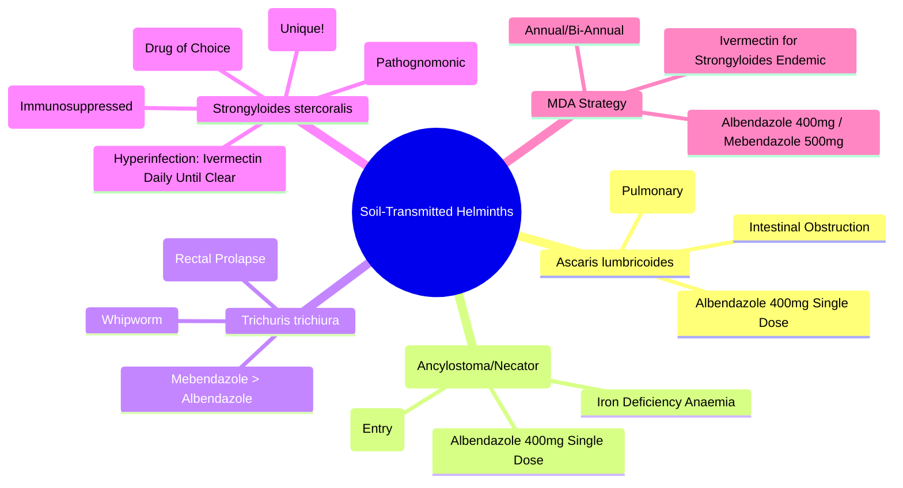

---
tags: [medicine, davidson, infectious-disease, helminths, strongyloides, ascariasis, hookworm, trichuriasis, fcps, mrcp]
davidson_chapter: Chapter 11: Infectious disease
status: full-fcps-mrcp-note
priority: high
exam_relevance: "FCPS: High-yield | MRCP: Core | Ascariasis, hookworm, trichuriasis, strongyloidiasis, whipworm, eosinophilia, albendazole/mebendazole, ivermectin, autoinfection, hyperinfection"
see_also: "[[Infective Diarrhoea and Food Poisoning]], [[Fever in Returned Traveller & FUO]], [[Eosinophilia]], [[Immunocompromised Host]]"
created: 2025-06-17
modified: 2025-06-17
---

# Soil-Transmitted Helminths (STH) & Strongyloidiasis

> [!info] **Davidson Ch 11 Alignment**: Infectious Disease → Specific Organism Groups → Parasites (Helminths) → Soil-Transmitted Helminths
> **FCPS/MRCP Focus**: Ascariasis, Hookworm, Trichuriasis, Strongyloidiasis, albendazole/mebendazole, ivermectin, hyperinfection syndrome, eosinophilia, mass drug administration

---

## 🎯 Learning Objectives

- [ ] Identify **Four Main STH**: *Ascaris lumbricoides*, *Necator americanus/Ancylostoma duodenale* (Hookworm), *Trichuris trichiura* (Whipworm), *Strongyloides stercoralis*
- [ ] Recognise **Clinical Presentations**: Intestinal (Obstruction, Malnutrition), Pulmonary (Löffler's Syndrome), Cutaneous (Larva Migrans), Hyperinfection (Strongyloides)
- [ ] Diagnose: **Stool Microscopy** (Ova/Parasites), **Larva Detection** (Strongyloides), **Serology/PCR** (Strongyloides), **Eosinophilia** (Marked)
- [ ] Manage: **Albendazole/Mebendazole** (STH), **Ivermectin** (Strongyloides), **Mass Drug Administration (MDA)** Programs
- [ ] Recognise **Strongyloides Hyperinfection**: Immunocompromised, Steroids, HTLV-1, Disseminated, High Mortality
- [ ] Apply **MDA**: **Albendazole 400mg / Mebendazole 500mg** (Annual/Bi-Annual), **Ivermectin** (Strongyloides Areas)

---

## 📖 Overview of Soil-Transmitted Helminths (STH)

| Parasite | Common Name | Size (Adult) | Location | Egg/Cyst in Stool |
|----------|-------------|--------------|----------|-------------------|
| **Ascaris lumbricoides** | **Roundworm** | 15-35 cm | Small Intestine | **Fertilised Egg (Mammillated)** / Unfertilised |
| **Necator americanus** | **New World Hookworm** | 10 mm | Duodenum/Proximal Jejune | **Thin-Shelled Oval Egg** (4-Cell Stage) |
| **Ancylostoma duodenale** | **Old World Hookworm** | 10-15 mm | Duodenum | **Thin-Shelled Oval Egg** (4-8 Cell Stage) |
| **Trichuris trichiura** | **Whipworm** | 3-5 cm | Caecum/Colon | **Barrel-Shaped (Lemon) Egg** (Bipolar Plugs) |
| **Strongyloides stercoralis** | **Threadworm** | 2 mm | Duodenum/Proximal Jejunum | **Rhabditiform Larva** (Not Egg) in Stool |

| Helminth | Transmission | Primary Site | Key Clinical Feature |
|----------|--------------|--------------|---------------------|
| **Ascaris** | Ingestion of Embryonated Eggs | Small Intestine | **Intestinal Obstruction**, **Löffler's Syndrome** (Pulmonary) |
| **Hookworm** (Necator/Ancylostoma) | **Skin Penetration** (Filariform Larva) | Duodenum | **Iron Deficiency Anaemia** (Blood Loss) |
| **Trichuris** | Ingestion of Embryonated Eggs | Caecum/Colon | **Dysentery**, **Rectal Prolapse** (Heavy Infection), **Trichuris Dysentery Syndrome** |
| **Strongyloides** | **Skin Penetration** (Filariform Larva) + **Autoinfection** | Duodenum | **Autoinfection**, **Hyperinfection** (Immunocompromised), **Larva Currens** |

---

## 📖 Ascariasis (Ascaris lumbricoides)

### Life Cycle & Pathogenesis

```mermaid
flowchart TD
    A[Ingestion of Embryonated Eggs] --> B[Hatch in Duodenum: Larvae]
    B --> C[Penetrate Intestinal Wall → Portal Circulation]
    C --> D[Liver → Heart → Lungs] --> E[Löffler's Syndrome: Cough, Wheeze, Eosinophilia]
    E --> F[Trachea → Swallowed → Small Intestine]
    F --> G[Adult Worms Mature (2-3 Months)] --> H[Eggs in Stool → Environment]
    H --> I[Embryonation in Soil (2-3 Weeks)] --> A
```

### Clinical Features

| Phase | Features |
|-------|----------|
| **Pulmonary (Löffler's Syndrome)** | **Dry Cough, Wheeze, Fever**, **Eosinophilia**, **Transient Pulmonary Infiltrates** (Migratory) |
| **Intestinal (Adult Worms)** | **Abdominal Pain**, **Malnutrition**, **Vitamin A Deficiency**, **Intestinal Obstruction** (Worm Bolus), **Biliary/Pancreatic Duct Obstruction**, **Appendicitis** |
| **Complications** | **Intestinal Obstruction** (Children, Worm Bolus), **Biliary Ascariasis** (Cholangitis, Pancreatitis), **Peritonitis** (Perforation) |

### Diagnosis & Treatment

| Test | Finding |
|------|---------|
| **Stool Microscopy** | **Fertilised Egg (Mammillated)**, **Unfertilised Egg** (Longer, Narrow) |
| **Eosinophilia** | **Marked** (Pulmonary Phase > Intestinal) |
| **Imaging (US/CT)** | **Worms in Intestine/Biliary Tree**, **Obstruction** |

| Treatment | Dose | Duration |
|-----------|------|----------|
| **Albendazole** | **400mg Single Dose** | **Single Dose** |
| **Mebendazole** | **500mg Single Dose** (or 100mg BD × 3 Days) | **Single / 3 Days** |
| **Pyrantel Pamoate** | **10mg/kg (Max 1g) Single Dose** | **Single Dose** |

> [!tip] **Ascariasis = Löffler's Syndrome (Pulmonary) + Intestinal Obstruction**. **Albendazole 400mg Single Dose = 1st Line**.

---

## 📖 Hookworm Infection (Ancylostomiasis/Necatoriasis)

### Pathogenesis

| Feature | *Ancylostoma duodenale* (Old World) | *Necator americanus* (New World) |
|---------|-----------------------------------|----------------------------------|
| **Site** | Duodenum | Duodenum/Proximal Jejunum |
| **Entry** | **Skin Penetration** + **Oral Ingestion** | **Skin Penetration Only** |
| **Anticoagulant** | **Potent** | Less Potent |
| **Blood Loss/Worm/Day** | **0.2-0.5 mL** | **0.03-0.05 mL** |
| **Egg in Stool** | **4-8 Cell Stage** | **4-Cell Stage** |

### Clinical Features

| Phase | Features |
|-------|----------|
| **Cutaneous (Entry)** | **Ground Itch** (Pruritic Papules at Entry Site — Feet/Hands) |
| **Pulmonary (Larval Migration)** | **Cough, Wheeze, Eosinophilia** (Löffler-like) |
| **Intestinal (Chronic)** | **Iron Deficiency Anaemia** (Microcytic Hypochromic), **Protein-Losing Enteropathy**, **Protein Malnutrition**, **Pica** (Geophagia) |

### Diagnosis & Treatment

| Test | Finding |
|------|---------|
| **Stool Microscopy** | **Thin-Shelled Oval Eggs** (4-Cell Necator, 4-8 Cell Ancylostoma) |
| **CBC** | **Microcytic Hypochromic Anaemia**, **Eosinophilia** |
| **Iron Studies** | **Low Ferritin, Low Serum Iron, High TIBC** |

| Treatment | Dose |
|-----------|------|
| **Albendazole 400mg Single Dose** | **Preferred** |
| **Mebendazole 500mg Single Dose** | **Alternative** |
| **Pyrantel Pamoate 10mg/kg** | **Alternative** |
| **Iron Supplementation** | **Ferrous Sulphate 200mg TDS × 3 Months** |

> [!tip] **Hookworm = Iron Deficiency Anaemia + Eosinophilia + Ground Itch**. **Albendazole 400mg Single Dose = 1st Line**.

---

## 📖 Trichuriasis (Whipworm)

### Clinical Features

| Intensity | Features |
|-----------|----------|
| **Light** | Asymptomatic |
| **Moderate** | **Abdominal Pain**, **Diarrhoea**, **Mucus/Blood in Stool**, **Growth Retardation** |
| **Heavy (Trichuris Dysentery Syndrome)** | **Chronic Mucus/Bloody Diarrhoea**, **Rectal Prolapse** (Tenesmus), **Anaemia**, **Protein-Losing Enteropathy**, **Growth Failure** |
| **Complications** | **Rectal Prolapse**, **Appendicitis**, **Severe Anaemia**, **Growth Failure** |

### Diagnosis & Treatment

| Test | Finding |
|------|---------|
| **Stool Microscopy** | **Barrel-Shaped (Lemon) Egg with Bipolar Plugs** (Trichuris) |
| **Eosinophilia** | Mild-Moderate |

| Treatment | Dose | Duration |
|-----------|------|----------|
| **Albendazole 400mg Single Dose** | **Single Dose** | **Low Cure Rate** (Repeat in 2-4 Weeks) |
| **Mebendazole 500mg Single Dose** (or 100mg BD × 3 Days) | **1-3 Days** | **Better Cure Rate** |
| **Combination (Albendazole + Ivermectin)** | **Best for Heavy Infections** | **Sequential/Concurrent** |

---

## 📖 Strongyloidiasis (Strongyloides stercoralis) — **Unique: Autoinfection**

### Unique Features

| Feature | Significance |
|---------|--------------|
| **Autoinfection** | **Rhabditiform → Filariform in Gut** → **Re-invasion** (Perianal/Venous) → **Lifelong Infection** if Untreated |
| **Hyperinfection** | **Immunocompromised** (Steroids, HTLV-1, Transplant, HTLV-1) → **Massive Larval Burden** → **Disseminated Disease**, **High Mortality (80-90%)** |
| **Larva Currens** | **Urticarial, Serpiginous, Rapidly Moving (cm/min)** — **Pathognomonic** (Perianal/Buttocks/Thighs) |
| **Hyperinfection Syndrome** | **Immunosuppressed** → **Massive Larval Burden** → **Sepsis, ARDS, Meningitis, Septicaemia (Gram -ve from Gut Flora)** |

### Clinical Forms

| Form | Features |
|------|----------|
| **Asymptomatic / Chronic** | Intermittent Abdominal Pain, Diarrhoea, **Larva Currens**, Eosinophilia |
| **Acute Pulmonary** | **Löffler-like Syndrome** (Cough, Wheeze, Eosinophilia, Infiltrates) |
| **Chronic Intestinal** | Intermittent Diarrhoea, Abdominal Pain, Weight Loss |
| **Hyperinfection / Disseminated** | **Immunocompromised**, **Sepsis (Gram -ve)**, **Meningitis (Enteric Flora)**, **ARDS, DIC**, **High Mortality (80-90%)** |

---

## 🔬 Diagnosis — Strongyloides

```mermaid
flowchart TD
    A[Suspected Strongyloidiasis: Eosinophilia + Diarrhoea + Travel/Immunocompromised] --> B[**Stool Microscopy (3 Samples)**]
    B --> C{**Larvae Seen?**}
    C -->|Yes| D[**Rhabditiform Larvae** (Not Eggs) → **Diagnosis**]
    C -->|No| E[**Specialised Tests**]
    E --> F1[**Baermann Funnel / Harada-Mori** (Larval Culture)]
    E --> F2[**Serology (IgG ELISA)** — **High Sens/Spec**]
    E --> F3[**PCR (Stool/Sputum/Blood)** — **High Sens/Spec**]
    E --> F4[**Duodenal Aspirate/Biopsy** — Larvae in Mucosa]
```

| Test | Sensitivity | Specificity | Role |
|------|-------------|-------------|------|
| **Stool Microscopy (x3)** | **30-50%** (Intermittent Shedding) | High | Routine, Low Sens |
| **Larval Culture (Harada-Mori)** | **80-90%** | High | **Increased Sensitivity** |
| **Serology (IgG ELISA)** | **90-95%** | **90-95%** | **Screening / Confirmatory** |
| **PCR (Stool/Serum)** | **>95%** | **>95%** | **Gold Standard (Increasing Use)** |
| **Duodenal Biopsy** | High | High | **If GI Symptoms + Negative Stool** |

> [!tip] **Strongyloides = Rhabditiform Larva in Stool (Not Egg) + Autoinfection + Hyperinfection Risk**. **Serology = Best Screening Test**. **Ivermectin = Drug of Choice**.

---

## 💊 Treatment — Strongyloides

| Scenario | 1st Line | Alternative | Duration |
|----------|----------|-------------|----------|
| **Uncomplicated** | **Ivermectin 200µg/kg PO Single Dose** (Repeat Day 14) | **Albendazole 400mg BD × 3 Days** | **1-2 Doses** |
| **Strongyloidiasis (Chronic)** | **Ivermectin 200µg/kg Day 1 & 14** | **Albendazole 400mg BD × 3-7 Days** | **Extended** |
| **Hyperinfection / Disseminated** | **Ivermectin 200µg/kg/day PO/NG** (Daily Until Parasite Clearance) | **Albendazole 400mg BD IV/PO** + **Subcutaneous Ivermectin** (If GI Absorption Impaired) | **Until 2 Weeks Parasite-Free** |
| **Immunocompromised (Prophylaxis)** | **Ivermectin 200µg/kg Monthly** | — | **Duration of Immunosuppression** |

> [!warning] **Hyperinfection = Medical Emergency**. **Ivermectin Daily Until Parasite Clearance**. **Broad-Spectrum ABX for Gram-Negative Sepsis** (Gut Translocation). **Meningitis Risk → Cover CNS**.

> [!warning] **Corticosteroids = Major Trigger for Hyperinfection**. **Screen Before Immunosuppression** (Serology/PCR).

---

## 🛡️ Mass Drug Administration (MDA) — WHO Strategy

| Target Population | Drug | Dose | Frequency |
|-------------------|------|------|-----------|
| **Pre-School Children (1-4y)** | **Albendazole 400mg** (or Mebendazole 500mg) | **Single Dose** | **Annual** (If Prevalence >20%) / **Bi-Annual** (>50%) |
| **School-Age Children (5-14y)** | **Albendazole 400mg** (or Mebendazole 500mg) | **Single Dose** | **Annual / Bi-Annual** |
| **Women of Reproductive Age** | **Albendazole 400mg** | **Single Dose** | **Annual** (In Endemic Areas) |
| **Strongyloides Endemic** | **Ivermectin 200µg/kg** | **Single Dose** | **Annual/Bi-Annual** |

> [!warning] **Pregnancy: Avoid 1st Trimester**. **Albendazole/Mebendazole Category C**. **Ivermectin: Avoid in Pregnancy**.

---

## 💡 FCPS/MRCP High-Yield Summary

| Topic | Key Point |
|-------|-----------|
| **Ascaris** | **Löffler's Syndrome (Pulmonary)**, **Intestinal Obstruction**, **Albendazole 400mg Single Dose** |
| **Hookworm** | **Iron Deficiency Anaemia**, **Ground Itch**, **Eosinophilia**, **Albendazole 400mg Single Dose** |
| **Trichuris** | **Trichuris Dysentery Syndrome** (Bloody Diarrhoea, Rectal Prolapse), **Albendazole/Mebendazole** (Low Cure Rate, Repeat) |
| **Strongyloides** | **Autoinfection**, **Larva Currens (Pathognomonic)**, **Hyperinfection (Immunocompromised, Steroids)**, **Ivermectin 200µg/kg** |
| **Hyperinfection** | **Steroids/HTLV-1/Transplant → Disseminated → Sepsis/Meningitis/ARDS**, **Ivermectin Daily Until Clear** |
| **Eosinophilia** | **Marked in All STH** (Except Heavy Trichuris), **Strongyloides = Persistent** |
| **MDA** | **Albendazole 400mg / Mebendazole 500mg Annual/Bi-Annual**, **Ivermectin for Strongyloides** |
| **Drug of Choice** | **Albendazole 400mg** (Ascaris, Hookworm, Trichuris), **Ivermectin** (Strongyloides) |

---

## ❓ Viva Questions

1. **What is the drug of choice for Strongyloides stercoralis?**
   - **Ivermectin 200µg/kg PO Single Dose** (Repeat Day 14).

2. **What is the hallmark clinical feature of Strongyloides hyperinfection?**
   - **Disseminated Disease in Immunocompromised** → **Sepsis (Gram -ve), Meningitis, ARDS, High Mortality**.

3. **What is the difference between Hookworm and Strongyloides skin penetration?**
   - **Hookworm = Ground Itch (Pruritic Papules)**; **Strongyloides = Larva Currens (Urticarial, Serpiginous, Rapidly Moving)**.

4. **Why is Strongyloides unique among helminths?**
   - **Autoinfection Cycle** → **Lifelong Infection Possible**, **Hyperinfection Risk in Immunocompromised**.

5. **What is the drug of choice for Trichuriasis?**
   - **Mebendazole 500mg Single Dose** (Better than Albendazole) or **Albendazole + Ivermectin** for Heavy Infection.

6. **What is the drug of choice for Ascariasis?**
   - **Albendazole 400mg Single Dose** (or Mebendazole 500mg Single Dose).

7. **How do you diagnose Strongyloides if stool microscopy is negative?**
   - **Serology (IgG ELISA)**, **Larval Culture (Baermann/Harada-Mori)**, **PCR**, **Duodenal Biopsy**.

7. **What is the management of Strongyloides Hyperinfection?**
   - **Ivermectin 200µg/kg Daily Until Parasite Clearance**, **Broad-Spectrum ABX for Gram-Negative Sepsis**, **Stop Steroids/Immunosuppressants**.

8. **What is the drug of choice for Hookworm?**
   - **Albendazole 400mg Single Dose** (Alternative: Mebendazole 500mg).

8. **What is the MDA strategy for STH?**
   - **Albendazole 400mg / Mebendazole 500mg Annual/Bi-Annual** for Pre-School & School-Age Children in Endemic Areas.

9. **What is the characteristic finding in Hookworm infection?**
   - **Iron Deficiency Anaemia** (Microcytic Hypochromic) + **Ground Itch** + **Eosinophilia**.

10. **How does Strongyloides autoinfection occur?**
    - **Rhabditiform Larvae → Filariform Larvae in Gut → Penetrate Colonic Mucosa/Perianal Skin → Systemic Migration → Duodenum**.

---

## 🧠 Confusions & Mnemonics

| Confusion | Clarification |
|-----------|---------------|
| **Hookworm vs Strongyloides** | **Hookworm: Eggs in Stool, Ground Itch, Anaemia**; **Strongyloides: Larvae in Stool, Larva Currens, Autoinfection** |
| **Ascaris vs Hookworm** | **Ascaris: Obstruction, Löffler's Syndrome, Large Worms**; **Hookworm: Anaemia, Ground Itch, Blood Loss** |
| **Trichuris vs Other** | **Trichuris: Whipworm, Barrel Egg, Rectal Prolapse, Dysentery Syndrome** |
| **Strongyloides Autoinfection** | **Filariform Larva Penetrates Colonic Mucosa/Perianal Skin → Re-enters Circulation** |
| **Hyperinfection Trigger** | **Corticosteroids, HTLV-1, Transplant, Immunosuppression** |

| Mnemonic | Meaning |
|----------|---------|
| **"Ascaris = Löffler's + Obstruction"** | Ascariasis |
| **"Hookworm = Anaemia + Ground Itch"** | Hookworm |
| **"Trichuris = Whipworm + Dysentery + Rectal Prolapse"** | Trichuriasis |
| **"Strongyloides = Larva Currens + Autoinfection + Hyperinfection"** | Strongyloides |
| **"Ivermectin = Strongyloides Drug"** | Treatment |
| **"Steroids = Strongyloides Hyperinfection Trigger"** | Danger |

---

## 🗺️ Mind Map



---

## 📋 One-Page Revision Card

| **SOIL-TRANSMITTED HELMINTHS – FCPS/MRCP REVISION CARD** |
|-----------------------------------------------------------|
| **Ascaris**: Löffler's Syndrome, Obstruction, **Albendazole 400mg Single Dose** |
| **Hookworm**: **Iron Deficiency Anaemia**, Ground Itch, **Albendazole 400mg** |
| **Trichuris**: **Dysentery Syndrome**, Rectal Prolapse, **Mebendazole > Albendazole** |
| **Strongyloides**: **Autoinfection**, **Larva Currens**, **Hyperinfection (Steroids/HTLV-1)** |
| **Strongyloides Rx**: **Ivermectin 200µg/kg** (Single/Repeat Day 14) |
| **Hyperinfection**: **Ivermectin Daily Until Clear + Broad ABX + Stop Steroids** |
| **Eosinophilia**: **All STH** (Except Heavy Trichuris) |
| **MDA**: **Albendazole 400mg / Mebendazole 500mg Annual/Bi-Annual** |
| **Egg/Larva ID**: Ascaris (Mammillated), Hookworm (Thin Oval), Trichuris (Barrel+Bipolar), Strongyloides (Rhabditiform Larva) |

---

## 📅 Spaced Repetition Tracker

| Review | Date | Score (1-5) | Next Review |
|--------|------|-------------|-------------|
| Day 1 | 2025-06-17 | | 2025-06-18 |
| Day 3 | | | |
| Day 7 | | | |
| Day 15 | | | |
| Day 30 | | | |

---

## 🎯 Must Know / Should Know / Nice to Know

| Level | Content |
|-------|---------|
| **Must Know** | Four STH + Clinical Features, Egg/Larva Identification, Drug of Choice (Albendazole vs Ivermectin), Strongyloides Autoinfection/Hyperinfection, Ivermectin for Strongyloides, MDA Strategy, Eosinophilia Patterns |
| **Should Know** | Life Cycles, Pulmonary Migration Phases (Löffler's), Diagnostic Methods (Microscopy, Serology, PCR, Culture), Heavy Infection Complications, MDA Implementation Challenges, Drug Resistance, Paediatric/Pregnancy Dosing, Co-infections |
| **Nice to Know** | Genomic Epidemiology, Anthelmintic Resistance Mechanisms, Vaccine Development (Hookworm, Ascaris), Integrated Control (WASH + MDA), Economic Impact, Elimination Targets (WHO 2030), Zoonotic Ascaris (A. suum), Strongyloides in HTLV-1, Coinfection Interactions (Malaria, TB, HIV) |

---

## ✅ Self-Test Scorecard

| Section | Score (0-10) | Notes |
|---------|--------------|-------|
| Ascaris | | |
| Hookworm | | |
| Trichuris | | |
| Strongyloides (Including Hyperinfection) | | |
| Diagnosis (Microscopy, Serology, PCR) | | |
| Treatment Protocols | | |
| MDA Strategy | | |
| Viva Questions | | |

---

## 🔗 Local Navigation

- **Previous**: [[Amoebiasis / Giardiasis]]
- **Next**: [[Schistosomiasis]]
- **Section Hub**: [[Infectious Disease MOC]]
- **MOC**: [[Infectious Disease MOC]]
- **Template**: [[../Templates/Hematology Topic Template]]

---

*Generated for FCPS/MRCP exam preparation. Based on Davidson Medicine 24th Ed Chapter 11.*

## PasTest Scenario SBAs (Clinical Vignettes)

> **Auto-generated PasTest/Mediscope-style scenario SBAs** grounded in the authored source. Each scenario tests a real clinical fact (triad, specific sign, contraindication, trial, first-line Rx) extracted from the topic. *Source: Ch 14: Infectious Disease — Soil-Transmitted Helminths & Strongyloides*

**Q1.** What is the most appropriate first-line therapy for Soil-Transmitted Helminths & Strongyloides?

  - **A.** Broad-Spectrum ABX for Gram-Negative Sepsis (Gut Translocation)
  - **B.** An advanced/surgical therapy reserved for refractory disease
  - **C.** Symptomatic treatment only, no disease-modifying therapy
  - **D.** Empiric broad-spectrum therapy without specific indication

  > **Answer: A** — Broad-Spectrum ABX for Gram-Negative Sepsis (Gut Translocation)
  >
  > *Source:* **Broad-Spectrum ABX for Gram-Negative Sepsis** (Gut Translocation).

