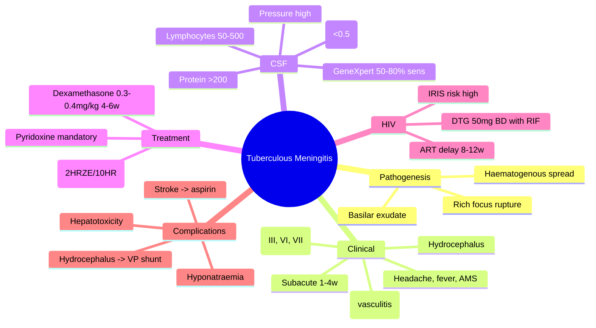

---
tags: [medicine, infectious-disease, davidson, chapter13, cns, tb, meningitis, fcps, mrcp]
davidson_chapter: Chapter 13: Infectious disease
topic_category: Central Nervous System Infections Domain
status: full-fcps-mrcp-topic-note
---

# Tuberculous Meningitis

Related: [[Tuberculosis (Pulmonary and Extrapulmonary)]], [[Acute Bacterial Meningitis]], [[Viral Encephalitis and Meningitis]], [[HIV-Associated Opportunistic Infections]]

> [!important]
> **Tuberculous meningitis (TBM) is the most severe form of TB** — mortality 20–40% even with treatment. **Subacute onset (1–4 weeks), basilar exudates, cranial nerve palsies, hydrocephalus.** **Dexamethasone reduces mortality.** **GeneXpert on CSF has sensitivity ~50–80%.** **Treat 12 months (2HRZE/10HR).**

## Learning Objectives
- Recognise subacute clinical presentation: headache, fever, AMS, cranial nerve palsies
- Interpret CSF: lymphocytic pleocytosis, very low glucose, high protein, opening pressure ↑
- Use GeneXpert MTB/RIF Ultra on CSF (rapid, moderate sensitivity)
- Initiate empirical anti-TB + dexamethasone immediately if high suspicion
- Manage hydrocephalus (VP shunt), stroke (vasculitis), raised ICP
- Understand TB/HIV co-management and IRIS in TBM

## Definition
**Tuberculous meningitis** = *Mycobacterium tuberculosis* infection of the meninges. **Subacute** (days–weeks). **Basilar exudates** → cranial nerve palsies, hydrocephalus, vasculitis → stroke.

## Pathogenesis
1. Primary TB → haematogenous spread → **Rich focus** (subpial/ependymal granuloma in brain/spine)
2. Rupture of Rich focus into subarachnoid space → **meningeal inflammation**
3. **Basilar exudate** (thick, gelatinous) → entrapment of cranial nerves (III, VI, VII), vessels (vasculitis), CSF pathways (hydrocephalus)

## Clinical Features
| Stage | Features |
|-------|----------|
| **Prodrome (1–3w)** | Low-grade fever, malaise, headache, personality change, irritability |
| **Meningeal (1–2w)** | Severe headache, vomiting, neck stiffness, photophobia, fever |
| **Neurological (late)** | **Cranial nerve palsies** (III → ptosis, dilated pupil; VI → diplopia; VII → facial weakness), **AMS** (confusion → coma), **focal deficits** (hemiparesis from vasculitis), **seizures** |
| **Complications** | **Hydrocephalus** (communicating → non-communicating), **stroke** (MCA territory, basal ganglia), **SIADH**, hyponatraemia |

## Normal Values / Important Cut-offs
| Parameter | TBM CSF | Bacterial Meningitis | Viral Meningitis |
|-----------|---------|----------------------|------------------|
| **Opening pressure** | **↑↑ (often >30 cmH₂O)** | ↑↑ | Normal/mild ↑ |
| **WBC** | **50–500 (lymphocytes)** | Neutrophils ↑↑↑ | Lymphocytes 10–500 |
| **Protein** | **↑↑ (100–500 mg/dL, often >200)** | ↑↑ | Mild ↑ |
| **Glucose (CSF/serum)** | **↓↓ (<0.5, often <2.2 mmol/L or <40 mg/dL)** | ↓↓ (<0.4) | Normal (>0.6) |
| **GeneXpert MTB/RIF Ultra** | **50–80% sensitivity** | N/A | N/A |
| **AFB smear** | 10–20% | N/A | N/A |
| **Culture** | 50–70% (4–8 weeks) | N/A | N/A |
| **ADA** | >10 U/L (supportive) | N/A | N/A |

> [!tip]
> **CSF glucose <2.2 mmol/L (40 mg/dL) or ratio <0.5** = TBM / bacterial / fungal. **Lymphocytic pleocytosis + very low glucose + high protein + high pressure** = classic TBM triad.

## Approach / Algorithm
```mermaid
flowchart TD
  A[Subacute meningitis: headache 1-4w + fever + AMS/cranial nerve palsies] --> B[LP if safe (contraindications: papilloedema, GCS<10, focal deficit)]
  B --> C[CSF: opening pressure, cell count, protein, glucose, AFB, GeneXpert, culture]
  C --> D[CT/MRI brain with contrast: basal exudates, hydrocephalus, infarcts, enhancement]
  D --> E[Empirical anti-TB + Dexamethasone IMMEDIATELY if high suspicion]
  E --> F[GeneXpert +ve → confirm; GeneXpert -ve but high suspicion → continue Rx, await culture]
  F --> G[Monitor: ICP, hydrocephalus (serial imaging), stroke, hyponatraemia, drug toxicity]
  G --> H[Duration: 12 months total (2HRZE/10HR)]
```

## Investigations
| Test | Utility |
|------|---------|
| **CSF GeneXpert MTB/RIF Ultra** | **Rapid (2h), sensitivity 50–80%, specificity >98%**; detects RIF resistance |
| **CSF AFB smear** | Low sensitivity (10–20%); >1 smear increases yield |
| **CSF culture (MGIT)** | Gold standard (50–70%); 2–4 weeks; allows DST |
| **CSF LPA / WGS** | Rapid DST if culture +ve |
| **CSF ADA** | >10 U/L supportive (not diagnostic); high in lymphocytic exudates |
| **CT/MRI brain (contrast)** | **Basilar exudates** (meningeal enhancement), **hydrocephalus**, infarcts (vasculitis), tuberculomas |
| **Chest X-ray / CT** | Active pulmonary TB in 30–50% |
| **IGRA / TST** | Supportive; not diagnostic for active TBM |
| **HIV test** | Mandatory (co-infection changes Rx duration, ART timing, IRIS risk) |

## Treatment
### Standard Regimen (12 Months Total)
| Phase | Duration | Drugs | Doses |
|-------|----------|-------|-------|
| **Intensive** | **2 months** | **HRZE** (Rifampicin, Isoniazid, Pyrazinamide, Ethambutol) | R 10mg/kg, H 5mg/kg, Z 25mg/kg, E 15mg/kg |
| **Continuation** | **10 months** | **HR** (Rifampicin, Isoniazid) | Same doses |

> [!important]
> **Total 12 months** (not 6 months like pulmonary TB). **Ethambutol essential** in intensive phase (good CSF penetration). **Pyridoxine 25mg/day** mandatory with INH.

### Adjunctive Dexamethasone — MORTALITY BENEFIT
| Population | Dose | Duration |
|------------|------|----------|
| **Adults** | **Dexamethasone 0.3–0.4mg/kg/day IV** (max 24mg/day) | **4–6 weeks taper** (reduce every 1–2w) |
| **Children** | Dexamethasone 0.6mg/kg/day IV (max 30mg/day) | 4–6 weeks taper |

> [!warning]
> **Start dexamethasone WITH or BEFORE first anti-TB dose.** Reduces mortality by ~30%. **Monitor glucose, GI bleed, psychiatric effects.** Taper slowly to avoid rebound inflammation.

### Drug Penetration into CSF (Inflamed Meninges)
| Drug | CSF Penetration | Notes |
|------|-----------------|-------|
| **Isoniazid** | Excellent (100%) | Core drug |
| **Pyrazinamide** | Excellent (100%) | Core drug |
| **Ethambutol** | Good (50–70%) | **Include in intensive phase** |
| **Rifampicin** | Poor (10–20%) | **High dose (10mg/kg) compensates**; protein binding |
| **Streptomycin** | Poor | Avoid (otalgia, no CSF penetration) |
| **Fluoroquinolones (Mfx/Lfx)** | Good (50–70%) | MDR-TBM regimens |
| **Bedaquiline** | Poor | Not for TBM |
| **Linezolid** | Good (>80%) | MDR-TBM if needed |

## HIV Co-infection
| Aspect | Management |
|--------|------------|
| **ART timing** | **Delay 8–12 weeks** after starting TB Rx (IRIS risk high in TBM) |
| **Dexamethasone** | Still indicated; monitor closely |
| **Rifampicin + ART** | Dolutegravir 50mg **BD** (double dose); EFV 600mg OK; avoid PIs |
| **IRIS** | Paradoxical worsening 2–12w post-ART; **prednisolone 1.5mg/kg taper** if moderate-severe |

## Complications & Management
| Complication | Management |
|--------------|------------|
| **Hydrocephalus** | **VP shunt** if symptomatic (GCS declining, papilloedema, imaging progression); EVD temporising |
| **Vasculitis / Stroke** | Aspirin 75–150mg/day (some evidence); anticoagulation controversial; continue anti-TB + dex |
| **Raised ICP** | Head elevation, mannitol/hypertonic saline, hyperventilation (temp), dexamethasone |
| **SIADH / Hyponatraemia** | Fluid restriction, hypertonic saline if symptomatic; **check cortisol (adrenal TB)** |
| **Cranial nerve palsies** | Usually improve with treatment; III/VI most common |
| **Tuberculomas** | Same anti-TB regimen; surgery if mass effect/refractory |
| **Drug-induced hepatotoxicity** | LFTs baseline, 2w, monthly; hold/reintroduce per guidelines |

## Red Flags / Emergencies
- **GCS declining** → hydrocephalus, stroke, raised ICP → urgent imaging, VP shunt/EVD
- **Focal deficit / seizure** → stroke (vasculitis) → aspirin, continue dex, imaging
- **Severe hyponatraemia (Na⁺<120)** → hypertonic saline, fluid restriction, check cortisol
- **Drug-induced liver injury (ALT>5×ULN or >3×ULN+symptoms)** → hold hepatotoxic drugs
- **Adrenal insufficiency** (TB adrenalitis) → hydrocortisone replacement + fludrocortisone

## Differential Diagnosis
| Condition | Distinguishing Features |
|-----------|-------------------------|
| **Bacterial meningitis** | Acute (hours–days), neutrophilic CSF, very low glucose, Gram stain +ve |
| **Viral meningitis** | Acute, normal glucose, self-limiting, no cranial nerves/hydrocephalus |
| **Fungal (Cryptococcal)** | Immunocompromised, ↑↑ opening pressure, India ink/CrAg +ve |
| **Carcinomatous meningitis** | Malignancy known; CSF malignant cells, low glucose, high protein |
| **Sarcoid / Behçet / autoimmune** | Systemic features; CSF lymphocytic, low glucose possible; no AFB/GeneXpert |
| **Partially treated bacterial** | History of antibiotics; mixed CSF picture |

## Special Situations
| Situation | Adjustment |
|-----------|------------|
| **Pregnancy** | Standard 2HRZE/10HR safe; **avoid streptomycin, fluoroquinolones, bedaquiline**; pyridoxine mandatory; dexamethasone OK |
| **Renal impairment** | H, R, Z dose adjust; **E contraindicated if CrCl<30**; moxifloxacin/levofloxacin OK |
| **Hepatic impairment** | Avoid Z if severe; monitor LFTs weekly; R/H/E caution |
| **MDR-TBM** | Expert consultation; **fluoroquinolone + linezolid + clofazimine + cycloserine + bedaquiline (poor CNS) + high-dose INH**; duration 18–24m |
| **Children** | Weight-based dosing; dexamethasone 0.6mg/kg/day; VP shunt threshold lower; monitor growth, development |

## FCPS/MRCP High-Yield Points
- **TBM = subacute (1–4w), basilar exudates, cranial nerves III/VI/VII, hydrocephalus, vasculitis → stroke**
- **CSF: lymphocytic, very low glucose (<2.2 mmol/L, ratio <0.5), high protein (>200), high pressure**
- **GeneXpert on CSF: sensitivity 50–80%, specificity >98%, detects RIF resistance in 2h**
- **Treatment: 12 months (2HRZE/10HR) — NOT 6 months**
- **Dexamethasone 0.3–0.4mg/kg/day ×4–6w taper: MORTALITY BENEFIT — start WITH/BEFORE anti-TB**
- **Ethambutol essential in intensive phase (good CSF penetration); pyridoxine mandatory**
- **HIV: delay ART 8–12w (IRIS risk high); DTG 50mg BD with rifampicin**
- **Hydrocephalus = VP shunt if symptomatic; stroke = aspirin consideration**
- **MDR-TBM: prolonged regimen (18–24m), fluoroquinolone + linezolid + clofazimine + cycloserine**

## Common Viva Questions
1. **What is the duration of treatment for tuberculous meningitis?** 12 months (2 months HRZE + 10 months HR).
2. **What is the role of dexamethasone in TBM?** Reduces mortality by ~30%; 0.3–0.4mg/kg/day ×4–6w taper; start with/ before anti-TB.
3. **What is the CSF profile in TBM?** Lymphocytic pleocytosis (50–500), very low glucose (<2.2 mmol/L, ratio <0.5), high protein (>100, often >200), high opening pressure.
4. **What is the sensitivity of GeneXpert on CSF for TBM?** 50–80% (moderate); specificity >98%.
5. **When do you start ART in HIV/TBM co-infection?** Delay 8–12 weeks after starting TB treatment (high IRIS risk).
6. **Which anti-TB drugs have good CSF penetration?** INH, PZA, EMB, fluoroquinolones, linezolid. Rifampicin has poor penetration (compensated by high dose).
7. **How do you manage hydrocephalus in TBM?** VP shunt if symptomatic (declining GCS, papilloedema, progressive imaging).

## Common Confusions / Exam Traps
| Confusion | Clarification |
|-----------|---------------|
| TBM duration = 6 months like pulmonary TB | **12 months** (2HRZE/10HR) — continuation phase 10 months |
| Dexamethasone optional in TBM | **Strong mortality benefit** — standard of care |
| GeneXpert negative = rule out TBM | **Sensitivity only 50–80%** — clinical suspicion + culture if -ve |
| Rifampicin penetrates CSF well | **Poor (10–20%)** — high dose 10mg/kg compensates |
| Streptomycin for TBM | **No CSF penetration + ototoxicity** — contraindicated |
| ART timing same as pulmonary TB/HIV | **TBM: delay 8–12w** (pulmonary: CD4<50 → 2w) |
| VP shunt never needed | **Symptomatic hydrocephalus → VP shunt** (EVD temporising) |
| Aspirin contraindicated in TBM stroke | **Aspirin 75–150mg/day may reduce infarcts** (some evidence) |

## Mnemonics
- **TBM CSF**: **L**ymphocytes, **O**ver 200 protein, **W**ater (glucose) low, **P**ressure high = **LOW P**
- **TBM RX**: **12 MONTHS** = **2 HRZE / 10 HR** (not 6 months)
- **DEX TBM**: **0.3–0.4mg/kg/day IV ×4–6w taper** — **START WITH ANTI-TB**
- **TBM COMPLICATIONS**: **H**ydrocephalus (VP shunt), **S**troke (vasculitis, aspirin), **C**ranial nerves (III, VI, VII), **S**IADH, **I**CPs raised
- **HIV TBM ART**: **DELAY 8–12 WEEKS** (IRIS risk)

## Mind Map


## Flowchart
```mermaid
flowchart TD
  A[Subacute meningitis + cranial nerves + hydrocephalus] --> B[LP: lymphocytic, low glucose, high protein, high pressure]
  B --> C[GeneXpert CSF + CT/MRI brain]
  C --> D[Empirical 2HRZE/10HR + Dexamethasone 0.3-0.4mg/kg/day IMMEDIATELY]
  D --> E[GeneXpert +ve → confirm; -ve but high suspicion → continue, await culture]
  E --> F[Monitor: ICP, hydrocephalus (serial imaging), stroke, LFTs, hyponatraemia]
  F --> G{Complications?}
  G -->|Hydrocephalus symptomatic| H[VP shunt]
  G -->|Stroke| I[Aspirin 75-150mg/day + continue dex]
  G -->|Hyponatraemia| J[Fluid restrict, hypertonic saline, check cortisol]
  G -->|Hepatotoxicity| K[Hold/reintroduce per guidelines]
```

## Suggested Visuals / Image Notes
- MRI: basal exudates (meningeal enhancement), hydrocephalus, infarcts (basal ganglia, MCA), tuberculomas
- CSF findings comparison table
- Dexamethasone taper schedule
- VP shunt indication algorithm

## Suggested Video References
- WHO TB meningitis guidelines
- TBM case presentations (Lancet Neurology)
- Hydrocephalus management in TBM
- IRIS in TB/HIV

## One-Page Revision Summary
| Topic | Key Points |
|-------|------------|
| **Presentation** | Subacute 1–4w, headache, fever, AMS, cranial nerves (III, VI, VII), hydrocephalus |
| **CSF** | Lymphocytes 50–500, glucose very low (<2.2 mmol/L, ratio <0.5), protein >200, pressure high |
| **GeneXpert CSF** | Sensitivity 50–80%, specificity >98%, 2h, detects RIF resistance |
| **Treatment** | 12 months: 2HRZE / 10HR (NOT 6 months) |
| **Dexamethasone** | 0.3–0.4mg/kg/day IV ×4–6w taper; START WITH/BEFORE anti-TB; mortality benefit |
| **Drug CSF penetration** | INH/PZA/EMB/Mfx/Lzd = good; Rifampicin = poor (high dose compensates) |
| **HIV** | Delay ART 8–12w; DTG 50mg BD with RIF; IRIS risk high |
| **Hydrocephalus** | VP shunt if symptomatic (GCS↓, papilloedema, progressive imaging) |
| **Stroke** | Vasculitis; aspirin 75–150mg/day consideration |
| **MDR-TBM** | 18–24m; fluoroquinolone + linezolid + clofazimine + cycloserine |

## 24-Hour Recall Prompts
- Write the TBM treatment regimen and duration.
- CSF glucose threshold for TBM.
- Dexamethasone dose and duration for TBM.
- When to start ART in HIV/TBM.
- GeneXpert CSF sensitivity for TBM.

## 7-Day / 15-Day / 30-Day Revision Tracker
- [ ] Day 1 completed
- [ ] 24-hour recall completed
- [ ] Day 7 revision completed
- [ ] Day 15 revision completed
- [ ] Day 30 revision completed

## Must Know / Should Know / Nice to Know
### Must Know
- TBM = subacute, basilar exudates, cranial nerves, hydrocephalus
- CSF: lymphocytic, very low glucose, high protein, high pressure
- GeneXpert CSF sensitivity 50–80%
- Treatment 12 months (2HRZE/10HR)
- Dexamethasone 0.3–0.4mg/kg/day ×4–6w taper WITH/BEFORE anti-TB
- HIV: delay ART 8–12w
- Hydrocephalus → VP shunt if symptomatic

### Should Know
- Drug CSF penetration differences
- Rifampicin poor penetration → high dose
- Stroke/vasculitis → aspirin consideration
- MDR-TBM prolonged regimen
- Adrenal insufficiency check if hyponatraemia
- Pyridoxine mandatory

### Nice to Know
- ADA in CSF supportive
- Tuberculomas management
- Pediatric dosing differences
- Newer MDR-TBM regimens (bedaquiline poor CNS)
- Role of host-directed therapies (aspirin, statins)

## My Weak Points
- [ ] MDR-TBM exact regimen components
- [ ] Aspirin evidence in TBM vasculitis
- [ ] VP shunt timing criteria
- [ ] Pediatric dexamethasone dose

## Self-Test Scorecard
- Understanding: /10
- Recall: /10
- MCQ Performance: /10
- SBA Performance: /10
- Viva Confidence: /10
- Total: /50

> [!tip]
> Interpretation: <35 = weak topic, 35-44 = acceptable but insecure, 45+ = strong exam-ready topic.

## Exam Answer Modes
### Long Answer Skeleton
1. Pathogenesis: haematogenous spread, Rich focus, basilar exudate
2. Clinical: subacute stages, cranial nerves, hydrocephalus, stroke
3. CSF: lymphocytic, low glucose, high protein, high pressure; GeneXpert, culture
4. Imaging: basal exudates, hydrocephalus, infarcts, tuberculomas
5. Treatment: 12 months (2HRZE/10HR), drug CSF penetration
6. Dexamethasone: dose, timing, taper, mortality benefit
7. HIV co-infection: ART delay 8–12w, DTG BD, IRIS
8. Complications: hydrocephalus (VP shunt), stroke (aspirin), hyponatraemia, hepatotoxicity
9. MDR-TBM: principles, prolonged duration

### Short Note Skeleton
- Subacute 1-4w: headache, fever, AMS, CN palsies (III, VI, VII), hydrocephalus
- CSF: lymphocytic, glucose↓↓ (<2.2, ratio<0.5), protein↑↑ (>200), pressure↑
- GeneXpert CSF: 50-80% sens, >98% spec
- Rx: 2HRZE/10HR (12m); Dex 0.3-0.4mg/kg/day IV ×4-6w taper WITH/BEFORE anti-TB
- HIV: ART delay 8-12w; DTG 50mg BD w/ RIF
- Complications: Hydrocephalus→VP shunt; Stroke→aspirin; SIADH; Hepatotoxicity

### Viva One-Liners
- TBM = subacute, basilar exudates, CN III/VI/VII, hydrocephalus
- CSF: lymphocytic, very low glucose, high protein, high pressure
- GeneXpert CSF: 50-80% sensitivity
- Rx: 12 months (2HRZE/10HR) — NOT 6 months
- Dexamethasone: 0.3-0.4mg/kg/day ×4-6w taper, START WITH anti-TB
- HIV/TBM: ART delay 8-12w (IRIS risk)
- Hydrocephalus symptomatic → VP shunt

### Ward-Case Discussion Points
- 30M, 3w headache, fever, confusion, CN VI palsy → CSF lymphocytic/glucose 1.5/protein 300 → GeneXpert +ve → 2HRZE/10HR + dex 0.4mg/kg taper
- HIV+ TBM, CD4 50 → start anti-TB + dex, delay ART 8-12w, DTG 50mg BD
- TBM day 10, GCS dropping, imaging shows progressive hydrocephalus → VP shunt

### Last-Night-Before-Exam Sheet
**TBM:** Subacute 1-4w. CSF: lymphocytic, glucose↓↓ (<2.2, ratio<0.5), protein↑↑, pressure↑. GeneXpert CSF 50-80% sens. **Rx: 12m (2HRZE/10HR). Dex 0.3-0.4mg/kg/day ×4-6w taper WITH/BEFORE anti-TB.** HIV: ART delay 8-12w. Hydrocephalus symptomatic→VP shunt. Stroke→aspirin. Rifampicin poor CSF penetration (high dose compensates).

## Summary
**Tuberculous meningitis** is the most severe form of TB with **subacute onset (1–4 weeks)**, **basilar exudates** causing **cranial nerve palsies (III, VI, VII)**, **hydrocephalus**, and **vasculitic stroke**. **CSF shows lymphocytic pleocytosis (50–500), very low glucose (<2.2 mmol/L, ratio <0.5), high protein (>200), and high opening pressure.** **GeneXpert MTB/RIF Ultra on CSF has 50–80% sensitivity, >98% specificity.** **Treatment is 12 months: 2 months HRZE (intensive) → 10 months HR (continuation)** — NOT 6 months. **Adjunctive dexamethasone 0.3–0.4mg/kg/day IV ×4–6 weeks taper STARTED WITH or BEFORE first anti-TB dose reduces mortality by ~30%.** **Pyridoxine mandatory.** **HIV co-infection: delay ART 8–12 weeks (high IRIS risk); dolutegravir 50mg BD with rifampicin.** **Complications:** symptomatic hydrocephalus → VP shunt; vasculitic stroke → aspirin consideration; SIADH/hyponatraemia; drug-induced hepatotoxicity. **MDR-TBM requires prolonged 18–24 month regimens with fluoroquinolone, linezolid, clofazimine, cycloserine.**

## MCQs (10)
1. **What is the recommended total duration of treatment for tuberculous meningitis?**
   A. 6 months
   B. 9 months
   C. **12 months**
   D. 18 months
   E. 24 months

2. **TBM CSF typically shows:**
   A. Neutrophils, normal glucose, normal protein
   B. **Lymphocytes, very low glucose (<2.2 mmol/L), high protein (>200), high pressure**
   C. Lymphocytes, normal glucose, low protein
   D. Neutrophils, low glucose, high protein
   E. Acellular, normal glucose, normal protein

3. **GeneXpert MTB/RIF Ultra on CSF for TBM has a sensitivity of approximately:**
   A. 90–95%
   B. **50–80%**
   C. 30–40%
   D. 10–20%
   E. >95%

4. **Adjunctive dexamethasone in TBM: correct dosing in adults?**
   A. Dexamethasone 0.1mg/kg/day ×2w
   B. **Dexamethasone 0.3–0.4mg/kg/day IV ×4–6w taper**
   C. Dexamethasone 0.6mg/kg/day ×8w
   D. Prednisolone 1mg/kg/day ×4w
   E. No dexamethasone recommended

5. **When should dexamethasone be started in TBM?**
   A. After 2 weeks of anti-TB therapy
   B. After culture confirmation
   C. **WITH or BEFORE the first anti-TB dose**
   D. Only if GCS <10
   E. Only if hydrocephalus present

6. **Which anti-TB drug has POOR CSF penetration but is given at high dose to compensate?**
   A. Isoniazid
   B. Pyrazinamide
   C. Ethambutol
   D. **Rifampicin**
   E. Moxifloxacin

7. **In HIV/TBM co-infection, ART should be delayed for:**
   A. 2 weeks
   B. 2–8 weeks
   C. **8–12 weeks**
   D. 12–16 weeks
   E. Until TB treatment completion

8. **Symptomatic hydrocephalus in TBM (declining GCS, papilloedema, progressive imaging) is managed by:**
   A. Increased dexamethasone
   B. Mannitol only
   C. **VP shunt (EVD temporising)**
   D. Lumbar puncture drainage
   E. Acetazolamide

9. **Aspirin in TBM is considered for:**
   A. All patients routinely
   B. **Vasculitic stroke / infarct prevention**
   C. Hydrocephalus
   D. Cranial nerve palsies
   E. SIADH

10. **Ethambutol in TBM intensive phase:**
    A. Contraindicated
    B. Optional
    C. **Essential (good CSF penetration)**
    D. Only if drug resistance suspected
    E. Replaced by streptomycin

## SBA Questions (10)
1. **A 35-year-old man presents with 3 weeks of headache, fever, confusion, and right CN VI palsy. CSF: opening pressure 35 cmH₂O, lymphocytes 200, protein 350 mg/dL, glucose 1.2 mmol/L (serum 5.0). GeneXpert CSF positive for MTB, RIF susceptible. He is HIV-negative. Best initial treatment?**
   A. 2HRZE/4HR (6 months)
   B. **2HRZE/10HR (12 months) + Dexamethasone 0.4mg/kg/day IV ×4–6w taper**
   C. 2HRZE/4HR + Dexamethasone 0.1mg/kg/day ×2w
   D. 2HRZE/10HR alone (no dexamethasone)
   E. 2HRZE/4HR + high-dose dexamethasone 1mg/kg/day

2. **A 28-year-old woman with HIV (CD4 80) on no ART presents with TBM (GeneXpert +ve). She starts anti-TB + dexamethasone. When should ART be initiated?**
   A. Immediately with anti-TB
   B. After 2 weeks
   C. **After 8–12 weeks (delayed due to high IRIS risk in TBM)**
   D. After intensive phase (2 months)
   E. After continuation phase (12 months)

3. **A patient on TBM treatment (2HRZE/10HR + dexamethasone) develops ALT 380 (ULN 40), bilirubin 35, asymptomatic at week 3. Best management?**
   A. Stop all 4 drugs permanently
   B. **Hold R, H, Z; continue E; monitor LFTs; reintroduce sequentially once ALT <2×ULN**
   C. Stop Z only, continue RHE
   D. Switch to fluoroquinolone-based regimen
   E. Reduce all doses by 50%

4. **Which anti-TB drug has the BEST CSF penetration (in inflamed meninges)?**
   A. Rifampicin
   B. **Isoniazid / Pyrazinamide (both ~100%)**
   C. Ethambutol
   D. Streptomycin
   E. Bedaquiline

5. **A 45-year-old man with TBM develops acute right hemiparesis on day 14 of treatment. MRI shows left MCA territory infarct. CSF shows lymphocytic pleocytosis, low glucose. Best addition to regimen?**
   A. Increase dexamethasone dose
   B. **Aspirin 75–150mg/day**
   C. Therapeutic anticoagulation
   D. Add fluoroquinolone
   E. Stop anti-TB drugs

6. **In MDR-TBM (RIF+INH resistant), which drug is NOT typically included in the intensive phase regimen?**
   A. Levofloxacin / Moxifloxacin
   B. Linezolid
   C. Clofazimine
   D. Cycloserine / Terizidone
   E. **Bedaquiline (poor CNS penetration)**

7. **A patient with TBM develops hyponatraemia (Na⁺ 122 mmol/L) on week 2. CSF shows no new abnormality. What is the most likely cause?**
   A. Cerebral salt wasting
   B. **SIADH (common in TBM)**
   C. Adrenal insufficiency (TB adrenalitis)
   D. Dexamethasone effect
   E. Overhydration from IV fluids

8. **Dexamethasone taper in TBM (adults): standard schedule?**
   A. 0.4mg/kg/day ×2w, then 0.3mg/kg/day ×2w, then 0.2mg/kg/day ×2w, then 0.1mg/kg/day ×2w, then stop
   B. 0.4mg/kg/day ×1w, then 0.3mg/kg/day ×1w, then 0.2mg/kg/day ×1w, then 0.1mg/kg/day ×1w, then stop
   C. **0.4mg/kg/day week 1–2, 0.3mg/kg/day week 3–4, 0.2mg/kg/day week 5, 0.1mg/kg/day week 6, then stop**
   D. 0.4mg/kg/day ×4w, then stop abruptly
   E. 0.4mg/kg/day ×6w, then stop

9. **Which cranial nerve palsy is MOST COMMON in TBM?**
   A. CN I (olfactory)
   B. CN II (optic)
   C. **CN VI (abducens) — also CN III, CN VII**
   D. CN VIII (vestibulocochlear)
   E. CN XII (hypoglossal)

10. **Rifampicin dose in TBM intensive phase:**
    A. 5mg/kg
    B. **10mg/kg (high dose compensates for poor CSF penetration)**
    C. 15mg/kg
    D. 20mg/kg
    E. 600mg fixed dose regardless of weight

## Flashcards
- Q: TBM treatment duration
  A: 12 months (2HRZE/10HR)
- Q: TBM CSF profile
  A: Lymphocytes 50-500, glucose very low (<2.2 mmol/L, ratio<0.5), protein >200, pressure high
- Q: GeneXpert CSF sensitivity for TBM
  A: 50-80%
- Q: Dexamethasone TBM dose
  A: 0.3-0.4mg/kg/day IV ×4-6w taper; START WITH/BEFORE anti-TB
- Q: HIV/TBM ART timing
  A: Delay 8-12 weeks (high IRIS risk)
- Q: Rifampicin CSF penetration
  A: Poor (10-20%); high dose 10mg/kg compensates
- Q: Hydrocephalus TBM management
  A: VP shunt if symptomatic (GCS↓, papilloedema, progressive imaging)
- Q: Stroke TBM management
  A: Aspirin 75-150mg/day consideration; continue anti-TB + dex
- Q: Best CSF penetration drugs
  A: INH, PZA, EMB, Mfx, Lzd (good); Rifampicin (poor)
- Q: SIADH in TBM
  A: Fluid restrict, hypertonic saline if symptomatic; check cortisol (adrenal TB)
- Q: MDR-TBM regimen
  A: 18-24m; fluoroquinolone + linezolid + clofazimine + cycloserine (+ bedaquiline poor CNS)

## Answer Key with Explanations
### MCQs
1. **C** — TBM requires 12 months total (2 months intensive HRZE + 10 months continuation HR). Pulmonary TB is 6 months.
2. **B** — Classic TBM CSF: lymphocytic pleocytosis, very low glucose (<2.2 mmol/L, ratio <0.5), high protein (often >200 mg/dL), high opening pressure.
3. **B** — GeneXpert Ultra on CSF: sensitivity 50–80% (moderate), specificity >98%. Lower than pulmonary specimens due to paucibacillary CSF.
4. **B** — Adults: dexamethasone 0.3–0.4mg/kg/day IV ×4–6 weeks taper. Children: 0.6mg/kg/day.
5. **C** — Dexamethasone MUST be started WITH or BEFORE first anti-TB dose for mortality benefit.
6. **D** — Rifampicin has poor CSF penetration (10–20% of serum); high dose 10mg/kg compensates. INH, PZA, EMB, fluoroquinolones, linezolid have good penetration.
7. **C** — TBM/HIV: ART delayed 8–12 weeks (vs pulmonary TB: CD4<50 → 2w). High IRIS risk in TBM.
8. **C** — Symptomatic hydrocephalus → VP shunt (EVD temporising). Medical management alone insufficient.
9. **B** — Vasculitic stroke in TBM → aspirin 75–150mg/day may reduce infarcts (some evidence).
10. **C** — Ethambutol has good CSF penetration (50–70%) and is essential in intensive phase for TBM.

### SBAs
1. **B** — TBM: 12 months (2HRZE/10HR) + dexamethasone 0.3–0.4mg/kg/day ×4–6w taper started with anti-TB.
2. **C** — TBM/HIV: ART delayed 8–12 weeks due to high IRIS risk (basilar exudates, hydrocephalus).
3. **B** — Drug-induced liver injury (ALT >5×ULN or >3×ULN + symptoms) → hold R/H/Z, continue E, reintroduce sequentially.
4. **B** — INH and PZA have ~100% CSF penetration in inflamed meninges. Rifampicin poor.
5. **B** — Vasculitic stroke in TBM → aspirin 75–150mg/day. Therapeutic anticoagulation not standard.
6. **E** — Bedaquiline has poor CNS penetration; not standard in MDR-TBM regimens. Fluoroquinolone, linezolid, clofazimine, cycloserine are core.
7. **B** — SIADH is common in TBM (basilar exudates → hypothalamic irritation). Adrenal insufficiency also possible — check cortisol.
8. **C** — Standard dexamethasone taper: week 1–2: 0.4mg/kg/day; week 3–4: 0.3mg/kg/day; week 5: 0.2mg/kg/day; week 6: 0.1mg/kg/day; then stop.
9. **C** — CN VI (abducens) most common, followed by CN III (oculomotor) and CN VII (facial). CN II (optic) from chiasmal compression.
10. **B** — Rifampicin 10mg/kg (high dose) used in TBM to compensate for poor CSF penetration.

---