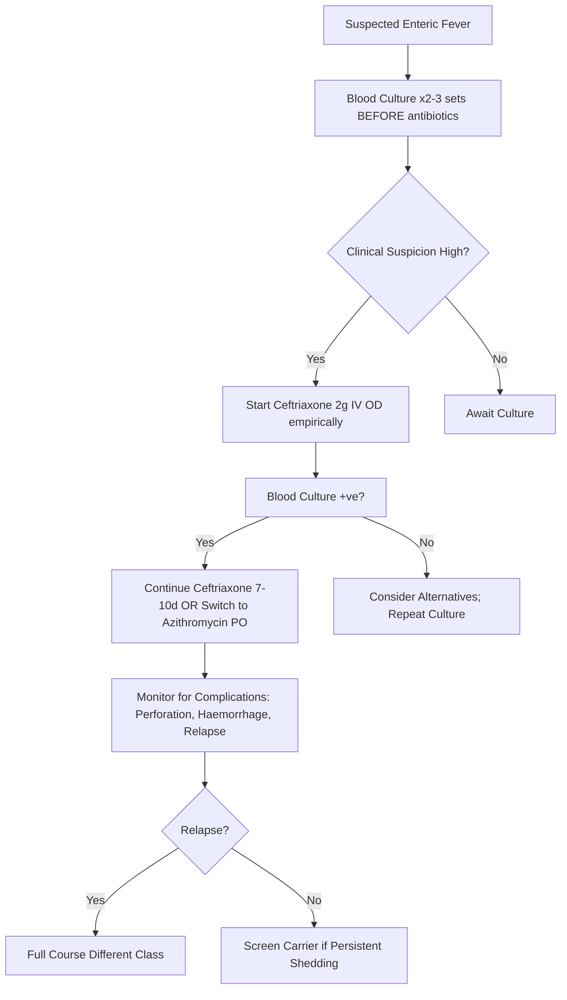

---
tags: [medicine, infectious-disease, davidson, chapter13, typhoid, paratyphoid, salmonella, fcps, mrcp]
davidson_chapter: Chapter 13: Infectious disease
topic_category: Enteric Fever Domain
status: full-fcps-mrcp-topic-note
---

# Typhoid and Paratyphoid Fever (Enteric Fever)

Related: [[Fever in Returned Traveller and FUO]], [[Infective Diarrhoea and Food Poisoning]], [[Travel Medicine and Pre-Travel Advice]], [[Sepsis and Septic Shock]], [[Healthcare-Associated Infections (CLABSI, CAUTI, SSI, VAP)]]

> [!important]
> **Enteric Fever = Typhoid (S. Typhi) + Paratyphoid A/B/C (S. Paratyphi).** **Faecal-oral transmission; chronic carriers (gallbladder).** **Step-ladder fever, relative bradycardia, rose spots, hepatosplenomegaly.** **Blood culture = gold standard (first week); Widal test = supportive.** **Ceftriaxone = 1st-line; Azithromycin for resistant/children; Ciprofloxacin (resistance common).** **Carriers: ciprofloxacin ×4–6w + cholecystectomy if persistent.**

## Learning Objectives
- Recognise clinical features of enteric fever (step-ladder fever, relative bradycardia, rose spots)
- Apply diagnostic approach (blood culture, Widal test, PCR)
- Select empirical therapy by resistance patterns and patient factors
- Manage complications (intestinal perforation, haemorrhage, relapse, carrier state)
- Apply vaccination and public health measures

---

## Epidemiology & Transmission
| Aspect | Details |
|--------|---------|
| **Agents** | **S. Typhi** (typhoid); **S. Paratyphi A, B, C** (paratyphoid) — *S. Paratyphi A* most common paratyphoid |
| **Transmission** | **Faecal-oral** (contaminated food/water, chronic carriers); shellfish, raw vegetables, milk |
| **Reservoir** | **Humans only** (acute cases, convalescent carriers, chronic carriers) |
| **Incubation** | **7–14 days** (range 3–60 days); shorter for paratyphoid |
| **Risk** | Travellers to endemic areas (South Asia, SE Asia, Africa, Latin America); poor sanitation; household contacts |

> [!tip]
> **Chronic carriers:** 1–4% of untreated cases; **gallbladder colonisation** (biofilm on gallstones); shedding in stool >1 year; "Typhoid Mary" phenomenon.

---

## Clinical Features
| Phase | Features |
|-------|----------|
| **Week 1** | **Step-ladder fever** (rising daily), headache, malaise, anorexia, **relative bradycardia** (pulse-temperature dissociation), cough, epistaxis, abdominal discomfort |
| **Week 2** | Fever plateau (39–40°C), **rose spots** (faint salmon macules on trunk, 2–4mm, 10–20%), **hepatosplenomegaly**, abdominal distension, constipation > diarrhoea, **relative bradycardia** |
| **Week 3** | **Complications** (if untreated): intestinal perforation, GI haemorrhage, encephalopathy, myocarditis, abscesses |
| **Week 4** | Gradual defervescence (if survived); **relapse in 10–20%** (1–2 weeks after stopping antibiotics) |

### Key Clinical Signs
| Sign | Significance |
|------|--------------|
| **Step-ladder fever** | Temp rises incrementally each day (classic but not always present) |
| **Relative bradycardia** | Pulse not commensurate with fever (Faget's sign) |
| **Rose spots** | Faint salmon macules on trunk (pathognomonic but only 10–30%); blanch on pressure |
| **Hepatosplenomegaly** | Common by week 2 |
| **Abdominal tenderness** | Right lower quadrant / diffuse |

---

## Diagnosis
| Test | Timing | Sensitivity | Utility |
|------|--------|-------------|---------|
| **Blood Culture** | **Week 1–2 (best first week)** | 40–80% (increases with volume/repeats) | **Gold standard**; allows AST |
| **Bone Marrow Culture** | Any time | **80–95%** | Higher yield if prior antibiotics; invasive |
| **Stool Culture** | Week 2–3 | 30–40% | Late; carrier detection |
| **Urine Culture** | Week 2–3 | Low | Ancillary |
| **Widal Test** | Week 2+ | Variable | **Supportive only**; O ≥1:160, H ≥1:320 suggestive; false +/− common |
| **Typhoid PCR** | Week 1–2 | 80–95% | Rapid; blood/stool/urine; not universally available |
| **Typhidot (IgM/IgG)** | Week 1+ | 70–90% | Rapid; false +/− in endemic areas |

> [!key]
> **Blood culture = gold standard; collect 10–20mL before antibiotics.** **Widal = supportive only (not diagnostic alone).** **Bone marrow = highest yield if antibiotics given.**

---

## Complications
| Complication | Frequency | Management |
|--------------|-----------|------------|
| **Intestinal Perforation** | 1–3% (ileum, terminal ileum) | **Emergency laparotomy** + broad antibiotics (piperacillin-tazobactam/meropenem) |
| **GI Haemorrhage** | 1–5% | Blood transfusion, endoscopy, supportive; surgery if massive |
| **Relapse** | 10–20% (1–4w post-treatment) | Repeat full course antibiotics (different class if resistance) |
| **Chronic Carrier** | 1–4% (if untreated/partial treatment) | Ciprofloxacin 750mg BD ×4–6w + **cholecystectomy** if gallstones |
| **Typhoid Encephalopathy** | <1% | ICU support; high-dose steroids controversial; antibiotics |
| **Abscesses** | Rare | Liver, spleen, lung, bone, brain; drainage + antibiotics |

---

## Treatment
### Uncomplicated Enteric Fever
| Drug | Dose | Duration | Notes |
|------|------|----------|-------|
| **Ceftriaxone** | **2g IV/IM OD** (children 50–75mg/kg) | **7–10 days** | **1st-line** (incl. resistant strains); IV preferred severe |
| **Azithromycin** | **500mg PO OD** (children 15mg/kg) | **7 days** | **1st-line oral** (esp. children, ciprofloxacin-resistant); safe pregnancy |
| **Ciprofloxacin** | 500mg PO 12h (750mg if severe) | 7–10 days | **Only if susceptible** (resistance common: South Asia >90%); avoid children/pregnancy |
| **Cefixime** | 20mg/kg PO 12h (max 400mg) | 7–14 days | Alternative oral; less reliable for resistant strains |

> [!tip]
> **Ceftriaxone = 1st-line (IV/IM); Azithromycin = 1st-line oral.** **Ciprofloxacin resistance >90% in South Asia — avoid empirical use there.** **Azithromycin preferred for children/pregnancy.**

### Severe/Complicated Enteric Fever
| Scenario | Regimen |
|----------|---------|
| **Severe sepsis / shock** | Meropenem 1g IV 8h +/− Azithromycin |
| **Intestinal perforation** | Emergency laparotomy + Meropenem 1g IV 8h |
| **Ciprofloxacin-resistant** | Ceftriaxone 2g IV OD OR Azithromycin 500mg OD |
| **Relapse** | Full course with different class (e.g., azithromycin if ceftriaxone used initially) |

### Chronic Carrier
| Regimen | Duration |
|---------|----------|
| **Ciprofloxacin 750mg PO 12h** | **4–6 weeks** |
| **+ Cholecystectomy** | If gallstones present (90% carriers have gallstones) |

---

## Vaccination
| Vaccine | Type | Schedule | Efficacy | Duration |
|---------|------|----------|----------|----------|
| **Typhoid Conjugate Vaccine (TCV)** | Vi polysaccharide-protein conjugate | Single dose IM | **80–85%** | 3–5 years |
| **Vi Polysaccharide (ViPS)** | Vi capsular polysaccharide | Single dose IM/SC | 60–70% | 2–3 years |
| **Ty21a (Oral)** | Live attenuated (Ty21a strain) | 3 capsules alt days (4 total) | 50–70% | 3–5 years |

> [!tip]
> **TCV = preferred (single dose, higher efficacy, longer duration, usable <2y).** **Ty21a: live, contraindicated immunocompromised/pregnancy.** **Booster every 3 years if ongoing risk.**

---

## Public Health
| Measure | Action |
|---------|--------|
| **Notification** | Statutory notifiable disease |
| **Contact tracing** | Household/close contacts: stool culture ×3; prophylaxis (azithromycin) if carrier |
| **Carrier management** | Exclude from food handling; ciprofloxacin ×4–6w + cholecystectomy |
| **Water/food safety** | Boiled water, cooked food, pasteurised milk |
| **Vaccination** | Travellers to endemic areas; high-risk occupations |

---

## FCPS/MRCP High-Yield Points
- **Enteric fever: S. Typhi (typhoid) + S. Paratyphi A/B/C; faecal-oral; human reservoir**
- **Step-ladder fever, relative bradycardia, rose spots, hepatosplenomegaly**
- **Blood culture = gold standard (week 1); bone marrow = highest yield**
- **Widal test = supportive only (O ≥1:160, H ≥1:320)**
- **Ceftriaxone 2g IV OD = 1st-line; Azithromycin 500mg OD = 1st-line oral**
- **Ciprofloxacin resistance >90% South Asia — avoid empirical**
- **Complications: perforation, haemorrhage, relapse (10–20%), carrier state**
- **Carrier: ciprofloxacin ×4–6w + cholecystectomy if gallstones**
- **Vaccine: TCV single dose (preferred); boosters 3-yearly**

## Common Viva Questions
1. **Gold standard diagnosis of typhoid?** Blood culture (first week); bone marrow if antibiotics given.
2. **Step-ladder fever pattern?** Temperature rises incrementally each day during first week.
3. **Relative bradycardia (Faget's sign)?** Pulse rate disproportionately low for degree of fever.
4. **Rose spots?*** Faint salmon macules on trunk, 2–4mm, blanch on pressure; 10–30% of cases.
5. **First-line treatment?** Ceftriaxone 2g IV OD (7–10d); Azithromycin 500mg PO OD (7d) if oral needed.
6. **Why avoid ciprofloxacin empirically in South Asia?** >90% resistance.
7. **Complications of typhoid?** Intestinal perforation, GI haemorrhage, relapse (10–20%), carrier state.
8. **Chronic carrier management?** Ciprofloxacin 750mg BD ×4–6w + cholecystectomy if gallstones.
9. **Best typhoid vaccine?** Typhoid Conjugate Vaccine (TCV) — single dose, 80–85% efficacy, from 6 months age.
10. **Relapse vs reinfection?** Relapse = same strain, 1–4w post-treatment; reinfection = new exposure.

## Common Confusions / Exam Traps
| Confusion | Clarification |
|-----------|---------------|
| Widal test = diagnostic | **Supportive only; not diagnostic alone** |
| Ciprofloxacin 1st-line everywhere | **Resistance >90% South Asia — use ceftriaxone/azithromycin** |
| Rose spots = pathognomonic | **Only 10–30%; blanch on pressure; not always present** |
| Relapse = treatment failure | **Relapse = same strain 1–4w post-treatment; reinfection = new exposure** |
| Carrier = always symptomatic | **Asymptomatic; excluded from food handling** |
| Widal positive = typhoid | **False + in malaria, typhus, other infections; false - early** |
| Cholecystectomy always needed for carrier | **Only if gallstones present (90% have them); try antibiotics first** |
| Azithromycin not for severe typhoid | **IV azithromycin available; ceftriaxone preferred severe** |
| Typhoid vaccine 100% effective | **TCV 80–85%; hygiene still essential** |
| Paratyphoid = milder typhoid | **Similar severity; S. Paratyphi A most common paratyphoid** |

## Mnemonics
- **TYPHOID**: **T**yphi; **Y**ield blood culture week 1; **P**aratyphi A/B/C; **H**uman reservoir; **O**ral- faecal; **I**ntestinal perforation; **D**rugs: Ceftriaxone/Azithromycin
- **CLINICAL**: **S**tep-ladder fever; **R**elative bradycardia; **O** spots; **P**lastosplenomegaly; **H**epatosis; **O**ne-week blood culture; **I**leal perforation; **I**D: blood culture
- **ROSE SPOTS**: **R**ed-**S**almon; **O**n trunk; **S**mall (2-4mm); **E**phemeral
- **TREATMENT**: **C**eftriaxone **1**st-line IV; **A**zithromycin **1**st-line PO; **C**ipro **NOT** empirical Asia

## Mind Map
```mermaid
mindmap
  root((Enteric Fever))
    Agents
      S. Typhi (Typhoid)
      S. Paratyphi A/B/C
    Transmission
      Faecal-oral; Human reservoir
      Chronic carriers (gallbladder)
    Clinical
      Step-ladder fever
      Relative bradycardia
      Rose spots (salmon macules)
      Hepatosplenomegaly
    Diagnosis
      Blood culture (gold, week 1)
      Bone marrow (if abx given)
      Widal: O≥1:160, H≥1:320 (supportive)
      PCR (rapid)
    Complications
      Intestinal perforation
      GI haemorrhage
      Relapse (10-20%)
      Chronic carrier
    Treatment
      Ceftriaxone 2g IV OD (1st line)
      Azithromycin 500mg PO OD (1st oral)
      Ciprofloxacin only if susceptible
      Carriers: Cipro 4-6w + cholecystectomy
    Vaccines
      TCV (conjugate) - single dose, preferred
      ViPS - polysaccharide
      Ty21a - oral live
```

## Flowchart


## Suggested Visuals / Image Notes
- Step-ladder fever graph
- Rose spots images
- Typhoid ulcer pathology (Peyer's patches)
- Blood culture bottles
- Widal test interpretation

## Suggested Video References
- Typhoid fever clinical features
- Blood culture technique
- Intestinal perforation management
- Typhoid conjugate vaccine

## One-Page Revision Summary
| Topic | Key Points |
|-------|------------|
| **Agents** | S. Typhi (typhoid); S. Paratyphi A/B/C (paratyphoid) |
| **Transmission** | Faecal-oral; human reservoir; chronic carriers (gallbladder) |
| **Clinical** | Step-ladder fever, relative bradycardia, rose spots, hepatosplenomegaly |
| **Diagnosis** | Blood culture (week 1, gold standard); bone marrow (if abx); Widal supportive |
| **Treatment** | Ceftriaxone 2g IV OD (7–10d); Azithromycin 500mg PO OD (7d); Cipro if susceptible |
| **Resistance** | Ciprofloxacin >90% resistant in South Asia |
| **Complications** | Perforation, GI bleed, relapse (10–20%), chronic carrier |
| **Carrier** | Ciprofloxacin 750mg BD ×4–6w + cholecystectomy if gallstones |
| **Vaccine** | TCV single dose (preferred); boosters 3-yearly |

## 24-Hour Recall Prompts
- Step-ladder fever pattern.
- Relative bradycardia (Faget's sign).
- Rose spots description.
- Blood culture timing and volume.
- Widal test interpretation (O and H titres).
- 1st-line antibiotics (ceftriaxone, azithromycin).
- Ciprofloxacin resistance in South Asia.
- Complications: perforation, haemorrhage, relapse, carrier.
- Carrier management (cipro + cholecystectomy).
- Vaccine types (TCV preferred).

## 7-Day / 15-Day / 30-Day Revision Tracker
- [ ] Day 1 completed
- [ ] 24-hour recall completed
- [ ] Day 7 revision completed
- [ ] Day 15 revision completed
- [ ] Day 30 revision completed

## Must Know / Should Know / Nice to Know
### Must Know
- Step-ladder fever, relative bradycardia, rose spots
- Blood culture week 1 = gold standard; Widal supportive
- Ceftriaxone IV / Azithromycin PO = 1st-line
- Ciprofloxacin resistance in South Asia
- Complications: perforation, haemorrhage, relapse, carrier
- Carrier: ciprofloxacin ×4–6w + cholecystectomy
- TCV vaccine preferred

### Should Know
- Paratyphoid features (similar but milder)
- Bone marrow culture yield
- Widal test limitations (false +/-)
- Relapse vs reinfection
- TCV vs ViPS vs Ty21a vaccines
- Pregnancy management (azithromycin/ceftriaxone)

### Nice to Know
- Molecular diagnostics (PCR, WGS)
- Newer antibiotics (aztreonam, cefiderocol)
- Typhoid toxin mechanism
- Carrier molecular epidemiology
- Antimicrobial resistance trends (XDR Typhi)

## Self-Test Scorecard
- Understanding: /10
- Recall: /10
- MCQ Performance: /10
- SBA Performance: /10
- Viva Confidence: /10
- Total: /50

> [!tip]
> Interpretation: <35 = weak topic, 35-44 = acceptable but insecure, 45+ = strong exam-ready topic.

## Exam Answer Modes
### Long Answer Skeleton
1. Epidemiology, transmission, pathogenesis
2. Clinical features (step-ladder fever, relative bradycardia, rose spots, complications)
3. Diagnosis (blood culture, bone marrow, Widal, PCR)
4. Treatment (ceftriaxone, azithromycin, ciprofloxacin, resistance)
5. Complications (perforation, haemorrhage, relapse, carrier)
6. Carrier management
7. Vaccination
7. Public health measures

### Short Note Skeleton
- S. Typhi/Paratyphi; faecal-oral; human reservoir
- Step-ladder fever, relative bradycardia, rose spots, hepatosplenomegaly
- Blood culture week 1 (gold); Widal supportive (O≥160, H≥320)
- Ceftriaxone 2g IV OD / Azithromycin 500mg OD; Cipro if susceptible
- Cipro resistance >90% South Asia
- Complications: perforation, haemorrhage, relapse 10-20%, carrier
- Carrier: Cipro 4-6w + cholecystectomy
- TCV vaccine single dose preferred

### Viva One-Liners
- Blood culture week 1 = gold standard
- Step-ladder fever, relative bradycardia, rose spots
- Ceftriaxone IV / Azithromycin PO = 1st line
- Cipro resistance >90% South Asia
- Carrier = cipro 4-6w + cholecystectomy
- TCV vaccine single dose preferred

### Ward-Case Discussion Points
- 25M, returned from India 2w ago, step-ladder fever, rose spots → blood cultures ×3, start ceftriaxone IV, monitor for complications
- 30F, carrier detected on screening, gallstones on US → ciprofloxacin 750mg BD ×6w → cholecystectomy
- 40M, typhoid treated with ceftriaxone, relapses 2w later → azithromycin 500mg OD ×7d (different class)
- 5M, typhoid, day 14, sudden severe abdominal pain, rigidity → perforation → emergency laparotomy + meropenem

### Last-Night-Before-Exam Sheet
**TYPHOID:** S. Typhi/Paratyphi; faecal-oral. **Clinical:** Step-ladder fever, **relative bradycardia**, **rose spots**, hepatosplenomegaly. **Dx:** Blood culture wk1 (gold); Widal supportive (O≥160, H≥320). **Rx:** **Ceftriaxone 2g IV OD** (7-10d) or **Azithromycin 500mg OD** (7d). **Cipro resistance >90% S Asia.** Complications: perforation, bleed, relapse 10-20%, carrier. **Carrier:** Cipro 4-6w + cholecystectomy. **Vaccine:** TCV single dose preferred.

## Summary
**Enteric fever** encompasses **typhoid fever (*Salmonella Typhi*)** and **paratyphoid fever (*S. Paratyphi A, B, C*)**. **Transmission**: faecal-oral (contaminated food/water); **human reservoir** (acute cases, convalescent carriers, **chronic carriers** with gallbladder colonisation). **Incubation**: 7–14 days (3–60 days). **Clinical**: **Week 1** — step-ladder fever, headache, relative bradycardia (Faget's sign), cough; **Week 2** — fever plateau, **rose spots** (faint salmon macules on trunk, 10–30%), **hepatosplenomegaly**, relative bradycardia, abdominal distension; **Week 3** — **complications**: intestinal perforation (terminal ileum), GI haemorrhage, encephalopathy; **Week 4** — defervescence; **relapse 10–20%** at 1–4 weeks post-treatment. **Diagnosis**: **Blood culture (gold standard, 40–80%, best first week, 10–20mL)**; **bone marrow culture** (80–95%, if prior antibiotics); **Widal test** (supportive: O titre ≥1:160, H ≥1:320); **PCR** (rapid). **Treatment**: **Ceftriaxone 2g IV/IM OD ×7–10d (1st-line)**; **Azithromycin 500mg PO OD ×7d (1st-line oral)**; **Ciprofloxacin 500mg 12h ×7–10d ONLY if susceptible** (resistance >90% in South Asia). **Complications**: intestinal perforation (1–3%, terminal ileum, emergency laparotomy + meropenem), GI haemorrhage (1–5%), relapse (10–20%), chronic carrier (1–4%, gallbladder). **Chronic carrier**: ciprofloxacin 750mg BD ×4–6w + **cholecystectomy** if gallstones (90% have stones). **Vaccination**: **Typhoid Conjugate Vaccine (TCV) single dose (preferred, 80–85% efficacy, from 6 months age)**; Vi polysaccharide (3y); Ty21a oral live (3–5y). **Public health**: notification, contact tracing, carrier exclusion from food handling, water/food safety.

## MCQs (10)
1. **Gold standard for diagnosis of typhoid fever:**
   A. Widal test
   B. **Blood culture (first week)**
   C. Stool culture
   D. Urine culture
   E. Typhidot test

2. **Classical "step-ladder" fever pattern is characteristic of which week of typhoid fever?**
   A. Week 1
   B. Week 2
   C. Week 3
   D. Week 4
   E. All weeks

3. **Relative bradycardia (Faget's sign) in typhoid fever refers to:**
   A. Heart rate <60 bpm
   B. **Pulse not commensurate with fever temperature**
   C. Bradycardia with hypotension
   D. Pulse-temperature dissociation with hypotension
   E. Heart rate >100 with fever

4. **Rose spots in typhoid fever are:**
   A. Large purpuric lesions on legs
   B. **Faint salmon-coloured macules on trunk, 2–4mm, blanch on pressure**
   C. Vesicular lesions on palms/soles
   D. Petechiae on palate
   E. Target lesions on extremities

5. **First-line empirical treatment for uncomplicated typhoid fever in adults:**
   A. Ciprofloxacin 500mg PO 12h
   B. **Ceftriaxone 2g IV/IM OD**
   C. Chloramphenicol
   D. Co-trimoxazole
   E. Azithromycin (if IV unavailable)

6. **Ciprofloxacin resistance in Salmonella Typhi in South Asia:**
   A. <10%
   B. 20–30%
   C. 50–60%
   D. **>90%**
   E. 100%

7. **Chronic typhoid carrier state is defined as excretion of S. Typhi in stool for:**
   A. >1 month
   B. >3 months
   C. **>1 year**
   D. >6 months
   E. >2 years

8. **Definitive management of chronic typhoid carrier with gallstones:**
   A. Ciprofloxacin alone ×4 weeks
   B. **Ciprofloxacin ×4–6 weeks + cholecystectomy**
   C. Cholecystectomy alone
   D. Ceftriaxone ×2 weeks
   E. Azithromycin ×4 weeks

9. **Best typhoid vaccine for travellers to endemic areas:**
   A. Ty21a oral live vaccine
   B. Vi polysaccharide vaccine
   C. **Typhoid Conjugate Vaccine (TCV) — single dose**
   D. All equally effective
   E. No vaccine available

10. **Complication of typhoid fever occurring most commonly in third week if untreated:**
    A. Myocarditis
    B. **Intestinal perforation**
    C. Meningitis
    D. Pneumonia
    E. Arthritis

## SBA Questions (10)
1. **A 28-year-old man returns from a 3-week trip to India. He presents with 10 days of fever (step-ladder pattern), relative bradycardia, and faint salmon macules on his trunk. Blood cultures are pending. Empirical treatment?**
   A. Ciprofloxacin 500mg PO 12h
   B. **Ceftriaxone 2g IV OD**
   C. Chloramphenicol 500mg 6h
   D. Azithromycin 500mg PO OD (if IV not possible)
   E. Co-trimoxazole

2. **A 30-year-old woman returns from Pakistan with confirmed typhoid fever (blood culture positive, ciprofloxacin-resistant). She is pregnant at 20 weeks. Best treatment?**
   A. Ciprofloxacin 500mg 12h
   B. **Ceftriaxone 2g IV OD** (or Azithromycin 500mg PO OD)
   C. Chloramphenicol
   D. Trimethoprim-sulfamethoxazole
   E. No treatment until delivery

3. **A 40-year-old man treated for typhoid fever with ceftriaxone completes 10-day course. Two weeks later, he develops fever again. Blood culture grows S. Typhi (same susceptibility). Management?**
   A. Repeat ceftriaxone for 14 days
   B. **Azithromycin 500mg PO OD ×7 days** (different class for relapse)
   C. Ciprofloxacin 500mg 12h ×10d
   D. Extend ceftriaxone to 21 days
   E. Add ciprofloxacin to ceftriaxone

4. **A 50-year-old man is identified as a chronic typhoid carrier during screening. Abdominal ultrasound shows gallstones. He is asymptomatic. Management?**
   A. No treatment needed (asymptomatic)
   B. **Ciprofloxacin 750mg BD ×4–6 weeks + cholecystectomy**
   C. Ceftriaxone 2g IV OD ×2 weeks
   D. Azithromycin 500mg OD ×4 weeks
   E. Cholecystectomy only

5. **A 5-year-old child presents with 10 days of fever, rose spots, hepatosplenomegaly. Blood culture: S. Typhi sensitive to all antibiotics. Best oral treatment?**
   A. Ciprofloxacin
   B. **Azithromycin 15mg/kg OD ×7 days**
   C. Ceftriaxone IM
   D. Chloramphenicol
   C. Trimethoprim-sulfamethoxazole

6. **A traveller from Bangladesh presents with typhoid fever. Blood culture grows S. Typhi resistant to ciprofloxacin, ceftriaxone, and azithromycin (XDR). Best treatment?**
   A. Meropenem 1g IV 8h
   B. Azithromycin high dose
   C. Carbapenem (meropenem) 1g IV 8h
   D. Tigecycline
   E. Cefepime

7. **A chronic typhoid carrier (gallstones present) is treated with ciprofloxacin 750mg BD for 6 weeks. Follow-up stool culture at 4 weeks still positive. Next step?**
   A. Extend ciprofloxacin to 12 weeks
   B. **Cholecystectomy + continue ciprofloxacin 2 more weeks**
   C. Switch to azithromycin
   C. Add rifampicin
   E. Ceftriaxone IV

9. **A 30-year-old pregnant woman (28 weeks) diagnosed with typhoid fever. Best treatment?**
   A. Ciprofloxacin 500mg 12h
   B. **Ceftriaxone 2g IV OD** (or Azithromycin 500mg PO OD)
   C. Chloramphenicol
   D. Trimethoprim-sulfamethoxazole
   E. No treatment until delivery

10. **Typhoid Conjugate Vaccine (TCV) — correct statement:**
    A. Live attenuated oral vaccine
    B. **Single dose IM, efficacious from 6 months age, 80–85% efficacy**
    C. Requires 3 doses
    D. Only for adults >18 years
    E. Efficacy <50%

## Flashcards
- Q: Typhoid gold standard dx
  A: Blood culture week 1
- Q: Step-ladder fever
  A: Temp rises daily week 1
- Q: Relative bradycardia
  A: Pulse not matching fever (Faget's sign)
- Q: Rose spots
  A: Salmon macules trunk, 2-4mm, blanch
- Q: 1st line typhoid Rx
  A: Ceftriaxone IV / Azithromycin PO
- Q: Cipro resistance S. Typhi
  A: >90% South Asia
- Q: Carrier management
  A: Cipro 4-6w + cholecystectomy if stones
- Q: Relapse vs reinfection
  A: Same strain 1-4w post-tx vs new exposure
- Q: Best vaccine
  A: TCV single dose
- Q: Complications
  A: Perforation, bleed, relapse, carrier

## Answer Key with Explanations
### MCQs
1. **B** — Blood culture in first week is gold standard (sensitivity 40–80%).
2. **A** — Step-ladder fever pattern occurs in week 1 (temperature rises incrementally each day).
3. **B** — Relative bradycardia = pulse not commensurate with fever temperature (Faget's sign).
4. **B** — Rose spots: faint salmon-coloured macules on trunk, 2–4mm, blanch on pressure.
5. **B** — Ceftriaxone 2g IV/IM OD is 1st-line empirical therapy for typhoid fever.
6. **D** — Ciprofloxacin resistance in S. Typhi exceeds 90% in South Asia.
7. **C** — Chronic carrier = excretion of S. Typhi in stool/urine for >1 year.
8. **B** — Chronic carrier with gallstones = ciprofloxacin 750mg BD ×4–6w + cholecystectomy.
9. **C** — Typhoid Conjugate Vaccine (TCV) = single dose IM, efficacious from 6 months, 80–85% efficacy.
10. **B** — Intestinal perforation (terminal ileum) most common in week 3 if untreated.

### SBAs
1. **B** — Step-ladder fever, relative bradycardia, rose spots = classic typhoid; ceftriaxone IV 1st-line empirical.
2. **B** — Pregnancy + ciprofloxacin-resistant typhoid = ceftriaxone IV (safe) or azithromycin PO (safe).
3. **B** — Relapse (same strain, 1–4w post-treatment) = switch to different class (azithromycin).
4. **B** — Chronic carrier + gallstones = ciprofloxacin 4–6w + cholecystectomy.
5. **B** — Child = azithromycin 15mg/kg OD ×7d (fluoroquinolones contraindicated <8y).
6. **A** — XDR typhoid = carbapenem (meropenem) only reliable option.
7. **B** — Persistent carriage despite antibiotics + gallstones → cholecystectomy + continue antibiotics.
8. **B** — Pregnancy = ceftriaxone IV (safe) or azithromycin PO (safe); avoid cipro/chloramphenicol/TMP-SMX.
9. **B** — TCV = single dose IM, 6m+, 80–85% efficacy; ViPS = 3y; Ty21a = oral live.
10. **B** — Chronic carrier + gallstones persistent despite cipro → cholecystectomy + continue abx.

## Flashcards
- Q: Typhoid gold standard
  A: Blood culture week 1
- Q: Step-ladder fever
  A: Temp rises daily week 1
- Q: Relative bradycardia
  A: Pulse not matching fever
- Q: Rose spots
  A: Salmon macules trunk, blanch
- Q: Typhoid 1st line
  A: Ceftriaxone IV / Azithromycin PO
- Q: Cipro resistance
  A: >90% South Asia
- Q: Carrier management
  A: Cipro 4-6w + cholecystectomy
- Q: Relapse vs reinfection
  A: Same strain 1-4w vs new exposure
- Q: Best vaccine
  A: TCV single dose
- Q: Complications
  A: Perforation, bleed, relapse, carrier

## Answer Key with Explanations
### MCQs
1. **B** — Blood culture in first week is gold standard diagnosis for typhoid fever.
2. **A** — Step-ladder fever pattern occurs during the first week of illness.
3. **B** — Relative bradycardia = pulse not commensurate with fever (Faget's sign).
4. **B** — Rose spots = faint salmon macules on trunk, 2–4mm, blanch on pressure.
5. **B** — Ceftriaxone 2g IV/IM OD is 1st-line empirical therapy.
6. **D** — Ciprofloxacin resistance >90% in South Asia (travel-associated typhoid).
7. **C** — Chronic carrier defined as excretion >1 year.
8. **B** — Carrier with gallstones = ciprofloxacin 4–6w + cholecystectomy.
9. **C** — TCV = single dose, 6m+, 80–85% efficacy.
10. **B** — Intestinal perforation (terminal ileum) peak in week 3.

### SBAs
1. **B** — Classic typhoid presentation; ceftriaxone IV empirical 1st-line.
2. **B** — Pregnancy + cipro-resistant = ceftriaxone (safe) or azithromycin (safe).
3. **B** — Relapse = same strain, 1–4w post-treatment; switch to different class (azithromycin).
4. **B** — Carrier + gallstones = ciprofloxacin ×4–6w + cholecystectomy.
5. **B** — Children <8y: fluoroquinolones contraindicated; azithromycin preferred.
6. **A** — XDR typhoid (resistant to cipro, ceftriaxone, azithromycin) → carbapenem (meropenem).
7. **B** — Persistent carriage despite antibiotics + gallstones → cholecystectomy + continue abx.
8. **B** — Pregnancy: ceftriaxone IV or azithromycin PO safe; avoid cipro/chloramphenicol/TMP-SMX.
9. **B** — TCV single dose IM, 6m+, 80–85% efficacy; preferred over ViPS/Ty21a.
10. **B** — Persistent carriage post-antibiotics + gallstones → cholecystectomy + continue abx.

### Flashcards
- Q: Typhoid gold standard
  A: Blood culture week 1
- Q: Step-ladder fever
  A: Temp rises daily week 1
- Q: Relative bradycardia
  A: Pulse not matching fever
- Q: Rose spots
  A: Salmon macules, trunk, blanch
- Q: Typhoid 1st line
  A: Ceftriaxone IV / Azithromycin PO
- Q: Cipro resistance
  A: >90% South Asia
- Q: Carrier management
  A: Cipro 4-6w + cholecystectomy
- Q: Relapse vs reinfection
  A: Same strain 1-4w vs new exposure
- Q: Best vaccine
  A: TCV single dose

### Answer Key with Explanations
### MCQs
1. **B** — Blood culture in the first week of illness is the gold standard for diagnosing typhoid fever (sensitivity 40–80%).
2. **A** — The classic step-ladder fever pattern (daily incremental temperature rise) occurs in week 1.
3. **B** — Relative bradycardia (Faget's sign) = pulse rate disproportionately low for the degree of fever.
4. **B** — Rose spots are faint salmon-coloured macules on the trunk, 2–4mm, that blanch on pressure.
5. **B** — Ceftriaxone 2g IV/IM once daily is the first-line empirical therapy for uncomplicated typhoid fever.
6. **D** — Ciprofloxacin resistance in S. Typhi exceeds 90% in South Asia.
7. **C** — Chronic typhoid carrier is defined as excretion of S. Typhi in stool/urine for >1 year.
8. **B** — Carrier with gallstones: ciprofloxacin 750mg BD ×4–6 weeks + cholecystectomy.
9. **C** — Typhoid Conjugate Vaccine (TCV): single dose IM, efficacious from 6 months, 80–85% efficacy.
10. **B** — Intestinal perforation (typically terminal ileum) most commonly occurs in week 3 if untreated.

### SBAs
1. **B** — Classic typhoid presentation; ceftriaxone 2g IV OD is first-line empirical therapy.
2. **B** — Pregnancy + ciprofloxacin-resistant = ceftriaxone 2g IV (safe in pregnancy) OR azithromycin 500mg PO OD.
3. **B** — Relapse = same strain, 1–4 weeks post-treatment completed; switch to different antibiotic class (azithromycin).
4. **B** — Chronic carrier with gallstones = ciprofloxacin 750mg BD ×4–6 weeks + cholecystectomy.
5. **B** — Children <8 years: fluoroquinolones contraindicated; azithromycin 15mg/kg OD ×7d is preferred.
6. **A** — XDR typhoid (resistant to ciprofloxacin, ceftriaxone, azithromycin): carbapenem (meropenem) is only reliable option.
7. **B** — Persistent stool positivity despite cipro + gallstones → cholecystectomy + continue antibiotics.
8. **B** — Pregnancy = ceftriaxone IV or azithromycin PO safe; avoid ciprofloxacin, chloramphenicol, TMP-SMX.
9. **B** — TCV = single dose IM, 6m+, 80–85% efficacy; preferred over ViPS (3y) and Ty21a (oral live).
10. **B** — Chronic carrier with gallstones persistent after 6 weeks cipro → cholecystectomy + continue antibiotics.

---

## PasTest Scenario SBAs (Clinical Vignettes)

> **Auto-generated PasTest/Mediscope-style scenario SBAs** grounded in the authored source. Each scenario tests a real clinical fact (triad, specific sign, contraindication, trial, first-line Rx) extracted from the topic. *Source: Ch 14: Infectious Disease — Typhoid and Paratyphoid Fever*

**Q1.** Which of the following features is most specific or characteristic of Typhoid and Paratyphoid Fever?

  - **A.** Rose spots
  - **B.** A feature common to many acute inflammatory conditions
  - **C.** A non-specific sign that does not localise the diagnosis
  - **D.** An investigation finding rather than a clinical feature

  > **Answer: A** — Rose spots
  >
  > *Source:* always present) |
| **Relative bradycardia** | Pulse not commensurate with fever (Faget's sign) |
| **Rose spots** | Faint salmon macules on trunk (pathognomonic but only 10–30%); blanch on pressure |

**Q2.** What is the most appropriate first-line therapy for Typhoid and Paratyphoid Fever?

  - **A.** Cefixime + Ceftriaxone =
  - **B.** An advanced/surgical therapy reserved for refractory disease
  - **C.** Symptomatic treatment only, no disease-modifying therapy
  - **D.** Empiric broad-spectrum therapy without specific indication

  > **Answer: A** — Cefixime + Ceftriaxone =
  >
  > *Source:* **Cefixime**   20mg/kg PO 12h (max 400mg)   7–14 days   Alternative oral; less reliable for resistant strains  

> [!tip]
> **Ceftriaxone = 1st-line (IV/IM); Azithromycin = 1st-line oral.** **Ciproflo

