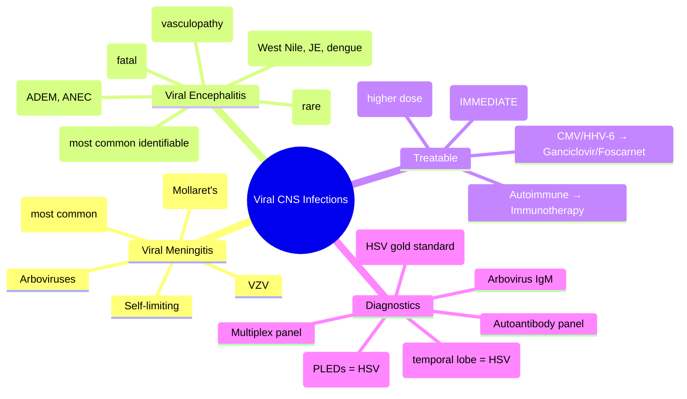

---
tags: [medicine, infectious-disease, davidson, chapter13, cns, encephalitis, meningitis, fcps, mrcp]
davidson_chapter: Chapter 13: Infectious disease
topic_category: Central Nervous System Infections Domain
status: full-fcps-mrcp-topic-note
---

# Viral Encephalitis and Meningitis

Related: [[Acute Bacterial Meningitis]], [[Tuberculous Meningitis]], [[HIV-Associated Opportunistic Infections]], [[Fever and Septic Syndrome Approach]]

> [!important]
> **Viral encephalitis** = brain parenchymal inflammation (AMS, focal signs, seizures) — **HSV-1 is the most common identifiable cause and the ONLY treatable one with specific antiviral (aciclovir).** **Viral meningitis** = meningeal inflammation without parenchymal involvement — usually self-limiting (enteroviruses). **Start aciclovir immediately if encephalitis suspected — do not wait for PCR.**

## Learning Objectives
- Distinguish viral meningitis (self-limiting) from viral encephalitis (emergency)
- Recognise HSV encephalitis clinical-radiological signature (temporal lobe, personality change, seizures)
- Initiate empirical aciclovir within 1 hour for suspected encephalitis
- Apply CSF interpretation: lymphocytic pleocytosis, normal glucose, normal/mildly ↑ protein
- Know indications for MRI, EEG, PCR panel, autoantibody panels
- Manage complications: raised ICP, seizures, long-term neurocognitive sequelae

## Definition
| Syndrome | Definition | Key Feature |
|----------|------------|-------------|
| **Viral meningitis** | Inflammation of leptomeninges by virus | **No parenchymal involvement**; AMS rare; self-limiting |
| **Viral encephalitis** | Inflammation of brain parenchyma by virus | **AMS, focal deficits, seizures, personality change**; high morbidity/mortality |
| **Meningoencephalitis** | Combined meningeal + parenchymal involvement | Overlap features |

## Core Microbiology — Aetiology
| Category | Pathogens | Key Features |
|----------|-----------|--------------|
| **Herpesviruses (treatable)** | **HSV-1** (adult encephalitis #1), HSV-2 (neonatal, genital, Mollaret's), VZV (shingles, Ramsay Hunt), EBV, CMV, HHV-6 | **Aciclovir effective**; HSV-1 = temporal lobe; VZV = vasculopathy |
| **Enteroviruses** | Coxsackie, Echo, Enterovirus D68, Poliovirus | **Most common viral meningitis**; summer/autumn; hand-foot-mouth, herpangina, acute flaccid myelitis (EV-D68) |
| **Arboviruses (vector-borne)** | West Nile, Japanese encephalitis, St. Louis, La Crosse, dengue neurotropic, Zika, chikungunya, tick-borne encephalitis | Geographic; Culex/Aedes mosquitoes; CSF IgM +ve |
| **Respiratory viruses** | Influenza, RSV, hMPV, parainfluenza, adenovirus, SARS-CoV-2 | Post-viral / para-infectious; acute necrotising encephalopathy (ANEC) |
| **Zoonotic** | Rabies (fatal), Nipah, Hendra, Lymphocytic choriomeningitis virus (LCMV) | Animal exposure; rabies = hydrophobia, agitation, fatal |
| **Other** | Mumps (pre-vaccine era), measles (SSPE), HIV (acute seroconversion, chronic) | Vaccine-preventable; SSPE = subacute sclerosing panencephalitis |

## Normal Values / Important Cut-offs
| Parameter | Viral Meningitis | Viral Encephalitis | Bacterial Meningitis |
|-----------|------------------|--------------------|----------------------|
| **Opening pressure** | Normal or mildly ↑ (10–25) | Normal/mildly ↑ | **↑↑ (>25)** |
| **WBC count** | **10–500 (lymphocytes)** | **10–500 (lymphocytes)** | **↑↑↑ neutrophils** |
| **Protein** | Normal/mildly ↑ (45–150) | Mildly ↑ (50–200) | **↑↑ (100–500)** |
| **Glucose (CSF/serum)** | **Normal (>0.6)** | **Normal (>0.6)** | **↓↓ (<0.4)** |
| **Gram stain** | Negative | Negative | Positive 60–80% |
| **PCR panel** | **Enterovirus, HSV, VZV, parechovirus** | **HSV-1/2, VZV, enterovirus, arboviruses** | Bacterial targets |
| **CSF IgM (arboviruses)** | — | Positive (diagnostic) | — |
| **Autoantibody panel** | — | Anti-NMDA, LGI1, CASPR2, etc. | — |

> [!tip]
> **CSF glucose NORMAL = viral (or TB/fungal if low); CSF glucose LOW = bacterial/TB/fungal.** Normal glucose essentially rules out typical bacterial meningitis.

## Clinical Differentiation
| Feature | Viral Meningitis | Viral Encephalitis |
|---------|------------------|--------------------|
| **Onset** | Acute (hours–days) | Subacute (days–weeks) |
| **Fever** | Yes | Yes |
| **Headache** | Severe | Moderate-severe |
| **Neck stiffness** | Prominent | Variable (may be absent) |
| **Photophobia** | Common | Variable |
| **Altered mental status** | **Absent/mild** | **Prominent (confusion, agitation, coma)** |
| **Focal neurological deficits** | Absent | **Present (aphasia, hemiparesis, cranial nerves)** |
| **Seizures** | Rare | **Common (30–50%)** |
| **Personality/behaviour change** | Absent | **Prominent (HSV: temporal lobe → personality, memory)** |
| **Outcome** | **Full recovery (days–2w)** | **Mortality 10–30%; sequelae 30–50%** |

## Approach / Algorithm
```mermaid
flowchart TD
  A[Suspected CNS infection: fever + headache + neck stiffness +/- AMS/seizures] --> B{Encephalitis features? AMS, focal signs, seizures, personality change}
  B -->|Yes| C[EMERGENCY: Start IV Aciclovir 10mg/kg 8h IMMEDIATELY]
  B -->|No (meningitis only)| D[Supportive care; LP if no contraindications]
  C --> E[LP if safe (same contraindications as bacterial)]
  E --> F[CSF: cell count, protein, glucose, PCR panel (HSV, VZV, enterovirus), HSV PCR specific]
  F --> G[MRI brain with contrast (DWI, FLAIR, T2) — temporal lobe = HSV]
  G --> H[EEG if seizures suspected — temporal periodic complexes = HSV]
  H --> I[Autoantibody panel if PCR negative (anti-NMDA, LGI1, CASPR2, etc.)]
  I --> J[Continue aciclovir 14–21d if HSV PCR +ve; stop if -ve and alternative dx]
```

## Investigations
| Test | Indication | Interpretation |
|------|------------|----------------|
| **CSF HSV PCR** | All suspected encephalitis | **Gold standard for HSV**; sensitivity 95–98%, specificity >99%; may be -ve <72h |
| **Multiplex PCR panel (FilmArray)** | All CNS infections | Rapid (1h): HSV-1/2, VZV, enterovirus, parechovirus, HHV-6, bacteria |
| **CSF VZV PCR** | Shingles + CNS, Ramsay Hunt | Sensitivity 70–90% |
| **CSF enterovirus PCR** | Suspected viral meningitis | High sensitivity; seasonal |
| **Arbovirus IgM (CSF/serum)** | Travel, geographic exposure | West Nile, JE, dengue, Zika, TBE; IgM in CSF = CNS infection |
| **MRI brain (contrast, DWI, FLAIR)** | All encephalitis; meningitis if atypical | **HSV: T2/FLAIR hyperintensity medial temporal lobes ± insula ± cingulate**; DWI restricted |
| **EEG** | Seizures, encephalopathy | **HSV: periodic lateralised epileptiform discharges (PLEDs) / temporal periodic complexes** |
| **Autoantibody panel (CSF/serum)** | PCR-negative encephalitis | Anti-NMDAR, LGI1, CASPR2, AMPAR, GABA-B, DPPX — treatable immune encephalitis |
| **Serology (paired acute/convalescent)** | Arboviruses, specific viruses | 4-fold rise = acute infection |
| **Blood PCR / NAAT** | HIV, CMV, EBV, enterovirus | Supplementary |

## Treatment
### Specific Antivirals
| Virus | Drug | Dose (Adult) | Duration | Notes |
|-------|------|--------------|----------|-------|
| **HSV-1/2** | **IV Aciclovir** | **10mg/kg IV 8h** (adjust renal) | **14–21 days** | **Start IMMEDIATELY** — do not wait for PCR; renal adjust essential |
| **VZV** | IV Aciclovir | 10–15mg/kg IV 8h | 10–14 days | Higher dose for encephalitis/vasculopathy |
| **CMV** | Ganciclovir / Valganciclovir | 5mg/kg IV 12h / 900mg PO 12h | 2–3w induction | Immunocompromised; monitor neutrophils |
| **HHV-6** | Ganciclovir / Foscarnet | 5mg/kg IV 12h / 90mg/kg IV 8h | 2–3w | Post-transplant encephalitis |
| **Enterovirus** | Pleconaril (investigational) | — | — | No licensed antiviral; supportive; IVIG for severe |
| **Arboviruses** | Supportive | — | — | No specific antiviral; IVIG sometimes used (West Nile) |
| **Rabies** | **Post-exposure prophylaxis ONLY** | Rabies vaccine + HRIG | — | **No treatment once symptomatic — fatal** |

### Adjunctive / Supportive
| Measure | Indication |
|---------|------------|
| **Seizure control** | Levetiracetam preferred (minimal interactions); phenytoin/valproate alternatives |
| **Raised ICP** | Head elevation, mannitol/hypertonic saline, hyperventilation (temp), ICP monitoring |
| **IVIG** | Post-infectious encephalomyelitis (ADEM), anti-NMDAR encephalitis, severe enterovirus |
| **Corticosteroids** | **Autoimmune encephalitis** (high-dose methylprednisolone); **VZV vasculopathy**; **ADEM**; **NOT routine for viral** |
| **Plasma exchange** | Severe autoimmune encephalitis, ADEM |
| **Rituximab** | Refractory anti-NMDAR, LGI1, CASPR2 encephalitis |

## Herpes Simplex Encephalitis (HSE) — THE MUST-KNOW
| Feature | Detail |
|---------|--------|
| **Pathogen** | HSV-1 (>90% adult); HSV-2 (neonatal, immunocompromised) |
| **Pathogenesis** | Reactivation from trigeminal ganglion → olfactory/temporal lobes |
| **Peak age** | Bimodal: <3y and >50y |
| **Classic triad** | Fever, **personality/behaviour change**, **seizures** (focal temporal) |
| **Other features** | Anosmia, aphasia, memory loss, hallucinations, psychosis |
| **CSF** | Lymphocytic pleocytosis (50–500), normal glucose, ↑ protein, **RBCs common (haemorrhagic necrosis)**, **HSV PCR +ve** |
| **MRI** | **T2/FLAIR hyperintensity medial temporal lobes ± insula ± cingulate**; haemorrhage on GRE/SWI; **DWI restriction** |
| **EEG** | **Periodic lateralised epileptiform discharges (PLEDs) / temporal periodic complexes** (specific but not sensitive) |
| **Treatment** | **IV Aciclovir 10mg/kg 8h ×14–21d** (renal adjust: CrCl 10–25 → 10mg/kg 12h; CrCl <10 → 10mg/kg 24h; HD → 10mg/kg post-dialysis) |
| **Mortality** | Untreated 70%; treated 15–20% |
| **Sequelae** | Memory impairment, personality change, epilepsy (30–50%) |
| **Relapse** | 10–25% at 1–3m (immune-mediated) — repeat MRI/LP, consider steroids |

## Autoimmune Encephalitis — Mimics Viral
| Syndrome | Antibody | Clinical Clues | Treatment |
|----------|----------|----------------|-----------|
| **Anti-NMDAR encephalitis** | Anti-NMDAR | Young women; psychiatric prodrome → seizures, dyskinesias, autonomic instability, catatonia; **ovarian teratoma** | IVIG + methylprednisolone + rituximab; tumour removal |
| **LGI1 encephalitis** | Anti-LGI1 | Older men; **faciobrachial dystonic seizures (FBDS)**, hyponatraemia, limbic encephalitis | IVIG + steroids; good response |
| **CASPR2 encephalitis** | Anti-CASPR2 | Morvan syndrome (neuromyotonia, insomnia, autonomic), limbic encephalitis | IVIG + steroids |
| **Anti-GABA-B** | Anti-GABA-B | Limbic encephalitis, seizures; **SCLC association** | Tumour treatment + immunotherapy |
| **ADEM** | Post-infectious / post-vaccinal | Children; multifocal demyelination; encephalopathy + polyfocal deficits | High-dose methylprednisolone + IVIG/plasma exchange |

## Red Flags / Emergencies
- **Suspected HSV encephalitis** → **Aciclovir within 1h** — delay increases mortality
- **Raised ICP / herniation** → mannitol, hypertonic saline, hyperventilation, neurosurgery
- **Status epilepticus** → benzodiazepines → levetiracetam/phenytoin/phenobarbital → ICU
- **Autonomic instability** (anti-NMDAR) → ICU monitoring
- **Rabies exposure** → **immediate PEP** — once symptomatic, 100% fatal

## Differential Diagnosis
| Condition | Distinguishing Features |
|-----------|-------------------------|
| **Bacterial meningitis** | CSF: neutrophils, low glucose, high protein; Gram stain +ve; rapid progression |
| **TB meningitis** | Subacute >1w; CSF: lymphocytes, low glucose, high protein; basal exudates; GeneXpert |
| **Fungal (Cryptococcal)** | Immunocompromised; India ink/CrAg +ve; ↑ opening pressure |
| **Autoimmune encephalitis** | Subacute; psychiatric features; autoantibodies +ve; MRI may show limbic T2 hyperintensity |
| **Neurosyphilis** | Argyll Robertson pupil, tabes dorsalis; CSF VDRL +ve; serology +ve |
| **Malignancy (paraneoplastic, lymphoma)** | Subacute; systemic cancer signs; autoantibodies (Hu, Yo, Ma2); CSF cytology |
| **Stroke (limbic infarct)** | Acute; DWI restriction territorial; no fever/pleocytosis |
| **Metabolic / toxic** | Hyponatraemia, hepatic encephalopathy, alcohol withdrawal, drugs |

## Special Situations
| Situation | Management |
|-----------|------------|
| **Pregnancy** | Aciclovir safe (category B); HSV encephalitis = treat aggressively; VZV = treat |
| **Neonates** | HSV-2 encephalitis: aciclovir 20mg/kg IV 8h ×21d; CSF PCR, liver function, eye exam |
| **Immunocompromised** | Broader differential: CMV, HHV-6, EBV, JC virus (PML), fungi, TB, toxoplasma; aciclovir still first-line for HSV |
| **Renal impairment** | **Aciclovir renal adjust critical** — crystalluria, AKI risk; dose by CrCl |
| **Post-HSCT** | HHV-6 encephalitis (ganciclovir/foscarnet); CMV; adenovirus |

## FCPS/MRCP High-Yield Points
- **Encephalitis vs meningitis:** AMS + focal signs + seizures = encephalitis (emergency); meningitis = meningeal signs only, no parenchymal involvement
- **HSV-1 = most common identifiable cause of sporadic encephalitis** — temporal lobe, personality change, seizures
- **Start IV aciclovir 10mg/kg 8h IMMEDIATELY** — do NOT wait for PCR/LP/MRI
- **Aciclovir renal adjustment:** CrCl 10–25 → 10mg/kg 12h; CrCl <10 → 10mg/kg 24h; HD → 10mg/kg post-HD
- **HSV PCR sensitivity 95–98%**; may be negative <72h — repeat at 48–72h if high suspicion
- **MRI hallmark:** bilateral medial temporal lobe T2/FLAIR hyperintensity ± haemorrhage ± DWI restriction
- **EEG hallmark:** PLEDs / temporal periodic complexes
- **Autoimmune encephalitis mimics viral:** anti-NMDAR (young women, psychiatric, ovarian teratoma), LGI1 (FBDS, hyponatraemia), CASPR2, ADEM
- **Enterovirus = most common viral meningitis** (summer/autumn); self-limiting, supportive
- **Arboviruses:** West Nile (acute flaccid paralysis), JE (rural Asia), dengue/Zika/chikungunya (travel)
- **Rabies:** fatal once symptomatic; PEP = vaccine + HRIG (pre-exposure: vaccine only)

## Common Viva Questions
1. **What is the most common cause of sporadic viral encephalitis?** HSV-1.
2. **When do you start aciclovir in suspected encephalitis?** Immediately — within 1 hour, do not wait for LP/MRI/PCR.
3. **What is the classic MRI finding in HSV encephalitis?** Bilateral medial temporal lobe T2/FLAIR hyperintensity ± insula ± cingulate; haemorrhage common.
4. **How do you distinguish viral meningitis from encephalitis clinically?** Encephalitis = AMS, focal deficits, seizures, personality change; meningitis = meningeal signs only, no parenchymal involvement.
5. **What is the aciclovir dose for HSV encephalitis and renal adjustment?** 10mg/kg IV 8h ×14–21d; CrCl 10–25: 10mg/kg 12h; CrCl <10: 10mg/kg 24h; HD: 10mg/kg post-dialysis.
6. **Name three autoimmune encephalitis syndromes that mimic viral encephalitis.** Anti-NMDAR, LGI1 (FBDS), CASPR2, ADEM.
7. **What is the most common cause of viral meningitis?** Enteroviruses (coxsackie, echo) — summer/autumn.
8. **When do you suspect anti-NMDAR encephalitis?** Young woman, psychiatric prodrome → seizures, dyskinesias, autonomic instability, catatonia; check for ovarian teratoma.

## Common Confusions / Exam Traps
| Confusion | Clarification |
|-----------|---------------|
| Wait for HSV PCR before starting aciclovir | **NEVER** — start aciclovir immediately; delay = mortality |
| Viral meningitis has low CSF glucose | **Normal glucose** in viral; low glucose = bacterial/TB/fungal |
| Aciclovir dose same for all indications | **Encephalitis: 10mg/kg 8h**; herpes zoster: 10mg/kg 8h (or 800mg PO 5×/d); neonatal: 20mg/kg 8h |
| MRI normal rules out HSV encephalitis | **Early MRI may be normal** (first 24–48h); repeat at 48–72h; PCR is more sensitive early |
| All encephalitis is viral | **Autoimmune encephalitis common mimic** — antibody panel if PCR negative |
| Arboviruses only in tropics | West Nile in US/Europe; TBE in Europe/Asia; travel history key |
| IVIG for all viral encephalitis | Only for specific indications: anti-NMDAR, ADEM, post-infectious, severe enterovirus |
| Rabies treatable once symptomatic | **100% fatal** — only PEP works |

## Mnemonics
- **HSV ENCEPHALITIS**: **H**SV-1, **S**tart aciclovir **V**ery fast, **E**NCEPHALITIS = **E**mergency; **M**edial **T**emporal on **MRI**; **P**LEDs on **EEG**; **A**Ciclovir 10mg/kg 8h; **L**ymphocytic CSF; **I**mmediate start; **T**reat 14–21d; **I**CU if needed; **S**equelae memory/seizures
- **AUTOIMMUNE ENCEPH**: **A**nti-NMDAR (young F, teratoma), **U**nresponsive? FBDS = LGI1, **T**umour check, **O**lder M = LGI1/CASPR2, **I**VIG + steroids + rituximab, **M**emory limbic, **M**orvan = CASPR2, **U**nusual abs, **N**MDA receptor, **E**EG extreme delta brush
- **VIRAL MENINGITIS**: **E**nterovirus #1, **N**ormal glucose, **T**reat supportive, **E**nterovirus PCR, **R**ecovery full, **M**ild AMS only

## Mind Map


## Flowchart
```mermaid
flowchart TD
  A[Fever + headache + neuro symptoms] --> B{AMS / focal signs / seizures / personality change?}
  B -->|Yes = Encephalitis| C[IV Aciclovir 10mg/kg 8h IMMEDIATELY]
  B -->|No = Meningitis| D[Supportive; LP if safe]
  C --> E[LP if safe: CSF PCR panel (HSV, VZV, enterovirus), cell count, protein, glucose]
  E --> F[MRI brain with contrast (DWI, FLAIR)]
  F --> G[EEG if seizures]
  G --> H{HSV PCR +ve?}
  H -->|Yes| I[Continue aciclovir 14-21d; renal adjust]
  H -->|No| J[Autoantibody panel; consider VZV, arboviruses, autoimmune; stop aciclovir if alternative dx]
  D --> K[Enterovirus PCR +ve → supportive; recovery days-2w]
```

## Suggested Visuals / Image Notes
- MRI HSV encephalitis: bilateral medial temporal T2/FLAIR hyperintensity, haemorrhage on GRE, DWI restriction
- EEG PLEDs / temporal periodic complexes
- Anti-NMDAR encephalitis clinical course
- Arbovirus geographic distribution maps
- CSF algorithm: bacterial vs viral vs TB vs autoimmune

## Suggested Video References
- IDSA encephalitis guidelines
- HSV encephalitis case presentations
- Autoimmune encephalitis (anti-NMDAR, LGI1) - Neurology journals
- Arbovirus neuroinvasive disease
- Aciclovir pharmacokinetics and renal dosing

## One-Page Revision Summary
| Topic | Key Points |
|-------|------------|
| **Encephalitis vs Meningitis** | Encephalitis = AMS, focal signs, seizures; Meningitis = meningeal signs only |
| **HSV-1** | #1 sporadic encephalitis; temporal lobe; personality change; seizures |
| **Aciclovir** | 10mg/kg IV 8h IMMEDIATELY; 14–21d; renal adjust critical |
| **HSV MRI** | Medial temporal T2/FLAIR hyperintensity ± insula/cingulate; haemorrhage; DWI restriction |
| **HSV EEG** | PLEDs / temporal periodic complexes |
| **HSV PCR** | Gold standard; 95–98% sens; may be -ve <72h — repeat |
| **Autoimmune mimics** | Anti-NMDAR (young F, teratoma), LGI1 (FBDS, hyponatraemia), CASPR2, ADEM |
| **Viral meningitis** | Enterovirus #1; lymphocytic, normal glucose; supportive; full recovery |
| **Arboviruses** | West Nile (flaccid paralysis), JE (Asia), dengue/Zika/chik (travel); CSF IgM |
| **Rabies** | Fatal once symptomatic; PEP only |

## 24-Hour Recall Prompts
- What is the #1 cause of sporadic viral encephalitis?
- Write the aciclovir dose for HSV encephalitis with renal adjustments.
- Describe the classic MRI finding in HSV encephalitis.
- How do you clinically distinguish encephalitis from meningitis?
- Name 3 autoimmune encephalitis mimics.

## 7-Day / 15-Day / 30-Day Revision Tracker
- [ ] Day 1 completed
- [ ] 24-hour recall completed
- [ ] Day 7 revision completed
- [ ] Day 15 revision completed
- [ ] Day 30 revision completed

## Must Know / Should Know / Nice to Know
### Must Know
- Encephalitis = AMS/focal/seizures = emergency; meningitis = meningeal only
- HSV-1 = most common identifiable encephalitis
- Aciclovir 10mg/kg 8h IMMEDIATELY; 14–21d; renal adjust
- HSV MRI: bilateral medial temporal T2/FLAIR ↑
- Autoimmune encephalitis mimics: anti-NMDAR, LGI1, CASPR2
- Enterovirus = most common viral meningitis; normal CSF glucose

### Should Know
- VZV encephalitis/vasculopathy: higher dose aciclovir
- Arboviruses: West Nile, JE, dengue, Zika, TBE; CSF IgM diagnostic
- Aciclovir renal dosing table
- Anti-NMDAR: young women, psychiatric, ovarian teratoma, immunotherapy
- LGI1: FBDS, hyponatraemia, older men
- ADEM: post-infectious, children, multifocal demyelination
- Rabies: PEP only; fatal when symptomatic

### Nice to Know
- Acute necrotising encephalopathy (ANEC) - influenza, RanBP2 mutation
- HHV-6 post-transplant encephalitis
- Measles SSPE
- Enterovirus D68 acute flaccid myelitis
- Novel autoantibodies (DPPX, GFAP, etc.)
- CSF metagenomic sequencing

## My Weak Points
- [ ] Memorise exact aciclovir renal dosing for all CrCl ranges
- [ ] Anti-NMDAR immunotherapy sequence
- [ ] Arbovirus geographic distributions
- [ ] Differentiating ADEM from MS on first presentation

## Self-Test Scorecard
- Understanding: /10
- Recall: /10
- MCQ Performance: /10
- SBA Performance: /10
- Viva Confidence: /10
- Total: /50

> [!tip]
> Interpretation: <35 = weak topic, 35-44 = acceptable but insecure, 45+ = strong exam-ready topic.

## Exam Answer Modes
### Long Answer Skeleton
1. Classification: meningitis vs encephalitis vs meningoencephalitis
2. Aetiology: viruses by category (herpes, enteroviruses, arboviruses, respiratory, zoonotic)
3. Clinical differentiation: encephalitis vs meningitis features
4. HSV encephalitis: epidemiology, pathogenesis, clinical features, CSF, MRI, EEG, PCR, treatment
5. Other specific viral encephalitides: VZV, arboviruses, rabies, post-viral
6. Autoimmune encephalitis mimics: anti-NMDAR, LGI1, CASPR2, ADEM
7. Diagnostics: CSF PCR panel, MRI, EEG, autoantibodies, serology
8. Treatment: specific antivirals, immunomodulation for autoimmune, supportive
9. Complications and sequelae

### Short Note Skeleton
- Encephalitis (AMS/focal/seizures) vs Meningitis (meningeal only)
- HSV-1: temporal lobe, personality, seizures → aciclovir 10mg/kg 8h IMMEDIATE ×14-21d
- MRI: medial temporal T2/FLAIR ↑; EEG: PLEDs; PCR: gold standard
- Autoimmune mimics: anti-NMDAR (F, teratoma), LGI1 (FBDS, Na↓), CASPR2, ADEM
- Viral meningitis: Enterovirus #1; lymphocytic, normal glucose; supportive
- Arboviruses: West Nile (flaccid paralysis), JE, dengue/Zika; CSF IgM
- Rabies: fatal; PEP only

### Viva One-Liners
- Encephalitis = AMS + focal + seizures = emergency
- HSV-1 = #1 sporadic encephalitis
- Aciclovir: start NOW, 10mg/kg 8h, renal adjust
- MRI HSV: medial temporal lobes
- Autoimmune encephalitis = mimic; anti-NMDAR, LGI1, CASPR2
- Viral meningitis = enterovirus, normal glucose, self-limiting

### Ward-Case Discussion Points
- 45M, fever, confusion, temporal lobe seizures → aciclovir STAT → MRI temporal T2 ↑ → HSV PCR +ve → continue 21d
- 22F, psychiatric → dyskinesias → autonomic instability → anti-NMDAR +ve → IVIG + steroids + rituximab + teratoma removal
- 30M post-travel to SE Asia, fever, flaccid paralysis → West Nile / JE suspected → CSF IgM, supportive

### Last-Night-Before-Exam Sheet
**VIRAL ENCEPHALITIS:** AMS/focal/seizures = emergency. HSV-1 #1 cause. Aciclovir 10mg/kg 8h IMMEDIATE ×14-21d (renal adj). MRI: medial temporal T2/FLAIR↑. EEG: PLEDs. PCR gold. Autoimmune mimics: anti-NMDAR (F, teratoma), LGI1 (FBDS, Na↓), CASPR2, ADEM. **VIRAL MENINGITIS:** Enterovirus #1; lymphocytic, normal glucose; supportive. Arboviruses: West Nile (flaccid paralysis), JE, dengue/Zika; CSF IgM. Rabies: fatal; PEP only.

## Summary
**Viral encephalitis** (brain parenchymal involvement: AMS, focal signs, seizures, personality change) is a **neurological emergency** distinct from **viral meningitis** (meningeal signs only, self-limiting). **HSV-1 is the most common identifiable cause** — hallmark: **temporal lobe involvement, personality change, seizures**. **Start IV aciclovir 10mg/kg 8h IMMEDIATELY** — do NOT wait for LP/MRI/PCR. **Dose: 14–21 days; renal adjustment mandatory** (CrCl 10–25: 10mg/kg 12h; <10: 10mg/kg 24h; HD: post-dialysis). **Diagnosis:** CSF HSV PCR (gold standard, 95–98% sens, may be -ve <72h), MRI (bilateral medial temporal T2/FLAIR hyperintensity ± haemorrhage ± DWI restriction), EEG (PLEDs/temporal periodic complexes). **Autoimmune encephalitis mimics viral:** anti-NMDAR (young women, psychiatric prodrome, ovarian teratoma), LGI1 (faciobrachial dystonic seizures, hyponatraemia), CASPR2, ADEM — treat with immunotherapy. **Viral meningitis:** Enteroviruses #1 (summer/autumn); CSF lymphocytic, **normal glucose**, self-limiting. **Arboviruses:** West Nile (flaccid paralysis), JE, dengue, Zika, TBE — CSF IgM diagnostic. **Rabies:** 100% fatal once symptomatic; PEP only.

## MCQs (10)
1. **What is the single most important action in suspected viral encephalitis?**
   A. Lumbar puncture for HSV PCR
   B. MRI brain with contrast
   C. **Start IV aciclovir 10mg/kg 8h immediately**
   D. EEG for PLEDs
   E. Autoantibody panel

2. **Classic MRI finding in HSV-1 encephalitis:**
   A. Basal ganglia hyperintensity
   B. **Bilateral medial temporal lobe T2/FLAIR hyperintensity ± insula ± cingulate**
   C. Brainstem hyperintensity
   D. Diffuse white matter lesions
   E. Normal MRI (rules out HSV)

3. **Aciclovir dose for HSV encephalitis in adult with normal renal function:**
   A. 5mg/kg IV 8h
   B. **10mg/kg IV 8h**
   C. 15mg/kg IV 8h
   D. 20mg/kg IV 8h
   E. 800mg PO 5×/day

4. **CSF profile in viral meningitis:**
   A. Neutrophils ↑↑, glucose ↓↓, protein ↑↑
   B. **Lymphocytes 10–500, glucose normal, protein normal/mildly ↑**
   C. Lymphocytes ↑, glucose ↓↓, protein ↑↑
   D. Neutrophils ↑, glucose normal, protein normal
   E. Acellular, glucose normal, protein normal

5. **Which autoimmune encephalitis is classically associated with ovarian teratoma in young women?**
   A. LGI1 encephalitis
   B. CASPR2 encephalitis
   C. **Anti-NMDAR encephalitis**
   D. Anti-GABA-B encephalitis
   E. ADEM

6. **Faciobrachial dystonic seizures (FBDS) and hyponatraemia are characteristic of:**
   A. Anti-NMDAR encephalitis
   B. **LGI1 encephalitis**
   C. CASPR2 encephalitis
   D. HSV encephalitis
   E. West Nile encephalitis

7. **A 35-year-old man returns from rural India with fever, altered sensorium, and flaccid paralysis. Most likely arbovirus?**
   A. West Nile virus
   B. **Japanese encephalitis virus**
   C. Dengue virus
   D. Zika virus
   E. Chikungunya virus

8. **Aciclovir renal adjustment for CrCl <10 mL/min (not on dialysis):**
   A. 10mg/kg IV 8h
   B. 10mg/kg IV 12h
   C. **10mg/kg IV 24h**
   D. 5mg/kg IV 12h
   E. Contraindicated

9. **Enterovirus meningitis: which statement is TRUE?**
   A. CSF glucose is low
   B. Requires IV aciclovir
   C. **Most common cause of viral meningitis; summer/autumn peak; self-limiting**
   D. Causes significant mortality in immunocompetent adults
   E. MRI shows temporal lobe hyperintensity

10. **Rabies post-exposure prophylaxis (PEP) for a previously unvaccinated person with category III exposure (bite):**
    A. Rabies vaccine only (4 doses)
    B. **Rabies vaccine (4 doses: day 0, 3, 7, 14) + Human Rabies Immunoglobulin (HRIG) 20 IU/kg infiltrated around wound**
    C. HRIG only
    D. Vaccine + HRIG only if bat exposure
    E. No PEP needed if wound washed

## SBA Questions (10)
1. **A 50-year-old man presents with 5 days of fever, personality change, and focal seizures. MRI shows bilateral medial temporal lobe T2 hyperintensity with haemorrhage. CSF: lymphocytes 150, protein 80, glucose 3.5 (serum 5.0). HSV PCR pending. Best immediate management?**
   A. Wait for HSV PCR result
   B. **Start IV aciclovir 10mg/kg 8h immediately**
   C. Start IV ceftriaxone + vancomycin
   D. Start IV methylprednisolone 1g daily
   E. Repeat MRI in 48 hours

2. **A 24-year-old woman develops acute psychosis, catatonia, orofacial dyskinesias, and autonomic instability over 2 weeks. MRI normal. CSF: lymphocytes 30, protein 55, glucose normal. What is the most likely diagnosis?**
   A. HSV encephalitis
   B. **Anti-NMDAR encephalitis**
   C. LGI1 encephalitis
   D. Viral meningitis
   E. Acute psychotic disorder

3. **An 80-year-old man with hypertension presents with frequent brief unilateral arm dystonia with facial involvement (FBDS), hyponatraemia (Na⁺ 128), and memory impairment. MRI: unilateral medial temporal T2 hyperintensity. Most likely antibody?**
   A. Anti-NMDAR
   B. **Anti-LGI1**
   C. Anti-CASPR2
   D. Anti-GABA-B
   E. Anti-AMPAR

4. **A patient with HSV encephalitis on IV aciclovir 10mg/kg 8h develops acute kidney injury (CrCl 15 mL/min) on day 3. Correct dose adjustment?**
   A. Continue 10mg/kg 8h with hydration
   B. **10mg/kg IV 12h**
   C. 10mg/kg IV 24h
   D. 5mg/kg IV 8h
   D. Stop aciclovir, switch to foscarnet

5. **Which arbovirus is most strongly associated with acute flaccid paralysis (AFP) resembling poliomyelitis?**
   A. Dengue
   B. Zika
   C. Chikungunya
   D. **West Nile virus**
   E. Japanese encephalitis

6. **In anti-NMDAR encephalitis, first-line immunotherapy is:**
   A. Rituximab alone
   B. **IVIG + high-dose methylprednisolone (+/- plasma exchange)**
   C. IV aciclovir
   D. IV cyclophosphamide alone
   E. Supportive care only

7. **A 6-week-old infant presents with fever, lethargy, and seizures. Mother had primary genital herpes at delivery. CSF: lymphocytes 200, protein 120, glucose 2.0 (serum 4.5), RBCs 5000. Best empirical treatment?**
   A. Aciclovir 10mg/kg IV 8h
   B. **Aciclovir 20mg/kg IV 8h**
   C. Ceftriaxone + vancomycin + aciclovir 10mg/kg 8h
   D. Ganciclovir 5mg/kg IV 12h
   E. Ceftriaxone + vancomycin

8. **Post-infectious encephalomyelitis (ADEM) typically occurs:**
   A. During acute viral infection
   B. **1–4 weeks after viral infection or vaccination**
   C. 6–12 months after infection
   D. Only after live vaccines
   E. Only in adults

9. **Which statement about VZV encephalitis is CORRECT?**
   A. Only occurs with active zoster rash
   B. **Can cause vasculopathy (stroke) months after zoster; aciclovir 10–15mg/kg IV 8h**
   C. Treated with valaciclovir PO only
   D. MRI shows basal ganglia lesions only
   E. CSF VZV PCR sensitivity >95%

10. **A patient with suspected encephalitis has negative HSV PCR at 24h. High clinical suspicion persists. Next step?**
    A. Stop aciclovir
    B. **Repeat HSV PCR at 48–72h; continue aciclovir; MRI, EEG, autoantibody panel**
    C. Switch to ganciclovir
    D. Start high-dose steroids
    E. Brain biopsy

## Flashcards
- Q: Encephalitis vs meningitis distinction
  A: Encephalitis = AMS, focal signs, seizures, personality change (parenchymal); Meningitis = meningeal signs only, no parenchymal involvement
- Q: #1 cause sporadic viral encephalitis
  A: HSV-1
- Q: Aciclovir dose HSV encephalitis
  A: 10mg/kg IV 8h ×14–21d (START IMMEDIATELY)
- Q: Aciclovir renal adjust
  A: CrCl 10–25: 10mg/kg 12h; CrCl <10: 10mg/kg 24h; HD: 10mg/kg post-HD
- Q: HSV MRI hallmark
  A: Bilateral medial temporal T2/FLAIR hyperintensity ± insula/cingulate; haemorrhage on GRE; DWI restriction
- Q: HSV EEG hallmark
  A: PLEDs / temporal periodic complexes
- Q: HSV PCR sensitivity
  A: 95–98%; may be negative <72h — repeat at 48–72h
- Q: Anti-NMDAR encephalitis
  A: Young women; psychiatric → seizures, dyskinesias, autonomic instability, catatonia; ovarian teratoma; IVIG + steroids + rituximab
- Q: LGI1 encephalitis
  A: Older men; FBDS (faciobrachial dystonic seizures), hyponatraemia, limbic encephalitis; IVIG + steroids
- Q: CASPR2 encephalitis
  A: Morvan syndrome (neuromyotonia, insomnia, autonomic) + limbic encephalitis
- Q: ADEM
  A: Post-infectious/vaccinal (1–4w); children; multifocal demyelination; encephalopathy + polyfocal deficits; steroids + IVIG/PLEX
- Q: Viral meningitis CSF
  A: Lymphocytic, normal glucose, normal/mild ↑ protein; enterovirus #1
- Q: Enterovirus meningitis
  A: Most common viral meningitis; summer/autumn; supportive; full recovery
- Q: West Nile virus
  A: Acute flaccid paralysis; CSF IgM; supportive; IVIG sometimes
- Q: Japanese encephalitis
  A: Rural Asia; Culex mosquito; pig/water bird reservoirs; vaccine available
- Q: Rabies
  A: Fatal once symptomatic; hydrophobia, agitation; PEP = vaccine + HRIG
- Q: Aciclovir for VZV encephalitis
  A: 10–15mg/kg IV 8h ×10–14d (higher dose than HSV)
- Q: Aciclovir neonatal HSV
  A: 20mg/kg IV 8h ×21d
- Q: HSV PCR negative early
  A: Repeat at 48–72h; continue aciclovir if high suspicion

## Answer Key with Explanations
### MCQs
1. **C** — Start aciclovir IMMEDIATELY (within 1h). Delay increases mortality. All other investigations follow.
2. **B** — Bilateral medial temporal lobes ± insula ± cingulate is the classic HSV encephalitis MRI signature. Haemorrhage and DWI restriction common.
3. **B** — IV aciclovir 10mg/kg 8h for encephalitis. 5mg/kg 8h = VZV (some guidelines); 20mg/kg 8h = neonatal HSV; PO = non-CNS herpes.
4. **B** — Viral meningitis: lymphocytic pleocytosis (10–500), **normal glucose**, normal/mildly elevated protein. A = bacterial. C = TB/fungal. D/E = not typical.
5. **C** — Anti-NMDAR encephalitis: young women, psychiatric prodrome, ovarian teratoma (50%).
6. **B** — FBDS + hyponatraemia = LGI1 encephalitis (classic). Anti-NMDAR = dyskinesias, psychiatric. CASPR2 = Morvan.
7. **B** — Rural India + encephalitis + flaccid paralysis = Japanese encephalitis (Culex, pigs/water birds). West Nile = US/Europe/Mediterranean. Dengue/Zika/chikungunya = less AFP.
8. **C** — CrCl <10 (non-dialysis): aciclovir 10mg/kg IV 24h. CrCl 10–25: 12h. HD: post-dialysis.
9. **C** — Enterovirus = most common viral meningitis; summer/autumn; self-limiting; CSF normal glucose; no specific antiviral.
10. **B** — Category III exposure (bite): vaccine days 0, 3, 7, 14 + HRIG 20 IU/kg infiltrated around wound (rest IM distant). Previously vaccinated: vaccine only (days 0, 3).

### SBAs
1. **B** — Classic HSV encephalitis clinical-radiological picture → start aciclovir immediately. Do NOT wait for PCR.
2. **B** — Young woman, psychiatric prodrome → dyskinesias/autonomic instability/catatonia = anti-NMDAR encephalitis.
3. **B** — FBDS + hyponatraemia + temporal T2 hyperintensity in older man = LGI1 encephalitis.
4. **B** — CrCl 15 → aciclovir 10mg/kg IV 12h. Continue treatment, adjust dose.
5. **D** — West Nile virus = acute flaccid paralysis (anterior horn cell involvement). JE = encephalitis, less AFP. Dengue/Zika/chikungunya = not classic for AFP.
6. **B** — First-line anti-NMDAR: IVIG + high-dose methylprednisolone ± plasma exchange. Rituximab second-line.
7. **B** — Neonatal HSV (mother primary genital herpes at delivery) → aciclovir 20mg/kg IV 8h ×21d. Higher dose than adult. Also needs ceftriaxone/vancomycin empirically until bacterial ruled out.
8. **B** — ADEM = post-infectious/post-vaccinal, 1–4 weeks latency, monophasic.
9. **B** — VZV encephalitis/vasculopathy: can occur months after zoster, without active rash; aciclovir 10–15mg/kg IV 8h; PCR sensitivity ~70–90%.
10. **B** — HSV PCR may be negative <72h. Repeat at 48–72h; continue aciclovir; pursue MRI, EEG, autoantibody panel.

---

## PasTest Scenario SBAs (Clinical Vignettes)

> **Auto-generated PasTest/Mediscope-style scenario SBAs** grounded in the authored source. Each scenario tests a real clinical fact (triad, specific sign, contraindication, trial, first-line Rx) extracted from the topic. *Source: Ch 14: Infectious Disease — Viral Encephalitis and Meningitis*

**Q1.** Which of the following features is most specific or characteristic of Viral Encephalitis and Meningitis?

  - **A.** CSF HSV PCR
  - **B.** A feature common to many acute inflammatory conditions
  - **C.** A non-specific sign that does not localise the diagnosis
  - **D.** An investigation finding rather than a clinical feature

  > **Answer: A** — CSF HSV PCR
  >
  > *Source:* Test | Indication | Interpretation |
|------|------------|----------------|
| **CSF HSV PCR** | All suspected encephalitis | **Gold standard for HSV**; sensitivity 95–98%, specificity >99%; may be -ve

**Q2.** What is the most appropriate first-line therapy for Viral Encephalitis and Meningitis?

  - **A.** HSV-1/2 + IV Aciclovir + 10mg/kg IV
  - **B.** An advanced/surgical therapy reserved for refractory disease
  - **C.** Symptomatic treatment only, no disease-modifying therapy
  - **D.** Empiric broad-spectrum therapy without specific indication

  > **Answer: A** — HSV-1/2 + IV Aciclovir + 10mg/kg IV
  >
  > *Source:* **HSV-1/2**   **IV Aciclovir**   **10mg/kg IV 8h** (adjust renal)   **14–21 days**   **Start IMMEDIATELY** — do not wait for PCR; renal adjust essential

