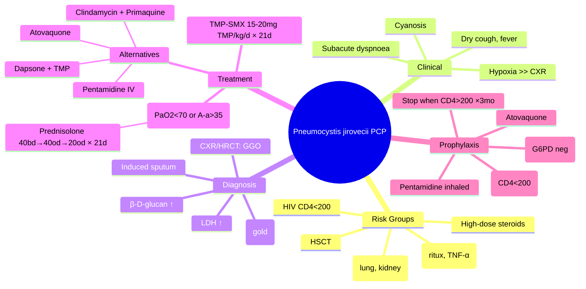

Related: [[HIV Infection and AIDS]], [[Fungal Pneumonias]], [[Infection in Immunocompromised Host (Transplant, Biologics)]], [[Cryptococcal Meningitis]], [[Toxoplasmosis]], [[Antimicrobial Prescribing Principles]]

> [!important]
> **Pneumocystis jirovecii pneumonia (PCP/PJP)** = AIDS-defining OI in HIV+ with **CD4<200**. **Subacute dyspnoea + dry cough + fever** with **hypoxia disproportionate to CXR findings** is the diagnostic signature. **TMP-SMX 15-20 mg TMP/kg/day × 21 days** is first-line treatment. **Add adjunctive prednisolone** if **PaO2<70 mmHg** or **A-a gradient>35 mmHg** (start within 72h). **β-D-glucan** elevated; **BAL IF/PCR** is gold standard (organism cannot be cultured). **Prophylaxis: TMP-SMX DS daily when CD4<200**.

## 1. Learning Objectives
- Recognise *Pneumocystis jirovecii* (atypical fungus, cannot be cultured) and its risk groups (HIV CD4<200, transplant, high-dose steroids, biologics, malignancy)
- Identify the clinical signature: subacute dyspnoea, dry cough, fever with **hypoxia disproportionate to CXR**
- Apply diagnostic algorithm: CXR (bilateral perihilar ground-glass), HRCT, β-D-glucan, induced sputum, BAL with IF/PCR
- Treat with **TMP-SMX 15-20 mg TMP/kg/day × 21 days** (PO mild, IV severe) and add **prednisolone** if PaO2<70 mmHg or A-a>35 mmHg
- Manage prophylaxis: **TMP-SMX DS daily** when CD4<200; stop when CD4>200 ×3 months on ART with suppressed VL
- Recognise alternative therapies (pentamidine, clindamycin+primaquine, atovaquone, dapsone+TMP) for TMP-SMX allergy
- Apply special situation adjustments (pregnancy, G6PD, renal failure)

## 2. Microbiology
| Feature | Details |
|---------|---------|
| **Classification** | **Atypical fungus** (lacks ergosterol in membrane) |
| **Former name** | *Pneumocystis carinii* (zoonotic misnomer) → *P. jirovecii* for human pathogen |
| **Source** | Ubiquitous; airborne; person-to-person nosocomial; reacquisition/reactivation |
| **Culture** | **Cannot be cultured** in vitro |
| **Diagnosis** | Microscopy (GMS, Giemsa, toluidine blue), direct IF, PCR; antigen (β-D-glucan) |
| **Stains** | **Gomori methenamine silver (GMS)** — cysts black; **Giemsa/toluidine blue** — intracystic bodies; **Direct IF (DFA)** — most sensitive microscopy |

## 3. Risk Groups
| Group | Threshold / Risk | Notes |
|-------|------------------|-------|
| **HIV/AIDS** | **CD4<200 cells/μL** | Peak risk CD4<100; AIDS-defining; oropharyngeal candidiasis, prior PCP |
| **Solid organ transplant** | 1-6 months post (peak immunosuppression) | Lung/kidney highest risk |
| **HSCT** | Day 30-100 (engraftment), GVHD treatment | High mortality |
| **Malignancy** | Acute leukaemia, lymphoma, chemotherapy | Prolonged neutropenia |
| **Autoimmune** | SLE, vasculitis, IBD on high-dose steroids | ≥20 mg pred >4 weeks |
| **Biologics** | Rituximab, TNF-α inhibitors, JAK inhibitors | Add to steroids |
| **Primary immunodeficiency** | CGD, SCID, X-linked agammaglobulinaemia | Children |

> [!warning]
> **High-risk combination**: HIV CD4<200 + oropharyngeal candidiasis + prior PCP episode = start prophylaxis immediately. Do not wait for repeat CD4.

## 4. Clinical Features
| Feature | Details |
|---------|---------|
| **Onset** | **Subacute** (1-2 weeks) in HIV; acute (days) in non-HIV (transplant, steroids) |
| **Symptoms** | Progressive **dyspnoea** (~90%), **dry/non-productive cough** (~90%), **fever** (~80%), malaise, weight loss |
| **Examination** | Tachypnoea, tachycardia, **cyanosis**, **fine inspiratory crackles** (often minimal) |
| **Hallmark sign** | **Hypoxia disproportionate to CXR findings** (PaO2<70 mmHg, A-a gradient>35, SpO2<95% on exertion) |
| **Extrapulmonary** (rare) | Lymphadenopathy, hepatosplenomegaly, choroiditis, thyroiditis, bone marrow |

> [!tip]
> **Exam Pearl**: "**Pneumocystis = hypoxia without CXR signs**" — HIV+ patient with severe dyspnoea + minimal CXR findings = PCP until proven otherwise.

## 5. Investigations
| Test | Findings | Notes |
|------|----------|-------|
| **ABG** | **PaO2<70 mmHg** (room air); A-a gradient **>35 mmHg**; often hypocapnia (respiratory alkalosis) | **Triggers steroids** |
| **CXR** | **Bilateral perihilar/diffuse interstitial/reticulonodular** ("bat-wing"); **ground-glass opacities (GGO)**; pneumatoceles, pneumothorax (~10%); **normal in ~10%** | Classic "bat-wing" pattern |
| **HRCT chest** | **Bilateral GGO** (sensitive); mosaic attenuation; cysts | More sensitive than CXR |
| **LDH** | **Markedly elevated** (>500 U/L); non-specific | Severity/prognosis marker |
| **β-D-glucan (BDG)** | **Elevated** (≥80 pg/mL); pan-fungal marker | Negative in Mucorales, Cryptococcus |
| **Sputum (induced)** | IF/DFA (cysts), GMS, PCR | Sensitivity 50-90% with induction |
| **BAL (bronchoalveolar lavage)** | **Gold standard**; IF/DFA, GMS, Giemsa, **PCR** | Sensitivity >90% |
| **PCP PCR (nasopharyngeal/BAL)** | High sensitivity; specificity lower (colonisation) | Quantitative threshold helps |
| **Exercise test** | SpO2 ↓≥4% on 6-min walk | Old but specific |

> [!tip]
> **Exam Pearl**: **TMP-SMX prophylaxis reduces yield** of all tests (including PCR). Do not withhold empirical therapy if clinical suspicion is high.

## 6. Diagnostic Algorithm
```
HIV+ with subacute dyspnoea + dry cough + fever
    ↓
ABG + CXR + β-D-glucan
    ↓
PaO2<70 OR A-a>35 → start TMP-SMX + steroids (do not wait for confirmation)
    ↓
Sputum induction OR BAL → IF/PCR/cytology
    ↓
PCP confirmed → continue 21-day course
PCP excluded → broaden differential (bacterial, viral, fungal, TB, atypical)
```

## 7. Management

### 7.1 First-line Therapy: TMP-SMX
| Severity | Regimen | Duration | Adjuncts |
|----------|---------|----------|----------|
| **Mild-Moderate** (PaO2 ≥70 mmHg) | **TMP-SMX 15-20 mg TMP/kg/day PO** in 3-4 divided doses | **21 days** | - |
| **Severe** (PaO2<70 or A-a>35) | **TMP-SMX 15-20 mg TMP/kg/day IV** in 3-4 divided doses | **21 days** | **Prednisolone** |

> **Key FCPS/MRCP**: Same mg/kg dose for both PO and IV. **Trimethoprim component** is the dosing reference (15-20 mg/kg/day). One DS tablet = 160/800 mg (TMP/SMX). Average adult ~70 kg → 2-3 DS tabs q6h ≈ 6-9 DS tabs/day.

### 7.2 Adjunctive Corticosteroids (Severe Disease)
**Indication**: **PaO2<70 mmHg** on room air OR **A-a gradient>35 mmHg**

| Drug | Dose | Duration |
|------|------|----------|
| **Prednisolone** | 40 mg BD × 5 days → 40 mg OD × 5 days → 20 mg OD × 11 days | **21 days total** (taper) |
| **Methylprednisolone IV** | 75% of prednisolone dose (if unable to take oral) | Same |

> [!critical]
> **Start steroids EARLY (within 72h of starting TMP-SMX)** — reduces mortality ~50% in moderate-severe PCP. **Do not taper too quickly** (3-week regimen essential).

### 7.3 Alternative Therapies (TMP-SMX Intolerance/Allergy)
| Drug | Dose | Notes |
|------|------|-------|
| **Pentamidine IV** | 4 mg/kg/day IV (max 300-600 mg) | Severe toxicities: nephrotoxicity, pancreatitis, hypo-/hyperglycaemia, QT prolongation, neutropenia |
| **Clindamycin + Primaquine** | Clindamycin 600 mg IV/PO q6h + Primaquine 30 mg base PO OD | Check **G6PD first**; haemolysis risk; synergistic |
| **Atovaquone** (mild-moderate only) | 750 mg PO BD (with fatty meal) | GI upset, rash; **avoid if diarrhoea** |
| **Dapsone + Trimethoprim** | Dapsone 100 mg PO OD + TMP 5 mg/kg PO q6h | Check **G6PD first**; haemolysis, methaemoglobinaemia |

### 7.4 Supportive Care
- **Oxygen** to maintain SpO2>92% (high-flow / CPAP often required)
- **IV fluids** cautiously (avoid overload → ARDS risk)
- **Avoid unnecessary nebulisation** (aerosolisation risk to HCWs)
- **DVT prophylaxis**
- **Monitor** for pneumothorax, ARDS, superinfection

## 8. Prophylaxis

### 8.1 Indications
| Indication | Threshold |
|------------|-----------|
| **HIV** | **CD4<200 cells/μL** (or oropharyngeal candidiasis, prior PCP, AIDS-defining illness) |
| **Transplant** | Per protocol (lung/kidney high risk) |
| **High-dose steroids** | ≥20 mg prednisolone/day >4 weeks (controversial) |
| **HSCT** | Allogeneic recipients; seropositive recipients |
| **Biologics** | Per protocol (rituximab + high-dose steroids) |

### 8.2 Regimens
| Drug | Dose | Notes |
|------|------|-------|
| **TMP-SMX (FIRST-LINE)** | **160/800 mg PO daily (DS)** OR 80/400 mg daily (SS) | **Also covers Toxo** (CD4<100 + Toxo IgG+) |
| **Dapsone** | 100 mg PO daily (or 200 mg weekly) | Check **G6PD first**; haemolysis risk |
| **Atovaquone** | 750 mg PO BD (with fatty meal) | Mild-moderate only; expensive |
| **Pentamidine (inhaled)** | 300 mg monthly via Respigard II nebuliser | **No systemic / no Toxo coverage**; pneumothorax risk |

### 8.3 Discontinuation
- **HIV**: When **CD4>200 for ≥3 months** on ART with suppressed viral load
- Restart prophylaxis if CD4 falls<200
- Continue during acute PCP treatment (secondary prophylaxis) until CD4 criteria met

## 9. Complications
| Complication | Notes |
|--------------|-------|
| **Respiratory failure / ARDS** | Most common; may require intubation + ICU |
| **Pneumothorax** | ~10%; pneumatocele rupture; worse prognosis |
| **Superinfection** | Bacterial, CMV co-infection; worsen prognosis |
| **IRIS (Immune Reconstitution)** | Within weeks of ART initiation; paradoxical worsening |
| **Drug toxicity** | TMP-SMX (rash, neutropenia, AKI, hyperkalaemia); pentamidine (pancreatitis, hypo/hyperglycaemia) |

## 10. Special Situations
| Situation | Adjustment |
|-----------|-----------|
| **Pregnancy** | TMP-SMX safe (avoid in 1st trimester if possible); prednisolone safe; **pentamidine = foetal toxicity** (avoid); avoid atovaquone (limited data) |
| **G6PD deficiency** | **Avoid dapsone, primaquine** (haemolysis) → atovaquone or pentamidine |
| **Renal failure (CrCl<30)** | Reduce TMP-SMX dose by 50%; pentamidine dose reduce |
| **Liver failure** | TMP-SMX caution (hepatotoxic); atovaquone safe |
| **Sulfa allergy** | Desensitisation to TMP-SMX preferred; otherwise pentamidine / atovaquone |
| **Transplant** | Reduce immunosuppression; drug interactions with TMP-SMX + tacrolimus (↑ levels) |

## 11. Prognosis
- **Mortality** ~10-30% in HIV-associated PCP (higher if intubated, >40%)
- **Risk factors for poor outcome**: high A-a gradient, low CD4, late presentation, no steroids, concurrent infection
- **Recovery**: clinical improvement in 4-7 days; CXR improvement in 2-3 weeks; full resolution in 4-6 weeks

## 12. FCPS/MRCP High-Yield Points
1. **Pneumocystis jirovecii = atypical fungus; cannot be cultured** (use microscopy, antigen, PCR)
2. **HIV CD4<200** = main risk group; also transplant, high-dose steroids, biologics
3. **Clinical signature**: subacute dyspnoea + dry cough + fever + **hypoxia disproportionate to CXR**
4. **CXR**: bilateral perihilar ground-glass ("bat-wing"); normal in ~10%
5. **β-D-glucan elevated** (pan-fungal marker; negative in Mucorales, Cryptococcus)
6. **BAL IF/PCR = gold standard** for diagnosis
7. **Treatment**: **TMP-SMX 15-20 mg TMP/kg/day × 21 days** (PO mild, IV severe)
8. **Steroids**: **Prednisolone 21-day taper** if **PaO2<70 mmHg** OR **A-a>35 mmHg** (start within 72h)
9. **Prophylaxis**: **TMP-SMX DS daily** when CD4<200; stop when CD4>200 ×3 months on ART with suppressed VL
10. **TMP-SMX covers both PCP (CD4<200) and Toxo (CD4<100 + IgG+)** — same drug
11. **Pentamidine IV** for severe disease; **inhaled pentamidine = prophylaxis only** (no systemic, no Toxo)
12. **LDH elevated** = severity/prognosis marker
13. **Always check G6PD** before dapsone or primaquine (haemolysis risk)
14. **TMP-SMX prophylaxis reduces yield** of all diagnostic tests; do not stop empirical treatment if clinical suspicion high
15. **PCP + ART = IRIS risk**; monitor for paradoxical worsening in first weeks

## 13. Common Viva Questions
1. What is Pneumocystis jirovecii? Why can't it be cultured?
2. HIV+ patient with CD4 150, dyspnoea, SpO2 88%, near-normal CXR. Diagnosis and next step?
3. When do you add steroids in PCP? What dose and duration?
4. Compare first-line and second-line PCP treatment options.
5. Why is dapsone contraindicated without G6PD testing?
6. Renal transplant patient on tacrolimus develops fever, dry cough, bilateral infiltrates. Differential and approach?
7. What is the role of β-D-glucan in PCP diagnosis?
8. Differentiate inhaled vs IV pentamidine.
9. When do you start PCP prophylaxis in HIV? When do you stop?
10. Sensitivity of induced sputum vs BAL for PCP diagnosis?

## 14. Common Confusions / Exam Traps
| Confusion | Clarification |
|-----------|---------------|
| **PCP prophylaxis also covers Toxo** | **Yes — TMP-SMX covers both PCP (CD4<200) and Toxo (CD4<100 + IgG+)** |
| **PCP PCR vs colonisation** | PCR very sensitive; quantitative cutoffs distinguish colonisation vs active disease; clinical correlation essential |
| **Pentamidine IV vs inhaled** | **IV**: severe systemic PCP; **inhaled**: prophylaxis only (no Toxo coverage) |
| **PCP vs bacterial pneumonia in HIV** | PCP: subacute, dry cough, **hypoxia >> CXR**, GGO, ↑LDH, ↑BDG. Bacterial: acute, purulent sputum, consolidation, leucocytosis |
| **Steroid timing in PCP** | **Start within 72h of treatment**; not after 7 days; do NOT taper quickly (3-week regimen) |
| **Stop prophylaxis when CD4>200** | **CD4>200 for ≥3 months ON ART with suppressed VL** |
| **TMP-SMX dose in PCP** | Dosed by **trimethoprim component** (15-20 mg TMP/kg/day), not SMX |
| **Pentamidine in pregnancy** | **Avoid** (foetal toxicity); use TMP-SMX or atovaquone |

## 15. Mnemonics
- **PCP Risk**: **"CD4 200"** — HIV<200, **T**ransplant, **S**teroids (>20 mg pred >4w), **B**iologics
- **Steroid Trigger**: **"70-35-21"** — PaO2<70 mmHg OR A-a>35 mmHg → Prednisolone **21-day taper** (40 BD→40 OD→20 OD)
- **TMP-SMX Dual Cover**: **"PCP + Toxo"** — same drug (CD4<200 for PCP, CD4<100 + IgG+ for Toxo)
- **Hypoxia Disproportionate**: **"Few signs, few CXR findings, BIG hypoxia"** = PCP
- **Pentamidine Routes**: **"IV = I want it systemic (treatment); Inhaled = I only want lungs (prophylaxis)"**
- **β-D-Glucan**: **Pan-fungal except PC** (Pneumocystis yes, Cryptococcus no) — actually PJP IS detected; exception is **Cryptococcus and Mucorales**

## 16. Mind Map


## 17. One-Page Revision Card
| **Pneumocystis Pneumonia (PCP)** | **Key Facts** |
|----------------------------------|---------------|
| **Organism** | *P. jirovecii* (atypical fungus; cannot be cultured) |
| **Risk** | **HIV CD4<200**; transplant, steroids, biologics |
| **Clinical** | Subacute dyspnoea, dry cough, fever; **hypoxia disproportionate to CXR** |
| **CXR** | **Bilateral perihilar GGO** ("bat-wing"); normal in ~10% |
| **LDH / BDG** | LDH ↑; **β-D-glucan elevated** |
| **Diagnosis** | **BAL IF/PCR** (gold); induced sputum |
| **Treatment** | **TMP-SMX 15-20 mg TMP/kg/day × 21 days** (PO mild / IV severe) |
| **Steroids** | **Prednisolone 21-day taper** if **PaO2<70** or **A-a>35** (start<72h) |
| **Prophylaxis** | **TMP-SMX DS daily** when CD4<200; stop when CD4>200 ×3 months on ART |
| **TMP-SMX** | Also covers Toxo (CD4<100 + IgG+) |
| **Dapsone / Primaquine** | Check G6PD first (haemolysis) |
| **Pentamidine IV** | Treatment of severe disease; pentamidine inhaled = prophylaxis only |
| **Mortality** | 10-30% (HIV); >40% if intubated |

## 18. Self-Test Scorecard
| Topic | Score (1-5) | Notes |
|-------|-------------|-------|
| Risk groups & CD4 threshold | | |
| Clinical features (hypoxia vs CXR) | | |
| Diagnostic approach (BAL, β-D-glucan) | | |
| First-line treatment (TMP-SMX, 21 days) | | |
| Steroid indications & dosing | | |
| Alternative therapies (Pentamidine, Clinda+Primaquine) | | |
| Prophylaxis (indications, agents, discontinuation) | | |
| G6PD testing before dapsone/primaquine | | |
| TMP-SMX dual cover (PCP + Toxo) | | |
| Pentamidine IV vs inhaled | | |

---

**Status**: Full FCPS/MRCP topic note — Davidson Ch 14 Infectious Disease
**Last Updated**: 2026-06-20 | **Source**: Davidson 24e Ch 11 / 25e Ch 14 | **FCPS/MRCP Focused**
